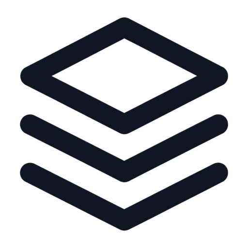
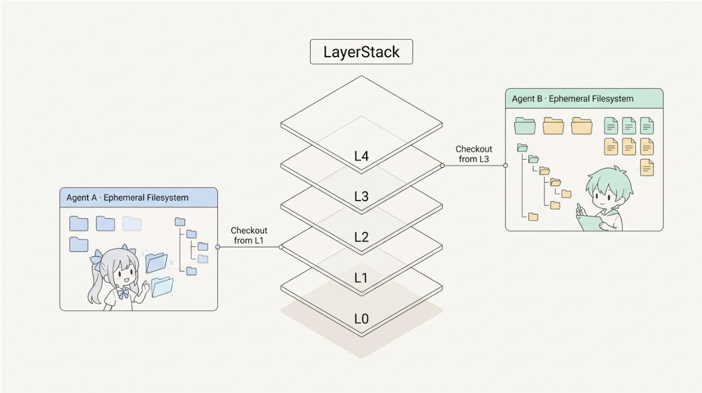

<p align="center">
  
</p>

<h1 align="center">LayerFS</h1>

<p align="center"><strong>Ephemeral Workspaces. Durable Shared History.</strong></p>

<p align="center">
  <a href="https://github.com/Ephemeral-AI-Lab/layerfs/actions/workflows/ci.yml"></a>
  <a href="LICENSE"></a>
  <a href="release-notes/0.1.0/README.md"></a>
  <a href="docs/assets/community/wechat-ephemeral-ai-lab.jpg"></a>
  <a href="https://discord.gg/DrgJ4DX9E"></a>
  <a href="https://x.com/yifanxu_ephai"></a>
</p>


## 🚀 What is LayerFS?

### Ephemeral Workspaces. Durable Shared History.

LayerFS is a **SQLite-backed, content-addressed time machine for agent
Workspaces**. Give every filesystem-affecting tool call its own ephemeral
Workspace; when retained, that call becomes one immutable Commit—the base unit
of the filesystem timeline. CAS, CDC, and COW store one shared base plus unique
deltas instead of cloning full environments. From any Layer or eligible Commit,
agents can fork zero-copy Branches, run parallel rollouts, discard failures,
roll back by forking an earlier state, and promote a winning Branch with `Add`.
The filesystem remains load-bearing for recursive multi-agent exploration
without multiplying storage.

> [!WARNING]
> LayerFS 0.1.0 is a Developer Preview. It is intended
> for local evaluation, agent-runtime integration, and performance research—not
> production storage. It does not provide crash- or power-loss-durability
> guarantees. Keep an independent copy of important data.

## 🧱 LayerStack storage model

### ⚙️ Core storage mechanisms

CAS, CDC, and COW make LayerStack history storage-efficient by reusing
unchanged objects, file regions, and filesystem structure.

The governing invariant is simple: every filesystem state is complete
logically, but incremental physically. A new state should cost what changed,
not the size of the Workspace it exposes. Read the
[CAS + CDC + COW foundations](https://learn.layerfs.ai/chapters/01-cas-and-cdc/)
for the design rationale and step-by-step storage model.

| **🔐 01 · Identity** | **📍 02 · Byte locality** | **🌳 03 · Structural locality** |
| --- | --- | --- |
| **Content-addressed storage** — Names immutable objects from their canonical bytes, verifies reads, and reuses exact duplicates across files, LayerStacks, and agents. | **Content-defined chunking** — Keeps chunk boundaries stable around localized edits, so changing a small region does not require storing an entirely new large file. | **Copy-on-write** — Rebuilds only the changed file and directory path when publishing a new Commit, preserving unchanged subtrees; a Branch head can then be added as the next Layer. |

### 🗃️ Check out an ephemeral filesystem from any layer

A LayerStack records complete filesystem checkpoints. Agent A can start from L1
while Agent B independently starts from L3. Each gets a private place to work
while the selected history remains shared.

This is the conceptual checkout view; the public lifecycle is
`Layer` or `Commit` → `Branch` → `Workspace`.

<p align="left">
  
</p>

*One LayerStack, many zero-copy Branches, and ephemeral COW Workspaces sharing
immutable history.*

### 📦 Measured deduplication

The primary storage signal is semantic content growth: the canonical bytes
needed by a new state. SQLite page allocation is reported separately because
existing database pages can absorb new objects without changing the logical
content represented by the Store.

| Workload | LayerFS semantic growth |
| --- | ---: |
| Sixteen deterministic edits | **0.2250 MiB** |
| Prepend 10 bytes to 32 MiB | **0.0256 MiB** |

These measurements come from the final public-SDK, real-FUSE campaign. See the
[full benchmark report](release-notes/0.1.0/benchmark-results.md) for physical
allocation, equations, source identity, and raw evidence.

---

## 🧭 System boundaries

### 🧩 LayerFS components

The storage engine, SDK, CLI, and filesystem projection are implemented in the
0.1.0 Developer Preview. They remain separate public boundaries so callers do
not depend on private CAS handles or storage formats.

| **Status** | **Component** | **Role** |
| --- | --- | --- |
| **Implemented core** | **Storage** | Owns identities, canonical objects, CDC, file manifests, structural COW, immutable CAS admission, lifecycle coordination, and verified reads. |
| **Implemented preview** | **SDK and CLI** | Expose filesystem, Workspace, LayerStack, Branch, Commit, publication, query, monitoring, and container-lifecycle operations through the public surfaces. |
| **Implemented preview** | **Filesystem projection** | Exposes a Workspace through host materialization or real container FUSE and captures bounded filesystem effects while delegating identity, CDC, COW, and admission to storage. |
| **Implemented preview** | **Container runtime** | Creates and controls resource-bounded Linux FUSE containers for Workspaces without placing the durable Store inside the container. |

The one-Store boundary is intentional: a `Client` binds one SQLite Store, one
Monitor, and one Workspace manager. A second Store uses a separate `Client`.

Each `workspace exec` starts a fresh process. `commit` publishes the Workspace state to its Branch. `end` removes the ephemeral projection and never commits implicitly.

## 🛠️ Quickstart

The current release is built from source. You need **macOS or Linux** and **Rust 1.85 or newer**. Docker, `/dev/fuse`, and `CAP_SYS_ADMIN` are needed only for managed container-FUSE workspaces. Packages are not published to crates.io in 0.1.0.

From the repository root:

```bash
git clone https://github.com/Ephemeral-AI-Lab/layerfs.git
cd layerfs

cargo build --release -p layerfs-cli
export LAYERFS_BIN="$PWD/target/release/layerfs"
export LAYERFS_CONTEXT="$PWD/.layerfs/context"
mkdir -p "$PWD/.layerfs"

"$LAYERFS_BIN" db create "$PWD/.layerfs/store.sqlite"
"$LAYERFS_BIN" context use --store "$PWD/.layerfs/store.sqlite"
"$LAYERFS_BIN" layerstack init --name demo --empty
"$LAYERFS_BIN" query layerstacks
```

This creates a SQLite Store and an empty LayerStack with a genesis Layer. Continue with the [complete quickstart](docs/versioned/0.1.0/quickstart.md) for Branch creation, Workspace execution, commits, cleanup, directory imports, managed containers, and real FUSE.

When importing an existing directory, keep the Store file **outside** the directory being imported or projected:

```bash
mkdir -p "$PWD/import-root"
printf 'hello\n' > "$PWD/import-root/hello.txt"
"$LAYERFS_BIN" layerstack init --name imported "$PWD/import-root"
```

## 🗂️ Repository layout

```text
crates/
├── layerfs-content           content-addressed objects, chunking, extents, trees
├── layerfs-layerstack-store  SQLite schema, history, identities, object admission
├── layerfs-workspace         ephemeral workspaces, capture, execution, containers
├── layerfs-materialization   directory materialization and capture
├── layerfs-fuse              Linux FUSE and host/proxy adapters
├── layerfs-daemon            authenticated container mount/execution protocol
├── layerfs-monitor           receipts, timings, snapshots, dedup analysis
├── layerfs-sdk               public Rust client and value types
└── layerfs-cli               `layerfs` command-line interface

tools/layerfs-eval             Store and Branch integrity evaluator
benchmark/                     filesystem and end-to-end benchmarks
containers/layerfs-fuse        managed Linux FUSE runtime image
docs/versioned/0.1.0          current versioned product manual
release-notes/0.1.0            release contract, evidence, and limitations
docs/versioned/0.1.1          release-candidate manual (not published)
release-notes/0.1.1            release-candidate record (not published)
```

## ⚠️ Current limitations

LayerFS is suitable for evaluation and integration work, but the preview boundary matters:

- 0.1.0 operates against one Store per Client; there is no cross-host synchronization;
- live-process transaction visibility does not imply crash or power-loss durability;
- the SDK is consumed from this repository; there is no published crates.io package or default runtime image;
- managed FUSE requires Docker, `/dev/fuse`, and `CAP_SYS_ADMIN`;
- the managed container is not a complete hostile-code security boundary;
- the detached CLI context owner does not forward an interactive PTY; and
- CLI JSON output is a preview text envelope, not a stable machine API.

Read the full [limitations](docs/versioned/0.1.0/limitations.md) before using LayerFS with important data.

## 📚 Documentation

Start with the [documentation index](docs/README.md), or jump directly to a focused guide:

| Goal | Guide |
| --- | --- |
| Learn the concepts | [Core concepts](docs/general/concepts.md) |
| Run the CLI and SDK | [Quickstart](docs/versioned/0.1.0/quickstart.md) |
| Find a CLI command | [CLI reference](docs/versioned/0.1.0/cli.md) |
| Integrate with Rust | [Rust SDK reference](docs/versioned/0.1.0/sdk.md) |
| Configure container FUSE | [Container runtime](docs/versioned/0.1.0/container-runtime.md) |
| Understand storage | [Storage format](docs/versioned/0.1.0/storage-format.md) |
| Review performance evidence | [Benchmark results](release-notes/0.1.0/benchmark-results.md) |
| Review the 0.1.1 candidate | [Release-candidate record](release-notes/0.1.1/README.md) |
| Contribute changes | [0.1.x development guide](docs/roadmap/0.1/development.md) |

The [first-principles learning site](https://learn.layerfs.ai/) is educational material and may describe future work. The versioned repository manual defines the current product contract.

## 🗺️ Roadmap

| Stage | Focus | Status |
| --- | --- | --- |
| **0.1.0 Developer Preview** | One SQLite Store, immutable LayerStack history, Branches, Workspaces, public SDK/CLI, host materialization, container FUSE, monitoring, and benchmark evidence. | **Released** as source under `v0.1.0`. |
| **0.1.1** | Measure and harden existing-directory initialization through localized Commit, with focused FUSE and Docker proof. | **Release-candidate preparation**; terminal benchmark gates pass and publication identity remains pending in the [candidate record](release-notes/0.1.1/README.md). |
| **0.1.2** | Complete admitted prepend, range-copy, fragmented-write, sparse-growth, and mixed-edit optimization against the same FUSE/Docker path. | **Proposed**; see the [proposal set](docs/roadmap/0.1/0.1.2/README.md). |
| **0.1.3** | Complete diverse, tiered filesystem-workload families against one genesis Layer and one Branch, then optimize measured bottlenecks. | **Draft**; see the [release README](docs/roadmap/0.1/0.1.3/README.md). |
| **0.1.4** | Benchmark multi-Layer and multi-Branch Commit history, Fork, Add, Diff, conflict, and query scaling, then optimize measured bottlenecks. | **Draft**; see the [release README](docs/roadmap/0.1/0.1.4/README.md). |
| **0.2.0** | Establish a portable projection foundation, including capability-detected reflink/clonefile paths and a future OverlayFS projection. | **Planned**; requires a new compatibility contract. |
| **Later** | Add platform/runtime expansion and verified Store export, import, and synchronization. | **Research**; no cross-host synchronization is part of 0.1.0. |

See the [roadmap checklist](docs/roadmap/README.md) and
[roadmap architecture notes](docs/roadmap/architecture.md) for acceptance gates,
ownership boundaries, and sequencing. Use the [Rust SDK reference](docs/versioned/0.1.0/sdk.md)
to integrate the current public SDK.

## 🤝 Contributing

Bug reports, reproducible performance evidence, documentation corrections, and focused pull requests are welcome. Before opening a change, review the [0.1.x development guide](docs/roadmap/0.1/development.md) and run the repository’s relevant verification commands.

## 💬 Community

- WeChat: scan the [Ephemeral AI Lab group QR code](docs/assets/community/wechat-ephemeral-ai-lab.jpg). The invitation is time-limited; refresh the image when it expires.
- Discord: [join the Ephemeral AI Lab community](https://discord.gg/DrgJ4DX9E).
- 𝕏: [@yifanxu_ephai](https://x.com/yifanxu_ephai).

<p align="center">
  
</p>

## 📄 License

LayerFS is licensed under the [MIT License](LICENSE).
