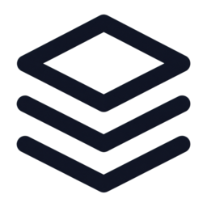

<p align="center">
  
</p>

<h1 align="center">LayerFS</h1>

<p align="center"><strong>Filesystem Storage for Parallel AI Agents</strong></p>

<p align="center">
  <a href="https://ephemeral-ai-lab.github.io/layerfs/">Read the book</a>
  ·
  <a href="LICENSE">MIT License</a>
</p>

LayerFS stores filesystem history as immutable LayerStacks. An agent can check
out an ephemeral filesystem from any layer, work in isolation, and publish its
changes as new copy-on-write layers. Branching does not duplicate unchanged
stored content or directory structure.

## Core storage mechanisms

- **Content-addressed storage** gives immutable content a stable identity and
  reuses exact duplicates.
- **Content-defined chunking** preserves byte reuse around localized file
  edits.
- **Copy-on-write** creates a new layer while sharing unchanged filesystem
  structure with its parent.

## Components

- `layerfs-storage` — identities, canonical objects, CDC, file manifests,
  structural COW, packs, immutable CAS admission, lifecycle coordination, and
  verified reads.
- `layerfs-sdk` — the public LayerFS API boundary.
- `layerfs-driver` — filesystem projection and capture.

The storage engine is the implemented core. The stable SDK and filesystem
projection remain planned boundaries around it.

## Collaborating projects

- [Ephemeral Sandbox](https://github.com/Ephemeral-AI-Lab/ephemeral-sandbox) —
  isolated execution environments for parallel agents.
- [DeltaGit](https://github.com/Ephemeral-AI-Lab/deltagit) — version control for
  work in motion.

Future collaborators building agent runtimes, sandboxes, filesystem tools, or
version-control workflows are welcome to open an issue or discussion.

## Build and test

```sh
cargo fmt --all -- --check
cargo check --workspace
cargo test --workspace
```

## Documentation

Read [LayerFS: Filesystem Storage for Parallel AI Agents](https://ephemeral-ai-lab.github.io/layerfs/)
to follow the storage design from CAS and CDC through copy-on-write LayerStacks.

## License

LayerFS is available under the [MIT License](LICENSE).
