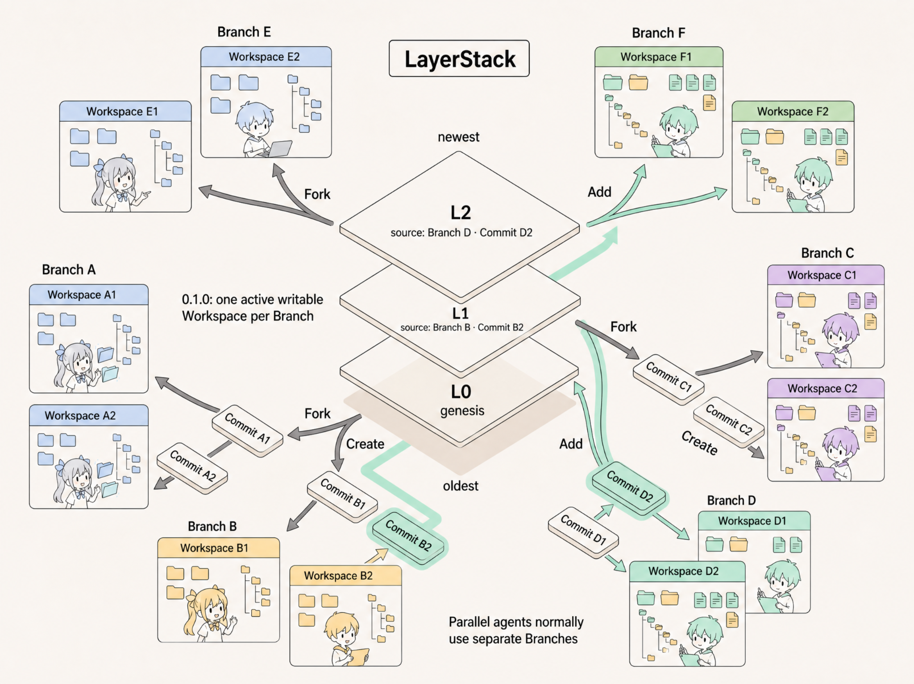

<p align="center">
  
</p>

<h1 align="center">LayerFS</h1>

<p align="center"><strong>Branchable, content-addressed workspaces for local AI-agent workloads.</strong></p>

<p align="center">
  <a href="https://github.com/Ephemeral-AI-Lab/layerfs/actions/workflows/ci.yml"></a>
  <a href="LICENSE"></a>
  <a href="release-notes/0.1.0/README.md"></a>
</p>

<p align="center">
  
</p>

## 🚀 What is LayerFS?

LayerFS is a **local filesystem storage engine** for creating disposable workspaces over shared, immutable history. Agents work in ordinary filesystems, keep their changes isolated, and publish useful results as deduplicated commits that can be branched, inspected, compared, or promoted into a new layer.

LayerFS provides storage, workspace, execution, and history primitives. It is **not** an agent framework, cloud orchestration service, or hardened security sandbox.

> [!WARNING]
> LayerFS 0.1.0 is a developer preview and release candidate. It is intended for local evaluation, agent-runtime integration, and performance research—not production storage. It does not provide crash- or power-loss-durability guarantees. Keep an independent copy of important data.

## 💡 Why LayerFS?

Traditional copies of an agent workspace duplicate unchanged bytes and directory structure. LayerFS stores immutable content once and creates new state by reusing everything that did not change.

| Mechanism | Benefit |
| --- | --- |
| **Content-addressed storage** | Immutable objects are named by their canonical bytes, verified on read, and reused when identical. |
| **Content-defined chunking** | Localized edits can reuse surrounding file content instead of rewriting an entire large file. |
| **Copy-on-write trees** | New filesystem states rebuild only changed files and directory paths while reusing unchanged subtrees. |
| **Branches and layers** | Alternate states are cheap to create, inspect, compare, and promote. |

## 🧠 The LayerStack mental model

A single local SQLite **Store** contains durable history and canonical objects. A **LayerStack** is an ordered sequence of immutable **Layers**: the newest Layer is at the top and the genesis Layer is at the bottom.

Each Layer can fork multiple **Branches**. Each Branch can create multiple ephemeral **Workspaces**. A Workspace can be committed back to its Branch; the Branch head can then be promoted with `Add` into a new Layer.

```text
                                      LayerStack
                              newest Layer at the top
                                      oldest at bottom

                              ┌────────────────────────┐
                              │ L2                     │
                              │ from Branch D @ D2     │
                              ├────────────────────────┤
                              │ L1                     │
                              │ from Branch B @ B2     │
                              ├────────────────────────┤
                              │ L0  genesis            │
                              └────────────────────────┘

L2 ──┬── fork ──▶ Branch E ──┬── create ──▶ Workspace E1
     │                       └── create ──▶ Workspace E2
     │
     └── fork ──▶ Branch F ──┬── create ──▶ Workspace F1
                             └── create ──▶ Workspace F2

L1 ──┬── fork ──▶ Branch C ──┬── create ──▶ Workspace C1
     │                       └── create ──▶ Workspace C2
     │
     └── fork ──▶ Branch D ──┬── create ──▶ Workspace D1
                             └── create ──▶ Workspace D2
                                                   │
                                                   └── commit ──▶ Commit D2
                                                                    │
                                                                    └── Add ──▶ L2

L0 ──┬── fork ──▶ Branch A ──┬── create ──▶ Workspace A1
     │                       └── create ──▶ Workspace A2
     │
     └── fork ──▶ Branch B ──┬── create ──▶ Workspace B1
                             └── create ──▶ Workspace B2
                                                   │
                                                   └── commit ──▶ Commit B2
                                                                    │
                                                                    └── Add ──▶ L1
```

| Concept | Lifetime | Meaning |
| --- | --- | --- |
| **LayerStack** | Durable | The ordered history of immutable filesystem checkpoints. |
| **Layer** | Durable | A checkpoint created by adding a Branch-head commit to a LayerStack. |
| **Branch** | Durable | A named line of work rooted at a Layer or Commit. |
| **Commit** | Durable | An immutable snapshot of a Workspace’s filesystem state. |
| **Workspace** | Ephemeral | A private copy-on-write environment projected onto a host directory or through container FUSE. |
| **Client** | Process-bound | Binds one Store, one monitor, and one workspace manager. |

In short:

```text
Layer → fork Branch → create Workspace → execute → commit → Add → new Layer
                                      └────────────── discard / end
```

Each `workspace exec` starts a fresh process. `commit` publishes the Workspace state to its Branch. `end` removes the ephemeral projection and never commits implicitly.

## 🛠️ Quickstart

The current release is built from source. You need **macOS or Linux** and **Rust 1.85 or newer**. Docker, `/dev/fuse`, and `CAP_SYS_ADMIN` are needed only for managed container-FUSE workspaces. Packages are not published to crates.io in 0.1.0.

From the repository root:

```bash
git clone https://github.com/Ephemeral-AI-Lab/layerfs.git
cd layerfs

cargo build --release -p layerfs-cli
export LAYERFS_BIN="$PWD/target/release/layerfs"
export LAYERFS_CONTEXT="$PWD/.layerfs/context"
mkdir -p "$PWD/.layerfs"

"$LAYERFS_BIN" db create "$PWD/.layerfs/store.sqlite"
"$LAYERFS_BIN" context use --store "$PWD/.layerfs/store.sqlite"
"$LAYERFS_BIN" layerstack init --name demo --empty
"$LAYERFS_BIN" query layerstacks
```

This creates a local Store and an empty LayerStack with a genesis Layer. Continue with the [complete quickstart](docs/versioned/0.1.0/quickstart.md) for Branch creation, Workspace execution, commits, cleanup, directory imports, managed containers, and real FUSE.

When importing an existing directory, keep the Store file **outside** the directory being imported or projected:

```bash
mkdir -p "$PWD/import-root"
printf 'hello\n' > "$PWD/import-root/hello.txt"
"$LAYERFS_BIN" layerstack init --name imported "$PWD/import-root"
```

## ✨ What is included?

The 0.1.0 public surface includes:

- initializing a LayerStack from an empty root or an existing directory;
- creating named Branches from a Layer or Commit;
- creating host-materialized and container-FUSE Workspaces;
- executing fresh processes with bounded output streaming;
- explicitly committing, discarding, and ending Workspaces;
- adding a Branch head as an immutable Layer;
- querying history, supported diffs, and stale-workspace reconciliation;
- monitoring operation receipts, database snapshots, and deduplication; and
- managing resource-bounded runtime containers.

### Rust SDK

The CLI and benchmarks use the public Rust SDK, which is currently consumed from this repository:

```toml
[dependencies]
layerfs-sdk = { path = "/absolute/path/to/layerfs/crates/layerfs-sdk" }
```

```rust
use layerfs_sdk::{Client, LayerStackStore};
use std::sync::Arc;

let store = Arc::new(LayerStackStore::create(".layerfs/store.sqlite")?);
let client = Client::connect(store)?;
```

See the [Rust SDK reference](docs/versioned/0.1.0/sdk.md) for a complete lifecycle example and API details.

## 🗂️ Repository layout

```text
crates/
├── layerfs-content           content-addressed objects, chunking, extents, trees
├── layerfs-layerstack-store  SQLite schema, history, identities, object admission
├── layerfs-workspace         ephemeral workspaces, capture, execution, containers
├── layerfs-materialization   directory materialization and capture
├── layerfs-fuse              Linux FUSE and host/proxy adapters
├── layerfs-daemon            authenticated container mount/execution protocol
├── layerfs-monitor           receipts, timings, snapshots, dedup analysis
├── layerfs-sdk               public Rust client and value types
└── layerfs-cli               `layerfs` command-line interface

tools/layerfs-eval             Store and Branch integrity evaluator
benchmark/                     filesystem and end-to-end benchmarks
containers/layerfs-fuse        managed Linux FUSE runtime image
docs/versioned/0.1.0          current versioned product manual
release-notes/0.1.0            release contract, evidence, and limitations
```

## ⚠️ Current limitations

LayerFS is suitable for evaluation and integration work, but the preview boundary matters:

- operation is local to one Store; there is no cross-host synchronization;
- live-process transaction visibility does not imply crash or power-loss durability;
- the SDK is consumed from this repository; there is no published crates.io package or default runtime image;
- managed FUSE requires Docker, `/dev/fuse`, and `CAP_SYS_ADMIN`;
- the managed container is not a complete hostile-code security boundary;
- the detached CLI context owner does not forward an interactive PTY; and
- CLI JSON output is a preview text envelope, not a stable machine API.

Read the full [limitations](docs/versioned/0.1.0/limitations.md) before using LayerFS with important data.

## 📚 Documentation

Start with the [documentation index](docs/index.md), or jump directly to a focused guide:

| Goal | Guide |
| --- | --- |
| Learn the concepts | [Core concepts](docs/general/concepts.md) |
| Run the CLI and SDK | [Quickstart](docs/versioned/0.1.0/quickstart.md) |
| Find a CLI command | [CLI reference](docs/versioned/0.1.0/cli.md) |
| Integrate with Rust | [Rust SDK reference](docs/versioned/0.1.0/sdk.md) |
| Configure container FUSE | [Container runtime](docs/versioned/0.1.0/container-runtime.md) |
| Understand storage | [Storage format](docs/versioned/0.1.0/storage-format.md) |
| Review performance evidence | [Benchmark results](release-notes/0.1.0/benchmark-results.md) |
| Contribute changes | [Development guide](docs/general/development.md) |

The [first-principles learning site](https://learn.layerfs.ai/) is educational material and may describe future work. The versioned repository manual defines the current product contract.

## 🤝 Related projects

LayerFS provides storage mechanics for a broader agent-workflow stack:

| Project | Focus |
| --- | --- |
| [AgentsGit](https://github.com/Ephemeral-AI-Lab/agentsgit) | Version control for agent work in motion: checkpoint, branch, compare, recover, and promote. |
| [Ephemeral Sandbox](https://github.com/Ephemeral-AI-Lab/ephemeral-sandbox) | Isolated execution environments for parallel agents. |

## 🤝 Contributing

Bug reports, reproducible performance evidence, documentation corrections, and focused pull requests are welcome. Before opening a change, review the [development guide](docs/general/development.md) and run the repository’s relevant verification commands.

## 📄 License

LayerFS is licensed under the [MIT License](LICENSE).
