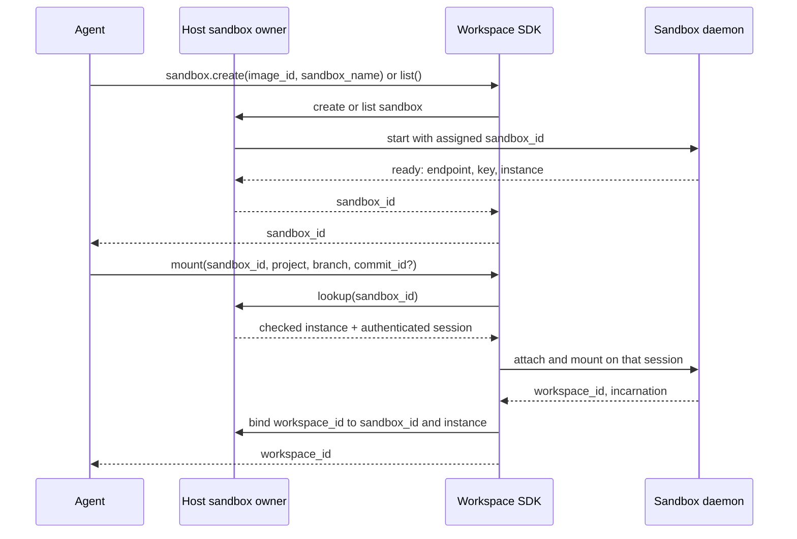

# Agent SDK implementation plan

> **Status:** Proposal; target LayerFS v0.1.7; not a released contract.
> **Source reviewed:** `9dc659f23fce40dfbb31986dc96ad1c65427b9ec`.

Implementation worktree base: `13773c5896c30c19047bdfabced4aa25efb27034`,
a descendant of the reviewed source. The reviewed-source pin describes this
proposal's historical review and is not a claim that the implementation or
existing Init receipts were produced from the worktree base.

Implementation refinement: Docker may republish a different host control port
when a container restarts. The host owner keeps the container ID, daemon key,
and instance, resolves the current port on each checked lookup, and reports a
stale binding when a new daemon instance answers. Selected-Commit mount also
carries the expected instance in its authenticated request, closing the race
between lookup and attach.

This is the follow-on design for the agent SDK after #236's working Project Init.
Production Rust belongs under `core/crates/`; this document is the reviewable
implementation plan. The existing #236 Init receipts keep their original API,
route, and source identities.

## Agent API

| Operation | Inputs | Result and meaning |
| --- | --- | --- |
| `project.init` | `name, path` | The existing host-direct import returns a Project ID and published genesis. `path` is visible to the host Service. |
| `sandbox.create` | `image_id, sandbox_name` | Ask the host sandbox owner to create/start one sandbox and await authenticated, control-ready daemon readiness. `image_id` is an immutable image digest; `sandbox_name` is a caller label, not the ID. Return the assigned `sandbox_id`. The owner has one configured resource/security profile; no per-call Docker flags or implicit Workspace mount. |
| `sandbox.list` | none | List the caller's available sandbox IDs and status for resume. Daemon endpoint/key lookup stays internal. |
| `workspace.mount` | `sandbox_id, project, branch, commit_id?` | Route to that sandbox's daemon; return a Workspace ID and execution location after attaching and mounting the selected filesystem. No options object. An omitted `commit_id` selects the branch head; a supplied ID selects that exact immutable Commit, including an older Commit. |
| `workspace.exec` | `workspace_id, command` | Run a shell command with the mount as working directory. Return exit status and bounded stdout/stderr. File mutations enter through FUSE. No implicit Commit. |
| `workspace.commit` | `workspace_id` | Explicitly capture and publish changes. Return committed/up-to-date or the typed failure, including unknown and retained state. |
| `workspace.unmount` | `workspace_id` | Detach the mount and retain any dirty Workspace state. No implicit Commit or discard. |

`SandboxId` is an opaque identifier for one sandbox/container lifetime. Reuse
the host sandbox service's ID if it has one; otherwise the host owner generates
a random 128-bit ID at sandbox creation and exposes it as 32 lowercase hex
digits. Replacement containers receive new IDs. Neither a Docker ID, daemon
PID, port, nor Workspace ID is the public `sandbox_id`.

The host sandbox owner assigns `sandbox_id` before the daemon starts and records
`sandbox_id` → runtime container ID, daemon control endpoint, authenticated
daemon public key, and daemon instance. It passes the assigned ID at trusted
daemon launch; the control response reports that ID and the daemon instance,
and the SDK checks them against the host record after authenticating the peer.
The ID routes calls but grants no authority by itself. A daemon restart keeps
the sandbox ID but changes the daemon instance and invalidates old Workspace
bindings. The current daemon exposes one selected Workspace; sandbox and
Workspace identities remain distinct. The SDK does not create the container
as a side effect of `mount`.

The agent obtains `sandbox_id` from `sandbox.create`, `sandbox.list`, or task
context. The thin SDK sandbox calls delegate to the host sandbox owner. Before
`mount`, the SDK performs one checked owner lookup for the daemon
endpoint/key/instance. The checked lookup returns the authenticated control
session after Hello, so Mount uses that session for Open with the next request
ID. Later Workspace calls follow the same checked route. Core currently has no
sandbox directory. Reuse the
caller's sandbox service if it exists; otherwise the host executor needs one
concrete ID-to-daemon registry. Do not add a generic manager trait or make the
storage/history Service own containers.

Every Workspace call names its ID; `mount` returns that ID. The host owner
records Workspace ID → sandbox ID and incarnation, so later `exec`, `commit`,
and `unmount` calls route to the same daemon and reject a stale incarnation.
A bare Workspace ID without that checked lookup does not identify a daemon
endpoint. A selected Commit must belong to the Project. Mounting an older
Commit does not move the named
Branch. A later Commit must preserve the history owner's branch conflict rules:
it cannot silently replace a newer head. `unmount` does not stand in for the
existing clean-close operation; the owner retains the Workspace until an
explicit clean close is possible.

`ProjectApi` owns the existing authorized host Service binding;
`WorkspaceApi` uses the sandbox owner's authenticated daemon-control binding.
`SandboxApi` delegates to that owner. These are the three public domain
handles behind `project.*`, `sandbox.*`, and `workspace.*`.
Execution limits and the sandbox resolver are configured when those handles
are created, not supplied as a `mount` options object. No process-global
implicit authority or generic public `Client` is needed.

## Source ownership

| Package/file | Work |
| --- | --- |
| `layerfs-sandbox/src/{owner,docker,readiness}.rs` (new package, if no existing sandbox owner is reused) | Allocate or accept `sandbox_id`, create/list sandboxes, launch and inspect the container/daemon, and maintain checked sandbox and Workspace routing records. This is a host application adapter outside C1/C2/C5 and the SDK. |
| `layerfs-api/core/src/project.rs` | Keep the Project result and error vocabulary. Remove the misleading unsupported Workspace methods when the real surface replaces them. |
| `layerfs-api/core/src/sandbox.rs` (new) | Public Sandbox ID, name, and status types; no container runtime code. |
| `layerfs-api/core/src/workspace.rs` (new) | Workspace ID and typed mount, execution, Commit, and unmount results. No transport or process logic. |
| `layerfs-api/sdk/src/project.rs` (new) | Move the current `Client::init_project` delegation here as `project.init`; keep the existing authorized Service import route. |
| `layerfs-api/sdk/src/sandbox.rs` (new) | Thin `create` and `list` delegation to the host sandbox owner; internal checked lookup for Workspace routing. No Docker CLI or container setup algorithm. |
| `layerfs-api/sdk/src/workspace.rs` (new) | Resolve `sandbox_id` through the host owner's registry, then make thin authenticated calls for mount, exec, commit, and unmount; validate response identity and preserve typed failures. |
| `layerfs-api/sdk/src/lib.rs` | Export the Project and Workspace API; keep declarations and delegation only. |
| `layerfs-bridge/src/contract/{control,request,outcome}.rs` and `adapters/native/protocol/{metadata,control,response}.rs` | Extend existing authenticated request, result, and codec dispatch for selected-Commit mount and bounded Exec. Reuse framing and failure types. `request.rs` is already near the 999-line limit, so move Workspace-specific validation into a focused file before exceeding it. |
| `layerfs-bridge/src/contract/execution.rs` and `adapters/native/protocol/execution.rs` (new) | Own only the bounded Exec request/result shape and codec. Extend `adapters/native/client.rs` to match replies to the exact request identity. |
| `layerfs-daemon/src/{config,run,control,lifecycle}.rs` | Bind the assigned sandbox identity; start control-ready without an attached Workspace; authorize and dispatch Attach/Mount/Exec/Commit/Unmount by exact Workspace ID/incarnation. Reuse existing Commit and Unmount ownership. |
| `layerfs-daemon/src/execution.rs` (new) | Own command launch in the mount, deadline/cancellation, exit status, and bounded output. |
| `layerfs-workspace/src/{types.rs,runtime/host.rs,runtime/state.rs,commit/save.rs,commit/completion.rs}` | Carry the selected Commit through writable attachment, resolve its exact root, and preserve Branch/Commit context through publication and conflict handling. |

The current SDK `Client` is a borrowed host Service/peer/Store binding; `Host`
constructs a fresh local Store and history authority for Init. They are
compatibility entry points for existing #236 tests and benchmark drivers during
migration. The agent surface is Project and Workspace. Do not add Workspace
behavior to `Host` or introduce a second wire codec. Migrate active callers
before removing either existing export; historical receipts remain unchanged.

The SDK size target is **about 40–60 production LOC in `project.rs`, 40–80 in
`sandbox.rs`, 100–150 in `workspace.rs`, and fewer than 20 in `lib.rs`**: roughly
200–310 production LOC after the current compatibility exports are retired.
The host sandbox package is a separate rough 500–900 LOC planning allowance;
bridge, daemon and Workspace changes have their own owners. These are review
targets, not reasons to omit validation or failure information. Process
supervision belongs in the daemon; container deployment belongs in the host
sandbox package; protocol work belongs in the bridge; checkout/Commit semantics
belong in Workspace and history.

| Production package | Current LOC at source reviewed | Planned change (estimate) |
| --- | ---: | ---: |
| `layerfs-api-core` | 50 | +50–120 |
| `layerfs-sdk` | 90 | final total about 200–310 after compatibility removal |
| `layerfs-sandbox` | 0 | +500–900 if implemented here |
| `layerfs-bridge` | 5,603 | +250–450 |
| `layerfs-daemon` | 1,364 | +250–500 |
| `layerfs-workspace` | 14,562 | +100–250 |

Current numbers use `python3 tools/production_loc.py --root . --files` at the
source pin above; proposed changes are allowances, not measured or admission
gates. Other Core packages have no planned SDK-specific change. The 999-line
production-file and 200-line `lib.rs`/`mod.rs` ceilings still apply.

## Implementation and proof order

1. Move the existing Project Init delegation into `sdk/src/project.rs` without
   changing its route or results. Keep its current public callers working until
   the SDK benchmark driver is migrated under a new identity.
2. Extend mount's authenticated control input with Project, Branch, and the
   optional Commit ID. The daemon's current startup profile fixes the base and
   starts by attaching and mounting; its `WorkspaceMount` control only remounts
   an attached Workspace. Add a control-ready idle launch for `sandbox.create`,
   then let `workspace.mount` attach and mount exactly once. Verify current-head and older-Commit
   checkout against reopened history and exact mounted bytes. The daemon
   resolves the root; it does not trust a caller-supplied root.
3. Expose the existing daemon Commit and Unmount outcomes through
   `sdk/src/workspace.rs`, preserving retained and unknown results. Check dirty
   state remains owned after Unmount.
4. Add one authenticated Exec route through the existing bridge and daemon.
   Verify a command can edit through the real mount, report its exit/output,
   and leave publication to the subsequent explicit Commit.
5. Run a public SDK integration test covering Init → mount from a selected
   Commit → Exec edit → Commit → Unmount → reopened readback. Run the focused
   Core package tests and the required locked Core workspace checks at the
   final source identity. Record exact production LOC for any commit.

This functional SDK route is distinct from [#232's current 56 direct SDK
range-edit cases](https://github.com/Ephemeral-AI-Lab/layerfs/issues/232).
Exec-driven FUSE writes do not satisfy those registered case identities. Any
Exec-based benchmark needs its own prospective operation, cache, timer, and
verification contract before collection; no historical receipt is relabelled.

The historical `benchmark/fs-bench-pro` container helper remains historical.
For a new SDK sandbox-create selection, the harness chooses the sealed image
digest and unique name, pins the host owner's resource/security profile, calls
the production `sandbox.create`, independently inspects the actual image,
limits, mounts, ports, and daemon identity, and retains setup, timed operation,
verification, cleanup, and receipts under their declared boundaries. The SDK
does not own fixture preparation, cache admission, timers, or evidence.
