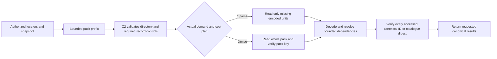

# Stage 2: genuinely localized pack acquisition

> Status: reviewable design, 2026-10-04. Product inspected at `68ed100de`.
> No localized-I/O implementation or performance result is claimed here.
> Owner correction: finish the current work item, then design localized acquisition;
> no indefinite continuation of retention-policy experiments. Implementation may
> continue only within the integrity contract resolved below.

## 1. Required outcome and current disposition

A sparse cache miss must acquire fewer physical pack bytes **including bytes
read solely for authentication**. Returning a small subset after hashing the
entire BLOB is an intermediate Stage 2 mechanism, not completion. Localized
acquisition remains Stage 2; it is not renamed Stage 3.

Current `PersistedPackRead::acquire` reads a bounded directory prefix, chooses
whole/ranges, then scans every remaining byte to compare `PackInfo.key`. Range
output reduces materialization and may improve retention, but does not suppress
first-acquisition bytes. The phase receipts show the consequence: through the
same 43-state prefix, candidate file-root work acquired 27,310 packs and requested
2,980,405,669 B through BLOB reads; reference acquired 17,381 packs and requested
1,605,225,756 B through VFS reads. BLOB and VFS bytes are different observations;
they must not be added or treated as physical device bytes.

Finish and retain the current coverage-policy work item and its qualification.
Keep the bounded caches, checked SQLite BLOB transport, directory parser,
complete-group/record decoders, private ownership and counter calibration.
Reject whole-first payload as the default: its retained negative experiment
increased acquisitions and scanned bytes under the same 2 MiB cache. Coverage
promotion remains an intermediate cost policy, not localized authentication.
Do not take another sample after each small change.

## 2. Integrity contracts: separate the guarantees

Three assertions must have distinct types and API meanings:

1. **Whole-pack integrity:** the complete sealed bytes match `PackInfo.key` and
   length. Existing private `PersistedPack` construction and whole-pack reads
   retain this guarantee. A sparse read cannot construct it.
2. **Accessed canonical-object integrity:** every returned canonical object and
   every used canonical dependency matches its authorized `ObjectId`, role and
   canonical length. Published locator eligibility, scope, visibility ceiling,
   first-wins binding, decoder bounds, cycle/depth/work limits and final identity
   checks remain mandatory.
3. **Exact encoded-unit integrity:** selected physical encoding bytes match an
   independently committed encoded-unit digest. Canonical identity alone does
   not establish this stronger assertion: alternate encodings can reconstruct
   the same canonical bytes, and unrequested records can share a compression
   group. Only callers that require this assertion need new unit commitments.

A localized canonical read promises (2), not (1) or automatically (3). Corruption
in unread pack bytes is detected by a whole-pack integrity read/audit, not by an
unrelated scoped read. A corruption that affects the requested canonical result
or a checked dependency must fail before that result is exposed.

**Owner decision required:** approve this explicit canonical-read scope for the
active canonical consumer path, while preserving the whole-pack APIs; or require
exact encoded-unit commitments as well. It is not acceptable to keep claiming
whole-pack corruption detection while omitting the scan. The current regression
that rejects unrelated/unread corruption belongs to the whole-pack contract;
new scoped tests must state their different guarantee explicitly. This design
must not be adopted through a benchmark-only alternate reader while production
continues to use the full scan.

The trust boundary is unchanged authoritative metadata, not an adversary-free
body store. Locator/catalogue rows come from the scoped, atomic publication and
first-wins protocol. Their object identities commit canonical bytes. Raw pack
control bytes remain untrusted and bounded even when metadata is authorized.
Independent protection against malicious replacement of the metadata database
itself is not provided by the current full-pack key stored in that same database;
it is not introduced or silently assumed here.

## 3. Lane-by-lane authentication audit

| Lane / representation | Minimum accessed unit | Existing commitment and required checks | Additional commitment needed? |
| --- | --- | --- | --- |
| Ordinary FULL canonical records, compressed group | Complete encoded compression group; only requested records are returned | Authorized locator; bounded directory/group decode; record grammar; exact role/length and full canonical `ObjectId` for each requested record | No for canonical correctness. A group digest is needed to assert exact encoded-group integrity or authenticate unrequested records as a group. |
| Ordinary FULL in a raw group | Bounded record-offset header plus complete requested records | Same canonical checks; validate the entire relevant offset header and count before selecting records | No for accessed canonical correctness. Exact raw-record commitment only if an encoded export requires it. |
| Native chunk FULL/raw/Zstandard | Complete per-record encoded frame when group is raw; whole compression group otherwise | Reconstruct the complete canonical chunk, including its existing envelope; compare its authorized `ObjectId`/role/length. No hash claim for a partial chunk. | No for canonical chunk correctness. |
| Whole-file FULL/raw/Zstandard | Complete encoded record plus control metadata | Reconstruct the entire canonical whole-file object, then compare its identity and length | No for the complete object. Logical slices cannot be authenticated from a whole-object hash alone. |
| Native/whole-file PREFIX | Complete target record and complete required base records/groups recursively | Existing ordinary resolver computes and compares each dependency's canonical identity in reverse order (`delta/read.rs`), plus role, chronology where required, logical cycles, depth and encoded/canonical work | No new digest for semantic target/base correctness. Do not authenticate only the final target and skip base checks. |
| Pooled value groups | Complete encoded value group | Existing authoritative `ValueGroupRow.digest` authenticates the decoded group; catalogue ordinal interval/count and value grammar remain checked | Existing commitment is sufficient for these groups. No Merkle redesign needed. |
| Pooled physical FULL/COPY/INSERT leaf programs | Complete compressed ordinary group or raw requested record, plus value groups required by each authenticated leaf | **Current code names intermediate `decoded_id` from the locator; it does not canonicalize/hash each intermediate pooled base.** Whole-pack hashing currently protects the physical program. For a canonical-scoped path, canonicalize every reconstructed intermediate leaf using authenticated value groups, compare its actual canonical `ObjectId`/length, then permit it as a base. | No new schema if this per-base canonical validation is added. If exact physical ordinal/program identity is required, add a physical-record/unit commitment; the canonical leaf ID does not commit a unique ordinal assignment. |
| Singleton | Its one complete encoded object | Entire canonical object identity; existing isolated size exception. There is little/no pack suppression to gain | Keep whole-pack acquisition when the singleton is the unit. Do not claim arbitrary internal slices are authenticated. |

The pooled-base change is required work, not an assertion that today's code
already verifies those intermediate canonical IDs. Reuse the existing result
scratch while checking one intermediate at a time; do not add a canonical-base
memo. Values used by a checked base but deleted by the target's delta are real
required dependency work, and must be counted and bounded.

Malformed control metadata must fail: unknown versions/lane/domain/codec,
wrong BLOB length, invalid group/record counts, arithmetic overflow, overlapping
or out-of-range extents, wrong decoded lengths, invalid record tags/programs,
missing or ineligible bases, cycles, excessive depth/work, canonical mismatch
and value-group digest mismatch. Parseability does not authenticate a directory;
misrouting by an untrusted directory must not bypass final canonical checks.

## 4. Concrete interfaces and data flow

Keep `PackPersistence::read_packs` and `PersistedPack::authenticate` unchanged for
whole-pack callers. Keep the strict scanned-range path as an explicitly named
legacy/intermediate contract until callers are migrated; never relabel its
carrier or historical receipts.

Add a separate backend-neutral scoped byte acquisition operation:

```text
read_scoped_pack(pack_id, expected_descriptor, ScopedPackPlan)
    -> AcquiredPackUnits

ScopedPackPlan:
    inspect_prefix(PackInfo, bounded_prefix) -> bounded control extents
    finish_controls(PackInfo, prefix, controls) -> Whole | Selected(unit extents)

AcquiredPackUnits:
    exact metadata descriptor + bounded control bytes + exact acquired extents
    // private structural/bounds-checked construction; NOT a whole-pack digest proof

C2 decode/resolve:
    AcquiredPackUnits -> CheckedCanonicalObject(s)
    // only after canonical identities/dependencies or catalogue digests are checked
```

Names are proposed interfaces, not implemented symbols. Whole selection can
return the existing `PersistedPack` carrier after the complete scan. Selected
selection performs **no whole-pack authentication read**. The provider neither
parses codecs nor invents an authentication guarantee; C2 owns layout, unit
selection, dependencies and semantic validation.



SQLite resolves the descriptor and opens a read-only incremental BLOB inside one
transaction attempt. Compare actual BLOB size with the authorized descriptor;
validate each requested offset/length before reading it; return exactly those
bytes; perform checked close and transaction completion. Unknown outcomes retain
existing quarantine/refusal semantics. No open write transaction spans input
reading, planning or encoding; no automatic retry or error-driven whole fallback.
Do not keep a BLOB cursor across dependency acquisition from another pack.

The normal control sequence is a pack prefix/directory, then (only for raw-group
record selection) the complete bounded record-offset header, then data extents.
Compressed groups are indivisible decode units. Adjacent needed extents may be
coalesced, but gaps must be charged as acquired bytes rather than hidden. A
valid-control policy may choose whole before body I/O; a malformed control read
must fail, not trigger an alternate algorithm.

## 5. Demand, selection and ownership

Form a demand from actual authorized locator positions and already known
physical dependencies. Deduplicate pack/group/record identities, preserve
original result order and repeated-ID accounting, and expand dependencies in
bounded waves. Unknown dependencies discovered in record headers cause the
next explicit demand; no claim of an oracle that knew the whole closure before
reading it. Cache real acquired input only, never expected fixture bytes.

The decision model records:

- `W`: complete pack bytes not already retained under a valid whole-pack proof.
- `S`: missing control bytes + union of complete required encoded units, including
  any coalescing gaps. Include required dependencies in their own pack plans.
- `R`: actual retained encoded bytes after admission, not pack length or logical
  output size. Include control bytes in their declared owner allowance.
- Range/whole read-call counts, descriptor/control calls, bytes hashed/decoded,
  dependency edges/depth, unit/cache hits and required evictions.

Choose sparse when coverage is low and `S` is materially below `W`. Choose whole
for dense/sequential demand when the needed units approach the pack or call/hash
cost makes whole cheaper. Do not promote simply because a second group was
requested or because the lane is payload. Use bounded actual demand/coverage;
the failed blanket whole-payload policy is evidence against that rule. Initial
thresholds are prospective policy parameters, to be frozen after functional
validation; the design does not declare a measured time win from a byte estimate.
Prefer splitting an oversized sparse demand into bounded cohorts over acquiring
unneeded whole packs purely to hide descriptor/range-count limits.

No resource bound is raised: ordinary body ownership 2 MiB and 4,096 entries,
existing isolated singleton exception, decoded ordinary groups 512 KiB, pooled
values 512 KiB, canonical output 32 MiB / 4,096 demands, current decode workspace,
chain limits, publication row/byte bounds and construction workers. Normal
acquisition shares the existing prefix/control/scratch allowance rather than
adding a parallel buffer. Reuse the existing 64 KiB scan scratch for staged
control/data transfer when a whole scan is absent. Range descriptors remain
count-bounded; stream/cohort controls rather than accumulate all headers.

Encoded or decoded units without independent unit digests must not be labeled
cryptographically verified units. Their cached bytes remain operation-owned,
structurally checked input; every requested canonical result/dependency is still
checked before use/exposure. Digest-checked pooled values and fully checked
whole packs retain their stronger labels. Keep private mutable-pool invalidation,
immutable descriptor binding, publication/winner invalidation and ceiling-before-
cache-hit rules. Do not add a canonical-base cache or new cross-operation sharing.

## 6. Compatibility and optional unit commitments

**Recommended canonical-scoped path:** no pack-byte format change, no schema
migration, no dependency additions. Existing canonical IDs and pooled value
commitments suffice subject to per-base pooled canonical validation. Existing
pack keys remain addresses/metadata commitments and whole-audit expectations;
they are not asserted checked by a sparse response. Existing physical versions
keep their parser/codec rules. Unsupported scoped transport capability fails
explicitly; dense choice is not an exception-handler fallback.

If an operation needs exact encoded-unit identity, publish independent unit
metadata in the same authoritative publication transaction: unit kind/ordinal,
codec, offset/length, decoded bound and encoded digest. Use one commitment per
compressed group, or per raw record when record-level acquisition is required.
A group digest alone cannot authenticate a raw record without reading its
siblings. Store commitments in metadata; a self-described checksum placed only
in the fetched bytes is insufficient. This can be a metadata-schema addition
without changing pack bytes, and does not require a Merkle tree.

Such metadata must follow first-wins/visibility/private ownership and atomic
publication, be covered by collision/winner validation, and count toward existing
transaction row/byte caps. Old packs lack these commitments: explicit capability
refusal or an expressly chosen whole-integrity read is required; no automatic
migration, silent trust or error-driven full-read fallback. Backfill, if approved,
requires an explicit whole verified read and separately recorded work.

Do not implement this optional schema just to avoid reasoning about existing
canonical commitments. It is needed only for the stronger physical-unit promise,
encoded exports or pooled program identity if per-base canonical validation is
not the accepted contract.

## 7. Byte suppression: estimates, not timing claims

For a 256 KiB pack with a 4,120 B control prefix and one needed 32 KiB compressed
group, the old strict range scan acquires 262,144 B; localized acquisition is
about 36,888 B, an illustrative 7.1x reduction (85.9% suppression) before added
control calls/dependencies. A raw 8 KiB record plus about 4.2 KiB controls is about
12.4 KiB, roughly 21x below the full pack. Count each real dependency pack and
unit; a long chain can dominate, and singleton/whole-object reads may offer no
suppression. These are arithmetic examples, not workload or time measurements.

Returned canonical bytes may exceed acquired compressed bytes. Returned/retained
encoded bytes, acquired bytes, hashed canonical bytes and VFS/device observations
must remain separate. The acceptance gate is actual sparse acquired-byte
suppression, not just fewer retained bytes or fewer read calls.

## 8. Prospective fast proof and qualification plan

The owner authorizes a prospective increase in proof budget, without an exact
value, and asks for fast bounded verification rather than reading every blob or
rerunning after each tweak. **Propose 12 seconds per separate combined proof**
(+2.5 s / 26.3% from 9.5 s), with a versioned lite scope. This is a disclosed
proposal, not a code/registry change or retroactive ruling. Stride1 performance
is now300 s by explicit owner direction; stride10/3 remain60/170 s. Old9.5 s failures retain their limits.

Keep complete structural/identity checks for all selected history states:
independent root vector; closed C2/C5 custody/history/first-wins/eligibility
consistency; canonical metadata inventory/count/length commitments; every path,
name, inode kind and declared logical size. Authenticate all directory/inode and
mapping metadata actually traversed. For unsampled whole-file objects, a size
check may use the authorized canonical-length commitment and the existing23 B
whole-file overhead; this is a **declared metadata-size check**, not validation
of unread payload bytes or its actual on-disk grammar. Mapping roots are checked
through their canonical IDs and logical-size fields. Other roles need their
existing format's explicit size rule or metadata-root read; no guessed formula.

Predeclare five state anchors (initial, quarter, middle, three-quarter, final;
deduplicate for small selections). At each anchor choose deterministic metadata-
stratified content targets: at most8small files (full bytes, <=64 KiB each),
2symlinks (full target, <=4 KiB), and4chunked large-file targets with16 KiB logical
ranges at start/middle/end. Use immutable fixture identities/paths/sizes and a
fixed seed, never a failed product read, to choose samples. Upper logical sample
bound is8 MiB per case; payload-unit acquisition plus dependency budget is32 MiB
per case, with explicit counts/coverage in the receipt. Expected bytes/range
hashes are read from the immutable source **inside the proof**, not from product
results or warming/pre-touching them outside its timer.

A logical range still requires complete canonical chunks and dependencies.
Large whole-file objects cannot authenticate arbitrary slices from their single
canonical ID: full-read a predeclared budget-fitting whole object, or classify it
as unsampled. Do not pretend slice hashes authenticate the whole object. If a
mandatory chosen sample's required closure exceeds the fixed acquisition/work
budget, report incomplete content coverage; do not silently pick a replacement
or enlarge the budget. Structural versus sampled content outcomes remain separate.

This differs from the old every-tenth-content-path proof. Use new case/proof
contract IDs and exact scope labels; never pool its results with old coverage.
The12 s fit is unmeasured, not promised. No performance row becomes admission
from a partial/over-budget proof. Optional exhaustive whole-pack audit remains
separate from this fast canonical proof.

Execution order after the integrity decision:

1. Implement the resolved scoped contract and pooled-base validation; test each
   changed mechanism with focused deterministic positive/refusal cases. Include
   actual read-at ranges/bytes in a realSQLite fixture: sparse reads must not
   touch unrelated bytes for authentication, while whole reads still do.
2. At final frozen source run required Core tests/examples/Clippy/fmt/boundary
   once. Keep all failures and commands; do not repeatedly rerun passing suites.
3. Freeze lite proof scope/budget, workload, cache, identities and whole/range
   policy together. One final paired performance/proof selection in10,3,1 order;
   use qualified reference pins and declared fixture/build reuse. No small-tweak
   performance/diagnostic loop, no best-of/repeated unchanged arm.
4. Publish acquired/control/dependency/returned/retained/hash bytes and calls,
   correct scope, complete command/proof walls and all omissions. Reuse eligible
   previous checks only with exact identity/scope receipts.

The unmodified stride1 reference has repeatedly exceeded190 s. Increasing proof
budget or localizing candidate reads cannot change that historical performance
failure. A future unqualified reference still yields candidateNOT_RUN. No new
cold-contract relaxation is authorized by this design. The owner separately
authorizes a prospective300 s stride1 performance cap, applied symmetrically
to reference and candidate under new v4 identities; historical190 s failures
remain unchanged.

## 9. Review decisions and implementation boundary

The actionable owner decision is the integrity scope for active canonical reads:

- Recommended: approve canonical-object/dependency correctness plus existing
  pooled commitments and new per-base pooled canonical checks, with explicit
  whole-pack audit for unread corruption. No new schema needed for this promise.
- Alternatively require exact encoded-unit commitments in authoritative metadata
  as well; approve the bounded metadata/schema/backfill scope before implementation.

The proposed12 s lite proof, fixed structural versus sampled claims and sample
quotas are disclosed for review. Implement neither an undisclosed proof weakening
nor a format/schema change. Once the integrity decision is resolved, continue
Stage2implementation and its final qualification; do not restart retention-only
experiments. Current design itself makes no completed localization claim.
