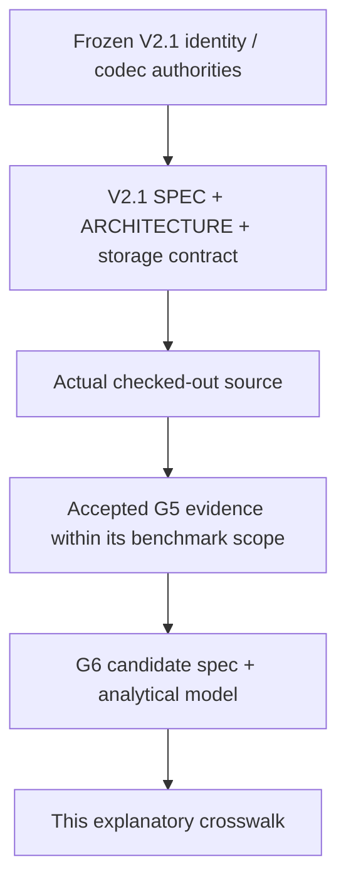
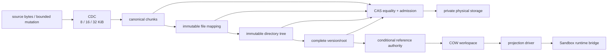
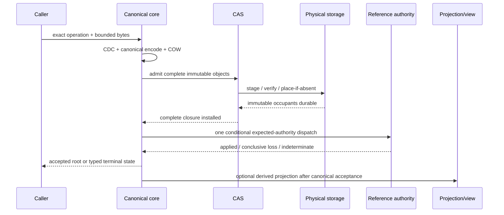
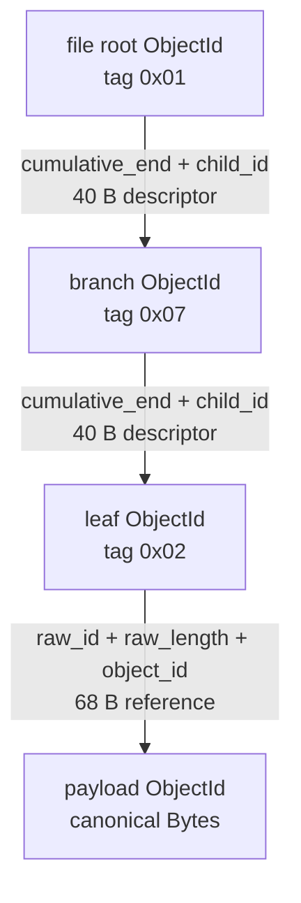
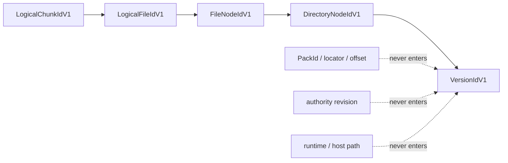
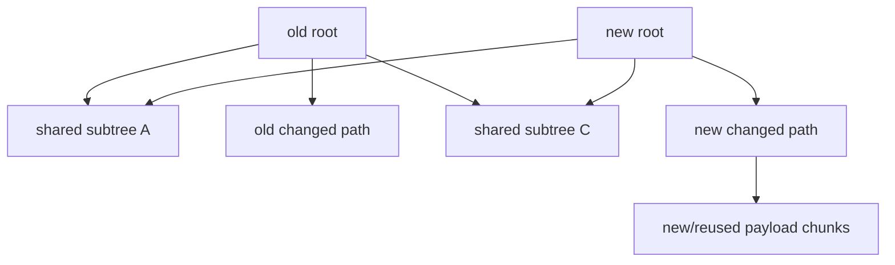

# LayerFS overview and identity model

Status: **architecture explanation and identity crosswalk**.

This document does not freeze bytes, add durable identifier types, select G6,
authorize migration, or claim SDK/VFS production readiness. Where the proposed
role vocabulary differs from current V2.1 authority, the conflict is explicit.

## 0. Evidence labels and authority

| Label | Definition | Example in this document |
|---|---|---|
| **Invariant** | Frozen/current rule with cited authority | `Verified` default; immutable occupied-object equality |
| **Observed** | Direct source or retained measurement | G5-1 p50 and RSS; 100 MiB reference count |
| **Derived** | Exact arithmetic from inputs | candidate node bytes; percentage reduction |
| **Projected** | Unmeasured design/cost hypothesis | stable inode role; byte-measured rope outcome |
| **Unavailable** | No accepted evidence or representation | controlled-cold G5 result; production VFS result |

Authority order:



If two rows conflict, the higher row wins. This document records the lower
row as a proposal or implementation mismatch; it does not resolve the conflict
by renaming an identity.

---

## 1. Sixty-second mental model

> **LayerFS is an immutable, versioned filesystem storage graph with a tiny
> mutable reference authority.** Source bytes pass through a construction-bound
> CDC profile. Canonical chunks and structural nodes receive domain-separated
> content identities. CAS admits complete immutable objects and reuses an
> occupied identity only after complete equality/authentication. Copy-on-write
> builds a new file/tree/version from changed payload and changed structural
> spines while equal chunks and subtrees remain shared. Durable storage decides
> where canonical bytes live; it does not decide their meaning. A complete
> candidate closure is installed before one guarded reference transition makes
> it current. Workspaces and projection drivers present usable mutable views;
> they never become canonical truth. Full reads, complete native export, full
> closure verification, and tracing GC remain linear in the bytes/graph they
> must process.

### 1.1 One diagram



### 1.2 What changes and what does not

```text
old version root                     new candidate root
      │                                      │
      ├── unchanged directory ───────────────┤  shared by identity
      ├── changed parent directory           ├── new parent node
      │       ├── unchanged sibling ─────────┤  shared by identity
      │       └── old file                   └── new file root
      │                                             ├── old prefix ── shared
      │                                             ├── new chunks
      │                                             └── old suffix ── shared when format permits
      └── old history remains reachable
```

| Event | New payload | New structure | Mutable authority effect |
|---|---:|---:|---:|
| range read | `0` | `0` | `0` |
| same-size edit | changed CDC neighborhood | changed file path + directory spine | one publication transition |
| insert/delete | inserted/rechunked neighborhood | representation-dependent local path or suffix | one publication transition |
| workspace creation | `0` | workspace metadata only | no accepted-head move |
| snapshot/checkpoint | `0` | reference metadata only | one guarded reference update |
| full export | `0` canonical | derived destination bytes `Theta(F)` | `0` canonical authority |

### 1.3 Five sentences to retain

1. **CDC chooses chunk boundaries; it does not store objects or define the tree.**
2. **CAS gives complete canonical bytes immutable identity and deduplication; it
   does not define file ordering.**
3. **COW creates a new root and changed spine; it does not mutate prior roots.**
4. **An immutable root is content/structure; a reference authority says which
   accepted root is current.**
5. **Projection and materialization are derived views; neither is canonical
   storage truth.**

---

## 2. End-to-end authority map

### 2.1 Truth classes

| Class | Examples | Mutable? | May establish canonical equality? | Rebuildable? |
|---|---|:---:|:---:|:---:|
| canonical immutable truth | chunk/file/tree/version canonical bytes | No | Yes, after full typed validation | No, except from equivalent source bytes under the frozen format |
| physical binding | pack/segment ID, offset, locator, catalog entry | Controlled | No; locates truth only | Yes, under separately safe repack/compaction |
| mutable authority | filesystem head/reference record, guarded revision | Yes, conditionally | Selects an accepted root; does not redefine it | No casual reconstruction; requires terminal evidence/readback law |
| workspace state | delta, revision gate, custody, projection lease | Yes, isolated | No | Disposable before conclusive publication |
| derived view/cache | native file, mount view, materialization index, warm seed | Yes/disposable | No | Yes, from an accepted root |
| measurement/evidence | rows, timers, counters, manifests | Append-only custody | Proves only recorded claims | Recomputed only from retained authority; never product truth |

### 2.2 Write/publication authority path



### 2.3 Non-negotiable ordering

```text
canonical construction
    < immutable placement
    < complete closure verification
    < durable readback-address acknowledgement when required
    < one conditional authority dispatch
    < optional projection/materialization
```

| Failure point | Canonical result | Required behavior |
|---|---|---|
| before immutable visibility | no candidate publication | cleanup owned preparation |
| immutable objects visible, before authority dispatch | old head remains | unreachable immutable residue is safe; later reclaim is separate |
| conclusive conditional loss | old/new current chosen by authority law | no retry, recompose, or redispatch inside the request |
| ambiguous dispatch response | result unknown | authenticated readback only; never publish again through that address |
| projection failure after accepted root | accepted root remains valid | derived view may be retried/rebuilt under its own policy |

---

## 3. Identity taxonomy

The names below are **roles**, not a declaration that eight new stored IDs are
required. Reuse an existing frozen identity when it already answers the exact
question; add a new typed identity only when two operations require different
equality semantics.

### 3.1 Identity questions

| Role name | Equality question | Proposed preimage/domain | Current/V2.1 status |
|---|---|---|---|
| `PayloadObjectId` | Are these complete canonical payload-object bytes identical? | domain + canonical payload object | **Implemented role** through current `ObjectId`; V2.1 has distinct logical/physical chunk identities |
| `MappingNodeId` | Is this canonical mapping node byte-identical? | domain + canonical mapping node | **Implemented role** through current `ObjectId`; not a distinct Rust type |
| `FileStateRoot` | Is this the same immutable operational file structure? | mapping profile + root node bytes/ID | **Current role** represented by a mapping-root `ObjectId`; name/type not frozen |
| `ContentDigest` | Does the complete logical byte stream match, independent of placement and intended structure? | semantic domain + length + logical bytes | **Unavailable as a separate accepted durable identity**; must not replace frozen structural IDs silently |
| `InodeId` | Is this the same stable filesystem object across content/rename changes? | allocated/authority-scoped stable ID | **Projected and conflicting with current structural node identity**; needs schema/API decision |
| `CommitId` | Is this the same immutable history transition/event? | parent(s) + namespace/version root + operation facts | **No single current role**; current delta/transition IDs and V2.1 publication request/evidence IDs answer different questions |
| `NamespaceRoot` | Is this the same immutable complete directory namespace structure? | canonical directory-tree root | **Current role** via `RootId/ObjectId`; V2.1 `VersionIdV1` additionally wraps the root directory ID |
| authority revision/token | Is this the exact mutable reference state expected by a conditional write? | authority record/revision + authenticated token | **Separate mutable-authority identity**; never a content root |

### 3.2 Current `layerfs-empty` implementation

**Observed source facts:**

```text
ObjectId = BLAKE3("layerfs/object\0" || canonical_object_bytes)
ObjectId width = 32 bytes

canonical object header:
    magic[4] = "LFSO"
    kind[1]
    payload_len[4] = u32be
    payload[payload_len]

Bytes-object payload:
    value_len[4] = u32be
    value[value_len]

canonical Bytes object length = raw value length + 13 bytes
```

Source:

- [`identity/digest.rs`](../../crates/layerfs-core/src/identity/digest.rs)
  fixes the `layerfs/object\0` domain and 32-byte BLAKE3 result.
- [`identity/ids.rs`](../../crates/layerfs-core/src/identity/ids.rs) defines
  the only concrete `ObjectId` wrapper.
- [`object/codec.rs`](../../crates/layerfs-core/src/object/codec.rs) defines
  `LFSO`, the nine-byte header, exact EOF, and bytes framing.

Current aliases and role reuse:

| Rust/source role | Concrete type | What enters identity | Important limitation |
|---|---|---|---|
| `ObjectId` | `[u8;32]` wrapper | canonical object bytes | one type serves many logical roles |
| `ChunkId` | type alias to `ObjectId` | current helper hashes supplied bytes; persisted payload references also carry canonical object ID | naming has historical ambiguity; use exact codec context |
| mapping leaf/branch/root ID | `ObjectId` | canonical Phase-1 `Bytes` wrapper containing tagged mapping bytes | role tag is in bytes; type system does not separate roles |
| `NodeId` | type alias to `ObjectId` | provisional in-memory tree fingerprint | explicitly not a frozen encoding |
| `RootId` | type alias to `ObjectId` | root directory node fingerprint/identity | not a separate canonical Root object |
| engine `DeltaRecord.id` | `ObjectId` | `layerfs-phase4a-delta-v1`, parent, child, payload | transition identity, not file content or authority revision |

The provisional node warning is source-level, not editorial:

```text
"in-memory identity for structural sharing and delta checks,
 not a frozen tree/object encoding"
```

See [`cow/tree.rs`](../../crates/layerfs-core/src/cow/tree.rs).

### 3.3 Current canonical-v2 mapping roles



| Field/constant | Value | Class |
|---|---:|---|
| leaf capacity `K` | `64` | **Invariant** current mapping profile |
| branch capacity `F` | `64` | **Invariant** current mapping profile |
| file reference | `68 B` | **Invariant** current codec |
| child descriptor | `40 B` | **Invariant** current codec |
| mapping magic | `LFS4MAP\0` | **Invariant** current codec |
| mapping version | `1` in codec; commonly called canonical-v2 by phase evidence | **Observed naming split** |

The mapping role is authenticated because the role tag is part of canonical
bytes. It is still possible to pass the wrong `ObjectId` role at an API boundary;
typed wrappers would improve compile-time safety without changing stored bytes.

### 3.4 V2.1 frozen logical identity family

The V2.1 specification—not this crosswalk—governs exact field order and bytes.
Its explanatory formulas are:

```text
LogicalChunkIdV1  = BLAKE3("ESV2-LCHUNK" || 00 || version || length || payload)
LogicalFileIdV1   = BLAKE3("ESV2-LFILE"  || 00 || version || length
                            || ordered chunk IDs/lengths)
FileNodeIdV1      = BLAKE3("ESV2-FNODE"  || 00 || version || mode
                            || logical file ID || length)
SymlinkNodeIdV1   = BLAKE3("ESV2-SNODE"  || 00 || version || target length || target)
DirectoryNodeIdV1 = BLAKE3("ESV2-DNODE"  || 00 || version || mode
                            || ordered children)
VersionIdV1       = BLAKE3("ESV2-VROOT"  || 00 || version || root directory ID)
```

Source: V2.1 [`SPEC.md` section 4](../../../ephemeral-sandbox-docs/ephemelra-sanbdox-v2.1/layefs/SPEC.md#4-canonical-format-authority).



### 3.5 Role-to-authority crosswalk

| Proposed role | Closest current source role | Closest V2.1 role | Can be renamed directly? | Required decision if changed |
|---|---|---|:---:|---|
| `PayloadObjectId` | payload canonical `ObjectId` | `LogicalChunkIdV1` plus separately governed physical record identity | No | Keep exact logical/physical distinction and frozen domains |
| `MappingNodeId` | mapping `ObjectId` | canonical file/tree record identity | No | New typed wrapper may be byte-preserving; new node codec is format work |
| `FileStateRoot` | canonical-v2 file-root `ObjectId` | `LogicalFileIdV1` / file-root structural role | No | Define whether it is canonical file identity, operational mapping root, or both |
| `ContentDigest` | no independent accepted role | no replacement for `LogicalFileIdV1` | No | New optional semantic index/digest; never retroactively redefine VersionIdV1 |
| `InodeId` | none | `FileNodeIdV1` is structural, not stable mutable inode identity | No | New namespace schema, hard-link/rename laws, allocation authority, migration |
| `CommitId` | delta/transition ID | Version identity + publication/reference evidence are distinct | No | Define content transition versus publication attempt/outcome separately |
| `NamespaceRoot` | `RootId` / directory identity | root `DirectoryNodeIdV1`; `VersionIdV1` wraps it | No | Preserve distinction between directory root and accepted version |

### 3.6 Forbidden identity substitutions

| Never substitute | For | Why |
|---|---|---|
| physical carrier/pack/segment ID | payload or version ID | placement can change without semantic change |
| host path, inode number, file handle | canonical inode/file/node identity | platform-local, mutable, and not portable |
| native projection digest | canonical file root | cache may be absent/stale/rebuilt |
| `ContentDigest` | `FileStateRoot` | equal bytes need not imply equal operational structure/history/profile |
| `FileStateRoot` | `ContentDigest` | operational tree identity is not automatically a byte-stream commitment independent of structure |
| `NamespaceRoot` | authority revision/update token | immutable structure cannot express mutable current-state generation |
| `CommitId` | publication `RequestId` | one is content/history; the other is at-most-once operation identity |
| trusted receipt/cache presence | Verified authority | unread bytes require a qualified immutable boundary and authenticated certificate |
| benchmark root/hash | product special case | fixtures are evidence inputs, never runtime routing policy |

---

## 4. CAS, CDC, COW, tree, and authority: separate algorithms

### 4.1 Responsibility matrix

| Mechanism | Input | Output | Solves | Does not solve |
|---|---|---|---|---|
| CDC | byte stream + frozen profile | ordered chunk boundaries | dedup locality and bounded chunk sizes | object storage, file ordering, publication |
| canonical codec | typed value | exactly one byte encoding | deterministic identity preimage | physical durability |
| hash/typed ID | canonical bytes | fixed identity | equality/authentication key | reachability, current head |
| CAS | ID + complete canonical bytes | inserted/reused immutable occupant | dedup, no-replace admission, corruption detection | logical offset routing |
| measured file tree | ordered chunk/extent occurrences | file mapping root | offset routing and structural sharing | physical object placement |
| COW | base root + mutation | new root + changed spine | immutable history and reuse | atomic accepted-head move |
| closure validator | candidate root + stored objects | complete/not-complete evidence | no dangling accepted root | user/product policy |
| reference authority | expected record + complete candidate | one guarded current-head result | linearized publication | canonical content construction |
| projection driver | accepted/workspace view | usable filesystem view + captured effects | OS presentation | canonical identity or CAS truth |

### 4.2 CDC pipeline


| FastCDC constant | Value | Source |
|---|---:|---|
| minimum | `8,192 B` | [`cdc/mod.rs`](../../crates/layerfs-core/src/cdc/mod.rs) |
| target | `16,384 B` | same |
| maximum | `32,768 B` | same |
| normalization shift | `2` | same |
| seed | `0` | same |

### 4.3 CAS admission law

```text
candidate canonical bytes
        │
        ├── hash does not equal requested ID ──► IdentityMismatch
        │
        └── hash matches
              │
              ├── key absent ──► place complete immutable occupant
              │
              └── key occupied
                    ├── existing complete bytes equal ──► Reused
                    └── unequal / malformed / truncated ─► fail closed
```

**Invariant:** fetched, new, and incumbent objects remain authenticated. G5
`TrustedLocalDev` removed selected eager closure work; it did not authorize
identity-free CAS fetch/put/reuse.

### 4.4 COW path copy



| Quantity | Target shape |
|---|---:|
| unchanged payload duplication | `0 B` admitted again when equal incumbent is reused |
| ordinary changed mapping nodes | `O(H)` plus splits/merges |
| changed directory nodes | affected ancestor spine; current flat directory encoding may impose suffix/whole-map work |
| snapshot/fork payload copy | `0 B` |
| old-root mutation | forbidden |

“Zero unchanged-payload duplication” is not “zero I/O.” Authentication,
locator lookup, pack/index work, native copy-up, or full export may still read
or write bytes.

---

## 5. Current implementation, benchmark mechanisms, and target architecture

### 5.1 Actual checked-out crate surface

```text
crates/
├── layerfs-core/      implemented: identity, canonical objects, FastCDC,
│                     in-memory CAS, LogicalFile, COW tree, deltas,
│                     canonical-v2 K64/F64 mapping codecs
├── layerfs-engine/    implemented: reusable SQLite schema-v1 layerfs_* engine;
│                     benchmark binaries contain larger wp4m_* mechanisms
├── layerfs-os/        implemented: host-environment observation/probes
├── layerfs-vfs/       placeholder: COMPONENT constant only
└── layerfs-sdk/       placeholder: COMPONENT constant only
```

**Observed:** [`layerfs-vfs/src/lib.rs`](../../crates/layerfs-vfs/src/lib.rs)
and [`layerfs-sdk/src/lib.rs`](../../crates/layerfs-sdk/src/lib.rs) expose no
product operations. A benchmark PASS is therefore not a merged SDK/VFS feature.

### 5.2 Reusable engine versus G5 benchmark Store

| Concern | Reusable `layerfs-engine` | G5 benchmark Store |
|---|---|---|
| location | [`crates/layerfs-engine/src/lib.rs`](../../crates/layerfs-engine/src/lib.rs) | [`phase4_create_edit_benchmark.rs`](../../crates/layerfs-engine/src/bin/phase4_create_edit_benchmark.rs) |
| SQLite tables | `layerfs_store_meta`, `layerfs_objects`, `layerfs_roots`, `layerfs_deltas` | `wp4m_meta`, `wp4m_objects`, `wp4m_visible_head`, additional benchmark mechanisms |
| schema version | `1` | benchmark-private evolved schema through `5` |
| integrity modes | reusable engine has no promoted G5 policy surface | `Verified` / `TrustedLocalDev` mechanism |
| projection | none | benchmark-private worker/native projection path |
| public SDK/VFS consumer | absent | absent |

Promotion requires one shared implementation path; copying benchmark semantics
into another facade would invalidate the anti-cheat/promotion premise.

### 5.3 Four architecture states

| State | File representation | Namespace | Physical store | Projection | Status |
|---|---|---|---|---|---|
| current in-memory core | flat `Vec<ChunkReference>` `LogicalFile`; `BTreeMap` directories | provisional COW tree fingerprints | in-memory CAS | none | **Observed implemented** |
| current durable/benchmark path | canonical-v2 fixed K64/F64 file mapping | canonical directory/delta mapping + SQLite head | SQLite BLOB objects | G5 warm APFS/private path | **Observed narrow evidence** |
| G6 CD32–64 candidate | content-defined 32–64 entry measured sequence tree | existing namespace preserved | fresh isolated profile proposed | virtual endpoint + native routes proposed | **Projected; not implemented** |
| V2.1 Stage-1 target | frozen chunk/file/tree/version object graph, dense packs/exact index, workspaces/publication | structural `DirectoryNodeIdV1` / `VersionIdV1` | sealed private substrate | Linux OverlayFS first authorized future projection | **Normative target; phase implementation incomplete** |

### 5.4 G6 candidate is not the same as a B+ rope

| Property | G6 CD32–64 candidate | Conventional byte-measured B+ rope proposal |
|---|---|---|
| grouping | public content-defined marker between `32..64`; forced at `64` | occupancy/split/merge rules by capacity |
| descriptor | `subtree_raw_length + subtree_extent_count + child_id = 48 B` | typically subtree bytes + child ID; exact codec undecided |
| canonical goal | history-independent root for equal occurrence sequence | depends on deterministic canonical balancing policy; ordinary mutable B+ history is not sufficient |
| ordinary mutation | expected local rejoin | deterministic path-local only if canonical policy preserves untouched suffix subtrees |
| hard worst case | suffix-linear for chosen-marker/no-cut/repeated-ID streams | must be proven; naive rebalancing/history can produce alternate roots |
| current authority | candidate spec only | separate research proposal, not current V2.1 authority |

**Invariant from G6 specification:** the public marker is a heuristic, not an
authority assumption. Forced node bounds keep memory finite but do not remove
the suffix-linear worst case.

---

## 6. Quantified architecture anchors

### 6.1 Retained 100 MiB fixture

| Metric | Value | Class |
|---|---:|---|
| logical bytes | `104,857,600` | **Observed** |
| CDC references/extents | `5,284` | **Observed** |
| mean logical bytes/reference | `19,844.36 B` | **Derived**: `104,857,600 / 5,284` |
| current leaves / branches / root | `83 / 2 / 1` | **Observed** |
| current mapping objects | `86` | **Derived/Observed**: `83+2+1` |
| current mapping bytes | `196,055 B` | **Observed** |
| mapping/payload ratio | `0.1870%` | **Derived**: `196,055 / 104,857,600 * 100` |

### 6.2 Current structural edit work

| 100 MiB occurrence edit | Total operation mapping | File mapping only | Class |
|---|---:|---:|---|
| early `+1` occurrence | `196,375 B` | `196,091 B` | **Observed** |
| middle `+1` occurrence | `100,763 B` | `100,479 B` | **Observed** |
| same occurrence count | `5,334 B` | `5,050 B` | **Observed** |
| non-file component | — | `284 B` | **Derived** from row difference |

These are structural occurrence edits, not raw `+1 byte` FastCDC operations.

### 6.3 G6 analytical node equations

```text
leaf(n)     = 28 + 36*n
internal(c) = 29 + 48*c
root(c)     = 49 + 48*c

leaf_max(64)     = 2,332 B
internal_max(64) = 3,101 B
root_max(64)     = 3,121 B

height-2 ordinary local path
    = leaf_max + internal_max + root_max
    = 2,332 + 3,101 + 3,121
    = 8,554 B

height-2 cascading split envelope
    = 2*leaf_max + 2*internal_max + root_max
    = 13,987 B
```

| Comparison | Current | Candidate | Reduction | Class |
|---|---:|---:|---:|---|
| 100 MiB early `+1` mapping / ordinary G6 path | `196,091 B` | `8,554 B` | `22.92x`, `95.64%` | **Derived, candidate contingent on local route** |
| 100 MiB middle `+1` mapping / ordinary G6 path | `100,479 B` | `8,554 B` | `11.75x`, `91.49%` | **Derived, candidate contingent on local route** |
| current same-count / ordinary G6 path | `5,050 B` | `8,554 B` | candidate is `69.4%` larger | **Derived; required honest regression** |

### 6.4 G5 terminal measurements

| Gate | Complete wall | Peak RSS | Qualified observation | Class |
|---|---:|---:|---|---|
| G5-0 v9 | `9.254 s` | `14,090,240 B` | 8-row history/Q/reachability harness | **Observed** |
| G5-1 v27 | `95.098 s` | `18,563,072 B` | 200 rows; Trusted paired median improvement `93.77–94.79%` | **Observed warm/preconditioned** |
| G5-2 v3 | `0.590 s` | `8,093,696 B` | 250,000-byte exact/sparse projector + bounded mailbox | **Observed benchmark-private** |
| G5-3 v3 | `4.782 s` | `18,923,520 B` | 1,000 revisions; 10 MiB 2-reader/1-writer sentinel | **Observed narrow workload** |

G5-2 service samples:

| Route | Population | p50 | p95 | Complete-path caveat |
|---|---:|---:|---:|---|
| exact | `n=1` | `0.828 ms` | `0.828 ms` | whole-seed admission keeps exact end-to-end `Theta(S)` |
| same-offset sparse | `n=67` | `1.265 ms` | `1.469 ms` | end-to-end `Theta(S+B)` with whole-seed hash |
| ordinary fallback | `n=1` | `1.775 ms` | same single sample | not a fast-route claim |
| contended fallback | `n=1` | `2.806 ms` | same single sample | not isolated performance |

### 6.5 G5 limitations that remain architecture inputs

| Limitation | Current result |
|---|---|
| controlled-cold OS/device residency | **Unavailable** |
| large-file warm projection | not qualified by 250,000-byte G5-2 evidence |
| different-length projection speed | exact `FullFallback`; no fast claim |
| fixed-radix count change | suffix-linear |
| production SDK/VFS path | absent |
| persistent/multi-process projection seed | absent |
| hostile same-UID projection filesystem | not qualified |
| destructive GC | absent |
| random/multi-file/multi-worker history scaling | absent |

---

## 7. Core invariants

### 7.1 Canonical and CAS

| ID | Invariant | Enforcement/evidence |
|---|---|---|
| C-01 | canonical values have one exact encoding and exact EOF | current object codec + frozen V2.1 authorities |
| C-02 | identities are domain separated and fixed width | current 32-byte BLAKE3 `ObjectId`; V2.1 typed domains |
| C-03 | existing occupants are completely authenticated/equal before reuse | current in-memory and SQLite CAS paths |
| C-04 | host path/provider/pack/offset/runtime values do not enter logical identity | V2.1 identity authority |
| C-05 | CDC algorithm/profile is construction-bound; no mid-operation switch | V2.1 storage contract |
| C-06 | Update failure is not silently reinterpreted as full Replace | V2.1 CDC law; G5 fallback is a separately scoped benchmark route, not this public operation law |

### 7.2 COW, history, and publication

| ID | Invariant | Result |
|---|---|---|
| H-01 | prior immutable roots are never edited in place | history remains addressable |
| H-02 | unchanged canonical payload is reused by identity | zero duplicate admission, not zero I/O |
| H-03 | candidate closure is complete before current authority points to it | no dangling accepted root |
| H-04 | expected authority/head is checked | concurrent change becomes typed loss/conflict |
| H-05 | one request reaches at most one conditional authority dispatch | no duplicate publication after lost acknowledgement |
| H-06 | ambiguity uses authenticated readback; never blind retry | stable indeterminate state if outcome cannot be proved |
| H-07 | append-only history does not imply immediate reclaimability | retained roots and reachability policy govern GC |

### 7.3 Trust modes

| Property | `Verified` | `TrustedLocalDev` |
|---|---|---|
| default | **Yes** | explicit opt-in |
| scope | complete Verified authority | Store-lifetime trusted scope |
| fetched/new/incumbent identity checks | unconditional | unconditional |
| expected-head + one writer transaction/COMMIT | required | required |
| trusted assumption becomes Verified receipt | never needed | forbidden |
| Verified reopen after trusted history | scrub required | cannot bypass |
| rollback freshness without external authority | `NotProtected` | `NotProtected` |

### 7.4 Resource and platform

| ID | Invariant |
|---|---|
| R-01 | variable populations are bounded before allocation/iteration expansion |
| R-02 | exhaustion is typed; it does not select retry, fallback, another driver, or full scan |
| R-03 | terminal operation ownership, Q, descriptors, temporary files, and residue reconcile to their declared zero/closed state |
| R-04 | platform evidence qualifies only its exact physical-storage/backing/projection/runtime tuple |
| R-05 | OverlayFS/FUSE/macFUSE/WinFsp/ProjFS are projection families, never CAS backing stores |
| R-06 | current V2.1 authorization is a future Linux OverlayFS projection for Linux OCI only; G5 APFS evidence does not qualify it |
| R-07 | reflink/clone paths are out of V2.1 scope even though historical G5/G6 research discusses APFS clone routes |

The last row is a real authority conflict: historical Phase-4 benchmark
research may measure clone behavior, while current V2.1 architecture explicitly
forbids shipping reflink/clone behavior. The benchmark result remains historical
evidence; it is not a V2.1 product authorization.

---

## 8. Current-versus-target conflict register

| Topic | Current source / evidence | V2.1 authority | Research proposal | Required resolution |
|---|---|---|---|---|
| crate topology | five crates: core/engine/os/vfs/sdk | three packages: public sdk + private storage + private driver | G6 speaks of reusable engine/core/vfs endpoints | migration/extraction plan; no copied semantic implementation |
| canonical identity domains | `layerfs/object\0`, canonical-v2 mapping | frozen `ESV2-*` logical family + separate physical identity | proposed role taxonomy / new mapping v3 | explicit compatibility/migration; never reinterpret bytes |
| stable inode | absent | structural `FileNodeIdV1`; stable public `EntryToken` is view-scoped, not inode ID | `InodeId` proposed for filesystem semantics | decide hard links/rename/stability and authority before adding |
| file mapping | K64/F64 cumulative ends | frozen Stage-1 format authority | G6 local subtree measures; B+ rope alternative | new format milestone, shadow/adversarial proof, migration |
| random-access extent sequence | current K64/F64 evidence exists in this repository | post-L1.5.5 note makes a persistent Merkle extent sequence a separate measured-need decision and does not select it for the current Sandbox workload | G6 proposes CD32–64; byte-measured B+ rope is another option | compare on the actual consumer workload; do not treat either research proposal as V2.1 selection |
| projection | placeholder public crate; benchmark-private G5 | Linux OverlayFS future only | portable virtual endpoint + APFS/native research | qualify exact driver tuple; keep canonical resolver portable |
| physical storage | SQLite BLOBs in current engine/benchmark | dense packs/index + sealed filesystem substrate | append-only segments proposed | preserve object IDs; measure/review exclusive reclaim |
| GC | read-only reachability only | explicitly deferred/blocked | authenticated closure/refcount then GC | immutable epoch/certificate first; separate GC milestone |

---

## 9. Glossary

| Term | Compact definition |
|---|---|
| accepted root/version | complete immutable closure admitted under current authority |
| authority | small mutable record selecting an accepted immutable state |
| canonical bytes | unique encoding governed by a frozen codec |
| CAS | immutable content-addressed admission/read semantics with occupied-key equality |
| CDC | deterministic content-defined chunk-boundary algorithm |
| closure | all strongly reachable immutable objects from a root |
| COW | copy-on-write creation of a new root with structural sharing |
| extent occurrence | one ordered payload reference and logical length; repeated IDs are legal |
| mapping profile | frozen codec/topology/cut rules that determine file mapping bytes and IDs |
| materialization | complete derived native representation; generally `Theta(F)` |
| projection | driver-owned usable filesystem view; not canonical storage |
| reference | mutable guarded record naming an accepted version |
| scrub | authenticated traversal/validation of a closure |
| workspace | isolated mutable logical view over an immutable base, not an accepted head |
| exact request | must produce the named root or explicit failure; cannot be coalesced away |
| latest request | replaceable pending request for the newest state under bounded mailbox law |
| FullFallback | explicit full native reconstruction route; correct but never relabeled fast |
| `Q` | explicitly accounted live owned capacity/work budget in Phase-4 evidence |

---

## 10. Decisive source index

### Current implementation

- [`crates/layerfs-core/src/identity/digest.rs`](../../crates/layerfs-core/src/identity/digest.rs)
- [`crates/layerfs-core/src/identity/ids.rs`](../../crates/layerfs-core/src/identity/ids.rs)
- [`crates/layerfs-core/src/object/codec.rs`](../../crates/layerfs-core/src/object/codec.rs)
- [`crates/layerfs-core/src/cdc/mod.rs`](../../crates/layerfs-core/src/cdc/mod.rs)
- [`crates/layerfs-core/src/cas/mod.rs`](../../crates/layerfs-core/src/cas/mod.rs)
- [`crates/layerfs-core/src/content/mod.rs`](../../crates/layerfs-core/src/content/mod.rs)
- [`crates/layerfs-core/src/content/persistence.rs`](../../crates/layerfs-core/src/content/persistence.rs)
- [`crates/layerfs-core/src/cow/tree.rs`](../../crates/layerfs-core/src/cow/tree.rs)
- [`crates/layerfs-engine/src/lib.rs`](../../crates/layerfs-engine/src/lib.rs)
- [`crates/layerfs-engine/src/bin/phase4_create_edit_benchmark.rs`](../../crates/layerfs-engine/src/bin/phase4_create_edit_benchmark.rs)

### Accepted Phase-4 evidence

- [G5 terminal report](../../implementation-detail/phase-4/experiments/g5-terminal/v1/G5-TERMINAL-REPORT-v1.md)
- [G5 final scoreboard](../../implementation-detail/phase-4/experiments/g5-terminal/v1/FINAL-SCOREBOARD-v1.tsv)
- [G5 limitations](../../implementation-detail/phase-4/experiments/g5-terminal/v1/LIMITATIONS-v1.md)
- [G6 handoff](../../implementation-detail/phase-4/experiments/g5-terminal/v1/G6-HANDOFF-v1.md)

### Candidate research

- [G6 candidate specification](../../implementation-detail/phase-4/g6/g6-canonical-extent-tree-spec.md)
- [G6 cost model](../../research/phase-4/g6-canonical-extent-tree/cost-model.md)

### Current V2.1 design authority

- [V2.1 index](../../../ephemeral-sandbox-docs/ephemelra-sanbdox-v2.1/index.md)
- [V2.1 project structure](../../../ephemeral-sandbox-docs/ephemelra-sanbdox-v2.1/project_structure.md)
- [LayerFS architecture](../../../ephemeral-sandbox-docs/ephemelra-sanbdox-v2.1/layefs/ARCHITECTURE.md)
- [LayerFS specification](../../../ephemeral-sandbox-docs/ephemelra-sanbdox-v2.1/layefs/SPEC.md)
- [Storage and performance](../../../ephemeral-sandbox-docs/ephemelra-sanbdox-v2.1/layefs/STORAGE_AND_PERFORMANCE.md)
- [Implementation plan](../../../ephemeral-sandbox-docs/ephemelra-sanbdox-v2.1/layefs/IMPLEMENTATION_PLAN.md)
- [Platform/driver contract](../../../ephemeral-sandbox-docs/ephemelra-sanbdox-v2.1/supported_platform_driver.md)
- [Post-L1.5.5 closure/GC note](../../../ephemeral-sandbox-docs/ephemelra-sanbdox-v2.1/layefs/read_after_l1.5.5.md)
