# LayerFS data structures and storage

Status: architecture map and recommendation. This document does **not** change a
canonical format, select the G6 research candidate, migrate a store, or claim
production support.

## 0. Evidence legend

| Label | Meaning |
|---|---|
| **Observed** | Present in retained source or a retained benchmark row. |
| **Derived** | Arithmetic from observed bytes/counters; equation is shown. |
| **Projected** | Proposed-design cost; implementation and measurement are still required. |
| **Invariant** | Required semantic or safety property; not a measured zero. |
| **Unavailable** | No authoritative measurement or implementation exists. |

Notation:

| Symbol | Meaning |
|---|---|
| `F` | logical file bytes |
| `E` | ordered payload-chunk/extent occurrences |
| `H` | root-to-leaf edge count |
| `B` | inserted or replacement bytes |
| `K` | extents/nodes genuinely affected by one mutation |
| `R` | returned range bytes |
| `D` | entries in one directory |
| `U` | unique canonical bytes reachable from retained roots |
| `J` | retained revisions |

## 1. Sixty-second storage model

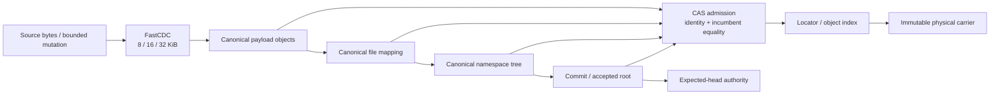

| Question | Answer |
|---|---|
| What is authoritative? | An accepted immutable root and its complete authenticated object closure. |
| Where are file bytes? | Canonical `Bytes` payload objects, ordered by a canonical file mapping. |
| What does CDC do? | Select payload boundaries. CDC is not the Merkle tree. |
| What does CAS do? | Admit immutable canonical bytes by identity and reject unequal incumbents. |
| What does COW do? | Reuse unchanged payloads/subtrees while creating changed metadata paths. |
| What is mutable? | Publication authority, workspace state, locators, projection/cache state. |
| What is physical-only? | Packs/segments, offsets, native paths, OS inodes, mounts, driver state. |

The current Stage-1 design makes a pack/index a replaceable carrier and lookup
mechanism, never canonical truth [source](../../../ephemeral-sandbox-docs/ephemelra-sanbdox-v2.1/layefs/STORAGE_AND_PERFORMANCE.md#1-canonical-object-graph).

## 2. Do not collapse the four architecture states

| State | Current source status | Authority |
|---|---|---|
| Public `layerfs-core` | Implemented primitives: Phase-1 object codec, FastCDC, in-memory CAS, COW tree, canonical-v2 K64/F64 mapping | Product source, but not the complete durable product |
| Reusable `layerfs-engine` | Implemented schema-v1 SQLite BLOB store with visible root, roots, and deltas | Real code; older and simpler than G5 benchmark Store |
| G5 benchmark Store/projector | Schema-v5 `wp4m_*`, receipts, `Verified`/`TrustedLocalDev`, expected-head publication, G5 native projector | Benchmark-private evidence implementation |
| G6 CD32-64 | Specification and analytical model only | Research arm; no G6 implementation or measured row |
| Recommended durable architecture | Stable inodes, measured extent sequence, persistent directory index, replaceable carrier/index, VFS-first reads | Proposal; requires explicit identity/format/storage ADRs |

The G5 terminal report explicitly closes benchmark mechanisms only and defers
production integration [Observed, lines 3-14](../../implementation-detail/phase-4/experiments/g5-terminal/v1/G5-TERMINAL-REPORT-v1.md#phase-4-g5-terminal-report).

### 2.1 Cross-program format authority is not yet reconciled

| Authority surface | File-tree bounds/profile | Physical model | Status |
|---|---|---|---|
| this repository, Phase-4 canonical-v2 | K64/F64; 36 B occurrences; 40 B child descriptors | current reusable engine stores SQLite BLOBs | implemented/evidenced here |
| Sandbox v2.1 Stage-1 authority | frozen M6.1.2 leaf/index fanout `1..=192 / 1..=96`; file limit 8 GiB | dense pack + exact index; pack is carrier, not truth | separate current design authority |
| G6 CD32-64 | provisional 32..64 grouping; 36/48 B entries | preserves existing CAS/SQLite publication boundary | research only |
| measured B+ rope | unselected 8 KiB planning nodes | recommends carrier/index separation | proposal only |

**Invariant:** these are not interchangeable profiles. G6 evidence over the
Phase-4 K64/F64 lineage does not silently change the Sandbox v2.1 frozen bytes,
and the Sandbox Stage-1 profile does not retroactively describe the current
`layerfs-empty` engine. A format/profile ADR, golden vectors, migration/coexistence
policy, and source-authority decision must precede consolidation. Sandbox v2.1
bounds are recorded in its current
[storage contract](../../../ephemeral-sandbox-docs/ephemelra-sanbdox-v2.1/layefs/STORAGE_AND_PERFORMANCE.md#5-bounds-and-finite-populations).

## 3. Identity model

### 3.1 Current implemented identities

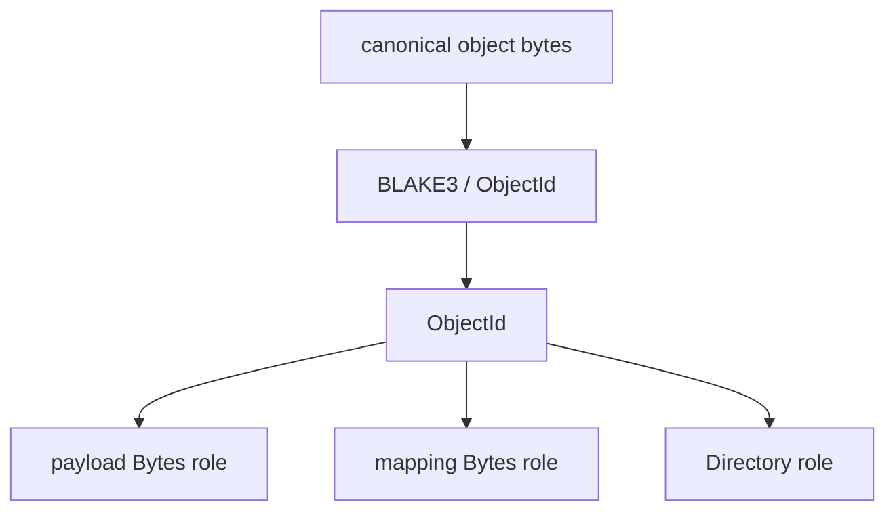

`ObjectId` currently authenticates the **complete canonical object bytes**, not
the unframed payload. `InMemoryCas::put` and `get` validate this identity, and an
occupied ID is accepted only after canonical-byte equality
[Observed](../../crates/layerfs-core/src/cas/mod.rs#L30).

### 3.2 Required explicit identities in the target architecture

| Identity | Identifies | Canonical/physical | Stable across content edit? |
|---|---|---|---:|
| `PayloadObjectId` | one canonical payload object | canonical | no |
| `MappingNodeId` | one canonical file/directory mapping node | canonical | no |
| `FileStateRoot` | one operational immutable file structure | canonical if selected as authority | no |
| `ContentDigest` | semantic file byte stream | canonical semantic digest | no |
| `InodeId` | stable filesystem object | namespace semantic identity | **yes** |
| `NamespaceRoot` | one immutable filesystem namespace state | canonical | no |
| `CommitId` / `VersionId` | one accepted filesystem state/transition | canonical | no |
| `Locator` | object ID to physical carrier/offset | replaceable physical metadata | n/a |
| Native inode/path | projected host object | physical/derived | n/a |

```text
Do not assert:
    FileStateRoot == ContentDigest == InodeId == CommitId

Required separation:
    ContentDigest  answers “which complete logical bytes?”
    FileStateRoot  answers “which operational immutable mapping?”
    InodeId        answers “which filesystem object across revisions/renames?”
    CommitId       answers “which accepted filesystem state/transition?”
```

### 3.3 Open design decision: one-content/one-root vs hard-log edits

| Choice | Root property | Arbitrary insert/delete | Main cost |
|---|---|---|---|
| G6 content-defined measured tree | Same ordered occurrence stream builds one canonical root | expected local; hard `Theta(E_suffix)` | public marker can fail to rejoin |
| Conventional measured B+ rope | update path is hard `O(log E)` | hard local path-copy | legal shape/root depends on edit history unless separately canonicalized |
| Two identities: semantic digest + operational state root | semantic equality remains explicit; operational root may be history-shaped | hard local path-copy | new identity policy, codec, migration, equivalence/GC rules |

**Recommendation, pending ADR:** if hard logarithmic arbitrary splices are a load-bearing
requirement, separate `ContentDigest` from `FileStateRoot` and use a measured B+
rope as the operational file structure. If one-content/one-root is mandatory,
retain G6 as a research arm and state its suffix-linear worst case. The G6
research rejects an ordinary B+ tree as the canonical root under the current
one-root requirement [Research, alternatives matrix](../../research/phase-4/g6-canonical-extent-tree/research-and-decision.md#6-alternatives-matrix).

## 4. Current canonical object framing

### 4.1 Phase-1 object envelope

```text
offset  bytes  field
0       4      magic = "LFSO"
4       1      kind: 0x01 Bytes | 0x02 Directory
5       4      payload_len:u32be
9       ...    payload
```

For `Bytes`:

```text
payload offset  bytes  field
0               4      value_len:u32be
4               N      value bytes

canonical_bytes_object(N) = 9 + 4 + N = 13 + N bytes
```

**Observed:** the codec has a 9-byte header, exact EOF rejection, an 8 MiB
object-field limit, and 16 MiB total-object limit
[codec](../../crates/layerfs-core/src/object/codec.rs#L7),
[limits](../../crates/layerfs-core/src/limits.rs#L4).

### 4.2 Current canonical-v2 file mapping

```text
Bytes object
└── mapping envelope
    ├── magic[8] = "LFS4MAP\0"
    ├── mapping_version:u16be = 2
    ├── role:u8
    └── role body
```

Leaf occurrence (`36 B`):

```text
FileReferenceV2 {
    raw_length:u32be,  // 4 B
    object_id:[u8;32] // 32 B
}
```

Branch descriptor (`40 B`):

```text
FileChildV2 {
    cumulative_end:u64be, // 8 B, parent-relative prefix end
    child_id:[u8;32]      // 32 B
}
```

Root body:

```text
mode:u32be
total_raw:u64be
reference_count:u64be
level:u8
child_count:u32be
children[child_count]:FileChildV2
```

| Parameter | Current value | Evidence |
|---|---:|---|
| Leaf capacity `K` | 64 references | **Observed**, [limits](../../crates/layerfs-core/src/limits.rs#L15) |
| Branch fanout `F` | 64 children | **Observed**, [limits](../../crates/layerfs-core/src/limits.rs#L16) |
| Occurrence width | 36 B | **Observed**, [canonical-v2](../../crates/layerfs-core/src/canonical_v2.rs#L15) |
| Child descriptor width | 40 B | **Observed**, [v1 persistence reused by v2](../../crates/layerfs-core/src/content/persistence.rs#L17) |
| Directory page ceiling | 256 KiB | **Observed**, [limits](../../crates/layerfs-core/src/limits.rs#L17) |

### 4.3 Why current count-changing mapping is suffix-sensitive

```text
Before insertion
child A cumulative_end = 10
child B cumulative_end = 20
child C cumulative_end = 30

Insert +3 bytes inside A
child A cumulative_end = 13  changed
child B cumulative_end = 23  changed even if subtree B is unchanged
child C cumulative_end = 33  changed even if subtree C is unchanged
```

Fixed 64-entry ordinal pages compound the problem when an occurrence is inserted:

```text
old leaves: [0..63] [64..127] [128..191] ...
insert at 1
new leaves: [0,new,1..62] [63..126] [127..190] ...
                         every later page boundary shifts
```

| 100 MiB structural occurrence edit | Total operation | File mapping only | Evidence |
|---|---:|---:|---|
| early `+1` | 196,375 B | 196,091 B | **Observed** |
| middle `+1` | 100,763 B | 100,479 B | **Observed** |
| same-count | 5,334 B | 5,050 B | **Observed** |

Source: [G6 cost model, lines 234-249](../../research/phase-4/g6-canonical-extent-tree/cost-model.md#current-observed-work).

## 5. CDC, CAS, and COW: separate algorithms

### 5.1 FastCDC payload partitioning

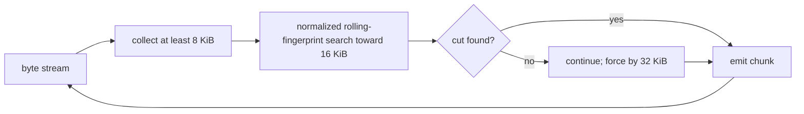

| FastCDC property | Value | Evidence |
|---|---:|---|
| minimum | 8,192 B | **Observed** |
| target | 16,384 B | **Observed** |
| maximum/ring | 32,768 B | **Observed** |
| normalization shift | 2 | **Observed** |
| seed | 0 | **Observed** |

Source: [CDC constants](../../crates/layerfs-core/src/cdc/mod.rs#L11).

Complexity:

```text
fresh scan          Theta(F)
changed window      Theta(B + resynchronization bytes)
resident CDC state  O(32 KiB)
```

### 5.2 CAS admission

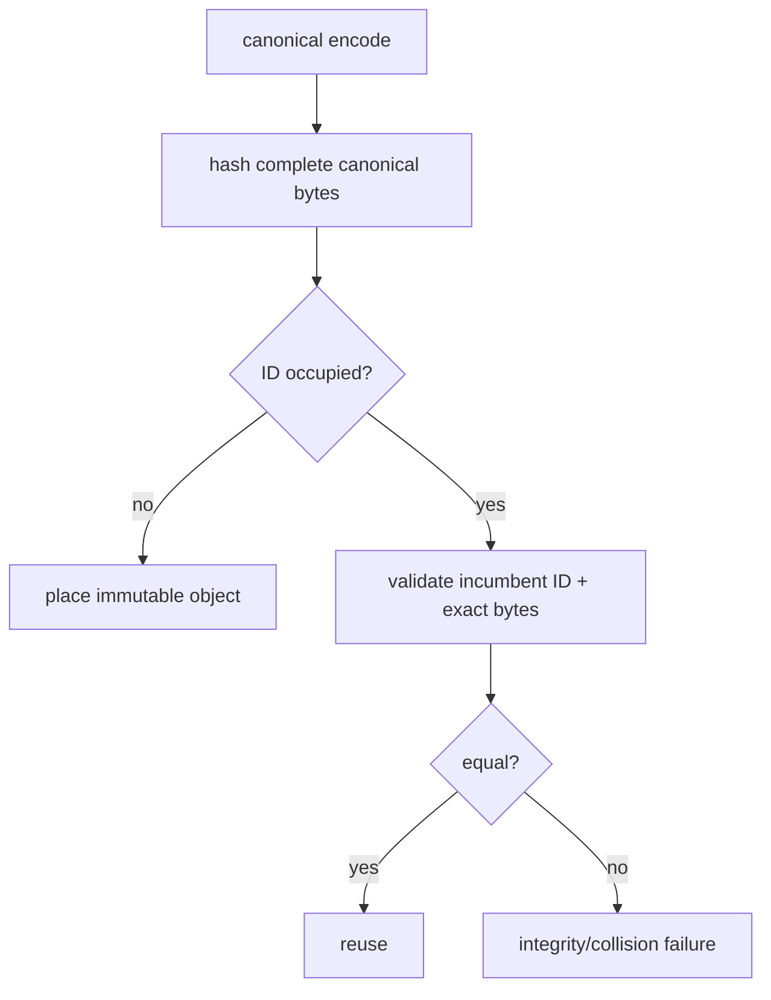

| Operation | Time | Space | Rule |
|---|---:|---:|---|
| hash/encode object | `Theta(object bytes)` | bounded stream/buffer | cannot be skipped for a new object |
| indexed ID lookup | expected `O(1)` or `O(log M)` by index | `O(1)` cursor | backend-dependent |
| occupied-ID equality | `Theta(object bytes)` | bounded comparison window | **Invariant** |
| deduplicated storage | `O(U)` payload plus metadata | persistent | unchanged object stored once |

### 5.3 COW structural reuse

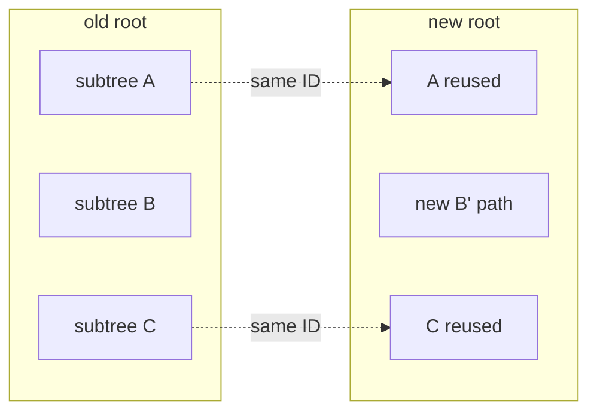

**Invariant:** COW means zero duplication of **unchanged stored payload**. It
does not promise zero reads, zero metadata, zero projection I/O, or zero kernel
copy-up [current architecture](../../../ephemeral-sandbox-docs/ephemelra-sanbdox-v2.1/layefs/ARCHITECTURE.md#36-resource-safety-and-structural-reuse-performance-model).

## 6. G6 CD32-64 research arm

### 6.1 Candidate node fields

```text
ChunkExtentV3 = raw_length:u32be + object_id:[u8;32]              // 36 B

ChildDescriptorV3 {
    subtree_raw_length:u64be,    // 8 B, local measure
    subtree_extent_count:u64be,  // 8 B, structural progress
    child_id:[u8;32]             // 32 B
}                                                               // 48 B
```

Local subtree lengths remove the current parent-relative cumulative-end cascade:

```text
before: [A len=10][B len=10][C len=10]
after:  [A' len=13][B len=10][C len=10]
                    B and C descriptors remain byte-identical
```

Exact candidate encoded-size equations:

```text
leaf(n)     = 28 + 36*n
internal(c) = 29 + 48*c
root(c)     = 49 + 48*c

max at 64:
leaf     = 2,332 B
internal = 3,101 B
root     = 3,121 B
```

All values are **Derived** from the proposed codec
[source](../../research/phase-4/g6-canonical-extent-tree/cost-model.md#2-exact-encoded-node-equations).

### 6.2 Content-defined grouping

```text
entries 1..31   no cut allowed
entries 32..63  close at first public BLAKE3 marker
entry 64        forced close
final tail      may contain <32
```

| Model value | Value | Classification |
|---|---:|---|
| expected occupancy | 51.7763 entries | **Projected**, iid digest model |
| forced cut at 64 | 36.2055% | **Projected**, iid digest model |
| fanout bounds | 32..64 except root/tail | **Research invariant** |
| height | `O(log_32 E)` | **Derived** |
| maximum root-to-leaf edges | 12 | **Derived** from `u64` count/fanout |
| simultaneously active path nodes | 13 | **Derived** |

### 6.3 Live mapping estimates

| File | Extents `E` | Packed topology | Packed bytes | 32-entry envelope | Envelope bytes |
|---:|---:|---|---:|---|---:|
| 1 MiB | **Observed 53** | 1 leaf + root | **Derived 2,033** | 2 leaves + root | **Derived 2,109** |
| 10 MiB | **Observed 531** | 9 leaves + root | **Derived 19,849** | 17 leaves + root | **Derived 20,457** |
| 100 MiB | **Observed 5,284** | 83 leaves + 2 internal + root | **Derived 196,735** | 166 leaves + 6 internal + root | **Derived 203,351** |
| 500 MiB | **Observed 26,533** | 415 leaves + 7 internal + root | **Derived 987,316** | 830 leaves + 26 internal + root | **Derived 1,020,319** |

Mapping/payload ratio stays about **0.188-0.195% Derived** in this model
[source](../../research/phase-4/g6-canonical-extent-tree/cost-model.md#3-live-topology-and-metadata).

### 6.4 Mutation envelope and hard limitation

| 100 MiB mapping path | New nodes | Bytes | Versus current early 196,091 B | Versus current middle 100,479 B |
|---|---:|---:|---:|---:|
| normal height-2 | **Derived 3** | **Derived 8,554** | 22.92x less / 95.64% | 11.75x less / 91.49% |
| cascading split | **Derived 5** | **Derived 13,987** | 14.02x less / 92.87% | 7.18x less / 86.08% |

```text
ordinary expected:
  O(k*H + unique CDC scan + leaf replay + internal replay)

hard mapping-only worst case:
  Theta(E_suffix)

successful raw fallback:
  Theta(replacement remainder + raw suffix + extent suffix)
```

**Research limitation:** the public marker can be adversarially steered; no-cut,
every-cut, repeated-ID, and chosen-marker streams can force reconstruction to EOF.
Forced maximum bounds memory, not suffix work
[spec](../../implementation-detail/phase-4/g6/g6-canonical-extent-tree-spec.md#hard-limitation).

## 7. Recommended measured B+ rope (proposal, not G6 selection)

### 7.1 Extent slices

```text
ExtentSlice {
    payload_object_id:[u8;32],
    source_offset:u32/u64,
    logical_length:u32/u64,
}
```

```text
one 32 KiB payload object
┌────────────────────────────────────────┐
│ 0..12 KiB │ 12..32 KiB                 │
└────────────────────────────────────────┘
      ▲            ▲
  slice A       slice B

Split the logical file without copying the payload object.
```

This differs materially from G6 `ChunkExtentV3`, which intentionally covers a
complete payload object with implicit source offset zero
[Research](../../implementation-detail/phase-4/g6/g6-canonical-extent-tree-spec.md#51-payload-extent-occurrence).

### 7.2 Byte-measured B+ rope

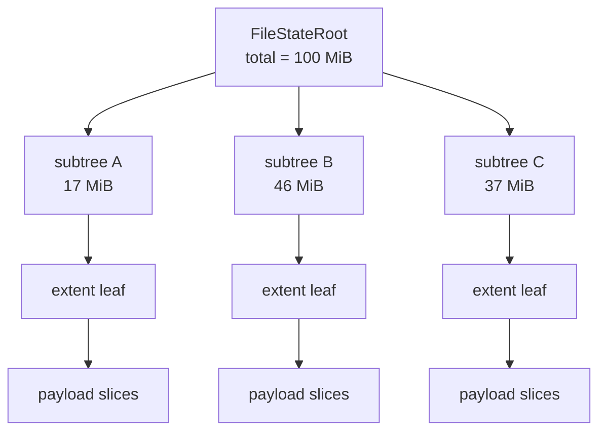

Node requirements:

| Field/rule | Purpose |
|---|---|
| subtree logical bytes | route by byte offset; earlier length change does not alter later descriptor |
| subtree extent count | bounded traversal/validation progress, including zero-length records if allowed |
| child/node ID | authenticate immutable subtree |
| minimum/maximum occupancy | hard height and resident-memory bound |
| root/tail/collapse rules | unique valid shape within the chosen operational policy |
| checked total length/count | reject overflow and malformed trees |

Operations:

```text
locate(offset)                  O(log E)
range(offset, length)          O(log E + overlapping extents + R)
split(offset)                  O(log E)
concat(left, right)            O(log E)
insert/delete                  O(B + K + log E)
ordinary mapping allocation    O(log E)
full construction              Theta(F + E)
full native export             Theta(F)
```

### 7.3 Quantified planning profile

Assumptions (**Projected**, not accepted format bytes):

```text
node maximum bytes       8,192
fixed header             64
extent/descriptor        48
maximum entries          floor((8192 - 64) / 48) = 169
planning occupancy       70% = 118 entries
```

100 MiB / 5,284-extents estimate:

```text
leaves                   ceil(5,284 / 118) = 45
root children            45
mapping objects          45 leaves + 1 root = 46
ordinary changed path    leaf 5,728 B + root 2,224 B = 7,952 B
```

| Metric | Current K64/F64 | G6 packed model | B+ planning model |
|---|---:|---:|---:|
| 100 MiB mapping objects | **Observed 86** | **Derived 86** | **Projected 46** |
| live mapping bytes | **Observed 196,055** | **Derived 196,735** | **Projected ~255-275 KiB** |
| normal count-change path | current position-dependent | **Derived 8,554 B** | **Projected 7,952 B** |
| hard arbitrary-splice bound | `Theta(E_suffix)` | `Theta(E_suffix)` | `O(log E + K + B)` if history-shaped root is allowed |

Tradeoff:

```text
mapping objects: 46 / 86 = 53.5%  -> about 46.5% fewer
live bytes:      ~265 / 191.5 KiB -> about 38% more
```

**Do not select this profile from these numbers alone.** Required evidence:
codec goldens, occupancy distributions, adversarial split/merge sequences,
same-content/different-history roots, range/read amplification, SQLite/carrier
amplification, history growth, and complete-operation wall/CPU/RSS.

## 8. Directories and stable inodes

### 8.1 Current behavior

The in-memory COW tree stores directory entries in `BTreeMap`; a mutation clones
the containing map and changed ancestor maps
[Observed](../../crates/layerfs-core/src/cow/tree.rs#L19). Persistence uses
ordered directory pages capped at 256 KiB plus an index containing page counts,
first names, and object IDs
[Observed](../../crates/layerfs-core/src/cow/persistence.rs#L21).

### 8.2 Recommended persistent namespace

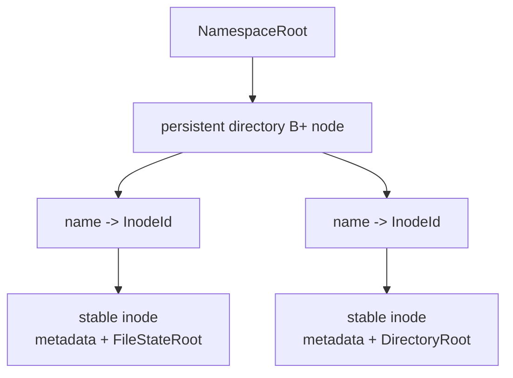

| Namespace operation | Target complexity |
|---|---:|
| lookup component | `O(log D)` |
| insert/remove one name | `O(log D)` path-copy |
| rename within/across directories | `O(log D_src + log D_dst)` plus inode/link updates |
| full `readdir` | `Theta(D)` returned entries |
| snapshot/clone accepted root | `O(1)` root/reference metadata |

Illustrative directory model (**Projected**): with 64 B/entry and three 8 KiB
changed nodes, a 100,000-entry whole-map clone is `6,400,000 / 24,576 ~= 260x`
the path-copy bytes; at 1,000,000 entries it is
`64,000,000 / 24,576 ~= 2,604x`. Actual names, inode records, occupancy, and height
must be measured.

## 9. Durable physical storage

### 9.1 Current reusable engine: SQLite BLOB authority

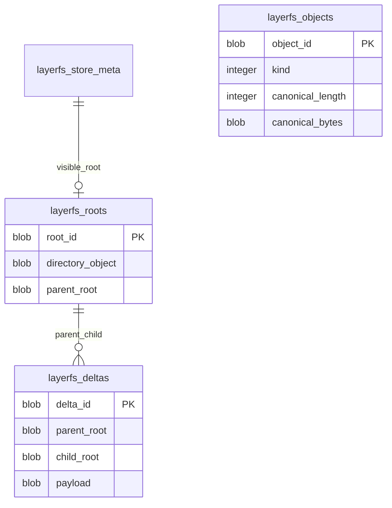

**Observed:** reusable `layerfs-engine` schema v1 stores canonical object bytes
inside SQLite and publishes `visible_root`
[schema](../../crates/layerfs-engine/src/lib.rs#L717). It uses
`BEGIN IMMEDIATE`, validates expected parent/current root, and performs one
`COMMIT` in `Capture::commit_root`
[transaction](../../crates/layerfs-engine/src/lib.rs#L404).

### 9.2 Current G5 benchmark Store: stronger, private schema

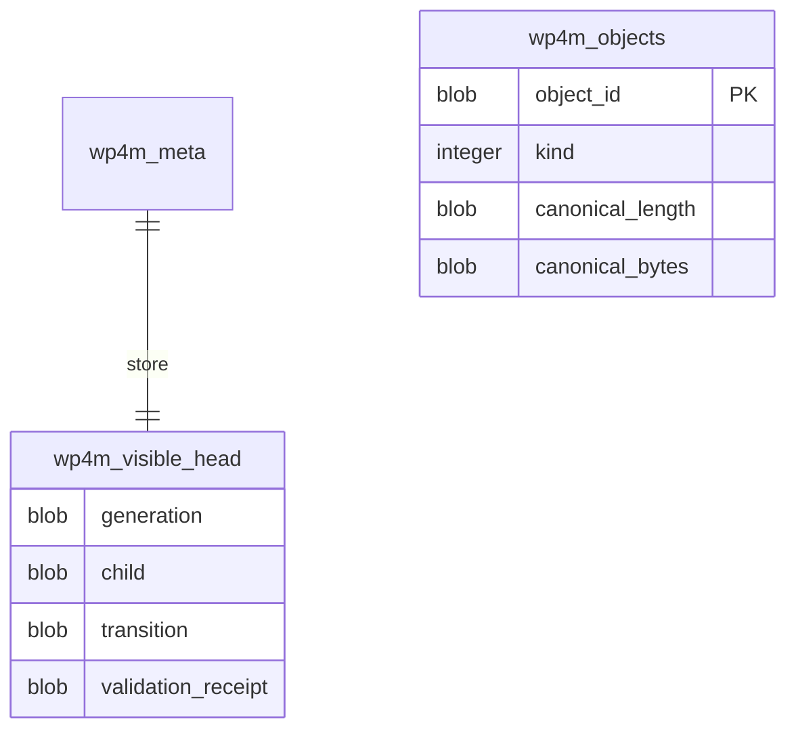

**Observed:** the benchmark Store is schema version 5, has an external authority
file, store-instance/authority/epoch bindings, visible-head receipt, and
`Verified` default with explicit `TrustedLocalDev`
[Store](../../crates/layerfs-engine/src/bin/phase4_create_edit_benchmark.rs#L2410),
[schema](../../crates/layerfs-engine/src/bin/phase4_create_edit_benchmark.rs#L2705).
It is not yet the reusable engine schema.

### 9.3 Recommended carrier/index separation

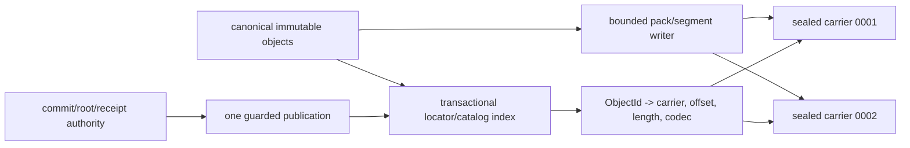

| Layer | Owns | Must not own |
|---|---|---|
| canonical object codec | identities, typed strong edges, exact bytes | physical paths/offsets |
| CAS policy | no-replace/equality, immutable visibility, typed outcomes | VFS/runtime semantics |
| carrier/segment writer | bounded append, seal, exact record framing | canonical identity |
| locator/catalog | replaceable `ObjectId -> physical record` binding | semantic equality or publication authority |
| SQLite/authority | expected head, root/commit/receipt/locator atomicity | bulk payload truth by presence alone |
| projection cache | derived native/virtual acceleration | accepted root authority |

The current Stage-1 storage contract already requires dense direct-to-pack
construction with a bounded builder and exact index, and explicitly says the
pack/index is carrier metadata rather than truth
[Invariant](../../../ephemeral-sandbox-docs/ephemelra-sanbdox-v2.1/layefs/STORAGE_AND_PERFORMANCE.md#4-packs-indexes-and-admission).

### 9.4 Publication boundary

```text
1. construct canonical objects through bounded CDC/COW
2. validate new and occupied object bytes
3. append/place immutable objects and make required bytes durable
4. prove complete closure
5. BEGIN one writer transaction / guarded authority operation
6. check expected head and exact conditions
7. install locator/root/commit/receipt metadata
8. publish new head with one COMMIT/conditional CAS
9. on ambiguous outcome: fresh authenticated readback; never blind replay
```

| Work | Expected complexity |
|---|---:|
| new immutable bytes | `Theta(new canonical bytes)` |
| object-index rows | `O(changed objects)` |
| expected-head check | `O(1)` authority lookup plus authenticated record validation |
| publication dispatch | **Invariant: at most one** |
| publication `COMMIT` | **Invariant: exactly one after state-changing publication begins** |

SQLite profile in the current engine and G5 benchmark is rollback journal
`DELETE`, `synchronous=FULL`, `temp_store=FILE`, and `mmap_size=0`
[Observed](../../crates/layerfs-engine/src/lib.rs#L683). G5 additionally freezes
the accepted cache-spill policy; no WAL/retry/pool is part of G5
[Invariant](../../implementation-detail/phase-4/experiments/g5-terminal/v1/G5-TERMINAL-REPORT-v1.md#verified-and-trusted-boundary).

## 10. Retention, reachability, and garbage collection

### 10.1 Object states

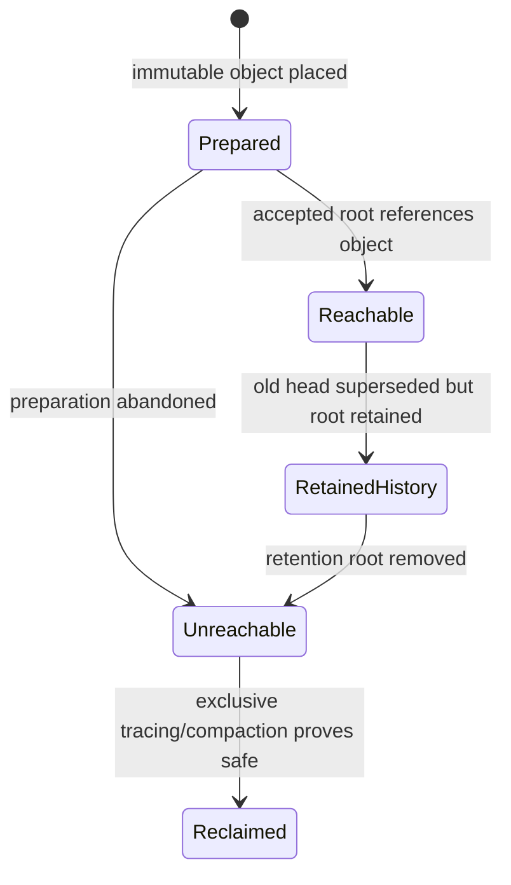

| Term | Exact meaning |
|---|---|
| current-live | reachable from current accepted head |
| history-live | reachable from another retained root/checkpoint/version |
| unreachable | reachable from no retained authority root |
| reclaimable | unreachable **and** protected by the required exclusive reader/publication/projection fence |

Do not call “not reachable from current head” garbage: retained history may still
own it.

### 10.2 Current status and future algorithm

| Capability | Status |
|---|---|
| G5 reachability/accounting | **Observed**, read-only |
| append-only retained storage | **Observed**, no destructive GC |
| global reachability certificate | **Unavailable** |
| exclusive reclamation fence | **Unavailable** |
| online/background GC | explicitly not authorized |

G5-3 retained 1,000 distinct 1 MiB revision roots; logical/apparent/allocated
store bytes were `25,964,576 / 25,964,576 / 26,398,720 B`
[Observed](../../implementation-detail/phase-4/experiments/g5-terminal/v1/G5-TERMINAL-REPORT-v1.md#protected-operations-and-resources).

Recommended eventual offline trace:

```text
inputs: exact retained-root set + exclusive no-writer/no-reader/no-projector fence

mark:
  for each retained root:
    authenticate root
    traverse typed strong edges
    mark ObjectId / carrier record

sweep/compact:
  copy surviving immutable records to new sealed carriers
  atomically replace locator manifest
  prove no live locator references old carrier
  remove old carrier
```

Complexity:

```text
full mark            Theta(reachable objects + strong edges)
full compaction I/O  Theta(surviving canonical bytes)
mark memory          bounded frontier + file-backed mark/index
automatic mutation-path GC  forbidden
```

The v2.1 planning note requires an authenticated incremental closure/refcount
certificate before safe reclamation and keeps GC as a separately admitted
operation [Planning, lines 54-68](../../../ephemeral-sandbox-docs/ephemelra-sanbdox-v2.1/layefs/read_after_l1.5.5.md#2-the-two-milestones-and-their-dependency).

## 11. End-to-end space equation

```text
total physical storage =
    unique canonical payload bytes
  + live file/directory mapping bytes
  + retained-history-only mapping/payload bytes
  + commit/version/receipt metadata
  + locator/catalog/index bytes
  + carrier framing and allocation slack
  + unreachable immutable preparation residue
  + derived projection/materialization caches
```

Target asymptotic shape:

| Component | Space |
|---|---:|
| unique payload | `O(U)` |
| live file mappings | `O(E)` |
| ordinary B+ edit mapping | `O(log E)` new nodes |
| retained B+ mapping history | `O(J log E)` absent dedup/splits |
| namespace | `O(total entries)` |
| one namespace mutation | `O(log D)` new nodes |
| object locator index | `O(stored objects)` |
| exact/latest mailbox | `O(1)` |
| native/virtual caches | explicit policy bound; derived, disposable |

## 12. Decisive quantified anchors

| Metric | Value | Class | Scope |
|---|---:|---|---|
| FastCDC min/target/max | 8,192 / 16,384 / 32,768 B | **Observed** | current core |
| 100 MiB occurrences | 5,284 | **Observed** | retained fixture |
| average chunk at 100 MiB | `104,857,600 / 5,284 = 19,844.36 B` | **Derived** | retained fixture |
| current 100 MiB mapping | 86 objects / 196,055 B | **Observed** | canonical-v2 |
| G6 packed mapping | 86 objects / 196,735 B | **Derived** | research codec |
| G6 32-entry envelope | 173 objects / 203,351 B | **Derived** | research codec |
| B+ planning mapping | ~46 objects / ~255-275 KiB | **Projected** | 8 KiB/70% profile |
| G5-3 retained revisions | 1,000 | **Observed** | 1 MiB same-size history |
| G5-3 store bytes | 25,964,576 logical; 26,398,720 allocated | **Observed** | accepted gate |
| G5-3 peak RSS | 18,923,520 B | **Observed** | accepted gate |

## 13. Required design gates before implementation

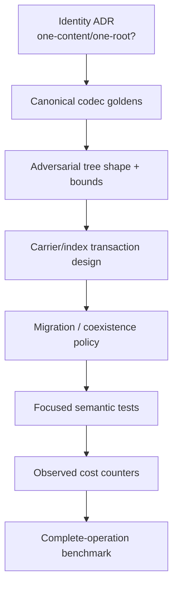

| Gate | Must prove |
|---|---|
| identity | `FileStateRoot`, `ContentDigest`, inode, version, and physical locator roles cannot be confused |
| codec | canonical field order, widths, bounds, exact EOF, golden bytes/ObjectIds |
| edit | insert/delete/overwrite/append/truncate preserve exact bytes under arbitrary split/merge sequences |
| adversarial | minimum/maximum occupancy, repeated IDs, zero-length rules, chosen markers, worst-case replay |
| storage | immutable placement, occupied-ID equality, one publication boundary, ambiguous readback |
| history | retained roots remain readable; storage slope and reachability are exact |
| migration | v1/v2 IDs remain immutable; new profile cannot silently open an old store |
| evidence | observed, derived, projected, invariant, unavailable remain distinct |

## 14. Source authority map

| Subject | Decisive source |
|---|---|
| canonical object codec | [`object/codec.rs`](../../crates/layerfs-core/src/object/codec.rs) |
| FastCDC profile | [`cdc/mod.rs`](../../crates/layerfs-core/src/cdc/mod.rs) |
| CAS equality/identity | [`cas/mod.rs`](../../crates/layerfs-core/src/cas/mod.rs) |
| canonical-v2 mapping | [`canonical_v2.rs`](../../crates/layerfs-core/src/canonical_v2.rs) |
| current COW tree | [`cow/tree.rs`](../../crates/layerfs-core/src/cow/tree.rs) |
| directory persistence | [`cow/persistence.rs`](../../crates/layerfs-core/src/cow/persistence.rs) |
| reusable SQLite engine | [`layerfs-engine/src/lib.rs`](../../crates/layerfs-engine/src/lib.rs) |
| G5 terminal measurements/limits | [`G5-TERMINAL-REPORT-v1.md`](../../implementation-detail/phase-4/experiments/g5-terminal/v1/G5-TERMINAL-REPORT-v1.md) |
| G6 codec/cost arm | [`cost-model.md`](../../research/phase-4/g6-canonical-extent-tree/cost-model.md) |
| G6 candidate specification | [`g6-canonical-extent-tree-spec.md`](../../implementation-detail/phase-4/g6/g6-canonical-extent-tree-spec.md) |
| current Stage-1 storage contract | [`STORAGE_AND_PERFORMANCE.md`](../../../ephemeral-sandbox-docs/ephemelra-sanbdox-v2.1/layefs/STORAGE_AND_PERFORMANCE.md) |
| current component boundaries | [`ARCHITECTURE.md`](../../../ephemeral-sandbox-docs/ephemelra-sanbdox-v2.1/layefs/ARCHITECTURE.md) |
| platform/driver qualification | [`supported_platform_driver.md`](../../../ephemeral-sandbox-docs/ephemelra-sanbdox-v2.1/supported_platform_driver.md) |
