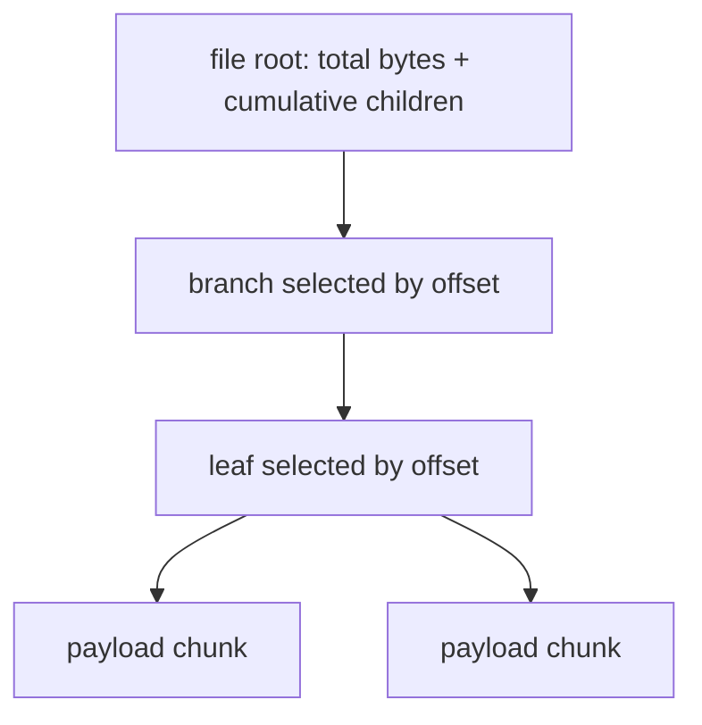
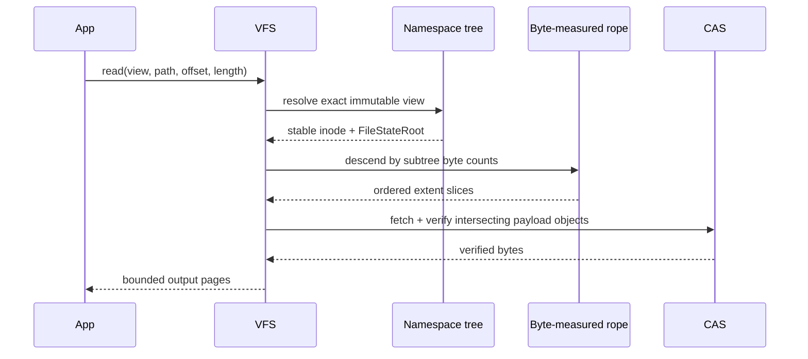
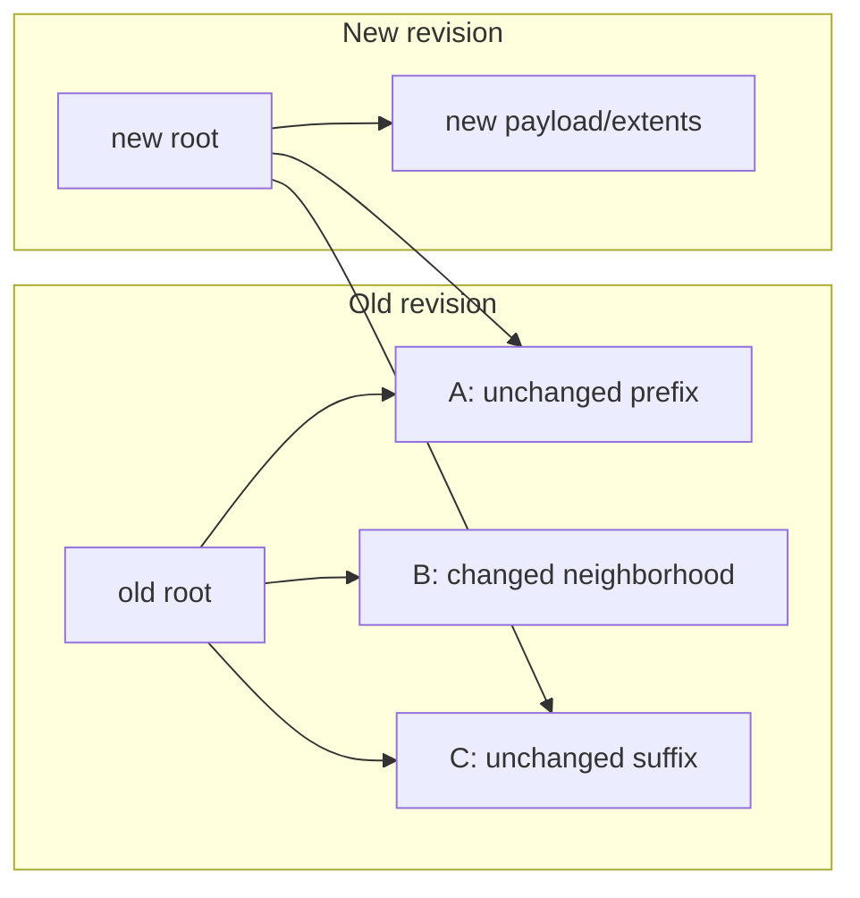
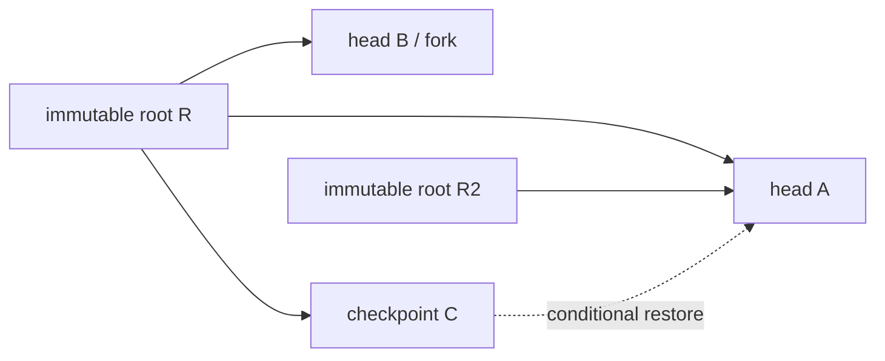
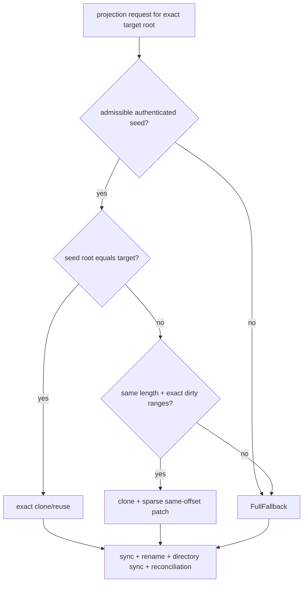
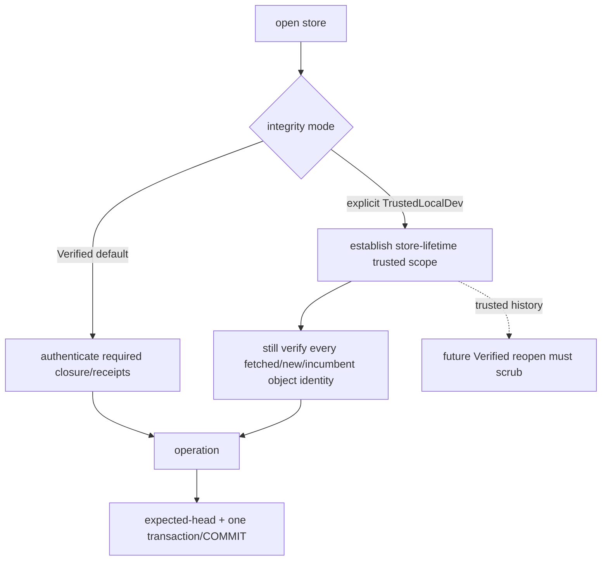
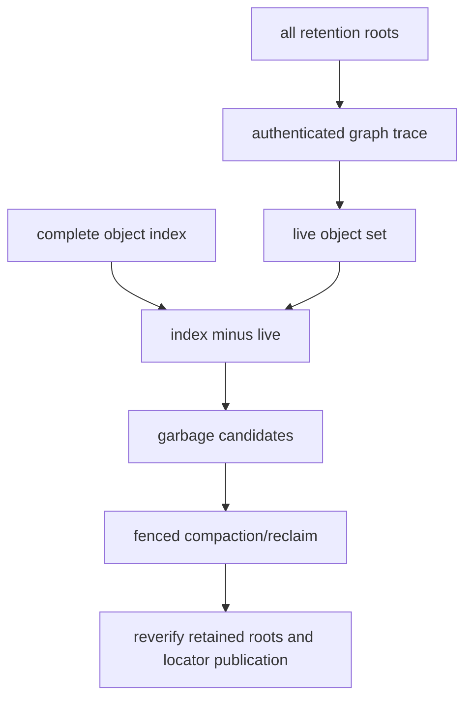

# LayerFS operation algorithms

> **Status:** architecture instruction and comparison. `CURRENT` statements are
> source-observed; `G5` statements are retained benchmark evidence; `TARGET`
> statements describe a byte-measured persistent B+ extent rope and are not yet
> implemented or measured.

## 1. Notation

| Symbol | Unit | Meaning |
|---|---:|---|
| `F` | bytes | complete logical file length |
| `N` | extents | extents/chunk occurrences in the file |
| `B` | bytes | newly supplied or changed payload bytes |
| `P` | bytes | old-coordinate edit position |
| `K` | extents | extents genuinely intersected or replaced |
| `R` | bytes | bytes returned by a read |
| `C_R` | objects | payload objects intersecting a read |
| `D` | entries | entries in one directory |
| `d` | levels | path depth in the namespace |
| `H` | levels | file extent-tree height; `O(log N)` when fanout is bounded below |
| `S` | bytes | authenticated current closure/seed bytes |
| `U` | objects | unique reachable objects under retained roots |
| `V` | revisions | retained immutable revisions |
| `Q` | bytes | explicitly owned logical userspace memory |

## 2. Evidence labels

| Label | Meaning |
|---|---|
| **Observed** | Direct source fact or retained raw/terminal measurement |
| **Derived** | Arithmetic from named observed/model inputs; equation shown |
| **Projected** | Target design cost; requires implementation and measurement |
| **Invariant** | Mechanically required property, not an observed counter value |
| **Unavailable** | No supporting observation; never serialized as numeric zero |

## 3. Operation taxonomy

| Operation | Exact semantics | Creates a new logical revision? | Minimum unavoidable work |
|---|---|:---:|---:|
| `get(path)` | Resolve metadata/kind in one immutable view; no payload read required | no | namespace lookup |
| `read(path, offset, length)` | Return exact bytes from one immutable view | no | `Omega(R)` |
| full read | Return every logical byte | no | `Theta(F)` |
| `write(offset, bytes)` | POSIX overwrite; extends at EOF if necessary; does **not** insert into the middle | yes | `Omega(B)` |
| replace range | Replace `[start,end)` with supplied bytes; may change length | yes | `Omega(B)` plus affected-boundary work |
| insert | Add bytes at `P`; logical suffix offsets shift | yes | `Omega(B)` |
| delete | Remove a byte interval; logical suffix offsets shift left | yes | boundary/path work; deleted bytes need not be copied |
| append | Insert at EOF | yes | `Omega(B)` |
| truncate | Remove suffix after new EOF | yes | boundary/path work |
| full replace | Replace all file content with caller stream | yes | `Theta(F_new)` |
| create/remove/move entry | Change namespace topology | yes | affected directory/path work |
| snapshot/checkpoint | Add a reference to an existing immutable root | reference only | `Omega(1)` |
| clone/fork | Create another head/workspace rooted at an existing version | reference/workspace metadata only | `Omega(1)` |
| rollback/restore | Conditional head move to an existing retained root | reference only | `Omega(1)` |
| commit/publish | Expected-head guarded publication of a prepared immutable closure | publishes revision | changed-object metadata + durable transaction |
| project | Make a derived virtual/native view match an exact committed root | no authority mutation | route-dependent |
| materialize/export | Produce a complete contiguous native file/tree | no authority mutation | `Omega(F)` destination bytes |
| reopen | Construct a store handle and establish integrity authority | no | mode-dependent |
| scrub | Authenticate a reachable closure | no | `Theta(reachable objects/bytes)` |
| GC | Reclaim objects unreachable from **all** retained roots | no logical revision required | `Theta(reachable + candidate garbage)` full trace |

## 4. End-to-end state transition


### Publication ordering

```text
1. Validate request shape, path, bounds, and expected base.
2. Construct and authenticate new immutable payload/mapping/namespace objects.
3. Make required immutable object bytes durable.
4. BEGIN one writer transaction.
5. Re-read and compare expected head.
6. Record object locations, transition/receipt, and new root.
7. Publish the new visible head.
8. Dispatch exactly one publication COMMIT.
9. If COMMIT outcome is ambiguous, perform fresh state reconciliation;
   never blindly redispatch the mutation.
```

**Current source anchors:**

- [`Engine::begin_capture`](../../crates/layerfs-engine/src/lib.rs) uses
  `BEGIN IMMEDIATE`, reads the visible root, and rejects `ParentMismatch`.
- [`Capture::commit_root`](../../crates/layerfs-engine/src/lib.rs) authenticates
  the directory object, updates `visible_root`, and executes one `COMMIT`.
- The retained G5 product path additionally qualifies reconciliation and the
  one-transaction/one-COMMIT rule; see
  [`G5-TERMINAL-REPORT-v1.md`](../../implementation-detail/phase-4/experiments/g5-terminal/v1/G5-TERMINAL-REPORT-v1.md).

## 5. Point and range read

### 5.1 Current public-core path

[`LogicalFile::read_range`](../../crates/layerfs-core/src/content/mod.rs)
iterates the flat `Vec<ChunkReference>` from the first reference until the end
of the requested range.

```text
offset = 0
for reference in file.chunks:
    chunk_end = offset + reference.length
    if chunk_end <= request.start: skip
    else:
        payload = CAS.get(reference.id)       // identity checked
        emit intersection(payload, request)
    if offset >= request.end: break
```

| Path | Time | Extra memory |
|---|---:|---:|
| point/range near beginning | `O(C_R + R)` best case | `O(R)` returned buffer today |
| point/range near end | `O(N + C_R + R)` | `O(R)` |
| full read | `Theta(N + F)` = `Theta(F)` at bounded chunk size | `O(F)` if accumulated |

### 5.2 Current persistent K64/F64 benchmark path

The selected mapping profile has 64 references per leaf and 64 children per
branch; child descriptors carry cumulative byte ends. Offset routing is tree
based rather than flat-vector based.



```text
T_range = O(64 * H + C_R + R)
```

`64` is a fixed profile constant. A bounded/binary search can reduce comparisons
inside a decoded node, but object fetches remain root-to-leaf plus payloads.

### 5.3 Target byte-measured B+ rope

```text
read(root, offset, length):
    node = root
    local = offset
    while node is branch:
        child = first child whose cumulative byte end > local
        local -= bytes before child
        node = fetch_and_verify(child.id)
    for extent slices overlapping [local, local + length):
        payload = fetch_and_verify(extent.payload_id)
        emit payload[extent.payload_offset ..][requested intersection]
```

```text
T_point = O(log N + payload bytes returned)
T_range = O(log N + C_R + R)
Q_range = O(H * node_size + bounded payload batch + bounded output page)
```



## 6. Full create and full replace

```text
full_replace(input):
    stream input once through FastCDC
    for each chunk:
        canonical = encode(chunk)
        id = hash(canonical)
        CAS.put_if_absent(id, canonical)       // incumbent equality checked
        append extent(chunk id, length)
    build mapping bottom-up in bounded batches
    path-copy inode/namespace ancestors
    publish with expected-head transaction
```

| Work | Complexity | Classification |
|---|---:|---|
| source stream + CDC + payload hashing | `Theta(F_new)` | lower bound/invariant |
| mapping construction | `Theta(N_new)` | invariant at bounded chunk size |
| destination native export, if requested | `Theta(F_new)` | lower bound |
| resident construction state | bounded CDC window + partial nodes + SQL batch | target |

No extent-tree design makes full creation, full read, or full export
sublinear in the bytes explicitly requested.

## 7. Same-size overwrite

### 7.1 Semantics

```text
old: [prefix][bytes being replaced][suffix]
new: [prefix][new bytes, same length][suffix]
```

### 7.2 Current public-core algorithm

[`LogicalFile::replace_range`](../../crates/layerfs-core/src/content/mod.rs):

```text
1. Find chunk containing edit start and suffix boundary.
2. Read old prefix fragment + replacement + bounded old probe window.
3. Run CDC over that local scan input.
4. Require exact two-chunk rejoin within MAX_REJOIN_WINDOW_BYTES (1 MiB).
5. Reuse old prefix and converged suffix chunk identities.
6. Construct a new flat Vec<ChunkReference>.
7. Return BoundedResynchronization on failure; do not silently full-replace.
```

| Component | Work |
|---|---:|
| CDC/payload work on successful rejoin | `O(B + local resynchronization)` |
| locate boundaries in flat vector | `O(N)` current public core |
| construct new flat vector | `O(N)` reference copies |
| CAS identity checks | `Theta(new/reused touched canonical bytes)` |

### 7.3 Target rope algorithm

```text
overwrite(root, P, old_len=B, replacement):
    left, tail  = split(root, P)
    removed, right = split(tail, B)
    changed_context = bounded CDC context(left edge, replacement, right edge)
    replacement_extents = CDC + CAS(changed_context)
    result = concat(left_without_context, replacement_extents, right_after_rejoin)
    publish(result)
```

```text
Expected: O(B + local CDC resynchronization + K + log N)
Mapping allocation: O(log N) ordinary path; O(log N) plus split nodes
```

**No-win case:** current K64/F64 same-count mapping rewrites only 5,050 bytes
on the retained 100 MiB structural fixture; the nominal target B+ path models
7,952 bytes. The target must retain an inline/small-file form and must not claim
that every same-size edit improves.

## 8. Insert and delete

### 8.1 Insert

```text
insert(root, P, bytes):
    left, right = rope.split_at_byte(P)
    replacement = CDC_and_CAS(bytes + bounded boundary context)
    root2 = rope.concat(left, replacement, right)
    publish(root2)
```

### 8.2 Delete

```text
delete(root, P, length):
    left, tail = rope.split_at_byte(P)
    discarded, right = tail.split_at_byte(length)
    repaired_boundary = CDC_and_CAS(bounded left/right boundary context)
    root2 = rope.concat(left_without_context, repaired_boundary, right_without_context)
    publish(root2)
```

### 8.3 Object-graph comparison



| Representation | Expected mapping work for count change |
|---|---:|
| current fixed-radix positional mapping | `Theta(N_suffix)` when occurrence count changes |
| G6 CD32–64 research candidate | expected local `O(B + resync + H)`; hard fallback `Theta(raw suffix + mapping suffix)` |
| target byte-measured B+ rope with explicit extent slices | `O(B + K + log N)` structural path; CDC boundary work remains sequence-dependent |

The target rope avoids downstream **position renumbering**. It does not remove
CDC work on changed bytes, object hashing, or a fallback required by a separately
chosen CDC-rejoin contract.

## 9. Append and truncate

### Append

```text
append(root, bytes):
    last_leaf = descend_to_right_edge(root)
    CDC(last boundary context + bytes)
    CAS new chunks
    replace/split right-edge leaf
    path-copy right spine
```

```text
T_append = O(B + local CDC work + log N)
new mapping = O(log N)
```

### Truncate

```text
truncate(root, new_length):
    left, removed_suffix = split_at_byte(root, new_length)
    canonicalize final boundary leaf
    publish(left)
```

```text
T_truncate = O(log N + boundary work)
new mapping = O(log N)
```

Removed payload/mapping objects remain reachable from retained historical
roots. Reclamation is a later GC decision, never part of truncate correctness.

## 10. Namespace operations

### 10.1 Current public-core behavior

Current [`TreeNode`](../../crates/layerfs-core/src/cow/tree.rs) directories own
`BTreeMap<CanonicalName, TreeNode>`. `add_child`, `remove_child`, and
`replace_child` clone the complete map; `provisional_id` hashes every entry.
Every ancestor on the path is rebuilt.

```text
lookup(path)       = sum_i O(log D_i)
mutation(path)     = sum_i O(D_i) map clone/hash over changed ancestor spine
rename(from, to)   = remove spine + add spine; shared ancestors may be rebuilt twice
```

### 10.2 Target persistent directory B+ tree

```text
lookup(path):
    for component in path:
        inode = directory_btree_lookup(inode.directory_root, component)

insert/remove entry:
    path-copy one directory B+ search path
    update inode
    path-copy namespace ancestor path

rename:
    validate source/destination and illegal descendant topology
    apply source removal + destination insertion in one workspace mutation
    union shared changed paths
    publish atomically
```

| Operation | Target time | New metadata |
|---|---:|---:|
| one directory lookup | `O(log D)` | `O(1)` |
| full canonical list | `Theta(D)` | bounded output page |
| create/unlink entry | `O(log D)` | `O(log D)` nodes |
| rename | `O(log D_src + log D_dst + shared namespace depth)` | union of changed paths |

Directory ordering, stable inode identity, link count, and rename atomicity are
separate from file-payload structure.

## 11. Snapshot, clone/fork, checkpoint, and rollback



| Operation | Data copied | Time target | Authority mutation |
|---|---:|---:|---|
| snapshot/checkpoint save | no payload | `O(1)` reference record | create/move named reference |
| clone/fork | no unchanged payload | `O(1)` head/workspace metadata | new independent head/workspace |
| rollback/restore | no payload/version rewrite | `O(1)` conditional reference move | expected-token guarded |
| delete checkpoint | no immediate payload deletion | `O(1)` reference delete | GC eligibility may change |

Rollback must not mutate an already-open workspace or claim freshness it cannot
prove. G5 records rollback freshness as `NotProtected` without external authority.

## 12. Native materialization and projection

### 12.1 Definitions

| Term | Authoritative? | Output |
|---|:---:|---|
| virtual read/view | yes: reads committed object graph | requested byte ranges |
| native materialization/export | no | complete contiguous file/directory tree |
| native projection cache | no | derived native state keyed to exact committed root |

### 12.2 Route decision



### 12.3 Complexity

| Route | Complete logical work | Payload-only route work | Status |
|---|---:|---:|---|
| G5 exact clone | `Theta(S)` because whole-seed descriptor hash precedes clone | clone metadata / changed native bytes `O(B)` | **Observed correction** |
| G5 same-offset sparse patch | `Theta(S+B)` because whole-seed hash + dirty ranges | `O(B)` patch | **Observed correction** |
| different length G5 fallback | `Theta(F_target + N)` | destination writes `Omega(F_target)` | **Observed qualified correctness** |
| target virtual view | `O(log N + C_R + R)` per read; no full native file | only requested ranges | **Projected** |
| target full native export | `Theta(F + N)` | destination writes `Omega(F)` | lower bound |

The G5 service samples cover worker `T3` through native ACK `T4`, not the
foreground edit from `T0`. The complete path must not claim sublinear exact or
sparse projection until seed authority removes the whole-seed hash safely.

### 12.4 Count-changing native-file lower bound

For a contiguous file, inserting `B` bytes at `P` requires moving a suffix of
`S_suffix = F-P` unless the filesystem exposes and qualifies a different native
primitive.

```text
shift-and-patch logical transfer = 2*S_suffix + B
full fallback destination writes >= F + B
virtual rope commit              = changed payload + changed tree path
```

Native work is not deleted; virtual visibility removes it from the authoritative
edit critical path and makes export a separable derived operation.

## 13. Exact/latest projection mailbox

```mermaid
stateDiagram-v2
    [*] --> Idle
    Idle --> InFlight: submit request
    InFlight --> InFlightPending: submit latest-following
    InFlightPending --> InFlightPending: newer latest replaces compatible pending latest
    InFlightPending --> InFlight: publish current; start pending
    InFlight --> Idle: publish/fail current
    Idle --> Shutdown: close
    InFlight --> Shutdown: rendezvous after current finalization
```



| Policy | Coalescible? | Required result |
|---|:---:|---|
| `ExactEveryRoot(root)` | no | requested exact root published or explicit failure |
| `LatestFollowing(root)` | yes, only with compatible chain/stream | latest surviving root published |
| isolated sentinel/fault | no | exact predeclared outcome |

```text
retained scheduler state = O(1) in-flight + O(1) pending
submit bookkeeping       = O(1)
projection work          = selected route cost
```

**Observed G5-2:** 169 submissions, 70 started, 70 published, 99 coalesced;
64 Exact and 100 Latest policy populations; projection SQLite writer
transactions/COMMITs were `0/0`. Authority:
[`FINAL-SCOREBOARD-v1.tsv`](../../implementation-detail/phase-4/experiments/g5-terminal/v1/FINAL-SCOREBOARD-v1.tsv),
G5-2 rows.

## 14. Reopen, integrity modes, and scrub



| Work | Verified | TrustedLocalDev |
|---|---|---|
| default | yes | no; explicit opt-in |
| store-lifetime policy | yes | yes |
| eager current/parent closure scrub | required by Verified authority | selected eager scrub may be omitted |
| fetched object identity | unconditional | unconditional |
| new/incumbent object identity | unconditional | unconditional |
| receipt decode, expected head, COMMIT, reconciliation | required | required |
| trusted assumption becomes Verified receipt authority | never applicable | forbidden |
| Verified reopen after Trusted history | scrub | scrub cannot be bypassed |

```text
Verified scrub = Theta(reachable authenticated objects/bytes)
Trusted warm edit = changed-path work + touched/new authentication
```

`TrustedLocalDev` is an integrity policy, not user authentication and not a
promise that crashes are harmless.

## 15. History and exact historical reads

```text
revision root V0 ──shares──► unchanged subtrees/payload
revision root V1 ──new─────► changed path + changed payload
revision root V2 ──new─────► changed path + changed payload
checkpoint         ────────► selected immutable root
```

| Operation | Intended work |
|---|---:|
| append retained revision reference | `O(1)` reference plus edit work |
| exact historical lookup | root/index lookup + operation-local read |
| exact historical range read | `O(log N + C_R + R)` target |
| retained-union statistics | `Theta(V + U)` |
| current-root reachability only | does **not** prove retained-union garbage |

G5-3 retained 1,000 distinct 1 MiB revision states and reconstructed revisions
1/10/100/1,000 plus terminal 1,001. This is a warm same-size one-child mechanism,
not random-history or count-changing scaling evidence.

## 16. Garbage collection and compaction

### Safety prerequisite



```text
full mark       = Theta(reachable objects + strong edges)
sweep classify  = Theta(indexed objects)
compact         = Theta(surviving bytes copied from selected carriers)
memory          = bounded external mark/index strategy; not an unbounded HashSet
```

Required rules:

1. Trace **all** current heads, saved versions, active immutable views, and
   publication/recovery pins.
2. Never treat “unreachable from current head” as globally reclaimable.
3. Build new carriers/segments before atomically replacing locators.
4. Delete old carriers only after reader fencing and durable locator publication.
5. Run as a separately admitted operation; never hide compaction inside edit time.

G5 implemented read-only reachability only.
`stored/current-live/current-unreachable = 6,059/58/6,001` is not proof that
6,001 objects may be deleted: retained history can reference them.

## 17. SQL and object-I/O batching

```text
mapping traversal:
    bounded root-to-leaf cursor
payload retrieval:
    gather <= batch_capacity object IDs
    one bounded query/index lookup batch
    fetch/verify in canonical logical order
construction:
    append immutable bytes in bounded carriers/segments
    insert object-location rows in bounded batches
publication:
    one foreground writer transaction + one COMMIT
projection:
    read-only/query-only; zero writer transactions/COMMITs
```

Batching changes crossings and constants; it does not change `Theta(number of
records)` index work and is not by itself a wall-time speedup claim.

## 18. Crash matrix

| Cut | Durable authority | Required recovery |
|---|---|---|
| before immutable append | old head | remove owned temp state |
| partial append | old head | validate/truncate only owned incomplete tail |
| immutable bytes durable, before writer transaction | old head | orphan objects safe; later GC eligible |
| before visible-head update | old head | transaction rollback |
| after head update, before COMMIT return | old or new atomically | fresh reconcile from durable head/receipt |
| COMMIT success returned | new head | no redispatch |
| projection clone/patch failure | committed root remains authority | retry/rebuild derived projection only when requested |
| projection rename ACK lost | committed root unchanged by projection | inspect exact destination identity/root; reconcile |
| shutdown with in-flight projection | committed root remains authority | bounded rendezvous/finalization; zero owned residue |

## 19. Operation-to-counter map

| Operation | Minimum authoritative counters |
|---|---|
| read | mapping nodes, payload objects/batches, canonical bytes authenticated, returned bytes, amplification |
| overwrite/insert/delete | input bytes, CDC scan bytes, resync/replay, `DeltaB`, `DeltaE`, extents created/reused, suffix reuse |
| COW mapping | node height/occupancy, nodes/bytes created/reused, split/merge/root grow/shrink |
| commit | expected-head result, transactions, COMMIT dispatch/return, reconciliation, complete wall |
| projection | requested policy, selected route, seed admission, clone/patch/fallback bytes, sync/rename/reconcile, T0–T4 |
| namespace | entries searched, directory nodes copied/reused, name bytes, source/destination spine union |
| history | retained roots, current-live, retained-union, unreachable classification, logical/apparent/allocated bytes |
| resources | `Q` equation/current/high-water/terminal, RSS, largest buffer, descriptors, connections, temp residue |

## 20. Provenance and conflicts

| Source | Authority used here | Important boundary |
|---|---|---|
| [`crates/layerfs-core/src/content/mod.rs`](../../crates/layerfs-core/src/content/mod.rs) | current public-core flat file/read/edit source | not the G5 durable benchmark Store |
| [`crates/layerfs-core/src/content/persistence.rs`](../../crates/layerfs-core/src/content/persistence.rs) | current K64/F64 codec/profile source | byte-measured B+ rope not implemented |
| [`crates/layerfs-core/src/cow/tree.rs`](../../crates/layerfs-core/src/cow/tree.rs) | current namespace clone/hash behavior | provisional in-memory identity, not frozen persistent namespace codec |
| [`crates/layerfs-engine/src/lib.rs`](../../crates/layerfs-engine/src/lib.rs) | current public schema-v1 SQLite engine | G5 uses benchmark-private later Store/schema paths |
| [`G5 terminal report`](../../implementation-detail/phase-4/experiments/g5-terminal/v1/G5-TERMINAL-REPORT-v1.md) | accepted G5 benchmark result | benchmark mechanism; not VFS/SDK production integration |
| [`G6 cost model`](../../research/phase-4/g6-canonical-extent-tree/cost-model.md) | analytical CD32–64 equations | no G6 implementation or measured row |
| `ephemeral-sandbox-docs/.../layefs/SPEC.md` | older V2.1 operation vocabulary/targets | separate repository; targets are not G5 observations |
| `ephemeral-sandbox-docs/.../layefs/STORAGE_AND_PERFORMANCE.md` | older bounded-resource and work-shape targets | no fixed latency/RSS claim without its own measurement |
| `ephemeral-sandbox-docs/.../layefs/read_after_l1.5.5.md` | planning targets for incremental closure and GC | explicitly “planning note, not benchmark evidence” |
