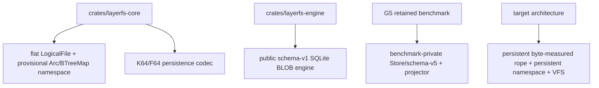

# LayerFS performance, complexity, and quantified models

> **Rule:** a byte/object/query reduction is not a wall-time multiplier. Every
> table labels evidence as **Observed**, **Derived**, **Projected**, or
> **Invariant**. `Projected` values require exact-source implementation evidence
> before becoming product claims.

## 1. Parameter model

| Symbol | Meaning |
|---|---|
| `F` | complete logical file bytes |
| `N` | ordered payload extents/chunk occurrences |
| `B` | changed or newly supplied payload bytes |
| `K` | extents actually affected by an edit |
| `R` | returned range bytes |
| `C_R` | payload objects intersecting the range |
| `P` | old-coordinate edit position |
| `N_suffix` | extents after the earliest unresolved edit/rejoin point |
| `D` | entries in one directory |
| `d` | namespace path depth |
| `H` | file-tree height |
| `V` | retained revision count |
| `U_V` | unique objects reachable from retained revisions |
| `S` | authenticated current closure/native seed bytes |
| `Q` | owned logical userspace bytes |

## 2. Three representations being compared

| Name | Current state | Fanout/entry model | Key property | Worst structural count-change behavior |
|---|---|---|---|---:|
| public-core flat `LogicalFile` | **Observed source** | `Vec<ChunkReference>` | simple; range scan and edits rebuild vectors | `O(N)` refs |
| current persistent K64/F64 | **Observed source + G4/G5 benchmark path** | 64 refs/leaf; 64 children/branch; positional/cumulative descriptors | logarithmic routing; compact same-count changed spine | `Theta(N_suffix)` when occurrence count changes |
| G6 CD32–64 candidate | **Projected analytical research** | natural cut after 32, forced at 64; 36-byte leaf entry; 48-byte child | content-defined subtree rejoin may preserve suffix subtrees | expected local; hard fallback `Theta(N_suffix + raw suffix)` |
| byte-measured B+ extent rope | **Projected design** | model: 8 KiB node; 48-byte extent/child; 169 max, 118 nominal entries | byte measures + extent slices avoid positional suffix renumbering | `O(K + log N)` structural path; CDC work remains separate |

### Current source split



Do not report the G5 benchmark-private Store/projector as already integrated
into `layerfs-core`, `layerfs-engine`, or `layerfs-vfs`.

## 3. Observed G5 benchmark baseline

### 3.1 Terminal milestones

| Milestone | Scope | Complete wall | Peak RSS | Rows/population | Classification |
|---|---|---:|---:|---:|---|
| G5-0 v9 | history/Q/reachability foundation | 9.254244292 s | 14,090,240 B | 8 rows | **Observed PASS** |
| G5-1 v27 | warm Verified/Trusted edit comparison | 95.098449250 s | 18,563,072 B | 200 product rows | **Observed PASS** |
| G5-2 v3 | 250,000-byte warm projector | 0.589957208 s | 8,093,696 B | 5 product processes/rows | **Observed PASS** |
| G5-3 v3 | 1,000-revision history + 10 MiB 2R1W | 4.782020708 s | 18,923,520 B | 1 product process | **Observed PASS** |

Authority: [`FINAL-SCOREBOARD-v1.tsv`](../../implementation-detail/phase-4/experiments/g5-terminal/v1/FINAL-SCOREBOARD-v1.tsv), all data rows.

### 3.2 G5-1 TrustedLocalDev edits

| Operation | Verified p50 | Trusted p50 | Trusted p95 | Paired median reduction | p50 ratio | Classification |
|---|---:|---:|---:|---:|---:|---|
| first edit after reopen | 150.471 ms | 8.801 ms | 9.928 ms | 94.08% | 17.10x | p50s **Observed**; ratio **Derived** |
| one-byte early | 153.418 ms | 8.873 ms | 9.555 ms | 94.08% | 17.29x | p50s **Observed**; ratio **Derived** |
| one-byte late | 149.474 ms | 8.712 ms | 8.854 ms | 94.09% | 17.16x | p50s **Observed**; ratio **Derived** |
| one-byte middle | 148.277 ms | 8.061 ms | 9.304 ms | 94.47% | 18.39x | p50s **Observed**; ratio **Derived** |
| plus-one-occurrence early | 149.159 ms | 9.307 ms | 10.346 ms | 93.82% | 16.03x | p50s **Observed**; ratio **Derived** |
| plus-one-occurrence middle | 149.510 ms | 7.871 ms | 8.829 ms | 94.79% | 19.00x | p50s **Observed**; ratio **Derived** |
| same-count middle | 151.214 ms | 9.418 ms | 10.027 ms | 93.77% | 16.06x | p50s **Observed**; ratio **Derived** |

Raw authority: `target/phase4-g5-trusted-reopen-edit-20260823-v27-attempt-2/PRIMARY-ANALYSIS-v27.json`, object
`normalized.comparisons.g5-verified-vs-g5-trusted`. Custody binding:
[`G5-1-TERMINAL-AUDIT-v27.json`](../../implementation-detail/phase-4/experiments/g5-trusted-reopen-edit/v27/G5-1-TERMINAL-AUDIT-v27.json), `bindings.gate_primary` and `gate`.

**Claim boundary:** `CacheWarmPreconditionedNotColdReopen`; the improvement
removes selected eager closure work. It does not remove fetched/new/incumbent
identity checks, expected-head, durability, or reconciliation.

### 3.3 G5-2 projector service samples

| Route/population | n | p50 | p95 | Complete-path class | Classification |
|---|---:|---:|---:|---|---|
| exact clone | 1 | 0.828 ms | 0.828 ms | `Theta(S)` due whole-seed descriptor hash | **Observed service; Derived complexity** |
| same-offset sparse patch | 67 route samples | 1.265 ms | 1.469 ms | `Theta(S+B)` whole-seed hash + dirty ranges | **Observed service; Derived complexity** |
| ordinary full fallback | 1 | 1.775 ms | 1.775 ms | `Theta(F_target+N)` | **Observed service** |
| contended fallback | 1 | 2.806 ms | n/a | not isolated performance | **Observed diagnostic** |

Additional observed facts:

```text
fixture bytes                         250,000
ExactEveryRoot submissions            64
LatestFollowing submissions          100
all submissions/started/published     169 / 70 / 70
coalesced                              99
projection SQLite writer tx/COMMITs    0 / 0
foreground publication tx/COMMIT       1 / 1
```

Authority: [`G5-2-TERMINAL-AUDIT-v3.json`](../../implementation-detail/phase-4/experiments/g5-warm-projection/v3/G5-2-TERMINAL-AUDIT-v3.json),
`campaigns.gate`, `method`, and limitation fields; terminal correction in
[`G5-TERMINAL-REPORT-v1.md`](../../implementation-detail/phase-4/experiments/g5-terminal/v1/G5-TERMINAL-REPORT-v1.md), Complexity table.

### 3.4 G5-3 history/concurrency/resources

| Metric | Value | Classification |
|---|---:|---|
| retained revision states | 1,000 | **Observed** |
| 1 MiB fill edits after base | 999 | **Observed** |
| exact reconstructions | revisions 1/10/100/1,000/1,001 | **Observed** |
| history gate wall | 4.782020708 s | **Observed** |
| approximate wall/revision | 4.782 ms | **Derived** `4.782020708 s / 1,000`; not an edit-latency distribution |
| max RSS | 18,923,520 B | **Observed** |
| Q high-water / terminal | 701,165 B / 0 B | **Observed** |
| largest individual buffer | 1,048,576 B | **Observed** |
| FDs before/after | 5 / 5 | **Observed** |
| logical/apparent/allocated store | 25,964,576 / 25,964,576 / 26,398,720 B | **Observed** |
| simple logical bytes/revision | 25,964.6 B | **Derived** total/1,000; includes base/shared metadata |
| stored/current-live/current-unreachable objects | 6,059 / 58 / 6,001 | **Observed current-root classification** |
| writer/reader1/reader2 cache pages | 1,280 / 1,280 / 1,280 at 4,096 B | **Observed configuration** |
| aggregate configured page-cache budget | 15,728,640 B | **Derived** `3*1280*4096`; not observed allocation |
| connections high-water/terminal | 3 / 0 | **Observed** |
| Busy/Locked | 0 / 0 | **Observed** |

Authority: [`G5-3-TERMINAL-AUDIT-v3.json`](../../implementation-detail/phase-4/experiments/g5-history-integration/v3/G5-3-TERMINAL-AUDIT-v3.json),
`history`, `concurrency`, and `terminal_resources`.

## 4. Fixed 1/10/100/500 MiB reference populations

| File size | Payload extents `N` | Current/G6 packed path | CD32 32-entry envelope path | Classification |
|---:|---:|---|---|---|
| 1 MiB | 53 | root + leaf | root + leaf | extents **Observed**, topology **Derived** |
| 10 MiB | 531 | root + leaf | root + leaf | same |
| 100 MiB | 5,284 | root + internal + leaf | root + internal + leaf | same |
| 500 MiB | 26,533 | root + internal + leaf | root + internal + leaf | same |

```text
100 MiB average chunk length = 104,857,600 / 5,284
                             = 19,844.36 B
100 MiB density             = 52.84 extents/MiB
```

Authority: [`cost-model.md`](../../research/phase-4/g6-canonical-extent-tree/cost-model.md), §§1, 3, and 4.

## 5. Live mapping space

### 5.1 Current and G6 CD32–64 analytical topology

| Size | Current/G6 packed topology | G6 packed bytes | G6 32-entry envelope | G6 envelope bytes | Payload ratio range | Classification |
|---:|---|---:|---|---:|---:|---|
| 1 MiB | 1 leaf + root | 2,033 B | 2 leaves + root | 2,109 B | 0.194–0.201% | **Derived** |
| 10 MiB | 9 leaves + root | 19,849 B | 17 leaves + root | 20,457 B | 0.189–0.195% | **Derived** |
| 100 MiB | 83 leaves + 2 internal + root | 196,735 B | 166 leaves + 6 internal + root | 203,351 B | 0.188–0.194% | **Derived** |
| 500 MiB | 415 leaves + 7 internal + root | 987,316 B | 830 leaves + 26 internal + root | 1,020,319 B | 0.188–0.195% | **Derived** |

Current exact 100 MiB anchor:

```text
5,284 references
83 leaves + 2 branches + 1 root = 86 mapping objects
196,055 live file-mapping bytes
```

G6 packed adds `8*(83+2)=680 B` for subtree extent counts:
`196,055 + 680 = 196,735 B`.

### 5.2 Byte-measured B+ rope model

Frozen model assumptions for arithmetic only:

```text
node maximum bytes              8,192
node header                        64
extent or child descriptor         48
maximum entries       floor((8192-64)/48) = 169
nominal 70% occupancy             118 entries
```

| Size | Extents | Leaves | Internal | Total mapping objects | Model bytes | Payload ratio | Classification |
|---:|---:|---:|---:|---:|---:|---:|---|
| 1 MiB | 53 | 1 | 0 | 2 | 2,720 B | 0.259% | **Projected** |
| 10 MiB | 531 | 5 | 0 | 6 | 26,112 B | 0.249% | **Projected** |
| 100 MiB | 5,284 | 45 | 0 | 46 | 258,736 B | 0.247% | **Projected** |
| 500 MiB | 26,533 | 225 | 2 | 228 | 1,299,072 B | 0.248% | **Projected** |

Equations:

```text
leaves            = ceil(N / 118)
leaf bytes         = 48*N + 64*leaves
internal bytes     = 48*child_count + 64*internal_nodes
root bytes         = 64 + 48*root_children
```

100 MiB tradeoff versus current exact anchor:

```text
mapping objects: 86 -> 46       = 46.5% fewer
mapping bytes:   196,055 -> 258,736 = 32.0% more
```

**Honest result:** the target buys fewer, page-shaped objects and deterministic
splice locality with more live mapping bytes. “Fewer objects” is not “smaller
in every dimension.”

## 6. Count-changing mapping work

### 6.1 Exact 100 MiB current anchor

| Edit class | Total operation mapping-related bytes | File mapping only | Fixed non-file component | Classification |
|---|---:|---:|---:|---|
| early +1 occurrence | 196,375 B | 196,091 B | 284 B | **Observed** |
| middle +1 occurrence | 100,763 B | 100,479 B | 284 B | **Observed** |
| same-count | 5,334 B | 5,050 B | 284 B | **Observed** |

The operation inserts one standalone occurrence. It is not evidence for a raw
one-byte FastCDC mutation's `DeltaE`.

### 6.2 Normal and split-path comparisons at 100 MiB

| Case | Current | G6 CD32–64 | Reduction vs current | B+ rope model | Reduction vs current | Classification |
|---|---:|---:|---:|---:|---:|---|
| early, normal | 196,091 B | 8,554 B | 22.92x / 95.64% | 7,952 B | 24.66x / 95.94% | current **Observed**; alternatives **Projected** |
| early, split | 196,091 B | 13,987 B | 14.02x / 92.87% | 13,680 B nominal | 14.33x / 93.02% | **Projected** |
| early, conservative B+ full-node split | 196,091 B | n/a | n/a | 18,576 B | 10.56x / 90.53% | **Projected** |
| middle, normal | 100,479 B | 8,554 B | 11.75x / 91.49% | 7,952 B | 12.64x / 92.09% | mixed |
| middle, split | 100,479 B | 13,987 B | 7.18x / 86.08% | 13,680 B | 7.35x / 86.39% | mixed |
| same-count, normal | 5,050 B | 8,554 B | **69.39% more** | 7,952 B | **57.47% more** | mixed |

### 6.3 Size/position scaling

Current rows below are density-scaled models anchored to the observed 100 MiB
structural occurrence edit:

```text
M_current_early(E)  = 196,091 * E / 5,284
M_current_middle(s) = 100,479 * s / 2,642
```

| Size | `N` | Current early model | Current middle model | G6 normal | B+ nominal normal path | Early B+ factor | Middle B+ factor |
|---:|---:|---:|---:|---:|---:|---:|---:|
| 1 MiB | 53 | 1,967 B | 1,027 B | 5,453 B | 2,720 B | **1.38x more** | **2.65x more** |
| 10 MiB | 531 | 19,706 B | 10,116 B | 5,453 B | 6,032 B | 3.27x less | 1.68x less |
| 100 MiB | 5,284 | 196,091 B | 100,479 B | 8,554 B | 7,952 B | 24.66x less | 12.64x less |
| 500 MiB | 26,533 | 984,648 B | 504,563 B | 8,554 B | 11,616 B | 84.77x less | 43.44x less |

`B+ nominal normal path` equations:

```text
1 MiB:   actual leaf(53) + root(1)         = 2,608 + 112 = 2,720 B
10 MiB:  nominal leaf + root(5)             = 5,728 + 304 = 6,032 B
100 MiB: nominal leaf + root(45)            = 5,728 + 2,224 = 7,952 B
500 MiB: nominal leaf + nominal branch+root = 5,728 + 5,728 + 160 = 11,616 B
```

This table demonstrates the required small-file policy: an inline/compact form
must avoid forcing a tiny file through a large-node structure.

## 7. Raw mutation work and fallback boundaries

| File | Scheduled mutation examples | Minimum changed-input work | Candidate risk |
|---:|---|---:|---|
| 1 MiB | `+/-1 B` early/middle/late; `+/-4 KiB` middle | replacement + local boundary context | tiny-file metadata can dominate |
| 10 MiB | `+/-64 KiB` middle; four-island net-zero edit | `Theta(64 KiB)` plus rejoin | changed-path union, shared ancestors |
| 100 MiB | `+/-1 MiB` middle; append/truncate; two-island shift | about 53 target chunks at observed mean + rejoin | multiple leaves; adversarial no-rejoin fallback |

```text
G6 ordinary expected:
  O(B + sum(local_resynchronization_i) + k*H)

G6 hard successful fallback:
  Theta(B_remaining + raw_suffix + mapping_suffix)

B+ structural splice target:
  O(B + K + log N)

CDC boundary computation:
  still Theta(bytes actually scanned); not made logarithmic by the rope
```

No-cut, every-cut, repeated-object, or deliberately steered boundary streams
can defeat local CDC/tree rejoin. Hard maxima bound memory; they do not make
successful work hard-logarithmic.

## 8. Read and first-byte work

### 8.1 100 MiB range anchor

```text
average chunk             19,844.36 B
estimated 1 MiB range     ceil(1,048,576 / 19,844.36) + boundary slack
                         ~= 54 payload chunks
observed prior CP-0009    60 authenticated objects
observed canonical bytes  1,090,255 B for 1,048,576 B returned
range amplification       1.0397x
```

### 8.2 Flat public core versus tree routing

For a near-EOF point/range in the 100 MiB fixture:

| Router | Reference/node search work | Classification |
|---|---:|---|
| flat public `LogicalFile` | up to 5,284 references | **Derived from source + observed N** |
| byte-measured B+ rope | root + leaf; fewer than ~20 in-node comparisons under the model | **Projected** |
| comparison | at least `5,284/20 = 264x` fewer reference comparisons | **Derived projection** |

This comparison does **not** apply to the persistent K64 resolver, which is
already logarithmic. B+ versus K64 is primarily a mutation-locality/object-shape
decision, not a 264x range-routing claim.

### 8.3 First 4 KiB without eager full materialization

| Path | Bytes touched before response | Model ratio |
|---|---:|---:|
| eager 100 MiB native materialization | approximately 100 MiB | baseline |
| virtual tree path + one payload object | approximately 16–64 KiB envelope | 1,600–6,400x fewer bytes |

Classification: **Projected byte-work envelope**. Fixed SQLite, syscall, VFS,
hash, and scheduler costs prevent translating it directly into a 1,600–6,400x
latency claim.

## 9. Virtual visibility versus native projection

### 9.1 100 MiB file, +1 MiB at midpoint

```text
old suffix S             50 MiB
insert B                  1 MiB
APFS shift transfer       2*S + B = 101 MiB
optional whole-seed hash  F = 100 MiB
complete touched work     201 MiB with whole-seed hash
virtual rope work         B + nominal mapping path
                          = 1,048,576 + 7,952
                          = 1,056,528 B = 1.008 MiB
```

| Route | Logical bytes before visibility/output | Ratio vs virtual | Classification |
|---|---:|---:|---|
| native shift + patch | 105,906,176 B | 100.24x | **Derived native model** |
| native shift + whole-seed hash | 210,763,776 B | 199.49x | **Derived native model** |
| virtual extent commit | 1,056,528 B | 1x | **Projected** |

Native export remains `Theta(F)`. The target advantage is fast authoritative
virtual visibility; later native export is a separate derived operation.

### 9.2 Projection routes

| Route | Asymptotic complete work | Native destination lower bound | Performance evidence |
|---|---:|---:|---|
| exact clone with current G5 seed admission | `Theta(S)` | clone metadata/platform-dependent | 250,000-byte warm service sample only |
| same-offset sparse patch with current seed admission | `Theta(S+B)` | `Omega(B)` logical writes | 250,000-byte warm sample only |
| APFS CloneShiftPatch research route | `Theta(S_suffix+B)` | derived `2*S_suffix+B` logical transfer | analytical; physical I/O unavailable |
| full fallback/cold export | `Theta(F+N)` | `Omega(F)` writes | correctness route, no fast claim |
| virtual resolver | `O(log N+C_R+R)` | native output not applicable | target; unmeasured |

APFS logical clone bytes, allocated blocks, RSS, and wall are not physical I/O.
Linux reflinked bytes are logical shared mappings, not media-transfer evidence.

## 10. Directory scaling model

### Current source

```text
TreeNode::add/remove/replace:
    clone complete BTreeMap at every changed ancestor
    hash complete directory entry sequence for each rebuilt node

T_mutation = sum_i Theta(D_i)
```

### Target persistent directory B+ model

Assumptions for an illustrative comparison only:

```text
average encoded directory entry = 64 B
changed B+ path                  = 3 * 8 KiB = 24 KiB
```

| Directory entries | Current logical clone/hash bytes | Target changed-path bytes | Byte-work factor | Classification |
|---:|---:|---:|---:|---|
| 100,000 | 6,400,000 B = 6.10 MiB | 24,576 B | 260x less | **Projected** |
| 1,000,000 | 64,000,000 B = 61.04 MiB | 24,576 B | 2,604x less | **Projected** |

Actual names, metadata, node fill, tree height, and allocation must be measured.
The asymptotic change is the important claim: `Theta(D)` whole-map clone/hash to
`O(log D)` path copy.

## 11. Retained-history growth

### 11.1 Observed same-size anchors

H11-v9 deterministic 1 MiB workload:

```text
6 objects/revision
23,030 canonical bytes/revision
2,255 mapping bytes/revision
24,858.9069 logical/apparent SQLite bytes/revision
```

Classification: **Observed**, but not a count-changing G6/B+ prediction.
Authority: [`cost-model.md`](../../research/phase-4/g6-canonical-extent-tree/cost-model.md), §7, citing the retained H11-v9 evidence.

### 11.2 1,000 count-changing 100 MiB edits: tree-only model

| Structure/case | Bytes/edit | 1,000 edits | Factor vs current early | Classification |
|---|---:|---:|---:|---|
| current early occurrence insertion | 196,091 B | 196,091,000 B = 187.01 MiB | 1x | current per-edit **Observed**, history **Derived** |
| current middle occurrence insertion | 100,479 B | 100,479,000 B = 95.82 MiB | 1.95x less | same |
| G6 height-2 normal | 8,554 B | 8,554,000 B = 8.16 MiB | 22.92x less | **Projected** |
| G6 cascading split every edit | 13,987 B | 13,987,000 B = 13.34 MiB | 14.02x less | **Projected envelope** |
| B+ nominal normal | 7,952 B | 7,952,000 B = 7.58 MiB | 24.66x less | **Projected** |
| B+ nominal split every edit | 13,680 B | 13,680,000 B = 13.05 MiB | 14.33x less | **Projected envelope** |
| B+ conservative full-node split | 18,576 B | 18,576,000 B = 17.72 MiB | 10.56x less | **Projected envelope** |

Add separately:

```text
new payload objects
+ inode/namespace/commit/receipt objects
+ SQLite/index/page overhead
+ retained unreachable objects before GC
+ journal/temp peaks
```

## 12. SQL/CAS crossing model

Observed G4 100 MiB full traversal:

```text
170 total SQL queries
5,371 objects
83 leaf batches
5,284 payload BLOB reads
```

At a hypothetical 128-object payload batch:

```text
ceil(5,284 / 128) = 42 batches
naive per-payload query comparison = 5,284 / 42 = 125.8x fewer crossings
observed 83-leaf-batch comparison  = 83 / 42 = 1.98x fewer payload batches
```

| Claim | Status |
|---|---|
| fewer statement/API crossings | **Derived** |
| same number of payload identities/index records still processed | **Invariant** |
| 1.98x or 125.8x wall-time improvement | **Forbidden inference** |
| physical I/O reduction | **Unavailable** without supporting VFS/syscall observation |

## 13. Resource complexity

### G6 analytical resolver envelope

```text
decoded root-to-leaf nodes       <= H * about 3.2 KiB
64 canonical chunks             <= about 2.1 MiB
returned/output buffer           <= 1 MiB
additional resolver Q target     <= 4 MiB
one mutation replacement segment <= 1 MiB
FastCDC buffer                   <= 32 KiB
normalized mutation islands      <= 64
```

Classification: **Projected bounds**, not RSS.

### G5 observed resources

| Scope | RSS | Q high-water | Q terminal | Largest buffer | FDs | Classification |
|---|---:|---:|---:|---:|---:|---|
| G5-1 gate | 18,563,072 B | campaign-specific | zero terminal roots/children | bounded by method | all 200 children reaped | **Observed** |
| G5-2 gate | 8,093,696 B | bounded method | terminal roots 0 | method-bound | 5 processes complete | **Observed** |
| G5-3 gate | 18,923,520 B | 701,165 B | 0 | 1,048,576 B | 5 -> 5 | **Observed** |

`Q` is logical owned userspace accounting. It is not RSS, allocator heap,
kernel page cache, SQLite actual cache allocation, or physical storage.

## 14. Complexity matrix

| Operation | Current public/core or G5 | G6 CD32–64 candidate | Byte-measured B+ target | Lower bound / no-win |
|---|---:|---:|---:|---|
| path lookup | `sum O(log D_i)` lookup | unchanged by file tree | persistent namespace `O(d log D)` | must parse path |
| directory mutation | `sum Theta(D_i)` clone/hash | not automatically fixed | `O(d log D)` path copy | listing remains `Theta(D)` |
| flat point/range read | `O(N+C_R+R)` | `O(H+C_R+R)` | `O(log N+C_R+R)` | `Omega(R)` |
| current K64 point/range | `O(64H+C_R+R)` | similar asymptotic | similar asymptotic | B+ not a large range-routing win here |
| full read | `Theta(F)` | `Theta(F)` | `Theta(F)` | must return `F` bytes |
| full create/replace | `Theta(F+N)` | `Theta(F+N)` | `Theta(F+N)` | hashes/writes explicit input |
| same-size overwrite | current payload local; mapping compact | expected local | `O(B+K+log N)` | B+ mapping may regress vs 5,050-B current path |
| count-changing edit | mapping `Theta(N_suffix)` | expected local; suffix fallback | structural `O(B+K+log N)` | CDC scan remains byte-linear in scan window |
| append | right-edge/spine | EOF-local | `O(B+log N)` | `Omega(B)` |
| truncate | suffix mapping behavior profile-dependent | EOF-local | `O(log N+boundary)` | retained objects not immediately reclaimed |
| snapshot/checkpoint | root/reference | root/reference | `O(1)` | already optimal class |
| clone/fork | shared root/workspace metadata | same | `O(1)` | already optimal class |
| rollback | conditional reference move | same | `O(1)` | freshness needs authority |
| Verified reopen/scrub | `Theta(S)` | unchanged | unchanged | integrity lower bound unless certified immutable epoch exists |
| Trusted warm edit | measured changed path/touched auth | may reuse | may reuse | not cold/hostile/filesystem authority |
| exact native projection G5 | `Theta(S)` | platform route separate | derived cache | whole-seed hash currently dominates class |
| sparse native projection G5 | `Theta(S+B)` | platform route separate | derived cache | contiguous/native constraints remain |
| count-changing native shift | `Theta(F-P+B)` | same for contiguous output | same for native output | physical suffix must move absent qualified primitive |
| virtual visibility | absent/incomplete public VFS | candidate local expected | `O(B+K+log N)` commit | target, unmeasured |
| exact/latest mailbox | G5 `O(1)+O(1)` | reusable | reusable | already optimal class |
| retained history | suffix-sensitive mappings | expected `O(V log N)` local paths | `O(V log N)` local paths | unique payload still stored |
| full GC | absent | deferred | `Theta(reachable+indexed)` | cannot prove garbage without global roots |

## 15. Expected operation-level effects

| Scenario | Quantified work reduction | Plausible effect to test | Confidence |
|---|---:|---|---|
| supported warm Trusted edits | **Observed 16.03–19.00x p50 ratio** | already measured under warm preconditioning | high within G5 scope |
| 100 MiB early count change mapping | **Projected 10.56–24.66x fewer mapping bytes** | metadata phase should improve materially | medium |
| 100 MiB middle count change mapping | **Projected 7.35–12.64x fewer mapping bytes** | metadata phase should improve | medium |
| 500 MiB early count change mapping | **Projected ~84.8x fewer mapping bytes normal path** | large-file benefit should grow | medium/low until adversarial cases measured |
| 100 MiB +1 MiB middle virtual visibility | **Projected 100–199x fewer logical bytes before visibility** | time-to-visible may improve by tens of times | medium |
| 100 MiB first 4 KiB virtual read | **Projected 1,600–6,400x fewer pre-response bytes** | first-byte latency may improve greatly | medium/low |
| 100k-entry directory mutation | **Projected 260x fewer metadata bytes** | eliminates whole-directory clone/hash | medium/low |
| 1M-entry directory mutation | **Projected 2,604x fewer metadata bytes** | same, larger gain | medium/low |
| same-count 100 MiB mapping | **Projected 57.47% more B+ mapping bytes** | small regression possible | high model confidence |
| full read/export/scrub | **1x asymptotic class** | constants only | high |

## 16. What must remain linear

| Operation/work | Required class | Reason |
|---|---:|---|
| hash `B` supplied bytes | `Theta(B)` | cryptographic identity reads every input byte |
| return `R` bytes | `Omega(R)` | caller receives the bytes |
| full logical read | `Theta(F)` | every file byte returned |
| full native materialization | `Theta(F)` | complete destination produced |
| full Verified scrub | `Theta(reachable canonical bytes/objects)` | authority validates entire closure |
| full tracing GC | `Theta(reachable edges + indexed candidates)` | global unreachability proof |
| compact carrier | `Theta(surviving bytes copied)` | live bytes move to new carrier |

## 17. No-cheat measurement equations

### Complete wall

```text
complete_wall = preparation charged by method
              + every product process
              + control/candidate arms
              + post-operation exact verification
              + cleanup and required reconciliation
```

### Per-operation work

```text
logical_work = source bytes
             + CAS canonical bytes authenticated/written
             + mapping bytes read/created/reused
             + native bytes read/written/shifted
             + SQL rows/statements

write_amplification =
    (physical immutable bytes + projection copy-up bytes) / changed logical bytes
```

For a zero-byte/reference-only mutation, write amplification is `N/A`; report
metadata/reference bytes separately.

### Required equality before a speed comparison

| Dimension | Control must equal candidate |
|---|---|
| input | exact bytes, operation, offset/range, starting root |
| output | target bytes, canonical/root transition semantics |
| integrity | same mode/class; no hidden authentication removal |
| durability | expected head, transaction count, publication COMMIT count |
| process shape | cache/preconditioning class, child lifetime, order balance |
| custody | frozen source/executable/runner/analyzers/input manifest |

## 18. Legacy V2.1 planning targets: provenance firewall

The separate `ephemeral-sandbox-docs/ephemelra-sanbdox-v2.1/layefs` documents
contain useful contracts and targets, but are not retained G5 observations.

| Legacy statement | Classification here | Conflict/relationship |
|---|---|---|
| `Update = O(Delta+R)` and no silent full Replace fallback | older normative target | compatible with local CDC; different from **projection** `FullFallback`, which is derived-output policy |
| `O(N + E log N + B + L)` complete validation | older target model | do not replace with measured G5 wall data |
| incremental closure `O(K + Delta log N)` | planning target | requires qualified immutable epoch/certificate |
| exact range `O(path depth + log C + overlapping chunks + returned bytes)` | planning target | aligned with byte-measured extent-tree goal; unmeasured |
| warm re-create 205 MB: 10–20x target | planning estimate | not G5 result |
| warm re-create 1 GiB: 20–40x target | planning estimate | not G5 result |
| large-file Update metadata: 2–10x target | planning estimate | not G5 result |
| metadata map 36–64 B/chunk, 0.2–0.5% | planning estimate | comparable to 0.188–0.259% analytical mapping models, but not same codec |
| GC may reclaim 50–90% in churn workloads | planning target | cannot be inferred from G5 current-root 6,001 count |
| memory profiles 32/48/72 MiB | older handle-ledger design | separate from G5 process RSS cap/observations |
| Linux OverlayFS only authorized future driver | older projection scope | G5 APFS benchmark-private projector is not cross-platform qualification |

## 19. Evidence index

| Evidence | Used fields/rows |
|---|---|
| [`G5-TERMINAL-REPORT-v1.md`](../../implementation-detail/phase-4/experiments/g5-terminal/v1/G5-TERMINAL-REPORT-v1.md) | milestone table; trust boundary; projection/history; corrected complexity |
| [`FINAL-SCOREBOARD-v1.tsv`](../../implementation-detail/phase-4/experiments/g5-terminal/v1/FINAL-SCOREBOARD-v1.tsv) | every G5-0/1/2/3 metric row |
| [`G5-1-TERMINAL-AUDIT-v27.json`](../../implementation-detail/phase-4/experiments/g5-trusted-reopen-edit/v27/G5-1-TERMINAL-AUDIT-v27.json) | `gate`, `screen`, schedule, analyzer/custody binding |
| `target/phase4-g5-trusted-reopen-edit-20260823-v27-attempt-2/PRIMARY-ANALYSIS-v27.json` | seven objects under `normalized.comparisons.g5-verified-vs-g5-trusted` |
| [`G5-2-TERMINAL-AUDIT-v3.json`](../../implementation-detail/phase-4/experiments/g5-warm-projection/v3/G5-2-TERMINAL-AUDIT-v3.json) | gate metrics, populations, route/claim scope, RSS, custody |
| `target/phase4-g5-warm-projection-v3-gate-attempt-6/PRIMARY-v3.json` | `normalized.primary_route_latency_ns`, exact/sparse p50/p95, populations |
| [`G5-3-TERMINAL-AUDIT-v3.json`](../../implementation-detail/phase-4/experiments/g5-history-integration/v3/G5-3-TERMINAL-AUDIT-v3.json) | history, ABA, concurrency, resources, limitations |
| [`cost-model.md`](../../research/phase-4/g6-canonical-extent-tree/cost-model.md) | observed extent counts; codec equations; topology; current edit bytes; history; SQL; projection model |
| [`LIMITATIONS-v1.md`](../../implementation-detail/phase-4/experiments/g5-terminal/v1/LIMITATIONS-v1.md) | warm/private/narrow/non-production boundaries |

## 20. Acceptance matrix for future implementation

| Claim | Evidence needed before acceptance |
|---|---|
| logarithmic range route | arbitrary offsets; node fetch/comparison counters; exact bytes/root |
| local count-changing splice | 1/10/100/500 MiB; early/middle/late; raw `+/-1 B`, KiB, MiB; `DeltaE` oracle |
| no suffix rewrite | unchanged suffix payload writes `0`; exact reused subtree IDs/logical bytes |
| bounded adversarial behavior | no-cut/every-cut/repeated-ID streams; explicit fallback counters; bounded `Q` |
| virtual time-to-visible | T0 request through durable commit/readability; no native export in critical path |
| native projection benefit | T0–T4 complete wall; seed hash, clone/patch/shift/fallback bytes separately |
| persistent namespace benefit | 100k/1M entry fixtures; path depth; nodes/bytes copied; exact ordering |
| history space | current-live, retained-union, unreachable, logical/apparent/allocated slopes |
| GC safety | all-root trace, reader fencing, crash matrix, locator publication, post-GC rehash |
| portability | separate OS adapter evidence; no APFS result inferred for Linux/Windows |
