# LayerFS VFS, projection, durability, and recovery

Status: end-to-end contract and recommended architecture. No VFS driver is
implemented or qualified by this document. G5 numbers qualify benchmark-private
mechanisms only.

## 0. Evidence legend and notation

| Label | Meaning |
|---|---|
| **Observed** | Current source or retained evidence. |
| **Derived** | Arithmetic from observed values; equation shown. |
| **Projected** | Proposed architecture/cost requiring implementation and measurement. |
| **Invariant** | Required semantic property, not a benchmark counter. |
| **Unavailable** | No authoritative implementation/measurement. |

| Symbol | Meaning |
|---|---|
| `F` | whole file bytes |
| `E` | file extents/chunk occurrences |
| `H` | file mapping height |
| `R` | requested/returned range bytes |
| `B` | changed/inserted bytes |
| `K` | extents genuinely touched |
| `D` | directory entries |
| `P` | edit position |

## 1. Operation glossary

| Operation | Exact meaning | Authoritative result | General lower bound |
|---|---|---|---:|
| `lookup(path)` | resolve canonical path to stable file/dir identity | none | namespace depth/index work |
| `read(offset,len)` | return exact bytes from one immutable revision | none | `Omega(R)` |
| full read | return every byte | none | `Theta(F)` |
| `write(offset,bytes)` | overwrite and optionally extend; **not** middle insertion | new logical file state | `Omega(B)` |
| insert/delete | splice logical byte sequence, shifting later logical offsets | new logical file state | `Omega(B)` inserted bytes |
| append/truncate | change EOF | new logical file state | append `Omega(B)` |
| commit/publish | make one complete root authoritative | accepted root/version | changed metadata + authority transition |
| virtual projection | expose accepted graph through filesystem operations | derived live view | per requested operation |
| native projection | advance native cache to an exact accepted root | derived cache | route-dependent |
| materialization/export | build complete native file/tree | derived output | `Theta(F)` for full file |
| scrub | authenticate a reachable object closure | integrity authority | `Theta(reachable content)` |
| snapshot/checkpoint | retain accepted immutable root | authority reference | `O(1)` metadata |

```text
logical commit visibility != native projection availability != full materialization
```

## 2. Current status versus target

| Component | Current repository truth | Target |
|---|---|---|
| `layerfs-vfs` | only `COMPONENT`; no operations/driver | stable semantic VFS boundary |
| G5 projector | benchmark-private in `phase4_g3_materialization.rs` | exact-source reusable extraction after qualification |
| public storage engine | older schema-v1 SQLite engine | receipt/expected-head-capable reusable boundary |
| Linux OverlayFS | authorized future Linux OCI projection; not implemented | separately qualified workspace projection/capture |
| FUSE/macFUSE/WinFsp/ProjFS | compatibility candidates only | independent adapters if authorized |
| direct virtual extent reads | not a production VFS | portable storage-owned resolver |
| exact/sparse/fallback native route | G5 250,000-byte warm evidence | optional derived-cache accelerator |

Evidence:

- VFS stub: [`layerfs-vfs/src/lib.rs`](../../crates/layerfs-vfs/src/lib.rs).
- G5 limitation: benchmark-private, one worker/in-flight/pending, process-lifetime
  seed [Observed](../../implementation-detail/phase-4/experiments/g5-terminal/v1/LIMITATIONS-v1.md#L15).
- OverlayFS is the sole authorized future projection and only for Linux OCI
  [platform map](../../../ephemeral-sandbox-docs/ephemelra-sanbdox-v2.1/supported_platform_driver.md#2-how-many-providers-and-drivers-are-planned).

## 3. Boundary architecture

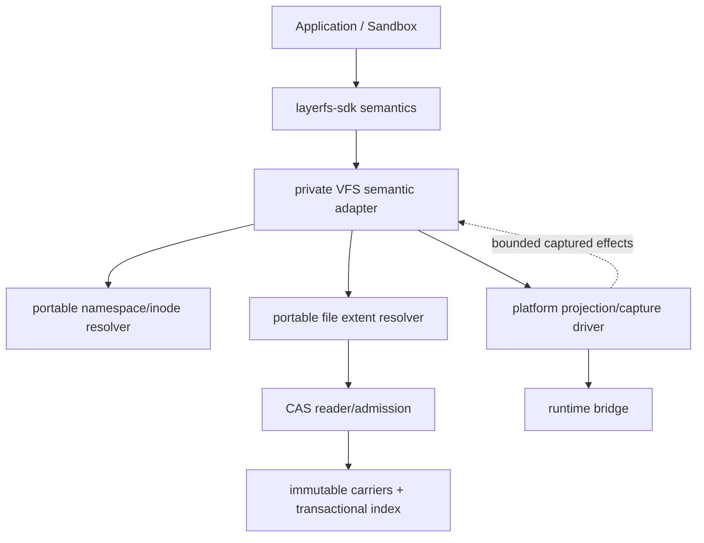

| Layer | May own | Must not own |
|---|---|---|
| storage core | identities/codecs, CDC, COW, roots, exact range, publication | mount/runtime semantics |
| VFS semantic adapter | path/inode/handle semantics, bounded operation translation | second CAS/format/authority |
| platform driver | attach/expose/capture/quiesce/detach, platform errors | object IDs, equality, publication |
| runtime bridge | process/container/VM attachment and quiescence | storage/projection identity |
| native cache | exact-root-keyed derived bytes | accepted authority |

**Invariant:** OS paths/inodes, mounts, whiteouts, runtime IDs, and driver names
never enter canonical identity
[source](../../../ephemeral-sandbox-docs/ephemelra-sanbdox-v2.1/supported_platform_driver.md#5-the-projection-driver-contract).

## 4. VFS-visible object model

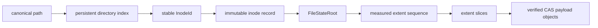

Recommended records (**Projected; codec not selected**):

```text
InodeRecord {
    inode_id
    kind
    mode / ownership / timestamps / link_count
    content_root: FileStateRoot | DirectoryRoot | SymlinkObjectId
    logical_size
    optional ContentDigest
}

OpenHandle {
    workspace_or_view_generation
    inode_id
    exact_revision_root
    access_mode
    cursor
    adapter_generation
}
```

Rules:

- `InodeId` is not a CAS object ID and remains stable across content edits;
- an open handle binds an exact immutable revision or explicit workspace;
- stale driver/session generations fail typed;
- OS inode numbers remain adapter-local;
- rename changes namespace bindings, not payload identity;
- hard-link semantics require explicit link-count/topology rules.

## 5. Read path

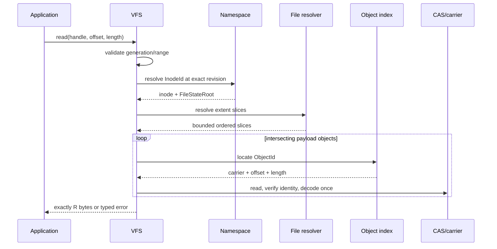

| Sub-operation | Flat public file | Current K64/F64 | Measured extent target |
|---|---:|---:|---:|
| locate byte offset | worst `O(E)` | `O(H*64)` | `O(H*fanout)` / `O(log E)` |
| return range | `O(E+R)` | `O(H*64+C_R+R)` | `O(log E+C_R+R)` |
| full read | `Theta(F)` | `Theta(F+E)` | `Theta(F+E)` |
| resident state | result/source dependent | bounded path + batches | bounded path + batches + caller output |

100 MiB retained-fixture anchors:

| Metric | Value | Class |
|---|---:|---|
| extents | 5,284 | **Observed** |
| average chunk | `104,857,600/5,284 = 19,844.36 B` | **Derived** |
| estimated chunks for 1 MiB | ~54 + boundary slack | **Projected** |
| CP-0009 authenticated objects | 60 | **Observed** |
| CP-0009 canonical bytes read | 1,090,255 B | **Observed** |
| returned | 1,048,576 B | **Observed** |

Source: [G6 range model](../../research/phase-4/g6-canonical-extent-tree/cost-model.md#range-chunk-counts).

First 4 KiB of a 100 MiB file (**Projected byte-work model**):

```text
eager full native build    ~100 MiB
virtual path + payload     ~16-64 KiB
reduction                  ~1,600-6,400x bytes before response
```

This is not a measured latency claim.

## 6. Mutation and capture

### 6.1 Direct operation

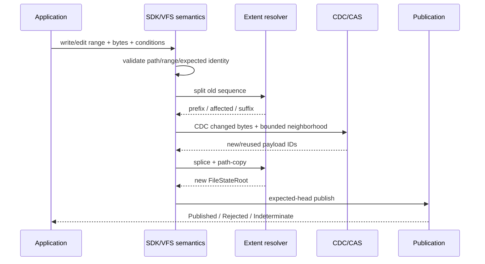

```text
overwrite       O(B + K + log E)
insert/delete   O(B + K + log E) only with hard-local operational rope
append          O(B + log E)
truncate        O(K + log E)
full replace    Theta(F_new)
```

G6 CD32-64 provides expected locality but retains hard `Theta(E_suffix)`
[Research](../../implementation-detail/phase-4/g6/g6-canonical-extent-tree-spec.md#1-decision-and-revised-claim).

### 6.2 Projected-workspace capture

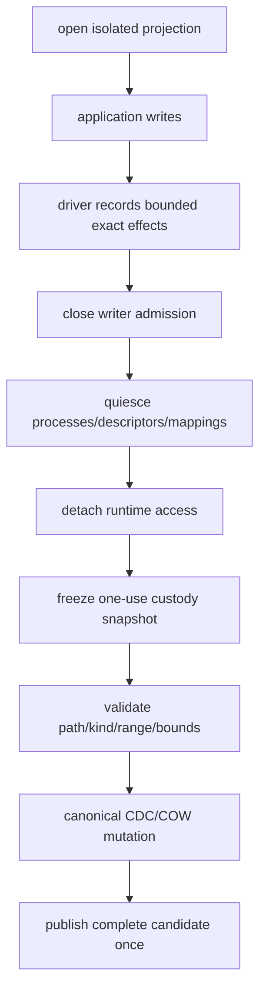

| Required | Forbidden |
|---|---|
| exact path/kind and exact intervals or bounded conservative expansion | uncertainty converted to through-EOF scan |
| reserve capacity before mutation | unbounded event queue |
| sequence/finality/revision/custody proof | replayable accepted log |
| unsupported mode rejected before mutation | silent `Update -> Replace` |
| normalize driver output to storage operations | native marker/inode becomes canonical identity |

Current OverlayFS scope captures create/remove/move/set-executable/explicit
replace but does not infer exact byte-range `Update`
[architecture](../../../ephemeral-sandbox-docs/ephemelra-sanbdox-v2.1/layefs/ARCHITECTURE.md#41-linux-oci-overlayfs-placement).

## 7. Virtual visibility, projection, and materialization

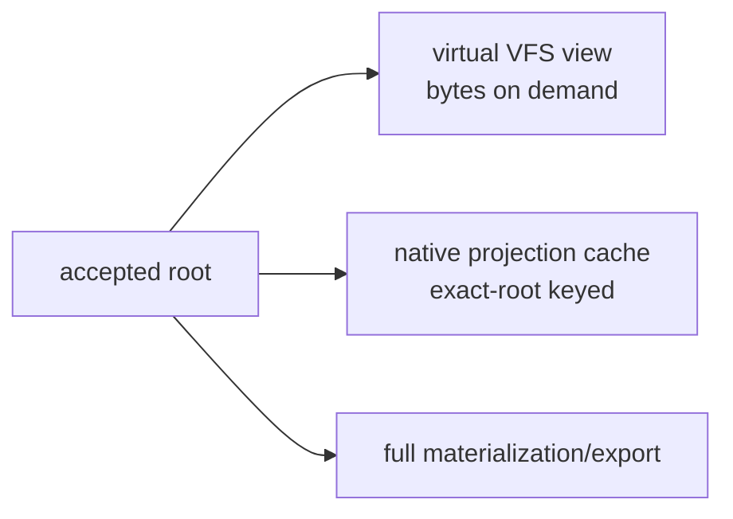

| Lane | Authority | Availability | General work |
|---|---|---|---:|
| virtual VFS | accepted graph | immediately after commit | per operation |
| native projection | derived cache | optional/asynchronous | route-dependent |
| full export | derived output | after full build | `Theta(F)` |

G5 route class:

```text
CompositePredeclaredExactCloneSparsePatchAndFullFallback
```

```mermaid
flowchart TD
    R["parent -> target"] --> L{"same length?"}
    L -- no --> FF["FullFallback"]
    L -- yes --> DR{"dirty ranges"]
    DR -- empty --> EX["exact clone/reuse"]
    DR -- bounded --> SP["clone seed + sparse patch"]
    DR -- invalid --> FF
    EX --> PUB["sync + rename + directory sync"]
    SP --> PUB
    FF --> PUB
```

| Route | G5 scope | Service work | Complete current-path complexity |
|---|---|---:|---:|
| exact | warm 250,000 B | clone mechanism | `Theta(F)` due whole-seed hash |
| sparse | warm same-size 250,000 B | clone + dirty ranges | `Theta(F+B)` |
| different length | correctness | full reconstruction | `Theta(F)` |

Source: [corrected G5 complexity](../../implementation-detail/phase-4/experiments/g5-terminal/v1/G5-TERMINAL-REPORT-v1.md#complexity).

G5 T3-to-T4 service samples (**Observed; not edit-to-native**):

| Class | n | p50 | p95 |
|---|---:|---:|---:|
| exact | 1 | 0.828 ms | 0.828 ms |
| sparse | 67 | 1.265 ms | 1.469 ms |
| ordinary fallback | 1 | 1.775 ms | n/a |
| contended fallback | 1 | 2.806 ms | n/a |

Count-changing example, insert 1 MiB at middle of 100 MiB
(**Projected byte-work model**):

```text
native shift:       50 MiB read + 50 MiB write + 1 MiB patch = 101 MiB
+ whole seed hash:                                              201 MiB
virtual rope:       1 MiB payload + 8-19 KiB mapping           ~1.01 MiB

before visibility:  ~100x fewer bytes vs shift
                    ~199x fewer bytes vs shift + seed hash
```

Full native export remains `Theta(F)`.

## 8. Exact/latest mailbox

| Policy | Coalescible? | Required outcome |
|---|---:|---|
| `Exact(root)` | no | start/publish exact root or exact typed failure |
| `LatestFollowing(root)` | yes while pending | replace only with newer compatible latest request |

```mermaid
stateDiagram-v2
    [*] --> Idle
    Idle --> InFlight: take pending
    InFlight --> InFlightPending: submit while active
    InFlightPending --> InFlightPending: newer Latest replaces pending Latest
    InFlightPending --> InFlightPending: Exact retained / invalid replacement rejected
    InFlight --> Idle: complete; no pending
    InFlightPending --> InFlight: complete; take pending
    Idle --> Shutdown: close
    InFlight --> ShutdownDrain: shutdown requested
    ShutdownDrain --> Shutdown: settle + clean owned temp
```

```text
in_flight <= 1
pending   <= 1
mailbox memory = O(1)
projection SQLite writer tx/COMMIT = 0/0
foreground state-changing tx/COMMIT = 1/1
```

G5 conservation:

| Counter | Observed |
|---|---:|
| submitted | 169 |
| started | 70 |
| published | 70 |
| coalesced Latest | 99 |
| Exact policy submissions | 64 |
| Latest policy submissions | 100 |
| max in-flight / pending | 1 / 1 |
| projection writer tx/COMMIT | 0 / 0 |

```text
submitted = started + coalesced = 70 + 99 = 169
started   = published           = 70
```

Evidence: [final scoreboard](../../implementation-detail/phase-4/experiments/g5-terminal/v1/FINAL-SCOREBOARD-v1.tsv#L19).
The benchmark mailbox contains `in_flight: bool` and one
`pending: Option<ProjectionRequest>`
[Observed](../../crates/layerfs-engine/src/bin/phase4_g3_materialization.rs#L4910).

## 9. Integrity modes

These are storage-integrity policies, not user authentication modes.

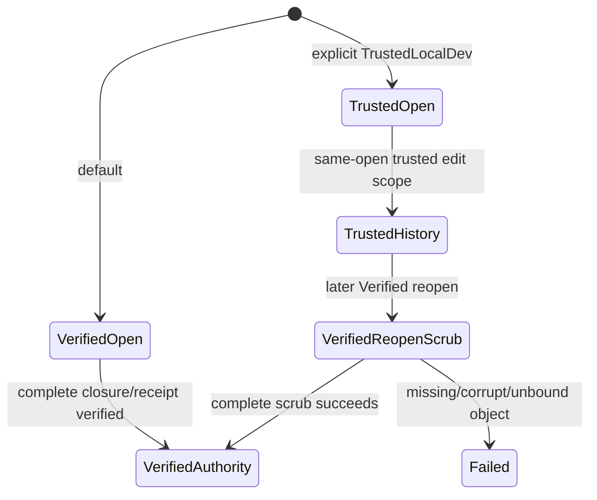

| Work | Verified | TrustedLocalDev |
|---|---:|---:|
| default | yes | explicit opt-in |
| lifetime | Store | Store |
| eager current/parent closure scrub | required for authority | may omit in authorized same-open scope |
| fetched object identity | unconditional | unconditional |
| new object identity | unconditional | unconditional |
| occupied-ID equality | unconditional | unconditional |
| receipt decode/binding | required | required; assumptions never become Verified authority |
| expected-head | required | required |
| one tx / one COMMIT | required | required |
| ambiguous reconciliation | required | required |
| Verified reopen after trusted history | complete scrub | cannot bypass |
| rollback freshness without external authority | `NotProtected` | `NotProtected` |

The G5 source makes `Verified` the default enum variant and records trusted
edges in `trusted_assumed_equal_edges`
[Observed](../../crates/layerfs-engine/src/bin/phase4_create_edit_benchmark.rs#L327).

G5-1 result:

| Metric | Value | Class |
|---|---:|---|
| operation rows | 200 | **Observed** |
| supported edit classes | 7 | **Observed** |
| Trusted p50 | 7.871-9.418 ms | **Observed** |
| Trusted p95 | 8.829-10.346 ms | **Observed** |
| paired median reduction | 93.77-94.79% | **Observed** |
| speedup | `1/(1-.9377)=16.05x` to `1/(1-.9479)=19.19x` | **Derived** |
| gate complete wall | 95.098 s | **Observed** |
| peak RSS | 18,563,072 B | **Observed** |

Evidence: [G5 terminal report](../../implementation-detail/phase-4/experiments/g5-terminal/v1/G5-TERMINAL-REPORT-v1.md#verified-and-trusted-boundary).
Label: `CacheWarmPreconditionedNotColdReopen`; no controlled-cold claim exists.

## 10. Authoritative publication and ambiguous COMMIT

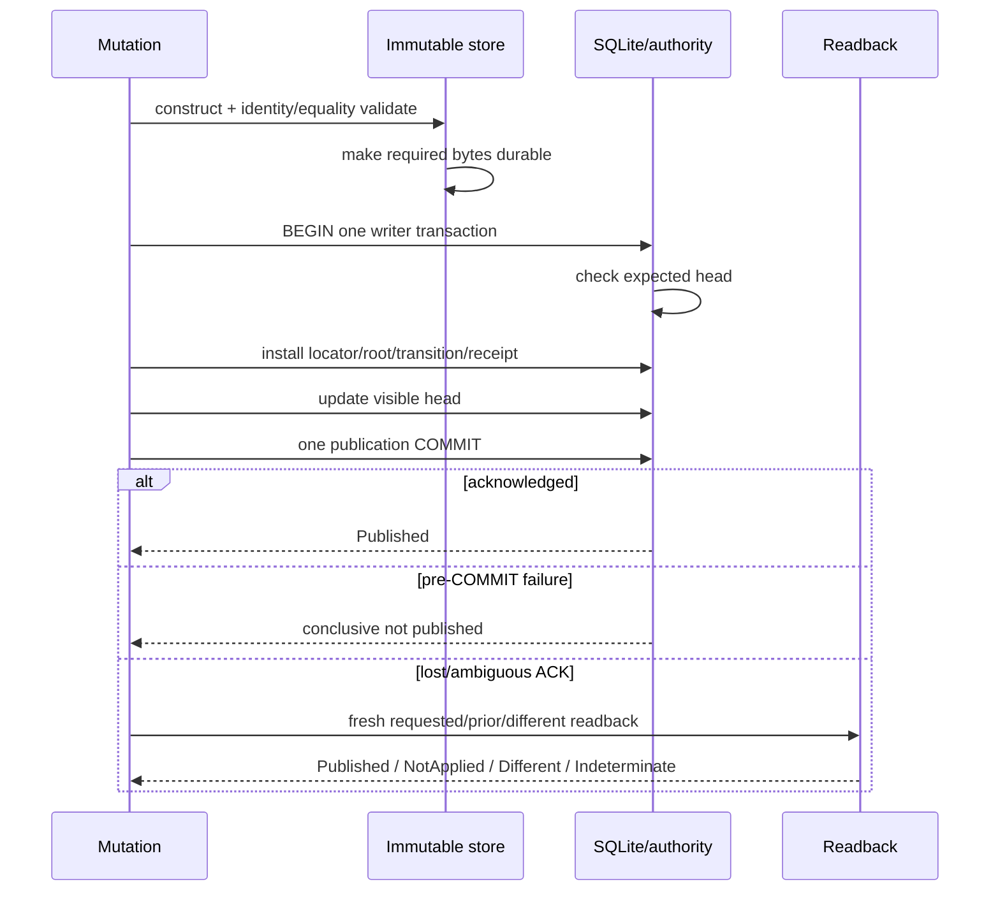

```text
expected-head check                  required
writer transactions per publication exactly 1
publication COMMITs                  exactly 1
blind retry/redispatch               forbidden
post-ambiguity decision              fresh durable state only
```

The reusable engine uses `BEGIN IMMEDIATE`, compares current with expected
parent, authenticates current directory, updates visible root, and commits once
[Observed](../../crates/layerfs-engine/src/lib.rs#L404). G5 additionally tests
requested/prior/different/ambiguous reconciliation and receipts
[Observed](../../implementation-detail/phase-4/experiments/g5-terminal/v1/G5-TERMINAL-REPORT-v1.md#verified-and-trusted-boundary).

Authority crash matrix:

| Cut/error | Durable possibilities | Required handling |
|---|---|---|
| before placement | no candidate | release owned state |
| during placement | partial temp/unindexed tail | never publish; exact cleanup or later GC |
| objects durable before tx | old head + immutable orphans | old head authoritative |
| expected-head mismatch | old/other complete head | rollback + typed rejection |
| inside tx before COMMIT | old or new by SQLite atomicity | rollback/fresh readback |
| COMMIT success ACK | new head | `Published` |
| COMMIT ACK lost | old or new | fresh receipt/head readback; no second COMMIT |
| different head | another complete state | conflict/different, not corruption |
| readback cannot prove | unknown | `Indeterminate`; fail closed |

## 11. Native projection durability

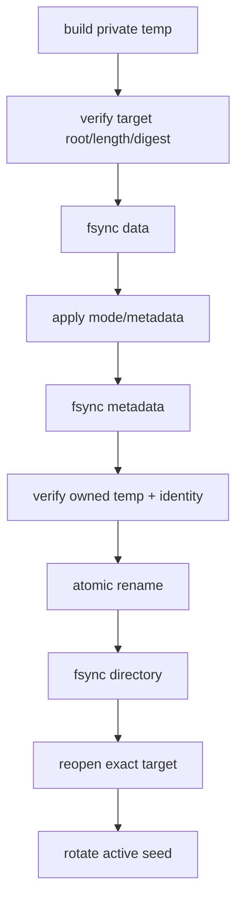

G5 source performs this order
[Observed](../../crates/layerfs-engine/src/bin/phase4_g3_materialization.rs#L6149).

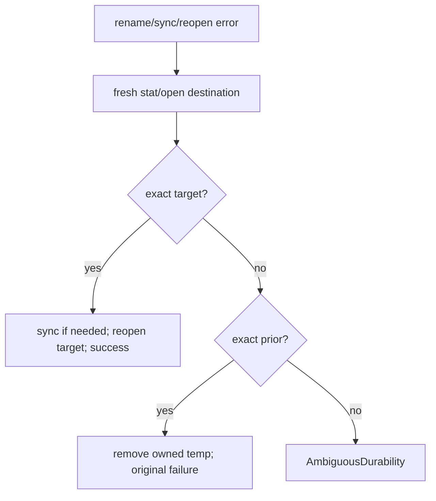

| Fault | Safe state | Required action |
|---|---|---|
| before temp sync | prior | remove owned temp |
| before rename | prior | remove temp; preserve prior seed |
| rename lost ACK | prior or target | fresh target/prior reconciliation |
| dir-sync lost ACK | target visible; durability uncertain | reconcile/sync or `AmbiguousDurability` |
| post-rename stat/reopen failure | target may be visible | fresh open/stat |
| cancel before build | prior | no publication |
| shutdown in-flight | settling active build | drain/cancel + exact cleanup |
| restart with owned temp | accepted destination + residue | authenticate ownership; remove exact owned temp only |

The projector proves target/prior freshly; target is synced/reopened, while a
proven prior causes owned-temp cleanup and the original failure
[Observed](../../crates/layerfs-engine/src/bin/phase4_g3_materialization.rs#L6211).

```text
commit success + projection failure:
    accepted graph remains valid and VFS-readable

projection success + commit not published:
    native bytes remain derived; they cannot mint authority
```

## 12. Shutdown and reopen

```mermaid
stateDiagram-v2
    [*] --> Open
    Open --> Closing: close admission
    Closing --> Drain: settle/cancel active policy
    Drain --> Cleanup: worker terminal
    Cleanup --> Closed: temp removed; readers closed; Q=0
    Closed --> [*]
```

Terminal equations:

```text
submitted = published + coalesced + explicitly failed/cancelled
in_flight = 0
pending = 0
owned temp = 0
projection readers/writers = 0
capacity Q = 0
```

G5-3 observed `Q=0`, descriptors `5 -> 5`, and seed/temp/work-root residue
`0/0/0`
[Observed](../../implementation-detail/phase-4/experiments/g5-terminal/v1/G5-TERMINAL-REPORT-v1.md#protected-operations-and-resources).

| Reopen case | Required behavior |
|---|---|
| clean Verified history | validate profile/authority + required closure/receipt |
| prior Trusted history -> Verified | complete scrub before Verified authority |
| missing/invalid authority | fail typed |
| schema/profile mismatch | fail; never silently migrate |
| malformed receipt | fail closed |
| immutable orphans | ignore for authority; retain pending safe GC |
| missing/stale native cache | accepted root remains readable; rebuild only if requested |

## 13. Concurrency and SQLite

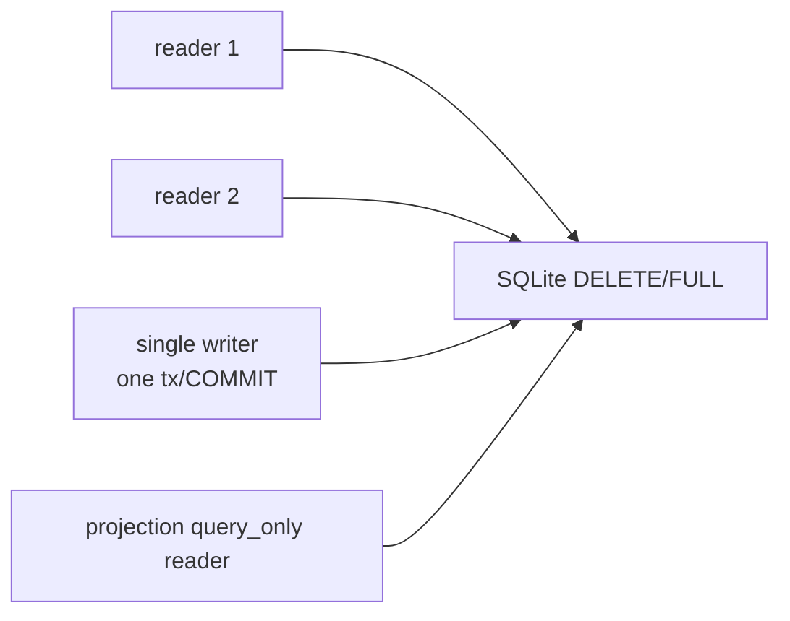

| Property | Value | Class |
|---|---:|---|
| writer tx/COMMIT in 10 MiB 2R1W | 1 / 1 | **Observed** |
| Busy / Locked | 0 / 0 | **Observed** |
| connections high-water / terminal | 3 / 0 | **Observed** |
| cache setting/connection | 1,280 pages x 4,096 B | **Observed configured** |
| aggregate configured cache budget | `3*1,280*4,096 = 15,728,640 B` | **Derived** |
| gate RSS | 18,923,520 B < 20,971,520 B | **Observed** |

Configured cache is not observed allocation or the hard memory ceiling; product
RSS is the hard bound
[source](../../implementation-detail/phase-4/experiments/g5-terminal/v1/G5-TERMINAL-REPORT-v1.md#projection-history-and-concurrency).

## 14. Portability map

Storage semantics are portable; driver evidence is not transitive.

| Environment | Storage substrate | Workspace view | Status |
|---|---|---|---|
| macOS native | current filesystem CAS on APFS | none implemented | current storage evidence target only |
| Linux native | future qualified ext4/XFS provider | Linux FUSE candidate | unscheduled |
| Linux OCI | qualified Linux provider | Linux kernel OverlayFS | sole authorized future projection |
| macOS writable native | qualified APFS provider | macFUSE candidate | unscheduled |
| Windows native | future NTFS/ReFS provider | WinFsp or ProjFS candidate | unscheduled |
| Firecracker | explicit host/guest storage | selected virtiofs/agent/etc. | separate future qualification |
| WASI/WASM | exact preopen/host contract | engine-specific VFS/read-only materialization | conditional future design |

```text
qualification tuple =
  control host
  + workspace kernel/platform
  + storage provider/adapter/backing filesystem
  + projection driver
  + runtime bridge/runtime
  + exact versions and policy
```

Non-transitive:

- APFS evidence does not qualify ext4/XFS/NTFS/ReFS;
- Linux FUSE does not qualify macFUSE/WinFsp;
- OverlayFS is not a CAS backing store;
- OCI success does not qualify OverlayFS capture;
- Firecracker/WASI need separate quiescence/failure/resource proof.

Source: [platform matrix](../../../ephemeral-sandbox-docs/ephemelra-sanbdox-v2.1/supported_platform_driver.md#3-compatibility-matrix).

## 15. Operation comparison dashboard

| Operation | Current/qualified path | Recommended target | Quantified anchor |
|---|---|---|---|
| warm Trusted same-size edit | changed path + touched/new auth | retain | 16.05-19.19x **Derived** |
| Verified edit/reopen | full authority work | provider-bound equivalent certificate only after proof | no weakening |
| range read | K64 logarithmic; public flat path may scan | portable measured resolver | 60 objects / 1,090,255 B for 1 MiB **Observed** |
| same-size native projection | seed hash + clone/patch | authenticated seed certificate if proven | 0.828-1.469 ms service **Observed** |
| different-length native | `FullFallback` | future separately authorized platform shift/clone route; exact fallback | no G5 speed claim |
| different-length virtual visibility | not production | splice extents + publish | ~100-199x fewer modeled bytes at 100 MiB midpoint |
| full materialization | full stream | full stream | `Theta(F)` |
| exact/latest scheduling | one active + pending | retain | `169=70+99` **Observed** |
| snapshot/checkpoint | root reference | retain | `O(1)` metadata |
| GC/repack | unavailable | separately fenced offline operation | no current claim |

## 16. Honest counters and timers

| Dimension | Required counters |
|---|---|
| logical | input/changed/deleted/inserted/returned bytes; exact revision/root |
| canonical | CDC bytes/chunks; objects fetched/verified/created/reused; mapping nodes read/created/reused |
| physical store | carrier bytes, locator probes, SQL statements/rows, fsyncs, allocated blocks |
| native cache | seed-hash, clone/copy, sparse patch, shift, fallback, temp bytes |
| durability | writer tx, COMMIT, rename, syncs, reconciliation calls/outcomes |
| scheduling | submitted/started/published/coalesced/failed, maxima, terminal queue |
| resources | `Q`, RSS/PSS, buffers, descriptors, connections, temp residue |
| latency | complete wall; T0 request, T1 commit ack, T2 enqueue, T3 worker start, T4 native ack |
| evidence | Observed / Derived / Projected / Invariant / Unavailable |

```text
complete campaign wall >=
    preparation + preconditioning + all product operations
  + projection + fault work + cleanup + evidence custody

logical-visible latency = T1 - T0
queue delay             = T3 - T2
projection service      = T4 - T3
edit-to-native          = T4 - T0
```

Service-only data may not be relabeled end-to-end.

## 17. Conformance and failure suite

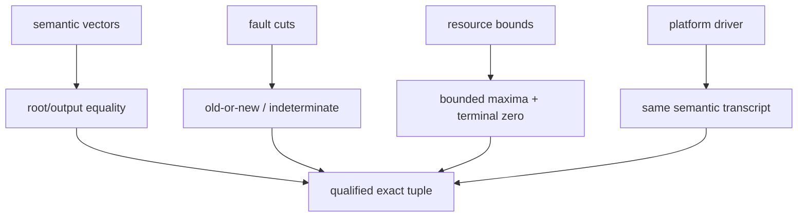

Minimum cases:

1. read at zero/EOF, empty/cross-extent range, missing/corrupt/wrong-role objects;
2. overwrite, extend, insert, delete, append, truncate, no-op, multi-island edit;
3. same bytes through different histories; enforce selected root/digest policy;
4. Exact behind active work, Latest replacement, incompatible replacement;
5. shutdown before/during build, before sync/rename, after rename, lost sync ACK;
6. COMMIT before/after/lost ACK and different-head readback;
7. stale handles, delete-open-handle, mmap/direct-I/O policy, case/Unicode/link semantics;
8. arbitrary roots at 1/10/100 MiB; no fixture paths/digests in product routing;
9. memory/queue/descriptor/temp/carrier/SQLite limits below/at/above bound;
10. exact platform tuple and non-transitive support label.

## 18. Explicit limitations

- G5 is benchmark-mechanism PASS, not VFS/SDK/production qualification.
- G5 native projection is warm, 250,000-byte, process-lifetime-seed evidence.
- Current exact/sparse projection remains linear in whole-seed admission.
- Different-length G5 projection is correct `FullFallback`, not a fast route.
- G5 projection fallback is a **derived native-cache** route. It does not
  authorize storage `Update -> Replace`: Sandbox V2.1 `NO_FALLBACK_V1` requires
  bounded exact resynchronization or typed `RangeResyncFailed`.
- `REFLINK_OUT_OF_SCOPE_V1` remains absolute for the current Sandbox V2.1
  product plan. G5's APFS clone experiment cannot migrate into that product
  without a new reviewed decision and exact platform qualification.
- The measured B+ rope/extent-slice design is a proposal and conflicts with
  current one-content/one-root policy unless an approved ADR separates identities.
- G6 CD32-64 is unimplemented and retains a hard suffix-linear case.
- OverlayFS is Linux OCI projection only; it is not universal or CAS backing.
- FUSE/macFUSE/WinFsp/ProjFS require separate transports and evidence.
- Native export, full read, Verified scrub, and full tracing GC remain linear.
- Rollback freshness, controlled-cold behavior, hostile same-UID filesystems,
  automatic GC, VFS/SDK extraction, and cross-platform load are not proven.

## 19. Source authority map

| Subject | Decisive source |
|---|---|
| VFS stub | [`layerfs-vfs/src/lib.rs`](../../crates/layerfs-vfs/src/lib.rs) |
| G5 integrity Store | [`phase4_create_edit_benchmark.rs`](../../crates/layerfs-engine/src/bin/phase4_create_edit_benchmark.rs) |
| G5 projector/mailbox | [`phase4_g3_materialization.rs`](../../crates/layerfs-engine/src/bin/phase4_g3_materialization.rs) |
| G5 evidence | [`G5-TERMINAL-REPORT-v1.md`](../../implementation-detail/phase-4/experiments/g5-terminal/v1/G5-TERMINAL-REPORT-v1.md) |
| G5 limits | [`LIMITATIONS-v1.md`](../../implementation-detail/phase-4/experiments/g5-terminal/v1/LIMITATIONS-v1.md) |
| G6 arm | [`g6-canonical-extent-tree-spec.md`](../../implementation-detail/phase-4/g6/g6-canonical-extent-tree-spec.md) |
| component boundaries | [`ARCHITECTURE.md`](../../../ephemeral-sandbox-docs/ephemelra-sanbdox-v2.1/layefs/ARCHITECTURE.md) |
| storage/performance laws | [`STORAGE_AND_PERFORMANCE.md`](../../../ephemeral-sandbox-docs/ephemelra-sanbdox-v2.1/layefs/STORAGE_AND_PERFORMANCE.md) |
| platform/driver contract | [`supported_platform_driver.md`](../../../ephemeral-sandbox-docs/ephemelra-sanbdox-v2.1/supported_platform_driver.md) |
