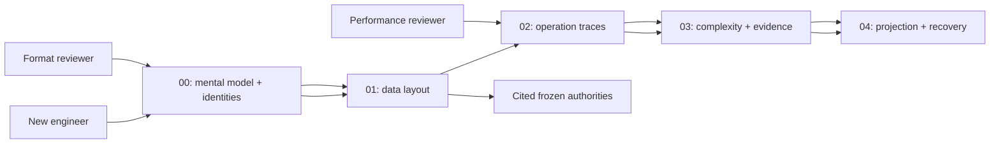
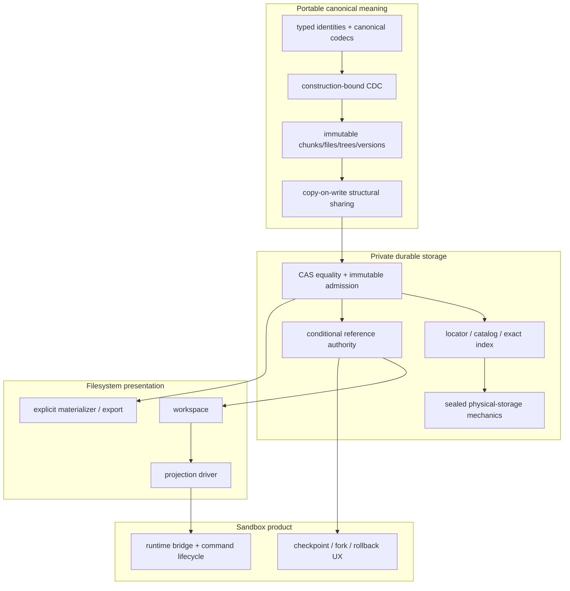

# LayerFS architecture guide

> **Historical explanatory package.** It is not V2 authority; see
> [`../v2/spec.md`](../v2/spec.md).

Status: **explanatory design package; not canonical-format, implementation, or
benchmark authority**.

This package explains the system from input bytes to an accepted immutable
filesystem view. It keeps five evidence classes separate:

| Label | Meaning in this package | May be used as an implementation claim? |
|---|---|:---:|
| **Invariant** | Frozen or controlling rule from current authority | Yes, within the cited scope |
| **Observed** | Direct source fact or retained measured evidence | Yes, within the recorded population |
| **Derived** | Arithmetic from observed/frozen inputs; equation shown | Only the derived quantity |
| **Projected** | Candidate architecture or unmeasured cost model | No |
| **Unavailable** | Not measured, not represented, or not yet designed | No; never read as zero |

> **Reading rule:** no target diagram silently replaces current canonical
> identities. The V2.1 frozen identity family remains authoritative until a
> separately reviewed format/version/migration decision says otherwise.

## Interactive architecture lab

[Open the multipage LayerFS Architecture Lab](lab/index.html) for step-through
CAS, CDC, K64/F64, CD32–64, byte-measured B+ rope, operation, performance, and
VFS/recovery lessons. The lab uses the evidence classifications and equations
defined by this Markdown package; it is an instructional view, not authority.

## Package map

| Read | Purpose | Main diagrams and numbers |
|---|---|---|
| [00 — Overview and identities](00-overview-and-identities.md) | 60-second model, authority walls, identity crosswalk, current-versus-target status | End-to-end graph; identity preimages; CAS/CDC/COW split; G5/G6 anchors |
| [01 — Data structures and storage](01-data-structures-and-storage.md) | Canonical objects, chunks, mappings, trees, packs/segments, indexes, namespace, physical storage | Field layouts; object DAG; K64/F64 and measured-tree topology; byte equations |
| [02 — Operation algorithms](02-operation-algorithms.md) | Read, create, overwrite, insert, delete, append, truncate, commit, snapshot, diff, projection, recovery | Step diagrams; changed/reused object coloring; timer and transaction boundaries |
| [03 — Performance and complexity](03-performance-and-complexity.md) | Big-O, byte work, object work, history growth, memory, SQL/I/O amplification | Current/G5/G6/target matrices; observed/derived/projected comparisons |
| [04 — VFS, projection, and recovery](04-vfs-projection-and-recovery.md) | Virtual view, native cache/export, exact/latest mailbox, crash states, portability | Projection route state machine; publication timeline; platform qualification wall |

## Recommended reading paths

## One-page operation vocabulary

| Operation | Exact meaning | Authoritative result | General lower bound |
|---|---|---|---:|
| `read(offset, length)` | Return an exact byte range from an immutable view | Bytes from the requested root/view | `Omega(R)` returned bytes |
| full read | Return all logical file bytes | Complete logical stream | `Theta(F)` |
| create/full replace | Stream a complete supplied file | New file object/root | `Theta(F)` supplied bytes |
| overwrite/update | Replace a checked byte range; may change length | New immutable file/root | `Omega(B)` inserted bytes |
| insert/delete | Splice bytes at a logical position | New immutable file/root | `Omega(B)` new bytes; suffix copying is representation-dependent |
| append/truncate | Add/remove logical tail | New immutable file/root | Append `Omega(B)`; truncate metadata may be local |
| workspace create | Open an independent COW view over an accepted version | Mutable workspace capability, no accepted-head move | `O(1)` root sharing target |
| snapshot/checkpoint | Add a reference to an accepted immutable version | Reference metadata | `O(1)` target |
| publish | Make a complete candidate current through one guarded authority transition | Accepted reference/head or typed terminal result | At least changed-candidate work; current validation may traverse a full closure; guarded authority transition is bounded |
| projection | Present or refresh a usable filesystem view | Derived workspace/native view | Route-dependent |
| materialization/export | Produce a complete native directory/file representation | Derived bytes, never canonical truth | `Theta(F)` for a complete file |
| scrub | Authenticate a reachable closure | Integrity evidence | `Theta(reachable work)` without accepted incremental authority |
| GC/compaction | Prove global unreachability, then reclaim/repack | Physical space change | Deferred; never implicit mutation work |

Symbols used throughout:

| Symbol | Meaning |
|---|---|
| `F` | Complete logical file bytes |
| `B` | Inserted/changed payload bytes |
| `R` | Returned range bytes |
| `E` or `C` | Ordered extent/chunk-reference count |
| `K` | Changed/new DAG nodes or directly affected extents, as stated |
| `H` | File mapping height |
| `D` | Entries in one directory |
| `N` | Reachable objects or entries; local definition wins |
| `U_R` | Unique retained objects through `R` revisions |

## Quantified anchor card

These values orient the reader; the linked documents carry complete custody.

| Class | Scope | Value | Authority |
|---|---|---:|---|
| **Invariant** | FastCDC minimum / target / maximum | `8,192 / 16,384 / 32,768 B` | [`cdc/mod.rs`](../../crates/layerfs-core/src/cdc/mod.rs), V2.1 storage contract |
| **Observed** | 100 MiB retained fixture | `5,284` references | [G6 cost model](../../research/phase-4/g6-canonical-extent-tree/cost-model.md) |
| **Observed** | Canonical-v2 100 MiB mapping | `83 leaves + 2 branches + 1 root = 86 objects`, `196,055 B` | [G6 cost model](../../research/phase-4/g6-canonical-extent-tree/cost-model.md) |
| **Observed** | G5-1 Trusted paired-median improvement | `93.77–94.79%`; Trusted p50 `7.871–9.418 ms` | [G5 terminal report](../../implementation-detail/phase-4/experiments/g5-terminal/v1/G5-TERMINAL-REPORT-v1.md) |
| **Observed** | G5-2 warm 250,000-byte projector | exact `0.828 ms`; sparse p50/p95 `1.265/1.469 ms` | [G5 final scoreboard](../../implementation-detail/phase-4/experiments/g5-terminal/v1/FINAL-SCOREBOARD-v1.tsv) |
| **Observed** | G5-3 history | `1,000` one-MiB revisions; `4.782 s`; peak RSS `18,923,520 B` | [G5 terminal report](../../implementation-detail/phase-4/experiments/g5-terminal/v1/G5-TERMINAL-REPORT-v1.md) |
| **Derived** | G6 100 MiB packed candidate mapping | `196,735 B` | `196,055 + 8*(83+2)` |
| **Projected** | G6 ordinary local height-2 mapping path | `8,554 B`; split envelope `13,987 B` | [G6 cost model](../../research/phase-4/g6-canonical-extent-tree/cost-model.md) |

## Authority and implementation layers

### Walls that diagrams must never erase

| Wall | Canonical side owns | Other side owns | Forbidden conflation |
|---|---|---|---|
| core / physical storage | identities, codecs, CDC, COW, object equality | placement, positional I/O, atomic place-if-absent | host path/provider in canonical ID |
| immutable closure / authority | complete content graph | current-head/reference mutation | root identity as mutable revision |
| storage / projection | accepted immutable roots, mutation inputs | attach, usable view, capture, detach | projection cache as CAS truth |
| LayerFS / Sandbox | generic filesystems/workspaces/versions | runtime, commands, product checkpoint/fork/rollback policy | environment/runtime ID in LayerFS identity |
| benchmark / product | measurement fixture, counters, evidence | reusable implementation boundary | `src/bin` mechanism presented as shipped SDK/VFS |

## Current truth versus target discussion

| Surface | Current `layerfs-empty` source | Retained G5 evidence | V2.1 Stage-1 authority | G6 / later research |
|---|---|---|---|---|
| canonical IDs/codecs | Implemented in `layerfs-core`; one 32-byte `ObjectId` type and canonical-v2 mapping | Preserved, not changed by G5 | Frozen logical/physical identity family governs V2.1 | Any new mapping profile requires version, migration, proof |
| durable engine | SQLite schema-v1 `layerfs_*` in reusable engine | G5 runs benchmark-private schema-v5 `wp4m_*` Store | Private CAS + dense packs/index + sealed substrate is target | Extraction/promotion not implied by benchmark PASS |
| SDK/VFS | Placeholder component constants only | G5-2 mechanism is benchmark-private | `layerfs-sdk` public facade; internal driver boundary; Linux OverlayFS is the sole authorized future projection | G6 may expose a promotable endpoint only after separate qualification |
| file mapping | Canonical-v2 K64/F64 tree plus flat in-memory `LogicalFile` paths | Same-size and suffix-sensitive behavior measured | Frozen V2.1 identities cannot be silently replaced | CD32–64 is a candidate; byte-measured B+ rope remains a separate design option |
| stable inode identity | Not implemented | Not qualified | Frozen `FileNodeIdV1` is structural/content identity | A distinct `InodeId` is a schema/API proposal, not current authority |
| GC | No destructive GC | Reachability observation only | Exclusive reclaim remains blocked/deferred | Closure/refcount authority must precede reclaim |

## Source authority order

1. Frozen codec/identity authorities linked from the V2.1
   [LayerFS specification](../../../ephemeral-sandbox-docs/ephemelra-sanbdox-v2.1/layefs/SPEC.md).
2. Current V2.1 [architecture](../../../ephemeral-sandbox-docs/ephemelra-sanbdox-v2.1/layefs/ARCHITECTURE.md),
   [storage/performance contract](../../../ephemeral-sandbox-docs/ephemelra-sanbdox-v2.1/layefs/STORAGE_AND_PERFORMANCE.md), and
   [platform/driver matrix](../../../ephemeral-sandbox-docs/ephemelra-sanbdox-v2.1/supported_platform_driver.md).
3. Actual checked-out source under [`crates/`](../../crates/).
4. Retained accepted G5 evidence under
   [`implementation-detail/phase-4/experiments/g5-terminal/v1/`](../../implementation-detail/phase-4/experiments/g5-terminal/v1/).
5. G6 specification and cost model: candidate research, not shipped facts.
6. This package: explanation and crosswalk only.

## Documentation acceptance checklist

- [ ] Every number is labeled Observed, Derived, Projected, Invariant, or Unavailable.
- [ ] Every Big-O formula defines its variables and separates payload, mapping,
      authentication, database, and native-I/O work.
- [ ] Current source, G5 benchmark-private mechanisms, V2.1 target, and G6
      candidate are never shown as one implemented system.
- [ ] Canonical truth, physical placement, authority, projection, and runtime
      identities remain separate.
- [ ] Full read/export/scrub/GC linear lower bounds remain visible.
- [ ] No cache, receipt, sidecar, native file, pack index, or projection state is
      promoted to canonical truth.
- [ ] Platform evidence is attached to its exact storage/projection/runtime tuple.
- [ ] Unsupported work returns a typed failure; diagrams contain no hidden retry,
      fallback, full scan, or second publication dispatch.
