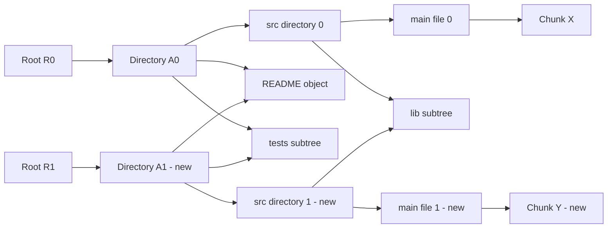
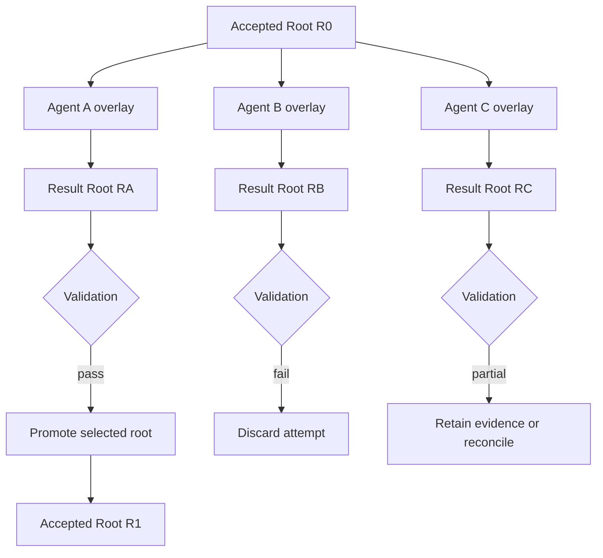
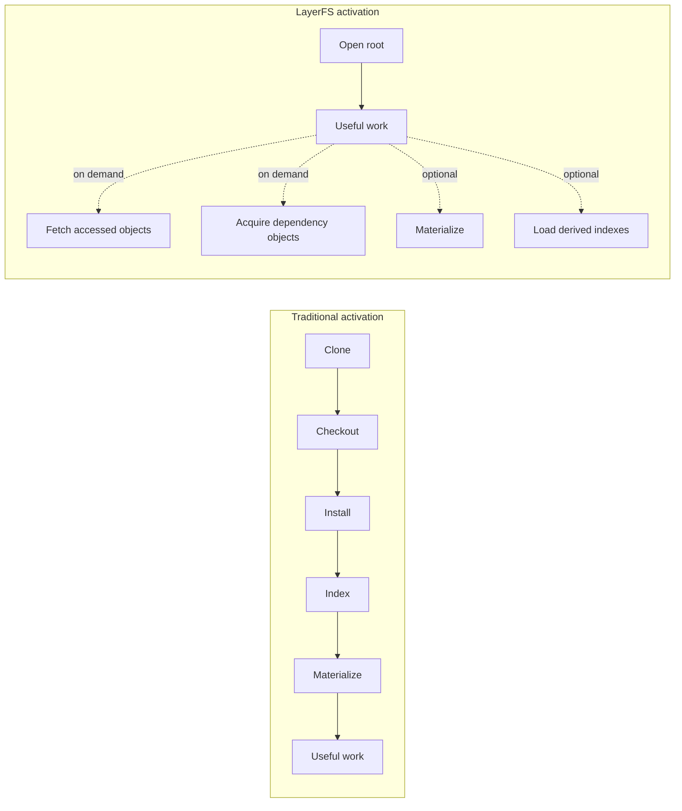
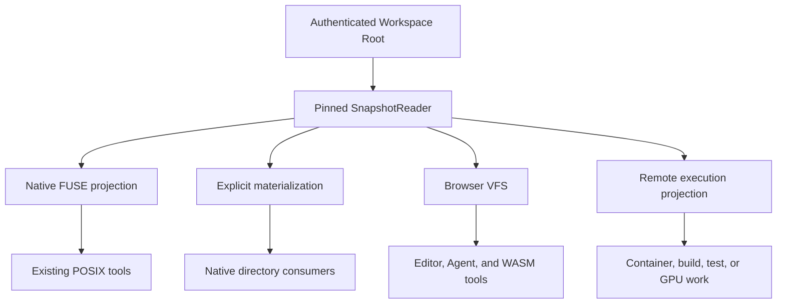
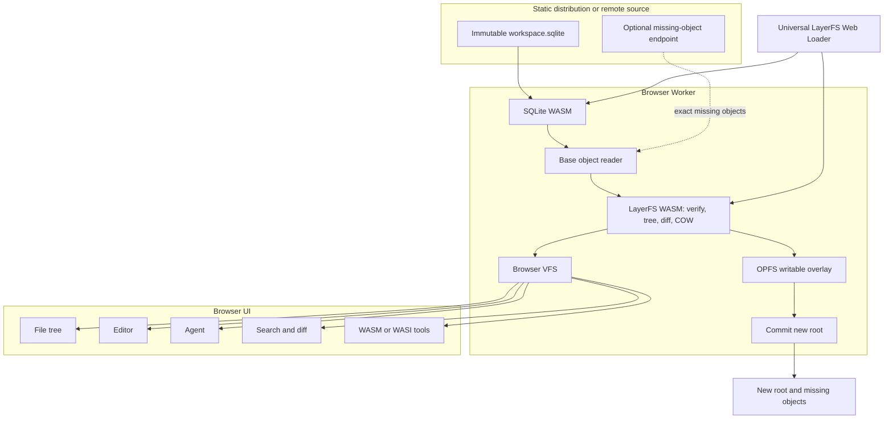
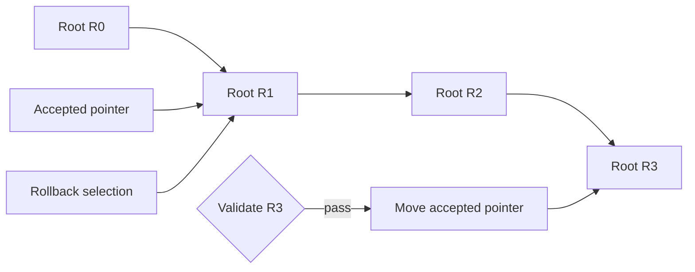

# LayerFS: An AI-Native File System for Universal Logical Workspaces

> **Status:** Non-binding future vision / day-dreaming document
> **Current authority:** [`../v2-replacement/spec.md`](../v2-replacement/spec.md)
> **Scope:** The future shape of code workspaces for humans, Agents, browsers,
> native tools, and remote execution. This document is intentionally not a
> market analysis, pricing proposal, or replacement for the binding V2
> specification.

## Executive thesis

The fundamental unit of software work should no longer be a physical directory
that must be constructed on a particular machine. It should be an immutable,
authenticated, branchable logical workspace root that can be opened directly,
forked without copying, and projected into browser, native, or remote execution
environments without changing its identity.

The central inversion is:

```text
Traditional model
physical directory = workspace

LayerFS model
logical root = workspace
physical directory = one optional projection
```

This inversion enables three connected shifts:

1. **Physical to logical:** files and directories become canonical logical
   objects rooted in authenticated state.
2. **Local to universal:** the codebase is no longer bound to a local or remote
   machine filesystem; it can be opened directly in a browser through SQLite,
   WebAssembly, and a virtual filesystem.
3. **Single-worker to multi-Agent:** humans and Agents receive isolated
   copy-on-write overlays over a shared immutable root rather than independent
   copies of the same physical workspace.

The resulting vision is concise:

> **A workspace is a root, not a directory.**

> **Fork roots, not physical files.**

> **The browser is a workspace runtime, not merely a repository viewer.**

> **Open the codebase and begin working without waiting for the codebase to be
> reconstructed first.**

## Abstract

Software development still treats a workspace as a physical directory. Before
useful work can begin, source code is cloned, files are checked out,
dependencies are downloaded, packages are installed, indexes are generated,
and an execution environment is prepared. Local development performs this work
on a developer machine. Conventional cloud development moves it to a remote
machine but generally preserves the same physical-workspace model.

This model was designed for a small number of long-lived human workspaces. It
becomes increasingly inefficient when autonomous Agents create many
short-lived, concurrent, and speculative branches of work. A single request may
produce multiple implementation attempts, debugging hypotheses, security
analyses, test experiments, reviews, and reconciliation branches. Reconstructing
a complete physical checkout and dependency environment for every attempt
multiplies storage, transfer, preparation, indexing, and cleanup even though
most workspace content remains identical.

LayerFS proposes a different foundation. The authoritative workspace is an
immutable, content-addressed object graph identified by a canonical root.
Physical files are projections of that logical state rather than the state
itself. A writable workspace is a private copy-on-write overlay over an
immutable root. Creating a branch initially requires only a new branch identity,
a reference to the root, and an empty overlay; unchanged canonical objects are
not copied.

The same logical workspace can be projected through FUSE for existing native
tools, materialized when required, exposed to remote execution, or opened
directly in a browser. In the browser form, an immutable SQLite artifact
provides indexed access to canonical workspace objects, WebAssembly implements
verification and logical filesystem behavior, and an OPFS-backed overlay
retains local mutations. Portable tools may execute in the browser while
native or resource-intensive work is dispatched remotely against the same root.

This architecture enables a zero-bootstrap workspace model. Zero bootstrap does
not mean zero network transfer or zero computation. It means that complete
clone, checkout, dependency installation, indexing, and filesystem
materialization are removed from the critical path of useful interaction.
Activation cost follows the initial working set rather than total workspace
size.

LayerFS therefore proposes more than an AI-native filesystem. It proposes a
universal logical workspace shared by humans, Agents, browsers, native tools,
CI workers, and remote execution systems.

## 1. The change in the source of truth

The revolutionary change is not that physical files become bytes. Physical
files are already bytes. The change is that a physical namespace stops being
authoritative.

In the conventional model:

```text
workspace identity = path to one mutable directory
```

The directory simultaneously acts as:

- the representation of state;
- the mutation surface;
- the interface used by tools;
- the unit copied for isolation;
- the unit mounted into execution;
- the unit archived or deleted.

Logical and physical concerns are coupled.

In the LayerFS model:

```text
workspace identity = authenticated root of canonical logical objects
```

The root is independent of:

- machine;
- mount point;
- native inode;
- process;
- container;
- browser origin;
- SQLite row identifier;
- SQLite page layout;
- storage endpoint;
- projection technology.

The physical namespace becomes a replaceable view:

```text
logical root
    ↓
projection
    ↓
physical or virtual filesystem interface
```

This separation permits the workspace to move across execution environments
without changing what the workspace is.

## 2. Three generations of development workspaces

The transition from local development to browser-native logical workspaces is
not merely a change in user interface. It is a change in where authoritative
state lives.

```mermaid
flowchart LR
    subgraph G1["Generation 1: Local development"]
        GIT1[Repository] -->|clone| LOCAL[Local physical directory]
        LOCAL --> TOOLS1[Local editor and tools]
    end

    subgraph G2["Generation 2: Cloud development"]
        BROWSER2[Browser UI] --> VM[Remote VM or container]
        GIT2[Repository] -->|clone| REMOTE[Remote physical directory]
        VM --> REMOTE
        REMOTE --> TOOLS2[Remote editor and tools]
    end

    subgraph G3["Generation 3: Logical workspace development"]
        ROOT[Authenticated logical root]
        ROOT --> WEB[Browser WASM + OPFS]
        ROOT --> NATIVE[Native FUSE or materialization]
        ROOT --> EXEC[Remote execution]
        ROOT --> AGENTS[Additional Agent overlays]
    end
```



Local development makes a local directory authoritative. Cloud development
usually makes a remote directory authoritative. The browser is often a terminal
or editor attached to a hidden remote machine that still performs clone,
checkout, installation, indexing, and materialization.

LayerFS changes the authority boundary. The browser may directly host and
mutate the logical workspace. Native and remote machines become execution
projections rather than owners of workspace identity.

The distinction can be summarized as:

> **Cloud development moved the machine. LayerFS removes the machine from
> workspace identity.**

## 3. Why the physical-workspace model fails under Agent parallelism

The traditional preparation path is eager:

```text
clone repository
    ↓
checkout files
    ↓
download dependencies
    ↓
install packages
    ↓
generate indexes
    ↓
configure environment
    ↓
begin useful work
```

This produces several structural problems.

### 3.1 Workspace creation scales with total workspace size

Preparation time is commonly proportional to repository history, file count,
dependency volume, generated metadata, and physical checkout size. A task that
needs five files may still prepare millions of files.

### 3.2 Logical branches become physical copies

A version-control branch may be logically cheap, but a usable execution branch
often becomes another checkout, worktree, CI directory, container layer, cloud
workspace, dependency directory, and build tree.

### 3.3 Dependencies are repeatedly reconstructed

Lockfiles identify desired versions, but do not always provide an immediately
usable environment. Every workspace may still contact registries, download
archives, extract packages, generate metadata, and rebuild native components.

### 3.4 Reproducibility is incomplete

A source commit does not necessarily identify the complete filesystem observed
by an Agent. Two executions may differ in dependencies, toolchains, generated
files, local caches, platform behavior, or environment configuration.

### 3.5 Multi-Agent execution multiplies every inefficiency

One difficult task may produce:

- a minimal patch attempt;
- an architectural refactor;
- several debugging hypotheses;
- a dependency upgrade;
- an independent correctness review;
- a security-hardening branch;
- a test-minimization branch;
- one or more reconciliation attempts.

If every attempt requires a complete physical environment, infrastructure work
grows with the number of attempts even when most content is shared.

The desired model is instead:

```text
one immutable logical root
    +
many lightweight writable overlays
```

## 4. The logical workspace model

A logical workspace is an authenticated graph of immutable objects. At a
conceptual level:

```text
Workspace root
    ↓
Directory objects
    ↓
File objects
    ↓
Content objects or chunks
```

Each object has:

- one canonical representation;
- one content-derived identity;
- immutable bytes;
- an explicit kind;
- bounded decoding rules;
- authenticated child references.

The defining invariant is:

```text
same logical filesystem
    ⇒
same canonical objects
    ⇒
same root identity
```

This must hold across machines, databases, browsers, mounts, processes, and
executions.

### 4.1 Structural sharing

A mutation creates new objects only for changed content and the affected
ancestor path. Unchanged objects retain their identities and remain shared.



Changing `main` creates new content, a new file object, a new `src` directory,
and a new ancestor spine to `R1`. `README`, `tests`, and `lib` remain shared.

### 4.2 Logical identity is not SQLite identity

SQLite may carry canonical objects, but it must not define them:

```text
logical ObjectId
    ≠
SQLite row ID
    ≠
SQLite transaction ID
    ≠
SQLite page location
```

The same object should remain valid in SQLite, OPFS, memory, an object store, a
packfile, or another durable carrier.

SQLite answers:

> Where are these bytes, and how can they be retrieved and published durably?

The logical layer answers:

> What do these bytes mean, and do they authenticate as the object requested?

## 5. Design principles for an AI-native filesystem

An AI-native workspace should satisfy the following principles.

### 5.1 Immutable publication

Published roots are never modified in place. A mutation produces a new root.
Immutability enables deterministic identity, safe caching, historical access,
rollback, concurrent reading, and authenticated reuse.

### 5.2 Copy-on-write mutation

A writable workspace is a private overlay over an immutable root. It records
only the Agent's unique changes.

### 5.3 Metadata-only initial fork

Forking creates a branch identity, selects a base root, and allocates an empty
overlay. It copies no canonical content solely because the branch exists.

### 5.4 Lazy acquisition

A workspace becomes logically available before all reachable content is local.
Objects are acquired according to access and declared availability policy.

### 5.5 Transactional publication

A new root does not become visible until its required objects and immutable
facts are durable or explicitly resolvable under its placement policy.

### 5.6 Explicit placement

Local replicas, reference-backed roots, remote stores, browser artifacts, and
caches may change acquisition latency and offline availability. They must not
change workspace identity or filesystem results.

### 5.7 Snapshot-pinned reads

A reader opened for a root continues to observe that root even when branch
heads advance concurrently.

### 5.8 Compare-and-swap writes

A commit declares the exact parent and expected branch head. An unexpected head
advance produces a conflict instead of silent overwrite.

### 5.9 Branch-per-attempt isolation

Agents normally write to independent overlays rather than a shared mutable
namespace.

### 5.10 Capability-based execution

Workspace access does not imply unrestricted access to the host, network,
secrets, clock, process table, package registries, or external systems.
Execution capabilities are explicit.

## 6. Multi-Agent workspaces

The filesystem should assume that parallel speculation is normal rather than
exceptional.



Every Agent sees the same immutable base but owns a private writable overlay.
The fork initially copies zero canonical content. Successful attempts produce
new roots. Failed attempts can be discarded without mutating or recopying the
base.

### 6.1 Root-based coordination

Agent coordination should use immutable states:

```text
compare Root A with Root B
validate Root C
reconcile Root A and Root D against Base R0
promote Root B
discard Root E
```

This is safer than coordinating through mutable paths such as
`/tmp/agent-workspace-42`.

### 6.2 Agent results are more than patches

A useful Agent result may contain:

```text
parent root
result root
changed paths
commands executed
toolchain identity
tests and evidence
declared capabilities
unresolved limitations
```

The workspace root identifies filesystem state. Evidence is content-addressed
and linked to the root, but does not automatically become part of the root's
canonical filesystem identity.

### 6.3 Typed reconciliation

Competing roots should be reconciled as logical filesystem states rather than
by allowing Agents to edit the same physical directory concurrently.

Reconciliation may report typed conflicts such as:

- content conflict;
- file-versus-directory conflict;
- delete-versus-modify conflict;
- directory conflict;
- hard-link conflict;
- metadata conflict.

A resolution produces another immutable root.

## 7. Zero-bootstrap workspace activation

"Zero bootstrap" is an architectural property, not a literal claim of zero
elapsed time.

It means that these operations are not mandatory prerequisites for useful
interaction:

- complete repository clone;
- complete checkout;
- archive extraction;
- installation of every dependency;
- generation of every index;
- construction of a complete physical directory.



The desired property is:

> **Time to first useful operation depends primarily on the initial working set,
> not total workspace size.**

A zero-bootstrap system should measure separately:

- root-resolution time;
- time to authenticated namespace;
- time to first tree display;
- time to first file read;
- bytes acquired before first interaction;
- time to first writable fork;
- time to first command;
- remaining background or on-demand acquisition.

The precise claim is:

> LayerFS removes complete workspace construction from the critical path of
> useful development.

## 8. One root, multiple projections

FUSE, SQLite, WASM, OPFS, and remote execution are not competing definitions of
the workspace. They are carriers or projections of one logical root.



All projections must preserve:

- ObjectIds;
- root identity;
- namespace contents;
- file contents;
- root-to-root diff semantics;
- commit rules;
- authentication requirements.

The core architectural statement is:

> **FUSE is not the architecture. SQLite is not the architecture. WASM is not
> the architecture. The canonical logical workspace is the architecture.**

## 9. The browser as a first-class workspace runtime

The browser transition is a co-equal innovation, not a secondary interface.

Conventional browser IDEs often retain this architecture:

```text
browser UI
    ↓ network
remote VM
    ↓
remote physical checkout
    ↓
remote tools
```

The browser is a screen for a machine-bound workspace.

LayerFS instead permits:

```text
authenticated root
    ↓
browser logical runtime
    ↓
direct inspection, fork, mutation, and portable execution
```

The browser can become a universal workspace shell capable of:

- resolving and authenticating a root;
- rendering its logical namespace;
- reading objects lazily;
- comparing roots;
- retaining a private branch;
- coordinating humans and Agents;
- executing portable tools;
- dispatching native work;
- publishing a resulting root.

The codebase becomes directly addressable:

```text
https://workspace.example/open?root=<root-id>&artifact=<artifact-url>
```

The user experience becomes:

```text
open workspace URL
    ↓
authenticate root
    ↓
display logical namespace
    ↓
fork local overlay
    ↓
edit or execute
    ↓
commit new root
    ↓
publish missing objects
```

## 10. SQLite + WebAssembly + OPFS

SQLite, WebAssembly, and OPFS form a practical browser projection of the
logical workspace.

They are not the logical format itself.

### 10.1 SQLite as an indexed workspace carrier

An immutable SQLite artifact may carry:

- canonical objects;
- root and ancestry metadata;
- path indexes;
- completeness receipts;
- dependency objects;
- integrity metadata;
- execution manifests;
- references to associated evidence.

Unlike a conventional archive, SQLite permits indexed queries without first
extracting the complete artifact.

The artifact should be produced from a selected complete root closure, cleanly
checkpointed, closed, authenticated, and published as immutable data.

It should not be treated as a mutable file that multiple Git branches are
expected to merge at the binary level.

### 10.2 WebAssembly as the logical runtime

WebAssembly may implement:

- canonical decoding;
- ObjectId verification;
- tree traversal;
- path lookup;
- range reads;
- root comparison;
- copy-on-write mutation;
- diff;
- reconciliation;
- selected language tooling;
- portable validation.

WASM should be used as a portable, capability-controlled execution plane. It
should not be used to pretend that every native operating-system workload is
naturally browser-portable.

### 10.3 OPFS as the writable browser overlay

The distributed base remains immutable. Browser-local mutations are separated:

```text
read-only base SQLite artifact
    +
writable OPFS overlay
    =
active browser workspace
```

The overlay records only local changes. Committing it produces a new logical
root and a set of newly required canonical objects.

### 10.4 Universal loader

A SQLite artifact cannot bootstrap itself. The browser must first obtain a
loader containing or acquiring:

- SQLite WASM;
- LayerFS logical WASM;
- Worker bootstrap;
- browser VFS;
- user and Agent interface.

The practical one-artifact form is:

```text
one reusable LayerFS web loader
    +
one immutable workspace artifact URL
```

The loader can be cached and reused across many workspaces. Each artifact
remains independently addressable and verifiable.

### 10.5 Browser architecture



## 11. Direct usability and the execution continuum

Direct browser access should be defined in progressive capability levels.

### Level 1: inspect

- browse the namespace;
- read files;
- query metadata;
- authenticate objects;
- search paths and content;
- compare roots.

### Level 2: modify

- fork a local branch;
- create and edit files;
- delete paths;
- persist a writable overlay;
- construct a new root;
- export a delta or artifact.

### Level 3: execute portable tools

- parsers;
- formatters;
- linters;
- language servers;
- static analyzers;
- supported interpreters;
- tests compiled for WASM or WASI.

### Level 4: dispatch native work

Tasks requiring native operating-system behavior remain native or remote:

- arbitrary native binaries;
- container builds;
- kernel tests;
- large compilers;
- high-memory workloads;
- GPUs;
- performance benchmarks;
- system integration tests.

The browser and remote worker operate on the same workspace root. Execution
placement changes; workspace identity does not.

Browser-native therefore does not mean browser-only. It means the browser is a
first-class host and control surface rather than a passive viewer.

## 12. Commit, rollout, and rollback

A commit converts mutable overlay state into a new immutable root.

The publication sequence is conceptually:

```text
overlay
    ↓
canonicalize changed logical state
    ↓
derive and verify object identities
    ↓
admit missing immutable objects
    ↓
verify required closure
    ↓
publish immutable facts
    ↓
compare-and-swap branch head
```

A root must not become visible while required content is partially published.
Failure may leave reusable unreferenced objects, but it must leave the previous
published head intact.

### 12.1 Rollout

Rollout promotes a validated immutable root by changing a small accepted
reference.

### 12.2 Rollback

Rollback selects a prior immutable root. It does not reverse every file mutation
or reconstruct an earlier directory.



The roots remain immutable throughout:

```text
initial accepted root: R1
rollout accepted root: R3
rollback accepted root: R1
```

This guarantee covers LayerFS-managed filesystem state. It does not
automatically reverse external database writes, network messages, deployments,
package publication, or other side effects. Those require explicit
transactional or compensating systems above the filesystem.

## 13. Storage and transfer model

The storage goal is not to claim mathematical minimality. It is to eliminate
growth caused solely by workspace multiplicity.

Let `Objects(R)` be the canonical object closure required by root `R`.

The physical-copy model tends toward:

```text
total storage ≈ Σ materialized_size(Ri)
```

The logical model tends toward:

```text
total canonical storage ≈ size(Union(Objects(R1...Rn)))
```

Actual physical storage also includes:

- metadata and indexes;
- database pages;
- write-ahead logs;
- configured replication;
- writable overlays;
- caches;
- temporary transfer state;
- retained unreachable objects;
- garbage-collection metadata.

The system should expose these costs rather than hide them behind a single
deduplication ratio.

Useful measurements include:

```text
physical CAS bytes
logical union bytes
cross-placement bytes
unique bytes introduced per branch
reused bytes
transfer bytes avoided
unreachable retained bytes
metadata amplification
```

Transfer should be missing-only and bounded. A receiver should announce what it
requires, avoid retransmitting objects it already authenticates, and publish a
new visible boundary only after the required state is safe.

## 14. Canonical state, derived artifacts, and evidence

Not every useful artifact should alter workspace identity.

The system should distinguish:

```text
Canonical workspace inputs
  source files
  dependency inputs
  executable configuration
  filesystem metadata
  declared workspace policy

Derived reproducible artifacts
  search indexes
  symbol graphs
  embeddings
  build outputs
  test results
  coverage
  static-analysis results

Ephemeral execution state
  temporary files
  live process state
  transient logs
  editor cursors
  speculative context
```

Derived artifacts may be addressed by:

```text
workspace root
    +
tool identity
    +
toolchain identity
    +
configuration
    +
command
```

This permits safe reuse without making incidental caches part of the canonical
root.

Secrets must remain outside all reproducible artifacts. The workspace may
declare capability requirements, but credentials are supplied by an external
authority at execution time.

## 15. Integrity, trust, and isolation

An AI-native filesystem must expect untrusted or partially trusted content.

### 15.1 Authenticate every object

Retrieval is not trust:

```text
received bytes
    ↓
bounded canonical validation
    ↓
content hash
    ↓
expected ObjectId comparison
```

### 15.2 Bound every decoder and traversal

Canonical formats and APIs should bound:

- object size;
- name length;
- child count;
- recursion depth;
- path depth;
- allocation;
- history page size;
- object-transfer batches;
- in-memory closure tracking.

### 15.3 Make completeness explicit

Possession of a root object does not prove possession of its complete reachable
closure. Offline availability must be verified and recorded, not inferred.

### 15.4 Avoid ambient authority

Opening a workspace must not automatically grant:

- the host filesystem;
- unrestricted network access;
- environment secrets;
- arbitrary process execution;
- package publication authority;
- cloud credentials.

The browser sandbox and WASM capability model are useful boundaries, but they
must be reinforced by explicit host imports and policy.

## 16. Relationship to version control

LayerFS does not need to replace version control.

Version control manages source history, exchange, review, and collaboration.
The logical workspace manages directly usable filesystem state.

A possible relationship is:

```text
version-control commit
    ↓
resolve or import
    ↓
LayerFS workspace root
    ↓
human and Agent forks
    ↓
new LayerFS roots
    ↓
validate and select
    ↓
export source transition
    ↓
version-control commit or review
```

A source commit answers:

> What source tree was recorded?

A workspace root answers:

> What exact logical filesystem was made available for work and execution?

The two can coexist and reference each other.

## 17. Required system properties

A future AI-native filesystem should make these guarantees explicit.

| Property | Required guarantee |
|---|---|
| Deterministic identity | Equivalent logical filesystems produce the same root |
| Cheap fork | Fork copies no canonical content |
| Snapshot consistency | One reader observes one pinned root |
| Atomic publication | Partial roots never become visible |
| Authenticated retrieval | Returned bytes are verified against ObjectId |
| Placement independence | Storage location does not alter filesystem results |
| Explicit completeness | Offline availability is verified, not assumed |
| Bounded processing | Traversal and transfer use bounded memory |
| Projection equivalence | Native and browser views expose the same logical contents |
| Writer isolation | Concurrent Agents use independent branches or explicit leases |
| Recoverable interruption | Crashes cannot corrupt an already published root |
| Explicit authority | Execution receives declared capabilities, not ambient access |
| Evidence separation | Derived results can be linked without destabilizing root identity |

## 18. Evaluation framework

The architecture should be judged by total system behavior, not only local
filesystem microbenchmarks.

### 18.1 Workspace activation

Measure:

- root-open latency;
- first-tree latency;
- first-file latency;
- first writable fork latency;
- first command latency;
- bytes transferred before first use.

### 18.2 Fork scalability

Evaluate increasing numbers of concurrent branches:

```text
1
10
100
1,000
```

Report:

- branch creation latency;
- physical bytes added by an empty branch;
- memory per active branch;
- commit throughput;
- conflict and reconciliation behavior.

### 18.3 Storage efficiency

Measure:

- physical bytes;
- union logical bytes;
- unique bytes per Agent result;
- cross-placement duplication;
- database and WAL overhead;
- cache overhead;
- retained unreachable bytes.

Use realistic source trees, dependency trees, many-small-file workloads,
high-entropy binaries, sparse files, and large mutable files.

### 18.4 Browser behavior

Measure:

- time to interactive namespace;
- bytes downloaded before first file;
- SQLite query latency;
- ObjectId verification cost;
- OPFS overlay performance;
- reload recovery;
- local commit latency;
- multi-tab behavior;
- quota-exhaustion behavior.

### 18.5 Projection equivalence

Verify that native, materialized, browser, and remote projections of the same
root produce:

- identical logical namespace;
- identical file contents;
- compatible metadata semantics;
- identical root-to-root diffs;
- identical resulting roots after equivalent logical operations.

### 18.6 Reliability

Test:

- termination during write;
- interruption during transfer;
- disk exhaustion;
- browser termination;
- corrupted object bytes;
- missing promised objects;
- stale parent state;
- simultaneous commit;
- projection cleanup failure;
- OPFS quota exhaustion.

## 19. Progressive realization

This vision should be realized in stages while preserving the binding current
architecture.

### Stage 1: native logical workspace foundation

- deterministic canonical roots;
- content-addressed immutable objects;
- copy-on-write workspaces;
- root-based diff and reconciliation;
- FUSE and materialization projections;
- transactional commit and integrity verification.

### Stage 2: immutable browser artifact

- export one selected complete root to a clean SQLite artifact;
- open it with SQLite WASM;
- validate canonical objects in the browser;
- display the tree;
- read files;
- search and compare roots.

This stage should remain read-only. It proves that the logical workspace can
leave the native filesystem without first porting every native subsystem.

### Stage 3: browser-local copy-on-write

- OPFS writable overlay;
- file creation and mutation;
- deletion and namespace changes;
- new root creation;
- reload recovery;
- delta or artifact export.

### Stage 4: portable execution

- selected formatters and parsers;
- language services;
- linters and static analysis;
- WASM- or WASI-compatible tests;
- explicit capability imports.

### Stage 5: root-based native and remote execution

- dispatch heavy work by root identity;
- missing-only object acquisition;
- native execution evidence tied to the exact root;
- browser review of results;
- publication and reconciliation of returned roots.

The browser path should begin at the narrow logical seam rather than attempting
to compile the entire native storage, FUSE, process, Docker, and workspace
lifecycle implementation into WASM unchanged.

## 20. Non-goals and boundaries

This vision does not require LayerFS to become:

- a replacement for general-purpose native filesystems;
- a replacement for all version-control collaboration;
- a binary SQLite file that multiple Git branches merge directly;
- a browser emulator for every native operating-system workload;
- a shared mutable directory for many Agents;
- a database-shaped public filesystem API;
- an opaque virtual-machine image;
- a mandatory full download;
- a store for secrets;
- a system that places every cache and Agent trace inside canonical identity;
- a claim of literally zero network, computation, or storage overhead.

The browser is a first-class projection, not the only projection. SQLite is a
strong initial carrier, not the definition of identity. WASM is a portable
execution plane, not universal native compatibility. FUSE is a native
compatibility interface, not the logical architecture.

## 21. Future workspace lifecycle

The complete future lifecycle is:

```text
1. Resolve an authenticated workspace root
2. Open it without complete materialization
3. Fork an isolated copy-on-write overlay
4. Project it into browser, native, or remote execution
5. Execute with explicit capabilities
6. Commit changes into a new immutable root
7. Attach validation evidence
8. Compare or reconcile competing Agent roots
9. Promote an accepted root
10. Roll back by selecting a prior root when required
11. Transfer only missing canonical objects
12. Collect unreachable state under an explicit retention policy
```

Humans and Agents do not need to agree on a path, mount point, container
instance, or machine. They agree on the root.

## 22. Conclusion

AI-native software development requires a filesystem designed for concurrency,
speculation, isolation, reproducibility, and rapid workspace activation.

The physical-checkout model makes every additional human, Agent, CI worker, or
execution environment expensive because it repeatedly reconstructs mostly
identical state. LayerFS replaces that model with immutable, content-addressed
workspace roots and isolated copy-on-write overlays.

This enables:

- storage-efficient snapshots;
- shared immutable content;
- near-instant logical forks;
- isolated multi-Agent work;
- deterministic workspace identity;
- lazy acquisition;
- transactional publication;
- explicit rollout and rollback;
- native filesystem compatibility;
- direct browser access;
- portable WASM execution;
- remote native execution against the same root;
- verifiable Agent results.

SQLite provides a practical indexed carrier for portable workspace artifacts.
WebAssembly provides a portable and capability-controlled logical runtime. OPFS
provides browser-local writable state. The browser provides a universal
interaction surface. FUSE and materialization preserve native compatibility.
Remote execution provides native and large-scale computation. All are connected
by one canonical logical root.

The final vision is not merely a faster filesystem:

> **LayerFS turns the codebase from a machine-local folder into a universal,
> directly usable logical workspace.**

> **The codebase becomes a URL-addressed, authenticated state that humans and
> Agents can open, fork, execute, validate, and publish from anywhere.**
