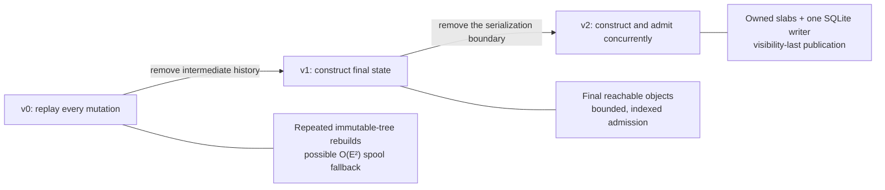
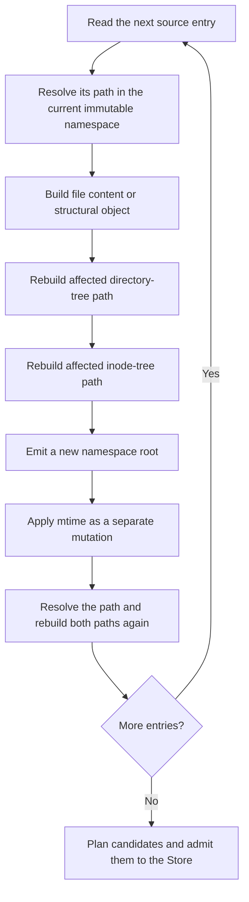
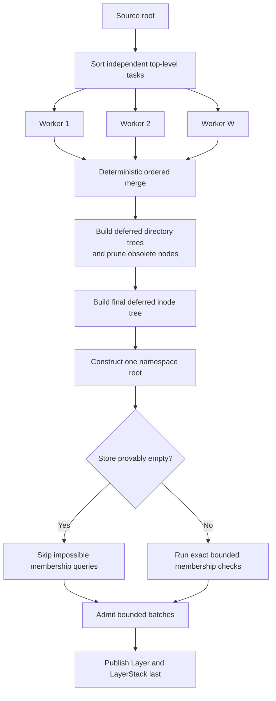
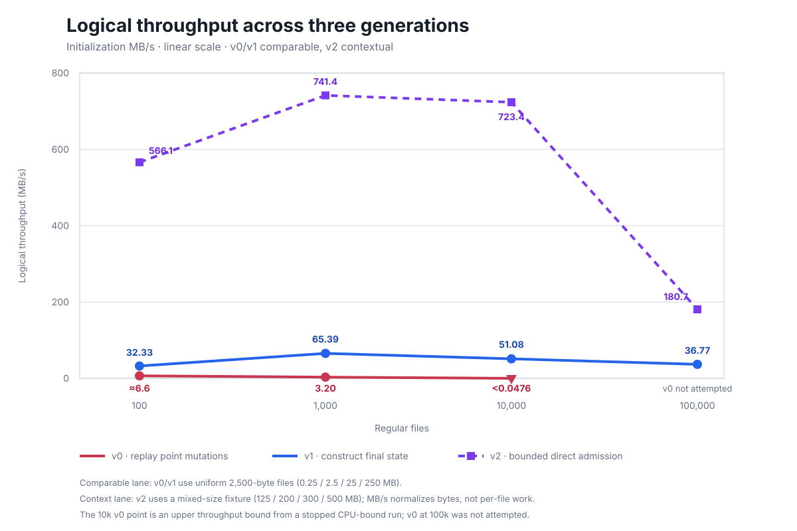
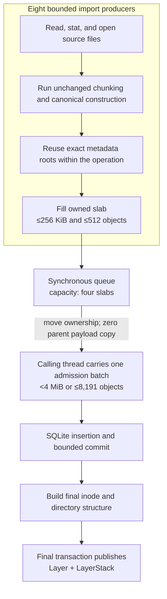
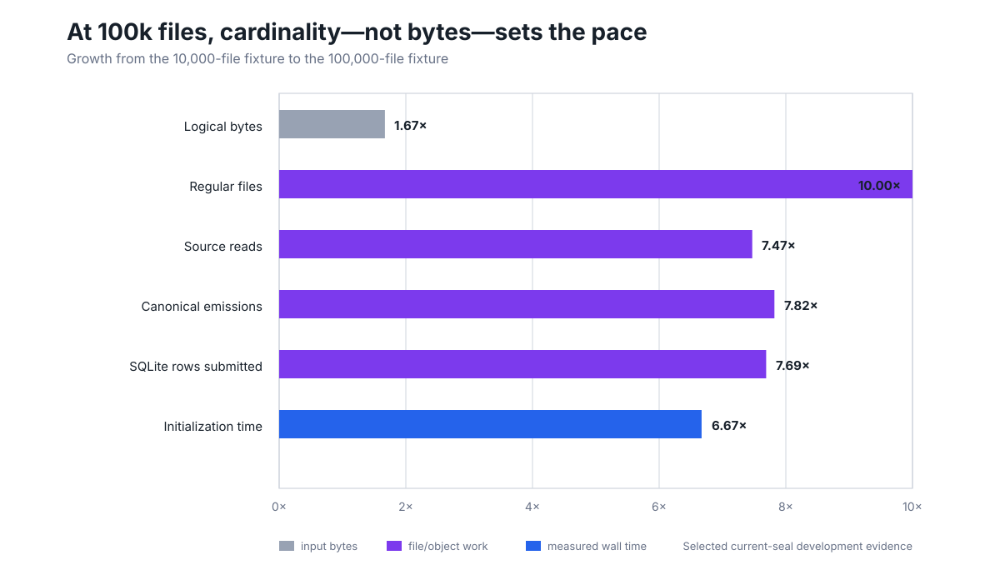

# From 524 Seconds to 489 Milliseconds: Rebuilding LayerFS Namespace Initialization

> **Publication status:** Draft based on LayerFS v0.1.1 development evidence.
> No v0.1.1 release candidate exists. The v2 numbers below describe a measured
> development path, not released performance or a universal guarantee.

Importing 10,000 small files into LayerFS 0.1.0 took more than 524.79 seconds.
The process was still CPU-bound when we stopped it. After replacing the import
architecture, the same deterministic fixture completed in 489.426 milliseconds:
more than a 1,070× improvement.

That result did not come from a faster hash, a larger cache, or a more powerful
database. It came from changing the meaning of the operation.

The original importer treated an existing directory as a long sequence of
ordinary filesystem mutations. Add a file, rebuild the immutable paths affected
by that file, publish a new root, update metadata, and rebuild those paths again.
Repeat for every entry. The replacement asks a simpler question: given the
source directory, what is the one final canonical namespace we need to store?

Once that unnecessary history disappeared, a second bottleneck became visible.
Construction and database admission still happened as separate phases, joined
by hundreds of megabytes of temporary object traffic. The current v2 development
path overlaps those phases through a bounded pipeline, moving ownership of
coarse slabs directly to one SQLite writer and publishing the LayerStack only
after the final structure is complete.

The two shifts—from mutation replay to final-state construction, then from
sequential persistence to bounded direct admission—show what Big-O reveals,
what it hides, and why deleting work beats performing the same work faster.

## The short version



The asymptotic and operational changes can be summarized in one table:

| Generation | Import model | Dominant avoidable cost | Wall-time shape |
| --- | --- | --- | --- |
| v0 | Replay point mutations into an immutable namespace | Intermediate tree versions plus a threshold-triggered linear spool scan | Contains an `O(E·S)` term, commonly `O(E²)` |
| v1 | Build one final reachable namespace | Construction and database admission remain sequential | Approximately `P + A + F` |
| v2 | Build and admit content concurrently, then publish structure | Fixed per-file and SQLite B-tree work remain | Approximately `max(P, A) + F + stalls` |

Here, `E` is the number of emitted canonical objects, `S` is the temporary
object-spool size, `P` is producer work, `A` is Store admission, and `F` is
structural finalization. V0, v1, and v2 are implementation and benchmark
generations, not three public LayerFS releases.

## Why namespace initialization is not “just copying files”

LayerFS is a content-addressed, copy-on-write filesystem for branchable agent
workspaces. A Store holds immutable snapshots and the canonical objects that
describe their files, metadata, directories, and inode relationships. A file's
bytes are chunked, encoded into canonical objects, hashed, and linked into a
tree. Directories and the global inode table are immutable trees too. The final
namespace root authenticates the complete state.

That model lets a small edit reuse unchanged content, lets Branches share
objects, and lets reads authenticate bytes. It also lets a naïve bulk import
manufacture a great deal of short-lived structure.

Inserting one child into a persistent balanced tree creates a new leaf-to-root
path in `O(H) = O(log N)`. That is appropriate for an isolated edit. During
bulk initialization, however, nobody needs the namespace after file 1 or file
9,999—only the final state matters.

To discuss the cost precisely, we use these symbols:

| Symbol | Meaning |
| --- | --- |
| `N` | Regular-file count |
| `D` | Directory count |
| `B` | Total logical source bytes |
| `C` | Content chunks produced by content-defined chunking |
| `E` | All canonical-object emissions, including duplicates and intermediate states |
| `K` | Canonical bytes encoded and hashed across those emissions |
| `A` | SQLite row attempts after deduplication within the current batch |
| `U` | Unique canonical objects ultimately stored |
| `S` | Canonical bytes transferred through temporary object storage |
| `k_d` | Number of children in directory `d` |

An eager importer must discover `N` paths, read `B` bytes, chunk and hash
content, construct final state, and store `U` unique objects. SQLite's B-tree
adds approximately `O(A log U)` primary-key work. Initialization therefore
cannot depend only on bytes: 100,000 tiny files differ fundamentally from five
large files with the same total size.

The goal was not to wish those terms away. It was to make the implementation
approach the necessary cost:

```text
O(B + K + Σ(k_d log k_d) + N log N + A log U)
```

For the benchmark shape, each data directory contains 100 files, so
`Σ(k_d log k_d) = O(N log 100) = O(N)`. The important question is what extra
work the implementation adds on top.

## V0: a bulk operation disguised as thousands of point mutations

LayerFS 0.1.0 reused the ordinary filesystem-mutation path, which already knew
how to resolve names, update persistent trees, and produce valid roots.

But the algorithm replayed every source entry against a namespace that grew
after each step:



One tree update is `O(log N)`. Repeating it for `N` entries is at least
`O(N log N)`, and v0 often performed multiple logical updates per entry. More
importantly, each update emitted structural objects for an intermediate state.
The total emission count was closer to:

```text
E_v0 = O(C + N log N)
```

The final reachable closure is closer to `O(C + N + D)`. The gap consists of
valid canonical objects representing prefixes of an import that no user asked
to preserve.

Structural sharing makes a point update efficient; multiplying it by every
input does not make an efficient bulk builder.

### The 8 MiB threshold that changed the complexity class

Repeated tree construction was only the first amplifier. The decisive collapse
happened later, in candidate handling.

V0 kept an ordered in-memory index for emitted candidate objects. The index was
bounded at 8 MiB and charged roughly 64 bytes per entry, giving room for about
131,072 objects:

```text
8 MiB / 64 bytes ≈ 131,072 indexed objects
```

Below that threshold, exact candidate lookup used the index. After overflow,
the implementation discarded the index and scanned the candidate spool from
byte zero for an exact match. One lookup could become `O(E)` in object count, or
`O(S)` in bytes. Repeating that lookup for later candidates produced an
`O(E·S)` upper bound. With bounded average object size, `S = O(E)`, so the path
was commonly `O(E²)`.

```mermaid
flowchart LR
    O[Canonical object] --> Q{Spool index still available?}
    Q -->|Yes| I[Indexed exact lookup<br/>O(log E)]
    Q -->|No| S[Scan spool from byte zero<br/>O(E) or O(S)]
    S --> R[Repeat for later objects]
    R --> X[Worst case O(E·S)<br/>commonly O(E²)]
```

An algorithm can look healthy below a capacity threshold and enter a different
complexity regime above it. Benchmarks must exercise both sides.

The full v0 upper bound was:

```text
T_v0 = O(B + N log N + E·S + U log U)

with bounded average object size:
T_v0 = O(B + N log N + E² + U log U)
```

The retained profile proves that this path existed. The 524.79-second run is
consistent with crossing it, although the evidence does not pretend that every
second belongs to a single function. V0 also admitted no more than 127 objects
per transaction, adding thousands of transaction and statement-lifecycle costs
once candidate counts grew.

The result was not “SQLite is slow” or “content addressing does not scale.” It
was four multipliers acting together:

- repeated path resolution and persistent-tree reconstruction;
- retention of intermediate structural objects;
- a candidate lookup that fell back to repeated linear spool scans; and
- very small admission transactions.

## V1: ask for the final namespace directly

V1 changed the unit of work. Instead of asking how to replay every creation, it
asked what canonical state should exist when initialization returns.

Workers scan independent top-level directories, read each file once, and
collect final children and compact inode records. Results are merged in a
deterministic order. Deferred local B-trees construct directory and inode state,
obsolete transient nodes are pruned, and only the final reachable nodes are
emitted. The importer then builds one namespace root and publishes it last.



This preserves canonical representation and ordering: the same source metadata,
bytes, and inode seed must produce the same final reachable state.

The emission model moves toward:

```text
v0: E_v0 = O(C + N log N), including intermediate states
v1: E_v1 ≈ O(C + N + D), final reachable objects
```

Candidate handling remains indexed in the measured range, eliminating the v0
`E·S` term. V1's resulting measured-range work class is:

```text
T_v1 = O(B + K + Σ(k_d log k_d) + N log N + A log U)
```

V1 retained a linear-spill fallback beyond roughly 1.4 million unique IDs. The
100,000-file sample produced about 808,000 objects, so the formula describes the
measured range rather than an unlimited guarantee.

### The same-fixture result

The v0 and v1 comparison uses the same deterministic fixtures: 2,500 bytes per
file and 100 files per data directory. The first three v1 values are audited
three-sample medians. The 100,000-file value is one additional audited safety
sample. V0's 10,000-file result is a lower bound because the run was stopped
while still CPU-bound; v0 at 100,000 files was not attempted.



Throughput makes the different byte totals easier to compare, but it does not
erase fixture shape: v2's large anchors amortize per-file work. The dashed v2
series is therefore architectural context; only the solid v0 and v1 series form
a controlled performance comparison.

| Scenario | Logical bytes | v0 initialization | v1 initialization | Improvement |
| --- | ---: | ---: | ---: | ---: |
| 100 files | 0.25 MB | 37.651–38.268 ms | 7.732 ms | about 4.9× |
| 1,000 files | 2.5 MB | 780.515 ms | 38.232 ms | 20.4× |
| 10,000 files | 25 MB | more than 524.79 s | 489.426 ms | more than 1,070× |
| 100,000 files | 250 MB | not attempted | 6.799 s | unavailable |

The curve is more informative than the headline. From 100 to 1,000 files, v0
file count rose 10× while time rose about 20.4×. From 1,000 to 10,000 files,
file count again rose 10× while time rose more than 672×. That discontinuity is
the signature of the candidate-index cliff layered on top of repeated mutation.

### The supporting changes

- A provably empty Store skips impossible membership queries; nonempty Stores
  retain exact checks.
- Admission grows from 127 objects to at most 8,191 objects, still capped below
  4 MiB per transaction.
- Final-only initialization stops building an `O(E)` reference graph it never
  consumes.
- Independent root directories use bounded workers and a deterministic merge.

Parallelism changes wall time, not required work. Amdahl's law still applies:

```text
T_parallel ≈ P / W + R + scheduling overhead
```

V1 removed unnecessary work before adding concurrency; parallelizing v0 would
only have spent more cores on intermediate state.

## V1 solved the cliff, but a sequential boundary remained

Once v1 removed the catastrophic behavior, the importer had a conventional
pipeline-shaped problem implemented as separate stages:

```text
construct complete worker object segments
→ wait for workers
→ write and reread temporary segments
→ admit objects into SQLite
→ build final structural root
```

Construction and database admission were both necessary, but their forced
serialization was not. If producer work takes `P`, admission takes `A`, and
finalization takes `F`, the wall time is approximately:

```text
T_v1_wall ≈ P + A + F
```

The pre-direct v2 baseline made the physical cost visible. At 100,000 files it
moved about 647 MB into a temporary canonical-object segment, reread that 647
MB, and then wrote about 543 MB of final canonical payload into SQLite. The
temporary pass added roughly 1.294 GB of traffic and prevented the producer and
Store lanes from overlapping.

This is the sort of bottleneck Big-O notation can understate. Both stages are
linear in their inputs. Replacing `P + A` with `max(P, A)` does not necessarily
change the asymptotic work class, but it can substantially shorten the critical
path.

## V2: bounded direct admission

The current v2 development path lets existing import producers hand canonical
objects directly to the calling thread, which remains the sole SQLite owner.
It uses no second database connection, no new database worker, and no second
product worker pool.



The direct path is deliberately narrow. It applies to the first LayerStack in
a proven-empty Store when the nonempty source root contains only top-level
directories, no hard link is detected, and structural limits hold. A root-level
regular file or symlink, a hard link, or a nonempty Store selects the canonical
final-state fallback. The v2 benchmark fixture qualifies by construction: its
root contains independent data directories, each containing 100 files.

Direct admission can stream path-independent content early, but hard links add
cross-path identity. Rather than weaken those semantics, the importer falls
back.

### Why owned slabs instead of an object queue

Each producer accumulates canonical objects in an owned slab until either of
two limits is reached:

```text
payload ≤ 256 KiB
objects ≤ 512
```

The byte cap bounds payload memory; the object cap bounds headers for tiny
objects. The underlying vector moves into the admission batch without a parent
payload copy.

At 100,000 files, the retained counters report about 439,070 slab objects in
2,147 handoffs, carrying 544,309,172 payload bytes. The queue peaked at its
four-slab limit and 1,048,576 payload bytes. Parent payload copies were zero.

Object-granular handoff adds wakeups; a complete vector scales with the
namespace; a disk spool recreates the removed phase. Coarse slabs instead
amortize coordination and provide bounded backpressure.

### Why one SQLite writer is enough

SQLite time was dominated by primary-key and object-table insertion, page
balancing, and commit writes. Cross-batch conflict reads at 100,000 files were
only about 151 KB and 13 milliseconds.

A reader cache would optimize the wrong side, while multiple writers would add
contention and ordering. One owner reuses the Store gate and keeps failure
handling deterministic.

The writer carries one exact-dedup batch across slab and worker boundaries,
flushing before 4 MiB or 8,191 objects. Global uniqueness remains the Store's
job; no namespace-sized ID set is added.

### Exact metadata reuse: cache results, not policy

Many files share the same canonical metadata input: inode kind, permission
mode, mtime seconds, and mtime nanoseconds. The v2 importer keeps an eight-entry,
operation-local mapping from that exact tuple to the root object ID produced by
the unchanged metadata builder.

The first occurrence is built normally; an exact match reuses its deterministic
root. The cache starts empty, ends with the operation, and never depends on a
warmed process or approximate equivalence.

At 100,000 files, exact reuse changed the profile substantially:

| Counter | Before exact reuse | Current direct path |
| --- | ---: | ---: |
| Canonical emissions | about 1,132,000 | about 439,070 |
| Pending duplicate candidates | 708,845 | about 15,200 |
| Canonical payload | about 601.8 MB | 544.3 MB |
| Exact metadata hits | 0 | 99,000 |
| Exact metadata misses | unavailable | 2,000 |

This removes roughly 693,000 encode, hash, and transfer operations with `O(1)`
bounded lookup. The isolated cache had not moved wall time decisively while the
spool remained; in the direct pipeline, every avoided object also avoids
handoff and admission.

### Publish structure last

Content objects are unreachable until a public root points to them. V2 admits
them early but keeps structure compact until order and eligibility are known.

Only the final transaction publishes the Layer and LayerStack, so readers see
no LayerStack or the complete one.

This is visibility-last, not one atomic SQLite transaction. Object-only commits
occur during production. A handled failure clears them; a process crash can
leave unreachable rows, but cannot expose a partial LayerStack. Logical
visibility and physical cleanup are different guarantees.

The large canonical-object segment is gone:

```text
object_segment_write_bytes    = 0
object_segment_raw_read_bytes = 0
object_segment_passes         = 0
parent_payload_copy_bytes     = 0
```

V2 retains a compact 64-byte `(InodeId, record ObjectId)` stream: 6,464,000
bytes at 100,000 files, versus the removed 647 MB segment. The Store still grows
by roughly 662 MB for the 500 MB fixture. Zero object-segment traffic is not
zero temporary I/O, storage amplification, or durable writing.

## The critical path changed even though Big-O mostly did not

V2 retains the same broad work class as v1:

```text
T_v2_work = O(B + K + Σ(k_d log k_d) + N log N + A log U)
```

Batch-local dedup adds expected `O(E)` hash-map work, but the map is bounded by
the admission batch. SQLite still owns global uniqueness. The direct path does
not remove source system calls, canonical encoding, final tree construction, or
database index maintenance.

What changes is the schedule:

```text
Sequential v1
producer  [================ P ================]
SQLite                                      [======= A =======]
final                                                         [= F =]
wall time ≈ P + A + F

Pipelined v2
producer  [================ P ================]
SQLite           [=========== A ===========]
final                                          [= F =]
wall time ≈ max(P, A) + F + stalls
```

This is why asymptotic analysis and critical-path analysis belong together.
Big-O answers how total work grows. The pipeline equation answers which work is
serialized on the user's clock. An architecture can preserve the same
asymptotic class yet remove an entire pass over hundreds of megabytes and
overlap two necessary linear stages.

The reverse is also true: concurrency cannot rescue a bad work class. V0's
repeated mutation and spool fallback had to disappear before pipelining was
worth discussing.

## What the v2 measurements say—and what they do not

V2 uses a different benchmark fixture from v0 and v1. It is mixed-size and
small-heavy, with exact 100 MB anchor files. The anchors make byte throughput
visible while the many small files keep namespace cost visible. Because both
the algorithm and byte distribution changed, v2 MB/s must not be presented as a
pure v1-to-v2 speedup.

The selected current-seal development medians are:

| Scenario | Files | Logical bytes | Initialization | Throughput | File rate |
| --- | ---: | ---: | ---: | ---: | ---: |
| `namespace-100` | 100 | 125 MB | 220.820 ms | 566.1 MB/s | 452/s |
| `namespace-1000` | 1,000 | 200 MB | 269.757 ms | 741.4 MB/s | 3,707/s |
| `namespace-10000` | 10,000 | 300 MB | 414.729 ms | 723.4 MB/s | 24,112/s |
| `namespace-100000` | 100,000 | 500 MB | 2.766 s | 180.7 MB/s | 36,149/s |

Every selected tier-specific binding median passes. The 100,000-file row
remains below the preferred, nonbinding outcome of 2.5 seconds and 200 MB/s.
The selected table combines a supplemental 100-file report with the other
three rows and composite proof from a second report carrying the same source
seal. The raw reports remain separate and unchanged. This is development
evidence, not a reconstructed release campaign.

The jump from 10,000 to 100,000 files explains why byte throughput falls at the
largest tier. Logical bytes rise only 1.67×, but file and directory counts rise
10×. Source reads, canonical emissions, and SQLite row submissions grow about
7.5–7.8×. Initialization grows 6.67×.



The cost model is visible in the counters:

```text
T(N, B, U) = source_syscalls(N)
           + content_processing(B)
           + canonical_work(U)
           + SQLite_insert(U log U)
           + inode_tree(N log N)
           + pipeline_stalls
```

At the first three tiers, large anchor files make byte processing dominant and
per-file work amortizes well. At 100,000 files, cardinality terms dominate the
modest byte increase. This is not a return of the v0 quadratic cliff. It is the
expected cost of 100,000 filesystem entries and roughly 422,000 unique Store
objects becoming visible, plus a remaining pipeline-utilization gap.

## Initialization is only one part of the user journey

A fast import is not useful if opening or modifying the resulting workspace
scans the entire Store. The benchmark therefore measures a complete public
lifecycle: initialize a LayerStack, fork a Branch, create a real-FUSE
Workspace, overwrite ten bytes, commit, end the Workspace, reconnect to a fresh
Store client, reopen through real FUSE, and verify the exact path set, content,
metadata, expected edit, digest, and cleanup.

Two adjacent architecture changes keep the namespace win from moving the
bottleneck into Create and Commit.

Workspace Create previously loaded Store-wide small-object state. Demand loading
moves it from approximately `O(Store objects)` toward `O(bootstrap and requested
roots)`, with selected medians of 12.394–18.750 milliseconds.

Localized Commit previously built complete manifests for a ten-byte overwrite.
Rebuilding only the touched inode path moves planning from `O(N)` toward
`O(log N + changed bytes)`, with selected medians of 2.532–3.857 milliseconds.
Topology changes retain the complete-manifest fallback.

| Files | Initialize | Workspace Create | Ten-byte Commit | Exact reopen verification | Complete product |
| ---: | ---: | ---: | ---: | ---: | ---: |
| 100 | 220.820 ms | 14.742 ms | 2.730 ms | 1.029 s | 1.281 s |
| 1,000 | 269.757 ms | 12.394 ms | 2.532 ms | 1.581 s | 1.875 s |
| 10,000 | 414.729 ms | 18.750 ms | 3.448 ms | 5.614 s | 6.062 s |
| 100,000 | 2.766 s | 12.556 ms | 3.857 ms | 47.367 s | 50.165 s |

The table also prevents a misleading conclusion. Initialization is fast at
100,000 files, but exact fresh-reopen verification deliberately reads and
checks the whole 500 MB namespace through real FUSE, so the complete lifecycle
takes about 50 seconds. The benchmark reports both clocks rather than hiding
verification outside a different sample.

Bounded FUSE read-ahead also removes overlapping fetches: the 300 MB and 500 MB
verification tiers now fetch exactly the bytes they serve. That gain belongs to
the lifecycle, not initialization throughput.

## Bounded does not mean “memory is O(1)” everywhere

The direct canonical-payload pipeline has explicit fixed parameters:

```text
W = 8 producers
Q = 4 queued slabs
s = 256 KiB per slab
a = 4 MiB admission payload limit

M_payload = O(W·s + Q·s + a) = O(1) with respect to N and B
```

That statement is intentionally narrow. Top-level task descriptors are `O(D)`.
Deferred directory and inode construction retain structural state tied to their
inputs. Compact inode pairs are `O(N)`, although they are primarily file-backed
and bounded in memory. The durable Store is necessarily `O(B + U)`.

In the selected 100,000-file evidence, modeled named buffers peak at 9.63 MiB.
The initialization incremental process high-water peaks at 98.23 MiB, and the
complete-lifecycle incremental high-water peaks at 198.73 MiB. These numbers are
not interchangeable. Named-buffer instrumentation is not a census of allocator,
SQLite, stack, deferred-tree, shared-code, and runtime memory. Native process
high-water remains the aggregate measure.

The practical guarantee is simpler: the importer does not hold the entire
canonical payload in a namespace-sized vector or an unbounded queue. Backpressure
is explicit. Memory saved by removing the spool is not silently reintroduced as
an unlimited in-memory buffer.

## The invariants mattered more than any one optimization

Performance work can create impressive numbers by measuring a different
product. These shifts preserve:

- canonical encoding, directory order, and content-defined chunking behavior;
- the five-table Store schema, eager initialization, and public semantics;
- exact same-ID/different-byte collision rejection;
- hard-link, rename, mode, mtime, symlink, and open-unlink behavior;
- one Store gate, one SQLite owner, visibility-last publication, and the public
  SDK, CLI, daemon, proxy, and FUSE contracts.

Each LayerStack identity supplies an inode seed, so independent imports need not
share a root. Equivalence means the same source and seed produce the same final
reachable state—not the same physical Store population, because v2 omits
unreachable intermediates.

Correctness is also why the direct path has an eligibility gate and a fallback.
The fastest path is not allowed to reinterpret source shapes it cannot yet
stream safely.

## The pre-release boundary still open

The current fixture has exactly 1,000 top-level directories. The direct path
creates one compact-pair task block for each top-level directory, while the
stream rejects more than 1,000 blocks. The architecture audit therefore found
an apparent uncovered case: an otherwise eligible source with 1,001 top-level
directories may enter direct admission and fail instead of selecting the
existing fallback.

The intended correction is small: reject direct eligibility during preflight,
before any direct admission begins, and use the canonical final-state path. But
until a focused test contains or disproves the case, this blog cannot present
v2 as universally compatible or ready for release.

The remaining release work is not another speculative tuning campaign. It is
to resolve that boundary, reconcile the split selected evidence with the final
admission contract, freeze a clean immutable release source, and rerun any
comparison attributed directly to the released binary. The preferred 200 MB/s
and stretch 250 MB/s outcomes at 100,000 files remain visible misses, not
release blockers.

## Five design lessons beyond LayerFS

The details are filesystem-specific, but the architecture lessons transfer to
databases, compilers, build systems, event processors, and any system that
turns a large input into immutable state.

### 1. A correct point-operation API is not automatically a bulk algorithm

Reusing one mutation path is a sound first implementation, but a bulk operation
should not pay for intermediate states it never exposes. Build final state
directly and prove equivalence at the observable boundary.

### 2. Bounded fallback behavior belongs in the complexity analysis

“We use an index” was true below 8 MiB and false above it. Capacity limits are
part of the algorithm: benchmark both sides and include the fallback term in the
cost model. The same rule applies to cache eviction and sort spill behavior.

### 3. Delete work before parallelizing it

V1 removed intermediate construction and spool scans; v2 then overlapped two
necessary stages. Parallelizing v0 would only manufacture useless states on
more cores.

### 4. Big-O and critical-path equations answer different questions

V1 and v2 have similar broad work classes, yet `P + A + F` and
`max(P, A) + F + stalls` feel very different to a user. Total-work analysis
guards against scaling cliffs. Critical-path analysis exposes serialized phases,
idle resources, and overlap opportunities. A serious performance explanation
needs both.

### 5. Report the lane you measured

V0 and v1 form a direct comparison; v2's changed fixture belongs in a separate
lane. Likewise, initialization, Create, Commit, and verification need separate
clocks. Without fixture identity and measurement boundaries, a number is an
anecdote.

## What actually made LayerFS faster

The final design can be stated without the history:

```text
scan once
→ build in bounded deferred structures
→ prune obsolete transient structural nodes
→ emit only the final reachable structure
→ move canonical payload through bounded owned slabs
→ admit with one SQLite owner
→ publish the LayerStack once, at the end
```

The performance change came mainly from what is no longer there:

| Removed | Retained |
| --- | --- |
| Replay every source entry as a public mutation | One source traversal and one final-state construction |
| A growing history of intermediate namespace roots | The final reachable canonical closure |
| Post-index linear spool scans | Bounded exact deduplication and Store collision checks |
| Empty-Store membership queries with a predetermined answer | Exact behavior for nonempty Stores |
| Thousands of tiny transactions | Bounded sub-4-MiB / 8,191-object transactions |
| Duplicate metadata graph construction | Exact roots produced by the unchanged builder |
| A 647 MB object-segment write and reread | Direct ownership transfer plus a 6.464 MB compact pair stream |
| Store-wide Workspace Create scans | Authenticated demand loading |

The remaining costs—100,000 POSIX file operations, roughly 422,000 unique
objects, final tree construction, and SQLite writes—would require a different
representation or semantic contract to remove. They are product decisions, not
hidden v0.1.1 optimizations.

The result is not simply “1,070× faster.” LayerFS still reads files, constructs
authenticated content, stores the final namespace, and proves it through real
FUSE. It stopped preserving—and spooling—the private history of how the import
could have been replayed.

That is the architecture shift: compute the state users asked for, move each
necessary byte once when possible, bound everything that can queue, and make
the final root visible only when it is true.

---

The complete complexity derivation, evidence qualifications, implementation
map, raw report identities, and remaining admission conditions are in the
[namespace architecture record](architecture_shift.md). See also the
[namespace-v2 specification](namespace-optimization-spec.md) and the
[v0.1.1 roadmap](README.md).
