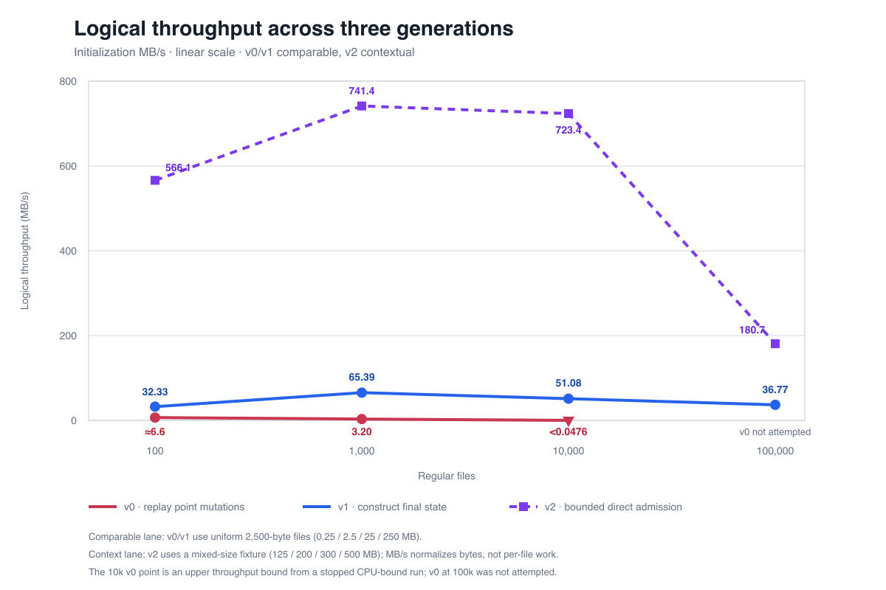
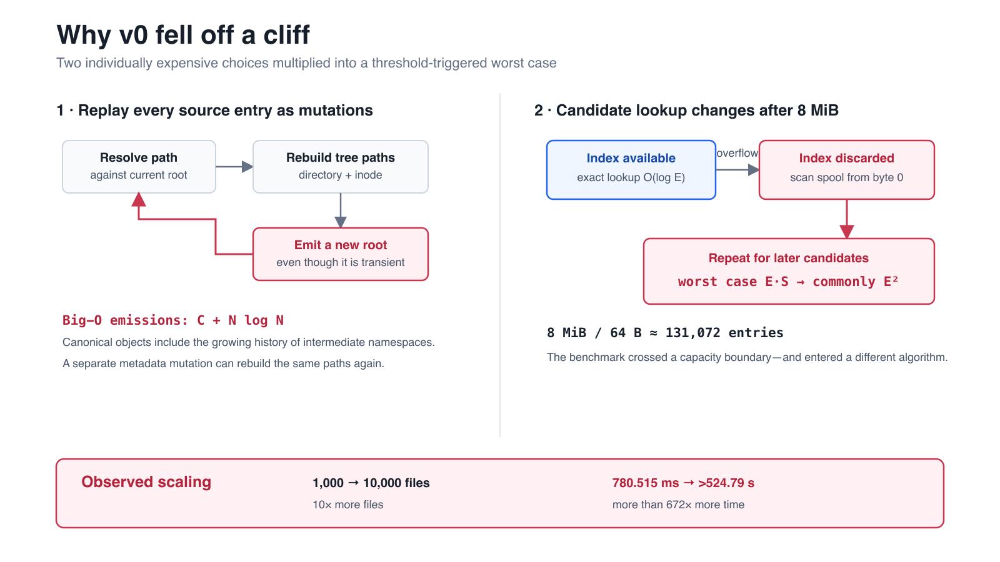
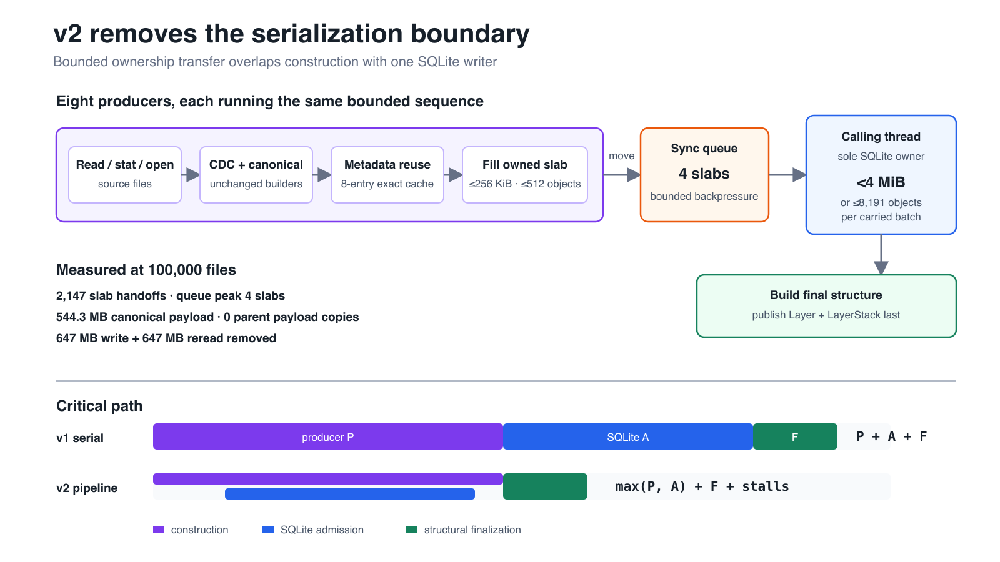
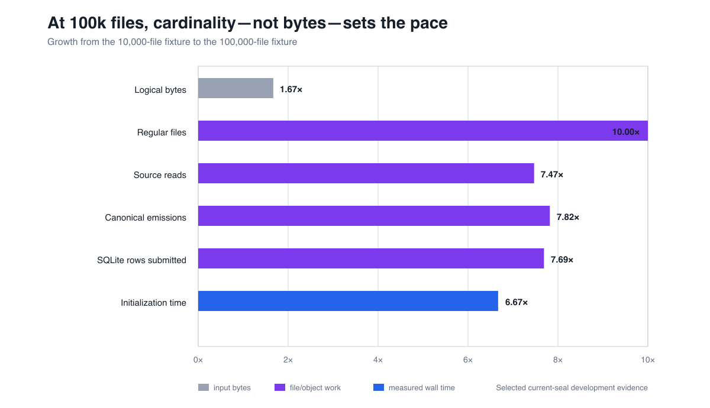

# LayerFS v0.1.1 Release: Rebuilding Namespace Initialization for Large Workspaces

LayerFS v0.1.1 corrects a namespace-initialization architecture that did not
scale beyond small directories.

The LayerFS 0.1.0 importer remained CPU-bound after **524.79 seconds** on a
10,000-file, 25 MB fixture. The replacement final-state path completes the same
fixture in **489.426 milliseconds**. That large gap primarily measures how
flawed the old bulk-import design was; it is not a multiplier we consider worth
celebrating. On the current mixed-size development fixture, the newer direct
path initializes 100,000 files and 500 MB in **2.766 seconds**, or **180.7
MB/s**.

These measurements come without changing the canonical object format, the
five-table Store schema, eager initialization, or public SDK behavior. The
LayerStack still becomes visible only after its complete structure is ready.

The correction required two architecture shifts, each discovered through a
different experiment:

- **v0 → v1:** replace thousands of persistent point mutations with one
  deterministic final-state construction.
- **v1 → v2:** replace a sequential write-and-reread boundary with a bounded
  pipeline feeding one SQLite owner.

Between those shifts, we also ran an optimization that substantially reduced
object construction but did not initially deliver a clear wall-time win.
That negative result mattered: it showed us that the next bottleneck was not
inside a worker, but between phases.

The story starts with a benchmark curve that could not be explained by bytes or
ordinary `O(N log N)` tree work.

## 1. The baseline: a curve that should not exist

LayerFS is a content-addressed, copy-on-write filesystem for branchable agent
workspaces. Files, metadata, directories, and the global inode table are stored
as immutable canonical objects. Updating a persistent tree creates a new
leaf-to-root path while sharing the unchanged remainder.

That is a good model for ordinary edits. A ten-byte change can reuse almost
everything around it. But LayerFS 0.1.0 also used that point-mutation path to
initialize an entire existing directory.

Our first controlled fixture used unique deterministic files, each exactly
2,500 bytes, grouped 100 files per directory. We measured the public lifecycle
through real Linux FUSE.

- **100 files · 0.25 MB:** 37.651–38.268 ms, or 6.53–6.64 MB/s.
- **1,000 files · 2.5 MB:** 780.515 ms, or 3.20 MB/s.
- **10,000 files · 25 MB:** more than 524.79 seconds, or less than 0.0476
  MB/s. The run was stopped while still CPU-bound.
- **100,000 files · 250 MB:** not attempted after the defect was established.

Read as a sequence, throughput fell from roughly 6.6 MB/s to 3.2 MB/s and then
below 0.0476 MB/s. A storage-throughput limit did not explain why modest input
growth produced rapidly worsening CPU-bound throughput. The shape directed the
investigation toward work amplification and threshold behavior inside the
importer.

The 100-file result looked merely slow. The 1,000-file result looked concerning.
The 10,000-file result revealed a different algorithm.

We resisted turning the first slow run into a diagnosis. The fixture was built
outside LayerFS timing, every file had path-derived content, and each tier used a
fresh process and Store. The timed path continued beyond initialization through
Branch fork, Workspace Create, a ten-byte overwrite, Commit, End, fresh Store
reconnect, and exact reopen verification. The stopped 10,000-file run stayed in
the record as a lower bound instead of being discarded as an inconvenient
sample. Those choices separated source preparation, cache effects, and product
correctness from the importer itself.



The chart uses a linear MB/s scale. V0 and v1 are directly comparable because
they use the same uniform fixture. V2 is shown as a dashed context line because
its mixed-size fixture contains 125, 200, 300, and 500 MB across the four tiers.
MB/s normalizes byte volume; it does not normalize per-file work or data shape.

## 2. V0 → v1: the importer was preserving history nobody needed

The v0 importer treated each source entry as an ordinary public mutation:

```text
resolve path
→ build content
→ update directory tree
→ update inode tree
→ emit a new namespace root
→ apply metadata as another mutation
→ repeat
```

One update to a persistent balanced tree costs approximately `O(log N)`.
Repeating it for `N` files creates at least `O(N log N)` structural work. V0
often performed multiple updates per entry, including a separate mtime change.

The more important problem was what those updates emitted. Every intermediate
directory and inode-tree root was a valid canonical object, even though users
could never observe the namespace after file 4,237. V0's emission count was
closer to:

```text
E_v0 = O(C + N log N)
```

Here `C` is content-chunk count and `E` is every canonical emission, including
duplicates and intermediate states. The final reachable closure is closer to
`O(C + N + D)`, where `D` is directory count.

Then we found the cliff.

Candidate objects had an ordered in-memory index capped at 8 MiB. At roughly 64
bytes per entry, it held about 131,072 objects. Below that boundary, exact lookup
was indexed. After overflow, the implementation discarded the index and scanned
the candidate spool from byte zero.

One lookup became `O(E)` in object count, or `O(S)` in spool bytes. Repeating it
for later objects created an `O(E·S)` upper bound. With bounded average object
size, `S = O(E)`, giving a commonly quadratic `O(E²)` path.



The measured collapse was not proof that every one of the 524.79 seconds came
from that function. It was proof that a quadratic path existed, and the curve
was consistent with crossing its threshold.

### Experiment 1: build final state, not mutation history

V1 changed the question from “how do we replay every file creation?” to “what
is the final canonical namespace?”

Workers scanned independent top-level directories, read content once, and
collected final children plus compact inode records. Results were merged in a
deterministic order. Deferred local B-trees built the final directory and inode
structures; obsolete transient nodes were pruned; one namespace root was
published last.

This removed the `E·S` spool-scan term in the measured range and moved emissions
toward the final reachable closure:

```text
v0 emissions: O(C + N log N), including intermediates
v1 emissions: ≈ O(C + N + D), final reachable state
```

We also applied four smaller changes, each tied to a measured source of work:

- **Empty-Store proof:** skip membership queries whose answer is predetermined.
- **Larger bounded batches:** grow transactions from at most 127 objects to at
  most 8,191 objects—still below 4 MiB—to remove thousands of tiny transaction
  boundaries.
- **No unused reference graph:** delete `O(E)` parsing and bookkeeping that
  final-only initialization never consumes.
- **Bounded root workers:** import independent directories concurrently, then
  merge deterministically so wall time falls without changing canonical order.

The same-fixture result shows the defect was removed:

- **100 files:** v0 took about 38 ms; v1 took 7.732 ms.
- **1,000 files:** v0 took 780.515 ms; v1 took 38.232 ms.
- **10,000 files:** v0 exceeded 524.79 seconds; v1 took 489.426 ms.
- **100,000 files:** v0 was not attempted; v1 took 6.799 seconds.

The optimization did not change LayerFS's canonical bytes, Store schema, eager
initialization semantics, or public SDK behavior. It stopped constructing
reachable history that the operation never promised to expose.

That was the first lesson: an efficient point-update algorithm is not
automatically an efficient bulk builder.

## 3. V1 → v2: Big-O was better, but the wall clock still had two lanes in series

V1 removed the catastrophic algorithm. Its remaining work class was roughly:

```text
O(B + K + Σ(k_d log k_d) + N log N + A log U)
```

`B` is source bytes, `K` is canonical bytes encoded and hashed, `A` is SQLite
row attempts, and `U` is unique stored objects. These terms reflect real work:
read input, construct authenticated state, build final trees, and maintain the
SQLite object index.

But the implementation still divided that work into sequential phases:

```text
construct complete worker segments
→ wait for workers
→ write segments
→ reread segments
→ admit objects into SQLite
→ finalize structure
```

If producer work takes `P`, admission takes `A`, and finalization takes `F`, the
wall clock looks like `P + A + F`.

### Experiment 2: change the fixture before chasing the next bottleneck

The uniform 2,500-byte fixture exposed namespace scaling but said little about
the interaction between small-file overhead and bulk byte throughput. For v2,
we kept the same four file-count tiers and 100 files per directory, but used a
deterministic small-heavy distribution with empty, tiny, small, medium, and
exact 100 MB anchor files.

This was a benchmark-contract change, not a product optimization. It forced us
to report v2 in a separate comparison lane.

The pre-direct 100,000-file result was about 4.502 seconds and 111.1 MB/s. Its
profile exposed the next architectural issue:

```text
647 MB → temporary object-segment write
647 MB → temporary object-segment reread
543 MB → final SQLite canonical payload
```

We were moving roughly 1.294 GB through an intermediate representation before
performing the durable write. Construction and SQLite admission could not
overlap.

### Experiment 3: metadata reuse helped the work count—but not yet the clock

Files often shared exactly the same canonical metadata tuple:

```text
(inode kind, mode, mtime seconds, mtime nanoseconds)
```

We added an eight-entry, operation-local cache per importer. The first exact
tuple used the unchanged metadata builder; later matches reused its deterministic
root object ID. The cache started empty and disappeared after initialization.

At 100,000 files, the profile changed sharply:

- **Canonical emissions:** about 1,132,000 → about 439,070.
- **Pending duplicate candidates:** 708,845 → about 15,200.
- **Exact metadata cache hits:** 0 → 99,000.

That removed roughly 693,000 encode, hash, and transfer operations. Yet the
earlier isolated cache experiment did not materially change wall time while the
object spool remained.

This was useful negative evidence. Optimizing a producer could not erase the
larger serialization boundary.

### Experiment 4: remove the boundary with bounded direct admission

V2 connected the existing producers to the calling thread through owned slabs.
Each of eight producers reads source files, runs unchanged chunking and
canonical construction, reuses exact metadata roots, and fills a slab bounded
by both 256 KiB and 512 objects.

A synchronous queue holds at most four slabs. The calling thread remains the
sole SQLite writer and carries one exact-dedup batch across slab and worker
boundaries, flushing below 4 MiB or at 8,191 objects.



At 100,000 files, the pipeline recorded:

- 2,147 slab handoffs carrying about 439,070 objects;
- 544.3 MB of canonical payload;
- a queue peak of four slabs and 1 MiB of queued payload;
- zero parent payload copies; and
- zero canonical object-segment writes or rereads.

The large spool vanished instead of becoming a larger memory buffer. Producers
and SQLite now overlap, moving the wall-time model toward:

```text
max(P, A) + F + pipeline stalls
```

The broad Big-O work class barely changed from v1. The critical path did.

The resource counters mattered as much as the time. Modeled named buffers
peaked at 9.63 MiB. Initialization incremental process high-water was 98.23 MiB;
the complete lifecycle reached 198.73 MiB. These are different measures—the
first is instrumented buffer ownership, the latter two are process-wide memory.
The claim is deliberately narrow: canonical payload no longer scales as one
complete in-memory namespace or an unbounded queue. Top-level tasks, deferred
trees, compact inode pairs, and the durable Store still scale with their inputs.

## 4. The v2 result: bounded and still cardinality-sensitive

The selected current development medians are:

- **100 files · 125 MB:** 220.820 ms, 566.1 MB/s, and 452 files/s.
- **1,000 files · 200 MB:** 269.757 ms, 741.4 MB/s, and 3,707 files/s.
- **10,000 files · 300 MB:** 414.729 ms, 723.4 MB/s, and 24,112 files/s.
- **100,000 files · 500 MB:** 2.766 seconds, 180.7 MB/s, and 36,149 files/s.

These are effective logical-throughput measurements, not claims about physical
disk limits. Each LayerFS process and Store was fresh; the generated fixture was
reused without deliberately warming or clearing the host page cache.

Why does throughput fall at 100,000 files? Because bytes increase only 1.67×
from the 10,000-file tier, while file and directory counts increase 10×.
Canonical emissions increase 7.82×, SQLite rows 7.69×, and initialization time
6.67×.



This is no longer the v0 quadratic cliff. It is source syscalls, canonical
object count, SQLite B-tree insertion, and final inode-tree construction
becoming visible once the large-file anchors stop dominating the clock.

The complete public lifecycle matters too. At 100,000 files, Workspace Create
is 12.556 milliseconds and a localized ten-byte Commit is 3.857 milliseconds.
Exact fresh-reopen verification through real FUSE takes 47.367 seconds because
it deliberately reads and verifies the complete 500 MB namespace. The complete
product clock is 50.165 seconds. We report that so the initialization
measurement does not hide verification work.

Those Create and Commit numbers required adjacent fixes. Create had loaded
Store-wide small-object state, making workspace startup sensitive to unrelated
Store population. Demand loading moved it toward the bootstrap and roots users
actually request. Commit had compared complete base and final namespace
manifests even for a ten-byte overwrite. When topology is unchanged, it now
resolves the touched inode, writes the changed range, and rebuilds only affected
tree paths—moving planning from `O(N)` toward `O(log N + changed bytes)`.
Renames, links, and other topology changes keep the complete-manifest fallback.

This matters because a benchmark can move a bottleneck rather than remove it.
The initialization correction would mean little if the next Workspace Create or
tiny Commit immediately rescanned 100,000 files.

## What we preserved—and what remains open

Across both shifts, LayerFS kept the same canonical encoding, directory order,
content-defined chunking, five-table Store schema, eager initialization,
collision checks, hard-link semantics, and visibility-last publication.

V2's direct path is intentionally narrow: a first LayerStack in a proven-empty
Store, a source root containing top-level directories, no detected hard links,
and supported structural limits. Other accepted shapes use the canonical v1
fallback.

One pre-release boundary remains. The current fixture has exactly 1,000
top-level directories, and the compact-pair stream rejects more than 1,000 task
blocks. Until an eligibility preflight contains the 1,001-directory case, these
numbers are development evidence—not a release claim.

The large timing ratio is not the accomplishment. It is evidence that the v0
architecture was badly wrong for bulk import.

We measured beyond the comfortable tier. We found a hidden complexity-class
change. We replaced mutation replay with final-state construction. We ran an
optimization that reduced work but did not move the wall clock enough. That
negative result led us to the real sequential boundary. Then we removed the
boundary with bounded ownership transfer rather than another unbounded cache or
worker pool.

The durable lesson is simple:

```text
Build only the state users can observe.
Move necessary bytes once when possible.
Bound every queue.
Publish the root last.
```

LayerFS v0.1.1 replaces the design responsible for the 524-second failure, then
removes the next serialization boundary exposed by the corrected path. The
result is a bounded architecture we can reason about and measure at 100,000
files—not a flattering comparison against a baseline that should never have
scaled that way.

The important change was recognizing that most of the old work never needed to
exist.

## Follow LayerFS on GitHub

LayerFS is open source. Explore the implementation, benchmark contracts, raw
evidence, architecture records, and roadmap:

**[github.com/Ephemeral-AI-Lab/layerfs](https://github.com/Ephemeral-AI-Lab/layerfs)**

If you build agent infrastructure, content-addressed storage, or large immutable
systems, tell us what workloads matter to you. If this work is useful, drop the
repository a ⭐ Star—it helps more builders find LayerFS.
