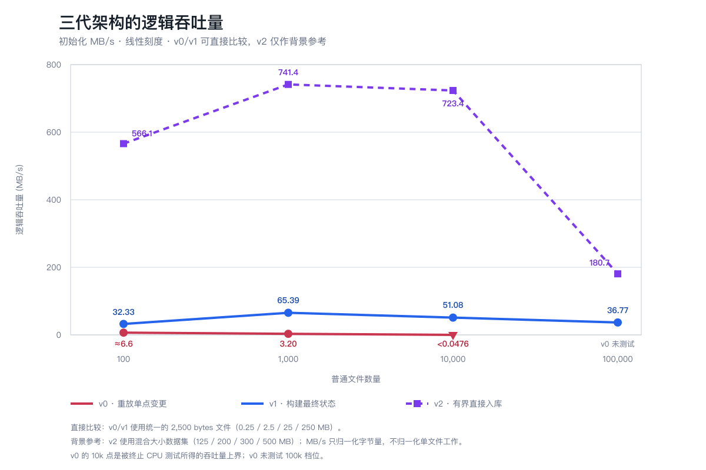
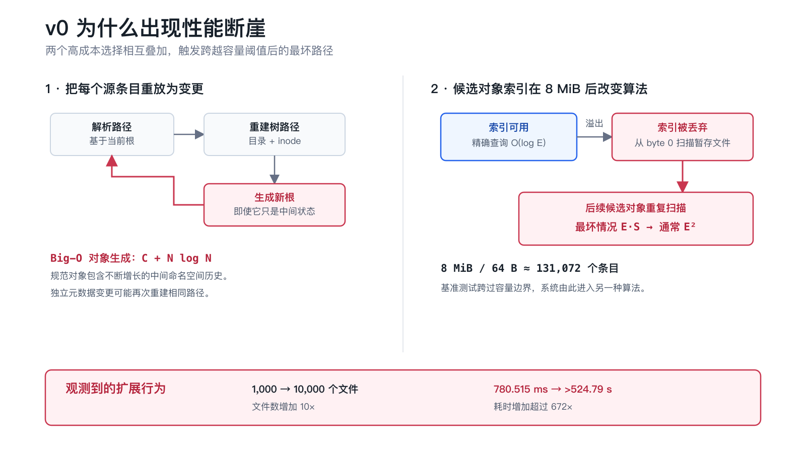
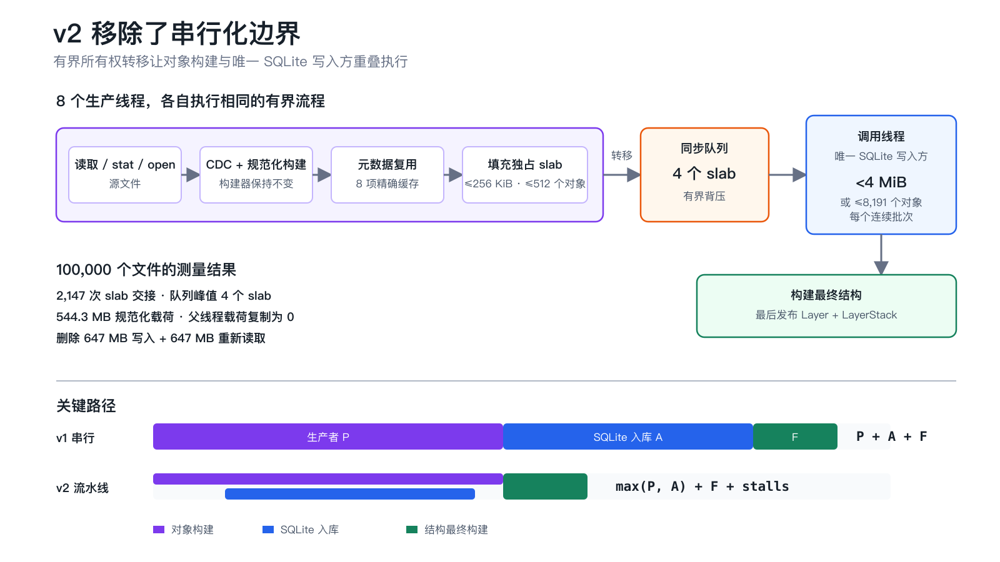
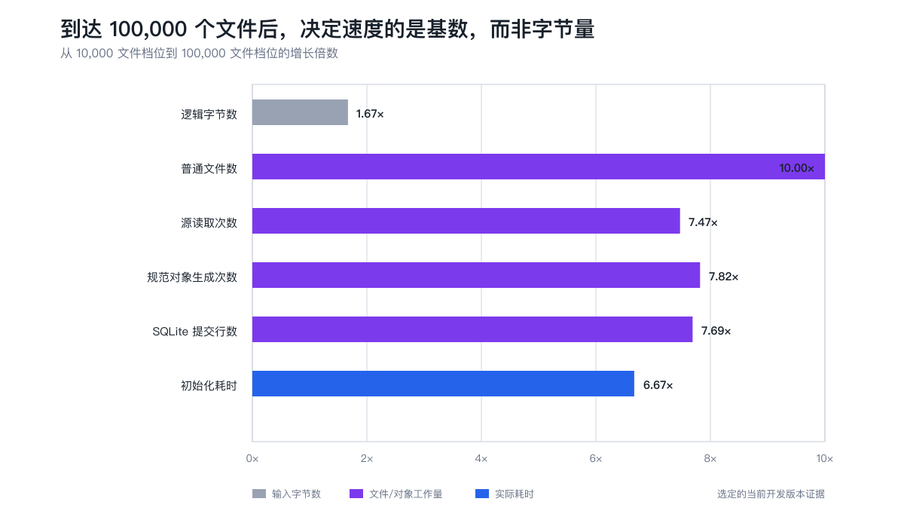

# LayerFS v0.1.1 发布：面向大规模工作区重构命名空间初始化

LayerFS v0.1.1 修正了一套只能应对小型目录、无法随命名空间规模正常扩展的初始化架构。

在包含 10,000 个文件、总计 25 MB 的基准数据集上，LayerFS 0.1.0 的导入进程运行 **524.79 s** 后仍然占用 CPU，因此我们主动终止了测试。替代它的最终状态构建路径，在相同数据集上耗时 **489.426 ms**。如此巨大的差距，首先说明旧的批量导入设计存在严重缺陷，而不是一个值得庆祝的性能倍数。

在当前混合文件大小的开发基准数据集上，更新后的直接入库路径可以在 **2.766 s** 内初始化 100,000 个文件和 500 MB 数据，逻辑吞吐量为 **180.7 MB/s**。

这些测量结果没有以改变产品语义为代价。LayerFS 仍然使用相同的规范化对象格式、Store 五表数据库模式、立即执行的目录初始化和公开 SDK 行为。只有在完整结构就绪后，LayerStack 才会对外可见。

这次纠偏包含两次架构转变，而且它们分别来自不同的实验：

- **v0 → v1：** 不再执行数千次持久化树单点变更，而是一次性、确定性地构建最终状态。
- **v1 → v2：** 不再通过“写入临时对象、重新读取、再写入 SQLite”的串行阶段连接生产者和 Store，而是使用有界流水线把数据交给唯一的 SQLite 写入方。

在两次转变之间，我们还进行过一次实验：它显著减少了对象构建量，却没有立刻带来明确的实际耗时变化。这个负面结果同样重要，因为它告诉我们：下一个主要瓶颈不在某个工作线程内部，而在两个阶段之间。

整个故事从一条无法用输入字节数或普通 `O(N log N)` 树操作解释的曲线开始。

## 1. 起点：一条不应该出现的基准曲线

LayerFS 是一个面向可分支智能体工作区的内容寻址、写时复制（Copy-on-Write）文件系统。文件内容、元数据、目录和全局 inode（索引节点）表都表示为不可变的规范化对象。更新持久化数据结构中的一棵树时，系统会创建一条新的叶节点到根节点路径，同时复用其余未变部分。

这里的“持久化数据结构”指旧版本仍然可用，并不是把数据写入磁盘。对普通文件编辑来说，这个模型很合适：修改 10 bytes 内容时，几乎所有未变对象都可以继续复用。

问题在于，LayerFS 0.1.0 也使用同一条单点变更路径来初始化整个现有目录。

第一套受控基准数据集中的每个文件都是唯一且可确定复现的，大小固定为 2,500 bytes；每个数据目录包含 100 个文件。测试通过真实 Linux FUSE 覆盖公开产品生命周期。

- **100 个文件 · 0.25 MB：** 初始化耗时 37.651–38.268 ms，吞吐量为 6.53–6.64 MB/s。
- **1,000 个文件 · 2.5 MB：** 初始化耗时 780.515 ms，吞吐量为 3.20 MB/s。
- **10,000 个文件 · 25 MB：** 运行超过 524.79 s，吞吐量低于 0.0476 MB/s；进程仍然占用 CPU，因此测试被终止。
- **100,000 个文件 · 250 MB：** 在缺陷已经得到确认后，没有继续尝试 v0。

按顺序观察，吞吐量从约 6.6 MB/s 降至 3.2 MB/s，随后跌破 0.0476 MB/s。普通的存储吞吐量上限无法解释：为什么输入规模只增加一个数量级，CPU 侧吞吐量却以更快的速度恶化。曲线把调查方向指向导入器内部的工作放大和容量阈值。

100 个文件的结果只是偏慢；1,000 个文件已经值得警惕；10,000 个文件则表明系统进入了另一种算法行为。

我们没有把第一次慢测试直接当成诊断结论。基准数据集在 LayerFS 计时范围之外生成；每个文件都包含由路径推导的内容；每个规模档位使用新的进程和 Store。计时流程不仅包含初始化，还继续覆盖 Branch 分叉、Workspace Create、10 bytes 覆盖写、Commit、End、新 Store 连接以及精确重新打开验证。

被终止的 10,000 文件测试也没有因为结果难看而丢弃。它作为一个时间下界保留。这样可以把数据集准备、缓存影响和产品正确性与导入器本身区分开。



图中使用线性 MB/s 刻度。v0 和 v1 使用相同的固定大小数据集，因此可以直接比较。v2 使用包含 125、200、300 和 500 MB 数据的混合文件大小基准数据集，所以用虚线作为上下文通道。MB/s 可以归一化字节量，但不能归一化单文件工作量或数据分布。

## 2. v0 → v1：导入器保存了用户并不需要的历史

v0 把每一个源目录条目都当成一次普通公开变更：

```text
resolve path
→ build content
→ update directory tree
→ update inode tree
→ emit a new namespace root
→ apply metadata as another mutation
→ repeat
```

在持久化平衡树中更新一个条目的成本约为 `O(log N)`。对 `N` 个文件重复这个过程，至少产生 `O(N log N)` 的结构工作。v0 对许多条目执行不止一次逻辑更新，例如把 `mtime` 作为独立变更再次应用。

更重要的是这些更新生成了什么。每个中间目录根和 inode 树根都是有效的规范化对象，即使用户永远不会看到“已经导入第 4,237 个文件”的命名空间状态。

v0 的对象生成次数更接近：

```text
E_v0 = O(C + N log N)
```

其中，`C` 是内容分块数量，`E` 是全部规范对象生成次数，包括重复对象和中间状态。最终可达闭包则更接近 `O(C + N + D)`，其中 `D` 是目录数量。

随后，我们找到了真正的断崖。

候选对象使用一个有序内存索引，但索引上限只有 8 MiB。按每条记录约 64 bytes 计算，它可以保存大约 131,072 个对象。低于这个阈值时，系统使用索引进行精确查找；索引溢出后，实现会丢弃索引，并从 byte 0 开始扫描候选对象暂存文件。

一次查询因此可能退化为按对象数量计算的 `O(E)`，或按暂存字节数计算的 `O(S)`。后续对象不断重复这类查询，形成 `O(E·S)` 上界。在平均对象大小有界时，`S = O(E)`，因此这条路径通常表现为二次复杂度 `O(E²)`。



保留的测量不能证明 524.79 s 中的每一秒都消耗在这个函数里，但代码审计证明这条二次路径确实存在，而测试曲线与跨过该阈值后的行为一致。

### 实验 1：构建最终状态，而不是重放变更历史

v1 把问题从“如何重放每一次文件创建”改为“初始化结束时，应该存在什么规范化命名空间”。

工作线程扫描彼此独立的顶层目录，只读取一次文件内容，并收集最终子项和紧凑 inode 记录。结果按照确定顺序合并。延迟构建的局部 B-tree 生成最终目录和 inode 结构，过时的临时节点被剪除，最后只发布一个命名空间根。

在已测范围内，这消除了 `E·S` 暂存文件扫描项，并让生成对象趋近最终可达闭包：

```text
v0 emissions: O(C + N log N), including intermediates
v1 emissions: ≈ O(C + N + D), final reachable state
```

我们还针对已定位的工作来源应用了四项较小调整：

- **空 Store 证明：** 如果已经证明 Store 为空，就跳过答案必然为“不存在”的对象存在性查询。
- **更大的有界批次：** 把每个事务的对象上限从 127 提高到 8,191，同时保持在 4 MiB 以下，减少数千个细碎事务边界。
- **删除未使用的引用图：** 移除最终状态初始化不会消费的 `O(E)` 解析和记账工作。
- **有界顶层工作线程：** 并发导入独立目录，再按确定顺序合并，在不改变规范顺序的前提下降低实际耗时。

相同基准数据集的结果表明原缺陷已经被移除：

- **100 个文件：** v0 约 38 ms；v1 为 7.732 ms。
- **1,000 个文件：** v0 为 780.515 ms；v1 为 38.232 ms。
- **10,000 个文件：** v0 超过 524.79 s；v1 为 489.426 ms。
- **100,000 个文件：** v0 未尝试；v1 为 6.799 s。

这项修正没有改变 LayerFS 的规范化字节、Store 数据库模式、立即初始化语义或公开 SDK 行为。它停止构建这个操作从未承诺对外公开的历史。

第一条教训由此变得明确：高效的单点更新算法，并不会自动成为高效的批量构建器。

## 3. v1 → v2：Big-O 已经合理，但实际耗时仍由两个串行阶段组成

v1 移除了灾难性的算法路径。剩余的总体工作复杂度大致为：

```text
O(B + K + Σ(k_d log k_d) + N log N + A log U)
```

`B` 是源数据字节数，`K` 是被编码和哈希的规范化字节数，`A` 是提交给 SQLite 的行尝试次数，`U` 是最终存储的唯一对象数量。这些项代表真实且必要的工作：读取输入、构建可验证状态、生成最终树并维护 SQLite 对象索引。

但实现仍然把这些工作分成完全串行的阶段：

```text
construct complete worker segments
→ wait for workers
→ write segments
→ reread segments
→ admit objects into SQLite
→ finalize structure
```

如果生产者工作耗时为 `P`，入库耗时为 `A`，结构最终构建耗时为 `F`，实际耗时就接近 `P + A + F`。

### 实验 2：先更新基准数据集，再追踪下一个瓶颈

统一的 2,500 bytes 文件数据集暴露了命名空间扩展问题，却无法充分描述小文件固定开销和大数据吞吐量之间的关系。

在 v2 中，我们保留四个文件数量档位以及“每目录 100 个文件”的结构，但改用一个可确定复现、以小文件为主的混合数据集，其中包含空文件、微型文件、小文件、中型文件和精确的 100 MB 锚点文件。

这是基准契约变化，不是产品优化，因此 v2 必须放在单独的比较通道中报告。

直接入库之前，100,000 文件档位耗时约 4.502 s，逻辑吞吐量为 111.1 MB/s。性能剖析暴露了下一个架构问题：

```text
647 MB → temporary object-segment write
647 MB → temporary object-segment reread
543 MB → final SQLite canonical payload
```

在执行最终持久化写入前，系统需要让约 1.294 GB 数据经过临时表示。对象构建与 SQLite 入库也无法重叠。

### 实验 3：元数据复用减少了工作量，却暂时没有改变实际耗时

许多文件拥有完全相同的规范化元数据输入：

```text
(inode kind, mode, mtime seconds, mtime nanoseconds)
```

我们为每个导入器添加了一个只有 8 项的单次操作内缓存。第一次出现的精确元组仍然调用原有元数据构建器；后续完全匹配的输入复用它生成的确定性根对象 ID。缓存每次初始化时从空状态开始，并在操作结束后销毁。

在 100,000 个文件下，性能剖析结果发生了明显变化：

- **规范对象生成次数：** 约 1,132,000 → 约 439,070。
- **待处理重复候选对象：** 708,845 → 约 15,200。
- **精确元数据缓存命中：** 0 → 99,000。

这减少了约 693,000 次编码、哈希和传输操作。然而，只加入缓存而保留对象暂存文件时，实际耗时并没有发生足够明显的变化。

这是有价值的负面证据。只优化生产者，无法消除更大的串行阶段边界。

### 实验 4：通过有界直接入库移除阶段边界

v2 使用独占 slab 数据块把现有生产线程连接到调用线程。8 个生产线程分别执行同一套流程：读取源文件、运行未改变的内容定义分块（Content-Defined Chunking，CDC）和规范化构建、复用精确元数据根，并填充一个同时受 256 KiB 和 512 个对象限制的 slab。

同步队列最多持有 4 个 slab。调用线程仍然是唯一的 SQLite 写入方，并跨越 slab 和生产线程边界维护一个精确去重批次，在达到 4 MiB 之前或达到 8,191 个对象时刷新。



在 100,000 个文件下，流水线记录了：

- 2,147 次 slab 所有权交接，共携带约 439,070 个对象；
- 544.3 MB 规范化载荷；
- 队列峰值为 4 个 slab，排队载荷峰值为 1 MiB；
- 父线程载荷复制为 0；
- 规范对象暂存段写入和重新读取均为 0。

大型暂存文件被直接删除，而不是被替换成更大的内存缓冲区。生产者和 SQLite 入库开始重叠，实际耗时模型趋向：

```text
max(P, A) + F + pipeline stalls
```

v1 和 v2 的总体 Big-O 工作复杂度几乎没有变化，关键路径却改变了。

资源计数和耗时同样重要。建模命名缓冲区峰值为 9.63 MiB；初始化阶段的进程增量高水位为 98.23 MiB；完整生命周期达到 198.73 MiB。

这些指标并不等价：第一项是插桩统计的缓冲区所有权，后两项是进程整体内存。我们的结论也刻意保持狭窄：规范化载荷不再作为一个完整命名空间大小的内存向量或无界队列存在。顶层任务、延迟构建树、紧凑 inode 对以及持久 Store 仍然随输入扩展。

## 4. v2 结果：资源有界，但仍然对文件和对象基数敏感

当前选定的开发版本中位数为：

- **100 个文件 · 125 MB：** 220.820 ms、566.1 MB/s、452 files/s。
- **1,000 个文件 · 200 MB：** 269.757 ms、741.4 MB/s、3,707 files/s。
- **10,000 个文件 · 300 MB：** 414.729 ms、723.4 MB/s、24,112 files/s。
- **100,000 个文件 · 500 MB：** 2.766 s、180.7 MB/s、36,149 files/s。

这些是有效逻辑吞吐量测量，不代表物理磁盘极限。每个 LayerFS 进程和 Store 都是新建的；生成后的基准数据集会被复用，但不会刻意预热或清除宿主页缓存。

为什么到 100,000 个文件时吞吐量会下降？从 10,000 文件档位开始，逻辑字节数只增加 1.67×，而文件和目录数量增加 10×。规范对象生成次数增加 7.82×，SQLite 提交行数增加 7.69×，初始化实际耗时增加 6.67×。



这已经不是 v0 的二次复杂度断崖。随着大文件锚点不再主导实际耗时，源文件系统调用、规范对象数量、SQLite B-tree 插入以及最终 inode 树构建开始变得可见。

完整公开产品生命周期也必须纳入讨论。在 100,000 个文件下，Workspace Create 为 12.556 ms，局部 10 bytes Commit 为 3.857 ms。通过真实 FUSE 执行精确重新打开验证需要 47.367 s，因为它会有意读取并验证完整的 500 MB 命名空间。完整产品耗时为 50.165 s。我们保留这个数字，避免初始化指标掩盖验证工作。

Create 和 Commit 的结果也依赖相邻修正。Create 原先会加载 Store 范围内的小对象状态，让工作区启动时间受无关 Store 数据影响；按需加载把成本移向用户真正请求的启动对象和根对象。

Commit 原先即使只覆盖 10 bytes，也会比较完整的基础命名空间和最终命名空间清单。当拓扑不变时，它现在只解析被修改的 inode、写入变化范围并重建受影响的树路径，把规划成本从 `O(N)` 推向 `O(log N + changed bytes)`。重命名、链接和其他拓扑变更继续使用完整清单回退路径。

这点很重要，因为基准优化可能只是转移瓶颈，而不是消除瓶颈。如果紧随其后的 Workspace Create 或微小 Commit 立即重新扫描 100,000 个文件，那么初始化纠偏对用户仍然没有意义。

## 我们保留了什么，还有什么尚未解决

两次转变都保留了相同的规范化编码、目录顺序、CDC 行为、Store 五表数据库模式、立即初始化、碰撞检查、硬链接语义以及可见性后置发布。

v2 的直接入库路径刻意保持狭窄：它只用于已证明为空的 Store 中创建第一个 LayerStack，源根目录需要只包含顶层目录，不能检测到硬链接，并且必须满足结构限制。其他受支持的输入形状继续使用规范化 v1 回退路径。

目前仍有一个发布前边界需要解决。当前最大基准数据集正好包含 1,000 个顶层目录，而紧凑 inode 对数据流拒绝超过 1,000 个任务块。在适用性预检能够正确把 1,001 个顶层目录的输入导向回退路径之前，这些数字仍然是开发证据，而不是普遍性能承诺。

巨大的时间比值不是成果本身。它首先证明 v0 架构从根本上不适合批量导入。

我们把测试推进到不舒适的规模，找到了一个隐藏的复杂度级别变化；用最终状态构建替换变更重放；进行了一次减少工作量但没有充分改变实际耗时的优化；再根据这个负面结果定位真正的串行边界；最后使用有界所有权转移移除边界，而不是再增加一个无界缓存或新的工作线程池。

可以长期复用的结论很简单：

```text
Build only the state users can observe.
Move necessary bytes once when possible.
Bound every queue.
Publish the root last.
```

LayerFS v0.1.1 替换了导致 524 s 失败的设计，并继续删除纠正后的路径所暴露出的下一个串行化边界。最终得到的是一套可以在 100,000 个文件规模下分析、测量并解释资源上界的架构，而不是一次通过对比错误基线获得的漂亮数字。

真正重要的变化，是我们认识到旧路径中的大部分工作根本不应该存在。

## 在 GitHub 上关注 LayerFS

LayerFS 是一个开源项目。欢迎查看实现代码、基准契约、原始证据、架构记录和后续路线图：

**[github.com/Ephemeral-AI-Lab/layerfs](https://github.com/Ephemeral-AI-Lab/layerfs)**

如果你正在构建智能体基础设施、内容寻址存储或大规模不可变系统，欢迎告诉我们哪些真实工作负载最重要。如果这些工程工作对你有帮助，也欢迎给仓库点一个 ⭐ Star，帮助更多开发者发现 LayerFS。
