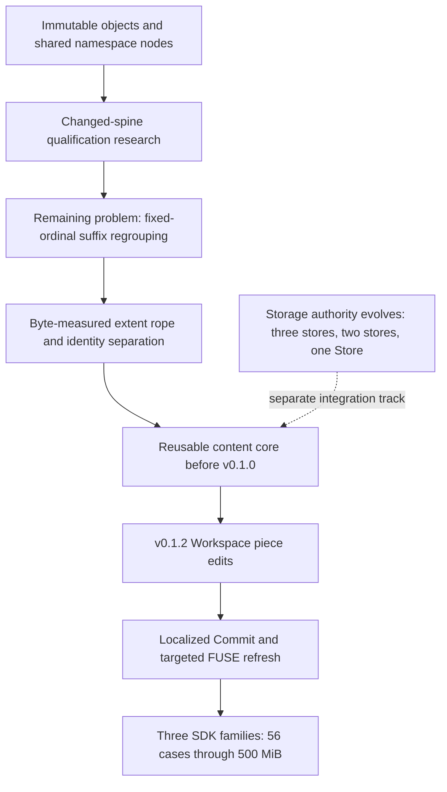
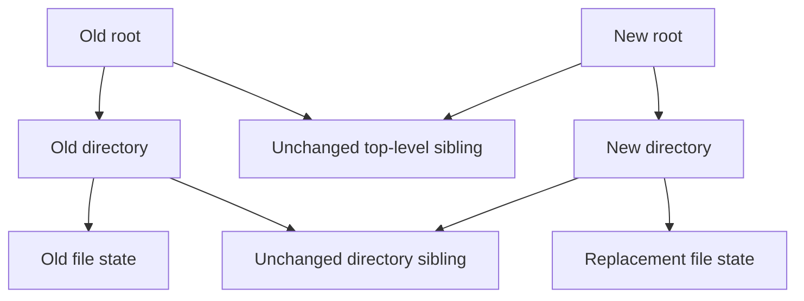
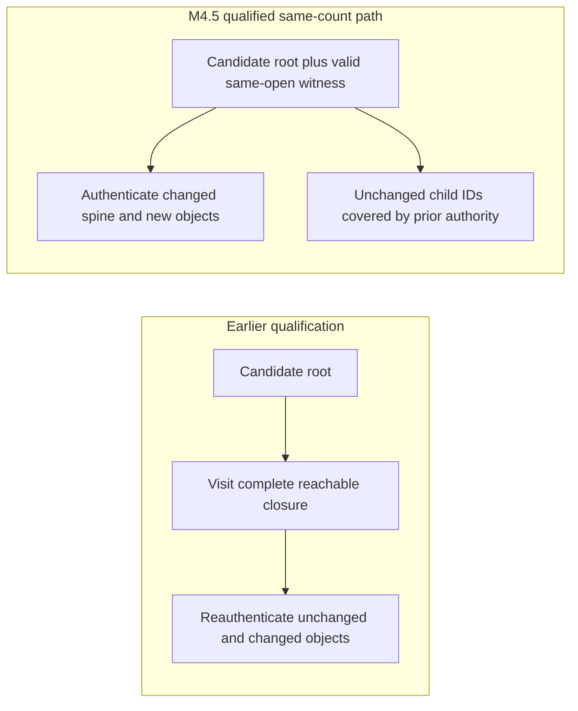
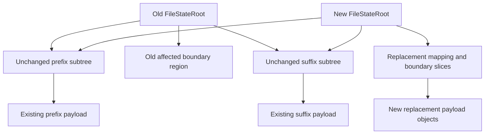
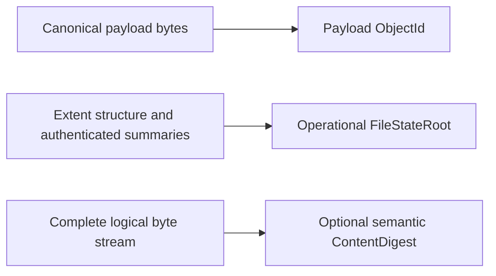
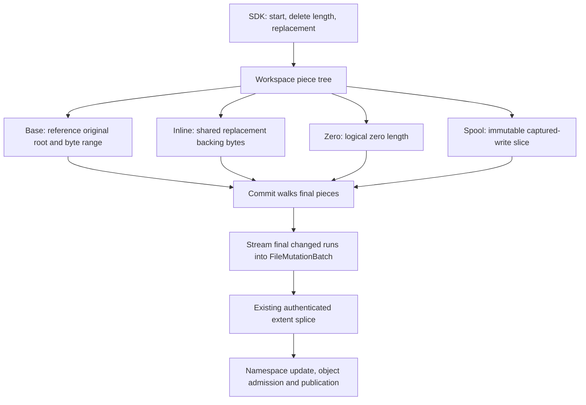
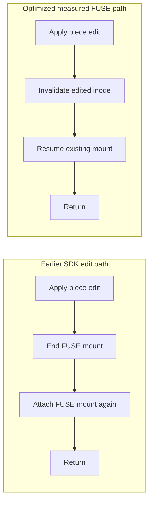
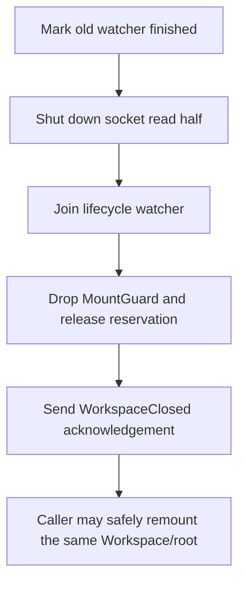

# LayerFS v0.1.2 architecture shifts: making file edits local

> **Status:** Architecture and evidence record, written after the v0.1.2 release.
> Historical commit-pinned designs are distinguished from the shipped product.
> This document does not change the immutable release tag or benchmark evidence.

## The central result

LayerFS did not acquire localized editing through one prepend optimization.
Several earlier changes removed different sources of unnecessary work:

1. Share immutable subtrees instead of reconstructing every descendant.
2. Qualify an authorized changed spine rather than rediscovering an entire closure.
3. Replace fixed-ordinal grouping with a byte-measured extent sequence.
4. Separate authenticated operational file structure from whole-byte-stream equality.
5. Consolidate the reusable content engine and clarify storage authority.
6. Record Workspace changes as reference pieces, then commit final changed runs.
7. Refresh the edited FUSE inode instead of rebuilding the mount.

The extent engine made locality possible **before v0.1.0**. v0.1.2 connected
that foundation to universal Workspace edits and a lower-overhead presentation
lifecycle, then measured three complete edit families.

The precise claim is **no mandatory scan or copy proportional to the untouched
base-file payload for a known-range SDK edit**. It is not a promise that every
operation, arbitrary replacement, long edit history, Commit, or projection has
constant cost.

Locality describes the known-range content operation against committed Base
references. Pending external-write capture, accumulated Workspace state and
projection coordination can add separate work to the complete SDK call.

## 1. Timeline and evidence authority

| Date | Commit / milestone | What changed | Evidence scope |
| --- | --- | --- | --- |
| Aug 17 | [cb80edb9](https://github.com/Ephemeral-AI-Lab/layerfs/commit/cb80edb9) | Immutable COW namespace nodes and authenticated deltas | Implemented predecessor; not today's complete bounded-page tree |
| Aug 19 | [26f4f101](https://github.com/Ephemeral-AI-Lab/layerfs/commit/26f4f101) | M4.5 changed-spine qualification for same-count edits | Accepted **benchmark-private** research, not production integration |
| Aug 24 | [70d7cc4c](https://github.com/Ephemeral-AI-Lab/layerfs/commit/70d7cc4c) | Byte-measured extent rope, immutable payload slices and operational-root identity | Portable content implementation inside the Apple/APFS PoC milestone |
| Aug 29 | [74a40a7a](https://github.com/Ephemeral-AI-Lab/layerfs/commit/74a40a7a) | Three-store LayerStack model | Implemented three-store rewrite; README lagged behind binding model |
| Aug 30 | [5148b9f4](https://github.com/Ephemeral-AI-Lab/layerfs/commit/5148b9f4) | Reusable `layerfs-content` and split rope modules | Consolidation of the existing content foundation |
| Aug 30 | [a047e5dc](https://github.com/Ephemeral-AI-Lab/layerfs/commit/a047e5dc) | Two-store V2: LayerStackStore + BranchStore | Historical implemented generation |
| Sep 1 | [8ec464f7](https://github.com/Ephemeral-AI-Lab/layerfs/commit/8ec464f7) | One-local-Store V4 architecture | Foundation shipped in v0.1.0 |
| v0.1.1 | [Namespace architecture record](../0.1.1/architecture_shift.md) | Final-state initialization and bounded direct admission | Related namespace work, not invention of the file rope |
| v0.1.2 | [9087b1fa](https://github.com/Ephemeral-AI-Lab/layerfs/commit/9087b1fa) and subsequent hardening | Universal Workspace piece edits and localized Commit lowering | Shipped implementation |
| v0.1.2 | [69885ab2](https://github.com/Ephemeral-AI-Lab/layerfs/commit/69885ab2), [49dbe9e9](https://github.com/Ephemeral-AI-Lab/layerfs/commit/49dbe9e9) | Targeted FUSE invalidation and callback draining | Measured SDK lifecycle optimization |
| Release finalization | [95d09244](https://github.com/Ephemeral-AI-Lab/layerfs/commit/95d09244) | Cleanup-before-close acknowledgement | Later correctness fix, separately verified |

Engineering names such as M4.5, V2 and V4 are **not public release versions**.
The lineage includes replacements, rejected experiments and stale historical
descriptions; it must not be interpreted as uninterrupted reuse of every line.



Each diagram is schematic: nodes represent responsibilities or retained
references, not exact object counts or one network request per arrow.

## 2. Shared immutable structure came first

The Aug 17 predecessor introduced `Arc`-backed immutable tree nodes, path
reconstruction, authenticated deltas and tests for unchanged sibling sharing.
Old roots remained valid after mutation.



**What sharing enables:** representing a changed ancestor path without
rebuilding unchanged descendant nodes or copying their payload. New versions
can refer to old immutable data.

**What did not disappear:** the initial implementation cloned a changed
directory's whole `BTreeMap` and recomputed its directory identity. If ancestor
directory `i` has `k_i` child entries, work includes the sum of the entries and
encoded directory bytes along that path. Do not call this early version a
pure `O(depth)` update or confuse it with the later paged directory trees.

Sources: [historical tree](https://github.com/Ephemeral-AI-Lab/layerfs/blob/cb80edb9/crates/layerfs-core/src/cow/tree.rs)
and [mutation implementation](https://github.com/Ephemeral-AI-Lab/layerfs/blob/cb80edb9/crates/layerfs-core/src/cow/mutate.rs).

## 3. Changed-spine work exposed the fixed-ordinal limitation

M4.5 distinguished two operations that had previously been conflated:

- construct the changed state;
- establish that the new state is valid before publication.

A same-open validation witness could cover unchanged immutable children while
new objects and changed paths were authenticated. This was not permission to
trust arbitrary object IDs or reuse a receipt from another process/open.



The historical bounded-local, one-leaf same-count model used mapping leaf
capacity `K`, branch fanout `F`, height `H`, changed input/CDC work `X_b + X_c`,
complete canonical bytes authenticated on the two changed spines `A_delta`,
and canonical bytes fully authenticated in new/different subtrees `V_delta`:

```text
same-count mutation:
    O(X_b + X_c + K + F H)

changed-spine qualification:
    O(K + F H + A_delta + V_delta + H^2)
```

The `H^2` term belongs to bounded ancestry-membership checks in that historical
algorithm. Adjacent multi-leaf mutation generalizes the structural terms to
`K L_c + F (L_c + H)`, where `L_c` is the changed leaf count.
Witness establishment, fresh full scrub and reconstruction still
required complete-closure or complete-byte work. These are historical model
terms, not a formula for the current SDK.

The accepted private experiment recorded qualification decreasing from
430.447333 ms to 0.280583 ms, while mapping/CDC/COW remained about 6.5–6.6 ms.
Its durable-edit median decreased from 440.023209 ms to 9.134334 ms. This was a
historical 100 MiB qualification experiment, **not a v0.1.2 release speedup**.
See the [terminal result](https://github.com/Ephemeral-AI-Lab/layerfs/blob/26f4f101/wp04-opt-milestone-4-5-v3-terminal-benchmark.md)
and [complexity analysis](https://github.com/Ephemeral-AI-Lab/layerfs/blob/26f4f101/PHASE_4_ALGORITHM_COMPLEXITY_ANALYSIS.md).

### Why changing count was still different

Fixed-ordinal grouping couples a mapping node to the global position of its
entries. Inserting one occurrence near the beginning changes later groups:

```text
Before: [ A B C D ] [ E F G H ] [ I J K L ]
After:  [ A X B C ] [ D E F G ] [ H I J K ] [ L ]
                      ^             ^
                suffix groups have changed
```

The payload objects might still be reusable, but early/middle count changes
could require `Theta(suffix references and rewritten mapping bytes)`. The
same-count proof therefore did not establish universal insertion/deletion
locality. Specialized EOF cases do not erase this limitation.

Here, historical **same count** concerns mapping occurrences. It is not the
same definition as today's `edit_length_preserving` family, which fixes file
byte length. The [M4.5 scope](https://github.com/Ephemeral-AI-Lab/layerfs/blob/26f4f101/PHASE_4_WP4M_M4_5_OPTIMIZATION_SPEC.md)
explicitly records the benchmark-private status and count-changing limit.

## 4. The pivotal shift: byte-measured extents and operational identity

See the [extent-tree visual guide](extent_tree.md) for a worked insertion
example, before/after diagrams and a compact complexity comparison.

The Aug 24 milestone implemented immutable payload slices and a persistent
byte-measured extent rope. Its PoC name includes APFS, but the content engine
does not implement locality by invoking an APFS clone operation.

```text
Extent slice:
    payload ObjectId + source offset + logical length

Child summary:
    cumulative logical byte end + cumulative extent end + child ObjectId
```

Current logical position is derived from subtree byte measures. A suffix can
move logically without changing its underlying payload or rewriting a global
offset in every suffix extent.



Boundary nodes and ancestor paths can be rebuilt/rebalanced; the diagram does
not promise that every old metadata node is reused. Extent slices can retain
the same payload ObjectId while changing the slice's source offset/length.

The implemented sequence was already:

```text
scan replacement bytes into new payload/mapping
split old tree at edit start
split remainder at deletion length
join retained prefix + replacement + retained suffix
persist reachable changed structure
create the new FileStateRoot
```

Historical model tests cover overwrite, insertion, deletion and shrink against
a byte-vector oracle; representative splices assert zero unchanged-payload
reads, and randomized tests retain old roots. These are implementation/test
facts, not a proof of every possible input's elapsed time.

Sources: [decisions D-01/D-02/D-03/D-04](https://github.com/Ephemeral-AI-Lab/layerfs/blob/70d7cc4c/poc/00-scope-and-decisions.md),
[extent types](https://github.com/Ephemeral-AI-Lab/layerfs/blob/70d7cc4c/crates/layerfs-core/src/content/extent.rs),
[rope implementation](https://github.com/Ephemeral-AI-Lab/layerfs/blob/70d7cc4c/crates/layerfs-core/src/content/rope.rs),
[model tests](https://github.com/Ephemeral-AI-Lab/layerfs/blob/70d7cc4c/crates/layerfs-core/tests/extent_model.rs).

### Identity separation was part of the algorithm, not a footnote



Canonical encoding of every node does **not** imply a unique operational tree
root for all edit histories yielding identical logical bytes. Two valid
history-shaped structures may have different roots and equal content digests.

This choice avoids requiring whole-file hashing or reconstruction merely to
make every local edit converge on one history-independent root. Authentication
is retained: every referenced object must still match its identity. Semantic
whole-file equality is a separate operation and can require `Theta(N)` reads.

The earlier G6 investigation had explicitly left hard-local edits versus
one-content/one-root requirements unresolved; it was research, not a shipped
solution. The later PoC decisions and implementation are the relevant evidence.
The ordinary contiguous native-file projection could still require a
`Theta(N)` rewrite: **content locality and projection locality are different**.

## 5. Reusable core and storage authority evolved separately

Commit `5148b9f4` moved the extent representation into `layerfs-content` as a
100%-identical rename and organized the rope into build/read/edit/diff/state/
validation modules. This is reuse and ownership consolidation, not a new
asymptotic breakthrough.

Storage roles changed around that content model:


Use the commit-pinned authoritative models, not a mixture of historical names:

- [`74a40a7a:docs/model.md`](https://github.com/Ephemeral-AI-Lab/layerfs/blob/74a40a7a/docs/model.md)
  explicitly declares three stores. That commit's README retains older
  WorkingStore/DurableStore wording; it is not the authority for this diagram.
  At that time, “LayerStack” named the architecture, not today's entity.
- [`a047e5dc:docs/v2/spec.md`](https://github.com/Ephemeral-AI-Lab/layerfs/blob/a047e5dc/docs/v2/spec.md)
  declares two databases, no Workspace database, and exact-missing parent
  resolution only for the specified Reference placement.
- [`8ec464f7` product specification](https://github.com/Ephemeral-AI-Lab/layerfs/blob/8ec464f7/docs/versioned/0.1.0/specification.md)
  declares one local Store. A missing object under a visible root is an
  integrity error, not permission to fetch silently from another Store.

The three-store model **already specified local extent splicing**, with work
`O(x + t)` for replacement bytes `x` and actual tree work `t`. Therefore
three stores → one Store must not be advertised as changing file mutation
from linear to logarithmic time. It simplifies authority, lookup routing and
publication boundaries; it does not invent the splice or remove database work.

Current v0.1.2 still uses one local Store. Future remote synchronization and
physical-pack alternatives are not shipped capabilities. #18 is far-future,
unscheduled work with additional design complexity.

## 6. v0.1.2 makes Workspace edits reference-based

The existing canonical extent tree describes committed files. The new
Workspace piece tree describes the current uncommitted file without eagerly
rebuilding that canonical tree after every call.



A fresh 500 MiB file can begin as one descriptor:

```text
Base(original_root, source_offset=0, length=500 MiB)
```

One middle insertion typically produces three conceptual pieces:

```text
Base(original prefix) | Inline(new bytes) | Base(original suffix)
```

Prepend/append typically need two. Descriptor splitting changes offsets and
lengths; it does not copy the Base payload. Inline slices share their backing
allocation through `Arc`, so a retained small slice can retain a larger backing
allocation. Input conversion and supplied bytes are not free.

The one-operation recipe is:

```text
(left, tail) = split(old_root, start)
(removed, right) = split(tail, delete_length)
new_root = merge(merge(left, replacement), right)
```

The SDK adds path resolution, coordination and a rollback checkpoint around
this splice. The singular public method currently reuses the multi-edit
implementation with one member; benchmark rows do not batch multiple edits.
An invalid edit or failed presentation refresh must not leave a partially
published mutation.

Commit walks **final** pieces, not the complete command history. Surviving
non-Base runs are streamed; overwritten/superseded replacement bytes do not
need to enter final canonical construction. Equal-length no-op detection may
compare affected bytes in 64 KiB batches; 64 KiB is a batch/buffer bound, not
a universal cap on total bytes compared for arbitrary requests.

Sources: [piece tree](../../../../crates/layerfs-workspace/src/file_edit.rs),
[edit and checkpoint handling](../../../../crates/layerfs-workspace/src/file_io.rs),
[Commit lowering](../../../../crates/layerfs-workspace/src/changes.rs),
[canonical splice](../../../../crates/layerfs-content/src/file/rope/edit.rs).

## 7. Why the same algorithm handles all three families

These families test distinct axes. File count does not change: they edit one
file. Unchanged byte length does not guarantee unchanged canonical extent count.

```text
LENGTH PRESERVING
  [old prefix] [old 4 KiB] [old suffix]
  [old prefix] [new 4 KiB] [old suffix]

LENGTH CHANGING: INSERT
  [old prefix]             [old suffix]
  [old prefix] [new 4 KiB] [old suffix]
                           same source references, shifted logical position

CANONICAL EXTENT COUNT: EQUAL-LENGTH REPLACEMENT
  [shared prefix] [b1 | b2 | b3     ] [shared suffix]
  [shared prefix] [x1 | x2 | x3 | x4] [shared suffix]
                   same byte length, different number of extents
```

The last diagram is illustrative, not the exact boundary partition of the
fixture. The actual 64 KiB overwrite controls qualify these total extent counts:

| File | Initial | Preserve | Increase | Decrease |
| --- | ---: | ---: | ---: | ---: |
| 1 MiB | 54 | 54 | 55 | 53 |
| 10 MiB | 544 | 544 | 545 | 543 |
| 100 MiB | 5,394 | 5,394 | 5,395 | 5,393 |
| 500 MiB | 26,995 | 26,995 | 26,996 | 26,994 |

These are canonical extent-reference counts, **not unique SQLite object
counts**. Replacement content, boundary slices and local rebalancing can change
extent count without changing the byte length. Subtree summaries are updated;
unchanged payload objects remain referenced. No per-operation append/prepend
policy is needed, though boundary position and supplied bytes affect cost.

The [canonical-count registry](../../../../benchmark/fs-bench-pro/families/edit_canonical_chunk_count.rs)
freezes the replacement identities and expected roots/counts. Together with
length-preserving and length-changing cases, it prevents an overwrite-only
benchmark from standing in for universal range-edit evidence.

## 8. Implementation-grounded time and space analysis

| Symbol | Meaning |
| --- | --- |
| `N` | Logical base-file bytes |
| `P`, `H_p` | Current Workspace pieces and actual maximum height encountered |
| `E`, `H_c`, `b` | Canonical extent count, canonical height, bounded node fanout |
| `a` | Supplied Inline replacement bytes for one edit |
| `D` | Detached piece nodes reclaimed when their last references disappear |
| `A` | Final changed bytes streamed at Commit, including generated zero bytes |
| `R` | Final changed runs emitted at Commit |
| `Q` | Affected bytes compared for same-length no-op detection |
| `V_p` | Piece-tree visits serving replacement readers |
| `W_c` | Actual canonical metadata reads, decoding, rebuilding, hashing and pruning |
| `U` | Surrounding path/checkpoint/Workspace state processed |
| `C_store` | Object admission, database work, namespace/root publication and rebase |

### One Workspace splice, versus the entire SDK call

For a singular replacement with at most one new Inline/Zero piece:

```text
splice time                    O(a + H_p + D)
additional structural nodes    O(H_p)
resident piece representation  O(P + retained Inline backing bytes)

full SDK edit                  splice work + U + lifecycle/projection work
```

The piece tree is a persistent treap with deterministic pseudo-random priorities.
Use **actual height `H_p`**, not an unproven worst-case `log P` guarantee.
Small height in the tested fragmentation sequence is useful evidence, not a
theorem covering every adversarial edit sequence. Reclaiming a fragmented
removed subtree and copying checkpoint/path metadata can add real work.

### Commit

```text
Commit time = O(P + A + Q + V_p + W_c) + C_store + lifecycle coordination
```

`P` appears because lowering materializes/walks final piece descriptors. `A`
is the changed stream, not the untouched `N` bytes. Canonical metadata work
depends on tree height, bounded fanout, boundary splits/joins and rebalancing.
The implementation calls concatenation during split unwinding and uses
deferred-node maps/sets. A textbook `O(R log E + A)` expression is therefore
an intuition/target, **not a proved worst-case bound for this implementation**.

The robust distinction is removal of an obligatory `Theta(N)` untouched-payload
copy/scan. It does not remove all dependence on extent count or Store size.
SQLite indexing, cache misses, new objects, publication and namespace changes
remain in `C_store`. A fresh full digest, materialization or full-file read
still requires `Theta(N)` byte work.

### Memory and practical ceilings

| Mechanism | Bound / qualification |
| --- | --- |
| Fresh Base file | One descriptor, independent of base payload byte count |
| Singular Inline input | At most 1 MiB per edit in this implementation |
| Edit history | At most 4,096 edits and 8,193 pieces per file |
| Workspace Inline accounting | 8 MiB logical accounting limit; not complete allocator RSS |
| Piece allocation accounting | 2 MiB logical charge; excludes some allocator/retained-state overhead |
| Spool | Actual captured-write allocation; SDK inline measurements have zero payload writes, not necessarily no empty spool descriptor |
| Commit buffers | Bounded readers/CDC/deferred components; not a blanket constant-memory proof |
| Durable replacement data | Grows with the final replacement, not made free by streaming |

Large logical zero extension is cheap to record as a piece, but Commit still
constructs its canonical representation. Bounded allocation is not a claim
that arbitrary edits, fragmentation, zero ranges, or verification are free.
Implementation limits larger than 500 MiB are not empirical performance claims.

## 9. FUSE lifecycle optimization removed a different cost

The matched SDK baseline already used semantic editing. Its presentation
refresh still performed full mount teardown and reattachment.



This removes fixed lifecycle work; it does not change the canonical splice's
asymptotic class. Callback draining prevents stale cache fills after an owner
edit. The efficient path is scoped to FUSE: materialized projection still
uses its own full-refresh behavior. Core portability does not imply identical
performance for every OS and driver.

The subsequent close race was separate correctness work:



No production retry/sleep was added. This sequence establishes the ordering of
an acknowledgement; it is not evidence that storage survives power loss.

Sources: [projection refresh](../../../../crates/layerfs-workspace/src/projection.rs),
[FUSE callbacks](../../../../crates/layerfs-fuse/src/proxy_client.rs),
[daemon close](../../../../crates/layerfs-daemon/src/main.rs).

## 10. What the measurements establish

The canonical content crate has **no diff between v0.1.1 and v0.1.2**:

```sh
git diff v0.1.1 v0.1.2 -- crates/layerfs-content
```

The matched v0.1.2 comparison therefore does not measure invention of the whole
pre-v0.1 architecture. It measures later Workspace/presentation behavior on
that inherited foundation. Five samples per cell; times below are Edit
median (min–max), ms:

| Operation | File | SDK baseline | Optimized SDK |
| --- | ---: | ---: | ---: |
| Head overwrite, 4 KiB | 1 MiB | 18.590 (15.186–23.099) | 2.643 (1.376–4.508) |
| Head overwrite, 4 KiB | 500 MiB | 16.151 (13.236–19.496) | 2.602 (1.537–2.947) |
| Prepend, 4 KiB | 1 MiB | 20.612 (15.781–23.596) | 1.674 (1.415–3.975) |
| Prepend, 4 KiB | 500 MiB | 20.187 (10.816–41.251) | 3.344 (1.970–4.394) |

The three complete SDK families contain 56 IDs, 280 candidate samples, 280
baseline samples and 112 separate source-arm proofs. Candidate per-case Edit
medians span 1.527–5.221 ms. The largest recorded native process lifetime RSS
peak is 10.922 MiB; native cgroup lifetime peak is 6.652 MiB. They are different
scopes and must not be added. Maximum recorded Commit chunking is 64 KiB;
candidate edit-caused FUSE payload writes and spool writes are zero.

At 500 MiB, prepend Edit + Commit has median 14.300 ms and range 9.947–16.455 ms,
N=5. Commit alone has median 11.122 ms: **Commit is not proven size-independent**.
Three named narrow Edit-parity exceptions and the accepted 20/20/30 ms ceilings
are explicit in the report. Category/window memory is sampled, not continuous
or exact-phase proof. The test environment is native macOS SDK/Store plus
Docker Desktop Linux FUSE, and empirical edit claims stop at 500 MiB.

Do not divide an old 32 MiB full-lifecycle temp-copy result by a new 500 MiB
Edit-only result. Do not reuse the private M4.5 speedup as a release metric.
Do not attribute authority simplification, identity separation and remount
removal to one undifferentiated multiplier.

## 11. Provenance and further reading

- [v0.1.2 release summary](../../../../release-notes/0.1.2/README.md)
- [Detailed SDK timing/memory tables](../../../../release-notes/0.1.2/sdk-edit-benchmark-results.md)
- [Supporting namespace/Store refresh](../../../../release-notes/0.1.2/supporting-benchmarks.md)
- [Original SDK evidence identities](../../../../release-notes/0.1.2/sdk-edit-evidence.json)
- [Release refresh identities](../../../../release-notes/0.1.2/release-evidence.json)
- [Universal edit design](universal-file-edit-engine.md)
- [Final SDK benchmark contract](sdk-only-edit-benchmark-rebuild.md)

Measured SDK baseline: `dc7aeff9a7e4f9e849a48022142f86801273f0bd`.
Measured SDK candidate: `3337728e9846a200d7a5cc08d076de18f1d5436c`.
Later daemon-fix/supporting refresh: `e978edd1`.
Published v0.1.2 commit: `d4da2c805745b82449aa6996238bbf86de93650f`.
The SDK selector retains some closure-era no-publication fields; the release
record, not those historical fields, states current publication status.

**The architectural achievement is cumulative:** shared authenticated state,
an edit-friendly file representation, explicit identity choices, a reusable
content core, reference-based Workspace mutations and efficient projection
coordination. v0.1.2 makes that lineage concrete in a complete operation matrix
rather than claiming one optimized special case.
