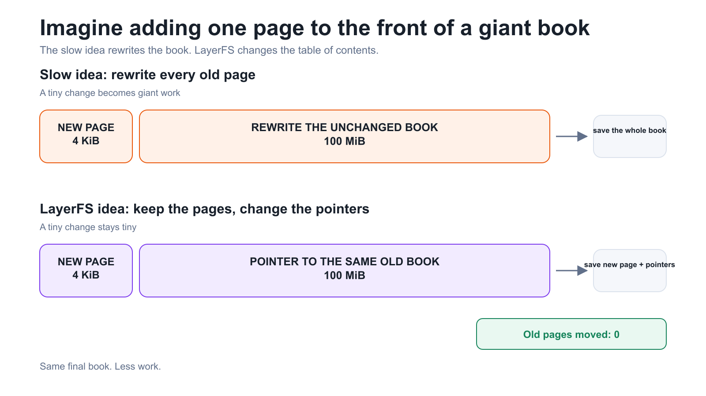
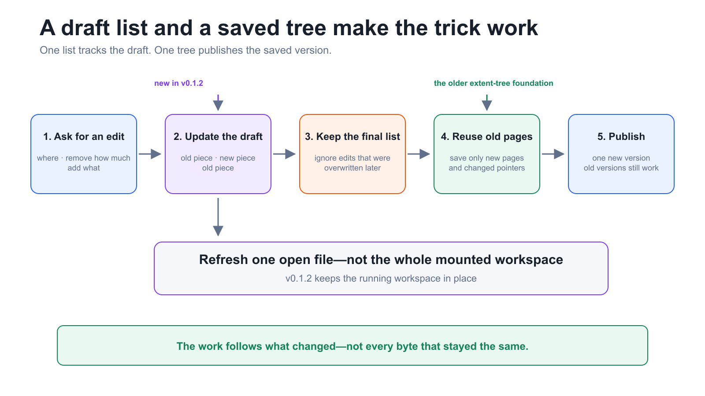
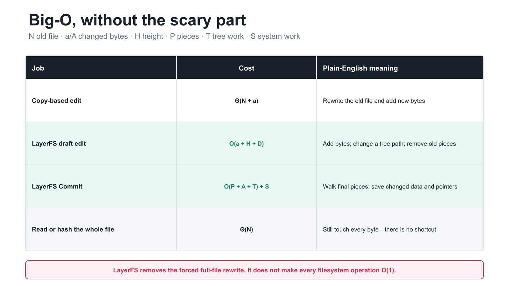
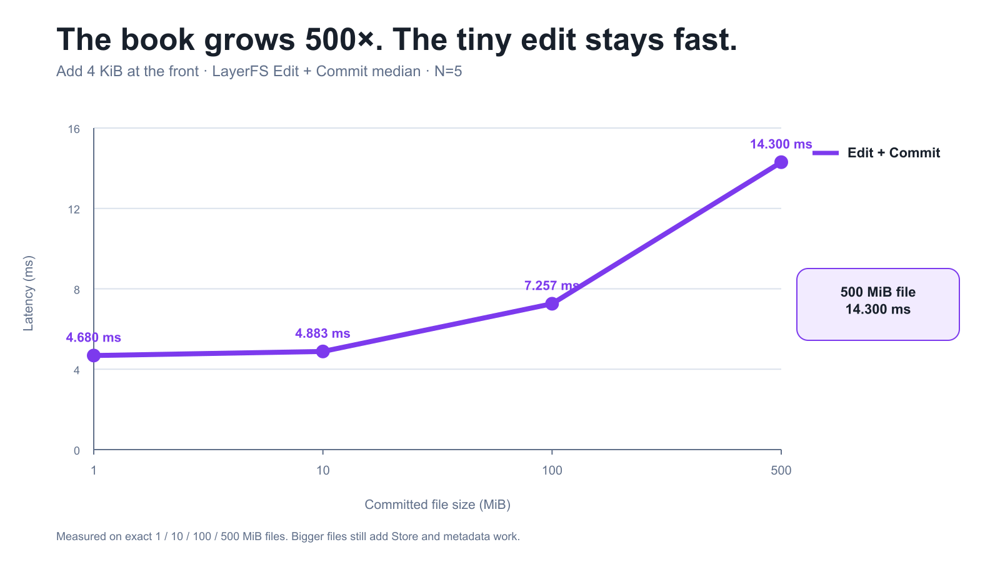
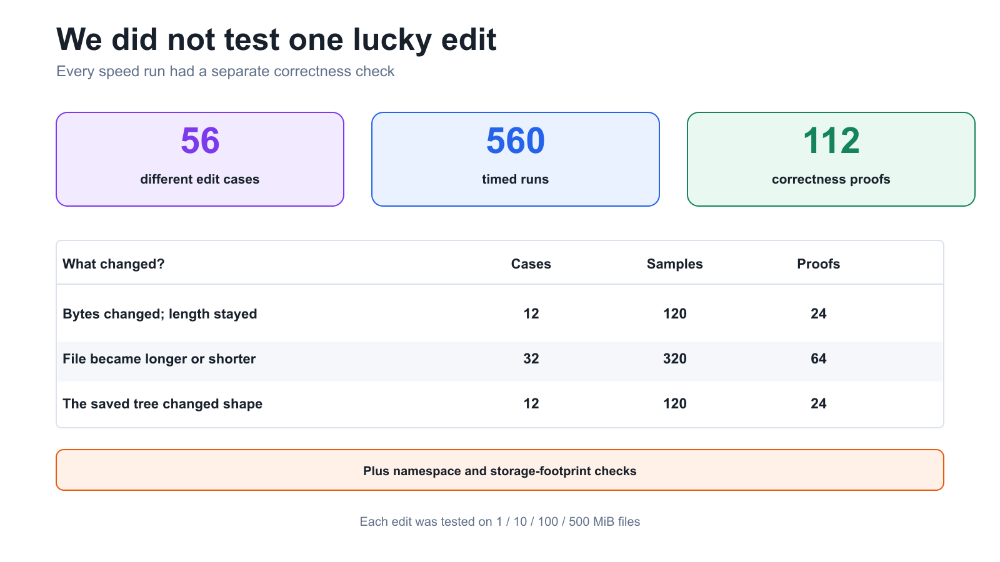
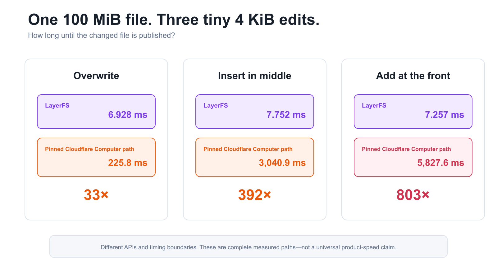

# The 4 KiB Edit That Did Not Rewrite a 100 MiB File

## A visual story of LayerFS v0.1.2

Imagine an AI agent named Ada.

Ada has a 100 MiB file. She wants to add 4 KiB at the beginning—roughly one
new page in front of a very large book.

The obvious solution is painful:

```text
write the new page → copy every old page after it → save the whole book
```

LayerFS v0.1.2 takes a different route:

```text
write the new page → point to all the old pages → save the new pointers
```

In our benchmark, Ada's 4 KiB edit plus Commit took **7.257 ms** on a
100 MiB file.

Here is the story of how it works.

## 1. The puzzle: why move bytes that did not change?

Think of a file as a book.

If we add one page to the front, a copy-based system builds another complete
book. The bigger the book, the more old pages it must move.

LayerFS keeps the old pages where they are. It creates the new page and updates
a small table of contents.



Both approaches produce the same final file. Only one avoids rewriting the
unchanged 100 MiB.

This matters for AI agents because they create many possible futures: try a
change, fork another idea, discard a failure, or keep a winner. Recopying the
same base file into every future wastes time, storage, and memory.

LayerFS starts with one rule:

> A new state should cost what changed—not everything that stayed the same.

## 2. The old superpower: the extent tree

LayerFS already had a way to describe a saved file using pointers called
**extents**.

An extent says:

```text
use these bytes → from this saved object → for this length
```

Suppose the saved object contains:

```text
ABCDEFGHIJKL
```

Ada inserts `xyz` after `ABCD`. The new file can be described as:

```text
ABCD     → old object
xyz      → new object
EFGHIJKL → old object
```

The old object never changes. The new file simply reads its pieces in a new
order.

The extent tree existed before v0.1.0. v0.1.2 did **not** invent it. The new
release connects that saved-file superpower to files that an agent is editing
right now.

## 3. The missing bridge: a piece list for the draft

While Ada is working, her file is still a draft. She may edit the same area
three times before pressing Commit.

v0.1.2 represents that draft as a small list of pieces:

| Piece | Beginner translation |
| --- | --- |
| `Base` | “Read this part from the old file.” |
| `Inline` | “Use these new bytes.” |
| `Zero` | “This range contains zeros.” |
| `Spool` | “Use bytes captured from an external write.” |

A 500 MiB file can begin as one tiny description:

```text
Base(the whole old file)
```

After inserting new bytes in the middle:

```text
Base(old prefix) | Inline(new bytes) | Base(old suffix)
```

Commit reads the **final list**, not every edit Ada tried along the way. If she
writes something and overwrites it again, only the surviving result matters.



Two structures do two simple jobs:

```text
piece tree  = the draft
extent tree = the saved version
```

## 4. One recipe solves many edits

The algorithm is the same cut-and-paste operation each time:

```text
old prefix + replacement + old suffix
```

| Ada wants to… | Remove | Add |
| --- | ---: | --- |
| Prepend | Nothing | New bytes before the file |
| Append | Nothing | New bytes after the file |
| Overwrite | The old range | Same-size new bytes |
| Insert | Nothing | New bytes in the middle |
| Delete | The old range | Nothing |
| Grow or shrink | One range | A larger or smaller range |
| Truncate | The tail | Nothing |
| Zero-extend | Nothing | A logical run of zeros |

There is no special “fast prepend algorithm.” The same recipe handles all of
them by changing the start point, removal length, and replacement.

That is why v0.1.2 tested three kinds of trouble:

- edits that keep the same file length;
- edits that make the file longer or shorter; and
- edits that change the shape of the saved extent tree.

## 5. Big-O, without the scary part

Let:

- `N` = size of the old file;
- `a` = number of new bytes;
- `H` = height of the small pointer tree;
- `D` = draft pieces removed by this edit;
- `P` = number of final pieces;
- `A` = changed bytes left when Commit begins;
- `T` = affected tree and comparison work; and
- `S` = Store, publication, and lifecycle work.

| Job | Cost | What it means |
| --- | ---: | --- |
| Copy-based edit | `Θ(N + a)` | Rewrite the old file and add the new bytes |
| LayerFS draft edit | `O(a + H + D)` | Add bytes, change a tree path, and remove old pieces |
| LayerFS Commit | `O(P + A + T) + S` | Walk final pieces; save changed data and pointers |
| Read or hash the whole file | `Θ(N)` | Still touch every byte—there is no shortcut |



The takeaway is not “everything is `O(1)`.”

It is simpler:

> A local edit no longer starts with “process the whole old file.”

The complete implementation has extra terms for removed pieces, no-op checks,
tree rebalancing, SQLite work, publication, and projection. They are documented
in the [technical architecture record](../../architecture_shift.md). We leave
them there so this story can teach the idea before teaching every symbol.

## 6. The last slow door: refreshing the live file

Ada's edited file is also open through FUSE inside a running Workspace.

The earlier path already knew how to edit references, but it refreshed the
view by taking down the mount and attaching it again:

```text
edit → stop the mount → start the mount again → continue
```

v0.1.2 refreshes only the edited file:

```text
edit → invalidate one inode → keep the mount → continue
```

The release also fixed a close/remount race. The old Workspace reservation is
now released before “closed” is returned. No sleep and no retry were added.

This optimization is separate from the extent tree. One saves byte work; the
other saves lifecycle work.

## 7. Did the idea survive real tests?

First, watch the same 4 KiB prepend as the old file grows:

| Old file | Edit + Commit median |
| ---: | ---: |
| 1 MiB | 4.680 ms |
| 10 MiB | 4.883 ms |
| 100 MiB | 7.257 ms |
| 500 MiB | 14.300 ms |



The time is not perfectly constant—Commit still has metadata and Store work.
But a 500× larger file does not create a 500× slower edit.

We also refused to trust one lucky example:



| What changed? | Cases | Timed runs | Correctness proofs |
| --- | ---: | ---: | ---: |
| Bytes changed; length stayed | 12 | 120 | 24 |
| File became longer or shorter | 32 | 320 | 64 |
| The saved tree changed shape | 12 | 120 | 24 |
| **Total** | **56** | **560** | **112** |

Performance ran first. Correctness verification ran separately. Every case had
1, 10, 100, and 500 MiB versions.

### A comparison with Cloudflare Computer

We ran the closest published-file path from pinned Cloudflare Computer commit
`de87919` through real FUSE. At 100 MiB:



| 4 KiB edit | LayerFS | Pinned Cloudflare path | Ratio |
| --- | ---: | ---: | ---: |
| Overwrite | 6.928 ms | 225.8 ms | 33× |
| Insert in middle | 7.752 ms | 3,040.9 ms | 392× |
| Add at the front | 7.257 ms | 5,827.6 ms | 803× |

Why the gap? The measured Cloudflare path opens a byte-stream file, builds
buffered state, moves bytes for positional edits, and publishes that state.
LayerFS changes pointers and publishes the new bytes plus changed tree nodes.

This is not a universal “LayerFS is 803× faster than Cloudflare” claim. The
products expose different edit APIs and timing boundaries. It is a comparison
of these complete, pinned, measured paths. The Cloudflare campaign completed
168 timed runs and 168 independent byte-correctness checks.

## What v0.1.2 means

LayerFS v0.1.2 is still a source-only Developer Preview. It uses one local
Store per Client and does not promise crash or power-loss durability. Keep an
independent copy of important data.

But Ada's tiny edit now follows the rule we wanted:

```text
change the pointers
keep the old bytes
publish one new version
```

The extent tree made that possible. v0.1.2 makes it available to every regular
file range edit in a live Workspace.

## Keep exploring

- [LayerFS v0.1.2 release](https://github.com/Ephemeral-AI-Lab/layerfs/releases/tag/v0.1.2)
- [Full benchmark results](../../../../../../release-notes/0.1.2/sdk-edit-benchmark-results.md)
- [Visual extent-tree guide](../../extent_tree.md)
- [Exact Big-O and architecture record](../../architecture_shift.md)
- [Cloudflare comparison and caveats](../../cloudflare_benchmark_report.md)
- [LayerFS repository](https://github.com/Ephemeral-AI-Lab/layerfs)
