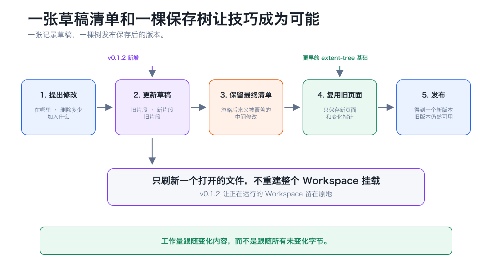
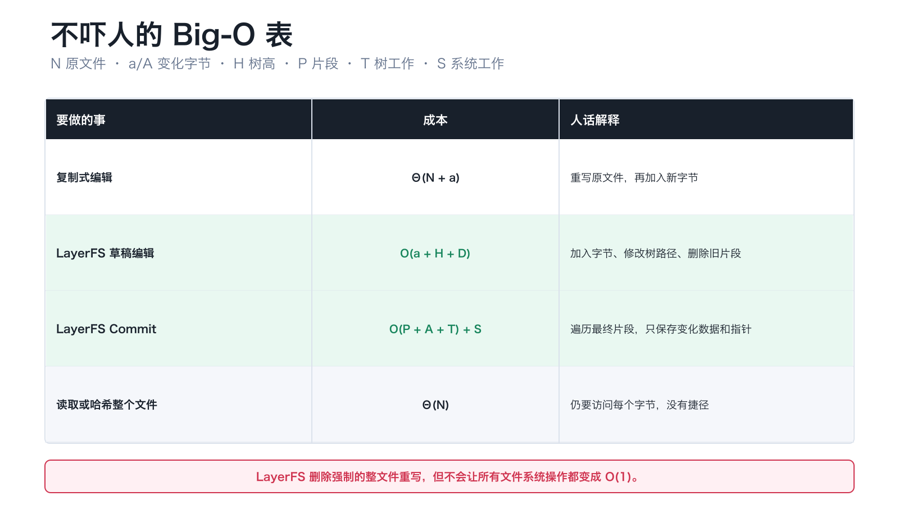
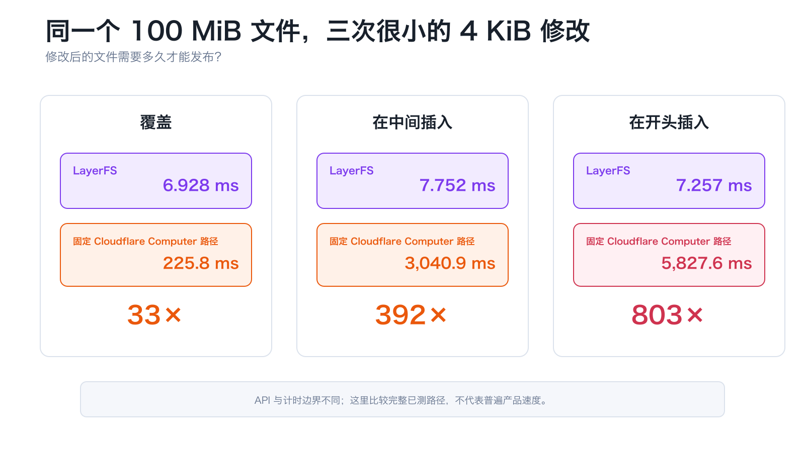

# 一次没有重写 100 MiB 文件的 4 KiB 编辑

## LayerFS v0.1.2 图解故事

想象有一个叫小艾的 AI 智能体。

小艾有一个 100 MiB 文件。她只想在开头加入 4 KiB——就像在一本巨厚的书前面
加一张新页面。

最直接的办法很痛苦：

```text
写新页面 → 复制后面的每一张旧页 → 保存整本书
```

LayerFS v0.1.2 走了另一条路：

```text
写新页面 → 指向所有旧页 → 保存新指针
```

在我们的基准中，这次 4 KiB 编辑加 Commit 在 100 MiB 文件上只用了
**7.257 ms**。

下面用一个故事解释它为什么能做到。

## 1. 谜题：为什么要搬动没有变化的字节？

把一个文件想象成一本书。

如果在最前面加入一页，复制式系统会重新制作一整本书。书越大，需要搬动的旧页
就越多。

LayerFS 把旧页留在原处，只创建新页面，再修改一张很小的目录卡片。


两个办法得到相同的最终文件，但只有一个办法避免重写未变化的 100 MiB。

这对 AI 智能体尤其重要，因为它们会创造很多可能的未来：尝试一种修改、分叉另一
个想法、丢弃失败路线，或者保留成功结果。如果每条路线都重新复制相同基础文件，
时间、存储和内存会很快被浪费。

LayerFS 从一条规则开始：

> 新状态的成本应该由变化量决定，而不是由所有未变化内容决定。

## 2. 已有的超能力：extent tree

LayerFS 早已可以使用一种叫 **extent** 的指针描述已保存文件。

一个 extent 的意思是：

```text
使用这些字节 → 来自这个已保存对象 → 长度是这么多
```

假设已保存对象包含：

```text
ABCDEFGHIJKL
```

小艾在 `ABCD` 后面插入 `xyz`。新文件可以写成：

```text
ABCD     → 原对象
xyz      → 新对象
EFGHIJKL → 原对象
```

原对象完全没有改变。新文件只是换了读取片段的顺序。

extent tree 早于 v0.1.0。v0.1.2 **没有发明它**。新版本做的是把这种已保存文件
的能力连接到智能体正在实时编辑的文件。

## 3. 缺失的桥：一张记录草稿的 piece 清单

小艾工作时，文件还是草稿。她可能在 Commit 之前对同一区域修改三次。

v0.1.2 用一张很小的 piece 清单表示草稿：

| Piece | 新手翻译 |
| --- | --- |
| `Base` | “这一段从旧文件读取。” |
| `Inline` | “这一段使用新字节。” |
| `Zero` | “这一段全部是零。” |
| `Spool` | “这一段来自外部写入捕获的数据。” |

一个 500 MiB 文件最开始只需要一个很小的描述：

```text
Base(整个旧文件)
```

在中间插入新字节之后：

```text
Base(旧前缀) | Inline(新字节) | Base(旧后缀)
```

Commit 读取的是**最终清单**，不是小艾尝试过的每一个中间步骤。如果她写入一段
内容，随后又把它覆盖，只有最终留下的结果需要保存。



两个结构只做两件简单的事：

```text
piece tree  = 草稿
extent tree = 保存后的版本
```

## 4. 一套方法解决很多编辑

算法每次都执行同一种剪切粘贴：

```text
旧前缀 + 替换内容 + 旧后缀
```

| 小艾想要…… | 删除 | 加入 |
| --- | ---: | --- |
| 在开头加入 | 无 | 文件前的新字节 |
| 在末尾追加 | 无 | 文件后的新字节 |
| 覆盖 | 原范围 | 相同大小的新字节 |
| 在中间插入 | 无 | 中间的新字节 |
| 删除 | 原范围 | 无 |
| 变长或变短 | 一段范围 | 更大或更小的新范围 |
| 截断 | 尾部 | 无 |
| 零扩展 | 无 | 一段逻辑零 |

不存在一个特殊的“快速 prepend 算法”。只要修改起点、删除长度和替换内容，同一
套方法就能完成所有操作。

因此，v0.1.2 测试了三种麻烦：

- 修改后文件长度不变；
- 修改后文件变长或变短；
- 修改后保存结构的形状发生变化。

## 5. 不吓人的 Big-O

令：

- `N` = 旧文件大小；
- `a` = 新字节数量；
- `H` = 小型指针树的高度；
- `D` = 本次编辑删除的草稿 pieces；
- `P` = 最终 piece 数量；
- `A` = Commit 开始时仍然存在的变化字节；
- `T` = 受影响的树与比较工作；
- `S` = Store、发布与生命周期工作。

| 要做的事 | 成本 | 人话解释 |
| --- | ---: | --- |
| 复制式编辑 | `Θ(N + a)` | 重写旧文件，再加入新字节 |
| LayerFS 草稿编辑 | `O(a + H + D)` | 加入字节、改变一条树路径并删除旧片段 |
| LayerFS Commit | `O(P + A + T) + S` | 遍历最终片段，只保存变化数据与指针 |
| 读取或哈希整个文件 | `Θ(N)` | 仍要访问每个字节，没有捷径 |



结论不是“所有操作都变成 `O(1)`”。

结论更简单：

> 一次局部编辑不再从“处理整个旧文件”开始。

完整实现还包含回收片段、no-op 检查、树再平衡、SQLite、发布和投影等成本。精确
公式保留在[技术架构记录](../../architecture_shift.md)中。这篇故事先解释想法，再把
全部符号留给想继续深入的读者。

## 6. 最后一扇慢门：刷新正在运行的文件

小艾编辑的文件还通过 FUSE 打开在一个运行中的 Workspace 里。

较早的路径已经会修改引用，但刷新视图时会关闭挂载，再重新挂载：

```text
编辑 → 停止挂载 → 重新挂载 → 继续
```

v0.1.2 只刷新被编辑的文件：

```text
编辑 → 失效一个 inode → 保留挂载 → 继续
```

这个版本还修复了 close/remount race。旧 Workspace reservation 会在返回“已关闭”
之前真正释放。生产代码没有增加 sleep，也没有增加 retry。

这个优化与 extent tree 是两件事：一个减少字节工作，一个减少生命周期工作。

## 7. 这个想法通过真实测试了吗？

先看同一个 4 KiB 头部插入如何面对越来越大的旧文件：

| 旧文件 | Edit + Commit 中位数 |
| ---: | ---: |
| 1 MiB | 4.680 ms |
| 10 MiB | 4.883 ms |
| 100 MiB | 7.257 ms |
| 500 MiB | 14.300 ms |


时间并非完全不变——Commit 仍然有元数据和 Store 工作。但文件变大 500 倍，没有
让小编辑变慢 500 倍。

我们也没有只相信一个幸运用例：


| 什么发生了变化？ | 用例 | 计时运行 | 正确性证明 |
| --- | ---: | ---: | ---: |
| 字节变了，长度没变 | 12 | 120 | 24 |
| 文件变长或变短 | 32 | 320 | 64 |
| 保存后的树改变形状 | 12 | 120 | 24 |
| **总计** | **56** | **560** | **112** |

性能采集先完成，正确性验证随后独立运行。每个用例都有 1、10、100 和 500 MiB
版本。

### 与 Cloudflare Computer 的对比

我们通过真实 FUSE 运行了固定 Cloudflare Computer commit `de87919` 中最接近的
文件发布路径。在 100 MiB 下：



| 4 KiB 编辑 | LayerFS | 固定 Cloudflare 路径 | 比值 |
| --- | ---: | ---: | ---: |
| 覆盖 | 6.928 ms | 225.8 ms | 33× |
| 在中间插入 | 7.752 ms | 3,040.9 ms | 392× |
| 在开头插入 | 7.257 ms | 5,827.6 ms | 803× |

为什么会拉开？已测 Cloudflare 路径打开字节流文件，构建缓冲状态，位置编辑需要
移动字节，最后再发布该状态。LayerFS 修改指针，只发布新字节和变化的树节点。

这不是“LayerFS 产品普遍比 Cloudflare 快 803×”的声明。两个产品使用不同编辑 API
和计时边界。这里比较的是固定源码下的完整已测路径。Cloudflare 活动完成了 168 次
计时运行和 168 次独立字节正确性检查。

## v0.1.2 意味着什么

LayerFS v0.1.2 仍然是仅源代码 Developer Preview。每个 Client 使用一个本地
Store，并且不承诺崩溃或断电持久性。重要数据仍需保留独立副本。

但小艾的小编辑现在遵守了我们想要的规则：

```text
改变指针
保留旧字节
发布一个新版本
```

extent tree 让它成为可能；v0.1.2 让实时 Workspace 中的每一次普通文件范围编辑
都能使用它。

## 继续探索

- [LayerFS v0.1.2 Release](https://github.com/Ephemeral-AI-Lab/layerfs/releases/tag/v0.1.2)
- [完整基准结果](../../../../../../release-notes/0.1.2/sdk-edit-benchmark-results.md)
- [extent-tree 图解](../../extent_tree.md)
- [精确 Big-O 与架构记录](../../architecture_shift.md)
- [Cloudflare 对比与边界](../../cloudflare_benchmark_report.md)
- [LayerFS 仓库](https://github.com/Ephemeral-AI-Lab/layerfs)
