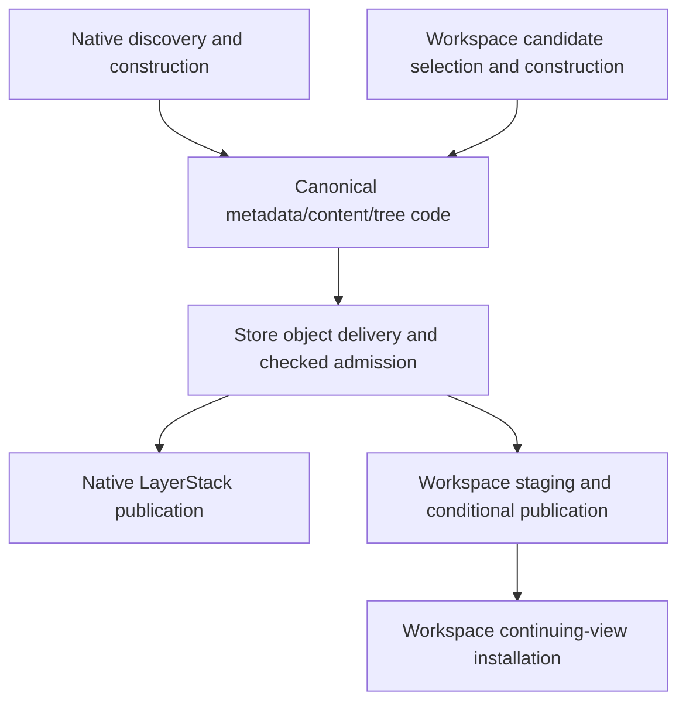

# Phase 2 shared code and refactoring layout

Status: implementation plan for #38 and children #41–#44. Product implementation
starts after [#45](https://github.com/Ephemeral-AI-Lab/layerfs/issues/45)'s completed
infrastructure handoff. This document does not claim any proposed transfer has
landed or that a family has passed. Source audit: `810bb3a58`; reinventory the
final handoff revision before editing.

Related analysis:

- [Actual mechanism adoption](phase-2.1-mechanism-adoption-audit.md)
- [Workspace admission time/space complexity](workspace-admission-complexity.md)
- [Shared-cause investigation](phase-2-implementation-order-investigation.md)
- [API/algorithm simplification and reduction counts](api-algorithm-simplification-audit.md)

## Reduction scope

The immediate plan removes **zero public SDK methods**: the 26 production
methods remain compatible while shared implementations and observation become
consistent. A future versioned Commit-signature migration could remove one
variant (26 -> 25, assuming no other changes). One unused FUSE request,
`PinRead`, is a compatibility-gated pruning candidate; preserve acknowledged
readonly Pin. This is not a promise that all protocol changes net to minus one.

The larger targets are algorithm consolidation: native scheduling 3 -> 1,
admission accumulation 3 -> 1 shared implementation, native file construction
2 -> 1, Workspace inode-record construction 2 -> 1, and eventually Workspace
planning 3 -> 1 after its supported domains transfer. These are **implementation
counts, not method counts or immediate deletion commitments**. Explicit
publication/lifetime adapters and useful compatibility wrappers can remain.
The actual internal-method reduction is determined by the reviewed code diff.

## Product layout: keep existing ownership

All files in this product tree already exist at the audited revision. They are
possible working areas, not a requirement to edit every file. No new crate,
universal engine, public bulk API or SDK endpoint is planned.

```text
crates/
  layerfs-content/src/                       # canonical algorithms
    filesystem/
      change.rs                             # exact metadata cache
      apply.rs                              # initial-directory construction
    file/rope/build.rs                      # content/CDC builders
    tree/
      batch.rs                              # sorted affected-page updates
      inode/table.rs                        # initial inode-table builder

  layerfs-layerstack-store/src/              # persistence and publication
    objects.rs                              # deferred objects, slabs, admission
    layerstack.rs                           # native discovery/task scheduling
    workspace.rs                            # candidate admission/publication
    staging.rs                              # complete-root stage lifecycle

  layerfs-workspace/src/                     # mutable Workspace behavior
    changes.rs                              # candidate selection/construction
    capture.rs                              # existing single-file capture
    file_io.rs                              # mutable file reads/writes
    lifecycle.rs                            # Commit and continuation

  layerfs-fuse/src/                          # live filesystem transport
    proxy_client.rs
    proxy_host.rs

  layerfs-sdk/src/client.rs                  # existing public methods
```

## What is shared and what is still separate

| Code | Owner | Actual/target reuse |
| --- | --- | --- |
| `PortableMetadataCache::get_or_build` | content | Already shared by native and relevant Workspace construction |
| `rope::build` and existing incremental mutation/extent machinery | content | Already reused; preserve canonical output and unchanged extents |
| `directory_apply_sorted_with_budget`, `inode_table_apply_sorted_with_budget` | content | Workspace uses these; native initial-tree adoption is still a target |
| `insert_checked_object_batch` | Store | Shared by direct native and ordinary Workspace admission; keep exact conflict checks |
| Owned canonical vectors, slab writer and carried batch accumulation | Store | Native direct delivery exists; Workspace carries batches after building a deferred candidate |
| Staging and conditional publication | Store | Workspace lifecycle; native LayerStack publication remains operation-specific |



This is the ownership model, not a claim of identical current delivery paths.
Native initial-tree calls still use older builders. Workspace still buffers or
spills a complete candidate before later admission. The native slab types are
Store-private, and `InitializationSegmentAdmission::new` rejects nonempty Stores.
A safe transfer may need a narrow internal adapter, not merely a call-site change.

## Concrete refactoring candidates

| Priority within the relevant track | Files/methods | Work and required evidence |
| --- | --- | --- |
| Small Workspace ownership transfer, if copying matters | `objects.rs::consume_prevalidated_pages`, `admit_checked_objects`; `workspace.rs::commit_workspace_candidate` | Adapt existing owned-page consumption into checked admission; show fewer memory-candidate copies while retaining reachability, authentication and carried limits. Spill still copies; no streaming claim. |
| Larger Workspace direct-delivery transfer, only if replay matters | Existing slab/writer/accumulator in `objects.rs`; candidate adapters in `changes.rs` | Reuse owned bounded handoff with nonempty-Store semantics, candidate read-your-writes and selected-root validation. Demonstrate reduced spill/replay and bounded simultaneous ownership. |
| Native task distribution | `layerstack.rs::direct_initialize_root_directories_inner` | Reuse existing task queue; diagnose CAS 512-file grouping and CDC heavy-directory task separately. Require CPU/work/wall evidence, not merely more workers. |
| Native sorted initial trees | `filesystem/apply.rs::build_initial_directory`, `tree/inode/table.rs::build_initial_inode_table_from_pairs`, native callers, existing `tree/batch.rs` helpers | Evaluate one transfer separately from scheduling; prove exact same-seed canonical parity and scratch bounds, compare structural work, preserve needed fallback. |
| Remaining Workspace structural grouping | `changes.rs` sorted adapters and `FrontierInodes` | Existing sorted operations are already adopted but bounded batches may revisit pages. Improve only measured repeated work without full-tree rebuilding for sparse changes. |
| Remaining continuation | `lifecycle.rs::rebase_committed` | Separate from admission; measure loaded-node/path/alias work and preserve exact published snapshot semantics. |

The smallest owned-consumption change can be confined to `objects.rs` and
`workspace.rs`, plus focused checks. Do not create `construction.rs`, a worker
pool or another facade just because it appeared in an older proposed tree.
Extract another boundary only when a real caller requires it and the selected
mechanism justifies it. No SDK method change is needed for that first refactor.

## Complexity is part of the change description

Use the [detailed model](workspace-admission-complexity.md). For selected objects
N, canonical bytes B, existing-conflict bytes D and prior Store size M, indexed
admission work is modeled as candidate visitation plus
`O(B + D + N log(M + N + 1))`, with transaction and physical-I/O costs explicit.
Additional admission memory is bounded by batch bytes, object records and visitor
buffers. This does not bound the whole candidate/Workspace/SQLite process.

Moving owned buffers removes a byte-copy pass, not the asymptotic indexed work.
Direct delivery may remove temporary payload write/readback. Bigger batches
reduce transaction overhead without removing per-object INSERTs. Report which
effect the patch actually produces; do not claim a complexity-class improvement
from one favorable timing or from the 127-to-8191 object-cap increase alone.

## Benchmark layout: separate shared infrastructure

The following is #45's target, subject to its actual completed handoff. Keep its
implementation in that task; optimization tasks consume it rather than recreate it.

```text
benchmark/fs-bench-pro/
  shared/
    runner.py
    runtime.sh
    preparation.py
  verify-selected.py                        # one verifier implementation
  src/                                      # Linux coordinator/shared oracles
  families/
    dedup_cross_file/                        # #42
    dedup_cdc_locality/                      # #43
    payload_create_read/                     # #41
    dedup_workspace_reuse/                   # #44
      mod.rs                                # each family has these four files
      setup.sh
      perf.sh
      verify.sh
```

Family scripts bind IDs and forward arguments/status. Setup, Docker lifecycle,
copying, timing, verification/deadline and cleanup remain shared. Product
algorithms stay in product crates, never family-specific benchmark shortcuts.

All preparation/product work runs in Docker/Linux, host orchestration only.
Imports use fresh output Stores; post-init cases may use independent writable
clones. Default one-sample `--perf-fast` retains the complete selected workload;
`--perf-samples N` repeats the same selected input; verification is separate and
bounded end-to-end below 59 seconds. Retain compact `perf.jsonl` or
`verification.json` plus bounded failure logs, not sample data or artifact trees.

## Ownership and handoff

- Native owner: #42/#43, primarily `layerstack.rs` and relevant initial-tree callers.
- Workspace owner: #41/#44, primarily Workspace candidates/capture/continuation.
- One integration owner serializes edits to shared `objects.rs`/content primitives
  and all resource-sensitive builds, preparation, verification and measurements.
- Reuse #45's source-bound smoke/slow-case records; collect matched Docker-only
  baseline/candidate evidence instead of comparing incompatible old host timings.
- Final criteria, original cases/seeds, 114 unique #38 candidate samples and
  required invalidated regression controls remain unchanged. Final qualification
  counts are not per-iteration requirements. #39 recovery remains separate.
