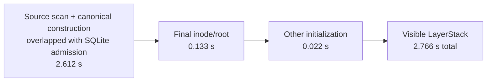
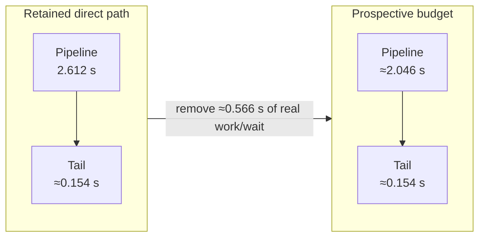
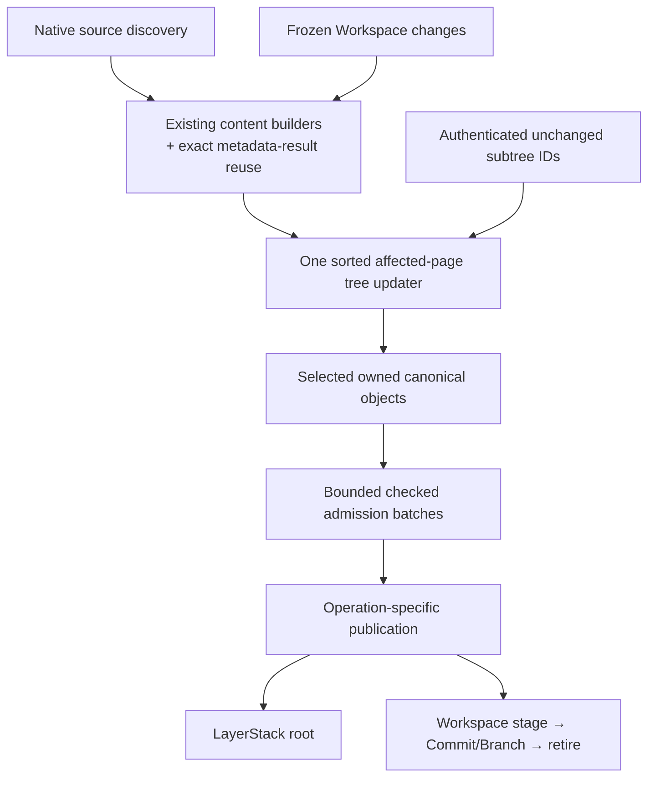
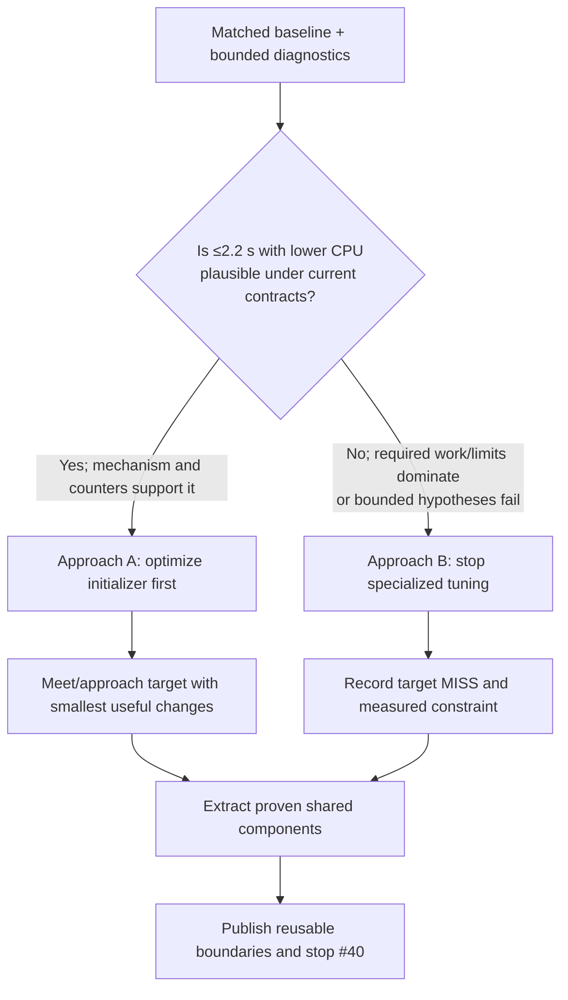

# Phase 2.1: shared construction, Workspace staging, and efficient initialization

Status: proposed implementation specification, 2026-09-05. Tracked by [issue #40](https://github.com/Ephemeral-AI-Lab/layerfs/issues/40), the prerequisite for #38 (scaling) and #39 (runtime-suppressed cases), under roadmap #21. Creating this specification does not claim that its targets have been achieved or launch measurements.

## Outcome and scope

Demonstrate the existing namespace-v2 100,000-file / 500,000,000-byte initialization at **no more than 2.2 seconds median**, using at most eight CPU cores, with **lower total CPU work** and bounded memory. Extract the useful construction/admission components from namespace initialization and connect only the minimal Workspace staging lifecycle needed to prove the boundary. Add exactly one three-column staging table and short conditional Branch publication.

The shared components must reduce work, not merely rename functions or increase parallelism. They must support the namespace initializer across ordinary input layouts and expose narrow reuse boundaries for later work without benchmark-specific dispatch. Phase 2.1 does not optimize or qualify the #38/#39 families.

This prerequisite owns namespace optimization/refactoring plus the staging foundation. It does not implement, execute, qualify or close #38/#39. After #40 reaches a terminal outcome, review its measured results with the user and separately plan #38 and #39. Neither child is closed automatically when this prerequisite closes.

## Source and evidence boundary

- Read the [v0.1.1 architecture record](../0.1.1/architecture_shift.md) and [namespace optimization specification](../0.1.1/namespace-optimization-spec.md).
- Preserve the [final Phase 1 observations](phase-1-final-results.md), [suppression policy](phase-1-runtime-suppressions.md), and [verification withdrawal](phase-1-verification-withdrawal.md). The withdrawn verification campaign must not be restarted by this specification.
- Reference experiment: task `01a06b53-f424-7080-98a6-c294549114e0`, checkout `/Users/yifanxu/Ephemeral-AI-Lab/layerfs-workspace-commit-engine`, particularly `investigations/workspace-commit/{report,source-ledger,streaming-admission-review}.md`.
- Revised experimental semantics: `/Users/yifanxu/Ephemeral-AI-Lab/layerfs-bulk-create-feasibility/investigations/bulk-create/no-rollback-streaming-amendment.md`.
- Pin the actual implementation base and evidence-producing revisions before editing. The inspected experiment had committed HEAD `69bca3950`, base `a40b17e0`, and an uncommitted streaming successor; the final Phase 1 report was published at `4c9b14a6b`. Reinspect current state, preserve newer functional repairs, and do not copy older complete files over the current implementation.
- Retained namespace initialization **2.766279583 s** is a selected median; **12.968067459 CPU-s** is a resource maximum, not its paired CPU median. The historical initializer used eight host producers and uncontrolled source cache. Its favorable directory layout and decimal-MB fixture differ from the 500-MiB Workspace fixture.
- The existing direct initializer already eliminates its approximately 647-MB canonical payload write and reread. Do not claim that saving a second time. The streaming Workspace successor targets a different approximately 566-MB write/reread boundary and has no qualified streaming performance result in the inspected evidence. Determine remaining test failures from exact source-bound receipts rather than stale summaries.

## Acceptance targets

All numerical goals below are prospective Phase 2.1 targets, not measured promises.

| Measure | Acceptance |
|---|---|
| Namespace `namespace-100000` initialization | Three prescribed fresh-process samples; median <=2.2 s, including final tree/root/LayerStack publication |
| Namespace initialization CPU | Median total product CPU <=11 CPU-s **and** <=90% of the matched baseline median; candidate maximum <=matched baseline maximum |
| CPU accounting | User+system CPU across participating product processes; do not double-count overlapping process/child/thread counters |
| CPU capacity | Aggregate allocation <=8 CPU cores across all participating owner processes, including host-side construction/admission; baseline and candidate use the same fixed allocation and placement |
| Workers | One bounded policy across direct/fallback/staging paths; <=8 content producers across the measured owner workload, not eight per concurrent Workspace; use fewer when effective |
| Namespace explicit buffers | <=10 MiB aggregate named construction/admission ownership; report whole-process RSS separately |
| Namespace high-water limits | Initialization incremental native HWM <=128 MiB; complete lifecycle <=256 MiB; preserve the existing 32-MiB SQLite cache target |
| Other runtime/resource limits | Preserve existing applicable Workspace/candidate/index/spool budgets; no swap or OOM; account simultaneous ownership across workers and stages |
| Workload sizes | Each file <=500 MiB and aggregate logical files <1 GiB at every workload state; do not reinterpret namespace-v2's exact decimal bytes |
| Small-case regressions | Disclose every observed latency/CPU regression in affected smaller controls; resolve reproducible regressions or mark qualification inconclusive. No deliberate slowing, automatic tolerance, or extra significance-testing campaign |
| Timing integrity | Workspace performance includes stage + publication + required installation/cleanup. Report these phases separately; never compare publication-only against old complete Commit |

Reuse a truly compatible baseline. If unavailable, collect one controlled baseline once under the selected profile. Do not use the experiment's imbalanced 13–19-second fallback initializer as the baseline for the optimized namespace-v2 path. An eight-core result does not establish a one-/two-core target. No full CPU-count sweep is required.

## Destination file and folder structure

Keep the existing crate boundaries. `layerfs-content` owns canonical algorithms, `layerfs-layerstack-store` owns persistence and publication, `layerfs-workspace` owns mutable Workspace state, and `fs-bench-pro` owns workloads and measurements. Do not add a new crate or a generic backend/plugin layer.

The expected destination is below. `new` means the file does not exist in the current checkout. `adapt experiment` means port the relevant implementation onto the pinned current base; never copy a complete older file over later functional repairs.

```text
layerfs/
├── crates/
│   ├── layerfs-content/
│   │   └── src/
│   │       ├── filesystem/
│   │       │   └── change.rs              # modify: exact metadata-result helper
│   │       ├── file/rope/
│   │       │   └── build.rs               # reuse: CDC/full-content builders
│   │       └── tree/
│   │           ├── batch.rs               # new; adapt experiment: sorted final updates
│   │           ├── directory/             # reuse existing codecs and roots
│   │           └── inode/                 # reuse existing codecs and roots
│   │
│   ├── layerfs-layerstack-store/
│   │   ├── src/
│   │   │   ├── objects.rs                # modify: neutral slabs and checked insertion
│   │   │   ├── construction.rs           # new; adapt bounded experiment pool
│   │   │   ├── staging.rs                # new: three-column stage lifecycle
│   │   │   ├── layerstack.rs             # modify: native discovery/scheduling adapter
│   │   │   ├── workspace.rs              # modify: publish and retire staged root
│   │   │   ├── records.rs                # modify: minimal internal stage record
│   │   │   ├── schema.rs                 # modify: v5 create/migrate/verify
│   │   │   ├── statements.rs             # modify: register v5/stage SQL
│   │   │   ├── telemetry.rs              # modify only for required work/timing fields
│   │   │   └── lib.rs                    # modify only for necessary internal exports
│   │   ├── sql/
│   │   │   ├── schema/
│   │   │   │   ├── v4.sql                # keep unchanged
│   │   │   │   ├── v5.sql                # new: fresh six-table Store
│   │   │   │   └── migrate_v4_to_v5.sql  # new: additive migration
│   │   │   └── workspace/
│   │   │       ├── insert_stage.sql       # new
│   │   │       ├── get_stage.sql          # new
│   │   │       ├── delete_stage.sql       # new
│   │   │       ├── insert_commit.sql      # reuse
│   │   │       └── advance_branch.sql     # reuse conditional update
│   │   └── tests/
│   │       ├── v4.rs                      # retain old-schema interpretation checks
│   │       └── v5.rs                      # new: one focused migration/staging check
│   │
│   └── layerfs-workspace/
│       └── src/
│           ├── changes.rs                 # modify: feed final deltas to shared builders
│           ├── commit_file.rs             # new; adapt frozen-file experiment adapter
│           ├── lifecycle.rs               # modify: stage → publish → continue/close
│           ├── registry.rs                # modify: Workspace-local ownership/lease use
│           └── limits.rs                  # modify only if aggregate accounting needs it
│
├── benchmark/fs-bench-pro/
│   ├── families/                          # keep scenario definitions unchanged
│   ├── src/main.rs                        # reuse namespace measurement; add counters only
│   ├── src/workspace_bench.rs             # keep family performance paths unchanged in #40
│   ├── src/workspace_verify.rs            # reuse existing bounded/sampled checks
│   ├── src/dedup_verify.rs                # reuse existing CAS/CDC transcript checks
│   ├── verify-selected.py                 # new: one-target, <60-second companion
│   ├── run-namespace.sh                   # reuse
│   └── run-*.sh                           # retain; no #38/#39 execution in #40
│
└── docs/roadmap/0.1/0.1.3/
    ├── phase-2.1-shared-construction-staging-spec.md
    ├── phase-2.1-handoff-prompt.md        # implementation loop and terminal rules
    └── phase-2.1-results.md                # create only when results exist
```

Do not create empty scaffolding. A listed new file appears only when its first real caller lands. Keep an experimental support module only when the selected implementation uses it. Adapt the experiment's `streaming.rs` behavior into `staging.rs`; do not retain two competing staging/streaming implementations.

Delete superseded duplicate construction, metadata-cache, payload-replay and admission code only after every supported caller has transferred. Keep the canonical fallback until its input domain is covered. Do not delete the test-only append helper for a nonexistent runtime speedup; remove it only if its reference/equivalence role has a replacement.

## Optimization mental model

The v0.1.1 gains came from deleting stages and repeated work: construct final state instead of replaying point mutations, avoid duplicate canonical metadata, move owned slabs, carry bounded transactions, and overlap construction with one admission owner. The current 2.766-second namespace path already has metadata reuse, bounded owned slabs and direct admission; it has no large canonical-object spool pass to remove again.

The retained selected-median sample decomposes approximately as follows:



The 2.2-second target needs about **0.566 seconds /20.5%** less complete wall time. If the final tail remains approximately 0.154 seconds, the overlapped pipeline must fall from about 2.612 to about 2.046 seconds—roughly 22%.



The sample records about 1.269 seconds of admission-consumer waiting, 0.886 seconds of SQLite row stepping and 0.409 seconds of bounded transaction commits inside the overlapping pipeline. These are diagnostic components, not additive phases. The first investigation asks why the consumer waits and whether grouped construction, fewer intermediate nodes/copies, or better bounded task distribution can feed it earlier while reducing CPU. Do not increase queues/workers merely to hide waiting.

The shared end state is:



This model improves CPU only when counters show less construction, hashing, copying, decoding, transaction or traversal work. Concurrency can reduce wall time without reducing CPU; report both. The staging table and shorter locks improve preservation/concurrency but are not credited as an isolated-operation speedup unless complete stage+publish+finalization measurements improve.

## Two required approaches after the feasibility check

Start with one matched baseline and at most two bounded, counter-driven namespace experiments. Estimate whether the required ≈0.566-second wall reduction and matched CPU reduction can come from removable work under the existing canonical/Store contract. Do not run a broad parameter sweep.

The executor must choose and record one of these paths:



### Approach A — optimization is plausible

1. Optimize the existing namespace path before abstracting it, changing one evidenced mechanism at a time.
2. Require the predicted work counter and total CPU to fall; lower wall from added cores alone is insufficient.
3. After the mechanism is stable, extract only the implementation that produced the gain into the shared pieces below.
4. Remeasure the initializer through its thin adapter, then exercise namespace input-shape controls and the minimal Workspace staging lifecycle.
5. Claim 2.2 seconds only after the three prescribed matched samples pass all latency/CPU/resource targets.

### Approach B — optimization is not plausible

1. Stop spending iterations on the specialized 2.2-second target after the bounded feasibility work; do not force a benchmark-specific shortcut or alter the fixture.
2. Publish the target as MISS with the measured lower bound/constraint and attempted hypotheses.
3. Refactor the already-proven v0.1.1 mechanisms into the same shared components while preserving the retained initializer performance and CPU profile.
4. Publish the narrow reusable boundaries and expected applicability for later #38/#39 planning; do not integrate those family callers in #40.
5. Do not claim 2.2 seconds or close any family performance gate from the refactor alone.

Both approaches must deliver the namespace refactor, the three-column staging workflow, namespace/input-shape evidence and a deferred applicability note for #38/#39. Approach B prevents the 2.2-second stretch target from blocking useful reusable work indefinitely. It is an honest completed feasibility outcome, not a performance PASS.

## Shared implementation: reuse six existing pieces

| Piece | Existing source / extraction | Required change and useful evidence |
|---|---|---|
| Checked insertion | Experimental `layerfs-layerstack-store/src/objects.rs::insert_checked_object_batch` | Both callers reuse exact INSERT/conflict checks. Caller retains transaction/publication policy. Outcomes remain provisional until transaction commit |
| Exact metadata results | `NativeImport::portable_metadata` and experimental Workspace metadata cache | One small operation/construction-scope helper beside `build_portable_metadata`; eight exact entries, existing normalization, no global cache. Cache entries may not outlive discarded output |
| Owned slabs and carried batches | Existing object slab/writer and admission code | Share neutral internal types. Reuse <=256-KiB/512-object slabs, bounded queue, <4-MiB/8,191-object admission batches. Do not flush per file/task/slab |
| Final tree updates | Experimental `layerfs-content/src/tree/batch.rs` directory/inode sorted APIs | One affected-page algorithm; initialization supplies empty root + all entries, Workspace supplies existing root + sorted final changes. Reuse untouched children |
| Content construction | Existing `rope::build`, `build_bytes`, incremental edit machinery and `FrozenFile::compile_selected` adapter | Share codecs/builders, not an artificial common mutable file representation. Preserve borrowed extents; do not rechunk an entire file for a small edit |
| Bounded worker ownership | Existing construction pool `try_submit`, `pump`, `finish` | Reuse workers within an operation, account stacks/buffers/blocked sends, release DB guards before waiting. Consolidate scheduling only where callers actually share behavior |

Keep native source discovery, mutable Workspace state, reconciliation selection, and publication with their owners. No new crate, universal executor, backend plugin framework, public bulk API, persistent preloader, or operation-family selector is required.

Broaden import coverage without moving fixture files:

1. Root-level regular files and directories can feed the same bounded construction path. Preserve supported symlink and hard-link semantics.
2. A single large directory can supply multiple bounded file tasks; top-level directory count must not determine available content parallelism.
3. Replace shape-driven structural fallback with bounded/spilled construction where proven. Keep existing fallback until its supported domain transfers correctly.
4. The current >1,000-task preflight already exists; it is an eligibility limit, not an unresolved missing-guard bug.
5. Production direct import caps producers at eight; production parallel fallback currently caps at sixteen. Harmonize the live policy. The ten-producer append-only helper is test-only and deleting it is not a runtime optimization.

Before replacing the initializer's tree construction, compare exact same-seed roots and canonical bytes around existing split/balance boundaries. Logical equality alone is insufficient where exact canonical equivalence is required. Never rebuild a whole namespace for a sparse Commit. Retain compact identity/pair spill streams unless measured material; do not replace them with full in-memory manifests.

## Exactly one new table

```sql
CREATE TABLE workspace_stages (
    workspace_id BLOB PRIMARY KEY CHECK (length(workspace_id) = 16),
    branch_id BLOB NOT NULL CHECK (length(branch_id) = 17)
        REFERENCES branches(branch_id),
    root_id BLOB NOT NULL CHECK (length(root_id) = 32)
        REFERENCES objects(object_id)
) STRICT, WITHOUT ROWID;
```

Reuse `objects`, `commits`, `branches`, `layers`, and `layer_stacks`. No extra indexes, stage/generation IDs, statuses, timestamps, conflict fields, receipt table, lock table, or per-file staging rows.

One row means one complete unpublished candidate. No row is inserted for partial construction. At most one pending stage exists per Workspace: an identical stage can be reused; a different root must not overwrite a retained stage. Freeze/block incompatible mutation while that pending stage awaits publication or explicit discard.

Implement a strict versioned v4→v5 additive migration, accounting for `preflight_connect`, exact schema verification and the prepared statement manifest. Validate supported v4 before mutation; acquire normal Store ownership; transactionally create the table and update `user_version`; verify v5 and foreign keys. Preserve all existing identities/rows. Reject malformed or unsupported versions without speculative repair. Existing database journaling/synchronization settings remain unchanged; staging adds no power-loss durability claim.

## Stage, publish, then retire

1. Under Workspace-local coordination, freeze the submitted state and keep its existing expected head/base/root context in the live operation.
2. Reuse unchanged objects; construct new final content with the existing CDC/hash algorithms; admit selected objects through bounded checked CAS batches.
3. Flush admission and validate complete selected-root closure. Presence of one root object alone is insufficient, especially with retained failed-attempt CAS rows.
4. Persist `workspace_stages(workspace_id, branch_id, root_id)` in a committed transaction before attempting Branch publication.
5. In a short transaction, validate row/owner/destination, use the live expected Branch context, insert/reuse the deterministic Commit, conditionally advance the Branch, and delete the stage. All publication metadata changes commit together.
6. Record the exact published result, perform required runtime finalization, then return the result with any finalization error/status. An internal publication function may return to lifecycle code first, but the public completion boundary must not hide remaining required work. No content rechunking, full membership pass, or tree rebuilding belongs inside final publication.

No-op Commit also follows the user's always-stage rule: stage the existing root, check the expected Branch state, delete the stage, and return `UpToDate` without creating a new history entry. Measure the extra stage transaction cost; do not bypass it to manufacture a faster clean-Commit score.

Publication failure or unexpected head movement retains the complete stage; this attempt makes no Branch change and preserves whichever head is current. It must never undo another publisher. Report an error; do not implement automatic conflict resolution. A failed construction may leave admitted CAS objects without a stage. No object undo journal, GC implementation, or interrupted-build/crash-recovery project belongs here. Preserve exact output, preexisting historical roots, collisions, ordinary errors, and cleanup of owned private resources.

**Three-column limitations are intentional:** the stage saves a complete candidate, but does not save enough base context for self-contained restart-time reconciliation. There is no durable exactly-once publication receipt after stage deletion. A known live result can be returned again; missing stage after an uncertain outcome is not proof of success or permission to restage against a newer head. Report uncertainty/not-found rather than inventing a result.

### Closing versus continuing

Successful publication always retires the staging row. It does not physically remove shared CAS objects.

- Existing SDK Commit-and-continue remains usable: install the exact returned committed snapshot, then accept the next edit/Commit. History and endurance cases must retain their original session/Commit schedules.
- Explicit commit-and-close ends the runtime without constructing a continuing view. Reuse existing end/cleanup primitives; skip installation only when closure is known before that work. Do not silently reinterpret an existing Commit+End benchmark as a different API workload or omit End from timing.
- Closing a live Workspace still releases handles, projections, workers, leases and private spool resources. Stage-row deletion alone is not proof that shutdown is constant time.
- A cleanup failure after successful publication must report the published result plus cleanup failure; it must not report publication rollback or create the Commit twice.

## Short ownership boundaries

Use Workspace-local coordination for its own state and short conditional publication for its Branch. A separate Branch mutex map is optional: the existing conditional database transaction may supply the required publication serialization without another locking framework.

Remove the streaming session's lifetime Store permit; acquire only the ownership required for bounded admission and publication. Audit every operation previously protected by the broad gate, including candidate cleanup, before narrowing it. Never wait on producers, private file I/O, or full construction while holding the SQLite connection. Preserve fairness between batches. SQLite writes and the current shared connection remain serialized; this is not a lock-free database claim.

Remove lifetime Branch exclusivity only together with correct Workspace isolation. **Fix the postpublication race:** current continuing-Workspace installation repins the latest Branch and expects it still to be the caller's Commit. With concurrent Workspaces, pin/install the caller's returned immutable Commit/root instead. Do not let another successful publisher invalidate installation of an already-published result.

An aggregate owner budget bounds all participating workers/buffers. Per-Workspace locks do not authorize one eight-worker pool and full memory allowance for every simultaneous Workspace without accounting.

## Deferred issues #38 and #39

Phase 2.1 stops at the reusable namespace components and minimal staging boundary. It does not run the #38 scaling matrix, restore a #39 suppressed case, modify their workload definitions, or claim a family speedup. The prior baseline observations remain useful only for describing likely applicability.

After #40 reaches an Approach A or B terminal outcome, review its actual latency, CPU, memory, construction, admission and input-shape results with the user. Then separately decide which extracted pieces to apply to #38 and #39, what additional live-write/read/Git work they require, and what measurements should close them. Do not pre-commit those implementation plans in #40.

The #40 results document records a short deferred map only:

| Later issue | What #40 hands off | What remains undecided |
|---|---|---|
| #38 | Shared initializer APIs, canonical compatibility, root-file/single-directory behavior, namespace performance/CPU evidence | Which CAS/CDC/payload/Workspace callers change and their complete scaling acceptance |
| #39 | Shared construction/admission APIs and staging semantics | Which live create/delete/read/Git/history causes to change and how to recover all fifteen cases |

#38 and #39 remain blocked by #40 so they do not build competing infrastructure. Their detailed plans begin only after this handoff discussion.

## Implementation and measurement sequence

1. Pin current baseline, experimental dependencies, workload/profile identities and existing proofs. Inventory exact touched callers. Preserve unrelated edits and current repair commits.
2. Run the bounded feasibility check and record Approach A or B under the decision contract above.
3. Under Approach A, optimize the existing namespace path and qualify the mechanism before extraction. Under Approach B, record the target MISS and proceed without further specialized tuning.
4. Extract checked insertion and exact metadata reuse. Keep wrappers working; establish one small equality/error check, then measure the predicted work-counter change.
5. Integrate owned output and bounded final tree updates. Resolve actual source-qualified resource failures and compare canonical split boundaries. No full scans for sparse input.
6. Broaden native discovery using namespace-focused root-file-plus-directory and single-large-directory controls. Keep path, bytes, metadata and canonical identities fixed. Do not run CAS/CDC family cases in #40.
7. Implement schema/staging/publication and short ownership. Preserve continuing sessions and add the explicit closing path only where intended. Reuse the generic engine rather than creating a second implementation.
8. Remeasure namespace under the chosen path. Demonstrate the selected namespace input-shape controls and minimal staging lifecycle. Use counter attribution to choose the next change; do not conduct blind worker/cache/SQL parameter sweeps.
9. Publish the namespace/staging results and short deferred applicability note. Stop #40 and return to the user before planning or executing #38/#39.

Development uses one representative case/seed per hypothesis; proceed to larger work only when the mechanism evidence warrants it. Final affected curves retain their prescribed three seeds, and inherited capped definitions retain their own sample count. Reuse valid baseline and green candidate evidence until a change actually invalidates it. Do not repeat a slow suppressed workload solely to reconfirm its old failure. Phase 1 suppressions remain immutable; any authorized Phase 2 probe has a separate identity and bounded deadline.

Initial useful probes are namespace-10000 before namespace-100000, plus small native root-file/directory and single-large-directory controls. Select them incrementally by the changed path, not as a mandatory suite. Use one focused staging lifecycle fixture for the three-column boundary. Do not run #38/#39 cases.

## Selective automatic verification companion

Add one executable `benchmark/fs-bench-pro/verify-selected.py` beside the family performance scripts. “Parallel to the family script” means a separate companion entry point with the same selectors and evidence identities. It does **not** run concurrently with performance: simultaneous verification would consume CPU/I/O and contaminate timing.

The companion accepts exactly one explicit target:

```text
verify-selected.py
  --family FAMILY
  --case CASE
  --seed SEED
  --source-arm baseline|candidate
  --assets PATH
  --output PATH
  [--verification-certificate PATH | --independent-current]
```

It rejects `--all`, ranges, implicit family expansion, missing source/input identity, and more than one target. It resolves membership through the existing registry, dispatches to the existing namespace or Workspace verification implementation, and writes one immutable `verification.json` receipt. Do not copy family oracles into the wrapper or add one verification script per family.

The receipt records source/harness/product/environment/input identities; family/case/seed; exact checks and sampled paths/ranges; reused proof/certificate identities; omitted coverage; start/end monotonic wall; cleanup; status; and retained evidence path. Expected values must come from the existing independent fixture/oracle, never the candidate output. `PASS`, `FAIL`, `TIMEOUT`, and `INCOMPLETE` remain distinct.

Every invocation has a hard **59-second end-to-end wall limit**, strictly below one minute. The clock begins before setup/authentication and ends after checking, cleanup and receipt publication. Budget work so checking stops early enough to leave cleanup time. Crossing the limit cannot PASS; it records `TIMEOUT` or `INCOMPLETE`, preserves useful evidence, performs bounded cleanup, and returns nonzero. A retry requires a new source or a concrete corrected cause and never overwrites the prior receipt.

Use the existing bounded representative verification model:

- authenticate the selected benchmark route, fixture identity, operation counts, phase boundaries and result;
- check the complete staged/canonical root through existing structural receipts where available;
- verify affected content with deterministic sampled files/ranges and the independent expected generator;
- retain exact link/rename/absence/metadata checks only when the selected route changes them;
- run exact CAS/CDC transcript checks for a bounded selected cohort when dedup construction changes;
- confirm resource/cleanup receipts; and
- reuse source-compatible focused product proofs rather than replaying them.

During #40, the handoff loop uses this companion only for namespace targets and a selected Phase 2.1 staging-lifecycle check; the generic selector is retained for later discussion. It invokes the companion automatically only when verification is required by an invalidated route:

1. after the first successful selected benchmark on a changed construction/staging/publication path;
2. after a correction to an actual verification failure; and
3. once on the final stable candidate for each materially distinct affected route selected for qualification.

An unchanged `(source, harness, environment, input, case, seed, verification profile)` PASS is reused. Do not rerun it after repeated performance samples or unrelated changes. A performance miss with a correct new path may retain its one verification; a functional failure is fixed before broader performance work. Verification failure or timeout triggers diagnosis and a smaller/corrected check—it does not launch a larger suite.

## Small, bounded verification

Reuse existing infrastructure and proofs. Performance collection and verification are separate. No per-sample full-file or per-history-Commit FUSE verification, new verification framework, or automatic replay of the withdrawn Phase 1 suite.

The final stable-candidate qualification batch is bounded to **<=60 seconds per family and <=600 seconds total**, measured through its setup, checking, retries, cleanup and tool-generated reporting (excluding human/agent review idle time). Both limits apply; a retry or relabeling the same attempt does not reset the budget. Development uses separate small, targeted checks with recorded costs; this is not permission to run a full qualification batch at every revision. The supported claim is bounded representative benchmark qualification, not exhaustive filesystem proof. If the necessary check cannot finish, report incomplete evidence and the exact remaining risk; do not silently expand the campaign or call a timeout PASS.

Because the final family budget is at most 60 seconds and each invocation is independently capped at 59 seconds, select at most one final companion invocation per family. Combine checks inside the existing family verifier where necessary; do not multiply setup by spawning more wrappers.

Reuse or add the smallest relevant checks:

- Same-seed canonical tree parity near split boundaries; sparse locality at two namespace sizes.
- Exact/all-unique metadata, same-content duplicates, genuine collision rejection, and nonempty Store behavior.
- Mixed root-file/directory and hard-link semantics; bounded structure on formerly ineligible layouts.
- One staging lifecycle fixture: readable complete stage before publication; success atomically advances/deletes; an injected SQL failure after the stage DELETE rolls back that attempt’s Commit/head/DELETE together; unexpected head movement retains the stage and current head; different-root replacement refused; no-op unchanged history.
- Continuing Workspace installs its own returned Commit even after another Branch publication; second edit/Commit works. Explicit close skips continuing-view work and cleans owned runtime state.
- One bounded concurrency interleaving test: no lifetime Branch exclusion or Store permit across worker waits; measure small-operation wait separately from its execution, without inventing a negligible-lock-time threshold.
- One v4→v5 migration fixture with preserved old roots/history and unchanged data on unsupported/malformed input rejection.

Large performance outputs can be sampled after measurement using retained independent expected data. Report sampled paths/ranges, actual checked scope, reused proof identities, omissions, resource/cleanup outcomes and actual qualification wall. Broader investigation is justified only by a concrete failure, not by automatic matrix multiplication.

## Done means

- [ ] The bounded feasibility decision names Approach A or B and retains its matched evidence. Approach A meets <=2.2s median, CPU targets and resource bounds under the fixed <=8CPU profile. Approach B records an explicit target MISS and measured constraint without claiming a performance pass.
- [ ] Shared pieces are exercised through real native import and Workspace staging, with original workload/SDK/FUSE semantics and sparse locality intact.
- [ ] Exactly the three-column staging table is supported in new and migrated Stores; stage→publish→retire and short ownership work as specified.
- [ ] Focused evidence supports successful output, historical data, canonical identity, error propagation and cleanup under the intentionally limited recovery contract.
- [ ] `verify-selected.py` accepts one explicit target, reuses existing oracles, rejects bulk selection, produces an immutable receipt and cannot report PASS at or beyond 59 seconds. Automatic handoff use reuses identity-matched PASS results and never overlaps performance timing.
- [ ] Required namespace/input-shape results and the deferred #38/#39 applicability note are published; no #38/#39 case is marked fixed or qualified.
- [ ] Superseded duplicate code is removed only after its supported input domain transfers; no additional framework or benchmark-specialized route remains.
- [ ] All selected samples, phase timings, CPU, memory, work counters, scope changes and misses are visible. #38/#39 and roadmap #21 retain their own completion decisions.

Out of scope: #38/#39 implementation, execution or detailed planning; conflict resolution, persistent generation history/receipts, GC, crash/power-loss recovery, CAS object rollback, alternative DB/FUSE/overlay implementation, Store-object format changes, arbitrary new workers, and release publication. Existing instruction to preserve successful semantics takes precedence over performance targets; later explicit user scope changes supersede this draft.
