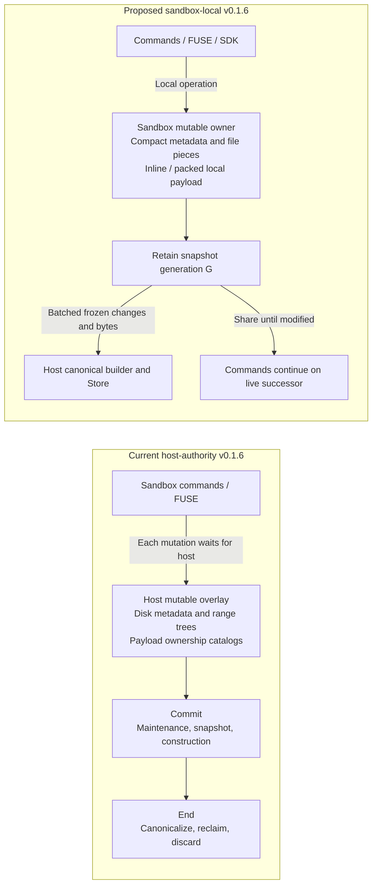
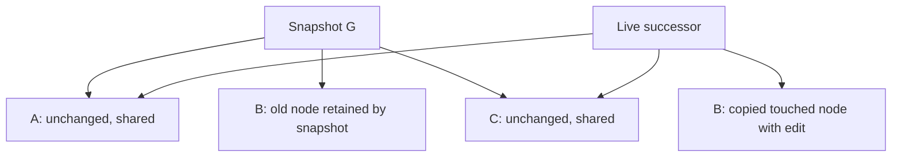
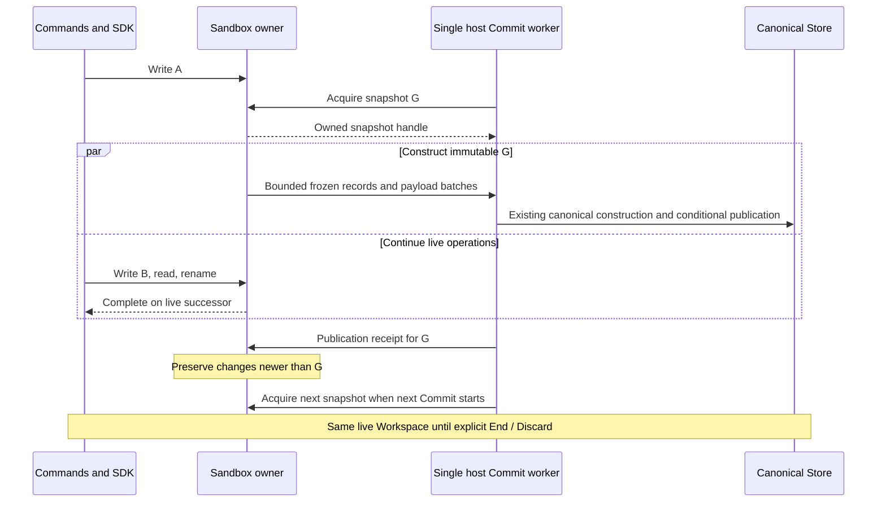
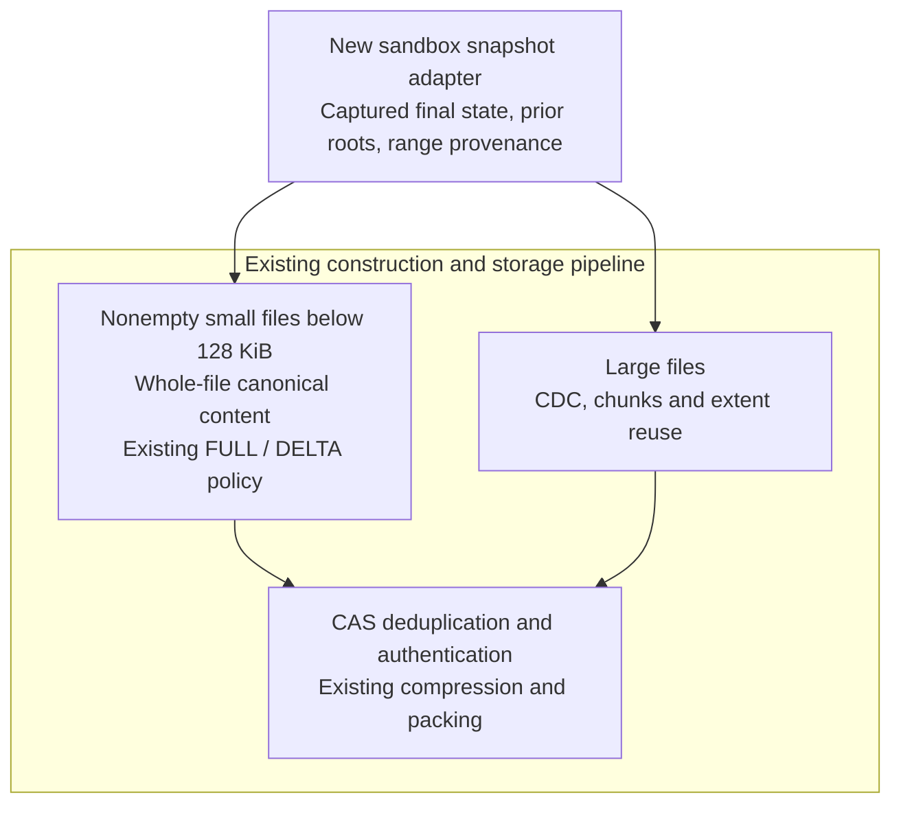

# v0.1.6: sandbox-local snapshots — specification and implementation plan

Status: specification, 2026-09-15. Implementation and measurements have not started.
Profile/revision: **`v016-local-snapshot-experiment-v1`**.
Tracking: [#149](https://github.com/Ephemeral-AI-Lab/layerfs/issues/149). The issue contains the full specification while the repository document awaits its documentation commit.

Execution tracking: [#151](https://github.com/Ephemeral-AI-Lab/layerfs/issues/151) owns the combined implementation and three sequential benchmark gates. Use its [pipeline](experimental-implementation-pipeline.md) for stage order and progress; #149 remains the requirements/gate contract and #150 the connection architecture.

Connection refinement: [#150](https://github.com/Ephemeral-AI-Lab/layerfs/issues/150) and the [reviewed sandbox/host architecture](sandbox-host-connection-architecture.md) incorporate three independent reviews. They make the remaining traffic, service fairness, cancellation and bounded host-memory outcome rules explicit; #149 retains the overall experiment and its unchanged gates.

The owner requested this document and tracking issue after discussing the architecture. This publication does not itself check out an implementation branch, start benchmarks, merge code, or release v0.1.6.

## 1. Objective and authority

Rebuild the mutable Workspace and snapshot input path from the **v0.1.5 release tag**, preserving its local-operation efficiency and canonical storage algorithms. Ordinary commands must operate locally, Commit must capture an immutable generation without pausing the Workspace, and the same Workspace must support subsequent commands and Commits until explicitly ended. One sandbox must support multiple independent Workspaces through its shared daemon; use `/workspaces/<workspace-id>/` as the default visible layout.

The experiment must be comparable to freshly measured v0.1.5 performance, in this owner-selected order: **`tiny-create-500-mixed-v4` -> `tiny-bulk-create-500-mixed-v3` -> 25,000 one-byte files**. Each case must pass before advancing to the next full qualification. Smaller temporary storage, bounded memory, bounded CPU work, and single-worker construction are independent requirements. Improving the current slow host-authority implementation alone is insufficient.

Implementation base: `v0.1.5^{commit}` = **`6ee1ec94cfdcb7bc8c55830e8348d553c20e2f13`**. Its annotated tag object is `5c7c9b0b01107461c3c144bd910539a6d73b12af`; the tag object is not the source commit. The rejected architecture was inspected at `7b73c4b33c950c3ce3cd192ea7b571398bda3f8f`. Resolve and record the tag again before checkout; never substitute current main as the implementation base.

This document governs this new experiment where it conflicts with older v0.1.6 plans. Historical documents and measurements remain intact. It does not rewrite unrelated benchmark/release contracts or close older issues.

| Earlier constraint or plan | Governing decision for this experiment |
|---|---|
| Host owns mutable metadata and all temporary payload backing; mutation acknowledgment waits for host installation | Sandbox owns mutable state and replacement bytes. Host retains the Store and canonical builder. |
| Published temporary disk pages are immutable after every mutation, including exclusively owned pages | Compact exclusive metadata nodes may be updated in place. Shared nodes require copy-on-write. |
| n3 alternating pairs, medians, or repeatability campaigns | **One sample per case per arm.** Direct single-sample gates; no multi-sample campaign. |
| Add construction or reclamation workers to recover speed | **One Commit compute worker.** No parallel encoding, file construction, or GC pool. |
| Continue R1–R4 as the recovery path from host-authority performance | A fresh experiment from v0.1.5 tests local ownership and compact state. |
| Crash durability motivates host ownership of uncommitted state | Crash durability is outside this algorithm experiment; snapshot consistency and publication correctness still apply. |
| Initial requirement to prove an evictable million-file metadata engine | Prove create-500, bulk-create-500 and 25,000-file behavior under explicit limits first. Million-file qualification and metadata spill are later work. |

The scoped hosting exception also applies to `benchmark/AGENTS.md`, the general benchmark guide, and older quick-start text. It permits candidate sandbox-local temporary state; it does **not** permit Docker-owned SQLite, container-side benchmark coordination, or container-side canonical publication.

## 2. Non-negotiable rules

1. **No imported-library patches.** No third-party patches, forks, vendored edits, dependency substitutions, new dependencies, version/feature changes, or lockfile changes for the experiment. Use supported APIs. Ordinary first-party source imports may be adjusted to connect existing code. Do not change the Init/import encoding behavior or create a second canonical builder.
2. **Start from v0.1.5.** Use an isolated implementation branch/worktree; preserve main and the release tag. Port a later first-party fix only with a named necessity and focused check. Do not transplant the current host overlay wholesale.
3. **No quiesce or pause.** No command stop/restart, operation freeze, wait-for-exec-to-finish, writable-handle closure requirement, whole-cache drain as acquisition, unmount/remount, or freeze/build/publish/checkpoint/resume fallback.
4. **The Workspace stays alive.** Commands and SDK operations can complete during construction and after publication. Preserve mount identity, live inode identity, open descriptors, offsets, append behavior, hardlinks, and open-unlinked lifetimes.
5. **One Commit worker.** Exactly one canonical construction/encoding worker is used for the experiment, in control and candidate. No parallel per-file tasks or reclamation pool. Necessary FUSE/control/I/O service threads remain separately identified and fully measured; they must not act as hidden compute workers. Runtime worker count is distinct from compilation jobs.
6. **Memory and CPU are bounded.** Reserve/account before allocation; bound batches, requests, retries, readers, and cleanup debt. No spin loops or unbounded per-operation history. A budget error preserves state but fails a target workload that is required to complete.
7. **One sample only.** One performance sample per case per arm/source configuration. No means, medians, percentiles from repeats, arm-only reruns for a nicer result, or multi-sample acceptance screens.
8. **Preserve canonical storage.** CAS identities, authentication, deduplication, compression, packing, small-file FULL/DELTA policy, large-file CDC/extents, conditional publication, and efficient successive Commit reuse remain required.
9. **Measure the complete work.** Include required transfer, construction, publication, and teardown. Report temporary storage and both host/sandbox resources. Do not shift cleanup or allocation to an unmeasured phase to pass a gate.
10. **Be explicit about proof scope.** A local root snapshot does not establish kernel-dirty mmap visibility. Do not disable supported mappings, omit their bytes silently, patch a dependency/kernel to pass, or call that obligation solved by an ordinary-write experiment.
11. **Multiple Workspaces per sandbox.** Each WorkspaceId identifies its own mount, mutable owner, snapshot generations, backing directory, branch context and lifecycle. A daemon may manage many owners; End/Discard of one must preserve healthy siblings. Do not create a daemon/sandbox/compute worker per Workspace as an implicit implementation choice.

## 3. Architecture

### 3.1 Comparison



The host retains SQLite, the SDK/benchmark coordinator, immutable canonical storage, construction, and publication. The sandbox retains the single mutable authority, snapshot generations, and local temporary payload. Immutable-base cache misses may fetch host data. Ordinary hot mutations must not require host installation or per-mutation payload reservation on the host.

“Single mutable authority” applies per WorkspaceId. The owner-selected layout uses `/workspaces/<workspace-id>/` for the live FUSE mount and `/snapshots/<workspace-id>/` for private shared backing and the one active Commit snapshot slot. The latter is not another mount or a copied directory tree; snapshot descriptors stay in daemon memory, and backing bytes remain while live/snapshot/read owners need them. Do not delete the private directory on each Commit. It is reused and retired at Workspace End/Discard. Verify backing filesystem/private access and preserve validated custom mount-path behavior. Snapshot handles/results carry WorkspaceId, incarnation, generation and attempt identity despite the stable directory name. The shared daemon and single host Commit worker route by identity; queued Commits capture when they start. See #150 for the layout and ownership proof.

SDK mutations enter the same sandbox owner through the control route. Host status must query that owner rather than maintain a competing mutable mirror. A snapshot is private backing ownership, not a second mount, visible directory, or copied filesystem tree.

### 3.2 State representation and acquisition

Use compact bounded-size metadata nodes with shared child ownership. Use existing first-party ordering/edit algorithms where practical. An exclusive node can be changed in place; a shared node is copied only on the affected path. A whole `Arc<HashMap>`/`Arc<BTreeMap>` clone is not the intended design. Merely checking reference counts in today's prepare path is insufficient because that path itself pins the predecessor on every mutation.

Represent simple content as **Empty / Inline / SingleExtent / PieceTree**. Keep tiny bytes inline or packed into shared chunks; no independent 4 KiB allocation or range-tree leaf per one-byte file. Existing PieceTree mechanics and retained backing references are reusable; add the provenance required for successive commits without bringing back the sparse disk catalog. Bound chunk retention so one surviving byte does not indefinitely pin an arbitrarily large dead segment.

Capture registers a fixed-size owned root bundle: workspace identity, generation, inode/namespace/change roots, immutable base context, and payload ownership. Normal short mutation synchronization establishes its boundary. It must not span network/disk I/O, construction, reclamation, a namespace scan, or a complete dirty-map clone. The first post-capture edit must not clone the entire workspace either.



Mutation installation must remain atomic for related rename/link/unlink records. Validate inputs and reserve fallible work before exposing changes; bounded retries revalidate the actual source. Allocation failure cannot leave half an operation installed. Snapshot/read ownership and memory accounting cover referenced backing independently of mutable path names.

### 3.3 Commit and reuse of the live Workspace



Initially permit one unresolved Commit and at most one queued Commit request per Workspace. Queue admission never captures a snapshot early. A second request starts only after the prior outcome is resolved. An ordinary command must not wait for construction to finish merely because a Commit is pending.

The builder consumes captured changed keys and immutable ranges, never live-path reads through FUSE. Transfer cost is proportional to changed metadata and needed bytes; constant-size acquisition is not a claim of constant-time transfer or Commit.

Publication advances branch comparison/coverage for G. It must not install G back into the live Workspace or clear later changes. Preserve stable live IDs, prior canonical roots, origin/range correspondence, and namespace deltas so a small C2 after a large C1 does not rebuild all changes since workspace creation.

On a lost Store-to-coordinator reply or host-to-sandbox coverage acknowledgment, resolve the exact retained attempt; do not recapture newer state as a retry. Preserve Created versus UpToDate behavior. The existing public SDK has no caller-supplied attempt ID, so this does not establish generic exactly-once retries after an arbitrary lost API response. Known published content cannot be erased by cleanup failure. Before the successful receipt, ensure the host owns the canonical output needed after sandbox retirement.

End/Discard verifies the appropriate clean/dirty condition, retires the mount, resolves pending publication/SDK outcomes, and releases ownership safely. It must skip canonical substitutions whose sole purpose is accelerating a future Commit in a workspace being destroyed. Retained readers still protect their backing; do not delete data underneath them.

### 3.4 Disposable Workspace, atomic database publication

The owner clarified the priority: a Workspace is cheap, ephemeral and replaceable. If its state becomes unusable, fail it explicitly and create another from an authoritative committed root. Do not build persistent per-operation recovery, a restartable Workspace, or host acknowledgment of every mutation merely to preserve disposable state. Successful Workspaces must still support repeated commands/Commits; disposability is not permission to destroy a healthy one at Commit.

**Workspace fsync is not the database transaction boundary.** Temporary bytes may remain in owned RAM or volatile local backing. The single host worker must first obtain a complete, valid canonical candidate whose logical object dependencies and transitive physical DELTA-base dependencies are readable independently of disposable Workspace storage. Only then may it publish the candidate. Preserve the existing checked admission/dependency pipeline rather than adding a full-tree scan. A partial transfer, invalid input, failed encoding or broken Workspace cannot advance the branch to an incomplete candidate.

The existing v0.1.5 Store already uses an immediate SQLite transaction for conditional publication: verify expected head/base/root and retained stage; insert/verify the Commit identity; conditionally advance the branch; remove the matching stage; COMMIT. Reuse these semantics and retain the existing Store admission/operation permit and rollback ownership even with one Commit worker.

Under the live-host failure model, default to one bounded host-memory attempt/outcome rather than a persistent receipt schema. Prepare the result before publication and assign known SQL success infallibly before any await, cancellation point, telemetry, sandbox acknowledgment or API result send. Caller cancellation/sandbox disposal must not destroy the executing host worker or its outcome. A transactional marker is justified only if the implementation cannot prove that handoff or must resolve a demonstrated wider SQL-error ambiguity. Success is returned only after database transaction completion; do not port persistent receipt/ancestry recovery by default.

| Failure point | Required observable result |
|---|---|
| Workspace breaks or transfer/encoding fails before a complete candidate exists | Previous published head remains; discard the broken Workspace. No partial snapshot becomes branch history. |
| Candidate is complete but publication has not begun | Cancellation abandons the owned attempt/stage. Once publication begins, the host finishes/resolves that exact transaction independently of caller/sandbox lifetime. |
| A publication statement fails before SQL COMMIT | Roll back publication; previous head/history remain consistent. Do not treat a statement failure as a successful transaction. |
| Expected branch head/base has changed | Conditional publication fails explicitly; never overwrite the newer branch. |
| SQL completion itself returns an error with an unproved outcome | Normalize/inspect while retaining Store ownership; autocommit state alone is not an outcome receipt. Report indeterminate and contain destructive writes until resolved; never guess or recapture. |
| SQL COMMIT succeeds but the reply is lost | Resolve that exact published result. Workspace destruction or retry cannot undo it or create a duplicate logical Commit. |
| Workspace is discarded after successful publication | Every committed byte remains readable from the Store. A new Workspace can start from the authoritative head. |

Canonical object admission may use earlier bounded transactions. Aborted attempts may leave staged/unreferenced immutable objects; that is distinct from exposing a partially published branch snapshot. Preserve ownership/cleanup accounting and never delete objects referenced by published roots. Do not force all candidate construction into one long database transaction or keep the mutable Workspace locked during publication.

The failure model here covers ordinary operation errors, cancellation, Workspace/sandbox failure and lost replies while the host database process and OS remain available. It does not silently add database-process-crash or power-loss recovery. The released Store uses `journal_mode=MEMORY` and `synchronous=OFF`; retain its runtime transaction/rollback machinery and do not change `journal_mode` to OFF. MEMORY journaling cannot provide database-process-crash safety. If crash-safe database integrity becomes required, select and qualify a suitable SQLite journal/synchronization policy as a separate explicit change, without restoring Workspace fsync.

Run focused publication fault checks before the performance gates: failure after partial candidate admission; failure after Commit-row insertion but before head advancement/SQL completion; a moved-head conflict; lost reply after SQL COMMIT; and destruction of the Workspace followed by reading all published content from a new Workspace. Inspect branch/history, object reachability and exact receipts. These are correctness fault cases, not repeated performance samples or a claim of host-crash qualification.

Sources: [v0.1.5 transaction implementation](https://github.com/Ephemeral-AI-Lab/layerfs/blob/v0.1.5/crates/layerfs-layerstack-store/src/workspace.rs), [current exact-receipt publication](https://github.com/Ephemeral-AI-Lab/layerfs/blob/7b73c4b33c950c3ce3cd192ea7b571398bda3f8f/crates/layerfs-layerstack-store/src/workspace.rs#L626-L767), [SQLite transaction errors](https://www.sqlite.org/lang_transaction.html), and [SQLite journal modes](https://www.sqlite.org/pragma.html#pragma_journal_mode).

## 4. Canonical encoding is inherited



The v0.1.5 schema-10 policy includes bounded small-file delta chains; preserve the existing eligibility, base selection, savings tests, and closure limits. Do not require every file to be DELTA or replace the released policy with an older one-level-only proposal. Files at the exact 128 KiB boundary retain the released representation rules.

For large-file edits, preserve unchanged extent references and scan only the replacement/boundary data required by the existing algorithm. Sending a flattened whole-file stream may be correct but does not qualify range-locality preservation. Repeated identical canonical content must retain exact CAS reuse. Physical pack layout need not be byte-identical, but encoding choices, reconstruction bounds, authentication, and storage-efficiency behavior require verification.

## 5. Resource contract

The following are **initial engineering budgets selected for this spec revision**, not previously measured results or claims that the owner supplied these numbers. They must be recorded before execution and must not be raised after a miss to manufacture a pass.

| Budget | Initial limit and accounting |
|---|---|
| Workspace algorithm working allocations | **64 MiB aggregate** across host/sandbox mutable metadata, payload buffers, snapshot-only metadata, transport/control queues, retained requests, construction scratch and cleanup queues. Charge capacity, not just used length. |
| Transport/payload staging buffers | **8 MiB combined**, included in the 64 MiB total; batches must also respect existing wire limits. |
| Existing final-delta construction allowance | Preserve v0.1.5's **8 MiB** policy; included in the aggregate where allocated. Do not silently raise canonical-builder limits. |
| Snapshot / queued Commit | One unresolved snapshot/attempt and at most one queued Commit per Workspace. Bound other readers by the same resource policy. |
| 25k transient physical backing | **32 MiB peak**, summing host and sandbox workspace backing, metadata, allocator files, journals and canonical-construction temporary files. Exclude immutable fixture/Store and final committed Store bytes; report those separately. Include anonymous/unlinked file allocation and pending reclamation. |
| Process-memory comparison | Conservative sum of host-process and sandbox-process peak resident bytes must be ≤ v0.1.5's corresponding sum + `max(15% of that sum, 8 MiB)`. Report each peak and cgroup/kernel usage separately; the sum is an upper-bound proxy, not a simultaneous RSS observation. |

Existing Store caches, runtime stacks, and kernel caches are not disguised as charged algorithm allocations: report them through process/cgroup measurements. Keep the same cache/buffer policies across arms except the declared workspace algorithm difference. An unrelated process or fixture-preparation high-water must not contaminate measured process peaks.

The initial 64 MiB accounted allocation limit is shared across active owners/attempts in this experiment, not multiplied by the number of Workspaces in the sandbox. Keep per-Workspace charges plus aggregate daemon/host admission and bounded registry/queues. This clarification adds no worker and changes no per-case performance threshold.

For create-500 and bulk-create-500 independently, measure transient backing at the same lifecycle checkpoints and require candidate peak physical workspace backing ≤ control + `max(15% of control, 1 MiB)`. For 25k, both the 32 MiB absolute gate and the process-memory gate apply. Bulk-create-500 genuinely writes 500 MiB of new payload: the 32 MiB backing limit does not apply to it, while the 64 MiB working-allocation and 8 MiB staging-buffer limits still do. Stream from packed local backing into the builder rather than keeping the whole payload in RAM or making an unnecessary full host staging copy.

Reserve before allocation; bound ownership traversals and retry work; release old roots outside critical synchronization. No whole-namespace scan or growing dirty-prefix serialization per ordinary update. No always-growing generation chain. Resource exhaustion must return a bounded, explicit error or backpressure without corruption or deadlock; a required target workload that exhausts its budget is a FAIL, not a qualified safe success.

One active snapshot can legitimately retain overwritten bytes. Fixed memory does not imply unlimited nonblocking writes while a snapshot is held forever. Record this limit, enforce bounded admission, and prove ordinary operations progress within admitted capacity.

## 6. Experiment cases and timing

### 6.1 Common execution profile

Use the existing host coordinator/family runners and Linux daemon/FUSE/workload infrastructure. Host owns the Store and construction; candidate sandbox-local temporary backing is the declared treatment. No synthetic filesystem replacement, container-side SQLite, third-party changes, or benchmark-case conditionals in product code.

Control is v0.1.5 and candidate is the experiment branch from that tag. Both use one construction worker, the same supported toolchain/build profile, seed **1**, declared cache treatment, and environment. Keep the existing 2 CPU / 2 GiB / no-swap / 256-PID container envelope; it is not permission for two construction workers. Host resources are measured separately. Run arms sequentially under the existing measurement lock; no overlapping builds, fixture preparation, verification, or unrelated benchmark work.

Use matching workload/fixture/oracle/harness source across arms. Any necessary instrumentation must be identical and nonsemantic, with its patch/hash recorded; do not call an API-modified or differently configured control an untouched release. Prefer the v0.1.5-compatible harness and minimal additive metrics over porting the current host-route harness wholesale. No weakened identity validation or relabelled dispatch proof.

Prepare input outside timing and give each sample an independent writable copy. Preserve source/binary/image identities and workload receipts. Follow the actual runner copy method; `--setup clone` alone must not be relabelled an APFS reflink or cold cache. Build and setup wall are reported separately. Reuse valid artifacts rather than rebuild or reprepare unchanged inputs.

Use the existing selected profile's 300 s product / 310 s outer timeout, with separately declared setup allowance. These are failure bounds, not targets or permission to fill time. Do not extend a timeout after seeing a miss in this revision.

### 6.2 First performance gate: tiny-create-500 mixed

Case: **`tiny-create-500-mixed-v4`**, family `tiny_file_churn`, seed 1. Preserve the registered fixture: 500 target creates against the existing 5,000-background-file / 500 MiB mixed load, including its exact distribution, paths, zero-length cases, metadata normalization, sync calls, and receipt/verification rules. Do not replace it with 500 one-byte files.

Measure Begin, exec, complete Commit, visibility, End and their complete public-call sum. Complete Commit includes pre-capture work, acquisition, transfer, candidate planning/construction, staging, and publication acknowledgment. End includes required retirement and cleanup. Full verification/reopen/digests run outside performance timing.

### 6.2a Second performance gate: tiny-bulk-create-500 mixed

Case: **`tiny-bulk-create-500-mixed-v3`**, family `tiny_file_churn`, seed 1. Run only after create-500 passes. Preserve the registered fixture and workload: an initial 200-file / 1 MiB witness namespace, followed by 5,000 new files totaling exactly 500 MiB. The resulting namespace has 5,200 regular files and 501 MiB of payload. Preserve existing directories, paths, normalization, root sync and operation counts; do not substitute the create-500 fixture or invent an all-small-file version.

The 5,000 new files comprise three 100 MiB files, 4,000 4 KiB files, 936 files of 193,913 B and 61 files of 193,912 B. Reuse the registered deterministic generator and verifier rather than reconstructing these bytes in product code. This case exercises local bulk writes, bounded transfer and existing small/large-file canonical construction; the 25k case that follows targets metadata density and retention.

Use the same Begin/exec/complete-Commit/visibility/End timers, direct single-sample time/CPU gates and memory comparison as create-500. Report transfer, encoding, temporary backing and committed Store growth separately. Moving 500 MiB from the exec phase to the Commit phase does not exempt the candidate from the agreed complete-Commit gate. No transfer may be moved before capture or outside the timer merely to satisfy it. Bounded transfer/encoding overlap may use the existing I/O services but not a second compute worker.

Historical context only: the released sample was 5.732993668 s overall, including 3.828836917 s exec and 1.868467000 s Commit. A hypothetical identical fresh control would set a 6.592942718 s workflow limit and a 2.148737050 s Commit limit. The fresh control, not these historical values, defines the actual gates. No new sample has been collected.

Source: [registered fixture distribution](https://github.com/Ephemeral-AI-Lab/layerfs/blob/v0.1.5/benchmark/fs-bench-pro/families/tiny_file_churn/mod.rs#L138-L164) and [v0.1.5 release measurements](https://github.com/Ephemeral-AI-Lab/layerfs/blob/v0.1.5/release-notes/0.1.5/benchmark-performance.csv). The exact historical raw receipt is `benchmark-results/host-store/issue120/performance/tiny_file_churn/tiny-bulk-create-500-mixed-v3/perf.jsonl`; it is retained local evidence, not a substitute control run.

### 6.3 Third performance gate: 25,000 one-byte files and continuing Commits

Run this qualification after both create-500 and bulk-create-500 pass. It retains the previously selected 25k workload and budgets.

New scoped case ID: **`local-snapshot-create-25000-onebyte-v1`**. This is not a renamed historical capacity test or a new full benchmark family. Add the smallest scenario adapter to the existing lifecycle runner after this specification is committed.

Use an empty initial namespace and one fresh Workspace. In ordinal order create exactly 25,000 regular files directly under the root, named `f00000` through `f24999`. Each initial payload is the one byte `ordinal % 251`. Use fixed modes (files 0644, root 0755) and normalize mtime to 1700000000 seconds before each Commit; use the same normalization and final root fsync call in both arms. No setup may precreate the target files or encode their future content into the measured Store.

The single lifecycle sample has three successive Commits:

1. **C1:** create/write all files, normalize metadata, root fsync, then Commit.
2. **C2:** change the byte at ordinals `97*j` for `j = 0..255` to `(ordinal + 1) % 251`, normalize the affected metadata/root, root fsync, then Commit.
3. **C3:** restore the original bytes at those same 256 ordinals, apply the same normalization and root fsync, then Commit and End cleanly.

Three distinct steps in one lifecycle are not three repeated samples. They prove continued command execution, successive-Commit locality, and reuse when content returns to an earlier value. Separate verification checks C1/C2/C3 bytes, namespace and metadata through published content, plus live state and cleanup. C3 payload equality can reuse C1 objects without requiring identical commit identities.

Collect cheap ownership/allocation counters before C1 capture, while a snapshot is retained, after each Commit and at End. Perform expensive complete memory/disk censuses only in the separate verification scope. The focused held-builder proof in section 9 exercises overlapping writes; keep timed workload ordering identical to the v0.1.5 control.

The old 25k debug diagnostic had no Commit and included repeated censuses. Its 1,099.52 s is not a baseline. Historical 700 MB+ overlay evidence motivates the storage gate but is not a new measurement.

### 6.4 Volatile fsync contract: durability is out of scope

The owner reiterated that this is an algorithm experiment without crash-durability requirements. The candidate Workspace must not force `fsync`, `fdatasync`, `sync_data`, or `sync_all` on its temporary backing solely to provide durable storage. Commit is a consistent canonical publication within the supported live runtime, not a power-loss durability promise. Preserve the existing Store/codec configuration; this does not authorize dependency patches or global suppression of synchronization in unrelated services.

This removal is justified by section 3.4: no later successful Commit may depend on recovering the disposable Workspace from physical storage. A broken Workspace can be discarded. Application-facing sync support is only compatibility and local completion/error handling; it must not grow into a recovery or persistence subsystem. A known broken Workspace returns an error rather than running a repair/flush campaign.

Keep application-facing `fsync`/`fdatasync` and directory-sync calls supported under a documented **volatile** contract: validate the operation, ensure preceding writes in the relevant ordering scope are installed in owned, readable Workspace state, and report known write/allocation errors. If writes already complete synchronously into that state and no error is pending, the daemon callback may return success without a backing-device flush. This is not POSIX stable-storage durability, nor a promise to discover errors that only a forced device flush could reveal.

The callback must not create a snapshot, canonicalize content, export the complete dirty prefix, drain the whole workspace, or acquire a mandatory host acknowledgment. Do not discard pending writes or swallow recorded errors to make it a no-op. Logical buffer ownership and visibility are separate from writing buffers to disk: the snapshot may read retained immutable buffer intervals directly.

In v0.1.5, `LiveOwner::fsync_async` flushes the append window and publishes facts to make the old host capture path usable; the backing CHECK performs validation/observation rather than an actual durable flush. Those visibility responsibilities must move to the local snapshot owner before the old synchronization/export work can be removed. In the current host-authority route, `Operation::Fsync` explicitly calls payload and index `sync_data`; these are the distinct durability-flush calls excluded from the new temporary path.

This simplification does not solve dirty shared-mmap visibility. If kernel-only dirty state is still supported, making the FUSE fsync callback cheap does not prevent kernel writeback before that callback and does not make a local root a complete snapshot. The conditional mapping proposal in section 9.1 remains separate. Do not remove a visibility mechanism while retaining an unsupported promise about its bytes.

Keep the benchmark workload's sync calls in both arms. The intentional candidate change is the documented volatile implementation, not deletion of calls from the workload or a claim that control/candidate durability contracts are identical. Verify read-after-write and read-after-sync, capture without any preceding sync call, known-error propagation, continued operations, and subsequent Commits. No extra performance samples are required for this clarification.

## 7. Hard performance gates: one observation, not a median

For control measurement `T0` and candidate measurement `T1`, in milliseconds:

```text
time_limit(T0) = T0 + max(0.15 * T0, 3 ms)
cpu_limit(C0)  = C0 + max(0.15 * C0, 1 ms)
PASS_time      = T1 <= time_limit(T0)
PASS_cpu       = C1 <= cpu_limit(C0)
```

| Required measurement | Create-500 and bulk-create-500, each separately | 25k |
|---|---|---|
| Complete public-call workflow sum | Hard time gate | Hard time gate across all three Commit cycles and End |
| Exec / create-write phase | Hard time gate | Hard time gate for C1 create/write and each C2/C3 edit phase |
| Complete Commit | Hard time gate | Each C1, C2, C3 must independently pass |
| End and required cleanup | Hard time gate | Hard time gate |
| Total workflow CPU | Hard CPU gate | Hard CPU gate |
| Correctness, worker count, memory and storage | Independent hard gates | Independent hard gates |

Begin and visibility are reported separately and included in the workflow total. An incomparable/missing required measurement is **INCOMPLETE**, never PASS. Successful exit is not a performance pass. Collection mode must not downgrade these misses to WARN.

CPU includes host coordinator/builder and sandbox daemon/workload over corresponding before-Begin through after-End intervals. Exclude unrelated processes and setup; do not compare host-only CPU in one arm with host+container CPU in the other. If existing receipts cover different windows, add symmetric bounded collection before sampling. Sum CPU time across processes, not wall time or overlapping RSS peaks.

Illustration only: if a fresh v0.1.5 tiny-500 control were 242.660 ms, its workflow limit would be 279.059 ms. The actual fresh measurement controls the gate. A 2–5 second candidate cannot pass merely because current host-authority v0.1.6 takes longer.

## 8. Single-sample and evidence rules

- Collect **one control performance sample and one candidate performance sample per case/configuration**, control first. No n3, alternating repetitions, warmup samples, statistical repeatability run, or best-of selection.
- Focused correctness tests and one separate verification invocation are not repeated performance samples. Their timings cannot replace performance results.
- After a real relevant source change, collect one necessary new candidate sample. Reuse the control only while the workload, environment, metric windows, cache treatment and worker configuration remain comparable. Record a new comparison ID for a genuinely changed configuration; never change it merely to obtain a nicer number.
- Retain failed/invalid attempts. An invalid infrastructure attempt remains invalid and any justified replacement records the exact reason. Do not silently retry a timeout or slow valid sample.
- Report values as **single-run experimental observations**, not distributions or statistically established speedups. Existing release/multi-sample families are neither rerun nor relabelled as qualified by this profile. Use `admission_eligible=false` for release admission.
- Store immutable raw receipts, source/build/image identities, fixture identity, operation counts, worker counts, phase metrics, host/sandbox CPU and memory, allocation categories, canonical-storage metrics, verification and cleanup status. Maintain an append-only experiment ledger.
- Do not run the existing broad `v016_matrix.py`, a full family campaign, or a million-file test for this experiment.

## 9. Focused correctness and safety proof

Before timed candidate qualification, use one deterministic held-builder check: write A; capture G; hold construction after acquisition; write B/read/rename through the same mounted workspace while construction is held; verify G sees A and live reads see B; publish G; Commit again and verify later changes are present; run another command; End explicitly. Use synchronization latches, not fixed-duration sleeps. Failure to complete an admitted foreground operation while construction is held fails non-pausing behavior.

Preserve meaningful existing checks for hardlinks, rename atomicity, open-unlinked files, descriptor identity/offsets, failed allocation, stale generation installation, lost publication response, and cleanup ownership. Run affected checks once; rerun only after relevant changes or a diagnosed failure.

Add one focused two-Workspace-in-one-sandbox check: equal relative paths with different bytes remain distinct; capture/Commit of A excludes B; commands progress in both; stale/misaddressed result tokens are rejected; End A leaves B's mount, open handles, backing and subsequent Commit usable. Reuse the daemon registry and existing per-Workspace routing. This is correctness verification, not an extra performance sample or benchmark family.

Encoding proof must include exact CAS reuse, an eligible small-file delta plus FULL fallback, 128 KiB threshold transitions, a large-file localized edit with unchanged extent reuse, and correct reads after reopening the Store. Reuse representative existing tests/fixtures and counters; do not create a new codec or large test framework.

**Kernel visibility boundary:** dirty shared mmap bytes can reside in kernel pages without a daemon WRITE. Root retention is not proof of their capture. The ordinary-write experiment may proceed with this limitation recorded, but full v0.1.6 snapshot support cannot be marked complete until the existing supported mapping contract is proved without pausing, whole-cache drainage, disabled mappings, or library/kernel patches. If no compliant mechanism is found, report the exact remaining limitation; a fast tiny case does not resolve it.

### 9.1 Mapping support decision: proposed narrowing, not yet adopted

After issue creation the owner asked why mmap is needed and whether it can be removed. The snapshot/CAS/CDC/DELTA algorithms do not require application writable shared mappings. LayerFS's own host Store already sets `mmap_size=0`; application mappings of Workspace files are a separate compatibility surface. This proposal concerns file mappings on the Workspace, not anonymous process mappings, runtime allocation, or unrelated host files.

| Mapping type | Meaning | Recommended experiment policy, if selected |
|---|---|---|
| Read-only mappings | Read file contents through mapped pages | Retain where supported; verify cache coherence with ordinary and SDK writes. |
| MAP_PRIVATE, including private writable pages | Process-private modifications are not written back to the file | Retain. Private changes are not Workspace mutations and need no Commit capture. |
| MAP_SHARED with writable file access | CPU stores can mutate file-backed kernel pages without daemon WRITE callbacks | Exclude from the new version's supported surface, with deterministic failure and explicit compatibility documentation. |

The mechanism to test uses existing APIs: return `FOPEN_DIRECT_IO` for every writable OPEN/CREATE, including reopen, and do not negotiate `FUSE_DIRECT_IO_ALLOW_MMAP` or writeback-cache support. Retain the ordinary read-only open path. In the checked Linux 6.12 implementation, shared mappings on a direct-I/O handle fail with `ENODEV`, while MAP_PRIVATE follows the generic mapping path. This is a source-backed proposal; it has not been tested on the new route.

The flag is per handle and is broader than a PROT_WRITE-only filter: a read-only MAP_SHARED mapping through an O_RDWR direct-I/O descriptor also fails. Programs can use a read-only descriptor/private mapping if they support that choice; arbitrary applications must not be assumed to fall back. Inspect all open/create paths and any open-elision route. A reopen must not accidentally restore a cached writable handle. The daemon does not receive an ordinary per-mmap callback that can simply reject one protection flag.

If selected, the scoped contract and specific writable-mapping tests must be versioned explicitly before implementation; rejection tests replace those support expectations, while read-only/private mapping checks remain. This is a declared compatibility change from v0.1.5, not a claim to preserve its full mapping surface. It replaces the full writable-mapping proof obligation for the new scope only; until selected, section 9's existing obligation remains OPEN.

Run one focused capability/coherence proof covering direct creation and reopen, rejection of shared mappings on writable handles, read-only/private mapping behavior, attempted mprotect escalation from a read-only file mapping, mixed cached reads and direct writes, SDK writes, truncate/rename/unlink, and execution/read of representative files. Targeted cache invalidation must remain correct; removal of writable shared mappings does not solve every caching or inode-lifetime bug. No global syncfs, periodic full-cache scan, dependency patch or hidden pause is an acceptable replacement.

Applications that require writable shared mappings, such as some memory-mapped databases or file-based IPC, would need a supported alternative I/O mode or a separately located non-snapshotted data area whose exclusion is explicit. If full support is indispensable, the currently checked stock mechanisms do not establish the required atomic non-pausing cut; do not promise that fsync, dirty-page retrieval, or direct-I/O-with-mmap enabled fixes it.

Sources: [host Store configuration](https://github.com/Ephemeral-AI-Lab/layerfs/blob/v0.1.5/docs/versioned/0.1.5/storage-format.md), [mmap semantics](https://man7.org/linux/man-pages/man2/mmap.2.html), [kernel FUSE I/O modes](https://docs.kernel.org/filesystems/fuse/fuse-io.html), [pinned Linux mapping implementation](https://github.com/gregkh/linux/blob/39b686f8d57d7506af7789e915fe7fd103b0fe57/fs/fuse/file.c#L2430-L2483), and [existing retrieval experiment](https://github.com/Ephemeral-AI-Lab/layerfs/blob/7b73c4b33c950c3ce3cd192ea7b571398bda3f8f/docs/roadmap/0.1/0.1.6/evidence/v1-investigation/README.md).

## 10. Implementation stages and stop conditions

| Stage | Deliverable | Exit condition |
|---|---|---|
| 0 — Freeze and isolate | Commit this spec and scoped rule exceptions; record issue/revision and budgets. Create experiment branch/worktree from v0.1.5 and a sealed control. | Correct source base, no dependency drift, identical workload configuration, all limits and metric windows declared before samples. |
| 1 — Local compact mutation path | Reuse local LiveOwner/PieceTree; local inline/packed payload; compact namespace/inode/change nodes; bounded atomic edits and accounting. | Ordinary hot mutations need no host installation; no per-file allocation amplification; targeted safety checks pass. |
| 2 — Snapshot and single-worker Commit | Owned local generation, bounded frozen reader/transport adapter, existing host builder, exact publication/coverage and safe reclamation. | Held-builder progress proof, immutable G, reusable live workspace, incremental C2, and encoding checks pass. |
| 3 — Create-500 | One control and one candidate sample of `tiny-create-500-mixed-v4`, separate verification, complete resource receipt. | Every section 7 gate and resource/correctness gate passes; otherwise diagnose the measured cause. |
| 4 — Bulk-create-500 | One control and one candidate sample of `tiny-bulk-create-500-mixed-v3`, separate verification and complete payload/resource accounting. | All workflow, exec, Commit, End, CPU, memory and backing-comparison gates pass. |
| 5 — 25k | One three-Commit lifecycle sample per arm, separate verification and retention accounting. | Every per-cycle/workflow gate, compact-storage gate, memory gate and cleanup check passes. |
| 6 — Adoption decision | Report exact outcomes, minimal implementation diff, remaining limitations and proposed migration. | Decide from evidence; neither main replacement nor a v0.1.6 release is automatic. |

Advance only after the current case passes: create-500, then bulk-create-500, then 25k. A focused component diagnostic may explain a failure but cannot replace a required public-path case. Do not lower gates, add workers, raise budgets, disable encoding, or reintroduce pause to obtain a pass. A necessary redesign is recorded before collecting another source configuration.

The experiment's acceptance is complete only when all three required cases, separate proofs and cleanup pass. Full production migration remains separate: remaining consumers, mapping visibility and broader regressions must be addressed before release claims. Do not label the entire v0.1.6 release complete on these three cases.

### 10.1 Simplification priorities

The owner asked which additional complexity can be removed now that a broken Workspace can be discarded. The implementation should choose the following reductions before adding optimizations or abstractions:

| Simplification | Retain the minimum required behavior |
|---|---|
| No Workspace recovery logs, persistent per-operation receipts, reconnect reconstruction, or automatic replay of uncertain mutations | Fail an uncertain/broken Workspace explicitly. New work starts from the database's actual published head. Do not replay an append or rename with unknown outcome. |
| No disk metadata/refcount/location databases in the initial compact RAM experiment | Bounded nodes/pieces with ownership and a small in-memory accounting ledger. Resource failure fails the case; a cap is not a scaling proof. |
| No forced Workspace durability flush or fsync-triggered dirty-prefix export | Local owned visibility and known-error checks; the database publication transaction remains separate. |
| No mandatory host admission/acknowledgment on each local mutation | Local ordering and admission, plus immutable-base fetches and batched frozen Commit input. |
| No generic multi-Commit scheduler or extra compute pools | One in-flight attempt, at most one queued request, one construction worker, and bounded service queues. |
| No full rebuild or canonicalization after each write | Existing compact pieces track changes; existing canonical algorithms run for Commit. |
| No canonicalization pass solely for End | Resolve any host publication outcome, retire ownership, and discard the ephemeral workspace. |
| No replayable history of raw Workspace generations | Retain only current state, the active snapshot/readers, and compact latest-published provenance needed for the next incremental Commit. |
| No new CAS/CDC/delta/compression implementations or rewritten Init planner | Adapt frozen input into the existing construction/admission pipeline. |
| No general-purpose metadata spilling, arena compaction platform, multi-tenant scheduler, or million-file engine before the selected cases pass | Use the declared budgets and measured limits; add a mechanism only for a demonstrated requirement. |
| No multi-sample statistics or broad benchmark matrix | One observation per case/arm plus focused correctness/fault checks, with every valid miss retained. |

If the proposed shared-mapping restriction is selected, remove its unsupported writable-mmap retrieval/drain/recovery machinery from the new path too. Keep read-only/private mapping compatibility and necessary cache invalidation. Until that scope decision is made, do not present removal as already authorized or verified.

Do not simplify away the immutable snapshot boundary, input validation, memory bounds, atomic namespace behavior, small-C2-after-large-C1 locality, complete canonical object closure, conditional database publication, rollback, or resolution of a lost successful Commit reply. Disposable Workspace state makes recovery optional; it does not make published history or transaction outcomes optional.

## 11. Relationship to existing work

- [#130](https://github.com/Ephemeral-AI-Lab/layerfs/issues/130) and [#144](https://github.com/Ephemeral-AI-Lab/layerfs/issues/144) remain evidence for the rejected route's tiny-file and transient-storage costs; this issue owns the replacement experiment.
- [#124](https://github.com/Ephemeral-AI-Lab/layerfs/issues/124) retains unresolved full-surface integration/correctness context. Its host-placement choices do not govern this scoped replacement.
- [#123](https://github.com/Ephemeral-AI-Lab/layerfs/issues/123), [#125](https://github.com/Ephemeral-AI-Lab/layerfs/issues/125), and [#122](https://github.com/Ephemeral-AI-Lab/layerfs/issues/122) are not automatically executed or closed. Million-file spill and full campaigns are outside this experiment.
- Do not rewrite old results, close issues or post updates to unrelated threads as an implicit side effect. Link the new work and preserve exact source applicability.

## 12. Evidence and code references

- [v0.1.5 release/encoding contract](https://github.com/Ephemeral-AI-Lab/layerfs/blob/v0.1.5/release-notes/0.1.5/release-contract.md): schema 10, small content, bounded delta chains, CDC/extents, compression and authentication.
- [v0.1.5 local FUSE owner](https://github.com/Ephemeral-AI-Lab/layerfs/blob/v0.1.5/crates/layerfs-fuse/src/live_owner.rs) and [PieceTree](https://github.com/Ephemeral-AI-Lab/layerfs/blob/v0.1.5/crates/layerfs-workspace-core/src/file_edit.rs): reuse operation ordering and compact range mechanics. Ordinary FUSE writes do not create canonical checkpoints; Commit's freeze/install behavior is what must change.
- [Host-authority attachment](https://github.com/Ephemeral-AI-Lab/layerfs/blob/7b73c4b33c950c3ce3cd192ea7b571398bda3f8f/crates/layerfs-workspace/src/projection.rs) and [temporary index](https://github.com/Ephemeral-AI-Lab/layerfs/blob/7b73c4b33c950c3ce3cd192ea7b571398bda3f8f/crates/layerfs-workspace/src/overlay_index.rs): the current path installs mutations on the host and versions sparse disk pages.
- [Phase 1 attribution](https://github.com/Ephemeral-AI-Lab/layerfs/blob/7b73c4b33c950c3ce3cd192ea7b571398bda3f8f/docs/roadmap/0.1/0.1.6/evidence/issue144-phase1/README.md) and [L48](https://github.com/Ephemeral-AI-Lab/layerfs/blob/7b73c4b33c950c3ce3cd192ea7b571398bda3f8f/docs/roadmap/0.1/0.1.6/overlay-snapshot-verification-ledger.md#l48--144-phase-2-r3a-batched-maintenance-drain-step-structural-gate-met-per-node-work-not-step-overhead-is-the-residual): 4,518 initial exchanges versus 7 historical; batching reduced steps much more than time. These are historical/diagnostic observations, not fresh gates.
- [25k trajectory](https://github.com/Ephemeral-AI-Lab/layerfs/blob/7b73c4b33c950c3ce3cd192ea7b571398bda3f8f/docs/roadmap/0.1/0.1.6/evidence/step1-capacity/capacity-trajectory.md): no Commit in that component test; 117,489,664 B arena + 233,033,728 B payload index + 105,515 metadata pages. At 4 KiB/page the listed components imply about 782.7 MB before omitted metadata overhead; exact whole-overlay physical usage was not separately logged.
- [Kernel visibility investigation](https://github.com/Ephemeral-AI-Lab/layerfs/blob/7b73c4b33c950c3ce3cd192ea7b571398bda3f8f/docs/roadmap/0.1/0.1.6/overlay-snapshot-contract-resolution.md#1-v1--kernel-visibility-checked-mechanisms-remain-insufficient): dirty mmap visibility remains unproved under the required combination of constraints.

## 13. Completion checklist

- [ ] Spec/revision, issue, source base, worker count, budgets and metric windows frozen before implementation measurements.
- [ ] No imported-library/dependency/lockfile changes; shared canonical algorithms preserved.
- [ ] Sandbox-local compact state and zero required host installation for ordinary hot mutations.
- [ ] Snapshot G remains stable while admitted live reads/writes/namespace operations complete.
- [ ] Repeated Commit and command execution preserve the same workspace and live identities.
- [ ] One sandbox supports multiple WorkspaceId-scoped owners/mounts; isolation, aggregate limits and sibling-preserving teardown pass.
- [ ] Exactly one Commit compute worker; service threads and total CPU accounted.
- [ ] Tiny-500: one sample per arm; all time, CPU, memory, backing and correctness gates pass.
- [ ] Bulk-create-500: one sample per arm after create-500 passes; the full 500 MiB workload and all phase/workflow/resource gates pass.
- [ ] 25k: one three-Commit sample per arm; all per-cycle/workflow gates and the 32 MiB transient backing limit pass.
- [ ] Bounded memory, snapshot retention, allocation failure, retry/publication and cleanup proofs pass.
- [ ] Disposable-Workspace failure cannot expose partial publication; rollback, moved-head rejection, lost-success resolution and Store-only reads after Workspace destruction pass.
- [ ] CAS/CDC/FULL-DELTA/compression/packing and threshold/locality proofs pass.
- [ ] Mapping visibility and broader migration status reported separately; no unsupported full-release claim.
- [ ] Adoption decision includes exact receipts and remaining work; no automatic merge/release.
