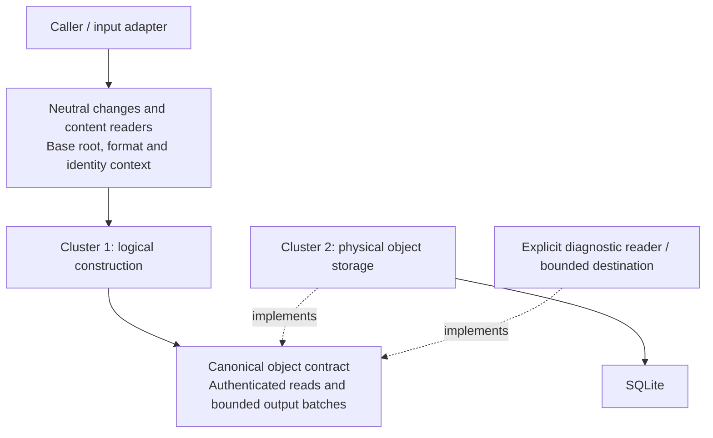

# Logical content and physical storage: co-design review

> **Status:** Proposal; target LayerFS v0.1.7; not a released contract.

The [integrated content-storage design](content-storage-design.md) brings these
boundaries together with packing/compression, transitions, Git comparison and
the required performance gates. Detailed policy/table semantics live in the
[table proposal](content-storage-policy-and-tables.md).

The [generic content I/O contract](content-io.md) and
[v0.1.6 I/O/memory audit](content-io-memory-audit.md) refine the core boundary.
The [finalized-object handoff](finalized-object-handoff.md) records the five
proposed decisions on output fields, finality, allocation ownership, backpressure
and completion; it owns their detailed contract and diagrams.
The [file-content proposal](file-content.md) applies it to complete and known-edit
construction, small/large transitions, immutable COW, reads and delta hints, with
a source-linked cut list and explicit finality/resource proof gates.
The [filesystem-tree proposal](filesystem-tree.md) covers native checked inputs,
sorted COW, direct inline inode values, attributes and compact reference ordering.
Neither cluster inherits a required Workspace model, lifecycle or global plan.
Workspace mode, transport protocols and lifecycle are later work; their existing
code supplies evidence, not required replacement types or deployment assumptions.

Successful published versions are never rolled back. References below to existing
rollback/cleanup concern only failed unpublished admission or an open SQL
transaction; they do not introduce history undo or a version rollback subsystem.

Design issue: [#160](https://github.com/Ephemeral-AI-Lab/layerfs/issues/160).
Read with the [shared proposal](proposal.md),
[cluster 1 review](canonical-content.md) and
[cluster 2 review](object-storage.md).

The [overall architecture](cluster-1-2-components.md) records the agreed seven
responsibility groups and their relationships with ASCII diagrams. Detailed
component proposals are recorded. Concrete APIs/package boundaries and proof gates
remain implementation work; the overview does not claim a completed extraction.

The [current source audit](cluster-1-2-source-audit.md) rechecks production families
at a8a1ba848, adds concrete complexity/copy/round-trip findings and failure-proof
obligations, and demonstrates the proposed boundaries with ASCII diagrams.

Owner scope update: [logical diff, conflicts and conflict resolution](diff-conflict-deferral.md)
are deferred to v0.2.0. Retain ordinary reads, path resolution, local equality/COW
accounting and conditional publication; do not port reconciliation as part of this
co-design. Existing source observations below still describe the reference.

## Decision and evidence level

LayerStack, Branch and logical Commit types, operations and history policy belong
to the external history/workflow layer. Cluster 2's SQL COMMIT ends a database
transaction; it is not a logical Commit operation. Object save/read qualification
must require no history entities. Integration can share the same SQLite database
and necessary transaction without moving history commands or schema ownership
into the object-storage component.

Co-design the two clusters around a canonical-object contract. Cluster 1 owns
logical representation and identity; cluster 2 implements object access and
physical persistence. Workspace, FUSE, daemon and Docker integrate through
explicit inputs and adapters. Telemetry must not create a reverse dependency
on those components.

Three independent read-only reviews covered logical extraction, physical
storage extraction, and measurement/telemetry at source
`8357b1e336d1e16eae349a3313c5f3dbdc777b82`.
The reviewed paths support extraction, but full candidate construction is not
isolated today. This is source-level feasibility evidence. No extraction,
runtime qualification or performance measurement has been performed.

Distinguish three isolation claims:

| Claim | Current assessment |
| --- | --- |
| Content and Store crates do not require FUSE, daemon or Docker | Their manifests already exclude those dependencies; retain this property through extraction. |
| Full candidate construction can run without writes to the canonical Store | Not established: identity reservation and Commit-mode admission currently write through the Store. |
| Full candidate construction can run with no SQLite provider at all | Complete-file final-only output is source-supported; a whole-operation proof still needs neutral inputs, bounded namespace ordering and the multi-edit rewrite. The reference deferred store can use private SQLite. |

Cluster 2 legitimately depends on SQLite and filesystem I/O. Its independence
means that it can accept canonical objects and exercise its real storage path
without a Workspace service, mount, daemon or container. Pure codecs within
cluster 2 can additionally run without a database.

## Owner direction: destructive internal simplification

Existing private modules, wrappers, queues, intermediate forms and control paths
may be deleted, merged or replaced. Their current shape is not an architectural
constraint. Prefer fewer ownership transfers, copies, lookups and round trips
over adding an interface around every existing component. Preserve externally
required semantics, authentication and resource guarantees; their current private
implementation does not need to survive.

Existing-or-better performance is an acceptance condition, not an inferred
benefit of cleaner boundaries. Freeze a source-matched comparator, affected
public operations and primary metrics before measurement. Compare complete
operation latency/throughput alongside CPU where measured, correctly scoped
memory/backing, storage size and actual work counts. Any noise allowance must
be declared in advance; a faster component alone cannot justify a slower public
operation or resource regression. All existing evidence rules still apply.

The review identifies the following candidates; none has been implemented or
measured:

| Candidate deletion/replacement | Expected simplification | Required check |
| --- | --- | --- |
| Consolidate canonical `ObjectRead` with private `ObjectSource`/`CoreReader` plumbing | One semantic read contract, explicit format/allocation inputs | Preserve borrowed/batched authenticated reads and demand order; avoid point-read amplification |
| Remove the generic candidate object store on proven finalized-output paths | Eliminate payload spill, candidate-wide indexes, reachability selection and payload rereads | Preserve finality and canonical partitioning; prove bounded multi-edit boundaries and namespace reference ordering separately |
| Remove `CandidatePurpose` and admission ownership from the logical builder | Destination chosen once by orchestration; canonical result carries no Store token | Preserve production streaming, exact identities and failure finality |
| Decide pack append/new placement before materializing retained tails | Avoid assembling a temporary standalone pack and then a merged pack | Compare assembly/copy/allocation counts, locator correctness and pack occupancy |
| Remove reconstruction of uniqueness for a private batch whose sole constructor already guarantees it | Fewer temporary ID containers and repeated validation of an internal invariant | Prove constructor ownership and duplicate-byte checking; retain authentication and trust-boundary validation |
| Consolidate redundant admission wrappers and repeated Store arguments | One physical admission owner; Workspace identity handled by outer workflow | Preserve writer serialization, race checks, rollback/retention and acknowledgement |
| Trial direct bounded delivery for single-worker construction | Potentially remove a producer thread, channel and handoff buffers | Measure first: removing the queue may lose useful construction/admission overlap and regress latency |
| Unify private receipt collection into operation-owned context and worker-local accumulators | One source for operation summaries; fewer ambient collection paths | Preserve concurrent attribution and existing public receipt fields; measure observer overhead |

The storage changes are anchored in
[retained-tail materialization](../../../../../crates/layerfs-layerstack-store/src/objects/admission.rs#L1268),
[open-pack append](../../../../../crates/layerfs-layerstack-store/src/objects.rs#L2388),
[private MissingBatch construction](../../../../../crates/layerfs-layerstack-store/src/objects.rs#L4057),
[duplicate handling](../../../../../crates/layerfs-layerstack-store/src/objects.rs#L4229)
and [preparation](../../../../../crates/layerfs-layerstack-store/src/objects/admission.rs#L178).
Construction candidates are detailed in the cluster 1 review.

## Shared boundary



This sketches dependencies and contracts, not process placement or a new plugin
runtime. Reuse `ObjectRead`/`ObjectStore` where their existing guarantees fit.
The extraction should separate incidental capabilities before replacing broad
public interfaces; public facades and reexports retain compatibility.

The co-designed input/output contract must cover:

- Neutral file/namespace changes, fixed metadata and content-reader ownership;
  the logical builder does not receive a live Workspace or daemon connection.
- Immutable base roots and authenticated object reads, including bounded batch
  access. Keep unfinished nodes within the algorithm; emitted objects are final.
- Canonical format/profile and namespace identity-allocation context. Reserved
  serials must be identical when byte-identical outputs are compared.
- A bounded stream of canonical objects, their IDs/references and explicitly
  optional predecessor/origin hints. Missing hints can affect physical cost,
  not logical identity or integrity requirements.
- Root/length/count output and failure finality: incomplete output is not a
  publishable candidate. Producers and consumers must agree which emitted
  objects are finalized and how cancellation and cleanup work.
- Ownership, batching and backpressure across all files in an operation. No
  generic payload spill/scratch layer or automatic disk overflow fallback. Keep
  bounded working state; resolve namespace event ordering as a named algorithm
  decision instead of hiding its costs in the caller.

Keep production streaming through this boundary. Choosing a private output
destination must exercise the same algorithm, profiles and ordering as the
production destination. A bounded consuming diagnostic is valid only on proven
final-only paths. Existing algorithms that reread intermediate output require the
boundary rewrite before their temporary store can be removed. Construction root,
storage acknowledgement and external history publication are separate outcomes.

## File cutoff and delta depth

The objective is configurable transparency, not parameter tuning. The
[capacity design](content-storage-policy-and-tables.md#making-the-whole-file-cutoff-genuinely-configurable)
specifies how a larger accepted cutoff reaches construction, codec, packing,
admission and decoding without hidden old-size limits. Non-default qualification
proves configuration works; selecting new optimal defaults is outside scope.

Latest owner direction, 2026-09-16: keep the reference defaults and make the
three policy values configurable. The cutoff defaults to **128 KiB (131,072
bytes)**, whole-file delta depth to **8 links**, and chunk delta depth to **4
links**. This supersedes the proposed 1 MiB default and a single numerical depth
cap for both roles. One shared implementation applies limits selected by role;
shared code does not require equal parameter values. Performance degradation
remains a blocking concern. Larger values such as 1 MiB or 50 links are separate
experimental profiles, not default changes or capabilities already supported.

Illustrative policy inputs, with names and configuration syntax still open:

```text
small_file_threshold_bytes = 131072
whole_file_delta_max_depth = 8
chunk_delta_max_depth = 4
```

Keep the existing byte/work, encoded-read, search and live-memory budgets for
each role/profile. They are supported-format constraints, not extra user knobs
in this first design. Depth counts dependency edges in both roles. The same
decision/reconstruction functions receive the applicable role's limits; avoid
duplicating algorithms merely to apply different limits.

Persist the selected policy with the Store at creation and pass it explicitly to
construction and admission. Opening an existing Store uses its recorded policy;
a conflicting override is an error. Local, remote and container adapters carry
the same values rather than choosing from process-local environment defaults.
Validation checks the selected format's supported capacities and documented
configuration range. Unsupported combinations fail at creation/open; do not
clamp silently or accept a value that the decoder cannot read. Exact supported
ranges and the persistence/schema contract must be specified before implementation.

### Logical representation: cluster 1

```text
raw logical file length
  zero                -> existing empty file-state representation
  0 < bytes < cutoff  -> one whole-file canonical SmallContent object
  bytes >= cutoff     -> CDC chunks + extent mappings
```

The cutoff is exclusive: exactly 128 KiB uses CDC at the default. Compression ratio
does not select the logical representation. Read using the recorded object kind;
never infer its kind from the current cutoff. The policy controls construction,
not an implicit rewrite of existing objects. Canonical role capacity and the
configured construction cutoff must be separate concepts.

The default preserves the reference representation choice. A non-default cutoff
can change file-root IDs by changing representation; exact identity comparisons
require matching policy/profile. Physical FULL/delta selection itself does not
change canonical identity. The [release boundary](../README.md#owner-direction-file-cutoff-and-delta-depth)
requires an explicit supported policy/format and old-Store compatibility contract;
opening an old Store does not silently apply a different creation policy.

### Physical chain: cluster 2

The [reference SmallContent limits](../../../../../crates/layerfs-layerstack-store/src/objects/delta.rs#L6)
are 8 delta links, 512 KiB of canonical bytes across the dependency chain and
256 KiB of encoded bytes. The
[native CDC-chunk path](../../../../../crates/layerfs-layerstack-store/src/objects/admission.rs#L699)
separately limits chains to 4 links and 1 MiB of raw bytes, with additional
encoded/decoded-work bounds. Preserve these defaults and accounting definitions
while consolidating control flow. The two depth fields remain independently
configurable within the supported profile; they are not separate delta engines.

Depth counts base-reference edges, not file versions or snapshots:

```text
role limit D: WHOLE_FILE defaults to 8; CHUNK defaults to 4

FULL(depth 0) -> delta(1) -> ... -> delta(D)
                                    |
                next needs D + 1    |
                                    v
                              FULL(depth 0)
```

This example assumes a linear sequence using the immediate predecessor. Exact
CAS reuse, a different eligible base, insufficient savings or a byte/work bound
can shorten the actual chain. A configured depth is a maximum, not a target length.
Plan a FULL record when no eligible beneficial delta fits the limits. This is
ordinary representation selection; missing/corrupt required bases and unexpected
codec/SQL errors remain errors, never triggers for hidden execution fallback.

Keep independent bounds on decoded work, encoded acquisition and live scratch.
Changing a depth setting must not scale those budgets automatically. The existing
512 KiB canonical-chain cap cannot accommodate even one near-1 MiB object on
that path. A future 1 MiB/50-link experiment would therefore need a separately
specified format/resource contract. Without a tighter byte bound, 50 links of
near-1 MiB versions can require roughly 51 MiB of decoded work for one cold read.
For depth d and object size S, work can approach O((d + 1) * S); it is distinct
from simultaneous resident memory.

Use iterative reconstruction with bounded base/output buffers and separately
bounded encoded input/metadata. Do not retain every decoded version or add one
network request per link. The current reader performs dependent base lookups;
its acquisition/packing plan needs review before increasing depth. Admission can
also pay predecessor reconstruction, so measure both save and read paths.

### Simplified payload storage model

The [policy and database-table proposal](content-storage-policy-and-tables.md)
separates logical WHOLE_FILE/CHUNK roles from physical FULL/DELTA encoding and
specifies proposed queryable descriptors, policy ownership and integrity checks.

```text
CLUSTER 1: canonical content

                  logical file bytes / edits
                             |
                      representation cutoff
                       /                 \
              whole-file payload       CDC payload chunks
                       \                 /     + extent mappings
                        canonical objects
                             |
CLUSTER 2: physical storage   v

                 CAS membership / exact reuse
                    /                    \
             already present          missing object
                reuse ID                   |
                                 bounded base acquisition
                                           |
                                  shared delta policy
                                  /                 \
                             FULL                  DELTA
                                  \                 /
                                 encoded record + optional base
                                           |
                                   packing / SQLite
```

The shared delta policy applies to eligible whole-file and CDC payload objects.
Extent mappings, directories and metadata keep their required role handling;
this decision does not make every object delta eligible, enable cross-role bases,
or unify unrelated metadata encoding. Canonical roles, references and IDs remain
explicit. Cluster 1 does not need to know the physical chain depth.

The reference already shares its
[prefix-capable codec](../../../../../crates/layerfs-layerstack-store/src/objects/pack.rs#L378)
through NativeEncoder::compress and profile-specific validation. Reuse that
capability. Consolidate repeated policy/control flow instead of adding a second
codec abstraction or moving all code into one implementation object.

| Action | Replacement responsibility |
| --- | --- |
| Replace scattered hard-coded policy values | One Store-owned policy with configurable cutoff, whole-file depth and chunk depth; preserve role-specific default bounds |
| Consolidate duplicated eligibility, depth/work accounting and FULL/delta selection | Shared bounded decision functions inside physical encoding |
| Consolidate duplicated dependency traversal where format semantics permit | One iterative traversal/accounting routine with explicit record decoding and authentication |
| Remove repeated base reads/decodes within one admission operation where ownership permits | Reuse the authenticated base and returned chain depth and byte totals under the existing memory budget; no new global cache |
| Remove broad error-to-FULL and error-to-other-format paths | Planned ineligibility selects FULL; unexpected codec/I/O/integrity errors propagate |
| Retain canonical SmallContent/chunk/mapping roles and CDC/COW | Logical representation still serves different construction and range-read needs |
| Retain required record parsers, pack framing and codec capacity checks | Supported formats remain readable and authenticated; this is not authorization to delete old readers |
| Retain bounded search, batched access, rollback and conditional publication | Simplification preserves actual work, ownership and correctness requirements |
| Add an explicit shared policy value and common work accounting | Small ordinary data/functions in physical encoding, with prospective depth/byte checks |
| Add component timing at the consolidated boundaries | Reuse layerfs-telemetry; no new framework, crate, registry or worker |

For each missing eligible payload, use bounded base selection. A candidate base
must be supported and authenticated. Before admitting a delta, require:

- prospective depth <= the configured limit for the payload role;
- chain bytes and decoded work within the selected role/profile's existing bounds;
- encoded acquisition, search and live scratch within their declared bounds;
- a smaller stored representation after framing and base-reference overhead.

Reusing authenticated objects and chain measurements within an operation can avoid redundant reads; it
cannot skip session consistency checks or turn cached preparation into evidence
for a cold read. Missing optional hints can make a delta ineligible. Missing a
required dependency of an existing stored record is an integrity error.

FULL remains valid when a payload fits the supported object/frame capacity but
no delta meets the policy. Required reads validate the actual chain under the
recorded supported profile; they cannot return partial bytes, switch algorithms
on corruption or re-encode data to escape a decoding limit. Do not rewrite stored
objects or add background compaction merely to implement this consolidation.

These are extraction/deletion targets, not completed removals. The seven agreed
components are unchanged. Admission owns effectful base acquisition and session
state; physical encoding operates on supplied bytes and explicit policy; packing
and SQLite keep their existing component boundaries. No detached SQL plan or
one-object-per-transaction requirement is introduced.

### Required implementation and evidence

Separate construction cutoff from SmallContent's supported format capacity;
changing the cutoff must not reinterpret stored records. Likewise, parameterize
admission and decoding consistently within a validated format/profile. A field
in a configuration file does not establish support for arbitrary larger values.
The reference's below-128-KiB raw/frame/workspace assumptions and 256-KiB compact
packs require an explicit format/resource design before supporting a 1 MiB cutoff.
Do not silently route unsupported data through an old format or alternate path.

Qualify cutoff - 1, cutoff and cutoff + 1, depth zero, each role's configured
maximum and the attempted next link, valid overrides and rejected unsupported
combinations. Include incompressible data, small edits, missing/corrupt bases
and independent byte/work limits. Keep reports coarse:

```text
object.create                    object.read
  canonical.construct              storage.lookup
  storage.save                     delta.reconstruct
    base.acquire                   canonical.authenticate
    physical.encode
    pack.build
    persistence
```

Depth, reconstructed-byte totals and selected policy belong to explicit component
evidence alongside timings; they do not expand the time-only telemetry API. Do
not create a recursively nested timer for every delta link. No measurement has been
performed: preserve the performance requirement and qualify the new policy
explicitly rather than attributing its different workload to modularization.

### Performance admission before changing defaults

CDC's chunk-size profile and the physical delta-depth bound are different limits.
CDC selects chunk boundaries (currently 8/16/32 KiB min/target/max); physical
encoding may store each resulting chunk as FULL or as a delta against another
chunk. Unchanged chunks reuse their CAS IDs without adding a delta link. The
4-link bound protects reconstruction of changed chunks, not the number of chunks
in a file or its history length.

Three regressions must be assessed separately:

- Raising the whole-file cutoff increases canonical construction/hash work for
  small edits and the amount decoded/authenticated for small-range reads. A
  near-1 MiB whole-file object may need complete reconstruction to serve 4 KiB.
- Deeper delta chains increase dependent lookups, encoded reads and repeated
  reconstruction/authentication. Tiny stored deltas do not imply tiny decoded
  work. The reference already reconstructs iteratively; iteration alone does
  not remove this time cost. The next write may also reconstruct its base.
- Combining the settings compounds the cost. Bounded live memory does not prove
  bounded latency, and less disk space does not compensate for a failed read,
  Commit or memory gate.

Preserve the reference-policy implementation as the control (128 KiB cutoff,
whole-file depth 8, native-chunk depth 4). Qualify the refactor with identical
default policy first. Evaluate supported overrides separately, one policy change
at a time. A proposed treatment matrix is:

| Treatment | Whole-file cutoff | Whole-file delta cap | Native-chunk delta cap |
| --- | --- | --- | --- |
| Reference-policy control | 128 KiB | 8 | 4 |
| Refactored default | 128 KiB | 8 | 4 |
| Cutoff override | T | 8 | 4 |
| Whole-file depth override | 128 KiB | D_whole | 4 |
| Chunk depth override | 128 KiB | 8 | D_chunk |

T, D_whole and D_chunk must be supported, explicit values selected before the
comparison. Preserve byte/work budgets by default; increasing them needs a
separate declared profile rather than following the depth knob implicitly.
Hold codec, scheduling and format choices fixed where possible, and distinguish
structural changes from policy changes. Combined experiments come after isolated
ones if still justified; 1 MiB and 50 do not receive automatic qualification.

This is a planning matrix, not a registered campaign or permission to run one.
Freeze supported byte/work limits, cache treatment, single-worker policy,
fixtures, identities, per-operation gates and actual eligible chain depths in
the measurement specification first. A configured cap of 50 with observed depth
3 does not qualify depth 50. Cross-policy outputs must preserve logical bytes;
exact canonical identity comparisons require matching canonical profiles.

Include cold small-range/full reads, repeated small edits and Commit, chain-limit
boundaries, incompressible data, lookup/decoded-byte counts, peak live scratch and
storage size. Use the same production paths and declared cache state; a warm-base
cache cannot establish cold-read performance. Keep all failures and apply the
repository's single-sample/evidence rules; no best-of reruns, extra workers or
relaxed budgets to pass.

The defaults remain 128 KiB / 8 / 4. Larger experimental profiles require their
own correctness/resource and performance evidence. If a candidate fails, report
the failed case and address it or revisit the policy before shipping. Do not
silently lower a configured value, remove byte/work checks, or hide regression
in an aggregate score. Existing constants are the starting control, not proof
that every path has already passed the replacement's acceptance gates.

## Blocking couplings found by review

| Coupling | Consequence | Required design move |
| --- | --- | --- |
| `CandidateInputs` owns concrete Workspace/Store reader context | Moving the builder alone retains upstream and database dependencies | Adapt live state into neutral construction input and explicit read/identity/output capabilities |
| Inode serial reservation occurs before construction, including Preview | A private object destination does not establish a write-free operation | Make reservation an explicit orchestration effect; supply its result to a construction-only diagnostic |
| Finalized output pages feed admission while construction runs | A timer around construction includes downstream work/waiting | Keep the shared producer algorithm and inject the bounded consumer; measure actual scopes and waits without claiming additive phases |
| Deferred scratch can create a SQLite index | Canonical-Store-free and entirely-SQLite-free are different claims | Remove generic candidate staging on final-only paths; prove multi-edit and namespace ordering bounds without shifting unlimited state elsewhere |
| `PreparedAdmission` retains its Store/session and publication work | Prepared state is not a detached pack artifact or a pure SQL input | Distinguish pure encoded data from the same-Store admission handle; preserve planned consistency validation and route-specific atomicity, but invalidation fails without refresh/reprepare |
| Existing telemetry uses thread-local scopes and shared-Store counters | Concurrent/worker costs lack complete operation attribution | Propagate explicit correlation across work boundaries and retain the existing scope limitations |
| Physical candidate signatures can be calculated in canonical producers | Module-level timing includes work serving another cluster | Preserve the useful single pass with explicit attribution; do not duplicate scans just to separate labels |

The cluster documents link the exact source locations and extraction details.

## Independently measurable operations

This is a mandatory acceptance boundary, not a future instrumentation option.
The [measurement contract](content-io.md#7-measurement-and-completion) now specifies
C1-only, C2-only, integrated and bounded subcomponent modes, exact timing scope,
failure/completeness behavior and root-cause interpretation. Each real slice must
demonstrate its independent operation before being called complete.

Names below describe proposed scopes, not new public API or benchmark IDs.

| Diagnostic | Input and measured work | Output oracle |
| --- | --- | --- |
| Canonical object construction | Raw payload/metadata; canonical framing and identity computation; declared output handling | Decode equality, canonical bytes and `ObjectId` |
| File/tree candidate construction | Neutral stable changes, fixed identity/format context, explicit base reader, bounded unfinished state/output and any required ordering; all scans/reads/hash/COW work | Same root, objects and logical summaries as the integrated path; caller-owned completion correlation remains external |
| Delta/compression codec | Supplied base/target bytes and policy; actual codec unit | Decode target equality and encoding metadata |
| Physical storage preparation | Canonical batches plus explicit membership/base providers; reuse decisions, dependency reads, encoding and packing | Authenticated reconstruction, valid locators/base closure and bounded output |
| Object save | Real Store plus canonical batches; complete admission including SQL and required checks | Real readback/reopen, exact reuse/insert accounting and failure behavior |
| Prepared-batch persistence | Same-Store valid prepared input; actual remaining packing, checks, inserts and transaction work | Storage and transaction invariants; do not label this SQL-only until the boundary excludes other work |
| Object read | IDs and a declared Store/cache state; lookup, reconstruction, decompression and authentication | Exact canonical bytes and identity |

An object-construction diagnostic can start without Workspace creation. An
object-save diagnostic can start from prepared canonical objects without FUSE or
Docker. Construction with a real Store reader is database-write-free only after
the allocator/admission effects are removed; construction with an explicit local
fixture is a different, declared dependency scope.

Identity reservation, input acquisition and output preparation excluded from a
component diagnostic remain inside the public-operation timing wherever the
operation requires them. Do not turn isolated component numbers into Commit
latency or infer standalone compute by subtracting overlapping phase durations.

## Measurement decision: time-only scopes, separate observation

The [time-only telemetry specification](telemetry.md) supersedes both the broad
telemetry-runtime proposal and the interim decision to defer a shared crate.
Use the implemented parent-to-child scope injection and bounded synchronous
timing tree in std-only `layerfs-telemetry`. It returns the original Result and
caller-owned timing data. Ordinary request/response adapters can attach returned
timing subtrees without environment identities or additional round trips; the
outer caller can save the assembled tree as JSON. These are proposed integration
contracts, subject to protocol compatibility and overhead qualification.
Existing Monitor remains outside both core clusters;
its migration, resource counters, logging and exporters are separate work.

The source review established useful existing machinery:

- [WorkspaceCommitReceipt, telemetry.rs:367](../../../../../crates/layerfs-layerstack-store/src/telemetry.rs#L367)
  already records phase, pipeline, admission, blocked/idle, queue and SQL timings.
  [OutputWriterMetrics, objects.rs:262](../../../../../crates/layerfs-layerstack-store/src/objects.rs#L262)
  returns worker-local hash/copy/spill/work counts.
- [Content timing, changes.rs:680](../../../../../crates/layerfs-workspace/src/changes.rs#L680)
  encloses construction with a consumer that
  [admits pages, objects.rs:4507](../../../../../crates/layerfs-layerstack-store/src/objects.rs#L4507).
  Extraction is necessary before that scope can establish isolated compute.
- [SDK observation, client.rs:509](../../../../../crates/layerfs-sdk/src/client.rs#L509)
  owns the OperationId. Associate explicitly returned component/worker results
  there; replace redundant
  [thread-local collection](../../../../../crates/layerfs-layerstack-store/src/telemetry.rs#L561)
  as callers migrate.
- [Store counters](../../../../../crates/layerfs-layerstack-store/src/telemetry.rs#L5)
  describe shared intervals. Keep this distinction rather than claiming exclusive
  operation attribution from before/after subtraction under concurrency.

Each component owns any broader metric types, with failure-path results preserved.
The new shared timing scopes carry only time and parent/child structure. Neither
core cluster imports Monitor. Independent diagnostics use the production entry
point, explicit inputs/providers, optional injected timing and an output oracle.

Preserve inclusive/wait/CPU distinctions. Overlapping worker and admission time
cannot be subtracted to manufacture isolated compute. For a single-object save,
include the real acknowledgement; batch time per object is an average and an
insertion timer is not a durability guarantee.

The synchronous timing tree records nested invocation structure and ordinary
errors. Independent workers can already return completed reports for attachment;
live cross-thread scope sharing and async spans remain outside v1, along with live
logs and synthetic viewer examples. If general async/distributed tracing becomes necessary,
prefer an established implementation over expanding the small recorder into a
general framework. Do not alter production scheduling to fit the v1 API.

## Remaining co-design decisions

The high-level responsibilities, 128 KiB/8/4 defaults, configurable-transparency
goal, whole/chunk and FULL/DELTA distinction, compression/packing roles, retained
edit/transition algorithms, timer mechanism and exclusion of history entities are
settled. The latest I/O direction is final-only object output with whole-operation
memory bounds, no generic payload spill/scratch layer, and host/daemon/remote-DB
placement through explicit boundaries. This is not a proof of zero temporary
storage for every operation or a measured speedup. The five handoff questions now
have proposal-level answers. Filesystem ordering now has an explicit bounded
record-reducer direction; its backing/layout still needs qualification. The
[physical encoding/packing proposal](physical-encoding-and-packing.md) now selects
placement-first compatible append, bounded ordered-set value indexing and explicit
candidate policy. These choices still need resource/equivalence proof. All operations
are single-attempt; a condition needing retry returns failure, including SQL/SDK
retries or stale-proof refresh. Exact APIs and implementation/qualification proofs
remain open. The [save/persistence proposal](admission-and-persistence.md) completes
the seven component descriptions. The list below now tracks implementation and
qualification in dependency order, not another series of component-design phases:

| Order | Discussion | Concrete decision/output needed | Owner |
| --- | --- | --- | --- |
| 1 | [Finalized-object handoff](finalized-object-handoff.md) between canonical objects/admission (components 1/4) | Implementable signatures/layout for the proposed object fields and completion guarantees; bounded reference ownership and authenticated reads; reconcile producer/singleton capacities and preserve useful overlap and final transaction composition | Both |
| 2 | [File content](file-content.md) (component 2) | Proposed current-result normalized edits and replayable replacements; prove decoded-boundary finality/memory, exact partition/root equivalence, no-op/caller compatibility, transitions and read/hint cost reductions | Cluster 1 with C2 hint/read support |
| 3 | [Filesystem tree and metadata](filesystem-tree.md) (component 3) | Native checked input integration, sorted/direct-value construction, compact reference ordering and attributes; qualify semantic-only record layout/backing, finality, identity/topology/format checks and actual resource cuts | Cluster 1 with cluster 2 metadata support |
| 4 | [Physical encoding + packing](physical-encoding-and-packing.md) (components 5/6) | Proposal recorded: shared codec with checked role/profile policy, batched base acquisitions, compatible append after exact placement, one-body metadata digest and bounded BTreeSet index; qualify capacities/format compatibility, singleton allocation, same reuse/density and no-retry failures | Cluster 2 with cluster 1 canonical profile input |
| 5 | [Object save + SQLite persistence](admission-and-persistence.md) (components 4/7) | Proposal recorded: one mutation owner, four tables/19 columns, location/base indexes, bounded transactions, reverse-location cleanup once and explicit unknown outcomes; qualify concrete DDL/profile codes, receipt compatibility and selected remote capabilities | Cluster 2; history publication stays outside |
| 6 | Independent measurement and first extraction | Production entry points, coarse timer scopes, legitimate v0.1.6 comparator, many-file/slow-consumer memory and matched speed gates; first complete-file construct -> real save -> readback slice, then module layout and retirement gates | Both plus outer harness |

These decisions should produce small explicit data/functions and ownership rules,
not a plugin registry, a generic workflow engine or a predetermined crate per
component. Only layerfs-telemetry is already an agreed implemented crate.
Admission must satisfy the [save-coordination performance constraints](object-storage.md#save-coordination-must-not-become-another-expensive-pass):
batch lookups, carry checked object fields, reuse valid proofs and add no coordination-only
payload copies, full-graph pass or per-object transaction. Preserve integrity and
qualify complete successful operations; modularization is not a speed guarantee.

### C1 proposals and next component discussion

Apply the handoff contract to one concrete file operation:

```text
stable file input / explicit canonical fields
                  |
             cluster 1
       canonical bytes + ID + role + references
                  |
          final-only bounded output contract
                  |
             cluster 2
       stored representation + acknowledgement
                  |
       authenticated readback of identical canonical bytes
```

The file proposal now specifies complete/known-edit modes, current-result edit
coordinates, replayable replacement ranges, small/large transitions and the owned
unfinished-node direction. Preserve exact split/concat partitions and necessary
changed-range equality; overlay removal still requires proof. Start implementation
qualification with the existing complete-file finalized writer and extend to edits.
The handoff's finality/backpressure/completion rules cover repeated IDs, last packs
and late source failure. Budgets span all files, with no whole-workload result map
or transaction per file. The filesystem-tree proposal now covers incremental
checked bindings, direct compact inode values, sorted tree finality and reference
ordering with explicit compact records. C1 implementation/equivalence proofs are
still open. Both C2 proposals and the [fuller implementation review](implementation-plan.md)
are documented. Next implement the complete-file -> standalone save -> readback
slice. Final SQL codes/capacities, receipt units and backend capabilities are
explicit implementation/compatibility gates; no new component is needed.
Root construction and physical
save results must not require LayerStackId, BranchId, CommitId, a live Workspace
or runtime connection. Optional provenance hints cannot change canonical meaning.

### Later work outside this co-design

LayerStack/Branch creation, logical Commit history, expected-head rules, Add,
publication/completion policy and workflow staging belong to the history/workflow
discussion. Live Workspace snapshots/backing and FUSE/daemon/container transport
also remain separate owners. This co-design settles only the input, resource and
transaction integration those owners need. It does not reopen deferred public
diff/conflict/resolution or add version rollback. Successful versions are immutable.

## Extraction and proof gates

1. Freeze neutral input, canonical-object and resource-ownership contracts,
   including format/serial allocation and output finality. Record allowed imports.
2. Separate construction input adaptation and reservation from the reusable
   algorithm; inject read/output providers using the shared producer path, keeping
   unfinished boundaries local. Resolve ordered namespace reference effects.
3. Separate pure codecs/pack data from membership/base selection and effectful
   Store admission. Preserve both existing publication routes' atomicity,
   rollback/retention and race handling.
4. Return operation-owned component/worker measurements and reuse existing
   receipt fields at the new boundaries, including failure/cancellation paths.
5. Prove standalone object/candidate construction with a declared provider set,
   and standalone real Store save/read without Workspace/FUSE/daemon/Docker.
   Assert no canonical Store writes in construction-only mode. Prove the stronger
   no-SQL-provider mode separately, including ordering and multi-file capacity limits.
6. Match standalone and integrated output identities under the same namespace,
   metadata, format/profile and construction ordering. Exercise reuse, missing or
   corrupt bases, admission failure, head races and lost completion acknowledgement.
   Assert zero retries/replays after failure, including SQL/SDK internals; unknown
   outcomes remain explicit until a separately requested authoritative inspection.
7. Check bounded memory/backing, unchanged worker policy, local metric attribution
   under concurrent operations, counter overflow and instrumentation overhead.
   Run local preflight and required qualified public cases before implementation
   admission; the current review executes neither builds nor benchmarks.

The [shared proposal](proposal.md#compatibility-and-verification) remains the
authority for compatibility and measurement constraints. API names, crate moves,
observer placement, multi-edit finality, namespace event ordering and remote SQL
batch semantics remain design decisions to settle before implementation.
