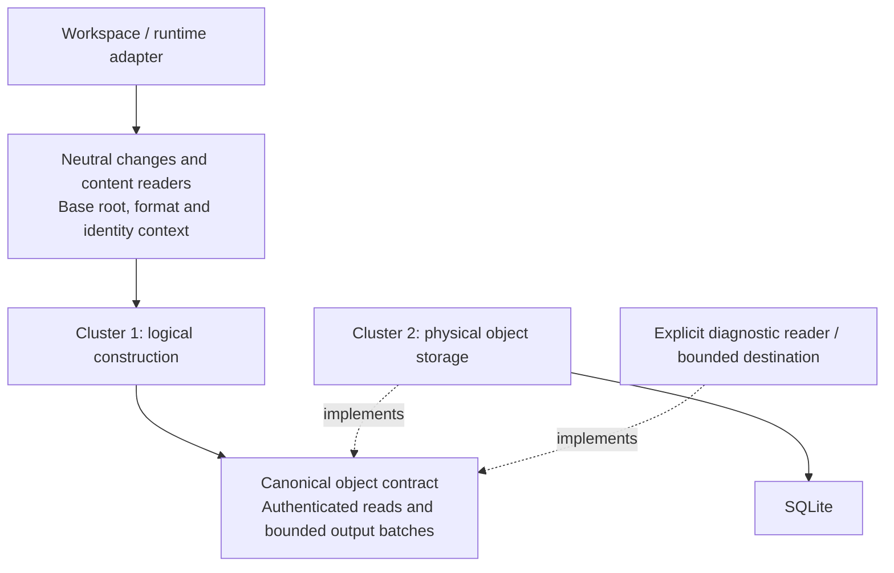

# Logical content and physical storage: co-design review

> **Status:** Proposal; target LayerFS v0.1.7; not a released contract.

Design issue: [#160](https://github.com/Ephemeral-AI-Lab/layerfs/issues/160).
Read with the [shared proposal](proposal.md),
[cluster 1 review](canonical-content.md) and
[cluster 2 review](object-storage.md).

## Decision and evidence level

Co-design the two clusters around a canonical-object contract. Cluster 1 owns
logical representation and identity; cluster 2 implements object access and
physical persistence. Workspace, FUSE, daemon and Docker integrate through
explicit inputs and adapters. Telemetry must not create a reverse dependency
on those components.

Three independent read-only reviews covered logical extraction, physical
storage extraction, and measurement/telemetry at source
`8357b1e336d1e16eae349a3313c5f3dbdc777b82`.
The reviewed paths support extraction, but full candidate construction is not
isolated today. This is source-level feasibility evidence. No extraction,
runtime qualification or performance measurement has been performed.

Distinguish three isolation claims:

| Claim | Current assessment |
| --- | --- |
| Content and Store crates do not require FUSE, daemon or Docker | Their manifests already exclude those dependencies; retain this property through extraction. |
| Full candidate construction can run without writes to the canonical Store | Not established: identity reservation and Commit-mode admission currently write through the Store. |
| Full candidate construction can run with no SQLite provider at all | Stronger, unproved: readers/allocation must be supplied and current deferred scratch can use a private SQLite index. |

Cluster 2 legitimately depends on SQLite and filesystem I/O. Its independence
means that it can accept canonical objects and exercise its real storage path
without a Workspace service, mount, daemon or container. Pure codecs within
cluster 2 can additionally run without a database.

## Owner direction: destructive internal simplification

Existing private modules, wrappers, queues, intermediate forms and control paths
may be deleted, merged or replaced. Their current shape is not an architectural
constraint. Prefer fewer ownership transfers, copies, lookups and round trips
over adding an interface around every existing component. Preserve externally
required semantics, authentication and resource guarantees; their current private
implementation does not need to survive.

Existing-or-better performance is an acceptance condition, not an inferred
benefit of cleaner boundaries. Freeze a source-matched comparator, affected
public operations and primary metrics before measurement. Compare complete
operation latency/throughput alongside CPU where measured, correctly scoped
memory/backing, storage size and actual work counts. Any noise allowance must
be declared in advance; a faster component alone cannot justify a slower public
operation or resource regression. All existing evidence rules still apply.

The review identifies the following candidates; none has been implemented or
measured:

| Candidate deletion/replacement | Expected simplification | Required check |
| --- | --- | --- |
| Consolidate canonical `ObjectRead` with private `ObjectSource`/`CoreReader` plumbing | One semantic read contract, explicit format/allocation inputs | Preserve borrowed/batched authenticated reads and demand order; avoid point-read amplification |
| Remove `CandidatePurpose` and admission ownership from the logical builder | Destination chosen once by orchestration; canonical result carries no Store token | Preserve production streaming, exact identities and failure finality |
| Decide pack append/new placement before materializing retained tails | Avoid assembling a temporary standalone pack and then a merged pack | Compare assembly/copy/allocation counts, locator correctness and pack occupancy |
| Remove reconstruction of uniqueness for a private batch whose sole constructor already guarantees it | Fewer temporary ID containers and repeated validation of an internal invariant | Prove constructor ownership and duplicate-byte checking; retain authentication and trust-boundary validation |
| Consolidate redundant admission wrappers and repeated Store arguments | One physical admission owner; Workspace identity handled by outer workflow | Preserve writer serialization, race checks, rollback/retention and acknowledgement |
| Trial direct bounded delivery for single-worker construction | Potentially remove a producer thread, channel and handoff buffers | Measure first: removing the queue may lose useful construction/admission overlap and regress latency |
| Unify private receipt collection into operation-owned context and worker-local accumulators | One source for operation summaries; fewer ambient collection paths | Preserve concurrent attribution and existing public receipt fields; measure observer overhead |

The storage changes are anchored in
[retained-tail materialization](../../../../../crates/layerfs-layerstack-store/src/objects/admission.rs#L1268),
[open-pack append](../../../../../crates/layerfs-layerstack-store/src/objects.rs#L2388),
[private MissingBatch construction](../../../../../crates/layerfs-layerstack-store/src/objects.rs#L4057),
[duplicate handling](../../../../../crates/layerfs-layerstack-store/src/objects.rs#L4229)
and [preparation](../../../../../crates/layerfs-layerstack-store/src/objects/admission.rs#L178).
Construction candidates are detailed in the cluster 1 review.

## Shared boundary

This sketches dependencies and contracts, not process placement or a new plugin
runtime. Reuse `ObjectRead`/`ObjectStore` where their existing guarantees fit.
The extraction should separate incidental capabilities before replacing broad
public interfaces; public facades and reexports retain compatibility.

The co-designed input/output contract must cover:

- Neutral file/namespace changes, fixed metadata and content-reader ownership;
  the logical builder does not receive a live Workspace or daemon connection.
- Immutable base roots and authenticated object reads, including bounded batch
  access and required read-your-writes scratch.
- Canonical format/profile and namespace identity-allocation context. Reserved
  serials must be identical when byte-identical outputs are compared.
- A bounded stream of canonical objects, their IDs/references and explicitly
  optional predecessor/origin hints. Missing hints can affect physical cost,
  not logical identity or integrity requirements.
- Root/checkpoint output and failure finality: incomplete output is not a
  publishable candidate. Producers and consumers must agree which emitted
  objects are finalized and how cancellation and cleanup work.
- Ownership, batching and backpressure. Construction can retain necessary
  scratch but cannot require a full candidate in memory or add unbounded spooling.

Keep production streaming through this boundary. Choosing a private output
destination must exercise the same algorithm, profiles and ordering as the
production destination. A no-op sink is insufficient when construction later
reads its own newly produced objects.

## Blocking couplings found by review

| Coupling | Consequence | Required design move |
| --- | --- | --- |
| `CandidateInputs` owns concrete Workspace/Store reader context | Moving the builder alone retains upstream and database dependencies | Adapt live state into neutral construction input and explicit read/identity/scratch capabilities |
| Inode serial reservation occurs before construction, including Preview | A private object destination does not establish a write-free operation | Make reservation an explicit orchestration effect; supply its result to a construction-only diagnostic |
| Finalized output pages feed admission while construction runs | A timer around construction includes downstream work/waiting | Keep the shared producer algorithm and inject the bounded consumer; measure actual scopes and waits without claiming additive phases |
| Deferred scratch can create a SQLite index | Canonical-Store-free and entirely-SQLite-free are different claims | Make scratch ownership/provider explicit and prove whichever scope is claimed |
| `PreparedAdmission` retains its Store/session and publication work | Prepared state is not a detached pack artifact or a pure SQL input | Distinguish pure encoded data from the same-Store admission handle; preserve consistency rechecks and route-specific transactions |
| Existing telemetry uses thread-local scopes and shared-Store counters | Concurrent/worker costs lack complete operation attribution | Propagate explicit correlation across work boundaries and retain the existing scope limitations |
| Physical candidate signatures can be calculated in canonical producers | Module-level timing includes work serving another cluster | Preserve the useful single pass with explicit attribution; do not duplicate scans just to separate labels |

The cluster documents link the exact source locations and extraction details.

## Independently measurable operations

Names below describe proposed scopes, not new public API or benchmark IDs.

| Diagnostic | Input and measured work | Output oracle |
| --- | --- | --- |
| Canonical object construction | Raw payload/metadata; canonical framing and identity computation; declared output handling | Decode equality, canonical bytes and `ObjectId` |
| File/tree candidate construction | Neutral frozen changes, fixed identity/format context, explicit base reader and bounded scratch/destination; all required scans/reads/hash/COW work | Same root, objects and checkpoint semantics as the integrated path under matching context |
| Delta/compression codec | Supplied base/target bytes and policy; actual codec unit | Decode target equality and encoding metadata |
| Physical storage preparation | Canonical batches plus explicit membership/base providers; reuse decisions, dependency reads, encoding and packing | Authenticated reconstruction, valid locators/base closure and bounded output |
| Object save | Real Store plus canonical batches; complete admission including SQL and required checks | Real readback/reopen, exact reuse/insert accounting and failure behavior |
| Prepared-batch persistence | Same-Store valid prepared input; actual remaining packing, checks, inserts and transaction work | Storage and transaction invariants; do not label this SQL-only until the boundary excludes other work |
| Object read | IDs and a declared Store/cache state; lookup, reconstruction, decompression and authentication | Exact canonical bytes and identity |

An object-construction diagnostic can start without Workspace creation. An
object-save diagnostic can start from prepared canonical objects without FUSE or
Docker. Construction with a real Store reader is database-write-free only after
the allocator/admission effects are removed; construction with an explicit local
fixture is a different, declared dependency scope.

Identity reservation, input acquisition and output preparation excluded from a
component diagnostic remain inside the public-operation timing wherever the
operation requires them. Do not turn isolated component numbers into Commit
latency or infer standalone compute by subtracting overlapping phase durations.

## Measurement decision: time-only scopes, separate observation

The [time-only telemetry specification](telemetry.md) supersedes both the broad
telemetry-runtime proposal and the interim decision to defer a shared crate.
Implement the agreed parent-to-child scope injection and bounded synchronous
timing tree in a std-only `layerfs-telemetry`. It returns the original Result and
caller-owned timing data. Ordinary request/response adapters can attach returned
timing subtrees without environment identities or additional round trips; the
outer caller can save the assembled tree as JSON. These are proposed integration
contracts, subject to protocol compatibility and overhead qualification.
Existing Monitor remains outside both core clusters;
its migration, resource counters, logging and exporters are separate work.

The source review established useful existing machinery:

- [WorkspaceCommitReceipt, telemetry.rs:367](../../../../../crates/layerfs-layerstack-store/src/telemetry.rs#L367)
  already records phase, pipeline, admission, blocked/idle, queue and SQL timings.
  [OutputWriterMetrics, objects.rs:262](../../../../../crates/layerfs-layerstack-store/src/objects.rs#L262)
  returns worker-local hash/copy/spill/work counts.
- [Content timing, changes.rs:680](../../../../../crates/layerfs-workspace/src/changes.rs#L680)
  encloses construction with a consumer that
  [admits pages, objects.rs:4507](../../../../../crates/layerfs-layerstack-store/src/objects.rs#L4507).
  Extraction is necessary before that scope can establish isolated compute.
- [SDK observation, client.rs:509](../../../../../crates/layerfs-sdk/src/client.rs#L509)
  owns the OperationId. Associate explicitly returned component/worker results
  there; replace redundant
  [thread-local collection](../../../../../crates/layerfs-layerstack-store/src/telemetry.rs#L561)
  as callers migrate.
- [Store counters](../../../../../crates/layerfs-layerstack-store/src/telemetry.rs#L5)
  describe shared intervals. Keep this distinction rather than claiming exclusive
  operation attribution from before/after subtraction under concurrency.

Each component owns any broader metric types, with failure-path results preserved.
The new shared timing scopes carry only time and parent/child structure. Neither
core cluster imports Monitor. Independent diagnostics use the production entry
point, explicit inputs/providers, optional injected timing and an output oracle.

Preserve inclusive/wait/CPU distinctions. Overlapping worker and admission time
cannot be subtracted to manufacture isolated compute. For a single-object save,
include the real acknowledgement; batch time per object is an average and an
insertion timer is not a durability guarantee.

The synchronous timing tree records nested invocation structure and ordinary
errors. Cross-thread/async causality, live logs and the synthetic viewer examples
remain outside v1. If general async or distributed tracing becomes necessary,
prefer an established implementation over expanding the small recorder into a
general framework. Do not alter production scheduling to fit the v1 API.

## Extraction and proof gates

1. Freeze neutral input, canonical-object and resource-ownership contracts,
   including format/serial allocation and output finality. Record allowed imports.
2. Separate construction input adaptation and reservation from the reusable
   algorithm; inject read/scratch/output providers using the shared producer path.
3. Separate pure codecs/pack data from membership/base selection and effectful
   Store admission. Preserve both existing publication routes' atomicity,
   rollback/retention and race handling.
4. Return operation-owned component/worker measurements and reuse existing
   receipt fields at the new boundaries, including failure/cancellation paths.
5. Prove standalone object/candidate construction with a declared provider set,
   and standalone real Store save/read without Workspace/FUSE/daemon/Docker.
   Assert no canonical Store writes in construction-only mode. Prove the stronger
   no-SQL-provider mode separately, including scratch behavior and capacity limits.
6. Match standalone and integrated output identities under the same namespace,
   metadata, format/profile and construction ordering. Exercise reuse, missing or
   corrupt bases, admission failure, head races and completion retry as applicable.
7. Check bounded memory/backing, unchanged worker policy, local metric attribution
   under concurrent operations, counter overflow and instrumentation overhead.
   Run local preflight and required qualified public cases before implementation
   admission; the current review executes neither builds nor benchmarks.

The [shared proposal](proposal.md#compatibility-and-verification) remains the
authority for compatibility and measurement constraints. API names, crate moves,
observer placement and an entirely SQLite-free large-candidate scratch provider
remain design decisions to settle before implementation.
