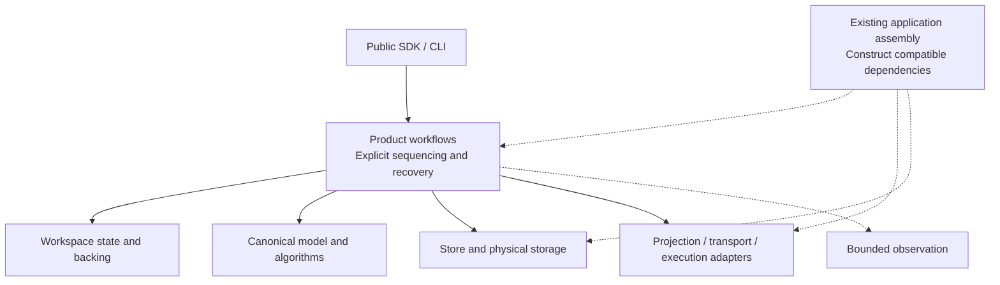
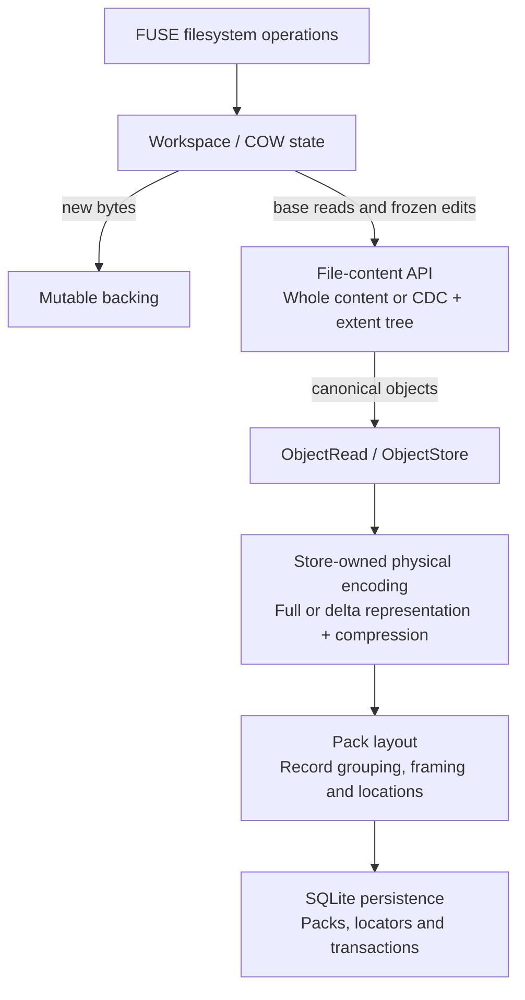

# Lightweight decoupling and plugin design

> **Status:** Proposal; target LayerFS v0.1.7; not a released contract.

See the [discussion index](README.md) for the proposed cluster grouping and
per-cluster document structure. This file owns the shared design and measurement
principles; cluster-specific decisions are developed in their own documents.
The [clusters 1 and 2 co-design review](content-storage-co-design.md) records
source-backed extraction obstacles, measurement ownership and required proofs.
The [time-only telemetry specification](telemetry.md) defines the agreed small
crate for injected parent/child timing scopes. It has no Monitor dependency;
existing receipts, broader counters, logging and exporters are separate concerns.

Design issue: [#160](https://github.com/Ephemeral-AI-Lab/layerfs/issues/160).
Parent: [v0.1.7 architecture refactor migration, #155](https://github.com/Ephemeral-AI-Lab/layerfs/issues/155).
Related: [architecture exploration, #156](https://github.com/Ephemeral-AI-Lab/layerfs/issues/156)
and the [source-linked architecture overview](../architecture-overview.md).

## Goal and owner direction

v0.1.7 is a full internal architecture refactor. Apply lightweight component
boundaries across LayerFS so a change to one implementation has a small,
explainable effect on its consumers. Central workflows, data structures and
algorithms are in scope alongside adapters and integrations.

Owner direction, 2026-09-16: borrow Cordis's explicit dependencies, capability
contracts and resource ownership, using a lighter mechanism appropriate to
LayerFS. The CAS/delta/CDC/COW/FUSE discussion is one worked example of this
larger design task. It does not define the complete component inventory or
restrict the refactor to storage and projection.

Projection scope clarification: v0.1.7 focuses on FUSE. APFS-specific projection
and clonefile acceleration are out of scope. Existing host materialization is
a separate compatibility concern; this decision does not remove that public
route or exclude ordinary macOS host storage.

The design principle is:

> Couple components through the data and guarantees their consumers need.
> Keep implementation choices, mutable state and resource ownership local.

Owner direction permits destructive internal refactoring and aggressive
simplification: delete or replace private abstractions, duplicate paths and
redundant round trips when a simpler design preserves required behavior.
Existing-or-better performance against a declared comparator must be demonstrated
for affected public operations and resource metrics. Internal compatibility or
small diff size is not a goal; public/format contracts and evidence rules remain
the constraints described below.

This proposal defines the design work and its acceptance criteria. Exact
interfaces, crate moves and implementation slices follow a source-linked
inventory; the diagrams below do not freeze them.
The [Stages 0–2 handoff](stages-0-2-handoff.md) now selects layerfs-content and
layerfs-storage alongside implemented layerfs-telemetry. Later package choices
remain open; current source crates and candidate clusters do not imply a one-to-one
replacement package inventory.

Owner scope update: public logical diff, conflict handling and conflict resolution
are [deferred to v0.2.0](diff-conflict-deferral.md). The release plan records the
limited SDK/CLI parity exception. Ordinary path resolution, equality/reuse, physical
delta, reference accounting and stale-head publication protection remain required.

## Meaning of plugin

A plugin here is an implementation selected at a deliberate capability
boundary. The default mechanism is ordinary Rust modules, concrete types,
functions, and existing traits. A closed set of implementations can use an
enum; a trait is appropriate when actual providers or consumers need a shared
contract. Constructors or the existing application assembly select providers.

Components with one implementation can remain concrete. Pure algorithms can
remain functions. A component boundary does not automatically require a new
crate, an interface, configuration, or runtime allocation.

The design does not introduce a general plugin registry, shared service
locator, event bus, dynamic library ABI, hot reload, or a third-party plugin
ecosystem. Each would need a concrete requirement and a separate design.
Selection at construction time is sufficient for the current proposal.

Cordis contributes the principle that composition includes dependencies and
cleanup. Its general runtime machinery is not a prerequisite for this work.
See the [Cordis primer](https://deepseek-harness.github.io/deepseek-harness/en/reference/cordis-primer),
[DeepSeek Harness architecture](https://deepseek-harness.github.io/deepseek-harness/en/reference/),
and [composability paper](https://arxiv.org/abs/2608.25512).

## Scope: evaluate the whole product

The inventory must cover these responsibilities, including their shared paths
and alternate entry points. These are design areas, not prescribed crates.

| Area | Boundary to investigate | Information that legitimately crosses it |
| --- | --- | --- |
| Canonical model and algorithms | Identity, encoding, trees, file representation, CDC, structural COW, ordinary reads and local equality | Typed roots, canonical objects, ranges, changes and deterministic results |
| Store and physical storage | Object access, authentication, deduplication, delta/compression, packing, admission and transactions | Object IDs, authenticated bytes, bounded batches, admission outcomes and optional provenance hints |
| Workspace state and backing | Mutable namespace, edits, piece state, backing bytes, frozen input and checkpoints | Filesystem operations, stable snapshots, byte ranges and lifetime-bearing handles |
| Product workflows and publication | Init, fork, capture, construction, conditional Commit, Add and End | Explicit operation inputs, expected head/base, outcomes, failure and authoritative outcome state |
| Projection and transport | FUSE, materialization, live protocol, host/sandbox communication | Filesystem semantics, bounded messages, authentication, acknowledgements and cleanup |
| Execution and runtime ownership | Host/container execution, daemon ownership, process cancellation and output | Compatible execution bindings, commands, process handles and bounded output |
| SDK, CLI and observation | Public compatibility, operation receipts, diagnostics and accounting | Public requests/results and bounded observations of the actual operation |

For every area, record its disposition: retain an existing boundary, simplify
it, extract a responsibility, or defer a specifically incompatible change.
Full coverage does not mean rewriting every module or splitting every algorithm.

### A lightweight composition model

This is a responsibility sketch, not a complete dependency graph or a new
framework. Solid arrows show uses; dotted arrows show assembly or observation.
The inventory must supply the actual module/crate dependency graph, including
dependencies expressed through neutral contracts.

## Boundary rules

1. **Reuse the current seam first.** Trace all callers before proposing an
   interface. Prefer a module/function extraction or a narrower existing API.
   Add a crate when its dependency restriction or reuse justifies that boundary.
2. **Expose semantic inputs and outputs.** Pass roots, ranges, operations and
   results. Keep SQL rows, pack offsets, codec state and runtime-specific handles
   private unless the consumer actually owns that concern.
3. **Make mutable ownership explicit.** Name the owner of each buffer, backing
   range, cache, snapshot, mount, task and transaction. State how references
   remain valid, how cancellation works, and who finishes cleanup.
4. **Keep workflows readable.** Capture, construction, admission, conditional
   publication and completion remain explicit calls with visible ordering.
   Observers do not acquire publication authority through callbacks.
5. **Preserve efficient cooperation.** Keep bounded batch and streaming access,
   stable range references and useful predecessor/origin hints. A missing
   optional optimization hint must preserve semantic output and authentication.
   Avoid generic interfaces that force whole-file copies or per-object round trips.
6. **Bind compatible implementations together.** Projection and execution must
   refer to the same execution environment. Keep a live Workspace's binding
   stable; retain dependencies until their users and cleanup have finished.
7. **Keep policy at its decision point.** File representation, physical encoding,
   operation ordering and deployment selection have separate owners. Format
   choices that affect canonical identity remain versioned compatibility rules.
8. **State cleanup limits.** Explicit shutdown reports failure; destructor cleanup
   is not a success guarantee. Cleanup cannot undo an already published Commit.
   Lost acknowledgement fails with unknown persistence outcome; it never authorizes
   replay or deletion. A separate requested inspection can determine that outcome.
9. **One attempt.** A condition requiring retry is failure. No automatic codec,
   SQL, transaction, lock, transport or SDK retries; no stale-state reprepare loop.
   Normal representation selection and pre-attempt backpressure remain ordinary
   work. See the [C2 single-attempt contract](physical-encoding-and-packing.md#one-attempt-no-retries).

For each proposed boundary, keep a short record with: responsibility; current
providers/callers and source links; inputs/outputs; owned state and lifetimes;
single-attempt failure/outcome/cleanup; resource limits; and allowed/forbidden dependencies.
Record intended coupling as well as coupling to remove.

## Existing seams and concrete investigation points

Source observations were checked at
`8357b1e336d1e16eae349a3313c5f3dbdc777b82`; recheck them when implementing.

- [Object access](../../../../../crates/layerfs-content/src/object/access.rs)
  already defines `ObjectRead` and `ObjectStore`, authenticated access and
  batches. Review the format flags and producer hints against actual callers
  before deciding whether any responsibility should move.
- [File content](../../../../../crates/layerfs-content/src/file/content.rs)
  already provides `FileContentRoot` and range reads across representations.
- [Workspace core](../../../../../crates/layerfs-workspace-core/src/lib.rs)
  already separates portable state and frozen changes from platform I/O.
- [Filesystem ports](../../../../../crates/layerfs-fuse/src/port.rs) and
  [materialization ports](../../../../../crates/layerfs-materialization/src/port.rs)
  are existing adapter boundaries to reuse.
- [Workspace registry](../../../../../crates/layerfs-workspace/src/registry.rs)
  combines session ownership, Store access, execution routes and daemon assembly.
  [Projection setup](../../../../../crates/layerfs-workspace/src/projection.rs)
  selects concrete runtime routes. Investigate which choices can move to assembly.
- [Snapshot acquisition](../../../../../crates/layerfs-workspace/src/snapshot_input.rs)
  uses wire and transport machinery from `layerfs-fuse`. Review generic live
  runtime responsibilities separately from kernel callback responsibilities.
- [Remote Commit](../../../../../crates/layerfs-workspace/src/remote_commit.rs)
  retains publication/completion recovery state. Any extraction must preserve
  that state machine across all callers.

## Worked example: CAS, delta, CDC, COW and FUSE

Here CAS means content-addressed storage. Conditional publication also uses
compare-and-swap, which is a separate concern despite sharing the abbreviation.

File representation decides whether a file uses a whole-content object or a
chunk mapping. Physical encoding decides how each canonical object is stored.
CDC and delta therefore operate at different stages: chunk objects can also
use delta encoding. A small object is not necessarily a small file.

Within physical storage, delta encoding exploits similarity to another object;
compression reduces the encoded byte size; packing groups records and supplies
framing and locations for bounded access; SQLite persists packs, object locators
and executes storage transactions. LayerStack/Branch/logical Commit entities,
history records and their SQL commands belong to the external history/workflow
owner. It may share the same SQLite transaction facility where atomicity requires
it. These are separate responsibilities even
when the implementation combines them. In particular, a codec can compress with
a predecessor as its prefix, so delta and compression need not be separate passes.

The [ordered cluster 1/2 decision list](content-storage-co-design.md#remaining-co-design-decisions)
tracks the remaining API, ownership, format, session and measurement contracts.
Do not infer that history belongs to cluster 2 from the reference crate name.

The file-content implementation owns persistent structural COW and cooperates
with CDC to reuse unchanged mappings and construct replacements. Live Workspace
COW owns private edits and their backing. Reads follow stored mappings; reading
a chunked file does not require rerunning CDC.

The object identity is derived from canonical bytes. Full and delta encodings
must reconstruct those same bytes and pass the same identity checks. Changing
chunk boundaries or canonical representation can change identity; that is not
an interchangeable physical-storage optimization.

The lightweight seams are filesystem operations, file roots/ranges, and
canonical object access. Delta remains Store-private. An optional predecessor
hint can preserve efficient encoding without exposing pack internals upstream.
This example exercises the boundary rules; every other area needs its own analysis.

## Independent component measurement

Owner requirement: each selected component must be executable and measurable
at its own boundary, with declared inputs and observable outputs. A full
Workspace/file/Commit workflow must not be the only way to exercise CDC,
construction, encoding, packing or database persistence. Apply this requirement
to the whole component inventory, including the reverse read/decode path,
transport, FUSE and execution.

### Separate computation from its effectful dependencies

The current construction route illustrates the problem:
`LayerStackStore::construct_workspace_files` in
[objects.rs](../../../../../crates/layerfs-layerstack-store/src/objects.rs)
feeds finalized pages directly to `token.admission.admit_page`. Construction
can therefore perform Store admission before returning. The same file contains
`ObjectBuffer::construct_files`, which uses the shared producer driver with a
private destination for preview/reconciliation. Reuse the shared implementation
and extract the remaining dependencies rather than creating a second benchmark
algorithm. `PreparedAdmission` also holds an admission session tied to the
Store; naming it "prepared" alone does not establish an independent boundary.

The proposed separation is a stable input/read view, computation, and a bounded
output destination. Pass the needed dependency explicitly; prefer the existing
object interfaces, ordinary callbacks and concrete types. Keep unfinished state
inside the algorithm and emit finalized objects directly. Remove generic payload
spill/scratch on proven paths; multi-edit and namespace ordering remain explicit
proof obligations in the [I/O contract](content-io.md). Replacing a destination
must not discard information the algorithm still needs.

| Measurement boundary | Supplied input | Output / measured responsibility |
| --- | --- | --- |
| Workspace capture | Independent mutable Workspace state and owned backing | Frozen generation and capture metadata; no canonical construction |
| Candidate construction | Neutral stable changes, immutable base reader, explicit format and authorized identities | Canonical root, length/count summaries and bounded object batches; no canonical Store writes; caller completion correlation stays outside C1 |
| Storage preparation | Canonical batches, explicit membership/base readers and encoding policy | New/reused dispositions, encoded records, packs and logical locator metadata |
| Persistence | Compatible prepared batches and a real independently writable Store | SQL writes, indexes, transaction work and required consistency checks |
| Publication/completion | Persisted candidate, expected head/base and exact capture token | Conditional visible history change and generation-matched completion |

These are proposed responsibilities, not frozen API names or new public methods.
Canonical construction may still read an existing Store. A test with no database
access at all must supply an equivalent immutable read view and explicitly state
that scope. Input must include relevant format/profile, namespace allocation,
predecessor and object-order context; silently changing any of these can change
the algorithm or output under test.

If "snapshot" means the frozen Workspace generation, capture precedes candidate
construction. A published Commit or Layer is a separate persistent history result.
The database-write-free operation is candidate preparation; a public Commit
continues to include the persistence and publication promised by its contract.

### Keep production streaming and correctness

Object and pack batches remain bounded and can flow directly from one component
to the next. Independent entry points do not require materializing a whole
candidate or adding a queue, worker or scratch file at every boundary. A finite
in-memory collector is suitable for bounded component fixtures; larger cases
need bounded consumers and unfinished algorithm state whose actual cost is measured.
Budgets span many-file operations; file results feed namespace construction
incrementally, and small files share storage batches. Full-file
memory or spool growth is not justified by making a benchmark independent.

Prepared storage work must carry sufficient identity and dependency information
for its consumer. Membership decisions, delta-base availability, namespace
allocation and expected-head assumptions must remain valid or be checked under
the existing ownership/transaction rules. Preserve authentication, collision
checks, failure recovery and the atomic relationship between final admission
and publication where the route requires it. Component boundaries do not grant
permission to split transactions or acknowledge success early.

### Three kinds of evidence

1. **Isolated component diagnostics:** use the exact production implementation
   with explicit prepared inputs. Time all of its own work and fully consume its
   output. Name included reader/sink/scratch costs and excluded dependencies.
   Verify outputs separately; use identity/round-trip/structural oracles as
   appropriate. These are development diagnostics, not public Commit timings.
2. **Integrated phase attribution:** measure real public operations using the same
   components and real dependencies. Distinguish inclusive elapsed time, nested
   dependency work, CPU and waiting/backpressure. Concurrent or nested phase
   durations are not additive and cannot be subtracted to invent a standalone
   component result.
3. **End-to-end qualification:** keep public lifecycle cases, exact semantics,
   resource bounds and existing evidence rules. This detects interaction costs
   that isolated component tests cannot establish.

Each component diagnostic declares: entry point; input/implementation identity;
dependency providers; workload and state/cache profile; timer boundaries;
included/excluded work; output oracle; bytes/counts; and resource limits. Use
raw inputs for the work being measured, e.g. unencoded bytes for a codec test
and encoded records for a pack-layout test. Reuse immutable preparation outside
that component's timer, enforce its declared cache state, and include its own
required reads, hashing, copying, scratch and cleanup in their declared scopes.
Those same preparation operations remain inside an end-to-end timer whenever
the public contract includes them.

Codec tests can use supplied base/target bytes; a storage-preparation test must
also include the declared base-selection, membership and dependency-read work.
Packing can take bounded encoded records. SQLite persistence uses real SQLite,
not a no-op writer, with each sample receiving independent writable state.
When delta and compression share one codec call, report that actual unit;
separate modules or timers must not be invented for work the implementation
does not separate.

## Design deliverables and migration

1. **Inventory and ownership map.** Follow public operations end to end and
   produce the actual dependency graph, shared-path/caller map and mutable
   resource owners. Give every scope area a disposition.
2. **Proposed boundaries.** For each change, show the current and proposed
   dependencies, the smallest mechanism, source locations, compatibility risks,
   and a concrete example of a future change becoming local. State which
   dependencies remain intentional.
3. **Ordered implementation slices.** Sequence small behavior-preserving moves
   through existing working routes. Each slice names touched modules, preserved
   contracts, affected callers, proof coverage and removal of obsolete wiring.
   Keep public facades/reexports where required by compatibility.
4. **Qualification mapping.** Map slices to existing checks and affected public
   benchmark families before implementation. Add focused checks only for uncovered
   contracts. Freeze the comparison and evidence plan before collecting numbers.

The proposal does not prescribe a new crate per box, a replacement backend for
every trait, or a single full-tree rewrite. Migration order follows actual
dependencies found by the inventory.

## Compatibility and verification

The [v0.1.7 boundary](../README.md#boundary) and
[release policy](../../../../general/release-policy.md) apply: preserve public SDK
and CLI behavior except the recorded diff/conflict deferral, plus daemon protocol,
canonical bytes/identities and Store format, subject to the targeted
[file-cutoff/depth direction](../README.md#owner-direction-file-cutoff-and-delta-depth).
That direction retains default construction/encoding policy while making its
three limits configurable. Supported non-default profiles and any schema/format
change need an explicit old-Store compatibility contract before implementation;
the direction does not grant a blanket identity or format waiver.
New 0.2 semantics and mechanisms are outside this proposal. Incompatible work
needs the explicit owner decision required by the release checklist or moves
to 0.2.

Verification must cover the affected contracts: deterministic canonical output;
authenticated full/delta reads; range and structural-edit equivalence; snapshot
lifetimes; failed admission and head races; lost acknowledgement with zero replay;
projection/execution failure; explicit End and partial-initialization cleanup.
Reuse existing tests and add the smallest missing check for an actual gap.
Use compile-time visibility and Cargo dependencies to enforce boundaries where
possible; targeted dependency checks should detect concrete forbidden edges.

Preserve batching, bounded memory/backing, worker policy, cache treatment,
transaction ordering and acknowledgement boundaries. A refactor must not move
measured work into setup or change worker counts to hide an overhead increase.
Use the [benchmark rules](../../../../general/benchmark_rules.md),
[benchmark instructions](../../../../../benchmark/AGENTS.md),
[runner mechanics](../../../../../benchmark/fs-bench-pro/QUICKSTART.md), and current
[repository instructions](../../../../../AGENTS.md) for any subsequent measurements.
Record the v0.1.7 case selection and gates before collection; this document
grants no campaign exception and reports no performance result.

Run [local preflight](../../../../../tools/preflight.sh) before pushing an
implementation. LayerFS has no CI; local checks and retained evidence establish
the result. Documentation-only proposal checks are link resolution, status and
scope review, and whitespace validation.

## Completion criteria

This is a design workstream under #155. Creating this proposal does not complete
the design or the release implementation.

- [ ] Every scope area has a source-linked disposition and an owner map.
- [ ] Current and proposed dependency graphs identify both intended coupling
      and concrete dependencies to remove.
- [ ] Selected boundaries specify data, ownership, failures, cleanup and bounds;
      every added abstraction has a demonstrated consumer or enforcement benefit.
- [ ] Every selected component has an independent entry point, bounded inputs/
      outputs, explicit dependencies, a diagnostic measurement scope and an oracle.
- [ ] Candidate construction can run without canonical Store writes using the
      same production algorithm; its diagnostic output is checked against the
      integrated path, including required identity and format context.
- [ ] The worked storage/projection example is validated and the same analysis
      covers workflows, execution, transport, observation and public facades.
- [ ] Compatibility consequences and open decisions are recorded explicitly.
- [ ] Ordered implementation slices and their correctness/resource evidence
      are linked from the release checklist before implementation.

Implementation completion belongs to those slices and the release checklist.
Judge success by localized changes, enforceable dependencies, preserved
contracts and complete resource ownership; crate or trait counts are not goals.
