# LayerFS Canonical Objects

This is the teaching document for LayerFS canonical objects.

Read it from top to bottom the first time. It moves from intuition to exact
bytes, then from exact bytes to identity, object graphs, performance, and Rust
implementation.

This document explains the design; it is not a second authority. The normative
documents are:

| Authority | Purpose |
|---|---|
| [Phase 1 implementation specification](../implementation-detail/phase-1.md) | Exact Phase 1 contract and acceptance requirements |
| [LayerFS restart specification](../SPEC.md) | System architecture and ownership boundaries |
| [Implementation plan](../IMPLEMENTATION_PLAN.md) | Phase order and test gates |
| [Evaluation plan](../implementation-detail/evaluation.md) | Benchmark workloads and evidence |

If this document and those documents disagree, update this explanation after
resolving the normative document first.

---

## 1. The one-minute idea

LayerFS turns logical content into immutable, reproducible objects:

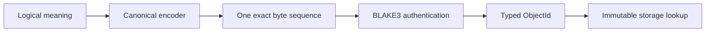

The same logical object must produce the same bytes and the same `ObjectId` on
every machine, filesystem, database, and run.

That one property enables:

| Capability | Why canonical objects make it possible |
|---|---|
| Deduplication | Equal content has equal identity. |
| CAS | Objects can be stored under their identity. |
| Authenticated reuse | Reused bytes can be verified before trust. |
| Copy-on-write | New snapshots can point at unchanged old objects. |
| Backend replacement | SQLite and PostgreSQL can carry the same objects. |
| Snapshot comparison | Identities can be compared before payloads are read. |

The short version is:

> Define the meaning once, encode it deterministically, authenticate the exact
> bytes, store them immutably, and let every optimization preserve that
> contract.

---

## 2. The four layers that must stay separate

Canonical-object design becomes intuitive when four questions are kept apart:

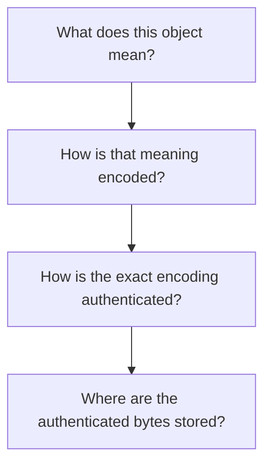

| Layer | Example | Owns | Must not own |
|---|---|---|---|
| Logical object | Directory with `src` child | Meaning and semantic validity | SQL rows or APFS paths |
| Canonical representation | `LFSO` bytes | Exact fields, lengths, ordering | Storage locators |
| Identity | `ObjectId` | BLAKE3 authentication and typed IDs | Inodes or transaction IDs |
| Storage carrier | SQLite BLOB row | Durability, lookup, transactions | Chunk boundaries or object meaning |

The storage engine answers:

```text
Given this ObjectId, where are the bytes and how do I retrieve them?
```

It does not decide what the bytes mean.

### A practical classification question

For every proposed field or optimization, ask:

| Question | If yes, it belongs to |
|---|---|
| Does it change what the object means? | The logical object model |
| Does it change the exact bytes or `ObjectId`? | The canonical format |
| Does it only change lookup, durability, or physical placement? | The storage engine |
| Does it only change native directory I/O? | The OS or VFS projection |

SQLite row IDs, APFS inode numbers, native paths, journal state, timestamps,
temporary names, and memory addresses must never enter canonical bytes or
`ObjectId` calculation.

---

## 3. What “canonical” means

Canonical means there is exactly one valid byte representation for a logical
object.

Without canonicalization, the same directory could be serialized in insertion
order, filesystem order, locale order, or byte order. Those would be different
byte sequences and therefore different hashes even though they claimed to mean
the same thing.

Canonicalization fixes that ambiguity with rules such as:

| Concern | Canonical rule |
|---|---|
| Integer encoding | Fixed width and big-endian byte order |
| Names | UTF-8, one non-empty component, bounded length |
| Directory order | Strict unsigned-byte order |
| Child paths | Immediate names only; no descendant paths |
| References | Fixed-width typed object IDs |
| Optional data | Not accepted unless explicitly part of the format |
| Input end | Exact end-of-input is required |
| Invalid input | Fail closed with a typed error |

Canonicalization is a protocol rule, not a formatting preference. It is what
makes byte equality a trustworthy proxy for logical equality.

---

## 4. The Phase 1 byte contract

### 4.1 Fixed envelope

Every Phase 1 object begins with this exact 9-byte header:

| Offset | Size | Field | Rule |
|---:|---:|---|---|
| `0..4` | 4 | Marker | ASCII `LFSO` |
| `4` | 1 | Kind | Explicit object-kind tag |
| `5..9` | 4 | Payload length | Big-endian `u32`; excludes header |
| `9..` | variable | Payload | Must end exactly at input end |

There is deliberately no format-version field, flags field, reserved field,
or compatibility extension area. A field with no current semantic meaning is
not free; it creates another state every decoder and maintainer must understand.

The complete object, payload, fields, names, and child counts are bounded before
allocation or iteration.

### 4.2 Phase 1 object kinds

Phase 1 keeps the vocabulary small:

| Kind | Tag | Payload |
|---|---:|---|
| `Bytes` | `0x01` | `u32` byte length followed by the bytes |
| `Directory` | `0x02` | `u32` child count followed by child entries |

A directory entry is:

```text
u32 name length
name bytes
u8 child kind
32 raw ObjectId bytes
```

The child kind is explicit. The decoder does not guess whether an ID points to
bytes or a directory, and Phase 1 does not introduce a generic object registry.

### 4.3 Deterministic directory rules

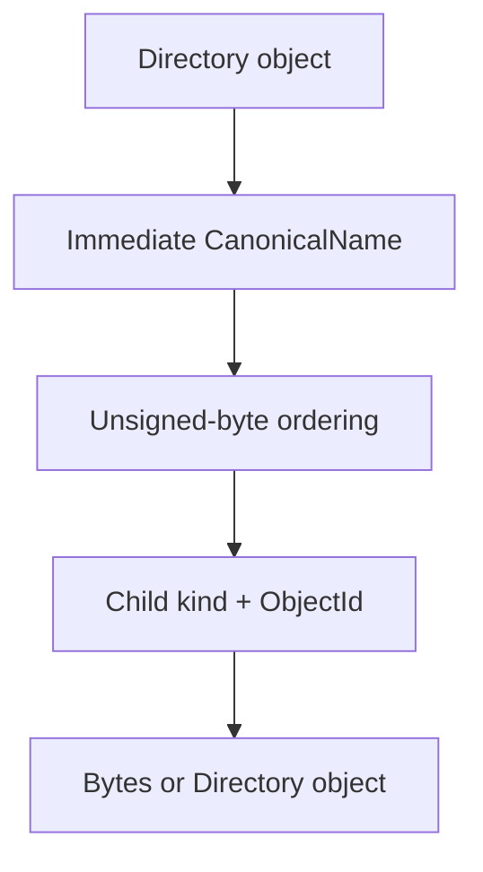

Directory entries must satisfy all of these rules:

| Rule | Reason |
|---|---|
| Name is one component | Keeps the graph local and avoids a hidden path manifest |
| `/`, `\\`, NUL, `.`, and `..` are rejected | Prevents path ambiguity and traversal |
| Names are sorted by unsigned bytes | Makes encoding independent of host order and locale |
| Duplicate names are rejected | Prevents two meanings for one child name |
| Descendant paths are not stored | COW can rewrite only affected directory ancestors |

Host filesystem ordering is never canonical order. Neither is locale-aware
ordering, case-folded ordering, insertion order, or database query order.

### 4.4 Small byte example

For `Bytes("hello")`, the Phase 1 bytes are:

```text
4c46534f 01 00000009 00000005 68656c6c6f
└──LFSO┘  │  payload   │         └─ hello
         kind          byte-field length
```

| Bytes | Meaning |
|---|---|
| `4c46534f` | `LFSO` marker |
| `01` | `Bytes` kind |
| `00000009` | Payload length |
| `00000005` | Byte-field length |
| `68656c6c6f` | UTF-8 bytes for `hello` |

The nested byte length is explicit even though the envelope has a payload
length. It keeps field decoding bounded and uniform for the streaming codec.

### 4.5 What is invalid

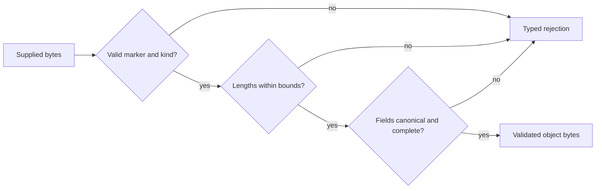

These are errors, not alternate encodings:

| Invalid input | Why it fails |
|---|---|
| Wrong marker or unknown kind | Not the LayerFS grammar |
| Short or overlong payload | Declared length does not match input |
| Trailing bytes | The object was not consumed exactly |
| Oversized field or child count | Violates resource bounds |
| Invalid name | Cannot be a canonical component |
| Unsorted or duplicate directory names | Multiple possible representations |
| Wrong child kind | Semantic edge does not match its declared role |
| Mismatched `ObjectId` | Bytes are not authenticated by the supplied identity |

---

## 5. Identity and trust

### 5.1 The identity rule

For a complete canonical byte sequence `B`, Phase 1 computes:

```text
ObjectId = BLAKE3(UTF-8("layerfs/object") || 0x00 || B)
```

The domain is fixed and explicit. It distinguishes LayerFS object identities
from unrelated hashes without creating multiple object identity schemes.

`ObjectId` is a typed 32-byte value with deterministic raw-byte and lowercase
hexadecimal forms.

### 5.2 Creation versus verification

These are different operations:

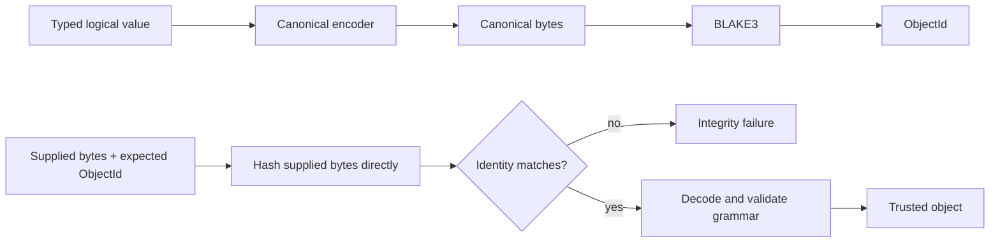

Verification must not decode into a convenient value, re-encode that value, and
hash the result. Re-encoding could normalize away non-canonical bytes and hide
the fact that the stored input was invalid.

### 5.3 What identity excludes

| Excluded value | Why |
|---|---|
| Pathname | The same object can appear at many paths |
| SQLite row ID | Physical database identity is mutable |
| APFS inode or metadata | Host filesystem state is not logical content |
| Storage locator | Objects may move between carriers |
| Timestamp | Time is not object meaning |
| Transaction ID | Publication history is not object content |
| Arrival order | Input fragmentation must not affect identity |

### 5.4 Immutable publication

Once an object is installed under an `ObjectId`, it is immutable:

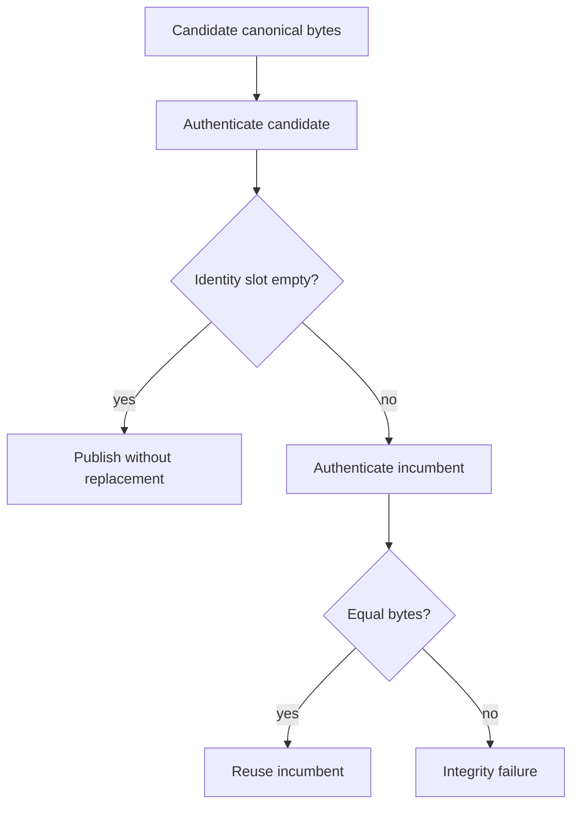

Never overwrite an existing object in place. A changed value receives a new
identity, even if it came from the same logical pathname.

---

## 6. The object graph

Canonical objects form an authenticated graph. An object stores the identity of
another object, not that object's mutable storage location.

### 6.1 Phase 1 graph

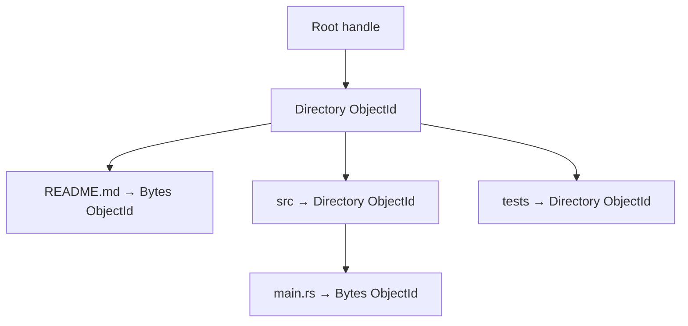

Every directory stores immediate names only. It does not store `src/main.rs` as
a descendant path. Descendants are reached by following directory references.

### 6.2 The root is a handle, not another object

```text
RootId = typed handle to a Directory ObjectId
```

There is no separate canonical `Root` object and no second root hash. The
engine may store a root/checkpoint record containing:

| Metadata | Meaning |
|---|---|
| Root handle | Which directory object is published |
| Parent handle | Which snapshot it descends from |
| Delta reference | What changed between them |
| Publication state | Whether the checkpoint is visible |

That record is storage metadata, not canonical content bytes.

This avoids an extra object, lookup, and hash for every published snapshot.

### 6.3 Future large-file content graph

Phase 1 does not freeze the large-file encoding. Phase 2 compares:

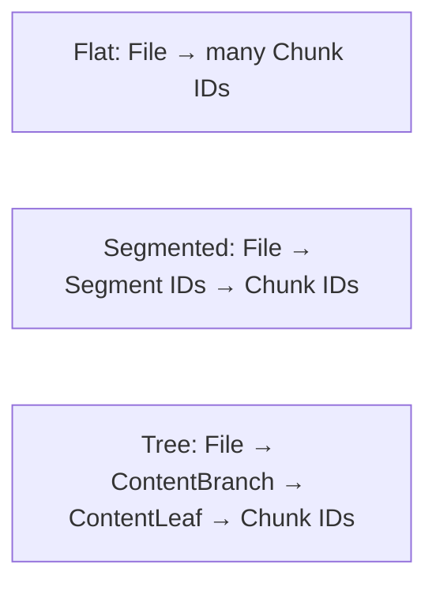

The production candidate is:

```text
File → bounded immutable content tree → Chunk IDs → CAS
```

| Candidate node | Conceptual contents | Benefit |
|---|---|---|
| `File` | Logical content root and file-level meaning | Stable file identity |
| `ContentLeaf` | Bounded ordered chunk references and lengths | Local chunk updates |
| `ContentBranch` | Bounded child references and subtree byte lengths | Skip unrelated ranges |
| `Chunk` | Immutable payload bytes | Reuse and deduplication |

These names describe the candidate graph, not Phase 1 object kinds or frozen
encodings. The benchmark must choose the shape before those encodings become
stable format.

---

## 7. Why this enables small edits and fast reads

### 7.1 CDC, CAS, COW, and the content tree

| Mechanism | Main job | What it avoids |
|---|---|---|
| CDC | Find stable chunk boundaries | Rechunking an entire file after a local edit |
| CAS | Store immutable bytes by `ObjectId` | Copying equal chunks and objects |
| COW | Rebuild changed graph paths | Rewriting unchanged subtrees |
| Content tree | Index chunks with bounded metadata | Scanning a flat file manifest for every range |

None of these mechanisms belongs in SQLite. SQLite stores and retrieves
already-validated objects.

### 7.2 Small-edit path

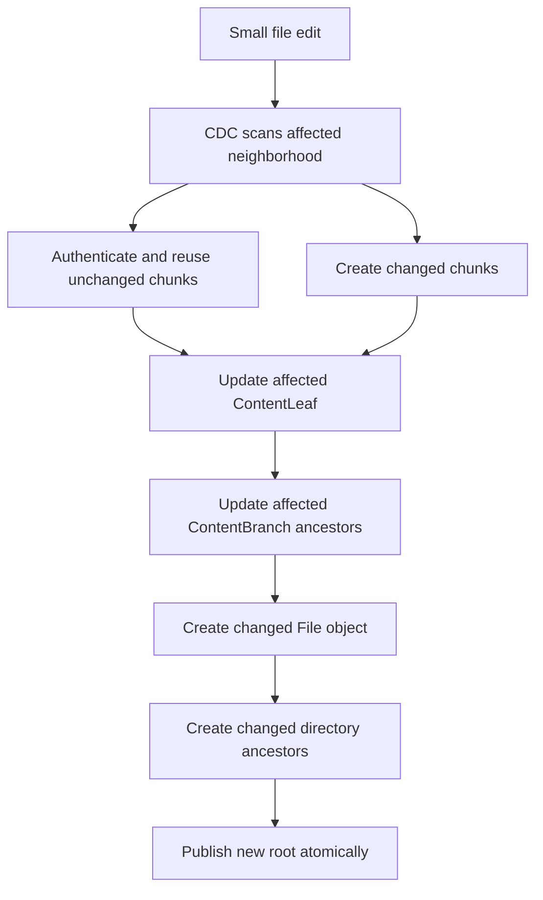

The target is:

```text
small-edit work ≈ changed bytes + affected metadata
```

That is a measured goal, not an automatic theorem. If bounded CDC rejoin or
capture evidence cannot be proved, the operation must report the limitation
instead of claiming edit-sized work.

### 7.3 Range-read path

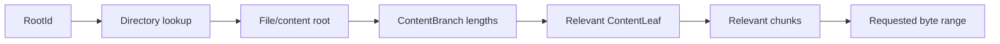

Subtree byte lengths let a reader skip non-overlapping content subtrees. The
engine should support bounded range reads, but it should not duplicate core
content parsing or decide object meaning.

### 7.4 Flat, segmented, and tree tradeoffs

| Shape | Strength | Cost |
|---|---|---|
| Flat manifest | Few object types; simple sequential reads | Small edits may scan or rewrite metadata proportional to file size |
| Segmented layout | Limits metadata growth into moderate units | Segment choice can still create large local work |
| Fixed-fanout tree | Bounded metadata; efficient ranges; local ancestor rewrites | More objects, lookups, and format complexity |

Benchmark all three with the same dataset, storage settings, cache labels, and
concurrency before freezing `File`, `ContentLeaf`, or `ContentBranch` bytes.

### 7.5 Materialization states

| State | Expected work |
|---|---|
| Cold | Read and write objects needed to create the destination |
| Warm matching root | Verify provenance and avoid rewriting unchanged files |
| Warm changed root | Update only changed paths and affected metadata when provenance is known |

Operating-system page-cache state is not the same thing as a warm LayerFS
materialization. Measure those states separately.

### 7.6 Memory boundaries

Bounded canonical-object buffers do not prove bounded total process memory.
Measure separately:

| Resource | Examples |
|---|---|
| Logical buffers | Decoder payloads, CDC windows, chunk buffers |
| Database memory | SQLite page cache and statement state |
| OS memory | Filesystem cache, mapped libraries, thread stacks |
| Temporary storage | Rollback journal, spool files, temporary objects |
| Process observations | RSS/PSS when available |

---

## 8. Ownership in the repository

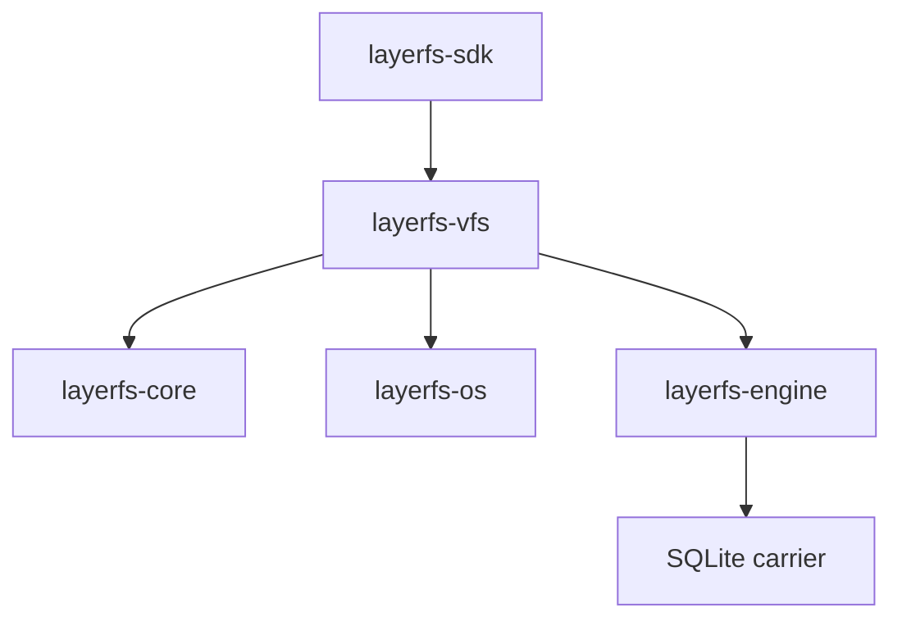

| Module | Owns |
|---|---|
| `format/` | Names, paths, bounds, and canonical field rules |
| `identity/` | `ObjectId` and BLAKE3 authentication |
| `object/` | Object kinds, references, encoding, and decoding |
| `cdc/` | Chunk boundaries and rejoin verification |
| `cas/` | Immutable publication and authenticated reuse |
| `content/` | Files, chunks, and the selected content layout |
| `cow/` | Immutable views and changed ancestor spines |
| `delta/` | Parent/new roots and changed paths |
| `layerfs-engine` | Durable objects, metadata, transactions, and range retrieval |
| `layerfs-os` | macOS/APFS mechanics and host error classification |
| `layerfs-vfs` | Materialization and capture of ordinary directories |
| `layerfs-sdk` | The four-operation public workflow |

The Phase 1 center of gravity is `format/`, `identity/`, and `object/`. Do not
pull SQLite, APFS, VFS, or SDK concerns into them to make an early test
convenient.

---

## 9. Implementation path

### Phase boundaries

| Phase | Prove | Do not freeze yet |
|---|---|---|
| Phase 1 | Paths, envelope, `Bytes`, `Directory`, identity, codec, malformed-input behavior, and a bounded canonical-object baseline | Final large-file content tree |
| Phase 2 | CDC, CAS, and the winning flat/segmented/tree content shape | Unmeasured content encoding |
| Phase 3 | COW trees, deltas, unchanged-subtree reuse | Backend-specific persistence |
| Phase 4 | SQLite durability, no-replace storage, range reads, atomic publication | Core identity rules |
| Phase 5+ | Native materialization, capture, SDK, end-to-end performance | Speculative providers or alternate engines |

### Minimum loop for every new object field or kind


If any step cannot be stated clearly, the object is not ready to add.

### Phase 1 test matrix

| Area | Minimum evidence |
|---|---|
| Names and paths | Valid root/nested paths; separators, traversal, NUL, invalid UTF-8, and bounds |
| Ordering | Parent-before-descendant paths; unsigned-byte directory order; duplicate rejection |
| Envelope | Golden bytes; truncated header/payload; declared length mismatch; trailing bytes |
| Kinds | Valid `Bytes` and `Directory`; unknown marker/kind; wrong child kind |
| Streaming | Slice and `Read`/`Write` round trips; exact EOF; bounded allocation behavior |
| Identity | Fixed-size byte/hex conversion; contiguous/streaming stability; mismatch rejection |
| Trust | Direct authentication of supplied bytes before decode/reuse |
| Isolation | Core tests run without SQLite, APFS APIs, or VFS imports |

### Review checklist

| Question | Desired answer |
|---|---|
| Can two valid encoders produce different bytes for one value? | No |
| Does decoding accept bytes the encoder would never produce? | No |
| Are lengths checked before allocation or iteration? | Yes |
| Are directory names immediate components? | Yes |
| Are supplied bytes authenticated before reuse? | Yes |
| Does storage location affect identity? | No |
| Does a new kind solve a current requirement? | Yes, with a complete grammar |
| Is a performance claim measured at the complete operation boundary? | Yes |

---

## 10. Glossary

| Term | Plain-language meaning |
|---|---|
| Canonical object | A typed value with one permitted byte representation |
| Canonical bytes | The exact bytes emitted by the canonical encoder |
| `ObjectId` | The typed BLAKE3 identity of those bytes |
| Object reference | A child kind plus an `ObjectId` |
| Root handle | A typed handle to a directory object used as a snapshot root |
| CAS | Content-addressed storage of immutable objects |
| CDC | Content-defined chunking for stable reuse boundaries |
| COW | Copy-on-write reconstruction of only changed graph paths |
| `ContentLeaf` | Candidate bounded node containing chunk references and lengths |
| `ContentBranch` | Candidate bounded node containing child references and subtree lengths |
| Delta | The bounded description of changes between two roots |

## Final mental picture

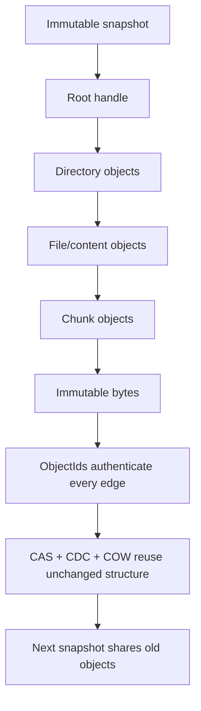

The root is a handle. The directory is an object. The file content is a
bounded graph. The chunks are immutable bytes. The `ObjectId` authenticates
each canonical object, and the storage engine merely carries the result.
