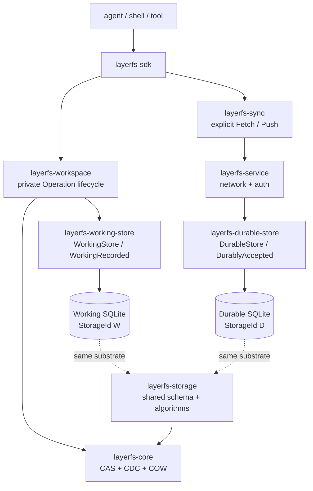
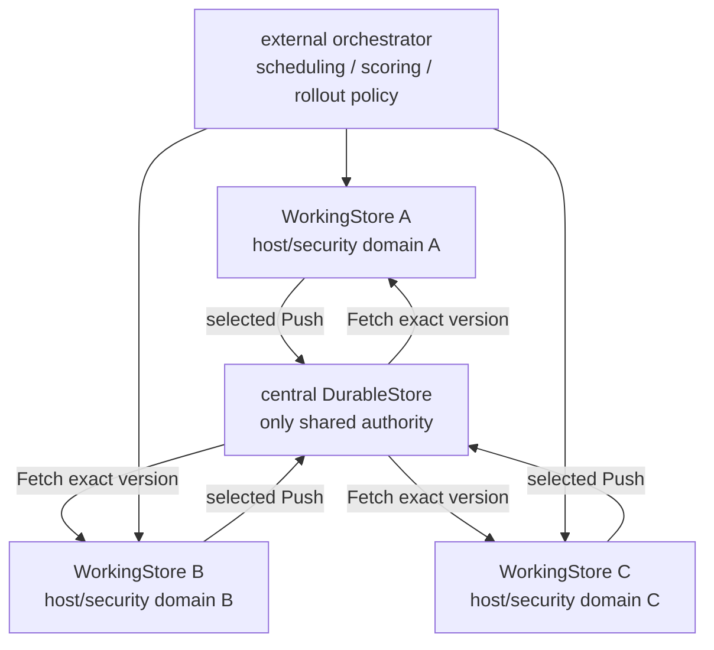
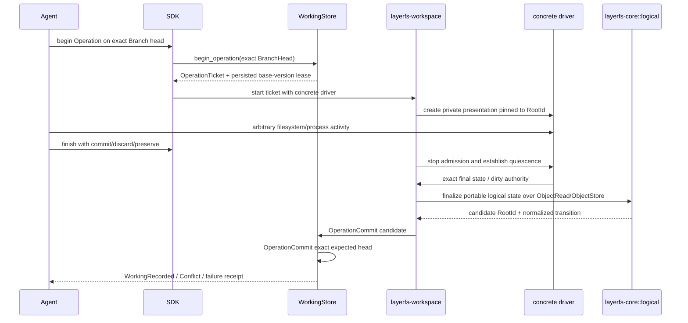

# Product-ready LayerFS architecture

This is the normative target architecture. Current crate locations and retained
evidence are listed separately so implementation history cannot redefine final
ownership.

## 1. Architectural thesis

> Agents mutate private workspaces backed by a WorkingStore. Working results
> become shared authority only through explicit synchronization and DurableStore
> admission. Canonical objects keep their identities across both physically
> distinct databases.

LayerFS separates five concerns:

```text
canonical meaning       layerfs-core
portable semantics      layerfs-core::logical
SQLite substrate        layerfs-storage
Working/Durable policy  layerfs-working-store / layerfs-durable-store
execution/presentation  layerfs-workspace + mount/materialization drivers
```

`layerfs-sync` explicitly bridges Working and Durable. `layerfs-service` is the
only network/auth boundary around DurableStore.

The history model remains:

- Branch versions are immutable `OperationVersion`s;
- LayerStack versions are immutable `Layer`s;
- the only commit action is `OperationCommit`;
- merges are `ChildBranchMerge` and `LayerStackMerge`;
- forks are `LayerBranchFork` and `ChildBranchFork`;
- rollbacks are `BranchRollback` and `LayerStackRollback`.



## 2. Exact target repository structure

```text
layerfs/
├── Cargo.toml
├── crates/
│   ├── layerfs-core/
│   │   ├── Cargo.toml
│   │   └── src/
│   │       ├── lib.rs
│   │       ├── identity/
│   │       ├── object/
│   │       │   ├── mod.rs
│   │       │   ├── codec.rs
│   │       │   └── access.rs
│   │       ├── cdc/
│   │       ├── content/
│   │       │   ├── mod.rs
│   │       │   └── rope/
│   │       │       ├── mod.rs
│   │       │       ├── build.rs
│   │       │       ├── read.rs
│   │       │       ├── edit.rs
│   │       │       ├── diff.rs
│   │       │       ├── node.rs
│   │       │       └── validate.rs
│   │       ├── namespace/
│   │       │   ├── mod.rs
│   │       │   ├── tree.rs
│   │       │   ├── codec.rs
│   │       │   └── validate.rs
│   │       ├── inode/
│   │       │   ├── mod.rs
│   │       │   ├── table.rs
│   │       │   ├── record.rs
│   │       │   └── codec.rs
│   │       ├── metadata/
│   │       │   ├── mod.rs
│   │       │   ├── tree.rs
│   │       │   ├── codec.rs
│   │       │   └── validate.rs
│   │       ├── legacy/
│   │       │   └── mod.rs              # compatibility codecs/readers only
│   │       └── logical/
│   │           ├── mod.rs
│   │           ├── resolver.rs
│   │           ├── read.rs
│   │           ├── mutate.rs
│   │           ├── diff.rs
│   │           └── merge.rs
│   ├── layerfs-storage/
│   │   ├── Cargo.toml
│   │   └── src/
│   │       ├── lib.rs
│   │       ├── storage.rs
│   │       ├── schema.rs
│   │       ├── objects.rs
│   │       ├── integrity.rs
│   │       ├── publication.rs
│   │       ├── version/
│   │       │   ├── mod.rs
│   │       │   ├── layers.rs
│   │       │   ├── branches.rs
│   │       │   ├── operations.rs
│   │       │   ├── deltas.rs
│   │       │   ├── transitions.rs
│   │       │   └── leases.rs
│   │       ├── retention.rs
│   │       ├── generation.rs
│   │       └── migration.rs
│   ├── layerfs-working-store/
│   │   ├── Cargo.toml
│   │   └── src/
│   │       ├── lib.rs
│   │       ├── working_store.rs
│   │       ├── cache.rs
│   │       ├── candidates.rs
│   │       ├── tracking.rs
│   │       ├── outbox.rs
│   │       ├── transfer.rs
│   │       └── recovery.rs
│   ├── layerfs-durable-store/
│   │   ├── Cargo.toml
│   │   └── src/
│   │       ├── lib.rs
│   │       ├── durable_store.rs
│   │       ├── admission.rs
│   │       ├── authority.rs
│   │       ├── retention.rs
│   │       ├── backup.rs
│   │       └── restore.rs
│   ├── layerfs-sync/
│   │   ├── Cargo.toml
│   │   └── src/
│   │       ├── lib.rs
│   │       ├── protocol.rs
│   │       ├── receipt.rs
│   │       ├── limits.rs
│   │       ├── client/
│   │       │   ├── mod.rs
│   │       │   ├── fetch.rs
│   │       │   ├── push.rs
│   │       │   └── reconcile.rs
│   │       └── server/
│   │           ├── mod.rs
│   │           ├── fetch.rs
│   │           ├── push.rs
│   │           └── reconcile.rs
│   ├── layerfs-workspace/
│   │   ├── Cargo.toml
│   │   └── src/
│   │       ├── lib.rs
│   │       ├── operation.rs
│   │       ├── workspace.rs
│   │       ├── direct.rs
│   │       ├── driver.rs
│   │       ├── quiescence.rs
│   │       ├── leases.rs
│   │       └── receipt.rs
│   ├── layerfs-mount/
│   │   ├── Cargo.toml
│   │   └── src/
│   │       ├── lib.rs
│   │       ├── driver.rs
│   │       ├── workspace.rs
│   │       ├── handles.rs
│   │       ├── dirty.rs
│   │       ├── spool.rs
│   │       └── fuse/
│   │           ├── mod.rs
│   │           ├── session.rs
│   │           ├── callbacks.rs
│   │           └── errno.rs
│   ├── layerfs-materialization/
│   │   ├── Cargo.toml
│   │   └── src/
│   │       ├── lib.rs
│   │       ├── driver.rs
│   │       ├── workspace.rs
│   │       ├── materialize.rs
│   │       ├── capture.rs
│   │       ├── refresh.rs
│   │       ├── provenance.rs
│   │       └── apfs/
│   │           ├── mod.rs
│   │           ├── handles.rs
│   │           ├── clone.rs
│   │           ├── metadata.rs
│   │           └── ffi.rs
│   ├── layerfs-sdk/
│   │   ├── Cargo.toml
│   │   └── src/
│   │       ├── lib.rs
│   │       ├── operation.rs
│   │       ├── branch.rs
│   │       ├── layer_stack.rs
│   │       ├── workspace.rs
│   │       ├── working.rs
│   │       ├── sync.rs
│   │       └── receipt.rs
│   └── layerfs-service/
│       ├── Cargo.toml
│       └── src/
│           ├── lib.rs
│           ├── server.rs
│           ├── authentication.rs
│           ├── admission.rs
│           ├── routes.rs
│           └── main.rs
├── tools/
│   ├── layerfs-cli/
│   └── layerfs-eval/
├── poc-product-ready/
└── poc/
```

This is an ownership target, not an instruction to create empty crates. A new
crate is created when real code moves into it. Files may remain combined while
small.

The `layerfs-core` subtree above is an internal refactor destination only.
Existing public module paths remain re-exported through the migration, and
canonical tags, versions, profile bytes, encodings, and `ObjectId` equations do
not change. `legacy/` contains compatibility readers/codecs; it is never a
second writer representation. Move one proven implementation rather than
maintaining old and new algorithms in parallel.

`core::logical` owns portable path resolution, reads, mutations, Merkle diff,
and three-root merge candidate construction. It is generic only over
`core::object::access::{ObjectRead, ObjectStore}`. It contains no SQLite,
platform calls, workspace lifecycle, Branch/LayerStack records, publication,
authority, or synchronization policy.

## 3. Acyclic dependency direction

```text
layerfs-core
    ↑
layerfs-storage
    ├── layerfs-working-store
    └── layerfs-durable-store

layerfs-sync common  -> layerfs-storage
layerfs-sync client  -> layerfs-working-store
layerfs-sync server  -> layerfs-durable-store

layerfs-workspace -> layerfs-core + layerfs-working-store
mount/materialization -> layerfs-core + layerfs-workspace
layerfs-sdk -> workspace + working-store + sync(client) + selected driver
layerfs-service -> sync(server) + durable-store
```

The literal dependency rules are:

```text
layerfs-storage          -> layerfs-core
layerfs-working-store    -> layerfs-storage + layerfs-core
layerfs-durable-store    -> layerfs-storage + layerfs-core
layerfs-workspace        -> layerfs-core + layerfs-working-store
layerfs-mount            -> layerfs-core + layerfs-workspace
layerfs-materialization  -> layerfs-core + layerfs-workspace
layerfs-sdk              -> layerfs-workspace + layerfs-working-store
                            + layerfs-sync(client) + selected presentation
layerfs-sync             -> layerfs-storage + layerfs-working-store
                            + layerfs-durable-store
layerfs-service          -> layerfs-sync(server) + layerfs-durable-store
```

Notably:

- Storage does not depend on either policy crate.
- WorkingStore and DurableStore do not depend on one another.
- `layerfs-sync::client` invokes WorkingStore APIs and transports protocol
  requests; it has no DurableStore dependency or database access.
- `layerfs-sync::server` invokes DurableStore APIs. Service authenticates and
  transports requests, opens the DurableStore, and delegates the admitted
  request to that server-side Sync code rather than duplicating Fetch/Push.
- `layerfs-sync` keeps client and server orchestration in separate source
  modules over one common protocol; this source split is not a runtime Store
  mode or a second synchronization implementation.
- Workspace does not own transport or Durable admission.
- SDK and client code cannot depend on DurableStore or open its SQLite file.
- Core logical semantics, Workspace, Mount, and Materialization remain
  network-free.

## 4. Current source versus target ownership

| Concern | Current source | Target ownership |
|---|---|---|
| canonical identity, codecs, CDC, trees | `layerfs-core` | `layerfs-core` |
| SQLite schema, objects, refs, publication, integrity, generations | `layerfs-engine` | migrate once into `layerfs-storage` |
| Working policy | mixed through Engine/VFS/SDK | `layerfs-working-store` |
| durable authority/admission/backup | not separated | `layerfs-durable-store` |
| Fetch/Push | not implemented | `layerfs-sync` |
| portable path/read/mutate/diff/merge semantics | residual semantic code in `layerfs-vfs` | move directly into `layerfs-core::logical` |
| operation/workspace lifecycle | mixed through SDK/VFS | `layerfs-workspace` |
| mounted session | mainly `layerfs-vfs::mounted` | `layerfs-mount` |
| FUSE callbacks | `layerfs-fuse` | `layerfs-mount::fuse` |
| materialize/capture/refresh | mainly `layerfs-vfs` | `layerfs-materialization` |
| Apple host mechanics | `layerfs-os::apple` | `layerfs-materialization::apfs` |
| client API | `layerfs-sdk` | thin `layerfs-sdk` facade |
| durable network/auth boundary | not implemented | `layerfs-service` |

Current paths remain valid evidence references until migration. Compatibility
re-exports may bridge callers temporarily; there must not be two active
implementations of the same path.

## 5. Shared storage substrate, separate policy owners

### 5.1 `layerfs-storage`

Storage owns one schema and one implementation for:

- immutable object admission and authentication;
- RootId and version records;
- LayerStack, Layer, Branch, Operation, OperationVersion, and scoped deltas;
- exact expected-head transactions and lost-acknowledgement reconciliation;
- integrity traversal, retention primitives, schema migration;
- replacement-generation compaction and verified reopen.

Storage does not know whether its caller is Working or Durable. It has no
`StorageRole`, runtime mode, or trust switch. Policy wrappers expose restricted
operations over different physical Storage instances.

### 5.2 `layerfs-working-store`

WorkingStore owns:

- a disk-backed SQLite/CAS authenticated object cache;
- fetched objects and exact `DurableTrackingRef`s;
- private/unpublished Branches at arbitrary depth, Operations,
  OperationVersions, and OperationDeltas;
- host-recoverable preserved candidates/conflicts and workspace recovery;
- explicit Push outbox, transfer, request, and reconciliation state;
- many Branches and private OperationWorkspaces within one host/security
  domain.

There may be many independent Working Stores. One per host or security domain
is the recommended default. A WorkingStore can durably record Working work but
cannot claim `DurablyAccepted`, mutate a Durable head, or coordinate peer head
authority. It never stores a complete workspace/file as an in-memory data
model; canonical state is disk-backed and active dirty state is bounded/spooled.

### 5.3 `layerfs-durable-store`

DurableStore is the GitHub-like central authority and owns:

- the shared authenticated canonical CAS;
- LayerStacks, Layers, and exact LayerStack heads;
- durable Branches at arbitrary recursive depth, immutable fork ancestry, and
  exact Branch heads;
- pushed OperationVersions, OperationDeltas, Branch/Layer merge records, and
  `DurablyAccepted` idempotent receipts;
- authoritative leases, retention, compaction, backup, restore, and
  disaster-recovery custody.

DurableStore never accepts caller claims of trust. New and incumbent objects,
the complete requested closure, origin, leases, and exact expected head are
verified before visibility. It never receives running OperationWorkspaces,
handles, raw syscalls, dirty maps, spools, native files, process state, or
unpushed Operations.

### 5.4 Physical database rule

WorkingStore and DurableStore use the same schema and canonical algorithms but
open physically distinct SQLite databases with distinct `StorageId`s:

```text
working.sqlite  StorageId W
durable.sqlite  StorageId D
```

`ObjectId`, `RootId`, and issuer-scoped `InodeId` transfer without rewriting.
SQLite row IDs, pages, journals, and `StorageId` do not.
Equal objects deduplicate separately in each physical database. Sync avoids
known-present transfer, but a copy on another machine is real storage and is
not literal zero-copy.

There is no one-Store product mode. A single-host installation still runs:

```text
Working client/Workspace -> working.sqlite
explicit Sync -> Service/Durable process -> durable.sqlite
```

Only WorkingStore opens the Working database. Only DurableStore in the Durable
process opens the Durable database. Client code never opens Durable SQLite,
even through a shared filesystem path.

## 6. Explicit synchronization bridge

`layerfs-sync` coordinates records and canonical objects; it does not own the
schema, copy SQLite files/pages, or make product merge/retry decisions. Its
common protocol types are implemented by two source halves:

```text
layerfs-sync::client
    WorkingStore-side Fetch/Push negotiation, transfer, verification, receipts

layerfs-sync::server
    DurableStore-side negotiation, object/version admission, head requests,
    idempotence, and reconciliation
```

Service is the sole production opener/caller boundary for the central
DurableStore. After transport authentication and admission limits, Service
delegates to `layerfs-sync::server`, which invokes DurableStore APIs. Service
does not contain a second Fetch/Push implementation.

### Fetch

```text
read exact Durable hashes and ref/head receipt first
-> negotiate needed ObjectIds in bounded batches
-> transfer negotiated objects; charge actual bytes including retransmission
-> WorkingStore authenticates every received object
-> verify complete requested Root/version closure
-> record verified DurableTrackingRef
```

Fetch never moves a dirty or independently advanced Working Branch. A partial
transfer never becomes `verified_complete`. Verified tracking refs retain their
closure until explicit eviction atomically marks them evicted and releases
retention.

### Push

```text
verify exact accepted WorkingRecorded version/chain selected for Push
-> send proposed records, hashes, ancestry and exact expected Durable head first
-> negotiate needed ObjectIds in bounded batches
-> transfer negotiated objects; charge actual bytes including retransmission
-> Durable admission authenticates new and incumbent objects
-> Durable admission verifies complete candidate closure
-> one final exact Durable ref transaction
-> DurablyAccepted | Conflict | Indeterminate
```

Object transfer creates no visibility. A Durable Push `Conflict` preserves the
already accepted Working `WorkingRecorded` version but creates no
`DurablyAccepted` transition. `Indeterminate` uses a fresh service request keyed
by the same publication identity; it is never blindly redispatched.

One Push publishes a new durable Branch or advances an existing one. It may
append a complete accepted Working chain of OperationVersions/OperationDeltas
and then move the durable Branch head once. The same exact final transaction
records branch creation/ancestry when the Branch is new.
Publishing a new child requires its exact immediate parent Branch and fork
`OperationRecordRef` to be DurablyAccepted already; Push does not invent or
advance ancestors implicitly.

Synchronization runs only when explicitly requested. There is no watcher,
background worker, polling loop, automatic Fetch, automatic Push,
per-syscall/close/fsync synchronization, automatic retry, or automatic merge.
Multiple Working Stores coordinate shared authority only through DurableStore;
there is no peer authority protocol.

### Non-normative federated/MCTS-style illustration



This is an application composition only. LayerFS does not own rollout scores,
search-tree policy, scheduling, winner selection, or agent semantics. Working
Stores do not synchronize authority with one another.

## 7. LayerStack, Branch, and nested child dynamics

```text
LayerStack S:
    Layer L0 -> Layer L1 -> Layer L2

top-level Branch B from L1:
    base L1 -> OperationVersion B1 -> B2

child Branch C from exact completed OperationRecordRef(B1):
    base B1 -> OperationVersion C1 -> C2

grandchild Branch G from exact completed OperationRecordRef(C1):
    base C1 -> OperationVersion G1
```

`LayerBranchFork` accepts an exact retained `LayerRef`. The resulting Branch is
permanently bound to that LayerStack as its inherited LayerStack merge
destination.

`ChildBranchFork` accepts an exact completed `OperationRecordRef`:

```text
OperationRecordRef {
    parent_branch_id,
    operation_id,
    operation_version_id,
    root_id,
}
```

The child permanently records that immediate parent and exact fork Operation,
and inherits the same originating LayerStack/Layer as its parent. Recursive
nesting repeats this rule. A child may merge into its immediate parent or any
depth Branch may merge into its inherited originating LayerStack. It may not
merge into a grandparent/sibling/unrelated Branch or another LayerStack.

`OperationCommit` records one `OperationDelta`, creates one
`OperationVersion`, and CASes the exact Working Branch head. A stale head
creates no accepted OperationVersion and does not advance the Branch; it
preserves a host-recoverable candidate with a `Conflict` receipt. Only a
successful Working Branch transition is `WorkingRecorded`.

`ChildBranchMerge` is a three-root merge:

```text
base        child fork OperationVersionRef
source      exact child head
destination exact current immediate-parent Branch head
result      merged parent candidate
```

Success creates the next parent `OperationVersion`; stale destination or
overlap returns `Conflict` and preserves child state.

`LayerStackMerge` accepts a Branch at any depth. It uses the Branch's inherited
origin Layer, exact Branch head, and exact current originating LayerStack head.
Candidate preparation records the source Branch/depth/head and creates an
immutable candidate Layer without moving the head. Durable acceptance
atomically marks it accepted, appends the branch/layer merge record, and
advances the exact LayerStack head.

The source Branch/head must already be DurablyAccepted before the
LayerStackMerge Push; that Push never publishes or advances the source Branch
implicitly.

A LayerStack is not a main Branch. The default LayerStack may be named `main`,
but it remains an ordered Layer history and never acquires Branch semantics.

Working and Durable transitions use the same schema and validation algorithms,
but only the DurableStore receipt is `DurablyAccepted` shared authority.

## 8. `layerfs-workspace`: per-Operation isolation

Workspace owns the uniform lifecycle:



Workspace owns:

- begin/end runtime state machine and terminal receipt routing;
- runtime writer/process/descriptor/mapping guards while WorkingStore owns the
  persistent base-version lease;
- writer/process/mapping quiescence contract;
- finalized-candidate custody and cleanup while `layerfs-core::logical` owns
  portable candidate construction;
- routing to direct, mount, or materialization driver.

The presentation drivers own mutation mechanics:

- `layerfs-mount` owns logical overlay, dirty ranges, bounded spool, handles,
  and FUSE callback barriers;
- `layerfs-materialization` owns native workspace provenance,
  materialize/capture/refresh, process/native-writer barriers, and APFS helpers.

Sibling Operations never share dirty state. They may share WorkingStore
immutable objects and cached payloads. The first matching Branch CAS wins; stale
candidates remain isolated and inspectable.

## 9. Mount versus materialization

| Property | Mount/FUSE | Materialization/APFS |
|---|---|---|
| execution state | private logical overlay over pinned root | private native directory with provenance |
| reads | canonical extent tree and Working cache | ordinary host-file reads |
| writes | dirty ranges/spool then changed canonical extents | native writes, then capture final state |
| count-changing edit | measured extent splice, no native suffix movement | native suffix/full-file work may be required |
| cold start | metadata and demand-driven payloads | linear in emitted paths/bytes |
| canonical conversion | FastCDC dirty/replacement streams, CAS, COW spines | FastCDC captured changed streams, CAS, COW spines |
| merge | logical root/version work only | same logical merge; optional later physical refresh |

CAS + CDC + COW suit mounted concurrency because every Operation shares an
immutable base graph while owning only dirty bytes. Count-changing changes edit
the extent rope; unchanged suffix payloads and tree nodes remain shared.

Materialization remains valuable for native compatibility. Its physical edit
or capture may be linear, but canonical admission still reuses equal chunks and
unchanged COW subtrees. A merge never requires APFS output. If a caller asks to
refresh a native presentation after acceptance, Materialization Merkle-diffs
the known and target roots, uses clone/patch where exact, and reports an
explicit full fallback otherwise.

## 10. Complexity and resource contract

| Operation | Required bound or honest lower bound |
|---|---|
| path lookup | `sum_i[O(log D_i) + O(log I)]` |
| logical range read | path + `O(log E + X + R)` |
| logical replacement `B` | path + expected-local `O(B + log E)`; unchanged suffix payload I/O zero |
| fork | indexed metadata; zero canonical object copies |
| mounted Operation state | shared base + bounded private dirty memory/spool |
| related-root diff | changed shared spines where identities match |
| unrelated-root diff | worst-case linear in both reachable node sets |
| Fetch/Push | closure traversal + missing unique bytes + observed retransmission |
| cold native materialization | linear in paths and output bytes |
| arbitrary native capture | namespace-linear and worst workspace-byte-linear |
| verified compaction | indexed-object plus surviving-byte linear |

No product path may collect all extents, clone a complete namespace into memory,
replicate SQLite, hide retry, or report unavailable observations as zero.

## 11. Migration from current source

Current implementation:

```text
layerfs-core
layerfs-engine
layerfs-vfs
layerfs-fuse
layerfs-os
layerfs-sdk
```

Target migration order:

1. Freeze the shared schema and move current Engine implementation once into
   `layerfs-storage` without changing canonical bytes.
2. Put Working-only admission/cache/candidate/recovery APIs in
   `layerfs-working-store`.
3. Put Durable-only admission/authority/retention/backup APIs in
   `layerfs-durable-store`.
4. Move residual portable resolver/read/mutate/diff/merge semantics from current
   `layerfs-vfs` directly into `layerfs-core::logical`, generic over
   `ObjectRead`/`ObjectStore`; preserve compatibility re-exports and never
   create an intermediate filesystem-semantics crate.
5. Extract the Operation lifecycle to `layerfs-workspace`.
6. Move mounted and native mechanics into their concrete driver crates.
7. Add foreground Store-to-Store Sync, then wrap Durable with Service.
8. Migrate each current SQLite database to Working storage; initialize a
   physically separate Durable database and populate it only through verified
   explicit Sync.

There is one schema migration lineage in Storage, not separate Working and
Durable migrations. No existing database is relabeled into both owners.

## 12. Acceptance rules

1. Working and Durable use the same Storage schema/algorithms but distinct
   SQLite files and `StorageId`s.
2. No `StorageRole` or runtime mode changes a Storage instance's meaning.
3. Client/SDK code cannot open Durable SQLite or call DurableStore directly.
4. Every Working-to-Durable transition crosses explicit Sync/Service admission.
5. Synchronization is foreground, bounded, authenticated, and receipt-driven.
6. SQLite files/pages and database-local IDs never cross the bridge.
7. Top-level and recursively nested child Branch origins constrain every merge.
8. Every Operation receives one private Workspace and exact quiescence boundary.
9. Mount and Materialization converge on the same canonical root while reporting
   different physical costs.
10. WorkingRecorded and DurablyAccepted are never conflated in APIs, receipts,
    evidence, or recovery.
11. `layerfs-core::logical` is the only portable semantic owner, depends only
    on Core object-access traits, and no temporary semantic crate is introduced.
12. Fetch and Push are the only public synchronization actions; no filesystem
    event or background worker triggers them.
13. Multiple Working Stores have no peer authority; every shared head is
    decided by the central DurableStore.
14. DurableStore persists accepted canonical/version authority only and never
    running workspaces, handles, syscalls, dirty maps, spools, native files, or
    unpushed Operations.
15. A child may merge into its immediate parent and any-depth Branch may merge
    into its inherited originating LayerStack; every other cross-tree Branch
    merge is rejected.
16. LayerStack is not a Branch; `main` may be a LayerStack name only.

Current retained evidence remains source/artifact/environment bound. It proves
only the exact implementation paths named by that evidence.
