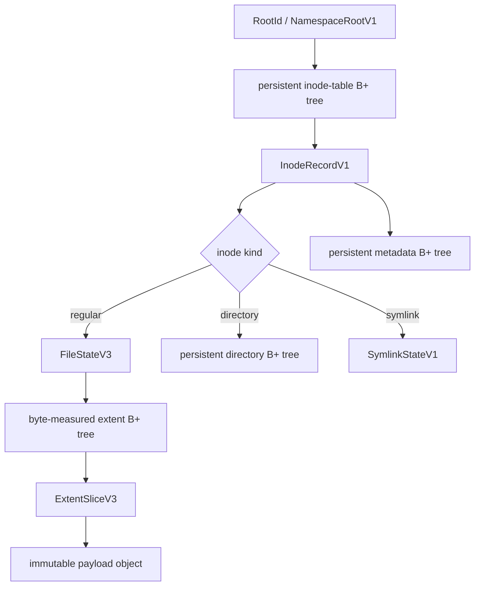

# Core algorithms and data model

This document has two explicit statuses:

- **Implemented** describes current checked-out product code.
- **Target** is the normative product model required before the corresponding
  capability may be called complete.

The target `layerfs-storage` substrate extracts and extends current Engine Store
mechanisms; it does not replace the portable canonical algorithms or create a
second identity system.

Target ownership used throughout this document:

```text
layerfs-core           canonical formats/algorithms plus logical/{resolver,read,mutate,diff,merge}
layerfs-storage        shared schema, records, integrity, exact transactions
layerfs-working-store  public WorkingRecorded policy over working StorageId
layerfs-durable-store  public DurablyAccepted policy over durable StorageId
layerfs-sync           explicit bounded Fetch/Push transfer only
layerfs-workspace      isolated OperationWorkspace lifecycle and quiescence
```

Dependencies are one-way: Storage uses Core; each public policy uses Storage.
Workspace composes Core logical semantics, WorkingStore policy, and a selected
presentation. Core logical modules are generic over Core object-access traits;
Core does not depend on Storage. Sync may use bounded Storage import/export
primitives but cannot call a head transition without the destination policy.

## 1. Canonical filesystem graph



Every object below `RootId` is immutable canonical data. Layer, Branch, and
operation records select or relate directly readable roots; ordinary reads
never replay history.

## 2. Identity and canonical encoding

| Identity | Meaning | Canonical? |
|---|---|:---:|
| `ObjectId` | complete canonical object bytes | yes |
| payload object ID | canonical `Bytes` object containing one chunk | yes |
| extent/directory/inode/metadata node ID | exact encoded tree node | yes |
| `FileStateRoot` | one operational file structure | yes |
| `RootId` | one complete immutable filesystem namespace | yes |
| `InodeId` | Stable canonical logical inode identity allocated from an issuer StorageId plus serial | yes; issuer-scoped but portable unchanged between storage databases; current bytes call it StoreId |
| `ContentDigest` | equality of a complete logical byte stream | secondary evidence |
| `LayerStackId`, `LayerId`, `BranchId`, `OperationId`, `OperationVersionId` | stable product records selecting or relating roots; never SQL rowids | no content meaning |
| `StorageId` | one physical storage database; current source name is `StoreId` | no content meaning |
| native path/inode, FUSE handle, SQL rowid | presentation/runtime state | no |

Implemented stored-object identity is:

```text
ObjectId = BLAKE3("layerfs/object\0" || complete_canonical_object_bytes)
```

The current object envelope is:

```text
offset  width  field
0       4      "LFSO"
4       1      object kind
5       4      payload length, u32 big-endian
9       4      value length, u32 big-endian
13      n      exact typed value bytes
```

Typed decoders reject wrong magic, kind, role, version, bounds, ordering,
occupancy, summaries, truncation, and trailing bytes. Role context matters:
the Rust `ObjectId` wrapper alone does not prove that bytes are a payload,
extent node, namespace node, or profile.

Canonical meaning must never include:

- SQLite row IDs or storage-database file paths;
- LayerStack, Branch, operation, lease, or sync IDs;
- mount IDs, FUSE handles, APFS clone state, or native inode numbers;
- Working versus Durable policy.

The currently encoded `StoreId` field, exposed as target `StorageId`, participates
only in allocating a fresh `InodeId`; synchronization
never rewrites an existing inode identity. A RootId fetched or pushed between
storage databases retains its exact inode table and therefore the exact same canonical
identity. The receiving database may allocate later inodes from its own StorageId
without renumbering imported history.

## 3. FastCDC, CAS, and persistent COW

### 3.1 Frozen FastCDC

The implemented scanner is deterministic across caller read fragmentation:

| Profile field | Value |
|---|---:|
| minimum chunk | 8,192 bytes |
| target chunk | 16,384 bytes |
| maximum chunk | 32,768 bytes |
| normalization shift | 2 |
| seed | 0 |
| algorithm | two-byte rolling gear v1 |

The profile identity binds every constant and all gear values. FastCDC selects
content boundaries; it does not own storage, file offsets, or publication.

### 3.2 CAS admission and deduplication

Each chunk is encoded as a canonical `Bytes` object and receives an `ObjectId`.
Every other canonical node uses the same complete-byte identity rule.

CAS admission is fail-closed:

```text
put(ObjectId id, canonical bytes):
    authenticate bytes -> computed ObjectId
    require computed ObjectId == id
    if id absent:
        insert immutable row
    else:
        fetch and authenticate incumbent
        require incumbent bytes == submitted bytes
        reuse incumbent
```

Consequences:

- equal content or tree nodes occupy one logical row per storage database;
- forks copy no payload or tree objects;
- LayerStacks and Branches in one storage database deduplicate with each other;
- agents sharing one WorkingStore retain one Working row per ObjectId and
  avoid requests for objects already known present;
- Push negotiates ObjectIds currently missing from DurableStore;
  concurrent races or lost responses may retransmit equal bytes and are charged;
- different hosts may each retain one cache copy;
- transient mounted spools, APFS files, process output, and network buffers are
  not CAS deduplication and remain honestly charged.

Deduplication is exact canonical equality, not a filename, timestamp, path, or
semantic-digest guess.

### 3.3 Measured extent rope

An extent leaf entry is:

```text
ExtentSliceV3 {
    payload_object_id: ObjectId,
    source_offset: u32,
    logical_length: u32,
}
```

Internal descriptors carry cumulative logical-byte and extent counts plus a
child `ObjectId`. Binary search over those measures routes offsets. Splitting a
slice creates two references into one immutable payload; it does not copy or
rehash that payload. Adjacent contiguous slices of the same payload coalesce.

The implemented tree uses bounded fanout, bounded encoded node size, and a
bounded builder stack. It never needs an all-extents vector.

### 3.4 Namespace, inode, and metadata COW

- Each directory is an immutable ordered B+ tree from canonical name to
  `InodeId`.
- The persistent inode table maps `InodeId` to `InodeRecordV1`.
- File content edits update one inode-table spine and no directory nodes.
- Multiple regular-file names can share one `InodeId`, preserving hard links.
- Metadata has its own persistent tree, so metadata-only edits reuse content.
- Old roots remain independently readable after every mutation.

## 4. Core algorithms and exact work

### 4.1 Full file construction

```text
source stream
  -> FastCDC
  -> canonical payload per chunk
  -> authenticate and put/reuse in CAS
  -> bounded extent leaf/branch builder
  -> FileStateV3
```

For file bytes `F` and extents `E`, time is `Theta(F + E)`. Explicit builder
memory is bounded by one maximum chunk plus the finite tree stack and bounded
Storage batches.

### 4.2 Arbitrary byte replacement

Overwrite, insert, delete, append, truncate, and length-changing replacement
share one primitive:

```text
replace(old, start, delete_len, replacement_stream):
    replacement = FastCDC(replacement_stream)
    left, tail  = split(old, start)
    removed, right = split(tail, delete_len)
    next = join(left, replacement, right)
    path-copy changed boundary spines
    emit FileStateV3(next)
```

Only replacement bytes are chunked. Untouched prefix/suffix payloads and
off-spine nodes retain identity. Complete removed subtrees need not be read.

For replacement bytes `B`, extent count `E`, and height `H`:

```text
expected-local core time           O(B + H)
unchanged suffix payload I/O        0
new canonical content               unique payload(B) + changed boundary nodes
```

An explicit whole-file repack is linear and is never hidden in the ordinary
edit path.

### 4.3 Path and namespace mutation

Path resolution costs:

```text
sum over path components i of [O(log D_i) + O(log I)]
```

Create/unlink path-copy only direct parent and inode-table spines. Rename
updates the affected parent directory trees and inode records under one
accepted head action. Regular-file content replacement emits zero directory
nodes.

### 4.4 Reads and root diff

A range read descends by cumulative measures and fetches only intersecting
payloads:

```text
O(log E + X + R)
```

where `X` is intersecting extents and `R` is returned bytes. Ordered Storage
batches remain bounded.

Merkle diff prunes equal `ObjectId` subtrees immediately. Related roots with
structural sharing usually expose only changed spines; arbitrary unrelated
roots remain worst-case linear in both reachable node sets. No documentation or
counter may claim logarithmic arbitrary-root diff.

### 4.5 `layerfs-core::logical`

Core owns canonical format versions, codecs, persistent-tree primitives, and
portable whole-root computation. The exact logical module layout is:

```text
layerfs-core/src/logical/
├── mod.rs
├── resolver.rs
├── read.rs
├── mutate.rs
├── diff.rs
└── merge.rs
```

These modules compose extent split/join, directory/inode lookup/upsert, and node
validation into complete portable filesystem operations:

```text
resolve(root, path)
read(root, path, range)
create / replace / splice / truncate
rename / link / unlink / symlink / metadata
diff(base, target)
merge(base, source, destination)
```

`core::logical` returns candidate `RootId`s, normalized change/merge plans,
conflicts, and counters. It is generic over Core object-read/object-write traits;
the caller supplies an adapter, so Core never imports Storage. The
Working/Durable policy owner validates the request and delegates exact records
and transactions to Storage. Mount and materialization translate
presentation-specific activity into Core logical operations; they do not
duplicate path, hard-link, namespace, or merge semantics.

The SDK exposes immutable exact-version `stat`, `list`, `read_range`, `stream`,
and `readlink` without creating a workspace, moving a head, or invoking Sync.
Inside a direct logical OperationWorkspace it may expose the mutation primitives
listed above through `core::logical`. Those are filesystem operations, not
agent-tool types. LayerFS has
no `edit`, `apply_patch`, shell, Bash, npm, or command-interpreter API.

Current-source evidence lives in `layerfs-vfs`. Migration first extracts
workspace, mount, and materialization lifecycle into their final owners, then
moves the residual portable resolver/read/mutate/diff/merge code directly into
`layerfs-core::logical` and deletes the old VFS code. There is no temporary or
permanent `layerfs-fs` crate and no parallel implementation.

Core remains computation-only. It must not acquire SQLite/Storage access,
Branch/LayerStack or OperationWorkspace records, head publication,
synchronization, FUSE/APFS, host syscalls, or native-path policy.

## 5. Normative product data model

### 5.1 Two version histories

```text
LayerStack:
    Layer(parent_layer_id, root_id)

Branch:
    fork origin -> OperationVersion(parent_operation_version_id, root_id)
```

Every version selects a directly readable `RootId`. Deltas explain transitions
and accelerate comparison; they are not replay-only authority.

### 5.2 Value types

```text
LayerStackHead {
    layer_stack_id,
    generation,
    layer_id,
    root_id,
}

BranchHead {
    branch_id,
    generation,
    operation_version_id?,
    root_id,
}

BranchForkAncestry {
    immediate_parent_branch_id?,
    fork_operation_id?,
    fork_operation_version_id?,
    fork_root_id,
    origin_layer_stack_id,
    origin_layer_id,
    depth,
}

OperationRecordRef {
    parent_branch_id,
    operation_id,
    operation_version_id,
    root_id,
}

VersionRef = LayerRef | OperationVersionRef
```

Fork ancestry is immutable. A top-level Branch has no immediate parent/fork
Operation, starts from the exact `origin_layer_id`, and has depth zero. A child
requires an exact completed fork Operation/OperationVersion belonging to its
immediate parent and inherits that parent's `origin_layer_stack_id` and
`origin_layer_id` at depth `parent.depth + 1`.

A child may merge into its immediate parent. A Branch at any depth may merge
into its inherited originating LayerStack. No Branch may merge into a
grandparent, sibling, unrelated Branch, or another LayerStack. The database and
Durable admission enforce ancestry; SDK validation is insufficient.

LayerStack is an ordered Layer history, not a Branch. A default LayerStack may
be named `main`; this never creates main-Branch semantics.

### 5.3 One authenticated transition encoding, three semantic scopes

```text
RootTransition {
    format_version,
    parent_root_id,
    child_root_id,
    normalized_transition_bytes,
}

OperationDelta -> transition RootTransition
BranchDelta    -> source RootTransition + applied RootTransition
LayerDelta     -> transition RootTransition
```

There is one deterministic, versioned, authenticated transition encoding and
identity. It is product history/evidence, not a second filesystem object model:
parent/result RootIds remain complete authority and reads never require delta
replay. The typed records add scope and foreign-key meaning only:

- `OperationDelta` binds one completed Operation to its result
  `OperationVersion`;
- `BranchDelta` binds base, source, exact destination, and result roots for a
  child-to-parent or Branch-to-LayerStack merge. Its source delta is
  `base -> source`; its applied delta is `destination -> result`;
- `LayerDelta` binds one accepted parent Layer to its next Layer.

No type may encode another copy of changed file content. Payloads and tree nodes
remain referenced through canonical roots and objects.

### 5.4 One commit and two merges

The record and transaction shapes are shared by Storage. WorkingStore policy
records Working `OperationCommit`, `ChildBranchMerge`, and candidate preparation
as host-recoverable work. After explicit Push, DurableStore policy
revalidates the same identities against its own expected heads and alone makes
them `DurablyAccepted`, including an authoritative `LayerStackMerge`. Sync
never changes either head.

`OperationCommit` input:

```text
operation_id
exact expected BranchHead
candidate RootId
OperationDelta
publication_request_id
```

WorkingRecorded result, delegated to one Storage writer transaction:

```text
validate exact BranchHead
authenticate candidate objects and required closure
insert OperationDelta scope record
insert next OperationVersion
append Branch transition
advance Branch head/generation
SQL COMMIT once
```

An OperationCommit recorded in WorkingStore always creates the scope record and next
`OperationVersion`, even when the result root equals the base root. An aborted
or discarded operation creates neither.

One Push may publish a previously absent durable Branch or advance an existing
durable Branch. It presents immutable fork ancestry, an ordered accepted Working
chain of OperationVersions/OperationDeltas, and one exact expected Durable head.
After object/closure verification, one Durable transaction inserts every
missing version record and moves the durable Branch head once. New Branch
publication uses expected absence and installs ancestry plus the final head in
that transaction. Retrying an ambiguous request reconciles by request identity;
it never appends the chain twice.

`ChildBranchMerge` uses three roots: base is the child's immutable
`OperationRecordRef`, source is the child head, and destination is the exact
current immediate-parent Branch head supplied by the caller. It computes the
source delta, detects overlap against `base -> destination`, and applies the
non-conflicting result toward destination. It compares that complete expected
destination head and, on success, creates the next parent `OperationVersion`
and advances the parent head in one transaction.

`LayerStackMerge` accepts a Branch at any depth and uses base = inherited
originating Layer, source = exact Branch head, and destination = exact current head of the originating
LayerStack. It computes the Branch source delta, detects overlap against
`base -> destination`, and applies the non-conflicting result toward
destination. WorkingStore candidate preparation atomically records an immutable
`Layer` in `candidate` state, its source Branch/depth/head, its `LayerDelta`, and a retention/lease binding;
it does not move the authoritative LayerStack head. After explicit Push,
DurableStore independently verifies the candidate and compares the complete
expected destination head. Success marks that Layer `accepted`, appends the
branch/layer merge record, and advances the durable LayerStack head in one
transaction.

The source Branch and exact source head must already be DurablyAccepted before
the LayerStackMerge Push. The merge Push does not implicitly publish or advance
that Branch.

A stale exact head returns `Conflict` and preserves the source Branch and
candidate Layer. A lost acknowledgement returns `Indeterminate`; a fresh
connection reconciles by request identity and requested transition. There is no
blind retry or implicit merge.

## 6. Target `layerfs-storage` SQLite schema

Current-source evidence: `layerfs-engine` has schema version 1 and exactly seven
accepted tables:

```text
layerfs_store_meta
layerfs_authority
layerfs_objects
layerfs_roots
layerfs_deltas
layerfs_refs
layerfs_retained_roots
```

The target moves those shared substrate responsibilities into
`layerfs-storage` and adds the product model inside the same schema:

```text
Identity and canonical storage
├── layerfs_store_meta
├── layerfs_authority
├── layerfs_objects
├── layerfs_roots
├── layerfs_deltas
├── layerfs_retained_roots
└── layerfs_refs                  read-only migration compatibility

Version authority
├── layerfs_layer_stacks
├── layerfs_layers
├── layerfs_branches
├── layerfs_operations
├── layerfs_operation_versions
├── layerfs_operation_deltas
├── layerfs_branch_deltas
├── layerfs_layer_deltas
├── layerfs_branch_transitions
├── layerfs_layer_stack_transitions
└── layerfs_version_leases

Fetch/Push tracking state
├── layerfs_durable_storages
├── layerfs_durable_tracking_refs
├── layerfs_push_outbox
├── layerfs_transfer_state
└── layerfs_sync_receipts
```

WorkingStore and DurableStore always use physically distinct storage databases
with distinct `StorageId`s and this same schema. Tracking tables may be empty
where policy does not need them. Storage persists no role discriminator and has
no policy mode, schema fork, database-per-LayerStack, or SQLite page replication.

`layerfs_store_meta` persists only shared substrate facts, including the unique
`StorageId`, schema/profile versions, and integrity-history facts. It does not
decide whether callers are Working or Durable. `layerfs-working-store` and
`layerfs-durable-store` enforce those policies before delegating exact
transactions to `layerfs-storage`; DurableStore policy rejects
`TrustedLocalDev` input.

The target migration version-gates `layerfs_deltas` explicitly:

```text
delta_id
format_version
parent_root
child_root
normalized_payload
```

`delta_id` is a domain-separated transition identity, not a canonical
filesystem-object `ObjectId`. Legacy rows keep their legacy format/identity and
remain compatibility-readable; new scoped records may reference only an
accepted target transition version.

`layerfs_durable_tracking_refs` records the exact durable `StorageId`, version/head,
RootId, verification receipt, and `status IN ('verified_complete', 'evicted')`.
Only `verified_complete` retains a working closure and may be used offline.

`layerfs_sync_receipts` records one explicit Fetch or Push request:

```text
request_id
durable_storage_id
direction IN ('fetch', 'push')
candidate/version identity
exact expected durable head
result IN ('fetched', 'durably_accepted', 'conflict', 'indeterminate')
actual object/byte transfer including retransmission
reconciliation result
```

No row is created merely because a filesystem syscall or WorkingStore-only
OperationCommit occurred.

`layerfs_push_outbox` contains explicit caller-selected accepted Working
version/Branch requests only. `layerfs_transfer_state` records bounded
hash/inventory negotiation and resumable object-batch custody. Neither table may
contain an OperationWorkspace, path, handle, syscall, dirty map, spool, native
file, process state, or an unaccepted Operation.

Storage persists these facts; WorkingStore/DurableStore policy decides when a
record is valid, and Sync supplies only observed transfer facts and receipts.

### 6.1 Required keys and constraints

`layerfs_layer_stacks`:

```text
layer_stack_id PRIMARY KEY
name UNIQUE
generation NOT NULL
head_layer_id NOT NULL
FOREIGN KEY(layer_stack_id, head_layer_id)
    REFERENCES layerfs_layers(layer_stack_id, layer_id)
    DEFERRABLE INITIALLY DEFERRED
```

`layerfs_layers`:

```text
layer_id PRIMARY KEY
layer_stack_id NOT NULL REFERENCES layerfs_layer_stacks
parent_layer_id REFERENCES layerfs_layers
root_id NOT NULL
creation_kind CHECK(creation_kind IN ('genesis', 'candidate'))
source_branch_id REFERENCES layerfs_branches
source_branch_depth
source_branch_head_operation_version_id REFERENCES layerfs_operation_versions
source_branch_delta_id REFERENCES layerfs_branch_deltas
state CHECK(state IN ('candidate', 'accepted', 'dropped'))
prepared_request_id
accepted_generation
UNIQUE(layer_stack_id, layer_id)
FOREIGN KEY(layer_stack_id, parent_layer_id)
    REFERENCES layerfs_layers(layer_stack_id, layer_id)
```

One `CHECK` enforces the creation arms. A genesis Layer has no parent, source
Branch/depth/head/delta, or preparation request and starts `accepted`. A
candidate Layer requires all of those fields, requires that the source Branch
inherits this LayerStack, starts `candidate`, and receives
`accepted_generation` only when `LayerStackMerge` succeeds.

`layerfs_branches`:

```text
branch_id PRIMARY KEY
name
immediate_parent_branch_id REFERENCES layerfs_branches
fork_operation_id REFERENCES layerfs_operations
fork_operation_version_id REFERENCES layerfs_operation_versions
fork_root_id NOT NULL
origin_layer_stack_id NOT NULL REFERENCES layerfs_layer_stacks
origin_layer_id NOT NULL REFERENCES layerfs_layers
depth NOT NULL CHECK(depth >= 0)
generation NOT NULL
head_operation_version_id REFERENCES layerfs_operation_versions
state CHECK(state IN ('active', 'dropped'))
```

One `CHECK` enforces the two fork forms. A top-level Branch has depth zero,
null immediate-parent/fork-Operation fields, and `fork_root_id` equal to its
exact `origin_layer_id` root. A child has depth `parent.depth + 1`, requires the
fork Operation/OperationVersion to belong to its immediate parent, and requires
`fork_root_id` to equal that version root. Every child inherits the parent's
`origin_layer_stack_id` and `origin_layer_id` unchanged.

Composite foreign keys require the Branch head and every parent
`OperationVersion` to belong to that Branch. Every Branch can be an immediate
parent, so arbitrary recursive depth is supported without copying ancestry.
Schema migration and integrity verification reject cycles. Fork fields are
immutable: no reparenting is valid. Merge admission allows only child to
immediate parent or any-depth Branch to inherited originating LayerStack; it
rejects grandparent, sibling, unrelated-Branch, and cross-LayerStack merge.
Neither merge changes the source Branch state: an active source survives and
may accept later Operations or participate in a repeated merge. Merge history
lives in append-only transition/merge records; only explicit Branch drop changes
the source Branch to `dropped`.

`layerfs_operations`:

```text
operation_id PRIMARY KEY
branch_id NOT NULL REFERENCES layerfs_branches
sequence NOT NULL
expected_branch_generation NOT NULL
base_kind CHECK(base_kind IN ('layer', 'operation_version'))
base_layer_stack_id / base_layer_id
base_operation_version_id REFERENCES layerfs_operation_versions
base_root_id NOT NULL
candidate_root_id
result_operation_version_id REFERENCES layerfs_operation_versions
state CHECK(state IN
    ('running', 'candidate', 'working_recorded', 'durably_accepted',
     'conflicted', 'discarded', 'failed', 'preserved', 'indeterminate'))
reconciliation_class
UNIQUE(branch_id, sequence)
```

One `CHECK` enforces exactly one base arm. The Layer arm is valid only for the
first Operation on a Layer-origin Branch; otherwise the base must be the exact
current `OperationVersionRef`. `OperationRecordRef` is not a general base arm.
WorkingStore may use the runtime/recovery states. DurableStore admits only
pushed accepted Operation/OperationVersion/OperationDelta records and durable
receipt state; it rejects running/candidate/workspace-only or unpushed records.

`layerfs_operation_versions`:

```text
operation_version_id PRIMARY KEY
branch_id NOT NULL REFERENCES layerfs_branches
sequence NOT NULL
parent_operation_version_id REFERENCES layerfs_operation_versions
root_id NOT NULL
created_by_kind CHECK(created_by_kind IN ('operation', 'child_merge'))
created_by_operation_id REFERENCES layerfs_operations
created_by_child_branch_id REFERENCES layerfs_branches
created_by_branch_delta_id REFERENCES layerfs_branch_deltas
UNIQUE(branch_id, sequence)
UNIQUE(branch_id, operation_version_id)
```

Exactly one creation arm must be populated. Only the operation arm yields an
`OperationRecordRef` eligible for `ChildBranchFork`.

The three scoped delta tables each contain their own primary key and required
scope foreign keys. After migration defines the accepted transition version,
`OperationDelta` and `LayerDelta` each reference one
`layerfs_deltas.delta_id`. `BranchDelta` references `source_delta_id` and
`applied_delta_id` in that same table and records its base/source/destination/
result roots. None contains another transition payload. Existing Phase-4
compatibility rows remain readable under their legacy identity but cannot be
used as a product scoped delta unless they validate as the accepted version.

Minimum scoped fields are:

```text
layerfs_operation_deltas:
    operation_delta_id, operation_id, operation_version_id,
    transition_delta_id, base_root, result_root

layerfs_branch_deltas:
    branch_delta_id, purpose IN ('child_merge', 'layer_stack_merge'),
    source_branch_id, base_root, source_root, destination_root, result_root,
    source_delta_id, applied_delta_id

layerfs_layer_deltas:
    layer_delta_id, parent_layer_id, candidate_layer_id,
    transition_delta_id, parent_root, result_root
```

Composite foreign keys require every referenced Branch/OperationVersion/Layer
to belong to the recorded parent scope.

Transition tables are append-only receipts containing before/after generation,
before/after version, action kind, source record, and request identity. The
Branch table admits `operation_commit`, `child_branch_merge`, and
`branch_rollback`; the LayerStack table admits `layer_stack_merge` and
`layer_stack_rollback`.

`layerfs_version_leases` contains:

```text
lease_id PRIMARY KEY
target_kind CHECK(target_kind IN ('layer', 'operation_version'))
target_id
owner_kind CHECK(owner_kind IN
    ('branch', 'operation_workspace', 'mount', 'materialization',
     'layer_candidate', 'child_branch_merge', 'layer_stack_merge',
     'sync', 'explicit'))
owner_id
created_at
expires_at
UNIQUE(target_kind, target_id, owner_kind, owner_id)
```

Storage validates the target union and forbids rollback or reclamation across a
live lease.

Lease transitions are explicit:

- candidate preparation converts its transient preparation ownership into one
  durable `layer_candidate` lease;
- accepted `LayerStackMerge` atomically installs head retention and releases
  the candidate/merge leases;
- Conflict releases only the transient merge lease and retains the candidate
  lease;
- accepted or failed `ChildBranchMerge` releases its transient merge lease at
  the terminal boundary while ordinary Branch/version retention remains; and
- explicit candidate drop first checks dependent leases, marks the candidate
  dropped, and releases its candidate lease/retention.

`Prior` is a reconciliation receipt classification, not a separate durable
Operation state. A prior-head result maps to `preserved` when its candidate is
retained for inspection/retry, otherwise `failed` or `discarded` according to
the explicit end disposition. `Indeterminate` remains durable until fresh
reconciliation reaches a terminal mapping.

### 6.2 Schema migration and current records

Current Engine evidence rejects unknown tables, so extraction into Storage plus
the product expansion is an explicit schema-version migration, not ad hoc table
creation. The migration must:

1. take exclusive database ownership and verify the current database first;
2. preserve every current canonical object, root, ref, retained root, encoded
   StoreId/target StorageId,
   and integrity-history bit exactly;
3. create product tables and required indexes/foreign keys;
4. map each selected current ref to its own explicit initial LayerStack and
   genesis Layer; create no Branch or synthetic Operation history;
5. keep compatibility root/delta records readable without changing canonical
   object bytes;
6. reopen through the new schema validator and verify all migrated heads;
7. retain unselected legacy retained roots as compatibility pins until an
   explicit release action;
8. make legacy `layerfs_refs` read-only compatibility records after the
   generation switch so they cannot become a second mutable authority; and
9. fail closed and leave the original generation selected on any error.

The migration does not invent historical operations that were never recorded.
An existing v1 database may become only the storage database selected by
WorkingStore policy. DurableStore uses a separately created database with a new
StorageId and is populated through Verified Push; migration never
relabels working state as system-durable.

## 7. Storage versus synchronization

`layerfs-storage` owns one schema, canonical/version records, integrity,
retention, compaction, and exact SQLite transactions. It exposes no
Working/Durable mode.

There may be many independent disk-backed Working Stores, normally one per host
or security domain and each serving many Branches/OperationWorkspaces. They
coordinate shared authority only through the GitHub-like central DurableStore;
there is no peer head authority. `layerfs-sync` provides only explicit bounded
Fetch and Push and owns neither version policy nor head SQL.

### 7.1 Physical separation and retained state

WorkingStore policy owns:

- fetched authenticated objects and `DurableTrackingRef`s;
- Working Branches at arbitrary depth, accepted but unpublished
  Operations/OperationVersions/OperationDeltas, and preserved candidates;
- workspace recovery plus Push outbox, transfer, request, and reconciliation
  state.

Working canonical state is disk-backed SQLite/CAS. No complete workspace or file
is an in-memory model; active mutation buffers are bounded and spill to owned
spool storage.

DurableStore policy is the sole shared authority for authenticated CAS,
LayerStacks/Layers, durable Branches at arbitrary depth, pushed
OperationVersions/OperationDeltas, immutable fork ancestry, branch/layer merge
records, exact heads, leases, retention, compaction, backup, and restore. It
does not receive running OperationWorkspaces, handles, raw syscalls, dirty maps,
spools, native files, process state, or unpushed Operations. Both policies use
the same Storage schema in databases with different StorageIds; cross-machine
copies of equal ObjectIds deduplicate per physical database but are not literal
zero-copy across machines.

### 7.2 Fetch

```text
read exact Durable hashes and ref/head receipt first
negotiate missing ObjectIds in bounded batches
receive the negotiated set and charge actual bytes including retransmission
authenticate each object before WorkingStore reuse
verify the complete requested closure in WorkingStore
record exact DurableTrackingRef
```

Fetch never advances a dirty Working Branch or performs an implicit merge.
Partial transfer never becomes a verified complete Working version. A
DurableTrackingRef marked `verified_complete` retains its Working closure and is
a compaction root. Explicit cache eviction atomically changes it to `evicted`
and releases that retention; it cannot claim offline completeness until a later
verified Fetch.

### 7.3 Push

```text
verify the accepted Working version/chain selected for Push
send proposed records, hashes, ancestry and exact expected Durable head first
negotiate missing ObjectIds in bounded batches
upload the negotiated set and charge actual bytes including retransmission
DurableStore authenticates new and incumbent rows through Storage
DurableStore verifies complete object and version closure
perform one final exact Durable ref transaction
record DurablyAccepted, Conflict, or reconciled Indeterminate receipt
```

One Push creates a previously absent durable Branch or advances an existing
durable Branch. It may append an ordered Working chain of OperationVersions and
OperationDeltas, then move the durable Branch head once. New Branch publication
atomically installs immutable fork ancestry and the final head. Object upload
creates no visibility. Only the final DurableStore policy call can move a head.
Publishing a new child requires its exact immediate parent Branch and fork
`OperationRecordRef` to be DurablyAccepted already; Push never invents or
implicitly advances an ancestor.
An ambiguous acknowledgement is reconciled by request identity and exact
requested head; the chain is never appended twice. `TrustedLocalDev` input
requires Verified scrub before Push.

Fetch/Push are explicit version-control boundaries. Reads, writes, raw syscalls,
close/fsync, command exit, workspace finalization, and Working-only
OperationCommit never trigger synchronization. There is no background Fetch,
background Push, automatic retry, automatic merge, or Working-peer protocol.

## 8. Mount and materialization algorithm paths

### 8.1 Mounted operation

```text
pinned RootId
  -> logical path/extent reads
  -> private dirty ranges and bounded spool
  -> arbitrary POSIX operations through FUSE
  -> freeze writers
  -> FastCDC changed bytes only
  -> CAS exact reuse/insert
  -> COW changed extent/namespace/inode/metadata spines
  -> candidate RootId
  -> OperationCommit
```

Multiple mounted operations share immutable objects and one WorkingStore but not
dirty state. A count-changing write changes logical extent routing and does not
shift an ordinary native suffix. Terminal storage grows with new unique bytes
and changed tree nodes, not with full workspace count.

### 8.2 Native APFS operation

```text
pinned RootId
  -> materialize or exact refresh native directory
  -> arbitrary host operations
  -> quiesce process tree and writers
  -> capture final namespace and changed streams
  -> FastCDC captured changed bytes
  -> CAS exact reuse/insert
  -> COW canonical roots
  -> candidate RootId
  -> OperationCommit or discard
```

A later child/LayerStack merge consumes a recorded Branch result. It is not an
alternative terminal path for a live OperationWorkspace.

Materialization is physically honest:

- cold construction is linear in emitted paths and bytes;
- arbitrary external capture scans the complete namespace and may read changed
  files linearly;
- ordinary APFS length-changing edits may shift a suffix or require a
  full-file route;
- clone and exact same-length/accepted-splice paths reduce physical work only
  when their preconditions prove safety.

At operation and merge boundaries, canonical reuse is still strong: equal
chunks and nodes deduplicate, unchanged roots share structure, and authority
publication changes only a small head. Physical APFS work is not mislabeled as
logical COW.

## 9. Complexity and resource requirements

Let:

- `F` = complete file bytes;
- `B` = replacement/changed bytes;
- `E` = file extents;
- `X` = extents intersecting a read;
- `R` = returned bytes;
- `D_i` = entries in path directory `i`;
- `I` = inode-table population;
- `N` = reachable canonical nodes;
- `U` = missing unique transfer bytes;
- `T_dup` = observed retransmitted bytes from races or lost responses.

| Operation | Time | Additional explicit memory / transfer |
|---|---:|---:|
| path resolution | `sum_i[O(log D_i)+O(log I)]` | bounded tree path |
| range read | path + `O(log E + X + R)` | bounded batch + returned bytes |
| full construction | `Theta(F + E)` | max chunk + bounded builder stack |
| logical replacement | path + expected-local `O(B + log E)` | replacement chunking + bounded paths |
| logical delete | path + `O(log E)` | bounded paths |
| namespace mutation | affected directory/inode spines | bounded paths |
| Layer/child fork | indexed metadata | zero object copies |
| OperationCommit head action | indexed metadata + explicit integrity work | one writer transaction |
| related-root merge diff | changed shared spines and changed data | bounded traversal frontier |
| unrelated-root merge diff | worst `Theta(N_a + N_b)` | bounded traversal frontier |
| Fetch/Push | object/closure traversal + `Theta(U + T_dup)` | bounded object batches; transfer `U + T_dup` |
| mounted workspace | dirty syscall/data work | shared base + bounded dirty memory/spool |
| cold materialization | `Theta(paths + output bytes)` | bounded stream buffers |
| external capture | namespace-linear; worst workspace-byte-linear | bounded stream buffers |
| APFS length-changing refresh | shifted suffix or full fallback | bounded buffers, physical output |
| Verified scrub | reachable-object/byte linear | bounded traversal frontier |
| compaction | indexed-object + surviving-byte linear | replacement generation, bounded buffers |

Required implementation properties:

- no source-sized user buffer;
- no all-extents vector or complete namespace clone;
- object batches bounded independently of workspace size;
- mounted dirty memory spills to a bounded disk spool;
- checked arithmetic for sizes, generations, and resource counters;
- one Storage writer owner, no correctness-dependent retry or writer pool;
- no hidden whole-file work under an incremental label;
- terminal owned workspace, descriptor, connection, and spool counts return to
  their declared baseline.

Verified integrity may require complete visible-root closure traversal when no
stronger authenticated transition receipt exists. That linear work must remain
separate from the working COW edit cost.

## 10. Retention, rollback, and compaction

Reachability roots include:

- LayerStack heads and retained Layers;
- active Branch origins and heads;
- retained OperationVersions and conflicted candidate roots;
- active OperationWorkspaces;
- mounts and materializations;
- verified-complete DurableTrackingRefs;
- in-flight synchronization requests;
- explicit retained roots and version leases.

Hard rollback first verifies that no live lease targets the removed suffix,
then moves the exact head and releases suffix retention in one transaction.
It never destructively deletes shared objects in place.

Compaction exclusively marks the complete retained union, copies canonical
objects into a new generation, authenticates and verifies that generation,
switches the checksummed generation selector, and reopens it. WorkingStore and
DurableStore use the same algorithm over their different retained unions.

## 11. Implemented versus target

| Capability | Status | Ownership |
|---|---|---|
| canonical codecs, ObjectId, FastCDC, extent/namespace/inode/metadata COW trees | Implemented | Core |
| current seven-table SQLite Store, object authentication, refs, publication, retention, compaction | Implemented evidence | current Engine; target shared owner is Storage |
| direct logical operations, mounted session, Linux FUSE adapter | Implemented at current boundaries; qualification remains artifact-specific | current VFS/FUSE/SDK |
| native APFS materialize/capture/refresh | Implemented at current boundaries; qualification remains artifact-specific | current VFS/OS/SDK |
| portable path/read/mutation/diff/merge semantic kernel | Target direct move from residual current VFS after presentation extraction | Core `logical/{resolver,read,mutate,diff,merge}` |
| LayerStack/Layer and Branch/OperationVersion schema and exact transactions | Target | Storage |
| isolated OperationWorkspace admission/quiescence/cleanup | Target extraction | Workspace |
| WorkingRecorded admission and workspace recovery policy | Target | WorkingStore + Workspace |
| DurablyAccepted admission, retention, backup, recovery policy | Target | DurableStore |
| one OperationCommit, two merges, two forks, two hard rollbacks | Target | WorkingStore/DurableStore policy over Storage + SDK |
| version leases and expanded compaction traversal | Target | Storage mechanics; policy admission in WorkingStore/DurableStore |
| WorkingStore/DurableStore Fetch/Push transfer | Target | Sync only |
| DurableStore network endpoint | Mandatory target | Service transport/auth + Sync server + DurableStore |
| target Core-logical/mount/materialization extraction | Target migration; delete old VFS after direct moves | Core/Mount/Materialization/Workspace |

## 12. Non-negotiable invariants

1. One canonical byte representation and `ObjectId` equation serve every
   presentation and deployment.
2. An `ObjectId` row is immutable; unequal incumbent bytes are corruption.
3. Every Layer and OperationVersion selects a directly readable `RootId`.
4. An OperationWorkspace is private to one operation and pinned to one exact
   Branch head.
5. `OperationCommit`, `ChildBranchMerge`, and `LayerStackMerge` compare complete
   expected heads and perform one visibility SQL transaction on success.
6. Child ancestry fixes its immediate-parent merge destination, and every
   Branch inherits exactly one originating LayerStack destination. Any depth
   may merge to that LayerStack; grandparent/sibling/unrelated-Branch and
   cross-LayerStack merges are forbidden.
7. Object transfer never grants durable visibility.
8. Fetch/Push authenticate objects and verify requested closures; unavailable
   evidence is never reported as zero work.
9. Rollback cannot cross a live lease; physical reclamation follows verified
   reachability only.
10. Mount and materialization may have different physical costs but must
    converge on identical canonical meaning.
11. WorkingStore and DurableStore use distinct StorageIds and no Storage policy
    discriminator; their public policy crates delegate the same records and
    transactions to Storage.
12. `core::logical` owns portable computation through generic object access;
    Core never owns Storage, product version/workspace records, publication,
    synchronization, platform adapters, syscalls, or native paths.
13. Multiple Working Stores coordinate shared heads only through central
    DurableStore; there is no Working peer authority.
14. Fetch and Push are the only public synchronization actions and never run
    from background activity or filesystem syscalls.
15. DurableStore persists pushed accepted canonical/version authority only,
    never running workspaces, handles, raw syscalls, dirty maps, spools, native
    files, process state, or unpushed Operations.
16. LayerStack is not a Branch; `main` is only an optional LayerStack name.

Exact implemented codec equations remain defined by current Core source and the
frozen data-structure contract in [`poc/02`](../../poc/02-data-structures-and-algorithms.md).
