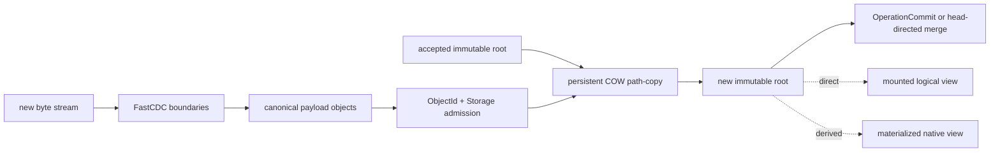

# CAS, CDC, COW, and deduplication

Status: **normative storage and cost model**. LayerFS has exactly two retained
version levels:

- a `Layer` in a `LayerStack`; and
- an `OperationVersion` in a `Branch`.

There is one public commit action: `OperationCommit`, which records one
`OperationDelta`, creates one `OperationVersion`, and moves the destination
Branch head with expected-head protection. The only merges are
`ChildBranchMerge` into the immediate parent Branch head and `LayerStackMerge`
from any Branch depth into its inherited originating LayerStack head. None of these operations copies unchanged
file bytes.

LayerFS has more than one kind of sharing. Calling all of them “deduplication”
hides important costs.



**Chunking happens only when new byte streams are converted into canonical file
content. Canonical deduplication happens immediately afterward, at every Storage
`put`.** Reads, merges of already canonical roots, materialization, reopen,
fork, and compaction do not rechunk.

## 1. Five mechanisms that must remain distinct

| Mechanism | Unit of equality | Where it happens | What it saves |
|---|---|---|---|
| payload content dedup | complete canonical payload-object bytes / `ObjectId` | `layerfs-storage` object admission | duplicate chunk rows/bytes |
| structural object dedup | complete canonical node/root/record bytes / `ObjectId` | the same Storage admission | identical tree, file-state, inode, namespace, metadata objects |
| COW structural reuse | an existing child/payload `ObjectId` is referenced by a new parent | core split/join/path-copy | rewriting unchanged payloads and subtrees |
| SQLite uniqueness | exact `object_id` key | `layerfs_objects.object_id UNIQUE` | a second physical row for one canonical object in one database |
| APFS clone/block sharing | native filesystem blocks | optional projection route | native copy/write allocation; never canonical storage |

`ContentDigest` is not a sixth canonical Store key. External capture uses it to
recognize that a native file has the same logical bytes as its prior
`FileStateRoot`, avoiding a rebuild. Current-source evidence uses a
process/WorkingStore-policy-lifetime memory cache; the target admits only a
bounded cache and otherwise evicts or streams from disk-backed state. It never
holds a complete workspace/version digest inventory in memory. Source:
[`capture.rs`](../../crates/layerfs-vfs/src/capture.rs).

The historical selected-mapping `ChunkId`/`raw_id` is likewise not the
canonical payload key. It hashes raw chunk bytes under the object domain; the
v3 rope persists `encode_Bytes(chunk)` under that canonical object's
`ObjectId`. Only the latter addresses the `layerfs_objects` payload row.

## 2. The exact canonical admission law

For each payload, node, file-state record, inode record, metadata value, or
namespace root:

```text
canonical = exact codec bytes
id        = BLAKE3("layerfs/object\0" || canonical)

if id is absent:
    insert exactly one immutable row
else:
    require exact incumbent equality
    return Reused
```

The SQLite schema enforces `object_id BLOB NOT NULL UNIQUE`. Product insertion
derives the candidate ID from the complete canonical bytes, validates its role,
checks for an exact existing candidate, and inserts only on absence. An unequal
incumbent is an immutable conflict, never an overwrite. Current-source evidence
is in:
[`layerfs-engine/src/lib.rs`](../../crates/layerfs-engine/src/lib.rs) and
[`publication.rs`](../../crates/layerfs-engine/src/publication.rs).

Important counter rule:

```text
rope.chunks_created / nodes_created  = canonical emission attempts
storage.objects_created              = new SQLite object rows
storage.objects_reused               = exact storage-database dedup hits
```

Current counters use the `engine.*` prefix; the target ownership rename does
not change their meaning.

Do not infer physical dedup from `chunks_created` alone.

## 3. Operation-by-operation timing

| Operation | When chunking occurs | When canonical dedup occurs | What is reused without chunking |
|---|---|---|---|
| direct full create / full replace | while the input stream is consumed by `rope::build` | each emitted payload and then each tree/root object is put | equal objects already in this storage database |
| managed direct range edit | during publication, on the supplied replacement stream only | each replacement payload and changed structural object is put | untouched payload slices and off-spine nodes |
| managed native workspace edit | **not** when bytes are first written to APFS/spool; at `OperationCommit`, when the exact final workspace is captured | during that one Branch publication | accepted base root, untouched extents/subtrees when exact change evidence permits |
| mounted/FUSE write | **not** on each write; writes coalesce in the private dirty overlay/spool | at `OperationCommit`, when admitted dirty ranges replay through `rope::replace` | clean base ranges and unchanged namespace/inode/tree objects |
| initial arbitrary native capture | after a full semantic-digest pass, changed/new files are rewound and fully FastCDC-scanned | during the second pass and structural build | unchanged files cannot be reused because no prior root exists |
| later arbitrary native capture, unchanged file | no chunking | no file-content puts | prior `FileStateRoot` after digest equality; metadata handled independently |
| later arbitrary native capture, changed file | after the full current-file digest pass, the file is rewound and fully FastCDC-scanned | during the second current-file pass and tree build | equal chunks/nodes already present; unchanged other files reuse roots |
| read / range read | never | never | existing payload/node objects are fetched |
| cold materialization | never | never | canonical objects are read; native output is newly derived |
| exact warm no-op | never | never | admitted live presentation authority; `OperationCommit` may create history metadata while reusing the same `RootId` |
| same-size native refresh | never for projection itself | never | existing canonical target; APFS may clone and patch native blocks |
| reopen | never | never | existing objects/refs; Verified may authenticate the retained union |
| `LayerBranchFork` or `ChildBranchFork` | never | never | exact source `Layer` or parent `OperationVersion`; only Branch/version metadata changes |
| state-changing `OperationCommit` | only dirty/replacement byte streams | at every emitted payload/node/record before the head transaction | all exact unchanged objects |
| `ChildBranchMerge` / `LayerStackMerge` | never when the candidate root is already canonical | never | the candidate root and all shared objects; only destination-head/version metadata changes |
| offline compaction | never | no semantic/object rewrite | each reachable `ObjectId` is copied once; unreachable IDs are omitted |
| explicit rope repack | full logical stream is rechunked | every rebuilt object is admitted normally | any equal payload/node objects the rebuilt shape happens to reproduce |

The managed replay path is implemented in
[`managed_edit.rs`](../../crates/layerfs-vfs/src/managed_edit.rs); mounted dirty
publication persistence is currently implemented by the internal
`MountedWorkspace::checkpoint` mechanism in
[`mounted.rs`](../../crates/layerfs-vfs/src/mounted.rs); the common chunk/build
and splice path is in
[`content/rope.rs`](../../crates/layerfs-core/src/content/rope.rs).

## 4. Full create

### Direct logical import

```text
read <=32-KiB chunk window
  -> FastCDC emits chunk
  -> encode canonical Bytes object
  -> ObjectId
  -> Storage Create/Reused
  -> append ExtentSliceV3
  -> emit bounded B+ nodes
  -> Storage Create/Reused for every node and FileStateV3
```

The source is read once by the canonical builder. A repeated deterministic
import of the same complete file in the same storage database normally
reproduces and reuses the payload, extent nodes, and `FileStateV3` objects.
Namespace objects may still differ when a newly allocated issuer-StorageId
`InodeId`, name, metadata, or topology differs. Existing InodeIds inside
synchronized roots transfer unchanged between storage databases.

### Initial external-directory capture

External capture has no authoritative changed-byte journal. It first streams
every regular file into `ContentDigestWriter`. A new file has no prior digest,
so the file is rewound and streamed again through FastCDC/CAS. Therefore initial
external capture is deliberately two-pass per regular file:

```text
current digest bytes = F
changed current CDC bytes = F
total current native file bytes read = 2F
```

This is a capture-authority cost, not a failure of payload dedup.

## 5. Managed and mounted edits

For a replacement of `B` bytes in an `F`-byte file:

```text
FastCDC bytes scanned                 = B
unchanged suffix payload bytes read  = 0
unchanged suffix payload bytes put   = 0
new/reused payload candidates        ~= chunks(B)
new structural candidates            = replacement tree + O(tree height)
```

The old rope is split by byte measures. A split inside a payload creates two
`ExtentSliceV3` references to the same payload ID. The replacement is chunked
independently; the old suffix is joined by identity and is not rechunked.

This split/join and whole-root update are `layerfs-core::logical` computation
over generic Core object access. The caller supplies the object adapter;
`layerfs-storage` performs CAS admission afterward. Core does not own the
Storage connection, Branch head, OperationWorkspace, or publication.

For materialized and mounted workspaces, temporary bytes may first exist in a
LayerFS-owned spool, dirty overlay, or native workspace. This is private
operation state, not canonical storage. Chunking/dedup waits until
`OperationCommit`, so many syscalls from one tool operation converge on one
canonical candidate and one Branch-head publication.

Consequences:

- repeated writes to the same dirty range can be coalesced before canonical
  admission;
- a crash before `OperationCommit` does not create an accepted
  `OperationVersion`;
- one state-changing `OperationCommit` emits one expected-head transaction and
  one SQLite visibility COMMIT;
- retained history shares old payloads and nodes instead of mutating them.

The current Rust implementation still has internal methods named
`checkpoint`. Those names describe lower-level persistence mechanisms; they do
not add a second product commit action and must remain behind
`OperationCommit`.

### 5.1 Same-host parallel operations

One execution host/security domain normally uses `layerfs-working-store` over
one disk-backed working storage database, and `layerfs-workspace` creates many
private `OperationWorkspace`s:

```text
Working storage CAS: shared immutable objects and WorkingRecorded versions
Workspace A:   pinned base + private dirty ranges/spool A
Workspace B:   pinned base + private dirty ranges/spool B
Workspace C:   pinned base + private dirty ranges/spool C
```

All workspaces may read the same immutable payload and tree objects. They never
share dirty state. If A and B start from the same Branch head, both can build
candidates concurrently, but only the first matching expected-head
`OperationCommit` advances the Branch. The stale candidate remains addressable
and the second commit returns `Conflict`; LayerFS does not silently overwrite,
retry, or merge it.

Space during the operations is therefore:

```text
shared accepted base objects
+ unique dirty bytes/spool for each active workspace
+ unique new canonical objects produced at each OperationCommit
```

It is not one full canonical copy of the base per operation.

Different hosts use different Working Stores and never act as peer authority.
Each host deduplicates all of its Branches/workspaces in its own CAS and exchanges
accepted state only through the Durable Store using Fetch/Push.

### 5.2 Ordinary logical-edit bounds

Let `B` be replacement bytes, `E` total extents, and `P` the sum of
namespace/inode tree heights on changed paths. The intended
ordinary edit bound is:

```text
time  = O(B + log E + P) + one WorkingStore Branch-head transaction
space = O(tree height * bounded node fanout + bounded streaming buffers)
```

For a local 4-KiB insert into a large mounted file, LayerFS scans the 4-KiB
replacement and path-copies affected spines. It must report zero unchanged
suffix payload bytes read or written. A full replacement is honestly
`Theta(F)`; an explicit repack or malformed/adversarial structure is a separate
charged route, not the ordinary edit bound.

The frozen FastCDC window is 8/16/32 KiB. Product stream buffers are at most
1 MiB, owned logical userspace `Q` is admitted below 8 MiB, and payload batches
contain at most 64 references. Dirty data beyond memory is streamed to an
owned disk spool under an explicit limit. Working Store/cache state is
disk-backed. No operation may use an in-memory workspace database, hydrate or
buffer a complete mounted file, or collect all file extents, the complete
namespace, object closure, workspace, or version population in memory. These
bounds are independent of file/workspace/version size and require queue/buffer
high-water and terminal counters.

## 6. Arbitrary native capture

An external editor supplies neither exact dirty ranges nor complete event
authority. Current capture therefore walks the complete supported namespace and
computes a semantic digest for each current regular file.

For an existing file:

```text
current_digest = stream(native current file)                   // F_current
prior_digest   = memory hit
              or stream(authenticated prior FileStateRoot)     // F_prior on miss

if current_digest == prior_digest and metadata is equal:
    retain prior FileStateRoot and InodeRecord
    CDC current bytes = 0
else:
    rewind native current file
    FastCDC + CAS + tree build                                  // F_current again
```

Thus a changed file may cost `2 * F_current + F_prior_on_cache_miss` byte
streaming before SQLite/tree overhead. The reward is exact arbitrary-editor
correctness plus chunk-level reuse after the changed file is rebuilt. A watcher,
mtime, or FSEvent is not silently treated as exact byte-range evidence.

Metadata equality is independent: chmod-only or mtime-only capture may retain
the file-content root while replacing metadata objects.

## 7. Mounted access versus native materialization

Both presentations use the same canonical roots, but they have different
physical costs.

### Mounted/FUSE

A mount resolves paths and file offsets directly through the namespace, inode,
metadata, and extent trees. It does not first build an ordinary native copy of
the complete file. A count-changing edit therefore changes logical extent
references and affected persistent-tree spines; it does not require LayerFS to
shift the unchanged suffix through an APFS/ext4 file.

During one operation:

```text
kernel writes
  -> private dirty ranges and bounded spool
  -> reads overlay dirty bytes on the pinned immutable base
  -> OperationCommit
  -> FastCDC only admitted replacement streams
  -> CAS admission + persistent COW path-copy
  -> Branch expected-head transaction
```

Concurrent mounts share immutable objects from the working storage database but have separate
handles, dirty maps, spools, and expected Branch heads.
Every mount syscall terminates at that nearby Working Store and private driver;
there is no per-syscall Durable RPC or whole-file mount hydration.

### Native materialization/APFS

A materialized workspace contains real host files for unrestricted native
tools. Cold materialization must emit the complete requested output. At
`OperationCommit`, capture must establish the exact final namespace, metadata,
hard-link topology, and file bytes. Without an authoritative dirty journal,
capture and changed-file discovery are honestly linear in the inspected
workspace/file population.

APFS clone/patch can reduce physical work for eligible same-length changes.
Ordinary middle insertion or deletion in a native file may still require suffix
movement or full-file fallback. CAS dedup can reuse canonical chunks after the
bytes are captured; it cannot make that native rewrite disappear.

### Merge is not refresh

`ChildBranchMerge` and `LayerStackMerge` merge an already canonical candidate
toward the destination head. The merge transaction reuses its exact `RootId`;
it does not materialize, capture, or rewrite physical files. If a live native
presentation must follow the newly accepted head, a later refresh applies only
qualified changed paths/ranges, uses clone/patch when eligible, and reports an
explicit full fallback otherwise. Physical refresh is presentation work, never
part of canonical merge correctness.

Portable diff/merge candidate computation belongs to
`layerfs-core::logical::{diff,merge}`. WorkingStore/DurableStore policy validates
the product request and Storage performs the exact head transaction; no merge
policy or SQL enters Core.

Reads and materialization consume already canonicalized objects. They do not
run FastCDC and do not create CAS rows.

| Route | Canonical effect | Native effect |
|---|---|---|
| SDK / `core::logical` range read | fetch extents/payloads under the selected integrity-mode validation | return requested bytes only |
| cold native materialization | none | stream the complete selected tree/files; `Theta(output bytes)` |
| exact live no-op | none | no native byte write |
| same-size materialized refresh | none | optional APFS clone + changed-range patch, or explicit full fallback |
| different-size ordinary native refresh | none | current implementation may shift/rebuild/full-fallback the native file |

APFS clone sharing is physical and opportunistic. It can reduce allocated blocks
or copied bytes in a native workspace, but it:

- does not create or prove an `ObjectId`;
- does not deduplicate SQLite/CAS rows;
- is not portable to every filesystem;
- may change after native writes or filesystem maintenance; and
- never substitutes for exact output verification and publication authority.

Mounted/FUSE reads avoid creating a complete native copy; that is projection
avoidance, not an additional form of CAS deduplication.

## 8. Forks, versions, merges, reopen, and compaction

### Two forks and two version levels

`LayerBranchFork` creates a top-level Branch from a retained `Layer` of one
LayerStack. `ChildBranchFork` creates a child Branch from an exact completed
`OperationRecordRef` of its immediate parent Branch. Both copy zero canonical
objects and chunk zero bytes.

Any child may repeat that rule and become the immediate parent of another child;
arbitrary depth adds Branch/origin/version metadata, not canonical payload
copies. Reparenting, cycles, or skipping the immediate parent for a Branch merge
are invalid. Every descendant also inherits the originating LayerStack and may
directly prepare/LayerStackMerge its complete inherited root plus its accepted
changes into that exact stack; the source Branch survives.

An `OperationCommit` creates the next `OperationVersion` on a Branch. A
`ChildBranchMerge` creates the next parent-Branch `OperationVersion` by merging
toward the current parent head. A `LayerStackMerge` accepts a prepared candidate
from any Branch depth as the next visible `Layer` by merging toward the inherited
originating LayerStack head. Both merges use
expected-head protection and preserve a conflicting candidate.

Rollback similarly moves a Branch or LayerStack head to an already retained
version after lease preflight. Logical versions are cheap even though every
active operation still needs separate bounded workspace resources.

### Reopen

Reopen loads existing storage/ref/profile state. It performs no chunking and no
dedup. `Verified` may hash and validate the complete required retained closure;
`TrustedLocalDev` skips fetched-row identity hashing under its explicit weaker
contract. A later Verified open after trusted history must scrub before any
Verified use. See [`poc/22`](../../poc/22-stage1.1-trusted-localdev-materialization.md).

### Compaction

Offline compaction is not rechunking:

```text
authenticate complete source object index
mark union reachable from every retained root/ref
copy each marked ObjectId and its exact canonical bytes to a sibling storage generation
copy refs/authority metadata
COMMIT and reverify retained union
atomically select the new storage generation
remove old generation only after safe selection/reopen
```

It removes unreachable objects and SQLite free space by replacement-generation copy.
It does not discover new semantic duplicates, change chunk boundaries, change
roots, or compact native APFS workspaces. Current-source evidence:
[`layerfs-engine/src/lib.rs`](../../crates/layerfs-engine/src/lib.rs) and
[`generation.rs`](../../crates/layerfs-engine/src/generation.rs).

## 9. Space equations

Within one physical storage database:

```text
canonical_live_bytes
  = sum(size(canonical object) for each unique reachable ObjectId)

retained_store_bytes
  = unique payload canonical bytes
  + unique extent/directory/inode/metadata/root canonical bytes
  + SQLite row/index/page overhead
  + retained Layer/OperationVersion/Branch/policy history rows

physical_total
  = retained_store_bytes
  + SQLite journal/temp during operations
  + owned workspace spool/scratch
  + derived native workspaces/materializations
```

For a 100-MiB base and ten parallel operations that each commit a unique 64-KiB
logical edit:

```text
canonical payload is approximately
    one shared 100-MiB base
  + at most about 640 KiB unique replacement payload
  + boundary/chunk framing

additional canonical structure is
    ten replacement trees
  + O(10 * tree_height) path-copied nodes
  + inode/namespace/ref records
```

It is not ten 100-MiB canonical copies. Ten mounted operations share the
immutable base and pay for their private dirty state. Ten cold native
materializations can still consume about ten workspaces' apparent output, less
only whatever block sharing the host proves. Always report logical, apparent,
and allocated native/Store bytes separately.

Across multiple Working databases and the Durable database, the same `ObjectId`
may have one physical row under each StorageId. Fetch/Push sends hashes/ObjectIds
first and streams resumable bounded batches only for negotiated missing objects;
objects already known present are not transferred. Concurrent negotiation races or lost
responses may retransmit equal bytes and must be charged. This provides dedup
within each database; it does not claim one physical copy or exactly one transfer
across stores.

DurableStore retains pushed Branch/Operation history and LayerStack state. A
Branch Push may create the durable Branch or advance its exact durable head; it
does not move a LayerStack. `LayerStackMerge` is a separate expected-head action
and may use a complete inherited candidate from any Branch nesting depth.

## 10. Limits and non-deduplicable costs

Deduplication does **not** remove:

1. the CPU needed to scan and hash newly supplied bytes;
2. the `Theta(F)` output of a cold complete native materialization;
3. the full namespace/file scan required for unjournaled external capture;
4. SQLite rows/pages/indexes, rollback journal, and transaction sync costs;
5. new path-copied nodes whose summaries or child IDs differ;
6. newly allocated issuer-StorageId inode records or metadata/ref records whose
   canonical fields differ;
7. fragmentation from a history-shaped rope after many tiny edits;
8. changed native blocks, temporary projection files, or bounded dirty spools;
9. a verified cache copy in another storage database or on another host; or
10. semantically equal files that have different operational roots, except when
    a digest comparison can safely retain the prior root.

No compression or pack carrier is active in the current storage implementation. Those
would be physical-storage policies behind `ObjectId`, not replacements for CDC,
CAS, COW, or SQLite publication. The frozen design and rejection rationale are
in [`poc/00`](../../poc/00-scope-and-decisions.md) and
[`poc/02`](../../poc/02-data-structures-and-algorithms.md).

## 11. Required observability

Product evidence should report at least:

```text
cdc_bytes_scanned / chunks_created
payload_bytes_read / payload_bytes_written
nodes_read / nodes_created by structure
objects_created / objects_reused
put lookups / inserts / created rows / reused rows
unchanged_file_roots_reused
current_digest_bytes / uncached_prior_digest_bytes / changed_current_cdc_bytes
native route / bytes read / bytes written / patch / shifted / fallback bytes
transactions / publication COMMITs
Store logical/apparent/allocated bytes
native logical/apparent/allocated bytes
Q current/high-water/terminal and spool/scratch residue
```

A speed or storage claim is valid only when the compared inputs, roots,
integrity mode, requested work, publication count, and native route are the same.
