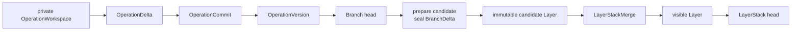
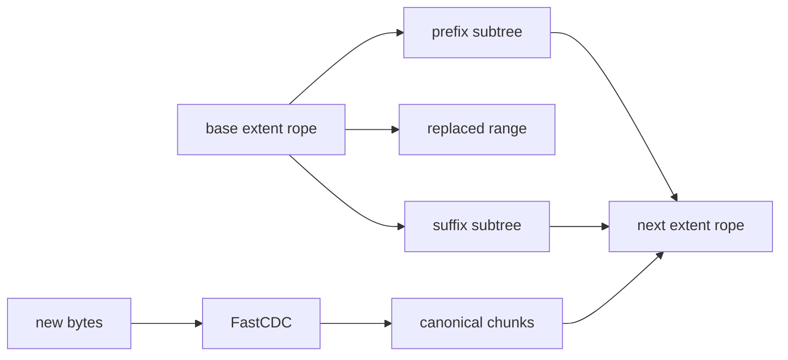
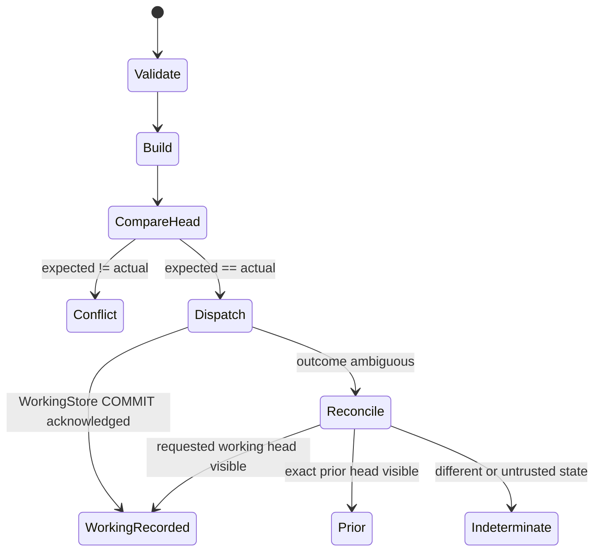

# Core LayerFS operations

Status: normative product contract with current-source status as of 2026-08-27.
An implemented lower-level route is not automatically the complete public
Operation/Branch/LayerStack lifecycle.

Target ownership is split deliberately: `layerfs-workspace` owns isolated
operation execution; `layerfs-working-store` and `layerfs-durable-store` own
WorkingRecorded/DurablyAccepted policy; `layerfs-storage` owns shared records
and exact transactions; `layerfs-sync` performs explicit Fetch/Push transfer;
`layerfs-core::logical` owns portable resolver/read/mutate/diff/merge
computation through generic object access.

Terms are defined in
[`../00-foundation/glossary.md`](../00-foundation/glossary.md).

## 1. One canonical filesystem, two version levels



LayerFS has one canonical filesystem graph:

```text
RootId
  -> namespace B+ trees
  -> inode-table B+ tree
  -> metadata objects
  -> FileStateV3
     -> byte-measured extent B+ rope
     -> immutable canonical payload objects
```

It has two version levels over that graph:

- a Branch advances through `OperationVersion` records;
- a LayerStack advances through `Layer` records.

`main` may be the name of a default LayerStack, but a LayerStack is an accepted
Layer lineage, not a Branch. Branches are first-class retained objects, may nest
to any depth, and keep their OperationVersion histories independently of every
merge. A pushed Branch can be DurablyAccepted; unpushed Branch state exists only
in WorkingStore.

The root remains directly readable. Neither level requires replaying its full
delta history to reconstruct state.

## 2. CAS + CDC + COW and deduplication

FastCDC uses the frozen 8/16/32 KiB minimum/target/maximum profile. For each
new or replacement stream:

1. CDC finds content-stable chunk boundaries;
2. each canonical chunk is addressed by `ObjectId`;
3. CAS inserts a missing object or authenticates and reuses an incumbent;
4. persistent COW trees path-copy only changed spines;
5. the candidate `RootId` reuses every unchanged object by identity.

Equal canonical bytes in the same storage database therefore occupy one canonical object
regardless of how many OperationVersions, Branches, child Branches, or Layers
reference them. Deduplication happens during canonical insertion; it is not a
later whole-file or whole-database scan.



The same logical data model serves direct APIs, mounted workspaces, and native
materializations. Native APFS clone/reflink is an optional presentation
optimization, never canonical identity or deduplication authority.

## 3. Cost model

| Symbol | Meaning |
|---|---|
| `B` | new/replacement bytes supplied by the operation |
| `E` | extent occurrences in one file |
| `X` | extents intersecting a requested range |
| `R` | bytes returned |
| `D_i` | entries in directory component `i` |
| `I` | inode-table entries |
| `N` | namespace objects/paths |
| `U` | objects in the retained reachable union |

Required product bounds:

| Operation | Required work |
|---|---:|
| resolve path | `sum_i[O(log D_i) + O(log I)]` |
| read range | path + `O(log E + X + R)` |
| exact logical splice | path + expected `O(B + log E)`; unaffected suffix reads/writes `0` |
| content-root update | `O(log I)`; content-only edit emits `0` directory nodes |
| namespace mutation | affected directory/inode/metadata spines only |
| fork | metadata only, no payload/tree copy |
| OperationCommit | changed canonical work plus one short expected-head transaction |
| ChildBranchMerge | delta validation/application plus changed spines and one short parent-head CAS |
| LayerStackMerge | candidate verification plus one short LayerStack-head CAS |

Honest linear paths remain:

- cold materialization of a complete physical workspace;
- complete capture of an arbitrary uninstrumented native workspace;
- Verified full-closure scrub when required;
- reachability marking and offline compaction;
- native count-changing file shifts when the host representation must move a
  suffix and no exact host primitive avoids it.

No fast-path implementation may construct an all-extents vector, clone a
complete namespace map, or retain unbounded dirty data. Product buffers remain
bounded; operation-owned `Q` must have a cap, high-water observation, and
terminal-zero accounting.

## 4. Logical file operations

The SDK is a filesystem/version API, not an agent-tool taxonomy. Immutable exact
versions support `stat`, `list`, `read_range`, `stream`, and `readlink` directly,
without allocating an OperationWorkspace, moving a head, or invoking Sync.
Mutation primitives are available only inside a private direct logical
OperationWorkspace and route to `layerfs-core::logical`; names such as edit,
patch, Bash, shell, or npm are not LayerFS operations.

### 4.1 Range read

Input is an exact `RootId`, canonical path, and checked byte range. Resolution
uses namespace/inode trees, then the extent rope locates only intersecting
extents. Reads remain pinned to the supplied root for the complete call.

```text
cost = path + O(log E + X + R)
```

Verified reads authenticate fetched canonical bytes. `TrustedLocalDev` is an
explicit WorkingStore-policy lifetime and cannot authorize durable publication.

Current status: SDK/VFS and mounted reads are implemented.

### 4.2 Full create or replace

The input stream is FastCDC-scanned once, canonical payloads/nodes are inserted
or reused, and affected inode/namespace spines are path-copied.

```text
cost = Theta(file bytes + emitted chunks) + path work
```

Current status: implemented by the direct SDK route and lower-level mounted and
native routes.

### 4.3 Arbitrary splice

The canonical primitive supports overwrite, insertion, deletion, append, and
truncate:

```text
replace(file_root, start, delete_len, replacement):
    left, tail     = split(file_root, start)
    removed, right = split(tail, delete_len)
    middle         = FastCDC(replacement)
    return concat(left, middle, right)
```

Only replacement bytes are chunked. Unaffected prefix/suffix extents remain
shared. A normal POSIX `write(2)` overwrites or extends; it is not a semantic
middle insertion. LayerFS preserves edit-sized canonical work when the direct
or mounted route supplies exact logical mutation evidence.

Current status: persistent rope splice and direct SDK range replacement are
implemented. Native APFS may still pay suffix-shift cost in its physical file
even though the resulting canonical root shares unchanged objects.

## 5. Namespace, inode, link, and metadata operations

| Operation | Canonical effect | Expected work |
|---|---|---:|
| create file/directory/symlink | path-copy parent directory and inode spines | `O(log D_parent + log I)` plus new data |
| link/unlink/rmdir | update directory entry and link topology together | affected directory spines + `O(log I)` |
| rename | change one or two directory spines without copying payload | `O(log D_src + log D_dst + log I)` |
| chmod/mtime/supported metadata | replace metadata value and inode spine | metadata bytes + `O(log I)` |

Hard-link aliases are one logical inode. A merge or materialization route may
not replace one alias and then claim complete authority while leaving siblings
unreconciled.

Current status: mounted VFS implements ordinary filesystem mutations; native
capture reconstructs supported links and metadata. The direct SDK intentionally
does not duplicate the complete POSIX namespace API.

## 6. Exactly one commit action

### OperationCommit

`OperationCommit` is the only public commit action. It accepts:

```text
OperationCommitRequest {
    operation_id
    branch_id
    expected_branch_head
    pinned_base_version
    candidate_root
    normalized RootTransition
}
```

One accepted state-changing action atomically:

1. authenticates new and incumbent canonical objects;
2. verifies the candidate root and delta endpoints;
3. compares the complete expected Branch head inside the writer transaction;
4. inserts the `OperationDelta`;
5. creates one `OperationVersion`;
6. advances the Branch head/generation;
7. dispatches one SQLite visibility `COMMIT`;
8. returns the newly accepted exact Branch head and `OperationRecordRef`.

If another Operation or child merge already advanced the Branch, the action
returns `Conflict`. It never retries or rebases implicitly. The immutable
candidate root/delta remains locally durable for explicit inspection, rebase,
merge, or drop.

An explicitly accepted no-filesystem-change Operation still creates an empty
`OperationDelta` and a new `OperationVersion` because operation history changed,
even though it creates no new payload/tree objects and reuses the same `RootId`.
An aborted/discarded Operation creates neither record.

An OperationCommit accepted only by WorkingStore returns `WorkingRecorded`, not
system durability. A later explicit `Push` may transfer the same
Operation/OperationVersion/OperationDelta identities to DurableStore, which
independently verifies and accepts them rather than creating a second commit
identity. Until then, those records remain WorkingStore-only.

Current-source evidence: `layerfs-engine` already implements root-level
expected-ref publication, one visibility COMMIT, incumbent authentication, and fresh
ambiguous-outcome reconciliation. Durable Operation/OperationVersion/Delta
records and the unified public action are Target in Storage plus the
WorkingStore/DurableStore policies.

## 7. Exactly two forks

### 7.1 LayerBranchFork

```text
specific retained LayerRef
    -> new top-level Branch
```

The Branch stores its originating LayerStack and base Layer. Its effective
head is the forked Layer root until its first OperationVersion exists. It may
prepare a candidate and merge only toward that originating LayerStack head.
Every descendant inherits the same immutable originating LayerStack identity.

Cost is metadata-only: no chunks, extents, or namespace nodes are copied.

### 7.2 ChildBranchFork

```text
specific completed OperationRecordRef on parent Branch
    -> new child Branch
```

`OperationRecordRef` binds parent Branch, Operation, OperationVersion, and
`RootId`. The child stores that exact fork origin. Its only legal
branch-to-branch merge is toward its exact immediate parent Branch head. It also
inherits the top-level ancestry's originating LayerStack and may independently
perform a direct `LayerStackMerge` to that LayerStack.

The rule applies recursively without a product-level depth limit: any Branch
may become the immediate parent of another child, but the new child must fork
from an exact completed **operation-created** `OperationRecordRef` on that
parent. Origin and parentage are immutable. Storage rejects sibling, cousin,
unrelated, parent-to-child, child-to-grandparent, cycle, reparent, and every
other skipped-edge branch merge. A direct LayerStack merge is different: any
depth may target the inherited originating LayerStack, and no other LayerStack.

Cost is metadata-only. The child and parent initially share the complete
immutable canonical graph.

Current status: root/ref fork primitives exist. Origin-bound Branch records and
the two qualified public APIs are Target.

## 8. Exactly two merges

Both merges move **toward one exact destination head** through explicit
expected-head comparison. Neither silently overwrites a winner, retargets a
candidate, consumes the source Branch, or changes Branch ancestry.

WorkingStore may execute `ChildBranchMerge`, producing a WorkingRecorded parent
`OperationVersion` and Branch head. For `LayerStackMerge`, WorkingStore only
prepares and retains the candidate Layer/LayerDelta; it never moves a LayerStack
head. Explicit `Push` transfers the exact records and request. DurableStore
revalidates them and returns `DurablyAccepted` only after its distinct storage
database accepts the requested Branch or LayerStack head transaction.

### 8.1 ChildBranchMerge

Child and parent are parallel universes after the exact fork OperationVersion:

```text
base        = exact parent OperationVersion named by child.origin
source      = exact selected child Branch head
destination = exact expected immediate-parent Branch head
result      = three_root_merge(base, source, destination)
```

The sealed `BranchDelta` binds all four roots and the source transition
`base -> source` plus applied transition `destination -> result`. The merge
validates immutable parentage, authenticates the roots, creates one parent
`OperationVersion`, and advances only the exact immediate parent through one
expected-head transaction. The child Branch and all of its history survive
unchanged.

The caller supplies the complete expected parent head. If it moved after
candidate construction, LayerFS returns `Conflict`, retains the candidate and
child, and performs no implicit retry. A later explicit attempt recomputes from
the same immutable fork base and selected child head against the newly observed
parent head. It never rewrites the old candidate's destination. Repeated child
merges are valid: identical changes already present in the parent coalesce, and
only later child divergence is added when the three-root rules prove a unique
result.

The canonical conflict matrix is:

| Source change from base | Destination change from base | Result |
|---|---|---|
| different paths/subtrees | different paths/subtrees | merge both; shared identity skips untouched subtrees |
| identical canonical result | identical canonical result | coalesce to that result; not a conflict |
| same file, proven non-overlapping stable ranges | same file, proven non-overlapping stable ranges | compose only when exact same-base range evidence proves coordinate and hard-link safety |
| differing overlapping byte ranges | any overlapping byte change | conflict |
| delete | modify, rename, link, metadata, or type change of the same object | conflict; identical deletion may coalesce |
| file/directory/symlink or hard-link topology change | incompatible type/topology change | conflict unless canonical results are identical |
| metadata field change | disjoint field change | merge; identical same-field result coalesces; differing same-field result conflicts |
| count-changing splice | another same-file edit | merge only with an exact unambiguous coordinate transform and non-overlap proof; otherwise conflict |

Fail-closed metadata and hard-link closure rules still apply after an otherwise
mergeable path comparison. Shared identity makes a locally derived merge
proportional to visited changed spines where possible. Arbitrary roots remain
worst-case `Theta(nodes(base) + nodes(source) + nodes(destination))`.

### 8.2 LayerStackMerge

Any Branch depth may merge directly to the one originating LayerStack inherited
from its top-level `LayerBranchFork`. Before visibility, LayerFS performs
**Layer candidate preparation**:

```text
base        = inherited top-level origin Layer
source      = selected Branch head's complete RootId
destination = exact current LayerStack head supplied by the caller

base -> source
    = seal source BranchDelta
    + detect overlap with base -> destination
    + apply non-conflicting result toward destination
    + verify closure
    + create immutable candidate Layer whose parent is destination
```

For a nested source, the complete source root includes all parent-Branch state
visible at its exact child-fork OperationVersion plus the child's later changes.
It is not reduced to changes authored only after the child fork. The three-root
merge therefore proposes that complete state against the current LayerStack
head while using the inherited origin Layer as base.

Older drafts called this `BranchCommit`; it is not another public commit action
and does not move the LayerStack head.

`LayerStackMerge` then validates:

- candidate belongs to the Branch's originating LayerStack;
- every ancestor inherited that same originating LayerStack identity;
- candidate parent equals the exact expected LayerStack head;
- candidate root/LayerDelta closure is authenticated;
- no admission or lease rule is violated.

One expected-head transaction makes the candidate the next visible Layer and
advances the LayerStack head. A stale head yields `Conflict`; the candidate
Layer and source Branch remain preserved. A later attempt must recompute a new
candidate against the newly observed LayerStack head; it cannot retarget the
stale candidate. Successful LayerStackMerge also leaves the source Branch alive,
so later Operations and repeated merges remain valid.

The only branch-to-branch merge is child to exact immediate parent. Direct
LayerStackMerge from any depth is the only permitted skipped-level destination
operation, and only to that Branch tree's originating LayerStack. Cross-tree
content/version reads and immutable references are allowed, but create no merge
edge. A future selective-apply/cherry-pick facility is Deferred and, if added,
must execute as an ordinary isolated Operation followed by `OperationCommit`,
not as a third merge.

Current status: current refs/publication supply guarded root movement. Candidate
Layer, BranchDelta/LayerDelta, and qualified merges are Target.

## 9. Two hard rollbacks

| Operation | Destination | Rule |
|---|---|---|
| **BranchRollback** | earlier OperationVersion on the same Branch | preflight suffix leases, expected-head CAS, move head, logically drop/release unused Branch suffix |
| **LayerStackRollback** | earlier Layer on the same LayerStack | preflight suffix leases, expected-head CAS, move head, logically drop/release unused Layer suffix |

Rollback is rejected while a Branch, child Branch, OperationWorkspace, mount,
materialization, candidate preparation, merge, sync, or explicit lease depends
on the suffix. Hard rollback never deletes shared CAS rows in place. Verified
reachability compaction later reclaims only objects unreachable from every
retained version and lease.

Current status: guarded ref movement and compaction exist; typed version leases,
suffix release, and the two rollback actions are Target.

## 10. Mount versus materialization

Both presentations produce the same candidate RootId/RootTransition and pass
through the same OperationCommit, which binds an accepted result as one
OperationDelta. Their mutation-discovery and physical costs differ.

LayerFS returns the private mount/materialized view path to an external runtime;
it does not launch or interpret the tool. A generic process/handle guard may
track descendants and writers solely to prove quiescence. Regardless of how
many filesystem calls or child processes the external invocation creates, the
one workspace boundary yields one normalized candidate transition; an accepted
commit records one OperationDelta.

| Property | Mount (for example Linux/FUSE) | Materialization (for example macOS/APFS) |
|---|---|---|
| Base representation | immutable LayerFS graph plus private logical overlay | ordinary physical directory derived from a root |
| Reads | resolve extents and fetch canonical chunks, normally from WorkingStore/cache | native filesystem reads physical files |
| Writes | record bounded dirty ranges/nodes/spool; canonicalize once at end | native applications mutate physical files first |
| Count-changing edit | extent-rope splice; no physical suffix shift in LayerFS representation | ordinary native file may shift/rewrite suffix; exact descriptor helps canonical replay but not host mechanics |
| Change discovery | exact callbacks and dirty authority | managed exact descriptors, or full quiescent scan for arbitrary external changes |
| Dedup timing | at end when dirty streams become canonical chunks | at capture/end when changed streams become canonical chunks |
| Reuse | unchanged canonical chunks/subtrees are never copied into each private workspace | APFS clone/reflink can share host blocks; canonical roots still dedup independently |
| Linear path | requested/read bytes and dirty data; cold cache fills | cold materialization and arbitrary external capture |

### Multi-operation mount

Many Operations may pin the same immutable base while each owns a private
overlay:

```text
shared base RootId
  + private overlay A -> candidate RA
  + private overlay B -> candidate RB
  + private overlay C -> candidate RC
```

They share WorkingStore CAS objects and cached chunks. Only dirty bytes and
operation metadata are private. The first `OperationCommit` whose expected
Branch head matches wins; later candidates conflict without contaminating one
another. This is where CAS + CDC + COW avoid full workspace copies and make
branch/operation count much cheaper than physical workspace count.

### Materialization at merge time

A materialized APFS workspace is derived, not authoritative. It may be retained
and refreshed after a WorkingRecorded OperationCommit or accepted merge:

1. compare known root A with accepted target root B using shared Merkle identity;
2. skip identical namespace/file subtrees;
3. clone/patch eligible changed files or apply exact same-offset patches;
4. use an explicit suffix-shift route for accepted count-changing evidence;
5. full-stream only changed ineligible files;
6. verify exact B before rotating workspace authority.

CAS deduplicates the canonical result at capture/commit. APFS clone/reflink may
reduce physical duplication, but it does not replace canonical CAS and cannot
make arbitrary native middle insertion constant-time.

## 11. Storage and synchronization boundary

Callers run `layerfs-core::logical` with a generic object-access adapter selected
by the public policy; Core itself never addresses Storage. Working and Durable
policies use the same Storage schema and transaction mechanics but always
select physically distinct databases and StorageIds:

```text
layerfs-working-store / WorkingStore
    verified cache + working objects
    private Branches and OperationVersions
    host-recoverable candidates/conflicts

layerfs-durable-store / DurableStore
    system-of-record canonical objects
    durable Branch/Operation and LayerStack/Layer history
    exact heads, transitions, retention, leases, backup/recovery

layerfs-storage
    shared records, integrity, exact expected-head transactions, compaction

layerfs-workspace
    one isolated OperationWorkspace per operation

layerfs-core::logical
    portable resolver/read/mutate/diff/merge computation only
```

There is no Storage policy discriminator or open mode. WorkingStore policy
returns `WorkingRecorded`; DurableStore policy alone returns
`DurablyAccepted`.

`layerfs-sync` is an explicit Fetch/Push transfer bridge, not a storage or
version-policy owner. `Fetch` transfers negotiated DurableStore objects and
records into WorkingStore; WorkingStore authenticates/verifies them and records
the tracking ref. `Push` transfers exact WorkingRecorded canonical/version
state and an explicit request to DurableStore; DurableStore independently
authenticates it and delegates the exact head transaction to Storage. Sync never
moves a head itself. Object upload is never durable visibility.

DurableStore retains pushed and accepted Branches, OperationVersions, and
OperationDeltas. Unpushed WorkingRecorded history remains only in WorkingStore.
Neither Fetch nor Push carries live OperationWorkspace paths, mounts, spools,
processes, handles, mappings, or recovery state.

Ordinary filesystem activity and WorkingStore-only OperationCommit never
trigger background synchronization.

## 12. Failure law

Every visibility-changing action follows:



The diagram shows WorkingStore policy. The same exact transaction invoked by
DurableStore policy ends as `DurablyAccepted`; Sync merely carries the explicit
request and receipt.

Hard rules:

1. canonical candidate construction never by itself moves a head;
2. expected-head comparison occurs inside the visibility transaction;
3. referenced records and the head transition become visible atomically;
4. each accepted state-changing action dispatches one visibility COMMIT;
5. conflicts and ambiguous outcomes are never automatically retried;
6. fresh independent reconciliation classifies requested, prior, conflict, or
   indeterminate;
7. a physical mount/materialization can never authorize canonical bytes.

## 13. Current implementation gaps

The current source already contains the difficult canonical algorithms,
authenticated Store insertion, expected-ref publication, mounted dirty state,
native capture/refresh, and offline generation compaction. Product completion
still requires:

1. LayerStack, Layer, Branch, Operation, OperationVersion, scoped delta records,
   and exact transactions in `layerfs-storage`;
2. WorkingRecorded and DurablyAccepted admission in the two public policy
   crates;
3. the one OperationCommit action, two fork/two merge APIs, recursive origin
   validation, and candidate preservation;
4. `layerfs-workspace` isolation plus mounted private `fsync` semantics so one
   arbitrary tool operation cannot accidentally create several public versions;
5. extract current VFS presentation lifecycle, move the remaining portable
   resolver/read/mutate/diff/merge code directly to `layerfs-core::logical`, and
   delete the old code without a temporary FS crate;
6. VersionLease-backed hard rollback and complete reachability;
7. explicit `layerfs-sync` Fetch/Push transfer between distinct StorageIds.

LayerFS exposes Branch/version mechanics but no MCTS, score, reward, rollout,
or search-policy model. External orchestrators may use nested Branches as MCTS
state; that orchestration remains non-normative and adds no storage concepts.

Current managed/mounted functions named `checkpoint` are lower-level source
facts. They must be routed behind OperationCommit rather than retained as
public product vocabulary.

## 14. Source map

- canonical object/identity/CDC:
  [`../../crates/layerfs-core/src`](../../crates/layerfs-core/src)
- persistent extent rope:
  [`../../crates/layerfs-core/src/content/rope.rs`](../../crates/layerfs-core/src/content/rope.rs)
- current-source Engine publication/ref transaction evidence (target owner:
  `layerfs-storage`):
  [`../../crates/layerfs-engine/src/publication.rs`](../../crates/layerfs-engine/src/publication.rs),
  [`../../crates/layerfs-engine/src/refs.rs`](../../crates/layerfs-engine/src/refs.rs)
- current VFS resolver/workspace evidence (target split: resolver semantics move
  to `layerfs-core::logical`; lifecycle moves to `layerfs-workspace`):
  [`../../crates/layerfs-vfs/src/resolver.rs`](../../crates/layerfs-vfs/src/resolver.rs),
  [`../../crates/layerfs-vfs/src/workspace.rs`](../../crates/layerfs-vfs/src/workspace.rs),
  [`../../crates/layerfs-vfs/src/mounted.rs`](../../crates/layerfs-vfs/src/mounted.rs)
- Apple/native evidence:
  [`../../poc/17-stage1-closure.md`](../../poc/17-stage1-closure.md)
- Linux/FUSE evidence:
  [`../../poc/evidence/stage2-freeze-candidate-015/README.md`](../../poc/evidence/stage2-freeze-candidate-015/README.md)
