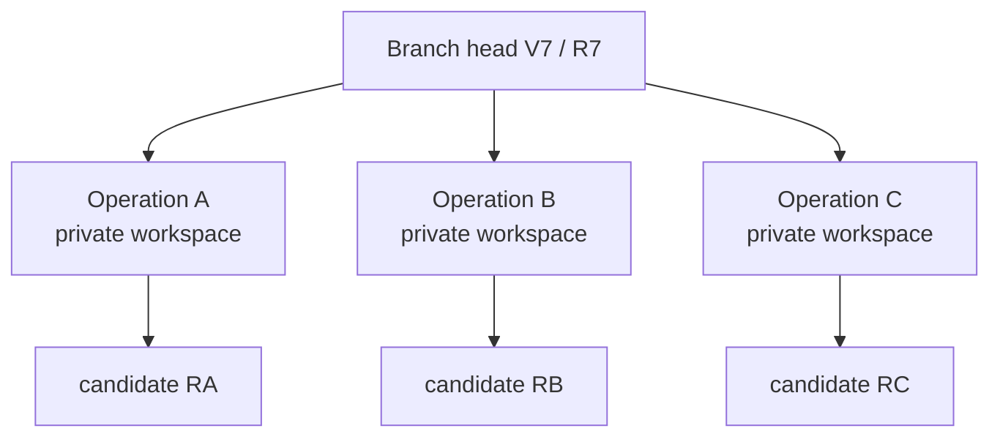
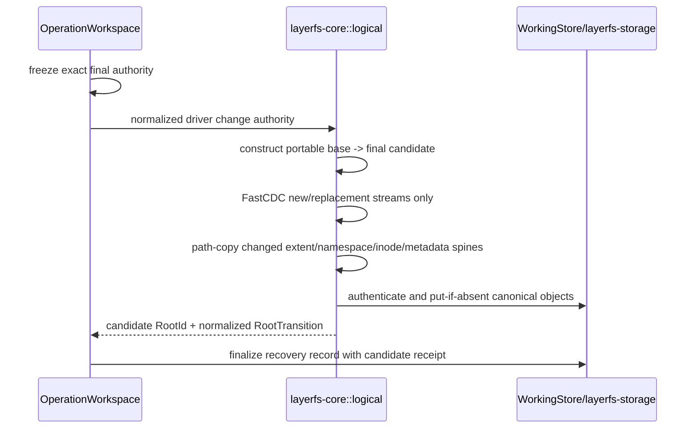
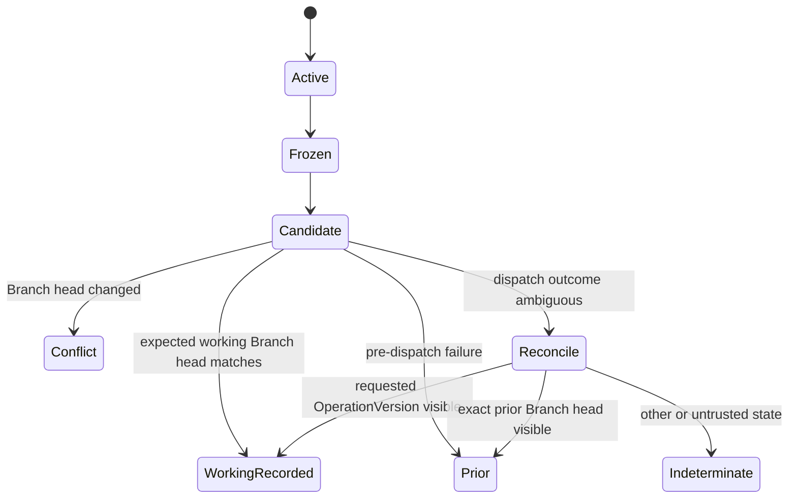

# Operation and OperationWorkspace lifecycle

Status: normative target lifecycle over existing direct, mounted, and native
routes as of 2026-08-27. The final Store/workspace crate split and durable
OperationVersion records are not yet shipped.

The invariant is simple:

> Every arbitrary operation receives one private workspace pinned to one exact
> Branch head. `WorkingStore` records its identity, pin, lease, and recovery
> state; `layerfs-workspace` owns the isolated runtime; one WorkingRecorded
> `OperationCommit` records one exact delta and advances the Branch at most once.

LayerFS does not define what an agent is allowed to do. An Operation may be one
SDK edit, an editor, Bash, `npm install`, a compiler, or a process tree that
changes thousands of files. LayerFS records the exact final filesystem effect.

## 1. Current source versus target lifecycle

| Concern | Current source | Normative target |
|---|---|---|
| direct logical access | SDK reads and edits; edits publish per call | one operation-private logical batch |
| mounted access | `MountedWorkspace` dirty overlay/spool and Linux FUSE callbacks | one private mounted `OperationWorkspace`; ref publication only at OperationCommit |
| managed native access | materialize, exact edit descriptors, current `checkpoint`, refresh/discard | one private materialized `OperationWorkspace` |
| external native access | materialize/open, cooperative writer leases, full capture/discard | runtime-supervised private workspace and exact end boundary |
| publication | root-level expected `RefState`, one COMMIT, fresh reconciliation | WorkingStore records BranchHead + OperationDelta + OperationVersion; DurableStore accepts independently on explicit Push |
| operation history | no durable public Operation/OperationVersion records | host-recoverable WorkingStore history, then separately DurablyAccepted history |
| concurrency | independent current workspaces plus expected-ref conflict | explicit private workspace per Operation and preserved conflict candidate |
| lifecycle ownership | SDK/VFS/workspace code currently overlap | WorkingStore admission/recovery; universal `layerfs-workspace`; portable `layerfs-core::logical` candidate; concrete mount/materialization drivers |

Current lower-level functions named `checkpoint` are implementation facts only.
The public lifecycle does not expose a checkpoint concept; Branch history is
made of OperationVersions and LayerStack history is made of Layers.

## 2. Universal contract and exact ownership

There is one `layerfs-workspace` lifecycle contract and no runtime
`WorkspaceMode` discriminator. The SDK selects a concrete constructor/driver;
the returned `OperationWorkspace` follows the same state machine:

```text
WorkingStore.begin_operation(branch, exact expected BranchHead)
  -> persist OperationId + exact base VersionRef/RootId
  -> acquire base-version lease
  -> persist workspace recovery record
  -> WorkspaceTicket

layerfs-workspace.start(ticket, concrete driver)
  -> private direct, mount/FUSE, or materialization/APFS runtime

layerfs-workspace.finalize()
  -> stop admission + quiesce driver
  -> layerfs-core::logical constructs candidate RootId + normalized RootTransition
  -> FinalizedCandidate

WorkingStore.operation_commit(ticket, FinalizedCandidate)
  -> bind Operation identity + RootTransition as OperationDelta
  -> one expected-Branch-head transaction/COMMIT
  -> WorkingRecorded OperationVersion or Conflict
```

The direct driver is the minimal adapter over `layerfs-core::logical`.
`layerfs-mount` and `layerfs-materialization` implement the same workspace
contract with different dirty representations. `layerfs-workspace` owns no
filesystem semantics or Store head; `WorkingStore` owns no process, mount,
native path, dirty map, or spool.

`layerfs-core::logical` is generic over the narrow `ObjectRead`/`ObjectStore`
contracts. It owns exact-version reads, mutations, candidate
RootId/RootTransition construction, root diff, and three-root merge while
remaining free of SQLite, native/host/workspace paths, platforms, workspace
state, and Branch/LayerStack authority.

Each host/security domain normally uses one disk-backed WorkingStore CAS shared
by its authorized Branches and private OperationWorkspaces. A host may use
separate WorkingStores for separate security domains. Multiple WorkingStores
synchronize accepted state only through DurableStore; no WorkingStore is peer
authority for another. The same ObjectId may have one authenticated physical row
per Store.

### 2.1 Immutable snapshot reads do not begin an Operation

The SDK exposes an exact read-only surface over a supplied `VersionRef`:

```text
stat(path)
list(directory)
read_range(file, offset, length)
stream(file)
readlink(path)
```

Each call or returned stream pins a version already verified in WorkingStore
storage for its lifetime and routes through `layerfs-core::logical`. If absent,
the caller must explicitly Fetch first. The read itself creates no
Operation/OperationWorkspace, acquires no writable Branch head, moves no head,
and triggers no sync. Any mutation—even a single direct logical edit—uses the
OperationWorkspace lifecycle.

Fetch is explicit and hash-first: it exchanges ObjectIds/record identities,
then resumes bounded missing-object/history batches into the disk-backed
WorkingStore. It never constructs a complete closure inventory in memory.

There is no implicit disposition. Tool completion does not publish
automatically; a caller may explicitly commit or discard any finalized
filesystem result; dropping a handle does not guess intent.

## 3. Branch base and operation identity

A Branch's effective head is:

```text
head OperationVersion, if one exists
otherwise its exact fork source:
    LayerRef for a top-level Branch
    OperationVersionRef identified by the child origin's OperationRecordRef
```

`WorkingStore::begin_operation` resolves that effective head once and
durably records:

```text
Operation {
    operation_id
    branch_id
    expected_branch_generation
    base_version: VersionRef  // LayerRef | OperationVersionRef
    base_root
    base_version_lease
    workspace_recovery_id
    state: Active
}
```

The Operation identity is durable/recoverable control state, not content
identity. `OperationRecordRef` is reserved for creating a `ChildBranchFork`; it
is not the general base-version type. The workspace path, mount inode numbers,
process IDs, and SQLite row IDs are never canonical filesystem identity.

## 4. Begin contract

### 4.1 Admission

`WorkingStore::begin_operation` must:

1. open the exact WorkingStore and verify working `StorageId`/integrity policy;
2. read the Branch and require complete equality with the supplied
   `BranchHead`;
3. validate that the Branch is active and its origin is intact;
4. pin the exact base version/root with a VersionLease;
5. create the `OperationId` and workspace recovery record in WorkingStore;
6. issue a single-use `WorkspaceTicket` binding WorkingStore/StorageId,
   Operation, exact head,
   base version/root, lease, and prospective resource limits;
7. let `layerfs-workspace` instantiate the caller-selected concrete driver;
8. keep WorkingStore, spool, receipt, and runtime-control files outside the
   presented tree;
9. bind mount/native custody to WorkingStore, Operation, and base root;
10. return only after the driver is usable.

No read or later callback may switch to a newer Branch head mid-operation.

### 4.2 Begin receipt

```text
BeginOperationReceipt {
    operation_id
    working_storage_id
    branch_id
    branch_head_before
    base_version
    base_root
    integrity_mode
    presentation
    workspace_binding
    workspace_recovery_id
    version_lease
    resource_limits { Q, spool, handles, writers }
    state = ActiveClean
}
```

For caller-visible native or mounted workspaces, the receipt may expose the
assigned path. The path is still presentation state, never authority.

### 4.3 Host-local workspace path custody

The default workspace root is owned by WorkingStore and adjacent to its SQLite
state, never an uncontrolled repository directory or global temporary path:

```text
<working-root>/
├── working.sqlite
└── workspaces/
    └── <operation-id>-<random-nonce>/
        ├── owner
        ├── recovery
        ├── view/
        └── spool/
```

`layerfs-workspace` creates the operation directory as `0700`, validates the
WorkingStore/Operation/nonce ownership marker without following links, and
removes only that exact owned tree after terminal state. Recovery refuses an
unknown, moved, replaced, or mismatched marker.

- direct logical Operations may expose no filesystem path;
- mount/FUSE uses `view/` as the private mountpoint and the sibling bounded
  `spool/`, never a spool inside the mounted namespace;
- materialization/APFS uses `view/` as the private physical directory and keeps
  the operation root on the selected APFS volume so qualified clone routes can
  work; and
- `owner`, `recovery`, `view`, `spool`, paths, native bytes, process state, and
  mount state are host-local WorkingStore custody. Sync never transfers them
  and DurableStore never stores them.

## 5. One private workspace per Operation



Rules:

- sibling Operations never mutate or observe each other's dirty state;
- immutable base objects and WorkingStore cache are shared by identity;
- each Operation owns separate dirty metadata/spool/native binding;
- processes inside one Bash Operation share that one workspace and follow
  normal filesystem ordering within it;
- a long-running Operation remains pinned even when siblings commit;
- physical workspace count is bounded by active execution concurrency, not by
  Branch, OperationVersion, or Layer count.

The universal contract does not erase physical differences:

- direct logical state is an ordered private mutation batch over `layerfs-core::logical`;
- mount/FUSE is `base RootId + private logical COW overlay + bounded spool`;
- materialization/APFS is a private physical directory plus provenance,
  writer/process quiescence, capture, and exact verification.

All three finalize through `layerfs-core::logical` and the same WorkingStore
`OperationCommit` law. There is no shared mutable workspace and no conversion
of a materialized directory into a mounted dirty representation.

## 6. Arbitrary tools are outside the SDK

LayerFS exposes no agent-tool taxonomy and no Bash, npm, shell, compiler, or
generic process-execution API. A caller may run any tool inside a FUSE/APFS
private view; the direct logical driver instead exposes thin
`layerfs-core::logical`
primitives. One workspace boundary records the resulting filesystem effect as
one OperationDelta regardless of the tool.

`layerfs-workspace` may track generic process groups, descriptors, writers, and
writable mappings only to prove quiescence. It does not parse commands,
interpret exit status, own stdout/stderr, or decide commit/discard policy.

For a tool that creates, deletes, and renames many files, LayerFS does not need
a predeclared write list:

- FUSE/mount callbacks provide exact dirty authority for the mounted route;
- managed native APIs provide exact descriptors where all mutations use them;
- arbitrary native tools require quiescence and complete no-follow capture,
  with semantic-digest reuse for unchanged files.

Network requests, external databases, process output outside the view, and
other non-filesystem side effects are outside the OperationDelta.

Search, rollout, and MCTS systems may create and select Branches through the
public APIs, but remain external consumers. They do not alter this workspace,
delta, merge, or acceptance contract.

## 7. Presentation-specific execution

### 7.1 Direct logical

The direct driver in `layerfs-workspace` pins a base root and accumulates
ordered logical mutations through `layerfs-core::logical` in a private batch. Reads see
base plus prior mutations from the same Operation. No SDK call advances the
Branch head before final WorkingStore `OperationCommit`.

Current gap: direct SDK mutations publish per call; the reusable algorithms
exist, but operation-private batching must be extracted.

### 7.2 Mounted logical workspace

The `layerfs-mount` driver exposes ordinary filesystem calls while retaining:

```text
immutable base root
private dirty nodes/ranges
bounded memory/spool bytes
private namespace changes
operation-owned handles and writers
```

Writes, rename, unlink, truncate, flush, and release mutate only the private
overlay. They do not move the Branch head.

Every mount syscall terminates at the nearby disk-backed WorkingStore and
private driver state. It performs no DurableStore RPC and never hydrates or
buffers a whole logical file merely to serve a range/edit; bounded buffers and
disk spool/cache keep memory independent of file and workspace size.

`fsync`/`fsyncdir` inside the Operation may make the private overlay
host-recoverable enough for its advertised recovery contract, but must not create a public
OperationVersion. Current mounted `fsync` routes through a method named
`checkpoint` that advances the ref; this is a product gap and must be routed to
private durability before the unified lifecycle is complete.

### 7.3 Native managed workspace

The `layerfs-materialization` driver materializes the exact base into a private
physical directory and records exact managed descriptors. At finalization it
replays descriptors against the canonical base, chunks replacement streams,
and verifies the physical binding.

The native file may pay APFS suffix movement for a count-changing middle edit.
The canonical result still path-copies only changed extent/tree spines and
deduplicates unchanged chunks.

### 7.4 Native external workspace

Arbitrary programs mutate a private directory owned by the materialization
driver. At finalization, `layerfs-workspace` invokes driver quiescence and the
driver performs the complete supported namespace scan. Every current regular
file is semantically digested; unchanged known file roots are reused, while
changed files are rewound and FastCDC-scanned.

This route is intentionally compatibility-first and linear in the current
physical workspace. It must not claim edit-sized change discovery without
complete exact mutation authority.

## 8. Quiescence and freeze

`layerfs-workspace::finalize` closes admission before asking
`layerfs-core::logical` to construct a candidate. Each concrete driver must
prove its own barrier.

### Direct

- reject new workspace calls;
- wait for admitted calls and borrowed sinks;
- freeze and normalize the ordered private batch.

### Mounted

- pause byte admission and wait for in-flight callbacks;
- stop new kernel callbacks;
- unmount/join or establish an equivalent exclusive callback barrier;
- close operation-owned handles/cursors;
- freeze dirty nodes and ranges once.

### Native managed

- stop descriptor admission;
- flush/freeze the ordered descriptor spool;
- wait for owned writers;
- revalidate WorkingStore/Operation/root custody.

### Native external

- wait for the direct child and every wrapper-owned process-group member;
- require writable mappings to be flushed/unmapped by their owner;
- close wrapper-owned writable descriptors;
- require registered writer count `0`;
- obtain caller attestation that no escaped writer remains;
- validate workspace identity before, during, and immediately before
  publication;
- perform a no-follow scan.

`fsync` alone, child exit alone, or a path name is not quiescence.

## 9. Candidate construction and OperationDelta

After freeze:



Core's result contains only portable filesystem computation:

```text
base_root
candidate_root
normalized RootTransition
changed paths/inodes/ranges summary
```

At an accepted `OperationCommit`, WorkingStore/Storage binds that result to the
product-history `OperationDelta`:

```text
operation_id
branch_id
base_version and base_root
candidate_root
changed paths/inodes/ranges summary
normalized RootTransition reference
```

The summary is evidence and planning data; parent/result roots and canonical
objects remain authority. Core never owns the Operation or OperationDelta
record. `layerfs-core::logical` is the only portable candidate builder.
Mount/materialization drivers report exact dirty/capture evidence and must not
copy path, hard-link, namespace, or merge semantics. Mounted/direct exact
changes should scale with dirty bytes and changed spines. Native external
capture remains linear and says so.

## 10. OperationCommit

After workspace finalization, `WorkingStore::operation_commit` uses the exact
begin head:

```text
expected = BeginOperationReceipt.branch_head_before
requested = candidate OperationVersion + candidate RootId
```

One accepted action atomically:

1. verifies the persisted Operation/recovery record owns the candidate/lease;
2. authenticates the candidate closure and delta endpoints;
3. compares the complete Branch head with `expected` inside the transaction;
4. records the accepted OperationDelta;
5. creates one immutable OperationVersion;
6. appends the Branch transition;
7. advances the Branch head/generation;
8. dispatches one visibility COMMIT;
9. marks workspace recovery terminal without trusting its path/process state;
10. returns exact WorkingRecorded BranchHead and OperationRecordRef.



There is no hidden retry, rebase, or merge. A conflict preserves the candidate
root, delta draft, and optional inspectable workspace; it creates no accepted
OperationVersion on the target Branch.

An accepted no-filesystem-change Operation creates an empty OperationDelta and
a new OperationVersion pointing to the same RootId. Payload/tree work remains
zero; only operation/version/Branch-transition metadata is committed. A
discarded Operation creates no OperationVersion.

## 11. Concurrent Operations on one Branch

```mermaid
sequenceDiagram
    participant A as Operation A
    participant B as Operation B
    participant S as WorkingStore Branch authority

    S-->>A: pin head g9/V9/R9
    S-->>B: pin head g9/V9/R9
    par isolated work
        A->>A: build candidate VA/RA
    and isolated work
        B->>B: build candidate VB/RB
    end
    A->>S: OperationCommit expected g9/V9
    S-->>A: accepted g10/VA
    B->>S: OperationCommit expected g9/V9
    S-->>B: Conflict; preserve VB/RB candidate
```

This is optimistic concurrency without shared dirty state:

- expensive filesystem work runs in parallel;
- only the short head transition is serialized;
- first exact CAS wins;
- later stale candidates are never silently lost;
- explicit rebase/merge can reuse candidate canonical objects;
- overlapping or count-changing same-file edits conflict unless a separately
  verified exact merge rule proves safety.

## 12. End dispositions and receipts

```text
EndOperationReceipt {
    operation_id
    working_storage_id
    branch_id
    presentation
    requested_disposition
    state: WorkingRecorded | NoFilesystemChange | Conflict |
           Discarded | Preserved | Prior | Indeterminate
    branch_head_before
    branch_head_after | None
    operation_record_ref | None
    base_root
    candidate_root | None
    delta_summary | None
    canonical { cdc_bytes, objects_created, objects_reused, nodes_created }
    publication { transactions, commits, reconciliation_class }
    presentation_io
    resources { Q_current, Q_high_water, spool, handles, writers, RSS_if_observed }
    cleanup { complete, preserved_token, residue }
}
```

| Disposition/result | Working Branch movement | WorkingStore result |
|---|---:|---|
| WorkingRecorded OperationCommit | one exact transition | host-recoverable OperationDelta + OperationVersion + Branch transition |
| WorkingRecorded no-filesystem-change OperationCommit | one version transition, same RootId | host-recoverable empty OperationDelta + OperationVersion |
| Conflict | none by this Operation | preserved candidate; no accepted target OperationVersion |
| Discard | none | terminal Operation record; no OperationVersion |
| Preserve | none | lease/token for candidate/workspace inspection |
| Prior | none | exact prior head remains authoritative |
| Indeterminate | unknown until explicit recovery | never redispatch automatically |

Every counter is observed or derived by a stated equation. Unavailable is not
zero, logical bytes are not physical I/O, and RSS is not operation-owned `Q`.

## 13. Push is separate and explicit

`end_operation` never pushes automatically. A read, write, close, fsync,
tool exit, or WorkingStore-only OperationCommit cannot contact DurableStore.

`layerfs-sync::Push` reads only an already WorkingRecorded canonical
and version closure. It may transfer immutable objects, RootTransitions,
Operations, OperationVersions, scoped deltas, accepted Branch/Layer candidates,
and exact request receipts. It never transfers or opens a live
`OperationWorkspace`, recovery path, mountpoint, spool, dirty map, process,
descriptor, native workspace, or ownership marker.

Push is hash-first and resumable: bounded identity queues negotiate what the
DurableStore lacks, then bounded object/history batches stream from disk. It
does not hydrate a whole file/workspace or collect a complete closure in memory.

DurableStore distrusts WorkingStore validation: it independently authenticates
every new and incumbent object, validates every version/delta relationship,
verifies the complete requested closure, and only then attempts the exact
durable head action. Push preserves the same
Operation/OperationVersion/OperationDelta/RootId identities; it does not create
a second OperationCommit identity:

```text
WorkingRecorded
    -> explicit Push
    -> objects/history authenticated at DurableStore
    -> exact durable Branch/child-Branch/LayerStack head transaction
    -> DurablyAccepted | Conflict | Indeterminate
```

Push may create a durable Branch or advance its exact durable Branch head with
accepted Operation/OperationVersion history. That Branch publication is
independent of `LayerStackMerge`: Push does not move a LayerStack unless the
caller separately requests that merge. Push may also carry an explicit
ChildBranchMerge, LayerStackMerge, rollback, or retention request.
DurableStore retains the pushed Branch/Operation history and LayerStack state as
the system of record.
Work not yet pushed may be lost with WorkingStore; `DurablyAccepted` work must be
recoverable from DurableStore on a fresh execution host.

## 14. Child Branch and LayerStack continuation

A WorkingRecorded OperationCommit returns an `OperationRecordRef`. That exact
record may be the source of `ChildBranchFork` at any nesting depth:

```text
parent OperationRecordRef
    -> ChildBranchFork
    -> isolated child Branch operations
    -> seal child BranchDelta
    -> ChildBranchMerge toward immediate parent Branch head
```

Every child records exactly one immediate parent and holds an origin lease on
that parent's exact OperationVersion. A child may fork another child from one
of its own completed OperationRecordRefs, but each `ChildBranchMerge` targets
only its immediate parent head and creates one new parent OperationVersion. It
never skips an ancestor or edits an existing parent OperationWorkspace.

Every Branch inherits the originating LayerStack of its top-level ancestor. A
top-level or any-depth nested Branch may continue directly toward that same
LayerStack without first merging through every Branch ancestor:

```text
LayerBranchFork from Layer L7
    -> parent/child/... Branch OperationVersions
    -> selected Branch root contains inherited fork state + its accepted changes
    -> seal BranchDelta and prepare host-recoverable candidate Layer
    -> explicit Push of Branch/history/candidate
    -> DurableStore LayerStackMerge toward exact LayerStack head L7
    -> DurablyAccepted visible Layer L8
```

Candidate preparation is not a second public commit. Older drafts called it
`BranchCommit`; the API should use `prepare_layer_candidate` or equivalent.

`ChildBranchMerge` still targets only the immediate parent Branch head.
`LayerStackMerge` targets only the inherited originating LayerStack head but is
valid from any Branch depth. Both compare the exact current destination head;
stale or cross-tree destinations produce conflict. Success or conflict preserves
the source Branch; repeated later merges use a newly prepared delta/candidate.

## 15. Rollback and leases

Active OperationWorkspaces hold leases on their pinned base. Branch/child
Branch origins, candidate Layers, mount/materialization sessions, sync, and
explicit callers may also hold leases.

Every nested child origin lease blocks rollback/reclamation of its source
OperationVersion and therefore blocks an ancestor rollback whose removed suffix
contains that source. Because a merge preserves the source Branch and repeated
merges remain valid, a successful or failed merge releases only its transient
merge lease. The Branch origin lease remains until explicit Branch drop; closing
a workspace, losing a process, or completing a merge is insufficient.

- `BranchRollback` moves to an earlier OperationVersion only after proving the
  dropped suffix is unleased.
- `LayerStackRollback` moves to an earlier Layer only after proving the dropped
  suffix is unleased.

Successful rollback logically releases/hard-drops the unused suffix. It does
not delete shared CAS objects in place; verified reachability compaction later
reclaims objects unreachable from all retained versions and leases.

## 16. Crash and failure matrix

| Event | Canonical authority | Workspace/candidate rule |
|---|---|---|
| begin validation/setup failure | unchanged | WorkingStore marks setup failed; remove only exact marker-validated operation residue |
| external tool/process failure | unchanged until explicit disposition | preserve or discard explicitly; never auto-commit |
| mutation/CDC/hash failure | prior Branch head | preserve inspectable state when safe |
| expected-head mismatch | winner's Branch head | preserve candidate and return Conflict |
| crash before OperationCommit | prior Branch head | WorkingStore recovery record locates exact host-local residue; layerfs-workspace recovers/preserves/removes only after owner validation |
| lost acknowledgement around COMMIT | requested, prior, or indeterminate | fresh owning-Store read; never replay automatically |
| WorkingRecorded commit accepted, cleanup fails | new working OperationVersion remains authoritative | report accepted-with-cleanup-failure and retain exact residue custody; never sync residue |
| native refresh becomes partially visible then fails | canonical target remains valid | mark derived workspace incomplete; discard/rebuild only |

## 17. Efficiency law

```text
version count              may be large
active physical workspaces ~= active operation concurrency
stored canonical bytes     ~= unique objects + changed tree/version metadata
Working Branch visibility COMMITs = one per WorkingRecorded OperationCommit/ChildBranchMerge
Working candidate preparation COMMITs = one without LayerStack-head movement
Durable visibility COMMITs = one per separately DurablyAccepted head action,
including the authoritative LayerStackMerge
```

| Route | Normal time owner | Normal space owner |
|---|---|---|
| direct/mounted Operation | dirty bytes + affected B+ spines | private bounded dirty state + new unique objects |
| native managed Operation | exact changed canonical work + host patch/shift | one reusable native slot + new unique objects |
| native external Operation | complete scan/digest + changed-file CDC | physical workspace + new unique objects |
| LayerBranchFork/ChildBranchFork | metadata | version/origin rows only |
| ChildBranchMerge | changed/shared-identity diff + short CAS | new parent version/delta metadata |
| Layer candidate preparation | BranchDelta closure verification | candidate Layer metadata; graph remains shared |
| LayerStackMerge | short verification/CAS | Layer/transition metadata |

The lifecycle cannot make cold export, arbitrary external capture, or ordinary
APFS middle insertion file-size independent. It does prevent the much larger
mistake of copying a full worktree per logical Operation or version.

## 18. Product completion checklist

- [ ] WorkingStore creates/persists Operation identity, exact BranchHead pin,
      base-version lease, and workspace recovery record;
- [ ] one universal `layerfs-workspace` lifecycle across direct, mount/FUSE,
      and materialization/APFS without a runtime WorkspaceMode;
- [ ] `layerfs-core::logical` is the only portable
      read/mutation/diff/merge/candidate owner;
- [ ] mount and materialization implement concrete drivers without copying FS
      semantics;
- [ ] host-local workspace root is WorkingStore-owned, `0700`, marker-validated,
      safely cleaned, and never synchronized;
- [ ] durable Operation and OperationVersion schema;
- [ ] exact BranchHead pinned at begin;
- [ ] one private workspace per Operation;
- [ ] direct logical private batch;
- [ ] mounted private `fsync` without Branch publication;
- [ ] process-tree/writer quiescence for arbitrary native tools;
- [ ] one OperationDelta + one OperationVersion per WorkingRecorded OperationCommit;
- [ ] accepted no-filesystem-change operation preserves history with zero new
      payload/tree work;
- [ ] candidate preservation and exact same-Branch conflict proof;
- [ ] exact OperationRecordRef for ChildBranchFork;
- [ ] recursive child nesting retains one immediate-parent origin lease and
      forbids ancestor-skipping Branch merge/rollback while inheriting the
      originating LayerStack;
- [ ] immediate-parent-only ChildBranchMerge and any-depth inherited-origin
      LayerStackMerge, with source Branch preservation;
- [ ] VersionLease-backed BranchRollback and LayerStackRollback;
- [ ] terminal Q/spool/handle/writer/connection accounting and cleanup;
- [ ] hash-first resumable bounded Fetch/Push transfers accepted
      canonical/version state only and DurableStore independently
      authenticates/accepts it;
- [ ] mount syscalls issue zero DurableStore RPCs and no operation uses an
      in-memory workspace DB, complete inventory, or whole-file hydration;
- [ ] only the exact scoped commit, fork, merge, rollback, version, and
      workspace vocabulary is public.

## 19. Source map

- current SDK:
  [`../../crates/layerfs-sdk/src/lib.rs`](../../crates/layerfs-sdk/src/lib.rs)
- direct/native workspace state:
  [`../../crates/layerfs-vfs/src/workspace.rs`](../../crates/layerfs-vfs/src/workspace.rs)
- current mounted state:
  [`../../crates/layerfs-vfs/src/mounted.rs`](../../crates/layerfs-vfs/src/mounted.rs)
- current expected-ref publication and reconciliation:
  [`../../crates/layerfs-engine/src/publication.rs`](../../crates/layerfs-engine/src/publication.rs),
  [`../../crates/layerfs-engine/src/refs.rs`](../../crates/layerfs-engine/src/refs.rs)
- workflow and complexity authority:
  [`../../poc/03-operation-workflows.md`](../../poc/03-operation-workflows.md)
- native process/capture authority:
  [`../../poc/08-native-workspace-and-shell-verification.md`](../../poc/08-native-workspace-and-shell-verification.md)
- Apple/native closure:
  [`../../poc/17-stage1-closure.md`](../../poc/17-stage1-closure.md)
- Linux/FUSE evidence:
  [`../../poc/evidence/stage2-freeze-candidate-015/README.md`](../../poc/evidence/stage2-freeze-candidate-015/README.md)

These source locations are current evidence only. Target ownership moves the
SQLite/object kernel to `layerfs-storage`, working authority to
`layerfs-working-store`, durable acceptance to `layerfs-durable-store`, the
universal runtime lifecycle to `layerfs-workspace`, and portable semantics
directly into `layerfs-core::logical` without a temporary FS crate or parallel
implementation.
