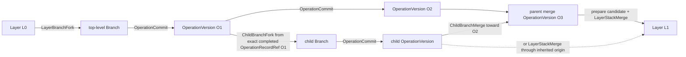

# LayerFS product architecture package

This package is the normative handoff from the current LayerFS PoC to the
distributed parallel-agent product. It separates:

1. portable canonical filesystem meaning;
2. the shared authenticated SQLite storage substrate;
3. Working versus Durable ownership;
4. explicit synchronization between physically distinct databases;
5. isolated per-Operation workspaces and their presentations; and
6. current implementation/evidence from target product ownership.

Current Linux/FUSE and Apple/APFS code is valuable implementation evidence. It
does not replace the target LayerStack, Branch, storage, synchronization, or
workspace architecture.

## Reading order

```text
poc-product-ready/
├── README.md
├── 00-foundation/
│   └── glossary.md
├── 01-architecture/
│   └── system-architecture.md
├── 02-core/
│   ├── algorithms-and-data-model.md
│   ├── deduplication.md
│   └── operations.md
├── 03-workspace/
│   └── begin-end-lifecycle.md
└── 04-product-readiness/
    ├── readiness-contract.md
    ├── efficiency-and-benchmarks.md
    ├── implementation-roadmap.md
    └── implementation-handoff-prompt.md
```

| Order | Document | Authority |
|---:|---|---|
| 1 | [Glossary](00-foundation/glossary.md) | Normative terminology |
| 2 | [System architecture](01-architecture/system-architecture.md) | Target crates, dependencies, ownership, and physical topology |
| 3 | [Algorithms and data model](02-core/algorithms-and-data-model.md) | Canonical algorithms and shared schema |
| 4 | [Deduplication](02-core/deduplication.md) | CAS + CDC + COW reuse and accounting |
| 5 | [Operations](02-core/operations.md) | Commit, fork, merge, rollback, and conflict semantics |
| 6 | [Operation workspace lifecycle](03-workspace/begin-end-lifecycle.md) | One isolated arbitrary tool operation |
| 7 | [Readiness contract](04-product-readiness/readiness-contract.md) | Correctness, durability, resource, and release gates |
| 8 | [Efficiency and benchmarks](04-product-readiness/efficiency-and-benchmarks.md) | Complexity and evidence rules |
| 9 | [Implementation plan](04-product-readiness/implementation-roadmap.md) | Mandatory pre-read, exact moves, full implementation phases, FUSE/fs-bench and APFS environments/campaigns, distributed recovery, and terminal PASS |
| 10 | [Implementation handoff prompt](04-product-readiness/implementation-handoff-prompt.md) | Non-normative execution wrapper for the sole implementation owner; the implementation plan remains authoritative |

Historical PoC evidence remains under [`../poc`](../poc). Evidence binds exact
source, artifact, and environment; it never changes this target architecture.

## Product model

LayerFS has two retained version domains:

```text
LayerStack version:
    immutable Layer

Branch version:
    immutable OperationVersion
```

It has one commit action:

```text
OperationCommit
    OperationDelta -> exact Branch head -> new OperationVersion
```

It has two head-directed merges:

```text
ChildBranchMerge
    child Branch result -> exact immediate-parent Branch head

LayerStackMerge
    prepared candidate Layer -> exact originating LayerStack head
```

It has two origin-bound forks:

```text
LayerBranchFork
    exact retained LayerRef -> new top-level Branch

ChildBranchFork
    exact completed OperationRecordRef -> new child Branch
```

Every Branch inherits one originating LayerStack from its top-level ancestor.
A child may merge into its immediate parent, and a Branch at any depth may
merge into that inherited originating LayerStack. No Branch may merge into a
non-parent Branch or an unrelated LayerStack. Child Branches may recursively
fork further children from exact completed `OperationRecordRef`s.

A LayerStack is not a “main Branch.” It is the ordered Layer history. A product
may name its default LayerStack `main`, but that name does not change its type or
merge rules.



There is no competing generic history graph or agent-orchestration policy in
LayerFS.

## One operation, one private workspace

An `Operation` is arbitrary filesystem activity: an SDK mutation, editor,
shell, compiler, test run, dependency installation, or process tree. LayerFS
records final filesystem effect rather than classifying the tool.

```text
begin Operation
    -> read exact Working Branch head
    -> lease its exact LayerRef or OperationVersionRef
    -> create private OperationWorkspace
    -> run arbitrary work
    -> quiesce every admitted mutation source
    -> OperationCommit or discard/preserve
```

`layerfs-workspace` owns this lifecycle and quiescence. Concrete drivers live
in `layerfs-mount` and `layerfs-materialization`; neither presentation owns the
version transaction.

Sibling Operations share immutable canonical objects but never dirty state.
Concurrent Operations may start from the same Branch head. Only one exact
expected-head transition can win. A stale Operation returns `Conflict` with a
host-recoverable preserved candidate; it creates no accepted OperationVersion
and does not advance the Branch head.

## Canonical core

Every storage and presentation path shares:

```text
frozen FastCDC 8/16/32 KiB
    -> canonical immutable payload objects
    -> ObjectId-addressed CAS
    -> persistent COW extent/namespace/inode/metadata trees
    -> directly readable immutable RootId
```

- CDC finds content boundaries for new or replacement streams.
- CAS stores one authenticated canonical object per `ObjectId` in each physical
  database.
- COW path-copies changed tree spines and shares unchanged objects.
- Forks and versions copy metadata references, not complete workspaces.

Portable path resolution, logical read/mutate, Merkle diff, and three-root
merge candidate construction live directly in `layerfs-core::logical`. They are
generic over `core::object::access::{ObjectRead, ObjectStore}` and contain no
SQLite, platform, workspace, Branch, LayerStack, or authority policy.

Expected canonical storage is base unique objects plus unique changes and tree
metadata, not version count multiplied by workspace size.

## Storage is not synchronization

The current `layerfs-engine` migrates once into `layerfs-storage`. The target
storage crate is one concrete authenticated SQLite substrate owning:

```text
schema + StorageId
canonical objects and RootIds
Layer/Branch/Operation records and scoped deltas
expected-head publication and reconciliation
integrity, retention primitives, and Store generations
```

Two policy crates use that same schema and algorithms:

```text
layerfs-working-store
    WorkingStore
    WorkingRecorded accepted Working history
    fetched objects + DurableTrackingRefs
    unpublished Operations/OperationVersions and preserved candidates
    recovery + explicit Push outbox/transfer state

layerfs-durable-store
    DurableStore
    shared authenticated CAS
    LayerStacks/Layers and durable Branches at arbitrary depth
    pushed OperationVersions/OperationDeltas and immutable fork ancestry
    branch/layer merge records, exact heads, leases, retention, compaction
    admission, backup, restore, and disaster recovery
```

They are physically different SQLite databases with different `StorageId`s.
They are not a `StorageRole` switch, runtime mode, or one database opened two
ways. The product has no one-Store shortcut, including single-host deployment.
Equal `ObjectId`s deduplicate independently inside each physical database.
Fetch/Push avoids known-present transfer, but copies on different machines are
real physical copies—not literal cross-machine zero-copy.

There may be many independent disk-backed Working Stores. The recommended
default is one per host or security domain, serving many Branches and
OperationWorkspaces. They coordinate authority only through the central
DurableStore—never through peer-to-peer head authority. A Working Store never
holds a complete workspace or file in memory; canonical objects live in its
SQLite/CAS and active workspace dirt is bounded/spooled separately.

The DurableStore is GitHub-like central durable authority. It receives accepted
canonical/version records, not running workspaces, handles, raw syscalls,
dirty maps, spools, native files, or unpushed Operations.

`layerfs-sync` is the only bridge. Its source is split into a client/Working
half and a server/Durable half; both implement one protocol rather than asking
Service to duplicate synchronization logic:

```text
Fetch:
    exact Durable hashes + ref/head receipt first
    -> negotiate the bounded missing-object set
    -> charge actual transfer including retransmission
    -> authenticate into WorkingStore
    -> verify requested closure
    -> record DurableTrackingRef

Push:
    verify accepted WorkingRecorded version/chain selected for Durable Push
    -> send proposed records, hashes and exact expected Durable head first
    -> negotiate the bounded missing-object set
    -> charge actual transfer including retransmission
    -> Durable admission authenticates new and incumbent objects
    -> verify complete requested closure
    -> one final exact Durable ref transaction
    -> DurablyAccepted | Conflict | Indeterminate
```

One Push can publish a new durable Branch or advance an existing durable Branch.
A pushed Working chain may append all of its OperationVersions and
OperationDeltas, then move the durable Branch head once. Lost acknowledgement of
that final transaction is resolved by fresh request-identity reconciliation,
never blind replay.
Publishing a child requires its exact immediate parent Branch and fork
`OperationRecordRef` to be DurablyAccepted already; no ancestor is created or
advanced implicitly.
Likewise, LayerStackMerge requires its exact source Branch/head to be
DurablyAccepted first; the merge Push moves only the LayerStack head.

Synchronization is explicit foreground work. There is no background sync,
per-syscall synchronization, SQLite page/database replication, or Working-side
access to Durable SQLite. Even on one host, the Working side uses the
Sync/Service boundary; only the Durable process opens the Durable database.
Service authenticates and transports requests, then delegates them to
`layerfs-sync::server`, which invokes DurableStore APIs; the Service does not
reimplement Fetch or Push.

### Non-normative federated/MCTS-style use

An external orchestrator may Fetch one durable version into many Working
Stores, run parallel speculative Operations, score the resulting candidates,
and Push selected Branch chains. This is an application pattern, not LayerFS
policy: scoring, rollout selection, scheduling, and search-tree ownership stay
outside LayerFS. Working Stores never become peer authorities; DurableStore is
the only shared authority.

```text
                   external orchestrator
                  /        |          \
        WorkingStore A  WorkingStore B  WorkingStore C
                  \        |          /
                   Fetch / selected Push
                           |
                    central DurableStore
```

## Mount versus materialization

Both presentations operate over the same WorkingStore roots and terminate
through the same workspace/OperationCommit law.

| Presentation | Mutable execution state | Count-changing edit | Physical result |
|---|---|---|---|
| `layerfs-mount/fuse` | private logical overlay/ranges/spool over immutable extents | splice logical extents; no ordinary native suffix shift | kernel view resolves canonical extents on demand |
| `layerfs-materialization/apfs` | private real APFS directory | APFS may perform suffix/full-file work | capture creates a host-recoverable candidate; successful OperationCommit creates WorkingRecorded; refresh updates requested physical view |

Mounted execution is the natural high-concurrency route: Operations share the
WorkingStore CAS while retaining private dirty overlays. Materialization is the
compatibility route for applications that require native files. A canonical
merge never rematerializes. A requested native refresh is separate physical
work and uses changed-path clone/patch only where exact safety permits.

## Exact target source structure

```text
crates/
├── layerfs-core/
│   └── src/logical/              portable resolve/read/mutate/diff/merge
│                                 over object-access traits
├── layerfs-storage/              shared authenticated SQLite substrate
├── layerfs-working-store/        WorkingStore policy and WorkingRecorded state
├── layerfs-durable-store/        DurableStore policy and DurablyAccepted state
├── layerfs-sync/
│   └── src/
│       ├── client/               WorkingStore-side Fetch/Push orchestration
│       └── server/               DurableStore-side Fetch/Push handlers
├── layerfs-workspace/            per-Operation runtime, guards, quiescence
├── layerfs-mount/
│   └── src/fuse/                 logical mounted driver and thin FUSE adapter
├── layerfs-materialization/
│   └── src/apfs/                 native driver and thin APFS adapter
├── layerfs-sdk/                  public actions and exact receipts
└── layerfs-service/              network/auth/admission boundary
```

Current source still uses:

```text
layerfs-core
layerfs-engine
layerfs-vfs
layerfs-fuse
layerfs-os
layerfs-sdk
```

The roadmap must migrate current Engine code once into Storage and move the
residual portable semantics from current `layerfs-vfs` directly into
`layerfs-core::logical`; no temporary filesystem-semantics crate is created.
Then it adds policy, Sync, Workspace, presentation, and Service boundaries.
Current crate names remain valid evidence paths until code moves; they are not
target ownership.

## Truth labels

| Label | Meaning |
|---|---|
| **Implemented** | Present in current source |
| **Qualified** | Proven for one exact retained source/artifact/environment |
| **Target** | Normative behavior not fully implemented or qualified |
| **Deferred implementation** | Required target architecture scheduled after an earlier milestone |
| **Excluded** | Not part of LayerFS |

Deferral never deletes a target requirement.

## Non-negotiable invariants

1. Canonical identity is independent of OS, SQLite row IDs, paths, database
   location, runtime IDs, and transport.
2. Working and Durable databases have distinct `StorageId`s but preserve exact
   transferred canonical `ObjectId`, `RootId`, and issuer-scoped `InodeId`.
3. Fetched, new, and incumbent canonical objects authenticate at their trust
   boundary.
4. Immutable roots are directly readable; history is not replay-only.
5. One accepted `OperationCommit` creates one `OperationVersion` and one exact
   Working Branch transition.
6. `ChildBranchMerge` and `LayerStackMerge` target exact destination heads and
   never retry implicitly.
7. WorkingRecorded is not DurablyAccepted. Only Durable admission plus accepted
   authority publication creates the latter.
8. Storage and synchronization are separate; object transfer is not head
   publication.
9. No product path opens one database as both Working and Durable authority.
10. Operation, presentation, sync, and durable publication costs are measured
    separately.
11. Multiple Working Stores coordinate shared authority only through
    DurableStore; there is no peer head authority.
12. Fetch and Push are the only public synchronization actions and never run in
    the background or from filesystem syscalls.
13. DurableStore contains accepted canonical/version authority only—never live
    workspaces, handles, raw syscalls, dirty maps, spools, native files, or
    unpushed Operations.
14. LayerStack is a Layer history, not a Branch; `main` is only an optional
    default LayerStack name.

## Claim boundary

This package defines the target product and release gates. It does not claim
that current HEAD already has the target storage split, Workspace crate,
version tables, Sync/Service protocol, or target presentation ownership. Those
claims require the ordered migration and exact-source evidence.
