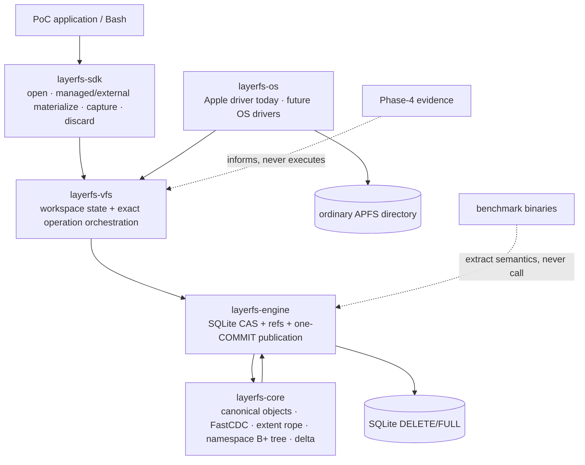
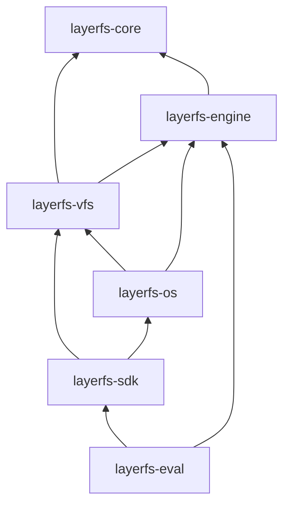
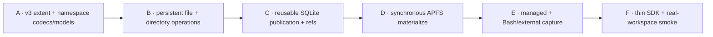

# Apple/APFS PoC architecture and file structure

Status: **implementation blueprint; new format and APIs are proposed, not yet
implemented or measured**.

This document deliberately treats existing plans and benchmark reports as
hypotheses. The checked-out Rust source is the implementation truth; accepted
G5 artifacts are evidence only for their frozen workloads.

## 1. Decision summary

| Decision | PoC choice | Why | Evidence class |
|---|---|---|---|
| Payload storage | immutable canonical `Bytes` objects in SQLite | already implemented; identity and incumbent checks exist | **Observed source** |
| Chunk ingestion | existing FastCDC `8/16/32 KiB` profile | already bounded and streamed | **Observed source** |
| File state | persistent byte-measured B+ extent rope | hard-local operational splice without suffix renumbering | **Proposed** |
| Equal-byte identity | separate semantic `ContentDigest` from operational `FileStateRoot` | a normal B+ shape is edit-history-dependent | **Required ADR** |
| Namespace | persistent byte-bounded B+ tree per directory | the validation fixture may be small, but the product algorithm cannot remain `Theta(D)` | **Proposed nonthrowaway core** |
| Durable authority | one SQLite writer transaction and one publication `COMMIT` | current reusable engine already has the skeleton | **Observed source** |
| Native output | synchronous APFS private-temp build, optional clone/patch, `fsync`, rename, directory sync | smallest real Apple vertical slice | **Proposed extraction** |
| Portability | OS-neutral `ProjectionDriver` owned by VFS; concrete Apple implementation only in `layerfs-os` | later platforms change one crate, not canonical/workspace algorithms | **Required boundary** |
| Capture | exact managed edits first; arbitrary external edits walk and scan the complete supported workspace | APFS events prove neither complete paths nor exact byte ranges | **Platform constraint** |
| History | immutable roots plus named refs; append-only objects during PoC | fork/rollback become reference operations | **Proposed** |
| Reclaim | explicit offline exclusive mark-copy-verify-swap | complete retained-root authority with zero active pins is simpler and nonthrowaway | **Required maintenance path** |
| Native use | materialize ordinary APFS paths and run a real Bash child process before capture | proves editor/tool compatibility rather than only synthetic buffers | **Required PoC workflow** |
| Benchmarking | one compact real-workspace smoke after correctness | implementation and algorithms first | **PoC policy** |

### 1.1 The architecture in one graph



### 1.2 Authority boundaries

```text
canonical truth     = immutable objects + namespace root + accepted ref state
operational file ID = FileStateRoot (history-shaped B+ root is allowed)
semantic byte ID    = ContentDigest (computed when requested; not every edit)
native APFS tree    = derived workspace/cache, never CAS or head authority
benchmark evidence  = test oracle only, never a production dependency
```

## 2. Current repository truth

| Surface | What the source actually contains | Consequence |
|---|---|---|
| `layerfs-core::content::LogicalFile` | flat `Vec<ChunkReference>` over `InMemoryCas` | range locating and manifest reconstruction are `O(E)`; not a durable resolver |
| `content/persistence.rs` | v1 K64/F64 codec; each `FileReference` is **68 B** (`raw_id + raw_length + object_id`) | must remain a distinct v1 decoder; not interchangeable with v2 |
| `canonical_v2.rs::file_codec` | v2 compact reference is **36 B** (`raw_length + object_id`) | a separate durable format/profile; cannot be merged by moving functions |
| `canonical_v2.rs` | overlaps file, directory, delta and COW mapping helpers | reconciliation requires golden-byte parity, not textual deduplication |
| `cow::TreeNode` | `Arc` + full `BTreeMap` clone/hash on directory mutation; ID explicitly provisional | compatibility/model input only; the PoC product path replaces its mutation algorithm with the persistent namespace tree |
| reusable `layerfs-engine` | schema-v1 `layerfs_*`, SQLite BLOB objects, one visible root, `BEGIN IMMEDIATE`, one `COMMIT` | useful base, but lacks G5 receipts/trust/ref model |
| G5 Store | private schema-v5 `wp4m_*` inside a 21.8k-line benchmark binary | G5 behavior is not merged into the reusable engine |
| G5 projection | private code inside a 9.9k-line materialization binary | APFS and mailbox mechanisms are not reusable product APIs |
| `layerfs-os` | environment probes only | no clone/temp/publish adapter exists |
| `layerfs-vfs`, `layerfs-sdk` | component constants only | no product workflow exists |

Accepted G5 evidence is narrow: warm/preconditioned edits, a 250,000-byte
warm projection mechanism, one 1 MiB/1,000-revision history, and one 10 MiB
2-reader/1-writer sentinel. It does **not** establish product extraction,
controlled-cold behavior, arbitrary-size native projection, hostile-directory
safety, GC, multi-process scheduling, SDK semantics, or rollback freshness.

## 3. Exact target repository tree

Legend: `=` retain, `~` edit/reconcile, `+` add, `-` remove from the active
product build after parity. Historical evidence remains preserved.

```text
layerfs-empty/
├── Cargo.toml                                      = existing workspace
├── Cargo.lock                                      = existing lockfile
├── SPEC.md                                         ~ add PoC profile/API result after proof
├── poc/
│   ├── README.md                                   = document index
│   ├── 00-scope-and-decisions.md                   = scope/ADRs
│   ├── 01-architecture-and-file-structure.md       + this file
│   ├── 02-data-structures-and-algorithms.md        + exact algorithm contract
│   ├── 03-operation-workflows.md                   + end-to-end operation owner
│   ├── 04-apple-apfs-materialization-and-recovery.md
│   │                                                + platform/recovery owner
│   ├── 05-minimal-implementation-plan.md           + implementation owner
│   ├── 06-correctness-and-fast-verification.md     + verification owner
│   ├── 07-implementation-checklist.md              + execution checklist
│   ├── 08-native-workspace-and-shell-verification.md
│   │                                                + ordinary workspace/shell owner
│   ├── 09-portability-and-apple-completeness.md     + universal driver/Apple exit owner
│   └── 10-handoff-freeze.md                        + highest-precedence implementation authority
│
├── crates/
│   ├── layerfs-core/
│   │   ├── Cargo.toml                              = no new dependency
│   │   ├── src/
│   │   │   ├── lib.rs                              ~ export typed PoC file API
│   │   │   ├── error.rs                            ~ add exact extent/tree errors
│   │   │   ├── limits.rs                           ~ freeze node/depth/edit bounds
│   │   │   ├── identity/                           = object hashing and typed wrappers
│   │   │   ├── object/                             = canonical envelope/role checks
│   │   │   ├── cdc/                                = existing FastCDC profile
│   │   │   ├── cas/                                = in-memory oracle; durable CAS stays engine
│   │   │   ├── content/
│   │   │   │   ├── mod.rs                          ~ small facade; retain legacy API until cutover
│   │   │   │   ├── persistence.rs                  = v1 read/identity compatibility
│   │   │   │   ├── extent.rs                       + extent/node/value types + validation
│   │   │   │   ├── extent_codec.rs                 + fresh v3 canonical bytes only
│   │   │   │   └── rope.rs                         + locate/read/split/join/splice/build
│   │   │   ├── canonical_v2.rs                     = v2 read/identity compatibility
│   │   │   ├── namespace.rs                        + directory/file/symlink entries + persistent B+ operations
│   │   │   ├── namespace_codec.rs                  + fresh canonical namespace node bytes
│   │   │   ├── inode.rs                            + stable InodeId/table and hard-link semantics
│   │   │   ├── metadata.rs                         + portable and typed extension metadata
│   │   │   ├── cow/                                ~ legacy/model compatibility only after cutover
│   │   │   ├── delta/                              ~ encode root/ref changes
│   │   │   └── validation.rs                       = receipt codec reused by engine
│   │   └── tests/
│   │       ├── extent_codec.rs                     + golden bytes/IDs/malformed cases
│   │       ├── extent_model.rs                     + deterministic Vec<u8> differential model
│   │       ├── namespace_codec.rs                  + namespace goldens/malformed cases
│   │       └── namespace_model.rs                  + ordered-map/path differential model
│   │
│   ├── layerfs-engine/
│   │   ├── Cargo.toml                              ~ remove macOS libc after bin extraction
│   │   ├── src/
│   │   │   ├── lib.rs                              ~ facade and stable result/error types
│   │   │   ├── store.rs                            + schema/profile/object/read APIs
│   │   │   ├── integrity.rs                        + Verified/TrustedLocalDev scope/receipts
│   │   │   ├── refs.rs                             + named refs, generation CAS, fork/rollback
│   │   │   ├── publication.rs                      + expected-head tx/COMMIT/reconciliation
│   │   │   ├── generation.rs                       + universal StoreGenerationDriver port/selector types
│   │   │   └── compaction.rs                       + offline mark/copy/verify/swap/recovery
│   │   └── tests/
│   │       ├── store_and_publication.rs            + one focused durable suite
│   │       ├── faults_and_reopen.rs                + one focused restart/fault suite
│   │       └── compaction.rs                       + retention and swap-fault suite
│   │
│   ├── layerfs-os/
│   │   ├── Cargo.toml                              ~ depends on VFS + engine ports; Apple `libc` only here
│   │   ├── src/
│   │   │   ├── lib.rs                              ~ native_platform() + platform selection only
│   │   │   └── apple/
│   │   │       ├── mod.rs                          + AppleDriver implementation
│   │   │       ├── workspace.rs                    + no-follow enumeration/identity/links
│   │   │       ├── apfs.rs                         + clone/sparse/replace/sync
│   │   │       ├── metadata.rs                     + mode/xattr/ACL/flags/resource fork
│   │   │       ├── store.rs                        + selector replace/sync durability driver
│   │   │       └── ffi.rs                          + only reviewed unsafe syscall boundary
│   │   └── tests/apple_driver.rs                   + shared conformance + APFS cases
│   │
│   ├── layerfs-vfs/
│   │   ├── Cargo.toml                              ~ depends on core + engine, never OS
│   │   ├── src/
│   │       ├── lib.rs                              ~ internal public facade
│   │       ├── driver.rs                           + universal ProjectionDriver port/types
│   │       ├── resolver.rs                         + OS-neutral read/namespace resolution
│   │       ├── workspace.rs                        + lifecycle/provenance/managed changes
│   │       ├── materialize.rs                      + cold/no-op/clone-patch/full fallback
│   │       ├── capture.rs                          + managed fast path/full-workspace external scan
│   │       └── external.rs                         + ordinary-path lease and child-process/quiescence boundary
│   │   └── tests/
│   │       ├── driver_conformance.rs               + in-memory/fault driver universal suite
│   │       └── poc_workflow.rs                     + materialize/Bash/capture/reopen/fault workflow
│   │
│   └── layerfs-sdk/
│       ├── Cargo.toml                              ~ depends on VFS + OS native-driver factory
│       ├── src/lib.rs                              ~ thin public API + stable errors
│       ├── examples/apple_poc.rs                   + one runnable vertical demonstration
│       └── tests/workflow.rs                       + one public end-to-end check
│
├── tools/layerfs-eval/
│   ├── Cargo.toml                                  ~ add SDK dependency
│   └── src/
│       ├── main.rs                                 ~ one `apple-poc` command
│       └── apple_poc.rs                            + compact real-workspace smoke and counters
│
├── crates/layerfs-engine/src/bin/
│   ├── phase4_create_edit_benchmark.rs             - active implementation after parity
│   └── phase4_g3_materialization.rs                - active implementation after parity
│
└── implementation-detail/phase-4/                 = immutable historical evidence; never imported
```

The two benchmark source files are removed from the **active product build**
only after each extracted behavior has parity coverage. Historical attempt
trees, manifests, and reports are not deleted or rewritten.

## 4. Crate dependency law



| Crate | Owns | Must not own |
|---|---|---|
| `core` | canonical bytes, object roles, extent tree, namespace/inode/metadata B+ trees, logical edits/path mutations, deltas | SQLite, APFS, host paths, threads, workspaces, platform cfg |
| `engine` | SQLite schema/profile, immutable admission, refs, publication, integrity receipts, fresh reconciliation, neutral Store-generation port | concrete syscalls, native projection, SDK policy |
| `os` | concrete projection and Store-generation drivers, descriptors, no-follow open, clone/replace/sync, metadata and host observations | object IDs, roots, CDC, publication authority, workspace policy |
| `vfs` | universal driver port, resolver, workspace lifecycle, exact operation orchestration, derived native provenance | concrete syscalls, `libc`, platform cfg, a second object store, benchmark fixtures |
| `sdk` | small stable user surface, native-driver wiring and errors | platform branches, backend types, SQLite rows, projection mailbox internals |
| `eval` | deterministic dataset, oracles, counters, compact wall/CPU/RSS observation | semantic implementation, hard-coded product success |

Dependency violations are build failures, not review suggestions.

## 5. Public and internal boundaries

### 5.1 Core boundary

```rust
// Proposed shape, not code authority.
pub struct FileStateRoot(/* typed ObjectId */);
pub struct FileSummary { pub root: FileStateRoot, pub len: u64, pub extents: u64 }
pub struct Edit { pub start: u64, pub delete_len: u64, pub replacement: Box<dyn Read> }

pub trait ObjectRead {
    fn canonical_len(&self, id: ObjectId) -> CoreResult<u64>;
    fn read_canonical(&self, id: ObjectId) -> CoreResult<Vec<u8>>;
}

pub trait ObjectWrite: ObjectRead {
    fn put_canonical(&mut self, id: ObjectId, bytes: &[u8]) -> CoreResult<PutOutcome>;
}
```

The PoC should not add a generic backend/factory layer. The two tiny read/write
capabilities exist only to keep tree algorithms independent of SQLite; the
engine provides the only product implementation and the model test provides
the only test implementation.

### 5.2 Engine boundary

```rust
pub enum IntegrityMode { Verified, TrustedLocalDev }
pub struct Store;
pub struct ReadView;
pub struct Publication;

impl Store {
    pub fn open(path: &Path, mode: IntegrityMode) -> Result<Self>;
    pub fn read_ref(&self, name: &str) -> Result<RefState>;
    pub fn read_view(&self, root: NamespaceRoot) -> Result<ReadView>;
    pub fn begin_publication(&self, expected: RefState) -> Result<Publication<'_>>;
    pub fn fork_ref(&self, source: RefState, new_name: &str) -> Result<RefState>;
    pub fn move_ref(&self, expected: RefState, target: NamespaceRoot) -> Result<RefState>;
}
```

`Publication` is the sole state-changing SQL path. It admits immutable objects,
writes the delta/root, checks the expected ref generation, updates one ref, and
dispatches exactly one `COMMIT`.

### 5.3 VFS/SDK boundary

```rust
pub struct LayerFs;
pub struct OpenedLayerFs { pub fs: LayerFs, pub head: NamespaceRoot }
pub struct ManagedWorkspace;  // private LayerFS-owned location; no path accessor
pub struct ExternalWorkspace; // caller-visible ordinary APFS location

impl LayerFs {
    pub fn open(path: &Path, mode: IntegrityMode) -> Result<OpenedLayerFs>;
    pub fn materialize_managed(&self, root: NamespaceRoot)
        -> Result<ManagedWorkspace>;
    pub fn materialize_external(&self, root: NamespaceRoot, at: &Path)
        -> Result<ExternalWorkspace>;
}

impl ManagedWorkspace {
    pub fn write_at(&mut self, path: &CanonicalPath, offset: u64, bytes: &[u8]) -> Result<()>;
    pub fn replace(&mut self, path: &CanonicalPath, range: Range<u64>, bytes: &[u8]) -> Result<()>;
    pub fn capture(&mut self) -> Result<NamespaceRoot>;
    pub fn into_external(self) -> Result<ExternalWorkspace>;
    pub fn discard(&mut self) -> Result<()>;
}

impl ExternalWorkspace {
    pub fn path(&self) -> &Path;
    pub fn capture_quiescent(&mut self) -> Result<NamespaceRoot>;
    pub fn discard(&mut self) -> Result<()>;
}
```

`open` creates the canonical empty head exactly once for a fresh store and
returns the existing exact head on reopen. The caller never has to guess or
reach into engine metadata to obtain the root required by `materialize`.

The optimized guarantee initially applies to managed operations because they
carry exact ranges. Edits made by arbitrary external processes remain
supported through a complete supported namespace walk and complete regular-file
scan during capture. Any caller-known destination is External from creation.
Converting a Managed workspace consumes it and invalidates exact live
seed/range provenance before an editor, Bash, compiler, or other tool receives
the path. External capture requires cooperative quiescence.

## 6. Fresh-profile compatibility rule

The PoC must not reinterpret existing mapping bytes.

```text
v1 FileReference = raw_id[32] + raw_length[4] + object_id[32] = 68 B
v2 FileReference = raw_length[4] + object_id[32]                = 36 B
v3 ExtentSlice    = payload_id[32] + source_offset[4] + len[4] = 40 B (proposed)
```

| Rule | Required behavior |
|---|---|
| profile identity | v3 profile binds exact codec tags, min/max occupancy, split/join policy, max depth, CDC profile and slice rule |
| new store | initializes directly as v3 |
| v1/v2 store open | dispatches exact old decoder read-only or returns `SchemaMigrationRequired` for edit |
| payload reuse | allowed only after exact object/profile/store authority check; payload bytes keep their existing ObjectIds |
| mapping reuse | forbidden across versions; v1/v2/v3 mapping IDs are not interchangeable |
| history edge | no silent v1/v2 parent to v3 child edge |
| migration | deferred; later migration is a full authenticated reconstruction into a new v3 root |
| downgrade | forbidden |

This is a fresh-profile Apple PoC, not an in-place user-store migration.

## 7. Semantic extraction map

Extraction means: isolate the invariant, create a product API, add a focused
parity check, then remove the benchmark caller. It never means copying a whole
benchmark type into a new file.

| Existing source | Product destination | Extract | Do not copy |
|---|---|---|---|
| `core/cdc/*` | retain | fixed streaming FastCDC profile | benchmark counters/timers |
| `core/object/*`, `identity/*` | retain | canonical envelope and identity checks | fixture roots/digests |
| `content/mod.rs::LogicalFile` | model/legacy path; new `rope.rs` replaces product use | bounded CDC ingestion behavior | flat `Vec` reconstruction on every edit |
| `content/persistence.rs` | retain v1 compatibility | nothing into v3 except shared checked helpers after goldens | 68-B reference interpreted as compact v2/v3 |
| `canonical_v2.rs` | retain v2 compatibility | domain/tag patterns only after golden parity | duplicate file/delta/directory code as new authority |
| `cow/tree.rs` | legacy decoder/differential oracle only; no new product mutation caller | path semantics and immutable-root test vectors | complete-map clone as product namespace algorithm |
| reusable `engine/lib.rs` | `store.rs` + `publication.rs` | SQLite profile; one-fetch/one-auth borrowed-row reader; ordered batch-64 payload reader; expected-parent and transaction skeleton | current `load_object`/`read_object_range` multi-query, multi-BLOB-pass mechanics; current single-visible-root schema as multi-ref solution |
| benchmark `Store` | `integrity.rs`, `publication.rs` | `Verified` default, explicit Store-lifetime `TrustedLocalDev`, receipt binding, requested/prior/different/ambiguous reconciliation | `wp4m_*` schema, fixture env switches, measurement/Q/report structs |
| benchmark projector | `os/apple/*`, `vfs/materialize.rs` | no-follow/identity checks, owned temp, APFS clone, bounded patch, sync/rename/reconcile | fixture tokens, hard-coded names/sizes, benchmark mailbox metrics |
| benchmark mailbox | defer from first synchronous PoC | later: one in-flight + one replaceable Latest pending | background worker before synchronous correctness exists |

### 7.1 Safe reconciliation/deletion order

```text
1. Freeze current v1/v2 golden bytes, IDs, malformed-input behavior.
2. Add v3 codec/tree under a new profile; do not touch old decoders.
3. Differential-test v3 rope bytes against Vec<u8> semantics.
4. Route fresh v3 Store reads/writes through the new reusable engine.
5. Extract integrity/publication semantics from benchmark code into engine APIs.
6. Run focused parity for expected-head, one COMMIT, receipts and reconciliation.
7. Extract synchronous APFS private-temp materialization into os/vfs.
8. Run SDK end-to-end correctness on one compact ordinary-APFS workspace with
   a real Bash child.
9. Stop compiling/calling the Phase-4 benchmark implementations.
10. Keep historical source/evidence until a later repository-cleanup decision.
```

Never delete `persistence.rs` merely because `canonical_v2.rs` looks similar:
their reference layouts and profile identities differ. Delete only proven
same-version duplicate helpers after golden bytes and errors match exactly.

## 8. Minimal implementation slices



| Slice | Done means | Explicitly not done |
|---|---|---|
| A | exact file/namespace codecs, identities, malformed/overflow rejection | migration |
| B | file edits match `Vec<u8>` and namespace mutations match an ordered-map/path oracle | native projection |
| C | objects/root/delta/ref publish atomically; fork/rollback guarded; offline compaction preserves retained union | online GC, multi-writer |
| D | cold build, exact no-op, same-size clone/patch, full fallback, recovery | async mailbox |
| E | managed edit is local; external capture walks/scans the whole supported workspace | authoritative watcher/range discovery |
| F | ordinary files are usable by Bash; managed/external materialize/capture/discard works end-to-end | production API stability |

One slice must be finished and checked before starting the next. Do not build
parallel alternatives for CD32-64 and B+ rope.

## 9. Files deliberately deferred

Do **not** create these for the PoC:

```text
crates/layerfs-backend-trait/
crates/layerfs-postgres/
crates/layerfs-remote/
crates/layerfs-fuse/
crates/layerfs-branch/
crates/layerfs-policy/
crates/layerfs-search/
content/factory.rs
content/strategy.rs
os/platform_trait.rs
vfs/plugin.rs
sdk/config_builder.rs
```

Also defer these modules until a real need appears:

| Deferred file/mechanism | Add only when |
|---|---|
| `content/read.rs`, `content/edit.rs` | `rope.rs` becomes difficult to navigate |
| async exact/latest mailbox | synchronous projection is correct and a caller needs coalescing |
| pack/carrier files | SQLite row/BLOB overhead is measured as the bottleneck |

## 10. Real-workflow viability matrix

| Workflow | PoC path | Viability | Main limit |
|---|---|---|---|
| point/range read | root-to-leaf cursor + one-fetch/one-auth payload batches up to 64 | **viable required repair** | current reusable reader's repeated queries/BLOB passes must not be promoted |
| full read/reconstruction | stream extents in logical order | **viable, `Theta(F)`** | unavoidable bytes |
| managed overwrite/insert/delete | exact rope split/join + replacement CDC/CAS | **viable, proposed hard-local mapping** | accepts history-shaped FileStateRoot |
| append/truncate | right-edge split/join | **viable** | retained objects remain until GC |
| external edit capture | complete namespace walk + complete regular-file scan | **correct PoC fallback** | `Theta(total paths + workspace file bytes)` |
| cold materialization | verified stream to private temp | **viable, `Theta(F)`** | unavoidable native bytes |
| warm same-size projection | APFS clone + exact range patches | **viable mechanism** | seed provenance must avoid unsafe whole-file trust |
| different-size native projection | complete private-temp fallback | **correct** | contiguous APFS file may require suffix/full work |
| reopen | profile/ref validation; Verified may scrub | **correct** | cold fast reopen is not proven |
| long history | immutable shared objects + one root/ref record/revision | **viable** | intentionally retained roots consume space; dropped/abandoned unreachable objects require explicit offline compaction |
| fork | create named ref to same root | **zero object-byte copies; `O(log refs)` DB** | refs schema is new |
| rollback | generation-CAS move named ref to old root | **zero object-byte copies; `O(log refs)` DB** | freshness is only as strong as Store-local authority |
| compaction/GC | offline exclusive authenticated mark-copy-verify-swap | **viable maintenance route** | rejects active readers/writers/workspaces; no online deletion |
| Bash/editor session | `ExternalWorkspace`, then cooperative full-scan capture | **viable compatibility route** | LayerFS can prove only owned/registered writer quiescence |
| huge directory mutation | persistent namespace root-to-leaf path copy | **algorithmically viable** | complete listing still `Theta(D)`; scale is structurally tested, not performance-qualified |

## 11. Architecture stop conditions

Stop implementation and revise if any condition is observed:

- equal logical bytes are silently asserted to have equal `FileStateRoot` while
  using history-shaped B+ balancing;
- v1 68-byte, v2 36-byte, or proposed v3 40-byte references are decoded through
  one unversioned function;
- any core node contains an APFS inode, path, clone flag or SQLite row ID;
- core, engine, VFS or SDK imports `libc`, contains an Apple syscall, or selects
  behavior with `cfg(target_os)`;
- the SDK or VFS calls Phase-4 benchmark binaries;
- `TrustedLocalDev` skips fetched/new/incumbent object identity checks;
- publication can dispatch a second `COMMIT` after an ambiguous result;
- native live projection authority becomes canonical-root authority;
- external-editor capture is labeled local without exact changed-range evidence;
- a product namespace mutation still clones the complete `BTreeMap`;
- an unreachable-from-current object is deleted without tracing every retained
  ref, fork, rollback target and active read pin, or while offline-compaction
  generation/swap recovery is ambiguous.

## 12. Viability disposition

**GO for a fresh-profile Apple/APFS workspace PoC**, conditional on one
identity ADR: `FileStateRoot` is an operational history-shaped tree root and
`ContentDigest` is the separate semantic-byte identity. Under that decision,
the persistent measured file and namespace B+ trees provide nonthrowaway local
operations, while ordinary APFS materialization lets real Bash/editor children
exercise the result.

**NO-GO for production/load-bearing claims** until cold Verified reopen,
hostile native-path races, external-edit range discovery,
multi-process authority, retention-policy automation, and online GC are
implemented and checked. None should block the correctness-first PoC.

## 13. Decisive review inputs

| Input inspected | What was accepted from it | What was not assumed |
|---|---|---|
| `crates/layerfs-core/src/content/mod.rs` | actual flat `LogicalFile`, bounded-rejoin edit behavior | durable/tree performance |
| `crates/layerfs-core/src/content/persistence.rs` | actual v1 68-byte reference and K64/F64 codec | compatibility with compact v2/v3 |
| `crates/layerfs-core/src/canonical_v2.rs` | actual v2 36-byte reference/profile and overlapping codecs | clean modular product boundary |
| `crates/layerfs-core/src/cow/{tree,mutate,persistence}.rs` | actual `BTreeMap` namespace clone/hash and persistence | large-directory locality |
| `crates/layerfs-engine/src/lib.rs` | actual `layerfs_*` schema, object/range API, expected-parent transaction | G5 trust, refs, projection or full reconciliation |
| `crates/layerfs-engine/src/bin/phase4_create_edit_benchmark.rs` | concrete G5 integrity/publication mechanisms to reconcile | `wp4m_*` schema or benchmark fixtures as product code |
| `crates/layerfs-engine/src/bin/phase4_g3_materialization.rs` | concrete APFS/temp/mailbox/recovery mechanisms to reconcile | reusable VFS/SDK implementation |
| `crates/layerfs-os/src/lib.rs` | host probes only | an existing Apple adapter |
| `crates/layerfs-vfs/src/lib.rs`, `layerfs-sdk/src/lib.rs` | placeholders only | existing workflow APIs |
| `implementation-detail/.../g5-terminal/v1/{G5-TERMINAL-REPORT,LIMITATIONS,G6-HANDOFF}-v1.md` | accepted narrow G5 populations and limitations | production or arbitrary-scale authority |
| `implementation-detail/phase-4/g6/g6-canonical-extent-tree-spec.md` | preserved invariants and explicit suffix-linear worst case | B+ selection or measured improvement |
| `docs/architecture/*.md` | crosswalk, alternatives and cost hypotheses | implementation or benchmark authority |
