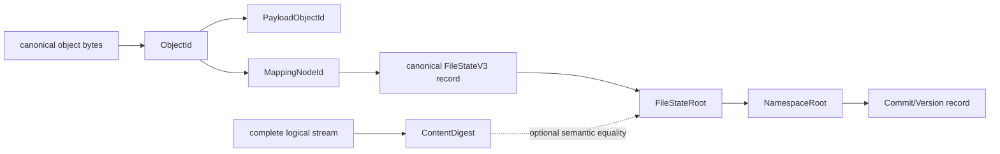
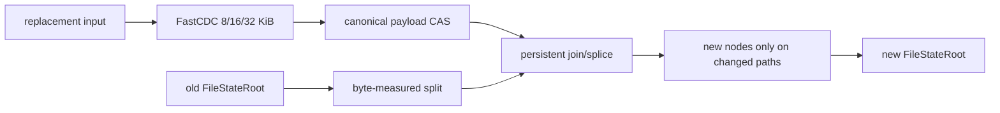
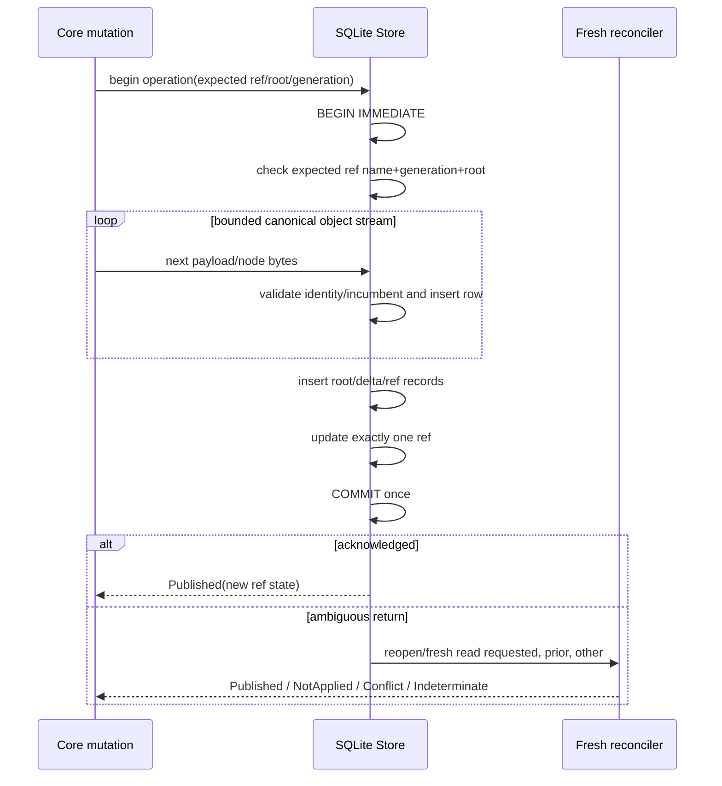
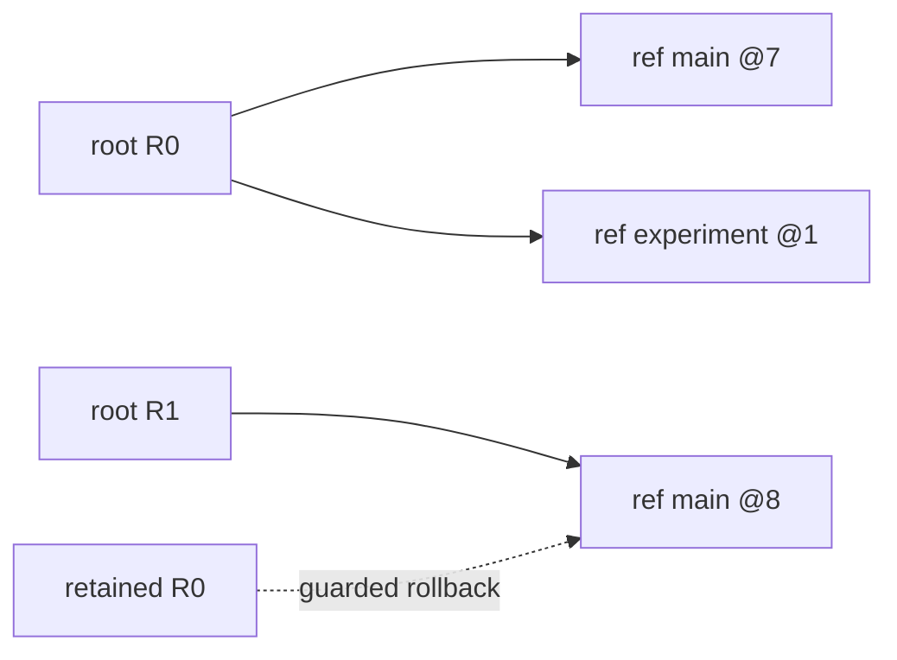

# Apple/APFS PoC data structures and algorithms

Status: **frozen fresh-profile contract, now implemented**. Current-source and
measurement disposition are recorded in `poc/13` and `poc/17`; explicit later
supersessions control where this historical contract differs.

The selected PoC candidate is an immutable, byte-measured B+ extent rope with
path-copy updates. Its operational root may depend on edit history. This is a
deliberate trade: hard-local insert/delete versus one-content/one-tree-root.

## 1. Evidence and notation

| Label | Meaning |
|---|---|
| **Observed** | fact read directly from checked-out Rust or accepted raw G5 evidence |
| **Invariant** | rule this PoC must preserve |
| **Proposed** | format/API/algorithm to implement and test |
| **Derived** | arithmetic with the equation shown |
| **Unavailable** | not implemented, observed, or safely inferable |

| Symbol | Meaning |
|---|---|
| `F` | complete logical file bytes |
| `B` | replacement/inserted bytes read from the caller |
| `X` | logically deleted bytes |
| `R` | bytes returned to a reader |
| `E` | extent-slice occurrences in one file state |
| `L` | extent slices intersecting a requested range |
| `K` | replacement payload chunks/extents plus directly created tree nodes |
| `H` | root-to-leaf node count |
| `M` | maximum entries per node, frozen at `128` |
| `D_i` | entries in directory `i` on a namespace path |
| `I` | entries in the global inode table |
| `A_R` | authenticated canonical payload bytes fetched for a range |
| `d` | path component depth |
| `V` | retained revisions |
| `U` | unique stored objects |
| `Q` | explicitly owned live userspace capacity, not RSS/page cache |

Existing observations:

```text
FastCDC min/target/max = 8,192 / 16,384 / 32,768 B
current v1 reference   = 68 B
current v2 reference   = 36 B
current 100 MiB case   = 5,284 payload occurrences
current v2 mapping     = 196,055 B (accepted retained fixture)
```

The numerical B+ values below are **Derived from the proposed codec**, not
performance evidence.

## 2. Identity model



| Type | Exact question | Equality guarantee |
|---|---|---|
| `ObjectId` | are these complete canonical object bytes equal? | exact canonical-byte equality |
| `PayloadObjectId` | are these immutable payload object bytes equal? | typed `ObjectId` role |
| `MappingNodeId` | are these exact extent-node bytes equal? | typed `ObjectId` role |
| `FileStateRoot` | are this canonical mode-free file record, profile, summaries and operational extent tree equal? | **not** necessarily semantic byte equality |
| `ContentDigest` | are these complete logical file bytes equal? | semantic equality after full streamed hash |
| `NamespaceRoot` | is this exact immutable filesystem state equal? | namespace object equality |
| `CommitId` | is this exact accepted transition/version equal? | transition equality |

### 2.1 Required ADR

```text
equal logical bytes MAY have:
    different FileStateRoot
    equal ContentDigest

same FileStateRoot MUST have:
    exactly equal logical bytes
    exactly equal extent order and tree encoding
```

Without this split, an ordinary occupancy-balanced B+ tree cannot promise both
hard-local arbitrary splices and one canonical tree root for all edit histories.
The alternative G6 content-defined grouping preserves the one-root goal but
admits a hard suffix-linear adversarial case. The PoC chooses hard locality.

`ContentDigest` is streamed on explicit request or full verification. It is not
computed on every edit, because that would make bounded edits `Theta(F)`.

## 3. Proposed v3 canonical node format

### 3.1 Profile constants

```text
outer object envelope            existing canonical Object::Bytes
mapping magic                    "LFS4MAP\0"
mapping version                  3
extent leaf tag                  0x08
extent branch tag                0x09
file state tag                   0x0a
entry minimum (non-root)         64
entry maximum                    128
root leaf entries                0..128
root branch children             2..128; one child collapses
maximum level                    31  (H <= 32 nodes)
payload maximum                  32,768 B
extent source offset/length      u32be
subtree totals                   u64be, checked
split overflow policy            129 -> left 64, right 65
underflow borrow precedence      left, then right
underflow merge precedence       left, then right
```

All constants, tags, rules, and the existing FastCDC profile are bound into a
new v3 profile ID. They are not runtime tuning values.

The G6 research document also used **provisional** `v3` language for a
different CD32-64 format, but no such bytes were implemented. Before freezing
this PoC, the controlling ADR must explicitly supersede that research profile;
no CD32-64 profile ID, tag, golden, or decoder may be reused for this B+ codec.
At the time of the original design audit, the implemented maximum was v2; the
current tree contains this distinct selected v3 B+ profile.

#### 3.1.1 Exact profile-ID preimage

All integers below are unsigned big-endian and every field occurs exactly once
in the listed order:

```text
profile_id = BLAKE3(
    "layerfs/mapping-profile/bplus-extent/v3\0"
    || mapping_version:u16                 // 3
    || leaf_tag:u8                         // 0x08
    || branch_tag:u8                       // 0x09
    || file_state_tag:u8                   // 0x0a
    || accepted_flags_mask:u8              // 0
    || nonroot_min_entries:u16             // 64
    || node_max_entries:u16                // 128
    || root_leaf_min_entries:u16           // 0
    || root_branch_min_children:u16        // 2
    || maximum_level:u8                    // 31
    || payload_maximum:u32                 // 32,768
    || extent_source_offset_width:u8       // 4
    || extent_length_width:u8              // 4
    || subtree_measure_width:u8            // 8
    || split_policy:u8                     // 1 = 129 -> 64/65
    || borrow_policy:u8                    // 1 = left, then right
    || merge_policy:u8                     // 1 = left, then right
    || root_collapse_policy:u8             // 1 = collapse one child
    || empty_file_policy:u8                // 1 = zero-entry root leaf
    || cdc_profile_id:[u8;32]
)
```

`cdc_profile_id` is independently frozen as:

```text
BLAKE3(
    "layerfs/fastcdc-profile/v1\0"
    || scanner_algorithm_id               // "two-byte-rolling-gear-v1"
    || minimum:u32                         // 8,192
    || target:u32                          // 16,384
    || maximum:u32                         // 32,768
    || normalization_shift:u8              // 2
    || seed:u64                            // 0
    || small_mask:u64                      // 0x0000_d903_0353_7000
    || large_mask:u64                      // 0x0000_d901_0353_0000
    || shifted_small_mask:u64              // 0x0001_b206_06a6_e000
    || shifted_large_mask:u64              // 0x0001_b202_06a6_0000
    || gear_table[0]:u64 ... gear_table[255]:u64
)
```

The preimage is the canonical serialization of the complete scanner profile;
changing its algorithm, cut masks, sizing, seed or gear table changes the ID.
The first implementation change must add independent literal profile-ID goldens
before any v3 write path is enabled. A runtime-computed value checked only
against itself is insufficient.

### 3.2 Common framing

The existing canonical `Bytes` object adds 13 bytes around the mapping payload:

```text
offset  bytes  field
0       4      "LFSO"
4       1      ObjectKind::Bytes = 0x01
5       4      object payload length:u32be
9       4      bytes value length:u32be
13      ...    mapping value
```

The v3 leaf/branch node mapping value begins:

```text
offset  bytes  field
0       8      magic = "LFS4MAP\0"
8       2      mapping_version = 3:u16be
10      1      role tag: leaf 0x08 | branch 0x09
11      1      level: leaf=0, branch>=1
12      1      flags = 0 (all other bits rejected)
13      2      entry_count:u16be
15      8      subtree_logical_bytes:u64be
23      8      subtree_extent_count:u64be
31      ...    role-specific entries
```

Canonical-object fixed bytes before entries:

```text
13 outer + 31 mapping = 44 B
```

### 3.3 Extent leaf

```text
ExtentSliceV3 {                  // exactly 40 B
    payload_object_id: [u8;32],
    source_offset:      u32be,
    logical_length:     u32be,
}
```

```text
leaf_bytes(n) = 44 + 40*n
leaf_min(64)  = 2,604 B
leaf_max(128) = 5,164 B
```

Leaf invariants:

1. `logical_length > 0`.
2. `source_offset + logical_length` is checked and no larger than the decoded
   payload byte length.
3. The payload object is a canonical `Bytes` role and no larger than 32 KiB.
4. Entry order is logical file order; no logical absolute offset is stored.
5. Adjacent entries referencing contiguous ranges in the same payload object
   are coalesced. A published node containing such a pair is noncanonical.
6. `subtree_extent_count == entry_count`.
7. `subtree_logical_bytes == checked_sum(logical_length)`.
8. Empty files use exactly one root leaf with zero entries and zero totals.
9. Non-root leaves contain `64..=128` entries.

Arbitrary slices are the key hard-local feature:

```text
payload P = [0 ................................ 32 KiB]

before:  (P, 0, 32 KiB)
split:   (P, 0, 12 KiB) + (P, 12 KiB, 20 KiB)

payload P is not copied or rehashed by the structural split.
```

### 3.4 Internal branch

```text
ChildDescriptorV3 {              // exactly 48 B
    cumulative_logical_end: u64be,
    cumulative_extent_end:  u64be,
    child_object_id:        [u8;32],
}
```

```text
branch_bytes(n) = 44 + 48*n
branch_min(64)  = 3,116 B
branch_max(128) = 6,188 B
```

Branch invariants:

1. Both cumulative fields are strictly increasing.
2. Each difference from the preceding cumulative value equals the referenced
   child summary.
3. Every child has `level == parent.level - 1`.
4. Every child ID authenticates exact canonical bytes of the required role.
5. Parent totals equal the final cumulative descriptor values.
6. Non-root branches contain `64..=128` children.
7. A root branch contains `2..=128`; a one-child root must collapse.
8. `level <= 31`; cycles, repeated traversal without structural progress, and
   over-depth input fail before allocation growth.

Cumulative ends permit binary search within a node. They change only in the
rewritten ancestor nodes, never in unrelated suffix subtrees.

### 3.5 File state and semantic digest

```text
offset  bytes  FileStateV3 field
0       8      magic = "LFS4MAP\0"
8       2      mapping_version = 3:u16be
10      1      role tag = 0x0a
11      1      flags = 0
12      8      logical_len:u64be
20      8      extent_count:u64be
28      1      tree_level:u8
29      32     profile_id
61      32     mapping_root:MappingNodeId
```

The mapping value is 93 bytes and the existing outer canonical `Bytes` envelope
makes the complete canonical file record 106 bytes. Length, extent count,
level, profile, and mapping root all participate in identity.
`logical_len/extent_count/level` are checked summaries, not independent
authorities. The `FileStateRoot` is the typed `ObjectId` of this canonical
record; directory entries point to it. The referenced `mapping_root` is a
separate authenticated `MappingNodeId`.

File and directory content roots are mode-free. Permission mode and canonical
mtime have one authority in `PortableMetadataV1`, reached through the shared
`InodeRecordV1`. `chmod` must not manufacture a new file-content root.

```text
ContentDigest = BLAKE3("layerfs/content-bytes/v1\0" || logical bytes)
```

The digest may be cached by `FileStateRoot`, but a cache row never authorizes
bytes unless its binding is validated. Omitting the digest is legal.

## 4. Why this is still CAS + CDC + COW



The PoC does **not** require the final file to equal a fresh whole-file FastCDC
segmentation. New replacement streams are FastCDC-chunked; untouched payload
slices are preserved. This is what removes the suffix-rejoin requirement and
makes mapping work hard-local. Full reconstruction of the same bytes may
produce a different `FileStateRoot`, but the same `ContentDigest`.

Optional bounded boundary repacking may later improve fragment quality, but it
must never be required for correctness and must never fall back to scanning an
unchanged suffix on the edit critical path.

## 5. Storage access law

Core algorithms depend on two narrow capabilities, not SQLite:

```text
NodeReader:
    get_node(id) -> authenticate canonical bytes -> decode exact role
    payload_len(id) -> authenticated/receipt-covered payload summary
    get_payload(id) -> authenticate canonical bytes -> decoded bytes
    for_each_payload_batch(ordered_ids, max=64, callback)
        -> one fetch/auth/decode per returned row; preserve order/duplicates

NodeWriter:
    put_payload(canonical bytes) -> Created | Reused after incumbent equality
    put_node(canonical bytes)    -> Created | Reused after incumbent equality
```

Rules:

- fetched, new, and incumbent objects always receive identity/equality checks;
- the core never sees a SQLite row ID, BLOB locator, APFS path, or native inode;
- a previously validated node may preserve a payload reference without fetching
  the payload during a pure structural split;
- `Verified` reopen must establish the required closure/receipt authority;
- `TrustedLocalDev` may skip only authorized eager closure work, never object
  identity checks for data it fetches or admits.
- the durable implementation issues no separate length query on ordinary load;
- every fetched canonical row is authenticated and decoded exactly once;
- ordered payload batches contain at most 64 references and expose one borrowed
  object at a time.

## 6. Full construction

```text
build_file(source):
    builder = empty bounded level stack
    FastCDC.scan(source, chunk ->
        payload = canonical_bytes_object(chunk)
        payload_id = hash(payload)
        CAS.put_if_absent(payload_id, payload)
        builder.push(ExtentSlice(payload_id, 0, chunk.len))
    )
    root = builder.finish_with_deterministic_full_build_partition()
    validate(root totals == source counters)
    return canonical FileStateV3(selected_profile, root summaries, root.id)
```

Builder invariants:

```text
at most two pending nodes per level (last full candidate + filling tail)
older full nodes emitted once a successor proves they cannot be the final pair
final underfull tail redistributed with its retained left sibling
single root child collapsed
no Vec containing all E extents
```

| Resource | Bound |
|---|---:|
| CDC buffer | `<=32 KiB` |
| one pending payload | `<=32 KiB + canonical overhead` |
| two-node tree-builder stack | `<=2 * 32 * 6,188 = 396,032 B` **Derived** |
| source scan | `Theta(F)` |
| payload hashing/writes | `Theta(F)` |
| node construction | `Theta(E)` |

## 7. Locate and range read

```text
locate(root, offset):
    require offset < root.subtree_bytes
    stack = []
    node = fetch_verify(root)
    local = offset
    while node.level > 0:
        i = lower_bound(node.children.cumulative_logical_end, local + 1)
        before = (i == 0 ? 0 : node.children[i-1].cumulative_logical_end)
        stack.push(node, i)
        local -= before
        node = fetch_verify(node.children[i].child_id)
    i = first leaf extent whose running end > local
    return Cursor(stack, node, i, local_within_extent)
```

No leaf sibling IDs are stored: changing a leaf must not rewrite its neighbors.
The cursor advances by unwinding its ancestor stack and descending the next
subtree.

```text
read_range(root, start, len, sink):
    validate checked range
    if len == 0: return
    cursor = locate(root, start)
    remaining = len
    while remaining > 0:
        extent = cursor.current()
        payload = fetch_verify_payload(extent.payload_id)
        emit intersecting payload slice to bounded sink
        remaining -= emitted
        cursor.next_extent()
```

| Metric | Complexity |
|---|---:|
| locate CPU | `O(H log M) = O(log E)` because `M=128` |
| range CPU/authentication | `O(H log M + L + A_R)` |
| returned byte work | `Omega(R)`; total `O(log E + L + A_R + R)` |
| tree memory | `O(H * node_max) <= 198,016 B` |
| payload buffer | `<=32 KiB`; output buffering belongs to caller and is bounded |
| full read/reconstruction | `Theta(E + F)` time, bounded memory |

## 8. Persistent split and join

### 8.1 Split by byte offset

```text
split_at(node, p) -> (RopeFragment, RopeFragment):
    require 0 <= p <= node.subtree_bytes
    if p == 0:                 return (empty, node)
    if p == node.total_bytes:  return (node, empty)

    if leaf:
        locate extent containing p
        if p falls inside extent:
            replace it with two slices of the same payload object
        return (left root fragment, right root fragment)

    child_index, child_local = route(p)
    child_left, child_right = split_at(child, child_local)
    left  = children_before + child_left
    right = child_right + children_after
    return (left_boundary_fragment(left), right_boundary_fragment(right))
```

`RopeFragment` is an internal, noncanonical builder type. It may contain
underfull draft nodes only along the exposed split boundary spine; every
unchanged off-spine child remains an authenticated canonical node ID. Draft
fragment nodes are neither hashed, inserted into CAS/SQLite, returned as a
`FileStateRoot`, nor independently published. `join` must consume the fragments
and repair every underfull boundary level bottom-up before encoding any new
canonical node. No general relaxed node is accepted by the decoder.

An implementation may instead eagerly borrow/merge/collapse on every recursive
split return, but it must choose one strategy and model-test it. Mixing relaxed
fragments with the canonical node type is forbidden.

### 8.2 Join

```text
join(left, right):
    if empty(left):  return right
    if empty(right): return left

    if height(left) == height(right):
        combine boundary roots
        coalesce adjacent compatible leaf slices
        redistribute; split 129 entries as 64/65
        return one root, or a new two-child root on overflow

    if height(left) > height(right):
        recurse down left's right spine at right's level
        path-copy upward, applying deterministic split/borrow/merge
    else:
        recurse down right's left spine at left's level
        path-copy upward, applying deterministic split/borrow/merge

    repair all exposed boundary-spine underflow bottom-up
    collapse a one-child root
    validate every new node before CAS admission
```

Determinism is relative to `(prior root, exact operation)`, not all possible
histories. Borrow/merge precedence is frozen in the profile so rerunning the
same operation on the same root produces the same root.

| Operation | Nodes visited/created | Complexity |
|---|---:|---:|
| split | boundary path only | `O(H)` |
| equal-height join | boundary nodes/path | `O(H)` worst |
| unequal-height join | height difference + rewritten spine | `O(H)` |
| root grow/shrink | constant extra | `O(1)` beyond path |
| resident state | two boundary stacks + nodes | `O(H * node_max)` |

Required deep-tree cases include split positions at every level around
`min-1`, `min`, `min+1`, `max-1`, `max`, and extent-interior boundaries. Every
resulting published side/join must satisfy canonical occupancy; fragments are
never round-tripped as canonical bytes.

## 9. Replace, overwrite, insert and delete

One primitive implements every byte mutation:

```text
replace(file_state, start, delete_len, replacement_stream):
    authenticate/decode canonical FileStateV3
    root = authenticate file_state.mapping_root
    end = checked_add(start, delete_len)
    validate end <= file_state.logical_len

    left, tail     = split_at(root, start)
    removed, right = split_at(tail, delete_len)

    replacement = build_file(replacement_stream)   // empty allowed
    next = join(join(left, replacement), right)
    next = normalize_root(next)

    assert next.total_bytes
        == old.total_bytes - delete_len + replacement.bytes
    validate every new node and exact root summary
    next_record = FileStateV3 {
        logical_len: next.total_bytes,
        extent_count: next.total_extents,
        tree_level: next.level,
        profile_id: selected_profile,
        mapping_root: next.id,
    }
    return canonical next_record FileStateRoot + new objects + counters
```

The `removed` root is dropped from the candidate but remains reachable from old
history roots. Mutation never performs destructive deletion.

| User operation | Primitive parameters |
|---|---|
| same-size overwrite | `delete_len == replacement_len` |
| insert | `delete_len = 0` |
| delete | replacement is empty |
| append | `start = F`, `delete_len = 0` |
| truncate shorter | `start = new_len`, `delete_len = F-new_len`, empty replacement |
| extend | append explicit zero bytes; no implicit sparse-hole identity in PoC |
| complete replace | `start=0`, `delete_len=F`; full builder may bypass split/join |

### 9.1 Complexity

Let `K_payload = ceil-like FastCDC chunks created from B)` and `K_tree` be
nodes used to build their bounded tree.

```text
T_replace = O(H + B + K_payload + K_tree)
          = O(H + B) with bounded 32-KiB chunks/node fanout

mapping bytes created
          = O(H * node_max + K_tree * node_max)

explicit memory
          = O(H * node_max + 32 KiB + bounded input/output buffers)
```

`X` deleted bytes do not need to be read: byte measures permit dropping a
complete middle subtree. Only the two boundary paths are decoded. This is a
central correctness/performance property to test.

No unchanged suffix payload is fetched, rehashed, rewritten, or rescanned on
the operational splice path.

### 9.2 Fragmentation ceiling

Repeated one-byte inserts can create many small extent slices even with a
balanced tree. The PoC requires:

```text
local rule: coalesce adjacent contiguous slices of the same payload object
observability: extents/file, average extent length, tree fill, nodes/revision
correctness: no automatic whole-file rechunk on edit
maintenance: explicit full repack only, Theta(F), creates a new FileStateRoot
ideal_target_extents = max(1, ceil(F / 16 KiB))
fragmentation_ratio  = E / ideal_target_extents
```

An explicit repack streams logical bytes through the frozen FastCDC profile and
rebuilds a fresh tree. It preserves `ContentDigest` but intentionally changes
the operational root. It is not physical GC and is never hidden in edit time.
A ratio above 2 with at least 256 extents may produce a diagnostic repack
recommendation; it is not canonical, automatic, or an edit blocker.

## 10. Namespace algorithms

The PoC validates a compact directory fixture but uses the intended persistent
namespace algorithm. Every directory owns a canonical byte-bounded B+ tree;
directory entries do not embed a mutable host inode or APFS path.

### 10.1 Canonical namespace values

```text
NamespaceEntryV1 {
    name:         exact canonical UTF-8 component bytes, 1..=255
    inode_id:     InodeId
}

NamespaceRootV1 {
    root_directory_inode: InodeId
    inode_table_root:     InodeTableNodeId
    profile_id:           namespace/inode profile ID
}

InodeRecordV1 {
    kind:          RegularFile | Directory | Symlink
    namespace_ref_count: u64
    content_root:  FileStateRoot | DirectoryStateRoot | SymlinkStateRoot
    metadata_root: MetadataRoot
}

DirectoryStateV1 {
    entry_count:  checked u64 summary
    tree_level:   checked u8 summary
    profile_id:   namespace profile ID
    mapping_root: NamespaceNodeId
}

SymlinkStateV1 {
    target:       exact uninterpreted link-target bytes
}
```

Names reject empty, `.`/`..`, slash, NUL, oversize and noncanonical duplicate
keys. File and directory modes are owned by `PortableMetadataV1`; symlink
targets are never followed while capturing.
Multiple entries may reference the same `InodeId`; the namespace ref count must
equal the number of entries reachable from the accepted `NamespaceRootV1`.
Device nodes, FIFOs and sockets return typed `UnsupportedNativeKind` instead of
being flattened into regular files.

`InodeId` allocation is transactional:

```text
InodeId = BLAKE3("layerfs/inode-id/v1\0" || StoreId[32]
                 || next_inode_serial:u64be)
```

`StoreId` and the serial are private durable engine metadata. Allocation and
increment share the one expected-head transaction; abort consumes no durable
serial and compaction preserves both exactly.

`MetadataRoot` authenticates an ordered map of portable fields and typed opaque
driver-extension values. Core compares and hashes these values but never calls
an OS API. The Apple driver maps xattrs, resource forks, ACLs and supported BSD
flags into the frozen `apple.*` extension domains.

```text
MetadataEntryV1 {
    domain: exact canonical UTF-8 bytes
    key: canonical bytes
    required_for_exact_projection: true
    value_file_root: mode-free FileStateRoot
}

portable/mode        -> u32be value root
portable/mtime       -> i64be seconds + u32be nanoseconds value root
apple.xattr/<name>   -> streamed value root, including FinderInfo/ResourceFork
apple.acl            -> ordered canonical ACE value root
apple.bsd-flags      -> supported u32be mask value root
```

Canonical namespace framing is explicit:

```text
common namespace node header:
  magic[8]                  = "LFS4NSP\0"
  version:u16be             = 1
  role:u8                   = leaf 0x01 | branch 0x02
  level:u8                  = leaf 0; branch >=1
  flags:u8                  = 0
  entry_count:u16be
  subtree_entry_count:u64be
  subtree_encoded_bytes:u64be

leaf entry:
  name_len:u16be
  name[name_len]
  inode_id[32]

branch descriptor:
  inclusive_max_name_len:u16be
  inclusive_max_name[...]
  child_id[32]

DirectoryStateV1 canonical value:
  magic[8]                  = "LFS4DIR\0"
  version:u16be             = 1
  role:u8                   = 0x03
  flags:u8                  = 0
  entry_count:u64be
  tree_level:u8
  profile_id[32]
  mapping_root[32]

InodeRecordV1 canonical value:
  magic[8]                  = "LFS4INO\0"
  version:u16be             = 1
  role:u8                   = 0x04
  flags:u8                  = 0
  kind:u8                   = regular 1 | directory 2 | symlink 3
  namespace_ref_count:u64be
  content_root[32]
  metadata_root[32]

SymlinkStateV1 canonical value:
  magic[8]                  = "LFS4LNK\0"
  version:u16be             = 1
  role:u8                   = 0x05
  flags:u8                  = 0
  target_len:u16be          // 0..=4,096
  target[target_len]

NamespaceRootV1 canonical value:
  magic[8]                  = "LFS4FSR\0"
  version:u16be             = 1
  role:u8                   = 0x06
  flags:u8                  = 0
  profile_id[32]
  root_directory_inode[32]
  inode_table_root[32]

inode-table node common header:
  magic[8]                  = "LFS4INT\0"
  version:u16be             = 1
  role:u8                   = leaf 0x07 | branch 0x08
  level:u8
  flags:u8                  = 0
  entry_count:u16be
  subtree_entry_count:u64be
  subtree_encoded_bytes:u64be

inode-table leaf entry:
  inode_id[32]
  inode_record_object_id[32]

inode-table branch descriptor:
  inclusive_max_inode_id[32]
  child_id[32]

metadata node common header:
  magic[8]                  = "LFS4MET\0"
  version:u16be             = 1
  role:u8                   = leaf 0x09 | branch 0x0a
  level:u8
  flags:u8                  = 0
  entry_count:u16be
  subtree_entry_count:u64be
  subtree_encoded_bytes:u64be

metadata leaf entry:
  domain_len:u16be + domain[domain_len]
  key_len:u16be + key[key_len]
  required_for_exact_projection:u8 = 1
  value_file_root[32]

metadata branch descriptor:
  inclusive_max_domain_len:u16be
  inclusive_max_domain[inclusive_max_domain_len]
  inclusive_max_key_len:u16be
  inclusive_max_key[inclusive_max_key_len]
  child_id[32]
```

Metadata composite keys compare unsigned `domain` bytes first and unsigned
`key` bytes second. `domain` is `1..=64` canonical UTF-8 bytes without NUL;
`key` is `0..=255` uninterpreted bytes without NUL. The frozen domains further
restrict their keys: `portable/{mode,mtime}`, `apple.xattr/<1..=127 raw name
bytes>`, and empty keys for `apple.acl` and `apple.bsd-flags`. Duplicate
composite keys and separators outside these limits are noncanonical.

The 8,192-byte node maximum includes the 13-byte canonical `Object::Bytes`
envelope. Therefore every node payload is at most 8,179 bytes; the envelope
plus the 31-byte common node header is the documented 44 fixed bytes.
`subtree_encoded_bytes` is the checked sum of encoded leaf-entry bytes below a
node; branch-node headers and descriptors are not included. A leaf computes it
directly and a branch sums its children. The exact empty forms are:

```text
empty directory/metadata tree:
  one level-0 root leaf, entry_count=0,
  subtree_entry_count=0, subtree_encoded_bytes=0,
  and no bytes after the common header

inode table:
  never empty in a valid NamespaceRootV1;
  its root leaf contains at least the root-directory inode record
```

Portable metadata value bytes are exact:

```text
portable/mode:
  permission_mode:u32be
  regular:  reject bits outside 0o777
  directory: reject bits outside 0o1777
  symlink: require exactly 0o777

portable/mtime:
  seconds:i64be
  nanoseconds:u32be, require 0..=999_999_999
```

Every valid inode metadata root contains exactly one `portable/mode` and one
`portable/mtime` entry. File and directory type bits, setuid/setgid, and every
unused bit are rejected; inode kind is owned only by `InodeRecordV1`.

Every branch descriptor's inclusive maximum equals the decoded maximum key in
that child; maxima are strictly increasing. Parent `subtree_entry_count` equals
the checked child sum and `subtree_encoded_bytes` equals exact canonical child
bytes represented. Inode-table leaves contain `64..=127` fixed entries and
split `128 -> 64/64`; directory and metadata trees use the byte-fill rules
below. Each structure has its own role tags and rejects cross-role IDs.
Decoders reject alternate widths, trailing bytes,
empty/oversize separators, mismatched child maxima and target bytes containing
NUL. A symlink target may be empty and may contain slash or `..`; it is stored,
not resolved, by the canonical codec.

### 10.2 Namespace node profile

```text
maximum canonical node bytes     8,192
non-root minimum encoded fill    40%
root leaf entries                0..bounded-by-bytes
root branch children             2..bounded-by-bytes
maximum level                    31
leaf order                       strictly increasing canonical UTF-8 bytes
split                            legal boundary nearest encoded half; ties left
borrow                           left then right, only if both remain canonical
merge                            left then right; root with one child collapses
```

The namespace profile ID binds namespace/inode/metadata tags, byte limit,
minimum fill, name/symlink/metadata limits, entry kinds, split/borrow/merge
precedence, root rules and integer widths. Its exact BLAKE3 preimage is:

```text
"layerfs/namespace-profile/bplus/v1\0"
|| schema_version:u16be                         = 1
|| maximum_node_object_bytes:u32be              = 8192
|| bytes_envelope_bytes:u16be                   = 13
|| common_node_header_payload_bytes:u16be       = 31
|| nonroot_min_fill_numerator:u16be             = 2
|| nonroot_min_fill_denominator:u16be           = 5
|| maximum_level:u8                             = 31
|| canonical_name_max:u16be                     = 255
|| symlink_target_max:u16be                     = 4096
|| metadata_domain_max:u16be                    = 64
|| metadata_key_max:u16be                       = 255
|| apple_xattr_name_max:u16be                   = 127
|| inode_leaf_nonroot_min:u16be                 = 64
|| inode_leaf_or_branch_max:u16be               = 127
|| inode_overflow_count:u16be                   = 128
|| inode_split_left:u16be                       = 64
|| inode_split_right:u16be                      = 64
|| root_branch_min_children:u16be               = 2
|| namespace_roles[10]                          = 01 02 03 04 05 06 07 08 09 0a
|| inode_kind_tags[3]                           = 01 02 03
|| split_policy:u8                              = 1  // byte-half nearest; ties left
|| borrow_policy:u8                             = 1  // left then right
|| merge_policy:u8                              = 1  // left then right; collapse one-child root
|| integer_profile[7]                           = 02 04 08 08 20 20 01
   // u16, u32, u64, i64, ObjectId=32, InodeId=32, u8 widths by stable code
```

No text rendering, platform constant, or implementation struct layout enters
the preimage. The literal digest from this byte sequence is an independent
golden before writes are enabled.
Independent codec goldens cover variable-length names, minimum fill, exact
maximum bytes, split, borrow, merge and root collapse.

```text
resolve(path):
    for each component:
        binary-search one persistent directory root-to-leaf path
        look up the resulting InodeId in the persistent inode table
        require Directory kind before the next component

replace_file(path, new_file_root):
    descend path
    path-copy the target InodeRecord to the new FileStateRoot
    path-copy one inode-table spine
    replace NamespaceRoot.inode_table_root
    do not change any directory name -> InodeId tree

rename(src, dst):
    validate source and destination parents against one expected namespace root
    remove source entry and insert destination entry in memory
    change only source/destination parent directory trees and their InodeRecords
    path-copy affected inode-table spines
    publish one root transition/COMMIT

hard_link(existing, new):
    resolve existing InodeId
    insert new name -> same InodeId
    increment namespace_ref_count in one new InodeRecord
    publish namespace + inode-table paths atomically
```

Hard links are supported only for regular files. Directory and symlink hard
links are rejected. External capture admits a native group only when stable
observed link count equals the number of aliases found inside the workspace;
otherwise it returns `ExternalHardLinkBoundary`.

Namespace validation proves global closure, not only local counts:

```text
root_directory_inode exists and is Directory
root directory namespace_ref_count == 0
every non-root Directory is reachable exactly once and namespace_ref_count == 1
every RegularFile reachable count == namespace_ref_count >= 1
every Symlink is reachable exactly once and namespace_ref_count == 1
set(inode-table keys) == set(inodes reached from root_directory_inode)
```

Any orphan inode-table record, missing record, directory cycle, multiple
directory parent, or ref-count mismatch rejects the entire root.

| Operation | PoC complexity | Required structural evidence |
|---|---:|---|
| component lookup | `O(log D + log I)` directory then inode lookup | decoded nodes proportional to both heights |
| path lookup depth `d` | `sum_i [O(log D_i) + O(log I)]` | no complete directory clone |
| file-content edit after lookup | `O(log I)` inode-table path; zero directory nodes | stable name -> InodeId mappings unchanged |
| create/unlink | direct-parent `O(log D_p)` plus bounded `O(log I)` paths | changed parent and affected inode records only |
| rename | `O(log D_src + log D_dst)` plus bounded `O(log I)` paths | at most two directory trees, one atomic transition |
| hard link/unlink | directory path plus `O(log I)` inode-table path | shared InodeId and namespace ref count exact |
| full listing/materialization | `Theta(D)` | unavoidable returned-entry class |

The old `TreeNode`/`BTreeMap` remains a differential oracle and legacy decoder
input only. It is not the product mutation algorithm for the PoC.

## 11. Durable publication



Minimal ref record:

```text
RefState {
    name:       bounded canonical UTF-8/bytes policy,
    generation: u64,
    root:       NamespaceRoot,
}
```

Rules:

- one state-changing publication: one writer transaction, one ref update, one
  `COMMIT` dispatch;
- expected state checks both generation and root;
- a normalized no-op performs no transaction;
- semantic same-root discovery may roll back one transaction and dispatch zero
  publication commits;
- an ambiguous return is reconciled freshly; no blind redispatch;
- only bounded operation descriptors/evidence may be prepared before `BEGIN`;
  large payloads and tree nodes stream through bounded buffers and every
  SQLite object/root/delta/ref row is inserted after `BEGIN`, rolling back with
  that same transaction; this SQLite-BLOB PoC creates no durable
  pre-transaction orphan rows;
- `DELETE`, `synchronous=FULL`, `temp_store=FILE`, `mmap_size=0` remain fixed for
  this PoC unless a new durability decision is made.

### 11.1 SQL complexity

For `J = new payload objects + new mapping/namespace nodes`:

```text
logical object work       O(J)
SQLite indexed row work   O(J * log U) worst model
transactions              exactly 1 for state change
publication COMMITs       exactly 1
head/ref row mutation     O(log number_of_refs)
canonical bytes written   O(unique B + new node bytes)
```

Statement reuse/batching may reduce crossings but does not change correctness
or the number of logical object rows.

## 12. Fork, checkpoint, rollback, history



| Operation | Algorithm | Data copied | Complexity |
|---|---|---:|---:|
| checkpoint | insert named immutable ref to root | no objects | `O(log refs)` DB; conceptual `O(1)` |
| fork | insert new ref pointing at existing root | no objects | `O(log refs)` DB; conceptual `O(1)` |
| publish child | generation-CAS update one ref | changed objects only | edit + `O(log refs)` |
| rollback | generation-CAS move one ref to retained root | no payload/mapping | `O(log refs)` |
| exact historical read | open exact retained root; normal resolver | no reconstruction | ref lookup + read cost |

Rollback does not mutate immutable objects or an already-open view. Without an
external monotonic authority, rollback freshness remains `NotProtected`; the
Store can detect stale expected generation only relative to the durable DB it
opened.

### 12.1 Long-history space

For local edit `i` with unique replacement bytes `B_i` and new tree nodes
`J_i`:

```text
Space(V revisions)
  = initial unique payload + initial mapping
  + sum_i(unique B_i + canonical payload framing)
  + sum_i(encoded J_i)
  + O(V * (root + delta + ref/history record))
```

Expected local history growth is proportional to changed bytes plus `O(H)`
mapping nodes per revision, not `V*F`. This is a **Proposed structural model**;
random histories and fragmentation must verify it.

## 13. Reachability, GC and compaction

Three different operations must not be conflated:

| Operation | Changes canonical roots? | Copies payload bytes? | PoC |
|---|:---:|:---:|---|
| rope repack/rechunk | yes, new operational root; same semantic bytes | `Theta(F)` read/hash, reusable CAS chunks possible | explicit/manual only |
| logical GC | no retained root change | excludes globally unreachable objects from the replacement Store | required offline only |
| SQLite physical compaction | no canonical meaning change | copies surviving rows/bytes to a sibling Store | required offline only |

Safe offline compaction algorithm:

```text
precondition:
    acquire exclusive Store maintenance lock
    require zero active readers, writers, workspaces and recovery pins
    snapshot exact Store generation, profile and all retained refs/checkpoints

roots = every named ref
      + every retained version/checkpoint
      // active pins are forbidden by the offline precondition

mark:
    traverse authenticated edges from roots
    record IDs in a disk-backed SQLite mark table
sweep:
    complete indexed objects minus mark table -> authenticated candidates
copy:
    create store/generation-<new>.sqlite with O_EXCL
    initialize the exact same schema/profile with a new physical generation
    preserve StoreId and next_inode_serial exactly
    stream every marked object and required root/delta/ref row into it
    verify incumbent bytes, closure, ref generations and exact retained roots
    COMMIT, close SQLite, reject journal/temp residue, sync generation file
select:
    write and sync checksummed CURRENT.tmp containing generation filename,
    schema/profile and checksum
    atomically replace CURRENT through StoreGenerationDriver
    sync Store directory
    reopen only through CURRENT and verify before old-generation removal
recover:
    trust only a checksummed CURRENT plus complete verified generation
    never guess the highest filename or delete the only verified generation
verify:
    every retained root still reconstructs
```

```text
T_mark     = Theta(reachable objects + strong edges)
T_sweep    = Theta(indexed objects)
T_compact  = Theta(surviving physical bytes copied)
RAM        = bounded cursor/page cache; disk mark state O(U)
```

The PoC counts `current-live`, `retained-union`, and `currently-unreachable`,
then proves the replacement Store omits only the last class. It never deletes
rows in place and never runs concurrently with readers, writers or native
workspaces. G5 reachability was read-only, so all copy/swap/recovery behavior
requires new correctness evidence.

## 14. Materialization and APFS projection

### 14.1 Route table

| Route | Eligibility | Algorithm | Complexity |
|---|---|---|---:|
| cold/full | no admitted exact parent | verified extent stream -> private temp -> sync/rename | `Theta(F)` |
| exact no-op | uninterrupted exclusive live-managed authority binds Store/root/destination/generation/mutation serial | verify live binding; no byte write | bounded authority/path work; unavailable after reopen/external mutation |
| same-size patch | admitted exact parent + exact dirty ranges + equal length | APFS clone parent to temp; write exact target ranges; verify; publish | userland `O(B + range reads)`; APFS physical work unavailable |
| different-size | any count/length shift in first PoC | fresh full stream fallback | `Theta(F_target)` |
| virtual read | accepted root, no native file required | extent resolver | `O(log E + L + R)` |

G5 exact/sparse complete paths were `Theta(F)`/`Theta(F+B)` because a whole-seed
descriptor hash preceded the measured service route. The PoC may claim bounded
exact admission only under uninterrupted managed handle authority; the clone
syscall's physical and latency complexity remains unspecified.

### 14.2 Durable native publication

```text
create private owned temp without following symlinks
build by full stream OR APFS clone then exact patch
verify requested length/root/digest according to route authority
replace exact mode/metadata set; restrictive flags last
one final file sync covering content + metadata
revalidate temp pathname still names owned inode
atomic rename
fsync containing directory
fresh reopen/stat
on ambiguous error: prove exact target or exact prior; otherwise Indeterminate
```

The accepted canonical root remains authoritative even if projection fails.
Native bytes never mint a root.

## 15. Capture

### 15.1 Managed fast path

```text
managed operation records:
    ordinal, path, start_in_current_state, delete_len,
    replacement_spool_offset/length/digest

managed call:
    validate coordinates against the current pending/native file state
    append exact replacement bytes to a LayerFS-owned private spool
    append the descriptor in call order
    apply the same operation to the private native workspace

capture:
    freeze workspace admission
    verify expected namespace/root/generation
    replay descriptors in exact call order from the base root
    stream replacement bytes from the owned spool
    never sort operations across calls
    compare the replayed result with the managed native workspace
    path-copy the persistent namespace spine
    publish once
```

The spool is process/workspace-lifetime derived state, not canonical authority.
It bounds RAM without adding a second durable object carrier. Descriptor count
is bounded (initially 64); reaching the bound requires capture or discard.
External/unmanaged mutation invalidates the managed journal and selects the
full-workspace capture path. After process crash, the spool is not resumed:
owned residue is removed and the native workspace reopens as `Unknown`.

| Work | Complexity |
|---|---:|
| one bounded file edit | `O(H + B)` structural/payload work |
| `k` sequential edits | `O(kH + sum B)` before shared-path optimization |
| final managed file update | one inode-table path `O(log I)`; zero directory nodes |
| publication | one transaction/COMMIT |

### 15.2 Arbitrary external-editor fallback

```text
acquire exclusive workspace admission
walk the complete supported native namespace
record every path, kind and supported metadata field
stream every regular file to compute its ContentDigest with bounded buffers
for an existing path, obtain the prior digest from its cache or stream its prior root once
if native content digest is unchanged, retain the prior FileStateRoot
otherwise stream/build the new FastCDC/CAS FileStateRoot
independently retain or replace MetadataRoot from exact mode/mtime/extension equality
build/compare the complete namespace state
publish the exact resulting namespace once
```

```text
T_external_capture = Theta(total paths
                           + unique current bytes for digest
                           + changed current bytes reread for CDC/CAS
                           + uncached prior bytes compared
                           + represented metadata bytes
                           + indexed hard-link grouping)
Q_external_capture = bounded CDC + tree builder + SQL buffers
```

`FileStateRoot` is deliberately history-shaped, so equal native bytes are not
proved unchanged by rebuilding and comparing roots. Content-digest equality is
the file-root reuse test; metadata equality independently controls metadata-root
reuse, so chmod-only changes retain the file root. A missing cached digest may
add one prior-root stream, but does not change the linear complexity class.

FSEvents/timestamps may suggest candidates but prove neither complete path
coverage nor exact byte ranges; events may coalesce or overflow, and metadata
may be preserved. Candidate narrowing is forbidden until a qualified watcher,
snapshot, or intercepted write journal supplies complete authority. Labeling
arbitrary-editor capture `O(B)` or `Theta(F_changed_file)` would be false.

## 16. Reopen and integrity modes

```text
open:
    validate schema + exact mapping profile
    validate Store authority metadata
    load requested named ref/generation/root
    choose integrity mode (Verified default)

Verified:
    authenticate required closure/receipt before authority

TrustedLocalDev:
    establish explicit Store-lifetime local scope
    omit only authorized eager current/parent closure work
    still authenticate every fetched/new/incumbent object

Trusted history -> later Verified open:
    complete scrub; no verified carry-forward from trusted assumptions
```

| Reopen path | Time |
|---|---:|
| profile/ref metadata only | `O(log refs)` |
| Verified full scrub without stronger receipt authority | `Theta(reachable canonical bytes/objects)` |
| TrustedLocalDev same-open scope | touched-path work after bounded open metadata |
| exact historical root range | ref/root lookup + `O(log E + L + R)` |

Cold fast reopen and rollback freshness are **Unavailable** until a separate
authority model proves them.

## 17. CPU, memory and storage requirements

### 17.1 CPU bounds

| Operation | CPU-dominant work | Must not occur |
|---|---|---|
| local managed edit | BLAKE3/FastCDC on `B`; node encode/hash on `O(H)` | hash/CDC of unchanged suffix |
| range read | node/payload authentication for fetched objects + copy `R` | eager complete-file reconstruction |
| full create/read/digest | CDC/hash/copy of `F` | sublinear claim |
| publication | SQLite index/object work for `J` new objects | second transaction/COMMIT |
| external capture | full namespace walk and complete regular-file scan/hash | local-edit/path-narrowing claim without qualified authority |
| Verified scrub | reachable closure hash/validation | trust assumptions promoted to verification |

### 17.2 Explicit owned memory bounds

| Component | PoC hard bound |
|---|---:|
| largest individual buffer | `<=1,048,576 B` |
| FastCDC chunk buffer | `<=32,768 B` |
| one decoded node | `<=6,188 B` |
| one root-to-leaf path | `<=198,016 B` **Derived** |
| two split/join paths + working nodes | `<1 MiB` target |
| streamed replacement segment | `<=1 MiB` |
| managed replacement spool | disk-backed `O(sum B)` derived temp; `<=1 MiB` resident window; terminal removed |
| total additional explicit `Q` per operation | `<=8 MiB`, terminal exactly zero |
| unbounded `Vec<Extent>`/history/range queue | forbidden |

RSS, SQLite page cache, allocator overhead and kernel/APFS caches are distinct
from `Q`. Report them separately. A 32 MiB process-RSS goal for the small PoC
is reasonable but is not an algorithmic proof or a frozen gate until the final
process shape exists.

### 17.3 Mapping space

For `E` extents and `N_leaf` leaves:

```text
leaf mapping bytes = 40*E + 44*N_leaf
branch bytes        = sum(44 + 48*children)
file state bytes    = 106
```

At `E=5,284`, full-build max packing gives:

```text
N_leaf              = ceil(5,284 / 128) = 42
leaf bytes           = 40*5,284 + 44*42  = 213,208 B
one level-1 root     = 44 + 48*42         =   2,060 B
file state           =                           106 B
total                =                       215,374 B
ratio to 100 MiB     = 0.2054%
```

Classification: **Derived proposed-format space**, not an observed store size.
It is about `9.8%` more logical mapping bytes than the retained current-v2
`196,055 B`, while providing a hard-local operational splice. SQLite row and
page overhead are additional.

Worst ordinary two-node path bytes at height two:

```text
leaf_max + branch_max = 5,164 + 6,188 = 11,352 B
```

Same-size edits may therefore write more mapping bytes than the compact current
K64/F64 changed spine. The PoC must report this regression rather than claim
universal improvement.

## 18. Operation complexity matrix

| Operation | Time | Extra explicit memory | Irreducible/limit |
|---|---:|---:|---|
| locate byte | `O(log E)` | `O(H*node)` | authenticated node path |
| range read | `O(log E + L + R)` plus hash bytes | bounded path/payload/output | `Omega(R)` |
| full read/reconstruct | `Theta(E+F)` | bounded | must emit `F` |
| full create/replace | `Theta(F+E)` | bounded builder | must read/hash input |
| same-size overwrite | `O(H+B)` proposed | `<8 MiB Q` | may regress mapping constant |
| insert | `O(H+B)` proposed | `<8 MiB Q` | history-shaped root required |
| delete | `O(H)` plus boundary/node work | `<8 MiB Q` | no deleted-byte scan |
| append | `O(H+B)` | bounded | `Omega(B)` |
| truncate | `O(H)` | bounded | old objects retained |
| compute ContentDigest | `Theta(F)` | bounded stream | semantic equality costs full bytes |
| path lookup | `sum [O(log D_i) + O(log I)]` | bounded directory + inode paths | persistent namespace/inode table |
| file content mutation after lookup | `O(log I)` | one inode-table spine | directory maps unchanged |
| namespace mutation | direct-parent `O(log D)` plus bounded `O(log I)` paths | changed parent/inode nodes | no ancestor name-map rewrite |
| commit | `O(J log U)` storage model | bounded SQL/cache | one tx/COMMIT |
| fork/checkpoint | `O(log refs)` DB | constant | no object copy |
| rollback | `O(log refs)` DB | constant | freshness Store-local |
| historical range | ref lookup + range cost | bounded | retained root required |
| cold materialize | `Theta(files+dirs+bytes)` | bounded stream | native output lower bound |
| exact native no-op | bounded live-authority/path work | constant | uninterrupted managed process only; reopen verifies/rebuilds |
| same-size APFS patch | userland `O(B)` + platform clone | bounded | physical APFS work unavailable |
| different-size native | `Theta(F_target)` fallback | bounded | contiguous output lower bound/PoC scope |
| managed capture | edit + namespace + commit | bounded | exact range evidence required |
| external capture | two-pass equation above; `Theta(workspace bytes)` class | bounded RAM + `O(paths)` scratch disk | no complete path/range authority from arbitrary editor |
| reachability report | `Theta(U + edges + refs)` | bounded cursor/disk table | all roots required |
| offline GC/physical compaction | `Theta(indexed objects + strong edges + surviving physical bytes)` | bounded RAM, `O(U)` disk mark + one sibling Store | exclusive maintenance only |

## 19. Failure modes and exact disposition

| Failure | Detection | Required result |
|---|---|---|
| wrong profile/version/tag/role | decode header/profile | typed fail; no reinterpretation |
| trailing/truncated/alternate bytes | exact codec EOF/canonical check | typed fail |
| object ID mismatch | hash complete canonical bytes | typed fail |
| incumbent different bytes | authenticate incumbent + equality | immutable conflict |
| invalid slice bounds/zero length | checked decode/admission | reject node |
| wrong subtree total/count/level | recursive summary validation | reject root |
| under/overfull non-root | occupancy validation | reject root |
| one-child branch root | collapse rule | alternate encoding rejected |
| overflow/depth/cycle | checked arithmetic/depth/visited-progress | fail before unbounded allocation |
| stale expected ref | transaction comparison | rollback + conflict |
| error before COMMIT | transaction rollback | prior ref visible |
| lost COMMIT acknowledgement | fresh requested/prior/other readback | exact terminal outcome; no retry |
| corrupt/missing payload during read | identity/role fetch | fail; no partial success labeled exact |
| APFS clone failure before publication | discard exact owned temp | fresh full fallback or typed failure |
| rename/directory-sync ambiguity | fresh target/prior proof | target/prior/indeterminate; no second publish |
| symlink/wrong-kind/substitution | no-follow open + inode/name recheck | fail before replacing unrelated path |
| external edit races capture | freeze/revalidate native identity | retry from new frozen snapshot or conflict |
| Trusted history opened Verified | receipt/history state | mandatory scrub |
| object unreachable from current head | retained-union trace | never delete from current-only evidence |

## 20. Required structural counters

Wall time is secondary during implementation. Every operation should make its
algorithmic work observable:

```text
payload_bytes_read / written / hashed
cdc_bytes_scanned / chunks_created / chunks_reused
extent_slices_created / coalesced / reused
nodes_read / authenticated / created / reused / written
node_bytes_read / written by level
split / borrow_left / borrow_right / merge_left / merge_right
root_grow / root_collapse / tree_height
unchanged_subtree_bytes_reused
sqlite_queries / executes / rows / transactions / commits
native_clone_calls / patch_bytes / full_fallback_bytes
sync / rename / reconciliation outcomes
Q_current / Q_high_water / Q_terminal
```

For a managed bounded edit with small `B`, these assertions are stronger than a
microbenchmark:

```text
unchanged_suffix_payload_bytes_read    == 0
unchanged_suffix_payload_bytes_written == 0
nodes_created                          <= c * H + replacement_tree_nodes
transactions                           == 1
commits                                == 1
Q_terminal                             == 0
exact reconstructed bytes              == Vec<u8> oracle
```

## 21. Alternatives and rejected shortcuts

| Alternative | Benefit | Why not primary PoC |
|---|---|---|
| retain K64/F64 | smallest source change; compact same-count path | count-changing mapping remains suffix-linear |
| G6 CD32-64 content grouping | one root for one occurrence sequence; expected locality | hard adversarial suffix-linear case remains |
| mutable file in SQLite BLOB | very small implementation | no immutable sharing/history and poor bounded edits |
| piece-table overlay chain | very fast append edits | read depth/compaction/history complexity grows |
| whole-file object | simplest identity | every edit/read-range hashes or rewrites `Theta(F)` |
| APFS clone as canonical representation | excellent Apple constants | nonportable physical state cannot define LayerFS identity |
| mandatory digest each edit | one semantic file identity | restores `Theta(F)` edit work |
| canonical whole-file rechunk after every splice | unique segmentation | restores suffix/full scan and defeats hard-local goal |

## 22. Viability disposition

**Algorithmically viable for the PoC** if and only if the identity ADR accepts
a history-shaped operational `FileStateRoot`. The data structure then gives
hard-local mapping edits, bounded memory, exact range reads, immutable sharing,
constant-data fork/rollback, and append-only history on top of the existing
canonical object, FastCDC, CAS and SQLite foundations.

Material risks that remain outside the rope itself:

1. persistent namespace variable-name split/merge and APFS name behavior need
   independent codec/model/native evidence;
2. arbitrary external editors require worst-case `Theta(total paths + total regular-file bytes)` capture;
3. native different-length projection remains `Theta(F_target)` in the PoC;
4. Verified cold reopen may scrub the complete reachable closure;
5. operational-root fragmentation needs observation and explicit repack;
6. offline compaction copy/swap/recovery has no inherited G5 evidence and must
   prove all-root tracing, zero-pin admission and preservation of the only good Store;
7. G5 trust/projection semantics require careful extraction from private
   benchmark schemas, not code copying;
8. the proposed codec, identities, split/join implementation and numerical
   costs have no measured authority until implemented and model-tested.
