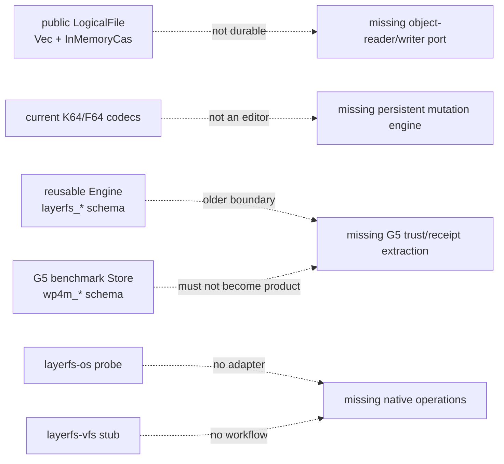
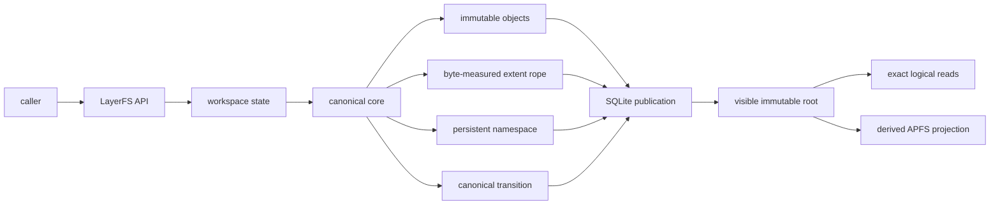
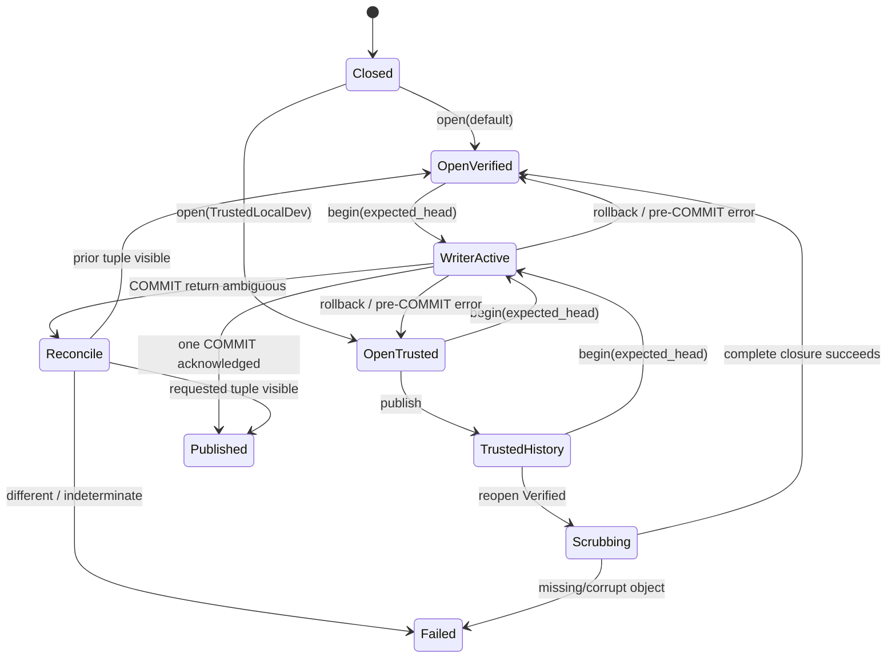
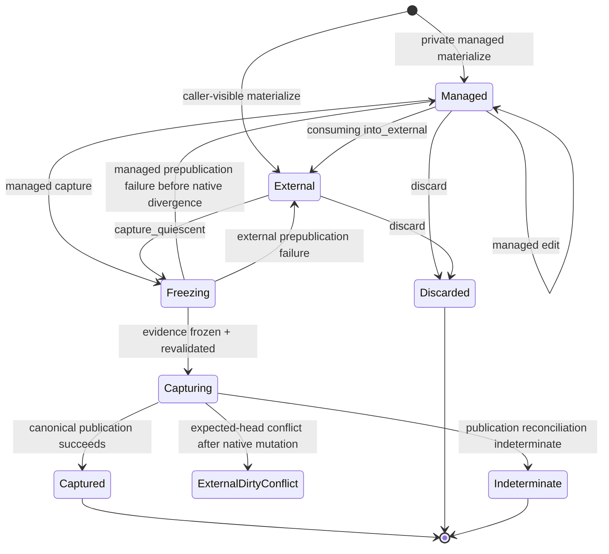
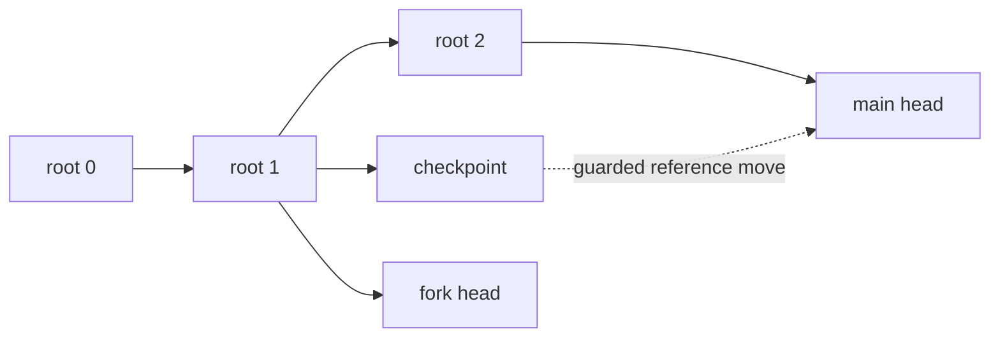
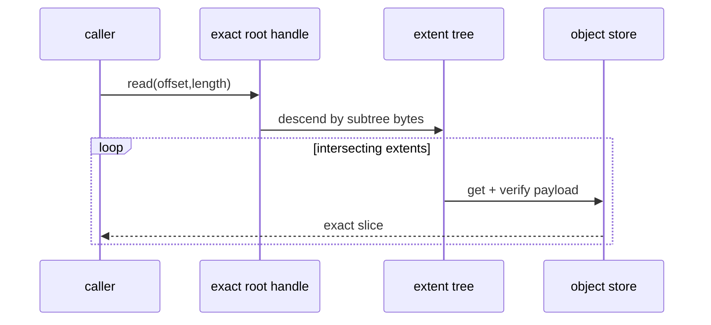
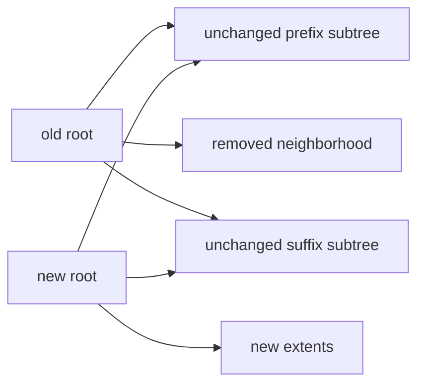
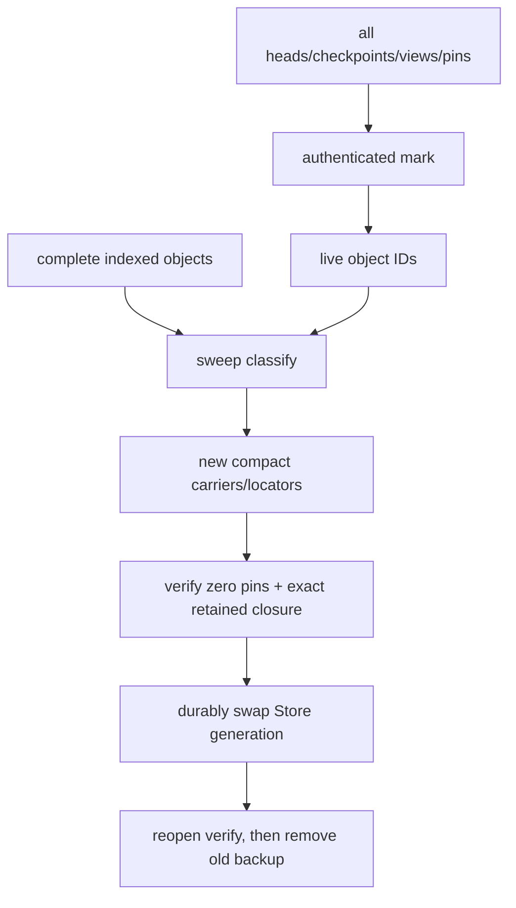

# Apple/APFS PoC operation workflows

Status: **historical implementation contract**. Current product routes and
evidence are recorded in `poc/13` and `poc/17`.

This document defines the smallest end-to-end operation model for the Apple
PoC. It deliberately separates current reusable source, qualified
benchmark-private mechanisms, and proposed product code.

## 1. Evidence boundary

| Class | Repository fact | Consequence for the PoC |
|---|---|---|
| Reusable now | `layerfs-core` has canonical objects, FastCDC, in-memory CAS, flat `LogicalFile`, K64/F64 codecs, COW directories, and deltas | reuse invariants and codecs where compatible |
| Reusable now | `layerfs-engine::Engine` has SQLite object/root/delta rows and `begin_capture` / `commit_root` | extract/extend; do not copy its transaction logic |
| Stub | `layerfs-vfs` exports only `COMPONENT` | every workspace/materialize/capture API below is new |
| Stub | `layerfs-sdk` exports only `COMPONENT` | public workflow is not implemented |
| Probe only | `layerfs-os` observes the host/APFS environment | APFS mutation/publication primitives are not a reusable adapter yet |
| Qualified mechanism | G5-1 trust and G5-2/3 projection/history behavior passed narrow benchmark contracts | use as design input, not product readiness |
| Deferred/unsupported | rollback freshness, hostile filesystem, device/FIFO/socket kinds, online/in-place GC, arbitrary external-edit range discovery, production extraction | fail closed or document fallback |
| Proposed | persistent byte-measured B+ extent rope | differential tests must prove it before performance claims |
| Proposed | persistent byte-bounded B+ namespace trees | ordered-map/path differential tests must prove them before scale claims |
| Alternative research | CD32–64 canonical sequence tree | expected locality only; arbitrary count-changing edits retain suffix-linear worst case |

Primary authority links:

- [`../crates/layerfs-core/src/content/mod.rs`](../crates/layerfs-core/src/content/mod.rs)
- [`../crates/layerfs-core/src/content/persistence.rs`](../crates/layerfs-core/src/content/persistence.rs)
- [`../crates/layerfs-engine/src/lib.rs`](../crates/layerfs-engine/src/lib.rs)
- [`../implementation-detail/phase-4/experiments/g5-terminal/v1/LIMITATIONS-v1.md`](../implementation-detail/phase-4/experiments/g5-terminal/v1/LIMITATIONS-v1.md)
- [`../implementation-detail/phase-4/g6/g6-canonical-extent-tree-spec.md`](../implementation-detail/phase-4/g6/g6-canonical-extent-tree-spec.md)

The exact ordinary-workspace command contract is in
[`08-native-workspace-and-shell-verification.md`](08-native-workspace-and-shell-verification.md).
The universal driver boundary and Apple completeness profile are in
[`09-portability-and-apple-completeness.md`](09-portability-and-apple-completeness.md).

### 1.1 Real integration gap



The PoC must connect one canonical core to the reusable `layerfs_*` engine.
It must not call `LogicalFile` with an `InMemoryCas` from VFS, nor preserve a
second `wp4m_*` product schema. The current engine serializes a single
`rusqlite::Connection` behind a `Mutex`, configures a 100 ms SQLite busy
timeout, and exposes no production exact/latest projector.

Minimum extraction order:

```text
1. persistent authenticated node/payload reader + append-only writer
2. extent mutation over those ports
3. expected-head object/delta/root publication in reusable Engine
4. OS-neutral VFS ProjectionDriver port + in-memory/fault conformance driver
5. AppleDriver implementation confined to layerfs-os
6. VFS logical read/edit/materialize/capture over that one engine/driver port
7. thin SDK wired through layerfs_os::native_platform()
```

## 2. PoC authority model



```text
canonical root visibility  = authoritative
logical read of pinned root = authoritative
native APFS projection      = disposable derived cache
live projection authority   = process-lifetime cache provenance, never root authority
```

### 2.1 Required identity separation

| Identity | Role | May change when equal bytes are reached through another edit history? |
|---|---|---:|
| `ObjectId` | canonical bytes of one immutable object | no |
| `FileStateRoot` | operational B+ rope root | **yes**, if the PoC selects hard-local history-shaped balancing |
| `ContentDigest` | optional semantic digest of complete logical bytes | no |
| filesystem root | canonical namespace/inode graph root | follows operational children |
| checkpoint/head | mutable engine reference to immutable root | yes |
| native identity | opaque driver-issued `NativeObjectToken` plus VFS receipt/provenance fields | unrelated to canonical equality |

**Required architecture decision before code:** hard-local B+ updates and
history-independent `same bytes -> same FileStateRoot` cannot both be assumed.
The minimal PoC chooses an operational history-shaped `FileStateRoot` and an
optional/lazy `ContentDigest`. If history-independent roots remain mandatory,
the CD32–64 design is the available candidate, with its explicit suffix-linear
fallback.

## 3. State machines

### 3.1 Store and publication



### 3.2 Workspace lifecycle



Rules:

- `capture` and `discard` are mutually exclusive terminal successes;
- `Drop` may perform best-effort cleanup but is never the only cleanup API;
- an indeterminate workspace cannot redispatch its mutation;
- `ExternalDirtyConflict` may be inspected, discarded/rebuilt, or explicitly
  full-scanned against a freshly selected base; never silently replayed;
- readers pin one exact root and never switch mid-read;
- a managed edit log is bounded and store/workspace/generation bound.

### 3.3 Retained roots



Payload and mapping objects are immutable. Moving or adding a head does not
copy payload bytes. No object becomes deletable merely because it is not
reachable from the current main head.

## 4. Notation and required bounds

| Symbol | Meaning |
|---|---|
| `F` | complete logical file bytes |
| `E` | extent/chunk-occurrence count |
| `H` | extent-tree height |
| `R` | requested/returned bytes |
| `B` | inserted or replacement bytes |
| `X` | deleted bytes |
| `K` | replacement chunks/extents and replacement-tree nodes created from `B` |
| `D` | entries in one directory |
| `V` | retained revision roots |
| `U` | objects in the retained-root union |

Hard PoC resource targets:

```text
single owned buffer              <= 1 MiB
CDC chunk buffer                 <= 32 KiB
decoded rope path                O(H * node_size)
pending managed edit descriptors bounded (initially <= 64)
writer transactions/publication  exactly 1
publication COMMITs              exactly 1
reader root switches             0
terminal owned temps/descriptors 0
```

## 5. Operation matrix

| Operation | Preconditions | Authoritative postcondition | Target time | Extra resident memory | Retained-history effect |
|---|---|---|---:|---:|---|
| create file | valid path; parent exists; no conflicting name | new file/namespace/root in one publication | `Theta(F + E)` | bounded stream + nodes | old root remains |
| point read | exact pinned root; valid offset | exact requested byte/EOF | `O(log E + R)` | `O(H*node + R_page)` | none |
| range read | exact pinned root; valid range | exact ordered bytes | `O(log E + C_R + R)` | bounded output | none |
| full read/reconstruct | exact pinned root | all exact bytes | `Theta(F + E)` | bounded stream | none |
| same-size overwrite | managed exact range | new file/root | `O(B + K + log E)` | bounded CDC + path | new local path/payload objects |
| insert/longer replace | managed exact splice | new file/root, suffix logically reused | `O(B + K + log E)` with operational rope | bounded CDC + path | new local path/payload objects |
| delete/shorter replace | managed exact splice | new file/root | `O(K + log E)` plus boundary payload | bounded CDC + path | removed objects retained by old roots |
| append | exact EOF | new file/root | `O(B + K + log E)` | bounded | new right path |
| truncate | exact new EOF | new file/root | `O(K + log E)` | bounded | truncated objects remain in old roots |
| namespace create/remove | expected namespace root | new namespace root | direct-parent `O(log D_p)` plus bounded `O(log I)` inode paths | bounded parent/inode paths | old namespace retained |
| rename | exact source/destination and expected root | one atomic namespace transition | `O(log D_src + log D_dst)` plus bounded `O(log I)` paths | at most two directory trees | old names retained in old roots |
| symlink create/replace | exact link-target bytes; valid parent | new canonical symlink/namespace root | target bytes + parent `O(log D)` + bounded `O(log I)` paths | bounded | old target retained in old roots |
| hard link/unlink | existing canonical InodeId or exact native inode group | shared inode topology/link count exact | directory path + `O(log I)` inode-table path | bounded | prior topology retained in old root |
| checkpoint | existing immutable root | new retained ref | zero object-byte copies; `O(log refs)` DB | `O(1)` | increases retention set |
| fork | existing immutable root | independent guarded head | zero object-byte copies; `O(log refs)` DB | `O(1)` | increases retention set |
| rollback | known retained root + expected token | guarded head move only | zero object-byte copies; `O(log refs)` DB | `O(1)` | no bytes rewritten |
| materialize | exact root + destination admission | exact derived native tree or typed failure | route dependent | <=1 MiB stream | none |
| managed capture | bounded exact edit evidence | new canonical root | changed-work target | bounded | new root retained if referenced |
| external capture | cooperative exclusive destination; no authoritative change journal | exact complete namespace root | paths + digest pass + changed-file CDC pass + prior digest + metadata/hard-link scratch | bounded stream/scratch | new root retained if referenced |
| mark retained union | complete retention authority | exact live set | `Theta(U + edges)` | bounded/external mark | none |
| compaction | mark complete + readers fenced | equivalent objects under new locators | `Theta(surviving moved bytes)` | bounded buffers | no identity/root change |

`C_R` is the number of intersecting extents. The fixture remains small for fast
execution, but namespace unit/model tests force multi-level split, borrow,
merge, rename and root-collapse behavior. The old complete-`BTreeMap` clone is
not used by the new product mutation path.

## 6. Create and full replace

```text
pre:
  path canonical and within limits
  expected head/root matches
  input stream is exclusive for the operation

algorithm:
  stream input -> frozen FastCDC 8/16/32 KiB
  for each chunk:
      encode canonical Bytes
      hash ObjectId
      put-if-absent; authenticate any incumbent
      append extent occurrence
  build bounded rope nodes bottom-up
  path-copy file inode + namespace ancestors
  construct canonical delta
  publish with one expected-head transaction + one COMMIT

post:
  visible root is old or complete new; never partial
  every retained old root still reconstructs
  all new/fetched/incumbent object identities verified

fail:
  input/read/CDC/hash/object error -> no publication
  expected-head mismatch -> rollback + Conflict
  COMMIT ambiguity -> fresh requested/prior/different reconciliation
```

```text
time   = Theta(F + E + namespace changed path)
memory = O(CDC window + one chunk + partial rope levels + SQL batch)
```

No design can make complete creation, full read, or complete native export
sublinear in bytes that must be consumed or emitted.

## 7. Point, range, and full reads



Preconditions:

- resolve `latest` once, then pin that exact root;
- reject `offset + length` overflow and out-of-range requests;
- validate role, level, subtree byte totals, extent bounds, and object identity;
- never trust SQLite key, native file, or cached node without canonical check.

Results:

| Path | Result | Failure |
|---|---|---|
| point | one byte or EOF according to API | invalid range, missing/corrupt object |
| range | exactly requested intersection | no silent short read |
| full | exactly `F` bytes and exact EOF | any gap/overlap/length mismatch |

Current `LogicalFile::read_range` is `O(E + R)` near EOF because it walks a
flat vector. K64/F64 benchmark code uses cumulative children. The PoC must test
the proposed rope's `O(log E + C_R + R)` behavior structurally; documentation
does not prove it.

## 8. Managed same-size overwrite

```text
pre:
  workspace Active
  exact base root/generation
  0 <= start <= end <= F
  replacement length == end-start

algorithm:
  split rope at start and end
  FastCDC only the exact replacement bytes
  authenticate/store replacement payload objects
  build replacement extent rope
  join unchanged left + replacement + unchanged right
  rebalance/path-copy root-to-leaf paths
  path-copy namespace and publish

post:
  logical length unchanged
  unchanged subtrees/payload identities reused
  native projection may clone + same-offset patch
```

Typed outcomes:

| Condition | Outcome |
|---|---|
| replacement input/CDC/CAS succeeds | local operational-rope edit |
| replacement input/CDC/CAS fails | exact typed failure; prior root remains authoritative |
| expected root changed | `Conflict` before publication |
| changed bytes equal old bytes | `NoChange`; zero publication COMMIT |

## 9. Managed insert, delete, and variable-length replace

### 9.1 Coordinate contract

```text
splice = (old_start, old_length, replacement_stream)
new_length = F - old_length + replacement_length
```

All arithmetic is checked at each managed call against the current pending
native/file state. Calls are ordered and their coordinates are sequential:
an insert changes the coordinate space seen by the next call. Each call writes
exact replacement bytes to a private owned spool, records an ordinal descriptor,
and applies the same mutation to the native workspace. Capture replays
descriptors in call order against the base root. It never sorts operations
across calls; coalescing is allowed only after mechanical equivalence proof.

### 9.2 Rope algorithm

```text
left, tail      = split_at_byte(root, start_in_current_state)
removed, right = split_at_byte(tail, delete_length)
middle         = build_rope(CAS(FastCDC(exact replacement bytes)))
result         = concat(left, middle, right)
validate measures and stream equality
publish result
```



| Representation | Count-changing mapping bound | PoC disposition |
|---|---:|---|
| current K64/F64 | `Theta(E_suffix)` | insufficient |
| proposed CD32–64 | expected local; hard `Theta(E_suffix)` fallback | viable if canonical same-bytes/same-root is mandatory |
| operational measured B+ rope | `O(log E)` structural split/concat/path-copy | selected PoC target if history-shaped operational roots are accepted |

The rope removes positional suffix renumbering. It does **not** remove:

- reading/hashing replacement bytes;
- FastCDC work over exact replacement bytes;
- native contiguous-file suffix movement;
- complete scan when an arbitrary external editor supplies no changed ranges.

## 10. Append and truncate

| Operation | Algorithm | Target cost | Native fast route |
|---|---|---:|---|
| append `B` | build replacement from exact input; join at EOF; path-copy right spine | `O(B + K + log E)` | full native fallback in PoC v1 |
| truncate to `L` | split at `L`; publish left | `O(log E + boundary)` | full native fallback in PoC v1 |
| extend with zeros | explicit semantic decision: zero payload or sparse logical extent | at least logical metadata + requested semantics | no implicit APFS hole in canonical identity |

Truncation never deletes payload objects synchronously. Old roots continue to
reference the prior suffix.

## 11. Reconstruction and exact comparison

```text
reconstruct(root, sink):
  pin root
  validate root totals
  iterate extents in order
  fetch + verify each payload object
  validate extent source_offset + length
  stream exact slice to bounded sink
  require emitted bytes == root.logical_length
```

| Use | Complexity | Required equality |
|---|---:|---|
| correctness oracle | `Theta(F+E)` | bytes, kinds, names, metadata policy |
| complete native file | `Theta(F+E)` | length + digest/stream comparison |
| historical reconstruction | `Theta(F_revision+E_revision)` | pinned historical root |
| range reconstruction | `O(log E+C_R+R)` | exact requested bytes |

## 12. Materialization

Materialization is derived from an already committed root. It never modifies
canonical authority.

```text
admit exact root and exclusive destination
classify receipt: Exact / Refreshable / Unknown / Replaced
diff canonical parent->target when authorized
for every changed path:
    choose ordinary stream or optional APFS accelerator
    construct private temp
    verify complete target
    sync + atomic replace + directory sync
verify whole requested tree
install derived live projection authority in memory
```

Route details and restart behavior are specified in
[`04-apple-apfs-materialization-and-recovery.md`](04-apple-apfs-materialization-and-recovery.md).

## 13. Capture: the critical information boundary

### 13.1 Managed exact-range edits

```mermaid
sequenceDiagram
    participant A as caller
    participant W as workspace
    participant C as core
    participant E as engine
    A->>W: write/insert/delete/truncate with exact ranges
    W->>W: spool bytes + record ordered descriptor + mutate native state
    A->>W: capture(expected base)
    W->>W: freeze evidence; close mutation admission
    W->>C: replay exact splices in call order from owned spool
    C-->>W: new objects/root/delta
    W->>E: one expected-head publication
```

Target cost is changed work plus affected tree paths. The edit evidence must be
captured at the operation boundary, not reconstructed from timestamps. The
initial descriptor cap is 64; the caller must capture or discard before another
managed operation. A process crash does not resume the spool: cleanup removes
owned residue and subsequent capture uses the Unknown/full-workspace route.

### 13.2 Arbitrary external-editor changes

The filesystem ordinarily provides advisory path-level metadata events, not a
complete, trusted namespace delta or byte-range delta. Given only:

```text
old bytes, new file identity/size, "path changed"
```

an algorithm must inspect all possibly changed bytes to distinguish two files
that are equal everywhere except an unreported position. Therefore:

```text
exact arbitrary-editor capture without write interception:
  namespace work = Theta(total supported paths)
  digest pass      = Theta(unique current regular-file bytes)
  changed CDC pass = Theta(changed current regular-file bytes)
  prior digest     = Theta(uncached prior bytes compared)
  metadata/grouping = Theta(metadata bytes) + indexed O(paths log paths)
```

APFS clones, FSEvents, inode numbers, mtimes, and file length do not prove the
complete changed-path set or missing byte ranges. They are hints, not canonical
change evidence.

Minimal correct fallback:

```text
freeze exclusive workspace
enumerate the complete supported namespace with no-follow `lstat` semantics
open every regular file without following symlinks
read each symlink target with `readlink`; never traverse it during capture
group hard-linked regular files into one canonical InodeId; reject unsupported special kinds with typed errors
record and revalidate native identity
stream each complete file through FastCDC/CAS
construct and compare exact canonical file/directory state
publish the complete resulting namespace once
```

Do not narrow paths or claim `O(B)` external capture until a VFS/write-
interception layer owns every write or another complete watcher/snapshot
authority is qualified with overflow forcing a whole-tree scan.

### 13.3 Real Bash/editor session

The PoC must execute a real native child rather than simulate external edits in
the evaluator:

```text
materialize exact root into owned ordinary APFS directory
materialize ExternalWorkspace directly or consume ManagedWorkspace into it
spawn /bin/bash with cwd = workspace path
allow ordinary read/open/write/create/remove/rename/chmod/symlink operations
wait for the shell and every registered child/process-group member to exit
fsync/close test-owned writers; acquire exclusive capture admission
perform the complete external capture algorithm above
publish one new root or leave the prior root authoritative
reopen into a different directory and run read-only shell assertions again
```

The shell command must not daemonize or leave an unregistered background
writer. Capture rejects LayerFS-owned/registered writers; the caller separately
attests cooperative quiescence for the scan. A nonzero shell exit is recorded
and does not automatically publish. The dirty ordinary workspace remains
inspectable until explicit capture or discard.

## 14. Reopen and integrity

| Reopen state | Required action | Cost |
|---|---|---:|
| clean Verified store | validate profile/store metadata and required authority | operation dependent |
| TrustedLocalDev same Store lifetime | may use only authorized trusted edit-base scope | touched work |
| process reopened after trusted history in Verified | complete reachable scrub before Verified authority | `Theta(reachable bytes/objects)` |
| missing/mismatched profile/witness | fail typed or explicit complete normalization | no inferred success |
| absent/stale live projection authority | invalidate derived cache; canonical root remains usable | full verification/rebuild |

`TrustedLocalDev` is not login authentication. It assumes a controlled local
store for selected eager-closure work only. Every fetched/new/incumbent object
identity, expected-head check, receipt decode, transaction, COMMIT, and
reconciliation remains mandatory.

## 15. Checkpoint, fork, and rollback

```text
checkpoint(name, root, expected_ref_version): CAS reference update
fork(name, root): create independent head/workspace record
rollback(head, target_root, expected_head, expected_ref_version): reference move
```

Preconditions:

- target root exists and is authenticated;
- caller supplies expected current head/token;
- no active mutable workspace is silently retargeted;
- retained root is not inferred from native projection state.

Postconditions:

- no payload/mapping bytes copied;
- existing readers remain pinned to their old roots;
- new latest readers resolve the moved head;
- rollback emits an explicit transition/audit record if required by the final
  authority model.

**PoC limitation:** rollback freshness is not protected against restoration of
an older complete SQLite database without external monotonic authority. Detecting
that attack requires an external counter/log/service and is out of scope.

## 16. Long history

| Question | Required implementation behavior |
|---|---|
| does current read enumerate revisions? | no |
| does exact historical read use current head? | no; pin requested root |
| are unchanged subtrees shared? | yes by immutable identity |
| can current-root reachability authorize deletion? | no |
| does each edit authenticate all retained roots? | no |
| may a Verified reopen scrub its retained authority set? | yes, according to frozen retention/integrity policy |

Target operations:

```text
latest lookup                 index lookup, independent of V
exact historical lookup      index lookup + exact local read
append retained root         O(1) metadata plus edit publication
retained-union accounting    Theta(V + U)
```

G5-3's 1,000-revision, 1 MiB same-size workload proves only that narrow
benchmark mechanism. It does not prove random multi-file history or the PoC's
new offline compaction path.

## 17. Compaction and garbage collection

### 17.1 PoC decision

```text
implement: authenticated retained-union mark plus offline sibling-Store
           copy, verify, atomic generation swap and crash recovery
defer:     concurrent, in-place and background GC
```

This is the minimal nonthrowaway reclamation path. SQLite `VACUUM` alone is not
LayerFS graph GC and must not be presented as such.

### 17.2 Required offline protocol



```text
mark       Theta(U + strong edges)
sweep      Theta(indexed objects)
compact    Theta(surviving bytes moved)
memory     bounded/external mark representation
```

No edit, rollback, or truncate waits for destructive reclamation. Compaction is
an explicit maintenance command and returns `Busy` when any reader, writer,
workspace or unresolved recovery pin exists.

## 18. Concurrency

```text
canonical writer: 1 ordered SQLite writer
readers:          immutable exact-root readers
workspace writer: 1 owner for the PoC
native projector: synchronous in minimal PoC
```

Rules:

- reader opened before COMMIT may finish on old root;
- reader opened after acknowledged COMMIT sees new root;
- `latest` resolves once, then becomes exact;
- old-root data may not be reclaimed while pinned;
- writer checks expected head inside its transaction;
- no automatic retry after conflict or ambiguous COMMIT;
- an optional async projector may use one in-flight and one pending request,
  but it is not required for PoC correctness.

## 19. Error and fallback precedence

| Event | Required response | Publication allowed? |
|---|---|:---:|
| invalid path/range/arithmetic | typed validation error | no |
| missing/corrupt/wrong-role object | typed integrity error | no |
| replacement FastCDC/CAS/tree construction fails | exact typed failure; unchanged prior root remains authoritative | no |
| external change authority unavailable | complete namespace walk and regular-file scan | yes after exact reconstruction |
| expected head differs | conflict; rollback | no |
| SQLite Busy/Locked | return typed; no hidden retry | no unless fresh reconciliation proves requested |
| object ID occupied by unequal bytes | immutable conflict | no |
| failure before COMMIT | rollback; owned-temp cleanup | no |
| COMMIT return ambiguous | fresh reconcile requested/prior/different | never redispatch blindly |
| projection failure | canonical root remains authoritative | canonical publication unaffected |
| cleanup failure after primary error | report primary + cleanup status | no new publication |

## 20. Correctness-first verification

### 20.1 Fast loop per change

```text
1. touched unit tests
2. deterministic Vec<u8> / directory-tree differential oracle
3. structural validation of every new/reused reachable node
4. rustfmt + cargo check for touched crates
```

### 20.2 Required operation corpus

| File cases | Namespace/history cases | Failure cases |
|---|---|---|
| empty, 1 byte, chunk/node boundaries | create/remove/rename | malformed/wrong-role object |
| overwrite early/middle/late | checkpoint/fork/rollback | expected-head conflict |
| shorter/equal/longer replace | old reader across COMMIT | short read/write |
| insert/delete/append/truncate | 100–1,000 mixed revisions | before/during/after COMMIT |
| full and range reconstruction | retained-union accounting | projection temp/rename/sync faults |
| managed and Bash/external capture | reopen Verified after Trusted | cleanup failure |
| executable mode + symlink target | multi-level namespace split/merge | live/background writer blocks capture |

### 20.3 Differential invariant

After every deterministic operation:

```text
reference Vec<u8>/tree bytes == streamed candidate bytes
all root totals and child measures exact
all reachable ObjectIds recompute
all retained historical roots still reconstruct
new publication transaction/COMMIT count is 1/1 or no-op 0/0
terminal temporary/descriptor/transaction ownership is zero
```

### 20.4 Compact real-workspace integrated check

```text
fixture:
  20 files; 3 directories; empty file; executable shell script; symlink;
  1 KiB; 64 KiB; 1 MiB files

operations:
  create -> range read -> same-size overwrite -> insert -> delete
  append -> truncate -> rename -> checkpoint -> fork -> rollback
  materialize -> execute /bin/bash read assertions
  bash redirect/dd/mkdir/mv/rm/chmod/symlink -> full-scan capture
  reopen into a fresh directory -> execute the script/read assertions again
  managed capture -> exact compare
```

Report correctness, structural counters, bytes read/written, transactions,
COMMITs, temp residue, and complete wall. This is a smoke benchmark, not a
latency gate.

## 21. Product-readiness gates

| Gate | PASS condition |
|---|---|
| authority | one canonical object/root/publication path; no benchmark-only semantic copy |
| file model | chosen identity tradeoff recorded; all differential operations pass |
| reads | exact root pinning and no mid-read switch |
| edits | managed same/count-changing operations match oracle and structural bounds |
| external capture | full-scan limitation labeled and exact |
| publication | expected head, 1 transaction, 1 COMMIT, fresh reconciliation |
| history | retained roots reconstruct; latest operations do not enumerate history |
| fork/rollback | guarded reference-only transitions; freshness limitation explicit |
| resources | bounded buffers/paths/descriptors; terminal ownership zero |
| GC | offline compaction preserves the complete retained union and survives every copy/swap crash boundary; online GC remains absent |
| native | canonical correctness independent of APFS accelerator; driver metadata uses only the universal typed extension envelope |
| verification | fast structural corpus plus one compact real-workspace/Bash run passes |
