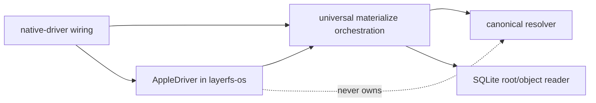
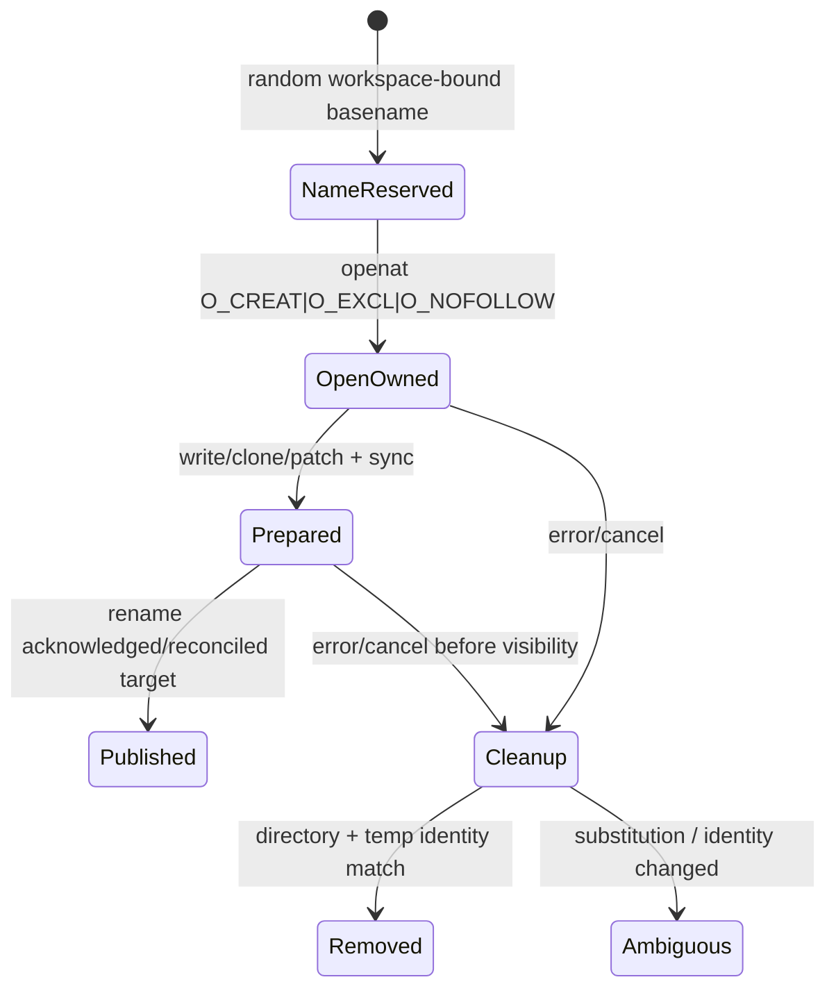
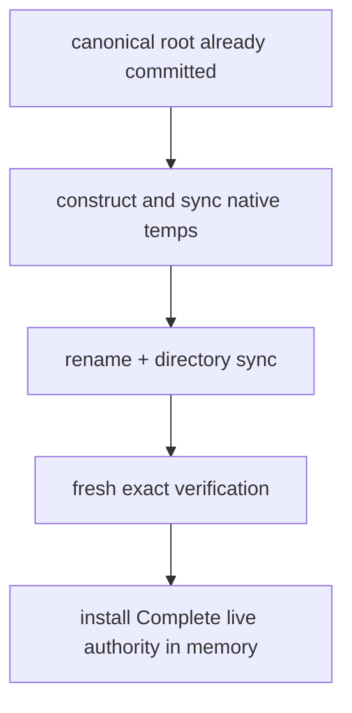

# Apple/APFS materialization and recovery

Status: **historical AppleWorkspaceV1 target contract; now implemented within
the limitations recorded by `poc/17`; APFS accelerators remain optional and
noncanonical**

## 1. Historical preimplementation source truth

| Surface | Actual repository state | What may be reused |
|---|---|---|
| `layerfs-os` | host/APFS probe only | environment and case-behavior observation |
| `layerfs-vfs` | `COMPONENT` constant only | nothing operational |
| `layerfs-sdk` | `COMPONENT` constant only | nothing operational |
| reusable engine | one `Mutex<Connection>`, 100 ms SQLite busy timeout, Phase-4A `layerfs_*` schema, atomic `Capture` API | object/root/delta invariants and transaction skeleton |
| G5 canonical Store | benchmark-private `wp4m_*` schema and trust/receipt logic in `phase4_create_edit_benchmark.rs` | design evidence only; not the reusable engine |
| G5 APFS path | low-level `openat`, `fclonefileat`, `pwrite`, `fsync`, `renameatx_np`, reconciliation, and mailbox in `phase4_g3_materialization.rs` | extract small product functions; never call the benchmark binary |
| G5 claim | 250,000-byte warm exact/sparse mechanism; full fallback; one process-lifetime seed | narrow evidence, not cold/large/product readiness |

The product path must bridge the real schema/API gap. Copying the 9,864-line
benchmark binary into VFS would produce a second storage engine and is a FAIL.

## 2. Minimal PoC scope

```text
supported canonical kinds: regular files + directories + symbolic links
first qualified host:      recorded current arm64 macOS host
qualified workspace:       local writable APFS, LayerFS-created/current-user,
                           same-volume staging, runtime capability/name profile
authoritative state:       immutable LayerFS root in SQLite
native state:              dedicated derived workspace directory
publication:               synchronous materialize() call
accelerator:               optional whole-file APFS clone + exact patch
fallback:                  bounded-buffer authenticated reconstruction
```

Feature disposition for AppleWorkspaceV1:

| Feature | Response |
|---|---|
| symbolic link | materialize exact stored target with no-follow operations; capture through pinned-parent `fstatat`/`readlinkat` no-follow semantics; never traverse as a regular file |
| hard link | materialize multiple names from one canonical `InodeId` with `linkat`; capture native inode groups into one checked canonical link topology |
| device/FIFO/socket | reject with typed `UnsupportedNativeKind` |
| xattr/ACL/resource fork/BSD flags | round-trip through typed canonical `apple.*` metadata extensions; fail typed when exact representation/application is unavailable |
| hostile same-UID mutation of private staging | no security claim; require exclusive workspace ownership |
| cross-volume atomic replacement | reject/fallback to a same-volume destination requirement |
| whole-directory atomic visibility | deliberately unimplemented; individual path replacement only; future qualified sibling-tree `RENAME_SWAP` must document old CWD/open-handle behavior |
| power-loss stable-media proof | unavailable unless a separate `F_FULLFSYNC` policy is implemented and tested |
| background worker/persistent queue | omitted |
| arbitrary APFS range clone | unavailable in the used public interface |
| native middle insert/delete speed guarantee | full fallback first; optional shift route later |

## 3. File and module boundary

```text
crates/layerfs-vfs/src/
  driver.rs      universal ProjectionDriver port and capability/result types
  materialize.rs route choice + tree orchestration; no platform syscall
  workspace.rs   lifecycle + live authority/provenance + managed spool
  capture.rs     managed evidence / external full-workspace-scan boundary
  external.rs    ordinary path exposure and quiescence

crates/layerfs-os/src/
  lib.rs                 native_platform() and platform selection only
  apple/mod.rs           ProjectionDriver implementation
  apple/workspace.rs     no-follow enumeration/identity/link operations
  apple/apfs.rs          clone/sparse/replace/sync
  apple/metadata.rs      mode/xattr/ACL/flags/resource fork
  apple/ffi.rs           only reviewed unsafe syscall boundary
```

Do not create a route registry, clone-provider hierarchy, or per-syscall trait.
One neutral `ProjectionDriver` port plus one focused Apple implementation is the
required abstraction. Core, engine and VFS contain no Apple syscall or platform
`cfg`; future operating systems add only a `layerfs-os` driver.

`layerfs-os` currently has `#![forbid(unsafe_code)]`; required libc calls cannot
compile under that non-overridable lint. The PoC changes the crate to
`#![deny(unsafe_code)]` and allows unsafe only inside one reviewed
`apple::ffi` submodule. Public adapter functions remain safe and own checked
path/C-string conversion, partial I/O loops, errno mapping, and descriptor
lifetime.

Dependency rule:



`layerfs-os` implements the VFS port over descriptors, names, bytes, modes,
links, metadata and native identities. It never computes `ObjectId`, chooses
roots, or owns publication authority. VFS never calls a platform syscall
directly.

## 4. Minimal types

Names are provisional; fields are the contract.

```text
NativeObjectToken { opaque driver-issued process-lifetime identity }
NativeHardLinkKey { opaque scan-lifetime equality/hash key }

NativeSnapshot {
    token: NativeObjectToken
    kind: regular | directory | symlink
    length: u64
    stable_link_count: u64
    supported_mode_and_flags
    change_observation
}

LiveProjectionAuthority {
    store_instance
    exact_root
    destination_directory_identity
    workspace_generation
    publication_serial
    managed_mutation_serial
    completion_state: Complete
}

ProjectionSeed {
    parent_root
    destination_file_identity
    length
    exact managed-mutation serial
    live descriptor / reopen class
}

ChangedRange {
    start: u64
    end: u64
}

ManagedEditDescriptor {
    ordinal
    path
    start_in_current_state
    delete_len
    replacement_spool_offset
    replacement_len
    replacement_digest
}
```

Live-authority rules:

- authority is process-lifetime VFS state, not persisted engine metadata and
  not canonical object identity;
- authority is useful only with the same uninterrupted Store instance,
  destination directory identity, workspace generation, mutation serial, and
  exact root;
- authority is invalidated before admitting an uncontrolled writer;
- native inode/mtime/size never become canonical equality;
- missing authority after reopen makes the native cache Unknown, not the root
  invalid.
- managed replacement bytes live in a LayerFS-owned private process/workspace
  spool; descriptors are replayed in call order and are never reordered across
  count-changing operations;
- crash/reopen discards owned spool residue and classifies the native workspace
  Unknown; it never resumes unauthenticated pending replacement bytes.

## 5. Workspace admission

```mermaid
flowchart TD
    P[path] --> O[open directory O_DIRECTORY|O_NOFOLLOW]
    O --> S[fstat directory; record device/inode]
    S --> L{exclusive workspace lease acquired?}
    L -- no --> E[Busy / DestinationInUse]
    L -- yes --> R{live authority classification}
    R --> EX[Exact live-managed]
    R --> RE[Refreshable live-managed parent]
    R --> UN[Unknown/reopened/replaced]
```

Minimal lease implementation:

- one process owns one move-only `ManagedWorkspace` or `ExternalWorkspace` handle;
- one lock file in a LayerFS-owned control directory;
- no second writer/projector admitted;
- external editors are allowed only through `ExternalWorkspace`; managed fast
  seed/range authority is absent there;
- materialize/capture closes writer admission and obtains exclusive state.
- only `ExternalWorkspace` exposes an ordinary APFS path; caller-known
  destinations are External from creation and may be passed as `cwd` to tools;
- the PoC shell runner owns a child process group, forbids daemonized survivors,
  waits/reaps it, and admits capture only after quiescence;
- capture while a LayerFS-owned/registered child or writer lease remains active
  returns `WorkspaceBusy`; unregistered/hostile writers are explicitly outside
  the cooperative capture claim.

This is a coordination contract, not hostile same-UID security. Strong
multi-process/adversarial fencing is a later VFS/mount problem.

### 5.1 Native-name representability

Canonical sibling names are byte-distinct, but an APFS destination may be
case-insensitive and normalization-insensitive. Before mutating the visible
destination, materialize each sibling set into a private same-volume staging
directory with no-replace creation, then enumerate and compare exact returned
name bytes/kinds. Embedded NUL, separator, unrepresentable name, or two
canonical siblings that collide natively return typed `NativeNameCollision` or
`NativeNameUnsupported`. Never overwrite one sibling with another, and never
install Complete live authority unless final native enumeration exactly matches
the canonical target. Qualify available case-sensitive and case-insensitive
APFS classes separately; otherwise state the supported class.

## 6. Route table

| Route | Admission | Native algorithm | Complete work | First-PoC status |
|---|---|---|---:|---|
| `ExactNoop` | uninterrupted live exact authority + exclusive managed generation/mutation serial | no file write; verify live binding | bounded authority/path work; no full content read under live authority | required |
| `ColdFull` | empty/dedicated destination or explicit unknown rebuild | stream target to fresh temp | `Theta(F+E)` | required correctness path |
| `FullFallback` | invalid seed, different length, unknown external mutation, clone failure | fresh temp + complete stream | `Theta(F+E)` | required |
| `CloneExact` | live managed exact seed; opened volume reports clone capability | one `fclonefileat` call to a nonexistent staging name | physical/latency complexity unspecified; output metadata must be reconciled | optional |
| `CloneSparsePatch` | live managed parent seed, same length, exact bounded changed ranges | clone then `pwrite` target ranges | application work `O(B+ranges)` | optional priority |
| `TailAppend` | exact live seed; splice at EOF | clone + append | application work `Theta(B)` | deferred until required fallback passes |
| `TailTruncate` | exact live seed; deletion through EOF | clone + `ftruncate` | application work `O(1)` plus sync | deferred until required fallback passes |
| `CloneShiftPatch` | exact seed; middle count change; suffix below explicit cap | overlap-safe suffix shift + patch | `Theta(F-P+B)` read/write | defer until fallback works |

APFS acceleration changes native cache construction only. The canonical root,
object IDs, tree shape, and reconstructed bytes must be identical with every
accelerator disabled.

## 7. Seed authority and the whole-file hash trap

G5 corrected its exact/sparse complexity because admission hashed the complete
seed:

```text
exact clone complete path       Theta(F)
sparse clone+patch complete path Theta(F+B)
```

The PoC has two honest classes:

| Seed class | Admission | Claim |
|---|---|---|
| live managed | prior materialize created it; descriptor/root/generation/mutation serial remain under exclusive LayerFS ownership | no complete seed hash required; fast same-process route |
| reopened or externally mutable | no exact byte-range/no-mutation authority | complete verify/hash before reuse, or `FullFallback`; `Theta(F)` |

Do not use size, inode, mtime, APFS clone success, or an old process record alone to
turn a reopened seed into live authority. A future persistent integrity
mechanism needs its own threat model and proof.

## 8. Ordinary correctness path

This path is mandatory before clone code.

```mermaid
sequenceDiagram
    participant V as VFS
    participant E as exact root reader
    participant O as macOS adapter
    participant D as destination directory
    V->>E: stream exact file root
    V->>O: create private temp (O_EXCL, O_NOFOLLOW)
    loop bounded chunks
        E-->>O: verified bytes <= 1 MiB
        O->>O: write all; reject zero/short/error
    end
    O->>O: replace exact mode/metadata set; restrictive flags last
    O->>O: one final file sync covering content + metadata
    V->>O: verify construction proof + identity/length/metadata
    O->>D: atomic rename relative to pinned directory fd
    O->>D: fsync directory
    V->>D: fresh reopen + verify target
    V->>V: install Complete live authority in memory
```

Preconditions:

- destination is empty or owned by uninterrupted live workspace authority;
- directory descriptor identity remains stable;
- target canonical root and file root are pinned;
- no unsupported native kind exists in target;
- enough disk space/quota is not assumed; errors are typed.

Postconditions:

- each successfully replaced path contains exactly target bytes and metadata;
- after final exact verification and live-authority installation, the complete
  destination matches target;
- before that authority, a crash may leave a mixed derived tree, never a mixed
  canonical root;
- every private temp is removed or retained for exact restart reconciliation.

## 9. Clone-then-patch path

```text
pre:
  source descriptor is an admitted live-managed seed
  opened workspace reports clone capability and same-volume staging
  parent length == target length
  changed ranges are exact, sorted, disjoint, bounded

algorithm:
  fclonefileat(seed_fd, pinned_directory_fd, fresh_temp_name)
  reopen temp O_RDWR|O_NOFOLLOW
  verify temp is distinct inode, regular, expected length
  for each changed range:
      resolve exact target bytes from canonical root
      pwrite_all at same offset
  remove seed-only xattrs; replace exact ACL/xattr/mode/flag set
  one final file sync
  verify target using managed construction proof
  rename + directory fsync + fresh reopen

fail:
  any accelerator failure before rename -> discard owned clone
  optional fallback starts from a newly created temp, never partial clone
  any possibly visible rename result -> reconcile before another publication
```

Required counters:

```text
clone calls/results/errno
patch ranges and logical bytes
canonical payload/mapping bytes authenticated
write calls/short writes/errors
data + metadata + directory sync calls
rename dispatch/result
temp create/remove/residue
requested/selected/fallback route
```

## 10. Count-changing native files

Logical B+ rope insert/delete can be local while a native contiguous file is
not.

```text
insert B bytes at P in F-byte native file:
  surviving suffix S = F-P
  overlap-safe shift transfer = S read + S write
  patch = B write
  logical application transfer = 2*S+B
```

First-PoC policy:

```text
all length-changing native routes: FullFallback
tail append/truncate acceleration: deferred until fallback PoC passes
canonical visibility: immediate after root COMMIT, independent of fallback
```

Add `CloneShiftPatch` only after ordinary fallback and recovery pass. It cannot
improve Big-O over suffix length and must use bounded overlap-safe copies:

- grow: extend first, copy high-to-low, then patch;
- shrink: copy low-to-high, patch, then truncate;
- validate every offset and partial read/write;
- cap admitted suffix work so a full stream can remain the simpler route.

## 11. Tree materialization order

```text
1. pin exact target root and optional uninterrupted live parent authority
2. derive changed path plan only from live parent/target canonical roots;
   otherwise build a complete plan for an empty dedicated destination
3. create required directories in canonical order
4. construct/replace regular files using private temps
5. apply file and directory metadata
6. remove only paths proven owned by the uninterrupted live authority
7. verify exact tree: no missing, extra, wrong-kind, wrong-byte paths
8. sync affected directories bottom-up
9. install Complete live authority in process memory
```

Unknown nonempty destination policy:

```text
default: reject DestinationNotEmptyUnknown
explicit destructive rebuild: not in first PoC
```

This prevents a correctness tool from deleting unrelated user files. Incremental
deletion is allowed only for paths listed by uninterrupted live authority and
revalidated against expected native identity/kind.

## 12. Temporary-file ownership



Ownership record:

```text
pinned directory device/inode
temp basename
temp device/inode from live descriptor
request nonce + store/workspace generation
target root
publication phase
```

Rules:

- create one mode-0700 same-volume LayerFS-owned staging directory;
- operate relative to a pinned directory descriptor;
- create with `O_EXCL|O_NOFOLLOW`, mode `0600`;
- retain the temp descriptor until publication/finalization;
- before pathname cleanup, validate directory and temp device/inode;
- if the name now refers to another object, do not unlink it; report
  `AmbiguousCleanup`;
- no `remove_dir_all` over user-controlled or unresolved paths;
- staging directory contains only LayerFS-owned PoC temps;
- do not put private ownership xattrs on temp files: retained G5 benchmark
  helpers leak `com.layerfs.projection-owner-v1` through rename and must not be
  extracted unchanged;
- exact metadata reconciliation verifies no private LayerFS marker exists on a
  published inode;
- exact hostile same-UID substitution between stat and unlink remains outside
  the PoC threat model.

## 13. Destination identity and races

| Race | Minimal defense | Remaining limitation |
|---|---|---|
| path replaced by symlink before open | pinned-parent handle + one basename + no-follow-any semantics + opened-handle identity comparison | hostile writer can still race outside cooperative profile |
| destination changes during preparation | exclusive workspace lease + revalidate expected identity before rename | hostile writer can violate cooperative lease |
| directory itself replaced | pinned directory fd + device/inode validation | path may no longer name pinned directory; return typed |
| temp substituted | retained fd + device/inode check before cleanup/publication | same-UID adversarial race not qualified |
| seed changes after admission | managed exclusive generation/mutation serial | reopened/external seed requires full verify |

macOS does not provide a general `rename-if-destination-inode-equals-X`
primitive here. Therefore exact correctness with arbitrary concurrent external
writers requires stronger VFS fencing. The ordinary-directory PoC uses
exclusive cooperative ownership and fails closed on observed violations.

## 14. Durability sequence

Per-file publication:

```text
write/clone/patch private temp
    -> replace exact metadata; restrictive flags last
    -> one final file sync
    -> atomic renameatx_np(..., RENAME_NOFOLLOW_ANY)
    -> fsync(parent directory)
    -> fresh reopen/stat/verification
```

Durability labels:

| Claim | PoC status |
|---|---|
| `ProcessCrashReconciled` | required/tested |
| `HostCrashOrdered` | requested/achieved class recorded; host protocol tested |
| `DeviceFlushRequested` | optional explicit `F_FULLFSYNC`; best effort, typed outcome |
| `PowerLossQualified` | excluded without hardware qualification |
| SQLite rollback-journal `DELETE`, `synchronous=FULL`, `temp_store=FILE`, `mmap_size=0` | required |
| one canonical writer transaction/COMMIT | required |
| old-or-new destination-path lookup after one-file rename | required; already-open descriptors remain attached to the prior inode |
| whole-directory atomicity | deliberately unimplemented; possible future qualified sibling-tree `RENAME_SWAP` route |

If `F_FULLFSYNC` is later required, make it one explicit macOS durability
policy with typed unsupported/error behavior. Do not silently call ordinary
`fsync` and retain a stronger label.

## 15. Publication and live-authority ordering



Canonical and native publication are intentionally not one atomic transaction.
The native tree is a derived cache. Failure at any native step leaves the
canonical root valid and makes projection state incomplete/unknown until
reconciled.

PoC v1 performs zero projection SQLite writer transactions and persists no
projection intent or receipt. Complete live authority is installed only after
directory sync and fresh verification. Process restart loses that authority;
the destination reopens as `Unknown` and must be fully verified into new live
authority or rebuilt.

## 16. Crash and restart matrix

| Cut/failure | Canonical authority | Native state | Required restart action |
|---|---|---|---|
| before temp create | committed root | prior tree | no action; no durable intent exists |
| during temp write/clone/patch | committed root | prior tree + owned temp | validate ownership; remove temp |
| after temp sync, before rename | committed root | prior tree + complete temp | validate ownership and remove; do not resume after restart |
| rename error, prior still visible | committed root | prior tree | remove owned temp; report original error |
| rename ACK lost | committed root | prior or target file | fresh open/stat/verify requested and prior |
| after rename, before directory sync | committed root | target may be visible, durability ambiguous | sync/reopen; classify or return `AmbiguousDurability` |
| after directory sync, before live authority | committed root | target native state | restart classifies Unknown; full verify or rebuild |
| mid multi-file tree | committed root | mixed derived tree, no Complete authority | classify Incomplete; rebuild dedicated destination after restart |
| after Complete live authority | committed root | expected exact tree | usable only in uninterrupted managed process/generation |
| cleanup identity mismatch | committed root | unknown foreign name | never unlink; report residue/ambiguous cleanup |

One-file reconciliation vocabulary:

```text
RequestedVisible
PriorVisible
DifferentVisible
Ambiguous
```

No second rename/publication occurs after a potentially visible first attempt
until fresh reconciliation proves `PriorVisible`.

## 17. Reopen algorithm

```text
open store and validate SQLite profile
acquire workspace lease
open destination directory nofollow; bind device/inode
scan the private LayerFS staging directory only
for each workspace-pattern temp:
    validate control-directory ownership and exact temp identity/kind
    remove exact owned residue or retain/report ambiguity
classify native destination Unknown (live authority never survives process)
do not admit fast seed from metadata alone
full verify on demand into new live authority, or rebuild a fresh destination
return canonical root handle even if native cache is Unknown
```

Verified reopen after Trusted history separately performs the required
canonical closure scrub. Native verification cannot substitute for it.

## 18. Exact/latest scheduling

### 18.1 Minimal decision

```text
first PoC materialize() is synchronous
therefore: no mailbox, worker, condition variable, or coalescing is needed
```

This is the preferred minimalist path. The caller requests an exact root and
gets exact completion or an error.

### 18.2 If asynchronous projection is later required

Retain only the already qualified shape:

```text
one in-flight request
one pending request
Exact(root): never coalesced
LatestFollowing(root): newer compatible target may replace pending latest
```

On activation, recompute the canonical diff from the worker's actual current
root to the surviving target. Never concatenate range coordinates from skipped
revisions.

Conservation:

```text
submitted = started + coalesced + rejected
started   = published + failed + stale + cancelled
in_flight <= 1
pending   <= 1
projection SQLite writer tx/COMMIT = 0/0
```

## 19. Busy/Locked and concurrency behavior

Current reusable `Engine` configures a 100 ms SQLite `busy_timeout`; that is
current source, not the selected PoC policy. PoC v1 sets the runtime busy
timeout to zero:

```text
after SQLite returns Busy/Locked:
  map to typed Busy/Locked
  rollback any active transaction when conclusive
  perform no SQLite/internal/application retry or hidden wait
  if COMMIT outcome may be ambiguous, fresh reconcile first
```

| Participant | SQLite behavior |
|---|---|
| canonical writer | one ordered write connection/transaction |
| logical readers | exact pinned immutable roots; separate bounded read connections only if implemented |
| synchronous projector | read-only/query-only; zero canonical writes |
| external editor | no SQLite authority |

Busy policy is runtime behavior, not a canonical mapping/profile preimage.
The current reusable engine serializes through one `Mutex<Connection>` and is
not evidence for a read connection pool. Add reader connections only after the
correctness-first PoC needs concurrency; do not introduce a pool speculatively.

## 20. Space, memory, CPU, and I/O bounds

| Route | CPU | Logical read | Logical write | Extra memory | Temporary storage |
|---|---:|---:|---:|---:|---:|
| cold/full stream | `Theta(F+E)` verification/copy | `Theta(F)` | `Theta(F)` | <=1 MiB + tree path | up to target file |
| exact no-op live | live-authority/path work | no payload | 0 | bounded | 0 |
| clone exact live | syscall/metadata | unavailable physical | 0 application payload | bounded | cloned logical file |
| sparse patch live | verification of touched canonical objects | `Theta(B)` canonical | `Theta(B)` patch | <=1 MiB + path | cloned logical file |
| reopened clone admission | `Theta(F)` hash unless full fallback | `Theta(F)` | route dependent | bounded | cloned/full temp |
| tail append accelerator (deferred) | `Theta(B)` | `Theta(B)` canonical | `Theta(B)` | bounded | cloned logical file |
| middle shift | `Theta(F-P+B)` | suffix + B | suffix + B | <=1 MiB | cloned logical file |

APFS clone logical/apparent/allocated sizes and physical I/O must remain
separate. Clone success does not prove zero physical work.

## 21. Correctness-first test plan

### 21.1 Fast component tests

| Area | Required cases |
|---|---|
| open/admission | missing, file-not-dir, symlink, replaced directory, case behavior |
| native names | case-only siblings, normalization-equivalent siblings, unsupported bytes, exact enumeration |
| inode topology | hard-link create/materialize/capture/update/unlink; checked link count; host inode never canonical |
| metadata | executable mode, xattr, resource fork, exact ordered ACL and supported BSD flags exact round trip |
| restrictive destination | exact no-op may retain `UF_IMMUTABLE`/`UF_APPEND`; every non-no-op returns `NativeProtected` before mutation and preserves the destination exactly |
| temp | unique create, short write, descriptor identity, substitution, cleanup failure |
| ordinary stream | empty/1 byte/64 KiB/1 MiB, wrong length/digest, no source-sized buffer |
| clone patch | zero/one/multiple ranges, early/middle/late, clone failure fresh fallback |
| length-changing | append/truncate/insert/delete use required full fallback; tail accelerator deferred |
| publication | rename failure/lost ACK, directory-sync failure, fresh reconciliation |
| restart | residue before/after rename, lost live authority, mixed tree, foreign temp name |
| concurrency | destination lease conflict, old root reader across canonical COMMIT |
| external capture | complete supported namespace walk and exact scan of every regular file |
| shell compatibility | actual `/bin/bash` child reads/executes ordinary files, changes content/mode/paths/symlinks, exits, then full-scan capture and fresh rematerialization pass |

### 21.2 Compact real-workspace end-to-end run

```text
directory:
  3 directories
  20 regular files
  1 executable shell script
  1 symbolic link
  1 hard link
  sizes: 0 B, 1 KiB, 64 KiB, 1 MiB

sequence:
  create canonical root
  cold materialize
  execute `/bin/bash ./scripts/check.sh` with the workspace as `cwd`
  exact range compare
  managed same-size overwrite -> capture -> sparse rematerialize
  managed insert/delete/append/truncate -> capture -> required full fallback
  materialize/convert to ExternalWorkspace; run Bash commands that redirect/overwrite/append,
    create a directory/file, rename one path, delete one path, chmod a script,
    create/read a symlink and hard link, and set one deterministic xattr
  wait/reap all children; assert capture is rejected while a controlled
    background writer remains and succeeds after it exits
  full-workspace capture of the Bash changes
  checkpoint + fork + guarded rollback
  reopen and reconstruct exact roots
  rematerialize into a fresh directory and rerun read-only shell assertions
  one additional arbitrary external edit -> full-workspace-scan capture
  inject one pre-rename and one lost-ACK fault
```

Record:

```text
exact tree equality after each completed operation
requested/selected/fallback route
canonical objects/nodes read, authenticated, created, reused
native logical bytes read/written
transactions and COMMITs
sync/rename/reconciliation calls
maximum buffer and descriptor count
temporary residue at terminal
complete wall (`30 s` gross diagnostic stop for this fixture; not a product SLO)
```

## 22. Product-readiness gates

| Gate | PASS |
|---|---|
| extraction | no production call into benchmark binaries or `wp4m_*` schema |
| ordinary path | accelerator-disabled materialization is exact and bounded-memory |
| canonical independence | clone/stream/patch acceleration choice never changes the canonical result; Apple metadata enters only through the universal typed metadata envelope |
| admission | fast seed only from live managed authority; reopen limitation explicit |
| native safety | nofollow, exclusive temp, pinned directory, exact identity checks |
| durability | data/metadata/directory sync order and labels are honest |
| recovery | every fault leaves canonical authority valid; residue reconciled or explicitly reported |
| tree result | Complete live authority only after exact full-tree verification; never persisted in v1 |
| external edits | full-workspace-scan limitation preserved; no event/metadata shortcut |
| resources | <=1 MiB owned buffer; bounded descriptors; zero terminal temps |
| concurrency | one writer; Busy/Locked exact; no hidden retry |
| minimalism | synchronous exact materialize first; mailbox absent unless demanded |
| validation | fast component corpus and one compact real-workspace/Bash end-to-end run pass |
