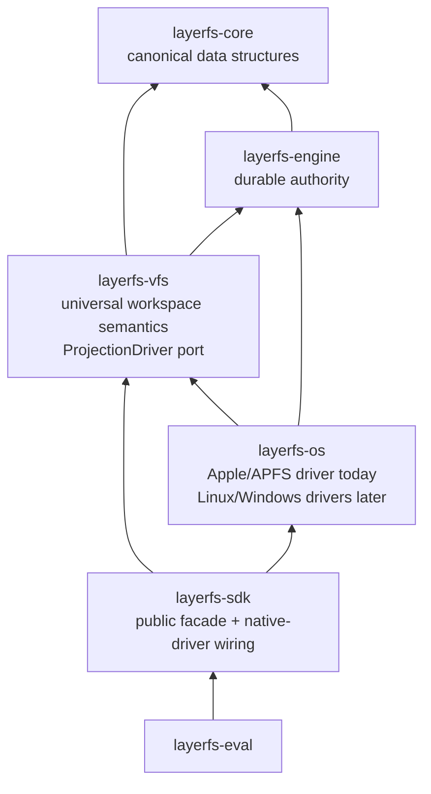

# Universal projection boundary and Apple/APFS completeness

Status: **required architectural boundary and Apple PoC exit contract**.

## 1. AppleWorkspaceV1 and the “99% complete” display label

“99% complete” is not permission for a 1% correctness failure rate. Every
operation in the frozen Apple developer-workspace profile must pass exactly.

The PoC may display “99% complete for AppleWorkspaceV1” only when:

```text
100% canonical/data-structure correctness gates pass
100% supported native operation gates pass
100% crash/reopen/durability gates pass
100% Bash/editor/build-tool workflow gates pass
100% retained-history/offline-compaction gates pass

remaining work is limited to production packaging, signing/notarization,
mount integration, performance tuning, unsupported special-file classes,
and qualification outside the frozen Apple developer-workspace profile
```

No missing algorithm, benchmark-only product path, placeholder crate, or
Apple API above `layerfs-os` is compatible with that disposition.

## 2. Universal dependency law



Hard rule:

```text
layerfs-core   contains no host paths, syscalls, libc, APFS, inode numbers,
               platform cfg, projection state or native metadata behavior

layerfs-engine contains no host projection code or platform retry semantics

layerfs-vfs    contains no Apple/Linux/Windows syscall and no cfg(target_os);
               it owns universal state machines and calls ProjectionDriver

layerfs-os     is the only crate changed to add or refine an OS projection
               implementation

layerfs-sdk    requests layerfs_os::native_platform(); no platform branch
```

Repository checks fail if `layerfs-core`, `layerfs-engine`, `layerfs-vfs`, or
`layerfs-sdk` contains `APFS`, `fclonefileat`, `renameatx_np`, `libc`, an Apple
inode identity, or a platform-specific `cfg` outside test descriptions.

## 3. Universal projection-driver port

The port belongs to `layerfs-vfs`, because VFS owns the operation semantics and
must not depend on a concrete OS implementation. `layerfs-os` implements it.

```text
ProjectionDriver
  open_workspace(path, policy) -> ProjectionWorkspace

ProjectionWorkspace
  capabilities()                         // opened volume/workspace scoped
  root_directory() -> DirectoryHandle
  enumerate_at(parent) -> bounded iterator + '_
  open_directory_at(parent, name, expected) -> DirectoryHandle
  open_regular_at(parent, name, expected) -> RegularFileHandle
  read_link_at(parent, name, expected, sink)
  read_metadata_at(parent, name, expected, sink)
  create_directory_at(...)
  create_empty_temp_at(staging_parent) -> OwnedTempHandle
  clone_to_new_temp(source_handle, staging_parent) -> OwnedTempHandle | Unsupported
  create_symlink_at(...)
  create_regular_hard_link_at(...)
  write_all_at(temp, offset, bounded_source)
  set_len(temp, length)
  replace_metadata_exact(temp_or_entry, metadata_stream)
  verify_metadata_exact(...)
  sync_file(temp, requested_durability) -> achieved_durability
  atomic_replace(owned_temp_consumed, parent, name, expected) -> ReplaceOutcome
  unlink_regular_at / unlink_symlink_at / remove_directory_at
  sync_directory(directory_handle) -> achieved_durability
  stat_handle / stat_entry_at / revalidate_entry
```

Handles and identities are opaque driver-issued types. Every nested operation
is relative to a pinned parent handle plus one validated basename; the VFS must
not enumerate a path and later reopen a multi-component string. Native errors
distinguish `Unsupported`, `ConfirmedBeforeVisibility`, `Conflict`,
`VisibilityAmbiguous`, and `DurabilityAmbiguous`.

The exact Rust signatures may be simplified during implementation, but the
semantic operations and dependency direction may not change. A driver returns
typed `Unsupported` for a missing capability; VFS selects a correct fallback.

Durable Store-generation installation is not projection policy. Engine defines
one second narrow port implemented by `layerfs-os`:

```text
StoreGenerationDriver
  sync_file
  atomic_replace_selector
  sync_directory
  classify_native_durability_error
```

Compaction uses immutable generation files plus a checksummed `CURRENT`
selector; it does not perform a crash-vulnerable pair of database renames.

## 4. Driver capability model

```text
WorkspaceCapabilities {
  atomic_file_replace
  rename_exclusive / rename_swap
  file_clone
  hard_links
  symbolic_links
  executable_mode
  extended_attributes
  access_control_lists
  user_bsd_flags
  name_comparison_and_preservation_profile
  runtime_name_and_path_limits
  requested/achieved durability classes
  stable_file_id / change_generation
  sparse_allocation_observation           // diagnostic only
}
```

Capabilities control route selection, never canonical correctness. Examples:

| Capability | Available | Unavailable |
|---|---|---|
| file clone | clone + patch may run | complete authenticated stream |
| hard links | materialize shared `InodeId` as native hard links | typed unsupported; never duplicate silently |
| xattrs/ACL | round-trip canonical metadata | typed unsupported when required metadata exists |
| requested durability | report the achieved class | fail or label weaker class; never claim stable media implicitly |

## 5. Universal canonical inode and namespace model

```text
NamespaceRootV1
├── root_directory_inode: InodeId
├── inode_table_root: persistent B+ tree<InodeId, InodeRecordObjectId>
└── profile_id

DirectoryStateV1
└── entries: persistent B+ tree<CanonicalName, InodeId>

InodeRecordV1
├── kind: Regular | Directory | Symlink
├── namespace_ref_count
├── metadata root
└── content target
    ├── Regular -> FileStateRoot
    ├── Directory -> DirectoryStateRoot
    └── Symlink -> SymlinkStateRoot
```

Multiple directory entries may reference one `InodeId`. Updating that inode
changes every hard-linked path in the new root while old roots remain immutable.
Host device/inode numbers are observation keys during one native scan, never
canonical IDs.

New `InodeId`s are Store-scoped operational topology identities allocated under
the one expected-head publication. Managed rename and hard-link operations
preserve the ID. `ManagedWorkspace::into_external` retains an opaque
`NativeHardLinkKey -> InodeId` topology map but invalidates content/range and
no-mutation authority. During capture, an exactly surviving native group reuses
its prior ID; a new group allocates; on split the surviving original group keeps
the ID and every new group allocates; on merge the current native target group's
prior ID survives and the other IDs disappear. Without a live topology map,
every current complete group receives a new ID. Thus a reopened no-op external
capture may produce a new operational namespace root while preserving exact
bytes, metadata and hard-link topology.

Allocation is frozen, not implicit:

```text
InodeId = BLAKE3("layerfs/inode-id/v1\0" || StoreId[32]
                 || next_inode_serial:u64be)
```

`StoreId` and `next_inode_serial` are private durable engine metadata. Allocation
and increment occur in the same expected-head transaction; compaction preserves
both exactly and aborted transactions consume no durable serial.

## 6. Portable and platform-extension metadata

Core stores metadata without interpreting host syscalls:

```text
MetadataEntryV1
├── domain + key
├── required_for_exact_projection = true
└── value_file_root: mode-free FileStateRoot

portable metadata entries:
  permission mode
  canonical mtime seconds/nanoseconds
```

Apple driver domains:

```text
apple.xattr/<raw name>       exact extended-attribute value root
apple.acl                    exact ordered ACL value root
apple.bsd-flags              supported user flag value root
```

`com.apple.FinderInfo` and `com.apple.ResourceFork` appear once in the xattr
map; no duplicate domains own them. Large values use the same mode-free file
rope. Another OS must project required extensions exactly or return typed
`UnrepresentableMetadata`; it may not silently ignore them and call the result
Complete.

## 7. Frozen AppleWorkspaceV1 ordinary-workspace profile

### Required

| Area | Required behavior |
|---|---|
| regular files | empty through multi-level extent trees; read/write/append/truncate/replace |
| directories | empty, nested, persistent lookup/create/remove/rename |
| symbolic links | exact target bytes; no-follow capture/materialization |
| hard links | regular-file groups wholly inside workspace; stable native link count equals observed aliases; one canonical `InodeId` |
| modes | read/write/executable bits round-trip |
| metadata | xattrs, resource forks, supported BSD flags and ACLs round-trip when included in the frozen supported Apple metadata set; unsupported system/internal metadata returns typed failure |
| names | exact canonical UTF-8 oracle plus APFS case/normalization collision preflight |
| native access | Bash, editors, compilers, mmap-capable tools and ordinary file descriptors |
| concurrency | registered native tools may use normal locks; caller attests cooperative quiescence; unregistered writers excluded |
| durability | `ProcessCrashReconciled` required; private temp, file sync, atomic file replace, directory sync and fresh reconciliation; stronger requested/achieved class reported explicitly |
| projection | cold stream, exact no-op, APFS clone, same-offset patch, length-changing fallback |
| history | exact retained roots, hard-link topology, fork, rollback and direct old-root reads |
| maintenance | explicit offline mark-copy-verify-swap compaction |

### Explicit exclusions from the 99% profile

| Exclusion | Reason |
|---|---|
| device nodes, sockets and FIFOs as retained canonical content | transient/privileged special-file semantics |
| capturing a live database/application-consistent multi-file snapshot | requires application or filesystem snapshot cooperation |
| hostile same-UID mutation defeating cooperative lease | production security boundary |
| transparent arbitrary-write interception | later mount/FSKit integration |
| online/background GC | offline path provides correctness without concurrent reclamation risk |
| power-loss hardware guarantee beyond the qualified sync class | requires device/filesystem-specific proof |

These exclusions must return typed errors or remain native transient artifacts;
they are never silently represented as regular files.

## 8. Apple driver layout

```text
crates/layerfs-os/src/
├── lib.rs                 native_platform() and platform selection only
├── apple/
│   ├── mod.rs             AppleDriver implementation
│   ├── workspace.rs       no-follow enumeration, handles, identity, links
│   ├── apfs.rs            clone, sparse observation, atomic replace, sync
│   ├── metadata.rs        mode, xattr, ACL, flags, resource fork
│   ├── store.rs           Store-generation selector replace/sync
│   └── ffi.rs             only reviewed unsafe syscall boundary
└── tests/
    └── apple_driver.rs    driver conformance on observed APFS
```

Future layout:

```text
crates/layerfs-os/src/linux/...     implements the same VFS port
crates/layerfs-os/src/windows/...   implements the same VFS port
```

No `layerfs-core`, `layerfs-engine`, `layerfs-vfs`, or SDK semantic change is
permitted merely to add those drivers. A genuinely new capability may extend
the neutral driver interface only after all existing drivers receive an exact
fallback or typed unsupported behavior.

FSKit is a separate future frontend, not merely another Rust driver module. The
current Apple framework uses a user-space app extension, entitlement,
Info.plist/mount workflow and currently documents only `FSUnaryFileSystem`.
Adding it should reuse core/engine/VFS semantics, but it necessarily adds
Apple-specific packaging/bridge targets outside the ordinary projection driver.

## 9. Driver conformance suite

One reusable VFS conformance test runs against any driver:

```text
create/read/range/full stream
mkdir/rmdir and deep rename
symlink and hard-link topology
same-size write, append, truncate and complete replace
mode and metadata round trip
no-follow substitution failures
case/normalization collision behavior
clone supported/unsupported fallback parity
short read/write, no-space, permission and sync failure
atomic replace lost-ack reconciliation
registered writer blocks capture; unregistered writer is outside profile
crash/reopen and residue cleanup
```

The Apple-specific suite adds APFS clone, xattr/ACL/resource-fork, file flags,
hard-link and allocation observations. Core/VFS tests use an in-memory/fault
driver to prove platform independence without requiring APFS.

## 10. AppleWorkspaceV1 exact exit ledger

- [ ] no Apple import, syscall, `cfg(target_os)`, or native inode in core/engine/vfs;
- [ ] `ProjectionDriver` conformance passes with the in-memory/fault driver;
- [ ] `AppleDriver` passes the same conformance suite on observed APFS;
- [ ] ordinary files/directories/symlinks/hard links and supported metadata round-trip;
- [ ] Bash/editor/build-tool workflows pass through ordinary APFS paths;
- [ ] every canonical file/namespace/inode/metadata structure passes differential and corruption tests;
- [ ] crash/reopen/publication/native-replace/compaction matrices pass;
- [ ] G5 trust, one-COMMIT, reconciliation and resource invariants remain;
- [ ] no benchmark binary owns product semantics;
- [ ] one compact real-workspace measurement passes; no production SLO inferred;
- [ ] only packaging, signing, mount integration, tuning and explicit exclusions remain.
